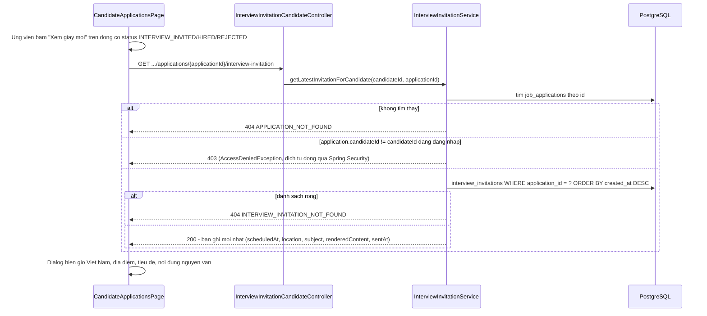

# Ứng viên xem giấy mời phỏng vấn (`feat/candidate-view-invitation`)

Nhánh rẽ từ `feat/fr-c03-notification` (E2, đã xong — thông báo web + email), xếp chồng trên
`feat/fr-h07-pipeline` (E1, đã xong — HR soạn và gửi giấy mời phỏng vấn).

## 1. Mục tiêu

E1 đã cho HR soạn ngày giờ, địa điểm, nội dung giấy mời phỏng vấn và lưu nguyên văn vào DB. Nhưng
phía ứng viên (FR-U03, đã làm ở nhánh khác) chỉ hiện được badge "Đã mời phỏng vấn" và một dòng
timeline đổi trạng thái — không có chỗ nào đọc lại nội dung giấy mời đó. SRS định nghĩa trạng thái
này là "Đã mời phỏng vấn (**có lịch hẹn**)", nên thiếu chỗ xem lịch hẹn là một lỗ hổng chức năng:
trạng thái tồn tại nhưng vô nghĩa với người cần đọc nó nhất. Nhánh này đóng lỗ hổng đó bằng một
endpoint đọc và một dialog xem trên trang "Đơn ứng tuyển của tôi", không đụng tới bất kỳ phần nào
khác của hệ thống thông báo hay pipeline HR.

## 2. Các file đã tạo/sửa

### Backend

| File | Vai trò |
|---|---|
| `interviewinvitation/InterviewInvitationCandidateController.java` (mới) | `GET /api/candidates/applications/{applicationId}/interview-invitation` |
| `interviewinvitation/dto/CandidateInterviewInvitationResponse.java` (mới) | Response 5 field: `scheduledAt`, `location`, `subject`, `renderedContent`, `sentAt` |
| `common/exception/InterviewInvitationNotFoundException.java` (mới) | 404 khi đơn chưa có giấy mời nào |
| `interviewinvitation/InterviewInvitationService.java` (sửa) | Thêm `getLatestInvitationForCandidate` |
| `common/exception/GlobalExceptionHandler.java` (sửa) | Đăng ký handler cho exception mới ở trên |

### Frontend

| File | Vai trò |
|---|---|
| `features/interviewinvitation/types.ts` (sửa) | Thêm `CandidateInterviewInvitation` |
| `features/interviewinvitation/api.ts` (sửa) | `getInterviewInvitationRequest` |
| `features/interviewinvitation/queries.ts` (sửa) | `useInterviewInvitationQuery` (chỉ fetch khi dialog mở) |
| `pages/CandidateApplicationsPage.tsx` (sửa) | Nút "Xem giấy mời" + dialog `InterviewInvitationDetailDialog` |

## 3. Luồng chính

Điểm quan trọng: bước đọc **không lọc theo `application.status` hiện tại**. Một đơn đã chuyển tiếp
sang `HIRED` hoặc `REJECTED` (sau khi từng ở `INTERVIEW_INVITED`) vẫn đọc lại được giấy mời cũ —
ứng viên phỏng vấn xong, HR chốt kết quả, họ vẫn cần đối chiếu lại lịch hẹn đã nhận. Vì vậy nút "Xem
giấy mời" trên frontend cũng hiện ở cả ba trạng thái đó (`INVITATION_VIEWABLE_STATUSES`), không chỉ
riêng `INTERVIEW_INVITED`.

## 4. Quyết định thiết kế

**(a) Kiểm quyền sở hữu trả 403, không dùng pattern 404-che-giấu như `ApplicationService`**

- Đã chọn: `getLatestInvitationForCandidate` tách hai bước — đơn không tồn tại → 404
  (`ApplicationNotFoundException`); đơn tồn tại nhưng `application.candidateId` khác người đang
  đăng nhập → 403 (ném `AccessDeniedException`, được `ExceptionTranslationFilter` của Spring
  Security dịch tự động, không cần đăng ký handler mới — tái dùng đúng cơ chế đã dùng ở
  `InterviewInvitationService.loadOwnedApplication` phía HR).
- Lựa chọn khác: dùng `findByIdAndCandidateId` rồi trả 404 giống hệt nhau cho cả hai trường hợp —
  đúng pattern `ApplicationService.getMyApplicationHistory`/`withdraw` đang dùng, che giấu sự tồn
  tại của đơn người khác.
- Vì sao chọn 403 riêng thay vì theo pattern có sẵn: `applicationId` là UUID v4 không đoán được, và
  người gọi bắt buộc đã đăng nhập (JWT hợp lệ) — việc lộ "đơn này tồn tại nhưng không phải của bạn"
  không cho kẻ tấn công thông tin khai thác được gì hơn một UUID ngẫu nhiên họ đã có sẵn trong tay.
  Đổi lại, tách 403/404 giúp debug rõ ràng hơn ở phía client (biết ngay là sai quyền hay sai id).
- **Hai pattern cùng tồn tại trong dự án, khác nhau có chủ đích, không phải một chỗ quên đồng bộ
  với chỗ kia**: `ApplicationService.getMyApplicationHistory`/`withdraw` (404-che-giấu) và
  `InterviewInvitationService.getLatestInvitationForCandidate` (403 riêng) bảo vệ cùng một loại tài
  nguyên (`job_applications`) nhưng chọn khác nhau — người đọc code sau này không nên "sửa cho đồng
  bộ" một trong hai mà không đọc lại lý do này trước.

**(b) Không lọc theo `application.status` — đơn đã `HIRED`/`REJECTED` vẫn đọc được giấy mời cũ**

- Đã chọn: `getLatestInvitationForCandidate` chỉ kiểm sở hữu, không kiểm trạng thái đơn. Frontend
  hiện nút "Xem giấy mời" ở cả ba trạng thái `INTERVIEW_INVITED`/`HIRED`/`REJECTED`
  (`INVITATION_VIEWABLE_STATUSES` trong `CandidateApplicationsPage.tsx`).
- Lựa chọn khác (bản đầu tiên trước khi sửa theo review): chỉ hiện nút khi
  `status === 'INTERVIEW_INVITED'`.
- Vì sao: phỏng vấn xong, HR chốt kết quả cuối (`HIRED` hoặc `REJECTED`) — ứng viên vẫn cần xem lại
  lịch hẹn cũ để đối chiếu, không có lý do nghiệp vụ nào để khoá quyền xem lại một khi đã xem được
  một lần. Bản đầu tiên giới hạn chỉ `INTERVIEW_INVITED` là quá chặt so với dữ liệu backend cho
  phép — hai test `get_applicationHiredAfterInterview_stillReturnsInvitation`/
  `get_applicationRejectedAfterInterview_stillReturnsInvitation` xác nhận backend không lọc theo
  status, nên frontend giới hạn thêm là sai phạm vi, không phải thận trọng thừa.
- Hệ quả cho dialog: một đơn `REJECTED` **có thể** đã bị từ chối thẳng từ `PENDING` (chưa từng qua
  phỏng vấn) — trường hợp đó gọi API vẫn trả 404 `INTERVIEW_INVITATION_NOT_FOUND` dù nút "Xem giấy
  mời" đang hiện (vì status là `REJECTED`, nằm trong `INVITATION_VIEWABLE_STATUSES`). Dialog phân
  biệt rõ: 404 → câu trung tính "Đơn này chưa có giấy mời phỏng vấn." (`text-ink-muted`, không phải
  màu lỗi); lỗi khác (mạng, 500...) → câu cảnh báo đỏ như thông thường.

**(c) Response chỉ 5 field, không tái dùng `InterviewInvitationResponse` (bản HR)**

- Đã chọn: DTO riêng `CandidateInterviewInvitationResponse` — `scheduledAt`, `location`, `subject`,
  `renderedContent`, `sentAt`. Không có `id`, `applicationId`, `sentBy`.
- Lựa chọn khác: trả thẳng `InterviewInvitationResponse` đã có sẵn ở phía HR (8 field).
- Vì sao: ứng viên không cần `id` (không có hành động nào trên đó), không cần `applicationId` (đã
  biết từ URL), và **không nên** thấy `sentBy` — đó là UUID nội bộ của tài khoản HR, không phải dữ
  liệu ứng viên cần. Giữ response tối giản đúng những gì UI cần hiển thị.

**(d) `findFirst()` trên danh sách đã sort thay vì query `findTop1By...`, không viết test riêng
cho "nhiều giấy mời cho cùng đơn"**

- Đã chọn: tái dùng nguyên `InterviewInvitationRepository.findByApplicationIdOrderByCreatedAtDesc`
  (đã có từ E1), lấy phần tử đầu tiên bằng `.stream().findFirst()` ở tầng service.
- Vì sao không viết test cho trường hợp có 2+ dòng cho cùng `application_id`: máy trạng thái E1
  chặn gửi lời mời lần hai — đơn đã `INTERVIEW_INVITED` thì `ApplicationStatusService.changeStatus`
  ném 400 (`ALLOWED_TRANSITIONS` không cho `INTERVIEW_INVITED -> INTERVIEW_INVITED`). Trạng thái "2
  dòng `interview_invitations` cho cùng đơn" không có đường nào qua luồng nghiệp vụ thật tạo ra
  được — chỉ dựng được bằng cách ghi thẳng qua repository trong test, tức kiểm một trạng thái dữ
  liệu mà nghiệp vụ không bao giờ sinh ra. `findFirst()` vẫn giữ nguyên như một lớp phòng thủ (an
  toàn nếu sau này có tính năng gửi lại/nháp làm phát sinh nhiều dòng), chỉ không có test bảo vệ
  riêng cho nhánh đó.

## 5. Ràng buộc SRS đã thực thi

| FR / quy ước | Ràng buộc | Thực thi ở đâu |
|---|---|---|
| FR-U03 | "Đã mời phỏng vấn (có lịch hẹn)" phải xem được lịch hẹn | `InterviewInvitationCandidateController.get` + `InterviewInvitationDetailDialog` (frontend) |
| CLAUDE.md mục 2 | Ứng viên chỉ đọc được đơn của chính mình | `getLatestInvitationForCandidate` so `application.getCandidateId()` với `candidateId` từ JWT, không tin path variable |
| CLAUDE.md mục 4 | Kiểm quyền ở tầng API, không chỉ ẩn nút | Chốt chặn 403/404 nằm ở `InterviewInvitationService`, không phải chỉ ẩn nút "Xem giấy mời" ở frontend |
| CLAUDE.md mục 2 | Không tính điểm/thứ hạng vào response ứng viên | `CandidateInterviewInvitationResponse` chỉ 5 field, không field nào liên quan `totalScore`/`rank`/`criterionScores` — có test riêng kiểm JSON không lẫn các field đó |
| CLAUDE.md mục 2 | Không viết lại/tóm tắt nội dung | `renderedContent` hiển thị nguyên văn (`whitespace-pre-wrap`), không xử lý gì thêm ở cả backend lẫn frontend |

## 6. Đã kiểm thử gì

**Backend tự động** — `.\mvnw.cmd test` (toàn bộ suite): **330/330 pass, BUILD SUCCESS**.

`InterviewInvitationCandidateControllerIntegrationTest` (6 test, Testcontainers, không mock DB):
- Ứng viên đọc giấy mời đơn của chính mình → 200, đúng 5 field, không lẫn field điểm/thứ hạng hay
  field nội bộ (`id`/`applicationId`/`sentBy`).
- Ứng viên khác đọc đơn không phải của mình → 403.
- Đơn không tồn tại (UUID ngẫu nhiên) → 404.
- Đơn tồn tại, thuộc về mình, nhưng chưa có giấy mời (còn `PENDING`) → 404.
- Đơn đã chuyển sang `HIRED` sau khi từng được mời phỏng vấn → vẫn đọc được, 200.
- Đơn đã chuyển sang `REJECTED` sau khi từng được mời phỏng vấn → vẫn đọc được, 200.

**Frontend** — `npm run build` (`tsc -b && vite build`) và `npm run lint` đều sạch.

**Chưa test**:
- **Chưa chạy tay qua giao diện thật** (Docker + backend + frontend chạy thật) — chỉ dừng ở test tự
  động và build/lint tĩnh. Cần người dùng tự kiểm bằng mắt: định dạng giờ Việt Nam hiển thị đúng,
  dialog không bị vỡ layout khi nội dung giấy mời dài, và trường hợp `REJECTED` chưa từng phỏng vấn
  hiện đúng câu trung tính thay vì lỗi đỏ.
- **Không có test cho trường hợp nhiều giấy mời trên cùng một đơn** — đã giải thích lý do ở mục 4d
  (nghiệp vụ không tạo ra được trạng thái đó qua API thật).
- **Không kiểm tra riêng hiệu năng/N+1** — endpoint chỉ phục vụ một dialog mở theo yêu cầu
  (`enabled` truyền từ ngoài), không gọi hàng loạt khi tải danh sách đơn.

## 7. Nợ kỹ thuật

**Không có nợ kỹ thuật mới phát sinh trong nhánh này.**

**Không phải nợ, là hạn chế có chủ đích** (đã giải thích ở mục 4, không lặp lại): response tối giản
5 field, không có test cho "nhiều giấy mời cùng đơn", 403 thay vì 404-che-giấu cho quyền sở hữu.

**Ngoài phạm vi, ghi vào `chore/hardening`** (theo đúng yêu cầu ban đầu của nhánh): email thông báo
đổi trạng thái (`notification/`, đã làm ở E2) vẫn chỉ chứa nội dung thông báo trạng thái chung, chưa
kèm nội dung giấy mời phỏng vấn — nhét vào sẽ khiến package `notification/` phụ thuộc
`interviewinvitation/`, cần thiết kế riêng (đường tải nội dung, template email riêng cho giấy mời).

**Kế thừa nguyên vẹn từ E1** (không thuộc phạm vi nhánh này): chưa có test race condition thật cho
`ApplicationStatusService.changeStatus`; `interview_invitations.sentAt`/`sentBy` luôn được set ngay
lúc tạo dòng, không có trạng thái "nháp".
