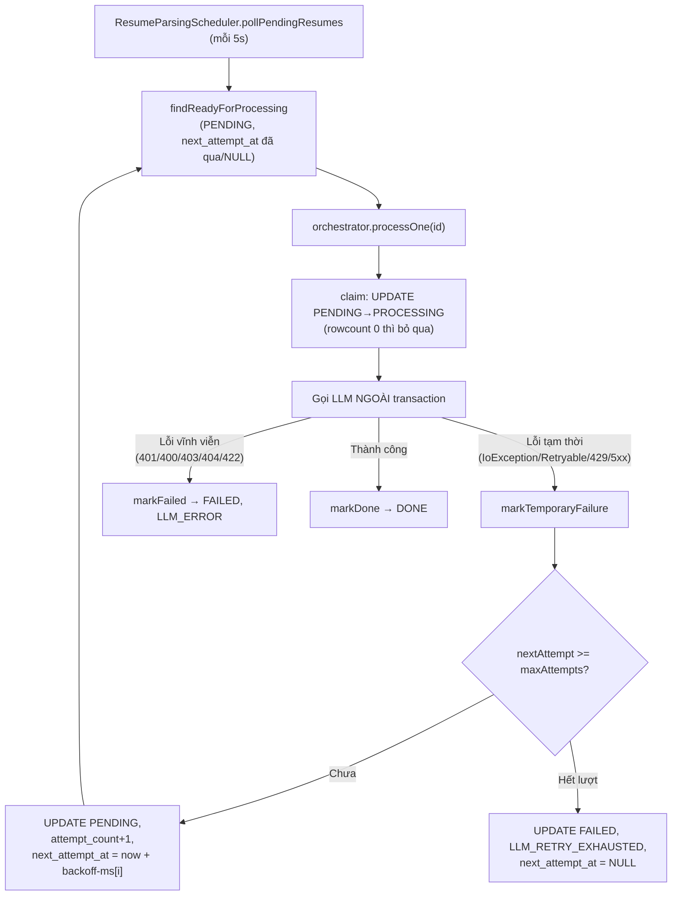
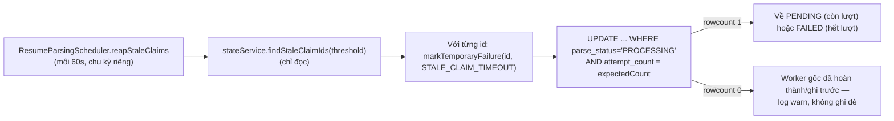
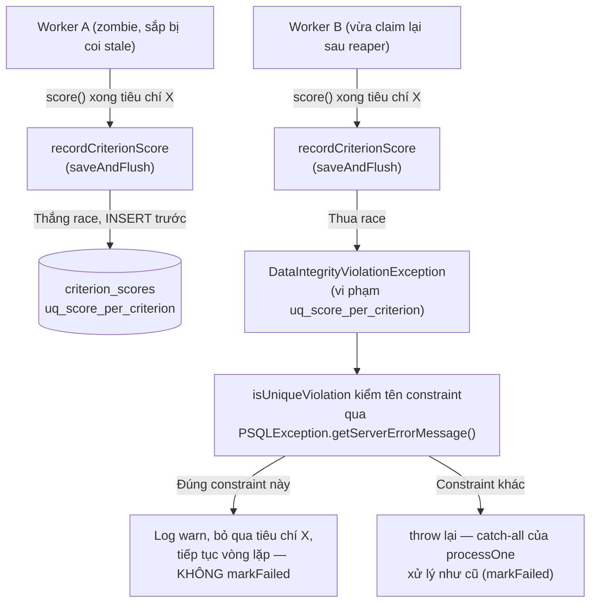
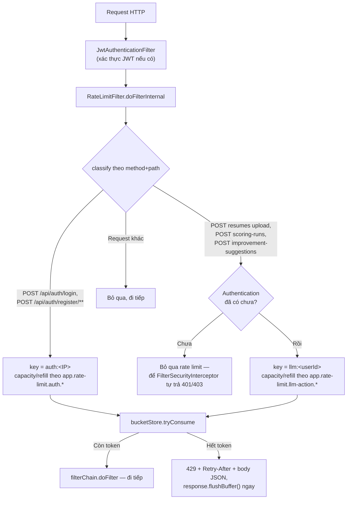

# Walkthrough — `chore/hardening`

## 1. Mục tiêu

Đây là nhánh dọn nợ kỹ thuật, **không thêm tính năng mới, không gắn mã FR nào**. Trước nhánh này,
`docs/ROADMAP.md` đã liệt kê 10 điểm rủi ro tích luỹ qua các nhánh trước (D1-D4, E1-E2, F1-F3):
một lỗi lost-update thật khi HR đổi trạng thái đơn, ba câu truy vấn `ORDER BY` thiếu khoá cuối gây
thứ tự không ổn định, thứ tự kiểm quyền sai ở hai service, không có cách phục hồi khi job nền chết
giữa chừng (JVM restart), lỗi gọi LLM tạm thời (mạng/429/5xx) bị xử lý y hệt lỗi vĩnh viễn (đốt luôn
một lượt xử lý thay vì tự thử lại), không có rate limit cho endpoint xác thực và endpoint tốn LLM,
và vài chỗ không nhất quán nhỏ (tiếng Việt không dấu, cảnh báo React, cột số không căn phải).

Nhánh chia làm 7 đợt, xử lý lần lượt: tính đúng đắn dữ liệu (Đợt 2) → đường thử lại thủ công cho
CV lỗi (Đợt 3, gộp một phần vào Đợt 4) → retry-with-backoff tự động + stale-claim reaper cho D1/D2
(Đợt 4) → rate limit (Đợt 5) → nhất quán giao diện/thông báo (Đợt 6) → hoàn thiện nốt endpoint thử
lại thủ công còn sót của Đợt 3 (Đợt 7).

## 2. Các file đã tạo/sửa

### Backend — Đợt 2 (tính đúng đắn dữ liệu)

| File | Vai trò |
|---|---|
| `jobapplication/JobApplicationRepository.java` | Thêm `updateStatusIfCurrent` (UPDATE có điều kiện, thay lost-update) |
| `jobapplication/ApplicationStatusService.java` | Đọc lại entity sau UPDATE thay vì tin object cũ đã stale |
| `common/exception/ApplicationStatusConflictException.java` | Exception mới, 409 khi rowcount = 0 |
| `scoring/ScoringRunRepository.java` | Thêm `, id DESC`/`, id` vào 3 query thiếu khoá cuối |
| `scoring/ScoringRunAuditService.java` | Xoá đoạn sort-lại-bằng-Java (không còn cần thiết) |
| `jobapplication/ApplicationOwnerService.java` | Đảo thứ tự: kiểm quyền sở hữu công ty trước khi tra job |

### Backend — Đợt 4 (retry-with-backoff + stale-claim reaper)

| File | Vai trò |
|---|---|
| `db/migration/V7__llm_retry_backoff.sql` | Thêm `claimed_at` (chỉ `resumes`), `attempt_count`, `next_attempt_at` cho cả hai bảng + backfill |
| `common/LlmRetryPolicy.java` | Đọc `app.hardening.llm.*`, validate `backoff-ms.size() == max-attempts - 1` lúc khởi động |
| `resume/Resume.java`, `scoring/ScoringRun.java` | Thêm field tương ứng 3 cột mới |
| `resume/ResumeRepository.java`, `scoring/ScoringRunRepository.java` | `markTemporaryFailure`, `markRetryExhausted`/`markFailedIfRunning`, `findReadyForProcessing`, `findIdsBy...ClaimedAtBefore`/`...StartedAtBefore` |
| `resume/ResumeParsingStateService.java`, `scoring/ScoringRunStateService.java` | Logic ghi kết quả tạm thời/vĩnh viễn/reaper, tách `unlockRubricIfSafe` |
| `resume/ResumeParsingScheduler.java`, `scoring/ScoringRunScheduler.java` | Vòng lặp reaper thật (`reapStaleClaims`), poll chính đổi sang `findReadyForProcessing` |
| `resume/ResumeParsingService.java`, `ai/criterion/CriterionScoringService.java`, `ai/explanation/ScoreExplanationService.java`, `ai/embedding/EmbeddingService.java`, `ai/cvimprovement/CvImprovementService.java` | Bắt riêng lỗi SDK tạm thời (`AnthropicIoException`/`AnthropicRetryableException`/`RateLimitException`/`InternalServerException`), ném mã lỗi tạm thời tương ứng |
| `resume/ResumeParsingErrorCode.java`, `scoring/ScoringRunErrorCode.java`, `ai/criterion/CriterionScoringErrorCode.java`, `ai/explanation/ScoreExplanationErrorCode.java`, `ai/embedding/EmbeddingErrorCode.java`, `ai/cvimprovement/CvImprovementErrorCode.java` | Thêm mã `*_TEMPORARILY_UNAVAILABLE`/`LLM_RETRY_EXHAUSTED`/`STALE_CLAIM_TIMEOUT`, xoá `LLM_TIMEOUT` cũ |
| `scoring/ScoringRunOrchestrator.java` | Bỏ qua tiêu chí đã chấm, bắt riêng vi phạm `uq_score_per_criterion` (thua race, không phải lỗi) |
| `ai/client/AnthropicChatModelConfig.java`, `ai/client/OpenAiEmbeddingClientConfig.java` | Timeout tường minh cho HTTP client (`app.hardening.anthropic-timeout-ms`/`openai-timeout-ms`) |
| `application.yml` | Cấu hình `app.hardening.*` |
| `pom.xml` | `org.postgresql:postgresql` đổi scope `runtime` → mặc định (compile) |

### Backend — Đợt 5 (rate limit)

| File | Vai trò |
|---|---|
| `ratelimit/RateLimitBucketStore.java` | Kho bucket trong-nhớ, bounded bằng `LinkedHashMap` accessOrder + `Collections.synchronizedMap` |
| `ratelimit/RateLimitFilter.java` | `OncePerRequestFilter` phân loại request, trả 429 khi vượt hạn mức |
| `auth/SecurityConfig.java` | Đăng ký `RateLimitFilter` ngay sau `JwtAuthenticationFilter` |
| `pom.xml` | Thêm `com.bucket4j:bucket4j-core:8.10.1` |
| `application.yml` | `app.rate-limit.*` (max-tracked-keys, auth/llm-action capacity + refill) |
| `application-test.yml` | `app.rate-limit.enabled: false` |

### Backend — Đợt 6 (Việt hoá có dấu)

`auth/AuthService.java`, `auth/JsonAccessDeniedHandler.java`, `auth/JsonAuthenticationEntryPoint.java`,
`common/exception/GlobalExceptionHandler.java`, và 10 file `common/exception/*NotFoundException.java`
+ `EmailAlreadyExistsException.java` — sửa message tiếng Việt không dấu thành có dấu (các message
này đi thẳng ra `ErrorResponse` cho người dùng cuối qua `ex.getMessage()`).

### Frontend — Đợt 6

| File | Vai trò |
|---|---|
| `features/applications/JobApplyForm.tsx` | Ẩn CV `parseStatus = FAILED` khỏi dropdown, thêm chú thích số lượng bị ẩn |
| `features/candidates/CandidatesTable.tsx`, `features/dashboard/JobPerformanceTable.tsx` | Căn phải cột số |
| `pages/HrJobCreatePage.tsx`, `pages/HrJobEditPage.tsx` | Sửa cảnh báo Radix Select uncontrolled→controlled |

### Backend — Đợt 7 (hoàn thiện mục 3b còn sót)

| File | Vai trò |
|---|---|
| `resume/ResumeRepository.java` | `retryFailedResume` — UPDATE có điều kiện `WHERE parse_status = 'FAILED'` |
| `resume/ResumeParsingStateService.java` | `retry(UUID)` — gọi repository, trả boolean, không nem exception |
| `resume/ResumeService.java` | `retry(candidateId, resumeId)` — kiểm sở hữu + kiểm trạng thái trước khi gọi state service |
| `resume/ResumeCandidateController.java` | Endpoint `PATCH /{id}/retry` |
| `common/exception/ResumeRetryNotAllowedException.java` | 409 khi CV không ở trạng thái `FAILED` |
| `common/exception/GlobalExceptionHandler.java` | Đăng ký handler cho exception trên |

### Frontend — Đợt 7

| File | Vai trò |
|---|---|
| `features/resumes/api.ts`, `features/resumes/queries.ts` | `retryResumeRequest`, `useRetryResumeMutation` |
| `features/resumes/ResumeList.tsx` | Nút "Phân tích lại", chỉ hiện khi `parseStatus === 'FAILED'` |

## 3. Luồng chính

### 3a. Retry-with-backoff cho lỗi LLM tạm thời (D1 — parse CV, tương tự cho D2)

Mỗi bước ghi (`claim`, `markTemporaryFailure`, `markFailed`, `markDone`) là một `UPDATE` có điều
kiện, chạy trong transaction ngắn riêng của nó — không có transaction nào giữ trong lúc chờ LLM.

### 3b. Stale-claim reaper (JVM restart giữa chừng)

Vòng lặp thật nằm ở `*Scheduler` (không phải `*StateService`) để tránh self-invocation phá
`@Transactional` (CLAUDE.md mục 3c) — mỗi bản ghi stale được xử lý trong transaction riêng của
chính `markTemporaryFailure`, một bản ghi lỗi không ảnh hưởng các bản ghi khác trong cùng vòng quét.

### 3c. Race giữa hai worker chấm cùng một tiêu chí (D2)

### 3d. Rate limit

## 4. Quyết định thiết kế

**Cố ý không làm presigned URL cho tải file CV** — luồng hiện tại (cả ứng viên lẫn HR) stream file
qua app server và kiểm quyền sở hữu ở mỗi request. Lựa chọn khác là presigned URL (URL tạm thời trỏ
thẳng tới storage, không qua app server). Chọn giữ nguyên stream-qua-app-server vì nó **chặt hơn**:
presigned URL có TTL, ai cầm được URL trong khoảng đó truy cập được mà không kiểm lại quyền sở hữu
tại thời điểm truy cập (ví dụ ứng viên rút đơn sau khi URL đã phát ra). Presigned chỉ đáng đánh đổi
khi cần giảm tải băng thông cho app server ở quy mô lớn — ngoài phạm vi đồ án hiện tại.

**`attempt_count` làm optimistic lock, không dùng `@Version`** — cần một cột vừa đếm số lần đã thử
(hiển thị được, dùng để tính hết lượt hay chưa) vừa làm điều kiện chống ghi đè khi hai worker cùng
sửa một bản ghi (worker gốc hoàn thành giữa lúc reaper đang xử lý). `@Version` của JPA làm đúng vai
trò optimistic lock nhưng là một cột riêng chỉ để lock, không mang nghĩa nghiệp vụ — dùng
`attempt_count` (đã cần tồn tại vì lý do khác) kiêm luôn vai trò đó tránh thêm một cột thừa. Cách
làm: đọc `attempt_count` hiện tại trước, rồi `UPDATE ... WHERE id = :id AND attempt_count =
:expectedCount`. Rowcount 0 nghĩa là một luồng khác đã ghi trước — xử lý bằng **log warn rồi return
êm, không ném exception**, vì đây là job nền tự động (scheduler), không phải request người dùng: làm
crash cả vòng quét vì một bản ghi bị thua race sẽ ảnh hưởng tới các bản ghi khác trong cùng lượt.

**Nhánh hết lượt thử (exhausted) không gọi `markFailed`** — `markFailed` là `UPDATE ... WHERE status
= 'RUNNING'` không mang `attempt_count`, nên gọi nó từ nhánh `markTemporaryFailure` sẽ mất lớp chống
race vừa xây (mất điều kiện `attempt_count = expectedCount`) và ghi sai giá trị `attempt_count` cuối
cùng (không tăng lên đúng số đã thử thật). Nếu làm ngược lại: một lượt bị stale-claim reap đúng lúc
`attempt_count` đã đạt ngưỡng sẽ ghi `FAILED` mà bỏ sót lần tăng `attempt_count` cuối, khiến audit
sau này đọc sai số lần đã thử thật sự. Sửa bằng cách để nhánh exhausted tự chạy `markRetryExhausted`
(một `UPDATE` riêng vừa kiểm điều kiện vừa ghi `attempt_count` cùng lúc), rồi tự gọi
`unlockRubricIfSafe` — không đi qua `markFailed`.

**`finished_at IS NULL` trong điều kiện `markTemporaryFailure`/reaper query** — tự phát hiện khi
thiết kế phần reaper (Đợt 4 nhịp 3): nếu thiếu điều kiện này, reaper có thể chạm vào một lượt chấm
đã chấm xong toàn bộ tiêu chí (D2 xong, `finished_at` đã có, đang chờ D3 tổng hợp) nhưng D3 chưa kịp
chuyển `DONE` trong đúng cửa sổ `stale-timeout-ms` — biến một lượt đã xong thành một lượt bị coi là
"chết", ghi đè sai trạng thái. Thêm `finished_at IS NULL` vào điều kiện WHERE của
`findIdsByStatusAndFinishedAtIsNullAndStartedAtBefore` và `markTemporaryFailure`/`markRetryExhausted`
loại trừ đúng lượt này khỏi phạm vi reaper.

**So khớp tiêu chí đã chấm bằng `criterionNameSnapshot`, không dùng `criterionId`** —
`CriterionScore.criterionId` có thể là `NULL` (FK `ON DELETE SET NULL` khi HR xoá tiêu chí gốc sau
khi đã chấm), không dùng làm khoá so khớp tin cậy được. `criterionNameSnapshot` là `NOT NULL`, chụp
nguyên văn tại thời điểm chấm, và duy nhất trong phạm vi một rubric nhờ `uq_criterion_name_per_rubric`
— rubric_snapshot của một lượt chấm luôn đến từ đúng một rubric nên tên không trùng nhau trong cùng
lượt.

**`uq_score_per_criterion` là chốt chặn thật, `alreadyScored` (đọc trong Java) chỉ là tối ưu tránh
gọi LLM thừa** — ràng buộc `UNIQUE (scoring_run_id, criterion_name_snapshot)` đã có sẵn từ
`V1__init_schema.sql` (không cần migration mới). Việc đọc `alreadyScored` trước vòng lặp giúp không
tốn thêm một lời gọi LLM (tốn tiền, tốn thời gian) cho tiêu chí đã chấm xong ở lần thử trước — nhưng
nếu vẫn có hai worker cùng lọt qua kiểm tra này và cùng gọi `recordCriterionScore` cho cùng tiêu chí
(race thật giữa lúc đọc và lúc ghi), DB tự chặn bằng constraint, và `ScoringRunOrchestrator` bắt
riêng đúng vi phạm này để coi là no-op an toàn thay vì lỗi.

**D3 an toàn với lượt đang retry** — `AggregationScheduler` gọi
`findByStatusAndFinishedAtIsNotNullAndTotalScoreIsNull` với tham số `status` truyền **cứng**
`RUNNING`. Cơ chế retry của hardening đưa một lượt gặp lỗi tạm thời về `PENDING` (không phải
`RUNNING`) với `finished_at` vẫn `NULL` — không khớp điều kiện này dù `finished_at` là gì. Ghi thành
bất biến: **không có đường nào để D3 tổng hợp một lượt chấm dở dang** — nhánh sau không được đổi
tham số này thành biến hay mở rộng sang `PENDING` mà không xem lại logic này trước.

**Đổi scope `org.postgresql:postgresql` từ `runtime` sang mặc định (compile)** — cần khớp
**chính xác theo tên ràng buộc DB** (`uq_score_per_criterion`) để phân biệt "thua race vô hại" với
"lỗi ràng buộc khác thật sự", qua `PSQLException.getServerErrorMessage().getConstraint()` — đáng
tin cậy hơn cách khớp chuỗi message tự do mà `GlobalExceptionHandler` đang dùng cho các ràng buộc
khác. Nhưng `PSQLException` chỉ có mặt trên classpath biên dịch của main code nếu bỏ `scope=runtime`.
Đánh đổi: từ nay main code có thể import trực tiếp lớp `org.postgresql.*` ở bất kỳ đâu — trước đây
`scope=runtime` tự nó là một hàng rào ngăn việc này. Giới hạn tự đặt để bù lại: chỉ dùng
`PSQLException` trong đúng một helper (`ScoringRunOrchestrator.isUniqueViolation`), không rải cách
này ra các service khác.

**Rate limit in-memory (Bucket4j, không Redis) — có thể bypass được, thừa nhận thẳng** — câu trả lời
thật cho "rate limit này bypass được không": **có**. Kho bucket bị chặn OOM bằng trần
`app.rate-limit.max-tracked-keys` (LRU eviction qua `LinkedHashMap accessOrder`), nhưng đúng cơ chế
chặn OOM đó lại mở đường khác: kẻ tấn công tạo hơn 10.000 khoá giả (IP giả hoặc nhiều tài khoản) để
đẩy khoá của chính nó ra khỏi map — mỗi lần bucket bị evict, hạn mức của khoá đó coi như được reset
về đầy. Đây là đánh đổi cố hữu của rate limit in-memory không có backend chia sẻ, không phải sơ
suất. Cách chữa thật: chuyển sang bucket lưu tập trung ở Redis (đếm chung, không có map cục bộ nào
để evict) — ngoài phạm vi "một instance là đủ" của đồ án này.

**Rate limit tắt trong test profile** (`app.rate-limit.enabled=false`) — `RateLimitBucketStore` dùng
chung một map trong-nhớ cho toàn bộ Spring context; hàng chục `@SpringBootTest` khác (dùng chung
context cache) gọi thật `POST /api/auth/login` qua MockMvc hàng trăm lần trong cả bộ test. Bật lên
sẽ làm vỡ hàng loạt test không liên quan gì đến rate limit chỉ vì dùng chung một bucket cho
`"auth:127.0.0.1"`. Hệ quả thật: 13 test hiện có (`RateLimitBucketStoreTest`/`RateLimitFilterTest`)
chỉ phủ logic tiêu thụ token/refill/trần ở mức đơn vị (tự "new" instance, không qua Spring) —
**không có test tự động nào chứng minh `RateLimitFilter` nằm đúng vị trí trong chain thật của Spring
Security**. Bằng chứng duy nhất cho điều đó là kiểm thử tay (xem mục 6).

**`retryFailedResume` không so khớp `attempt_count` như `markTemporaryFailure`** — điều kiện nguồn
chỉ là `parse_status = 'FAILED'`, khác với `markTemporaryFailure` (dùng `attempt_count = :expectedCount`
làm optimistic lock). Lý do đủ: `FAILED` là trạng thái **cuối cùng** của vòng đời parse, chỉ có đúng
một đường đi vào nó (`markFailed` hoặc `markTemporaryFailure` khi hết lượt) — không có khái niệm
"phiên bản" nào cần phân biệt như `attempt_count` đang làm cho các lần thử tự động liên tiếp. Rowcount
0 (race hiếm: một luồng khác đổi CV khỏi `FAILED` giữa lúc `ResumeService.retry` kiểm tra và lúc gọi
`ResumeParsingStateService.retry`) vẫn được xử lý đúng — trả `false`, `ResumeService` ném 409, không
ghi đè gì.

**Reset `attempt_count = 0` khi retry thủ công, không giữ nguyên số cũ** — thao tác của người dùng
(bấm nút) được coi là **bắt đầu lại từ đầu**, tách biệt hoàn toàn khỏi ngân sách `max-attempts` của
cơ chế tự động (Đợt 4). Lựa chọn khác (giữ nguyên `attempt_count` cũ) sẽ khiến CV vừa được thử lại
thủ công lập tức `FAILED` hẳn (không còn cơ hội tự động thử lại) ngay ở lần lỗi tạm thời kế tiếp, vì
đã đứng sẵn ở ngưỡng exhausted — phản trực giác với hành động "thử lại" mà người dùng vừa thực hiện.

**Không cần cột thời gian mới để phân biệt "vừa retry" khỏi "đã treo từ lâu"** — cân nhắc khi kiểm
thử tay phát hiện `isResumeStalled` (frontend) tính "đã chờ quá lâu" dựa trên `uploadedAt` (thời
điểm upload gốc), nên một CV vừa được retry (sau khi đã treo `FAILED` một thời gian) hiển thị ngay
dòng "Quá trình xử lý lâu hơn dự kiến" dù mới bấm nút được vài giây. Đây là hạn chế UI đã biết
(mục 7), không sửa ở nhánh này — không thêm cột `retriedAt` chỉ để phục vụ một dòng cảnh báo phụ,
trong khi poller thật (5 giây/lần) luôn nhặt lại gần như ngay lập tức nên cửa sổ hiển thị sai chỉ
kéo dài vài giây.

**`UUID.compareTo()` của Java không cùng ngữ nghĩa với `ORDER BY id` của Postgres trên cột `uuid`** —
Java so sánh hai `long` có dấu (`mostSigBits`/`leastSigBits`), Postgres so sánh 16 byte không dấu.
Hai thứ tự này cho kết quả khác nhau tuỳ giá trị UUID cụ thể. Phát hiện khi xoá workaround
sort-lại-bằng-Java trong `ScoringRunAuditService.listAudit` (dùng `UUID.compareTo()` để mô phỏng
`id DESC`) — workaround cũ đang **che giấu** đúng sai lệch này, khiến test
`ScoringRunAuditControllerIntegrationTest.listAudit_tiedCreatedAt_ordersByIdDescendingAsTiebreak`
pass "may" trước đó chứ không phải pass đúng. **Không được** dùng `UUID.compareTo()` để dự đoán hay
tái tạo thứ tự một truy vấn `ORDER BY id` ở bất kỳ đâu trong dự án — muốn biết thứ tự thật, đọc lại
từ chính repository/truy vấn đó.

## 5. Ràng buộc SRS đã thực thi

| Mã FR | Ràng buộc | Thực thi ở đâu |
|---|---|---|
| FR-H04 | Mỗi tiêu chí một lần gọi LLM riêng | `CriterionScoringService.score(CriterionSnapshot, String)` — không đổi ở nhánh này, chỉ thêm bắt lỗi tạm thời quanh nó |
| FR-H05 | AI không tính tổng điểm, không gán nhãn | `ScoringRunOrchestrator`/`ScoringRunStateService` (package `ai/` không đụng tới) — không đổi |
| FR-H06 | Điểm khác 0 phải có evidence | `CriterionScoringService.validate()` — không đổi ở nhánh này |
| FR-H07 | Quyết định Đạt/Không đạt là của HR | Không có ngưỡng phân loại/màu theo điểm nào được thêm ở nhánh này |
| FR-H08 | Lịch sử đánh giá đọc từ snapshot, không đọc rubric hiện tại | `weightSnapshot`/`rubricSnapshot` — không đổi |
| FR-U06 | Rút đơn là soft state | Không có `DELETE FROM` nào được thêm cho `job_applications`/`resumes`/`scoring_runs`/`criterion_scores` |
| CLAUDE.md mục 3c | Job nền: claim bằng UPDATE có điều kiện, không giữ transaction quanh lời gọi LLM, ghi qua bean riêng | `ResumeParsingStateService`/`ScoringRunStateService` (claim/markTemporaryFailure/markFailed đều `UPDATE` có điều kiện, transaction ngắn); vòng lặp reaper đặt ở `*Scheduler` để tránh self-invocation |
| CLAUDE.md mục 4 | Ràng buộc "chỉ một X" phải chốt ở DB | `uq_score_per_criterion` (V1, đã có sẵn) — `ScoringRunOrchestrator` bắt đúng vi phạm này qua `PSQLException` |
| CLAUDE.md mục 4 | Chuỗi hiển thị người dùng: tiếng Việt có dấu | Đợt 6 — 14 chỗ sửa |

## 6. Đã kiểm thử gì

**Tự động (backend, 486/486 pass cuối Đợt 6):**
- Lỗi tạm thời lần 1/2/hết lượt (biên `max-attempts - 1`, `max-attempts`) cho cả D1 và D2 — đúng
  `attempt_count`, `next_attempt_at`, chuyển `FAILED` đúng lúc.
- Lỗi vĩnh viễn (401) → `FAILED` ngay, `attempt_count` không tăng.
- Race `markTemporaryFailure`/`markFailed` với `expectedCount`/`status` không khớp → rowcount 0,
  return êm, không ghi đè (dựng bằng thao tác DB trực tiếp, không `Thread.sleep`).
- `findReadyForProcessing`/`claimForProcessing` bỏ qua bản ghi chưa tới `next_attempt_at`, tie-break
  ổn định khi nhiều bản ghi cùng mốc thời gian.
- D2 chỉ chấm lại tiêu chí còn thiếu sau lỗi tạm thời giữa chừng (assert số lần gọi mock `ChatModel`).
- Race `uq_score_per_criterion`: gọi `recordCriterionScore` hai lần cho cùng tiêu chí → lần hai bị
  chặn ở DB; `doProcess` gặp vi phạm này bỏ qua tiêu chí, tiếp tục vòng lặp, không `markFailed`.
- Reaper: bản ghi quá `stale-timeout-ms` đi đúng qua `markTemporaryFailure`; bản ghi mới claim không
  bị đụng; test khoá bất biến D3 (lượt `PENDING` với `criterion_scores` dở dang không bị D3 tổng hợp).
- Rate limit: request N+1 → 429 + `Retry-After`; cô lập theo IP/user; refill bằng `TimeMeter` giả
  (không `Thread.sleep`); trần `max-tracked-keys` tự evict khoá cũ nhất.
- `ApplicationStatusService.changeStatus` gọi hai lần liên tiếp từ cùng trạng thái gốc → lần hai
  `ApplicationStatusConflictException`, không ghi đè âm thầm.
- Retry (Đợt 7): CV `FAILED` của chính mình → 200, về `PENDING`, `attempt_count = 0`, `parse_error`
  `NULL`, `findReadyForProcessing` nhặt được ngay; CV của người khác → 404; CV đang
  `PENDING`/`PROCESSING`/`DONE` → 409 `RESUME_RETRY_NOT_ALLOWED`, không đổi gì.

**Thủ công (không thể tự động hoá đầy đủ hoặc cần bằng chứng chạy thật):**
- **Reaper trên DB dev, chạy app thật** (Đợt 4): tạm hạ `stale-timeout-ms`/`reaper-poll-interval-ms`
  xuống vài giây trong `application.yml`, tạo bản ghi kẹt bằng SQL trực tiếp
  (`docker compose exec postgres psql ... UPDATE resumes SET parse_status='PROCESSING', claimed_at =
  now() - interval '1 hour' WHERE id = ...` và tương tự cho `scoring_runs`), chạy `.\mvnw.cmd
  spring-boot:run` thật, đọc log Hibernate DEBUG xác nhận đúng câu `UPDATE` chạy (bao gồm guard
  `finished_at IS NULL`), xác nhận DB đổi trạng thái đúng, sau đó khôi phục cấu hình và dữ liệu về
  nguyên trạng.
- **Rate limit qua HTTP thật** (Đợt 5): PowerShell `Invoke-RestMethod`/`Invoke-WebRequest` gửi 20
  request `POST /api/auth/login` sai mật khẩu liên tiếp — request thứ 11 trả `429` kèm header
  `Retry-After: 6` và body JSON đúng định dạng. Phát hiện và sửa 2 lỗi runtime qua bước này:
  `BeanInstantiationException` do thiếu `@Autowired` khi có 2 constructor, và `ErrorPageFilter` nuốt
  mất body 429 chưa commit (sửa bằng `response.flushBuffer()`).
- **Lọc CV FAILED + cảnh báo Radix Select** (Đợt 6): dùng Playwright điều khiển Chromium thật (thay
  cho `chromium-cli` không có sẵn trên máy) — đăng ký 2 tài khoản QA qua API thật, tạo company/job/
  rubric qua API, chèn 2 CV test (1 DONE, 1 FAILED) qua SQL trực tiếp; xác nhận dropdown chọn CV chỉ
  hiện CV DONE, chú thích số lượng CV bị ẩn hiển thị đúng; xác nhận 0 cảnh báo console qua toàn bộ
  luồng tạo tin → sửa tin → tương tác lại 2 Select trên cả hai trang. Dọn sạch dữ liệu QA sau khi
  xong.
- **Endpoint retry, đầu-cuối bằng CV thật + LLM thật** (Đợt 7): tài khoản QA, upload CV thật
  (`cv-mot-cot.pdf`), ép `parse_status = FAILED` (mô phỏng hết lượt thử tự động) bằng SQL trực tiếp
  (backend thật không có đường code nào tạo ra trạng thái này nhanh để test), bấm "Phân tích lại"
  qua Playwright điều khiển Chromium thật — xác nhận UI chuyển ngay sang "Chờ xử lý", 0 cảnh báo
  console; poller thật (chu kỳ 5 giây) nhặt lại trong lượt kế tiếp, gọi Anthropic thật, kết thúc
  `DONE` với `resume_parsed_data` ghi đúng (`model=claude-sonnet-4-6`), nút hành động đổi đúng sang
  "Xem dữ liệu đã trích xuất"/"Gợi ý cải thiện CV". Phát hiện phụ trong lúc dựng test: ép `FAILED`
  bằng SQL trên một CV **đã có sẵn** `resume_parsed_data` (từ một lần parse thành công trước đó,
  không xoá) tạo ra vi phạm `resume_parsed_data_resume_id_key` khi retry — xác nhận đây KHÔNG phải
  lỗi thật của tính năng: `DONE` là trạng thái cuối, không có đường code nào trong ứng dụng đưa một
  resume đã `DONE` quay lại `FAILED`, nên `resume_parsed_data` không bao giờ tồn tại sẵn cho một CV
  hợp lệ đang ở `FAILED` — trạng thái đó chỉ dựng được bằng SQL tay bỏ qua mọi ràng buộc ứng dụng,
  không phản ánh khả năng xảy ra thật. Dọn sạch dữ liệu QA (resume, `resume_parsed_data`, user) sau
  khi kiểm xong.

**Chưa test:**
- Không có test tích hợp nào chứng minh `RateLimitFilter` nằm đúng vị trí trong chain Spring
  Security thật qua MockMvc/HTTP — bằng chứng duy nhất là lượt kiểm thử tay ở trên (xem mục 4, lý do
  tắt trong test profile).
- Không test race condition đồng thời **thật sự** (nhiều thread/nhiều JVM cùng lúc) cho
  `uq_score_per_criterion` hay `markFailed`/`markTemporaryFailure` — các test hiện có dựng tình
  huống race bằng cách gọi tuần tự với dữ liệu đã cố ý lệch pha (ví dụ `expectedCount` sai), không
  phải hai luồng thật chạy song song.
- Chưa có cách ép SDK Anthropic/OpenAI thật trả lỗi tạm thời (429/503) để kiểm thử tay toàn bộ chuỗi
  retry-with-backoff bằng API key thật — chỉ kiểm bằng mock ở tầng unit/integration test.

## 7. Nợ kỹ thuật

- **`markFailed`/`markRetryExhausted` chỉ kiểm `status = 'RUNNING'`, không phân biệt được hai worker
  cùng nhìn thấy `RUNNING` từ CÙNG một lần claim** (worker A "zombie" sống sót qua hết
  `stale-timeout-ms` trong khi lượt đã bị reap và claim lại thành công bởi worker B — cả hai đều thấy
  `status = 'RUNNING'`). Chặn triệt để đòi thêm một cột version tăng theo từng lần claim (ví dụ so
  khớp thêm `started_at = :expectedStartedAt`) và sửa chữ ký `markFailed` cùng mọi call site D2/D3 —
  vượt phạm vi nhánh này.
- Không có claim/stale-reaper cho `JobEmbeddingScheduler`/`ResumeEmbeddingScheduler`/
  `JobRecommendationCacheScheduler`/poller gửi email (E2) — an toàn với một instance, sẽ trùng lặp
  (không sai dữ liệu) nếu chạy đa instance.
- Không xây tầng tổng hợp/cảnh báo chi phí token — cột `token_usage` vẫn ghi đầy đủ, chỉ không có gì
  đọc/tổng hợp từ đó.
- `ChatModel.getDefaultOptions()` đã deprecated ở Spring AI 2.0, vẫn dùng trong mock test của D1/D2 —
  cần thay khi nâng phiên bản Spring AI.
- 6 job seed thiếu rubric/interview_template trong `db/seed/dev-seed.sql` — thuộc phạm vi
  `chore/seed-demo`, không xử lý ở nhánh này.
- **V6 (`cv_improvement_requests`, F2/FR-U05) chưa từng được áp cho DB dev cho tới khi chạy V7 của
  nhánh này** — phát hiện phụ khi kiểm Flyway cho V7 (`flyway_schema_history` cho thấy V5 áp
  2026-08-18, còn V6 và V7 cùng áp một lượt vào 2026-08-24). Cần kiểm thử tay lại toàn bộ luồng
  FR-U05 trước bảo vệ, và kiểm tương tự trên mọi máy khác đang chạy dự án.
- Rate limit chưa có test tích hợp qua chain Spring Security thật (xem mục 6 "Chưa test").
- **`isResumeStalled` (frontend, `features/resumes/queries.ts`) tính "đã chờ quá lâu" dựa trên
  `resume.uploadedAt`** — một CV vừa được thử lại thủ công (Đợt 7) qua nút "Phân tích lại" sẽ hiển
  thị ngay dòng "Quá trình xử lý lâu hơn dự kiến" trong vài giây đầu (từ lúc bấm tới lúc poller thật
  nhặt lại, ~5 giây), vì `uploadedAt` là mốc upload GỐC (đã cũ, vốn là lý do CV này rơi vào `FAILED`
  từ trước), không phải mốc vừa retry. Không sửa ở nhánh này — cửa sổ hiển thị sai chỉ kéo dài vài
  giây, và sửa đúng đòi thêm một cột mốc thời gian mới (`resumes` không có cột nào ghi lại "lần thay
  đổi trạng thái gần nhất" ngoài `uploaded_at`/`claimed_at` cụ thể theo mục đích riêng).

Chi tiết đầy đủ hơn (kèm số dòng, đoạn code cụ thể) nằm ở `docs/ROADMAP.md` mục "Hoàn thiện trước
bảo vệ" → `chore/hardening`.

## Ba câu hỏi kiểm tra

1. Nếu xoá `LlmRetryPolicy.java` thì hỏng cái gì? — Cả `ResumeParsingStateService` lẫn
   `ScoringRunStateService` sẽ mất nguồn đọc `max-attempts`/`backoff-ms` dùng chung; validate
   `backoffMs.size() == maxAttempts - 1` (chặn cấu hình sai lúc khởi động) cũng biến mất — một cấu
   hình `backoff-ms` thiếu phần tử sẽ gây `IndexOutOfBoundsException` lúc runtime thay vì báo lỗi
   ngay khi khởi động.
2. Một CV vừa upload đi qua những class nào tới lúc bị đánh dấu `LLM_RETRY_EXHAUSTED`? —
   `ResumeParsingScheduler.pollPendingResumes` → `ResumeRepository.findReadyForProcessing` →
   `ResumeParsingOrchestrator.processOne` → claim → gọi LLM lỗi tạm thời 3 lần liên tiếp (mỗi lần
   cách nhau đúng `backoff-ms[i]`) → lần cuối `ResumeParsingStateService.markTemporaryFailure` thấy
   `nextAttempt >= maxAttempts` → `ResumeRepository.markRetryExhausted` ghi `FAILED` +
   `LLM_RETRY_EXHAUSTED`, `next_attempt_at = NULL`.
3. Vì sao vòng lặp reaper đặt ở `ResumeParsingScheduler`/`ScoringRunScheduler` mà không đặt thẳng
   trong `ResumeParsingStateService`/`ScoringRunStateService` cho gọn? — Vì `StateService` là nơi
   `@Transactional` thật sự chạy qua Spring proxy; nếu vòng lặp cũng nằm trong `StateService` và gọi
   `markTemporaryFailure` qua `this.method()`, đó là self-invocation — lời gọi không đi qua proxy nên
   `@Transactional` trên `markTemporaryFailure` sẽ không mở transaction nào cả (CLAUDE.md mục 3c).
   Đặt vòng lặp ở `Scheduler` (bean khác) và gọi qua tham chiếu bean tiêm vào buộc lời gọi phải đi
   qua proxy, giữ đúng tính transaction độc lập cho từng bản ghi trong vòng quét.
