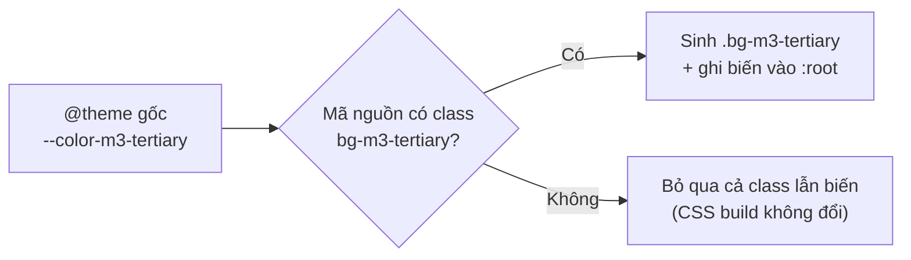

# Walkthrough — `chore/ui-md3-foundation`

Nhánh chore, không có REQUIREMENT.md/UI.md: đặc tả là prompt đã duyệt của người dùng (3 đợt).
Không có chức năng mới, không có màn hình nào bị sửa.

---

## 1. Mục tiêu

21 FR bổ sung sẽ dựng màn hình theo Material Design 3 (UI_GUIDE.md). Trước khi FR đầu tiên có giao
diện, cần một bộ token "vai trò" MD3 — màu (primary, surface, on-surface…), thang chữ, bo góc, độ
nổi — khai sẵn trong Tailwind để mọi màn hình mới gọi cùng một tên class, thay vì mỗi FR tự chọn hex.
Nhánh này chỉ khai token và ghi tài liệu cách dùng; màn hình cũ phải giữ nguyên từng pixel. Kèm theo
là hai quyết định màu còn bỏ ngỏ trong UI_GUIDE: màu nút Ứng tuyển (bản cũ không đạt tương phản) và
màu nền khối nội dung do AI tạo.

## 2. Các file đã tạo/sửa

### Frontend

| File | Vai trò |
|---|---|
| `frontend/src/index.css` | Thêm 51 dòng vào cuối khối `@theme` gốc: 13 màu `--color-m3-*`, 8 vai trò chữ `--text-m3-*` (mỗi vai trò 3 dòng: cỡ, line-height, font-weight), 5 bán kính `--radius-m3-*`, 2 độ nổi `--shadow-m3-*`. Không dòng cũ nào bị sửa/xoá |

### Tài liệu

| File | Vai trò |
|---|---|
| `docs/UI_GUIDE.md` | Mục 0: quy tắc màn hình mới chỉ dùng `m3-*`. Mục 1a/1b: bỏ tham chiếu số dòng `index.css`. Mục 1c: bảng token đã khai + class + giá trị + số đo tương phản. Mục 1d/1e/1g: thêm cột class. Mục 4: quy tắc khối AI. Mục 6: số đo `m3-tertiary`, quy tắc chữ phụ, quy tắc viền |
| `docs/ROADMAP.md` | Tick dòng `chore/ui-md3-foundation`, ghi `m3-tertiary = #007A3D` |
| `.claude/skills/walkthrough/SKILL.md` | Mục "Nơi lưu": quy tắc tên file cho nhánh `feat/` (bỏ tiền tố) và `chore/`/`fix/` (giữ tiền tố, `/` → `-`), khớp tiền lệ `chore-hardening.md` |
| `docs/walkthrough/chore-ui-md3-foundation.md` | Tài liệu này |

## 3. Luồng chính

Nhánh không có request/response. "Luồng" ở đây là đường đi của một token từ khai báo tới CSS mà
trình duyệt nhận được:

1. **Khai báo.** Biến như `--color-m3-tertiary: #007A3D` nằm trong khối `@theme` gốc của
   `index.css`. `@theme` là cú pháp Tailwind v4: biến theo namespace (`--color-*`, `--text-*`,
   `--radius-*`, `--shadow-*`) sẽ tự sinh utility class tương ứng.
2. **Sinh class khi được dùng.** Lúc build (plugin `@tailwindcss/vite`), Tailwind quét mã nguồn tìm
   tên class. Gặp `bg-m3-tertiary` thì sinh rule `background-color: var(--color-m3-tertiary)`; gặp
   `text-m3-title-md` thì sinh cả `font-size`, `line-height`, `font-weight` từ ba biến
   `--text-m3-title-md`, `--text-m3-title-md--line-height`, `--text-m3-title-md--font-weight`.
3. **Chỉ xuất biến đã dùng.** Biến theme chỉ được ghi vào `:root` của CSS build nếu có class nào dùng
   tới (hoặc biến đang dùng tham chiếu tới nó). Hiện chưa có component nào dùng `m3-*`, nên CSS build
   không có dòng `m3-` nào — đây là lý do CSS trước/sau giống hệt từng byte.

Bằng chứng cơ chế, đọc từ `node_modules/tailwindcss` bản **4.3.3** (không viết theo trí nhớ):

- Utility `text-*` gọi `resolveWith(..., ["--text"], ["--line-height","--letter-spacing","--font-weight"])`
  — bản này hỗ trợ khoá con font-weight.
- Utility `shadow-*` tra `--shadow-<tên>` trước khi thử hiểu tên là màu, nên `shadow-m3-1` ra
  `box-shadow`.
- Biến được giữ khi có cờ used (16) hoặc static (8) — hàm lọc kiểm `getOptions(e) & 24`.

## 4. Quyết định thiết kế

**4.1. Tiền tố `m3-` cho mọi token mới**
- Đã chọn: `--color-m3-primary`, `--text-m3-title-md`, `--radius-m3-sm`…
- Lựa chọn khác: dùng thẳng tên MD3 (`--color-primary`, `--radius-sm`).
- Vì sao: shadcn đã chiếm `--color-primary/secondary/accent/muted/destructive` và `--radius-sm…4xl`
  trong `@theme inline`; khối đó nằm sau nên sẽ đè mất token trùng tên (đã từng dính với
  `--font-sans`, `--color-accent`). Tiền tố cũng cho phép grep `m3-` để phân biệt màn hình mới/cũ.

**4.2. Khai ở khối `@theme` gốc, không ở `@theme inline` hay `:root`**
- Lựa chọn khác: `@theme inline` (nơi shadcn khai), hoặc biến thường trong `:root`.
- Vì sao: khối gốc là nơi token dự án đã sống (UI_GUIDE 1b); `:root` không sinh utility class.

**4.3. Token mới song song, không đổi token cũ**
- Lựa chọn khác: đổi `--color-accent` hoặc `--accent` sang màu đạt tương phản ngay.
- Vì sao: `--accent` của shadcn còn là màu tô của dropdown/menu (`select.tsx` dùng
  `focus:bg-accent`); đổi nó sẽ đổi màu cả những chỗ không liên quan nút Ứng tuyển. Màn hình cũ đổi
  ở `refactor/ui-md3-legacy` theo ROADMAP, không đổi lén ở nhánh chore.

**4.4. `m3-tertiary = #007A3D`**
- Lựa chọn khác: `#1AC639` (accent hiện tại, 2.29:1), `#008C45` (accent-dark, 4.34:1).
- Vì sao: hai màu cũ đều dưới 4.5:1 với chữ trắng; `#007A3D` giữ sắc xanh lá của hành động ứng tuyển
  và đạt 5.45:1.

**4.5. `m3-surface-container-high = #EEF2F7` + viền bắt buộc + cấm chữ phụ trong khối AI**
- Lựa chọn khác: nền xám `#F0F0F0` như canvas (khối AI lẫn vào nền trang), hoặc nền đậm hơn.
- Vì sao: chữ chính đạt 13.06:1 trên nền này; nhưng nền chỉ chênh 1.12:1 với trắng nên cần viền
  `m3-outline-variant`, và chữ phụ `#6B7280` chỉ 4.30:1 nên cấm dùng trong khối.

**4.6. Cỡ chữ khai bằng `px`, không `rem`**
- Lựa chọn khác: `rem` như thang mặc định của Tailwind.
- Vì sao: UI_GUIDE 1d đặc tả bằng px (24/32, 13/18…) và `body` đang đặt `font-size: 14px`; px ra
  đúng số đã duyệt, không phải quy đổi.

**4.7. Shadow chép nguyên văn từ `theme.css`**
- Vì sao: `--shadow-m3-1`/`-3` phải bằng đúng `shadow-sm`/`shadow-md` (UI_GUIDE 1g). Chép từ bản đang
  cài thay vì tự đặt, có comment ghi nguồn trong `index.css`.

**4.8. Không token cho khoảng cách và trạng thái tương tác**
- Vì sao: thang spacing mặc định của Tailwind đã là bước 4px; trạng thái tương tác dùng opacity
  modifier (`hover:bg-m3-primary/8`) — thêm token chỉ nhân đôi thứ đã có.

**4.9. Không thêm `@theme static`**
- Lựa chọn khác: ép Tailwind xuất mọi biến `m3-*` ra CSS ngay cả khi chưa dùng.
- Vì sao: sẽ làm CSS build đổi (mất bằng chứng "màn hình cũ không đổi") và phình CSS vô ích. UI_GUIDE
  1c ghi rõ: class `m3-*` vắng mặt trong build khi chưa dùng không phải lỗi thiếu token.

**4.10. UI_GUIDE bỏ tham chiếu số dòng `index.css`**
- Lựa chọn khác: cập nhật lại số dòng mới.
- Vì sao: mỗi lần thêm token số dòng lại lệch (nhánh này đã làm lệch cả 4 chỗ); mô tả vị trí bằng
  tên khối ("khối `@theme` đầu tiên, không có từ khoá `inline`") không lỗi thời.

## 5. Ràng buộc đã thực thi

| Nguồn | Ràng buộc | Thực thi ở đâu |
|---|---|---|
| UI_GUIDE 1b | Token mới khai trong `@theme` gốc, không trong `@theme inline` | `index.css`, cuối khối `@theme` gốc |
| UI_GUIDE 1c | Tiền tố `m3-`, không thêm màu thương hiệu mới | 13 biến `--color-m3-*`, mọi giá trị ánh xạ về token cũ trừ `tertiary` và `surface-container-high` |
| UI_GUIDE 6 | Chữ ≥ 4.5:1 | `m3-tertiary` 5.45:1; quy tắc chữ phụ chỉ trên `m3-surface` ghi vào UI_GUIDE 6 |
| UI_GUIDE 0 / đặc tả nhánh | Không đổi màn hình cũ | CSS build trước/sau giống hệt từng byte (mục 6) |
| CLAUDE.md §4 | Comment code tiếng Việt không dấu | Hai comment mới trong `index.css` |
| CLAUDE.md §8 | Không sao chép CSS của trang khác | Giá trị lấy từ token dự án + `theme.css` của Tailwind đang cài |

## 6. Đã kiểm thử gì

### Tự động / bằng lệnh

- `npm run build`: exit 0 (cảnh báo chunk > 500 kB có sẵn từ trước, không liên quan).
- `npm run lint`: exit 0.
- **So CSS build:** build trước khi sửa, lưu `dist/assets/index-nIa7Jq77.css` ra thư mục tạm ngoài
  repo; sửa `index.css`; build lại. `cmp` không báo khác biệt; sha256 cả hai bản
  `d1d21725…0d463`; tên file hash không đổi; `grep -c "m3-"` trên CSS build = 0.
- **Class sinh đúng:** biên dịch `index.css` qua `@tailwindcss/node` với danh sách class thử
  (`bg-m3-tertiary`, `text-m3-title-md`, `text-m3-body-sm`, `rounded-m3-button`, `shadow-m3-1`,
  `border-m3-outline-variant`, `hover:bg-m3-primary/8`, `bg-m3-surface-container-high`). Mọi class
  sinh rule đúng; `text-m3-*` ra đủ `font-size` + `line-height` + `font-weight`; `/8` ra
  `color-mix(... 8%, transparent)`. Script chạy tạm, đã xoá, không commit.
- **Tương phản WCAG 2.1** (script tạm, công thức relative luminance):

| Chữ / nền | Tỉ lệ | Kết quả |
|---|---|---|
| `#FFFFFF` / `m3-tertiary #007A3D` | 5.45:1 | Đạt ≥ 4.5 |
| `m3-on-surface #1F2937` / `m3-surface-container-high #EEF2F7` | 13.06:1 | Đạt ≥ 7 |
| `m3-on-surface-variant #6B7280` / `#EEF2F7` | 4.30:1 | Không đạt → cấm trong khối AI |
| `#6B7280` / `m3-surface-container #F0F0F0` | 4.24:1 | Không đạt → dùng `m3-on-surface` |
| `#6B7280` / `m3-surface #FFFFFF` | 4.83:1 | Đạt |
| `m3-on-primary` / `m3-primary #0078C9` | 4.64:1 | Đạt |
| `m3-on-primary-container #1E5C8B` / `#E6F2FA` | 6.23:1 | Đạt |
| `m3-error #E11B3E` / trắng | 4.74:1 | Đạt |
| `#EEF2F7` / trắng · `#E7E7E9` / trắng | 1.12 · 1.23 | Không phải chữ; lý do bắt buộc viền / cấm dùng viền này cho điều khiển |

### Soát bằng mắt (người dùng thực hiện)

Trình duyệt Chrome, chạy `npm run dev`.
- `/` (chưa đăng nhập): không có gì thay đổi.
- `/candidate` (tài khoản ứng viên demo): không có gì thay đổi.
- `/hr/jobs/:id/edit` (tài khoản HR demo, job nháp "e"), tab "Thông tin tin tuyển dụng": không có
  gì thay đổi. Ba tab còn lại không soát bằng mắt (dựa vào bằng chứng CSS giống hệt).

Kết luận khớp với bằng chứng CSS build giống hệt từng byte.

### Chưa kiểm thử

- Chưa có màn hình nào thật sự dùng class `m3-*` — hiển thị thực tế của token (font-weight con,
  shadow, opacity modifier) mới được kiểm ở mức CSS sinh ra, chưa kiểm trên trình duyệt.
- Chưa soát bằng mắt các màn hình cũ khác ngoài 3 màn hình trên, kể cả 3 tab còn lại của
  `/hr/jobs/:id/edit` (dựa vào bằng chứng CSS giống hệt).
- Không đo tương phản ở chế độ `.dark` — dự án chưa dùng dark mode; token `m3-*` chưa có giá trị dark.

### Đối chiếu "Xong khi"

| Tiêu chí | Cách nghiệm thu | Kết quả |
|---|---|---|
| `index.css` chỉ có dòng thêm, trong `@theme` gốc | `git diff --numstat`: 51 thêm / 0 xoá; hunk nằm trước `}` của khối `@theme` đầu tiên | Đạt |
| CSS build trước/sau giống hệt hoặc chỉ khác biến m3 | `cmp` + sha256 như trên | Đạt (giống hệt) |
| `npm run build` + `npm run lint` sạch | Chạy sau khi sửa | Đạt |
| `m3-tertiary` ≥ 4.5:1; on-surface trên container-high ≥ 7:1 | Script tương phản | Đạt (5.45 · 13.06) |
| UI_GUIDE 1c không còn "đích"; mọi token có class + giá trị thật | Đọc lại mục 1c–1g | Đạt |
| Không file nào ngoài index.css, UI_GUIDE, ROADMAP, walkthrough đổi | `git status` | Lệch: thêm `.claude/skills/walkthrough/SKILL.md` theo yêu cầu người dùng ở Đợt 3 |
| Soát bằng mắt 3 màn hình cũ không đổi | Người dùng soát (trên) | Đạt |

## 7. Nợ kỹ thuật

- Nút Ứng tuyển ở màn hình cũ (`ApplyButton.tsx`, `bg-accent` + chữ trắng, 2.29:1) **vẫn không đạt
  tương phản** — để lại cho `refactor/ui-md3-legacy`.
- Chưa có màu viền cho thành phần điều khiển (ô nhập, checkbox) đạt ≥ 3:1; `m3-outline-variant`
  (1.23:1) không dùng được cho việc này. Chốt khi FR đầu tiên cần tới.
- Token `m3-*` chưa có giá trị cho `.dark`.
- Token cũ và token `m3-*` cùng tồn tại, nhiều giá trị trùng nhau (`brand` = `m3-primary`…) cho tới
  khi `refactor/ui-md3-legacy` chuyển màn hình cũ sang `m3-*`.

## 8. Lệch so với đặc tả

Không áp dụng — nhánh chore, không có REQUIREMENT.md/UI.md.
