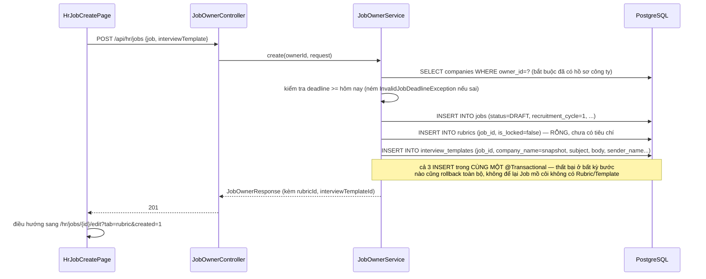
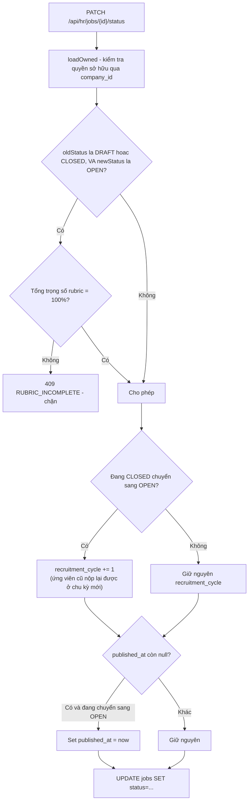

# FR-H02 — Tin tuyển dụng & Mẫu giấy mời phỏng vấn

Phạm vi: commit `27e2a21` (Job CRUD + rubric rỗng + xoá mềm) → `37e5607` (mẫu giấy mời phỏng
vấn) → `6546488` (giao diện quản lý tin cho HR) → phần **liên quan tới job** trong `38af368`
(fix chặn job quá hạn, validate deadline, sửa submit ngầm ở form nhiều bước). Bốn commit này nằm
tuyến tính trên nhánh `feat/fr-h03-rubric` hiện tại (không phải nhánh riêng đã merge).

Commit `38af368` là commit gộp — cùng một lần sửa vừa vá lỗi job (thuộc B2) vừa dựng luôn toàn bộ
giao diện rubric (thuộc B3). Tài liệu này **chỉ nói phần job**: `JobRepository.java`,
`JobOwnerService.java`, `JobPublicService.java`, `JobSummaryResponse.java`,
`InvalidJobDeadlineException.java`, `HrJobCreatePage.tsx`, `HrJobListPage.tsx`, `JobCard.tsx`,
`PublicJobDetailPage.tsx`, `lib/date.ts`. Phần rubric của cùng commit này (`features/rubric/*`,
tab "Rubric chấm điểm" trong `HrJobEditPage.tsx`) được nói ở `feat-fr-h03-rubric.md`.

## 1. Mục tiêu

FR-H02 cho HR tạo và quản lý tin tuyển dụng: tạo, sửa, đổi trạng thái (Nháp/Đang mở/Tạm
dừng/Đã đóng), xoá mềm. Ràng buộc nghiệp vụ quan trọng nhất: **mỗi tin tuyển dụng bắt buộc phải
có một Rubric đi kèm ngay từ lúc tạo** (dù rỗng, chưa có tiêu chí nào) và một Mẫu giấy mời phỏng
vấn gắn 1-1 — không được tồn tại trạng thái nửa vời "có Job nhưng thiếu Rubric hoặc thiếu mẫu
giấy mời". Việc điền tiêu chí cho rubric thuộc phạm vi FR-H03 (nhánh sau).

Ngoài phạm vi gốc của B2, nhánh này còn gánh thêm một đợt sửa lỗi phát hiện qua test tay: tin đã
hết hạn nộp (`deadline` ở quá khứ) vẫn hiện công khai và vẫn bấm Ứng tuyển được, form tạo tin
không chặn HR chọn hạn nộp trong quá khứ, và lỗi validate hiện sai thời điểm ở bước 3 của form tạo
tin nhiều bước.

## 2. Các file đã tạo/sửa

### Backend

| File | Vai trò |
|---|---|
| `job/JobOwnerController.java` | 5 endpoint dưới `/api/hr/jobs`: tạo, liệt kê của mình, xem 1, sửa, đổi trạng thái, xoá |
| `job/JobOwnerService.java` | Nghiệp vụ chính: tạo Job+Rubric+InterviewTemplate cùng transaction, sửa, đổi trạng thái (kèm logic tăng `recruitment_cycle`, khoá mở tin khi rubric chưa đủ 100%), xoá mềm, và (thêm ở `38af368`) chặn `deadline` quá khứ |
| `job/JobRepository.java` | Query cho HR (theo `company_id`) và query công khai (`searchPublicJobs`, `findOpenJobById` — thêm điều kiện lọc `deadline` ở `38af368`) |
| `job/dto/JobRequest.java`, `JobCreateRequest.java`, `JobOwnerResponse.java`, `JobStatusUpdateRequest.java` | DTO vào/ra phía HR. `JobCreateRequest` bọc cả `JobRequest` lẫn `InterviewTemplateRequest` trong một request duy nhất — xem Quyết định thiết kế |
| `job/JobPublicController.java`, `JobPublicService.java` | Đọc công khai (đã có từ FR-C02), sửa thêm ở B2/fix để bao gồm `deadline` trong `JobSummaryResponse` và lọc job hết hạn |
| `rubric/Rubric.java`, `RubricRepository.java` | Entity rỗng (chưa có tiêu chí) — chỉ đủ để B2 tạo kèm Job, B3 mới thêm tiêu chí |
| `interviewtemplate/InterviewTemplate.java`, `InterviewTemplateOwnerController.java`, `InterviewTemplateOwnerService.java`, `InterviewTemplateRepository.java`, `dto/*` | CRUD mẫu giấy mời, gắn 1-1 với Job qua `job_id` |
| `common/exception/InterviewTemplateNotFoundException.java`, `InvalidJobDeadlineException.java` | Exception nghiệp vụ mới |
| `common/exception/GlobalExceptionHandler.java` (sửa) | Thêm handler cho 2 exception trên |
| `test/job/JobOwnerIntegrationTest.java` (12 test), `test/interviewtemplate/InterviewTemplateOwnerIntegrationTest.java` (5 test) | Test tích hợp qua `MockMvc` + Postgres thật |

### Frontend

| File | Vai trò |
|---|---|
| `features/jobs/ownerApi.ts`, `ownerQueries.ts`, `ownerTypes.ts` | Gọi API `/hr/jobs/*`, quản lý cache bằng TanStack Query |
| `features/jobs/jobLabels.ts` | Nhãn tiếng Việt cho `JobStatus`/loại hình/hình thức làm việc, và bảng "trạng thái nào được chuyển sang trạng thái nào" cho UI (không phải cơ chế chặn — backend chấp nhận mọi chuyển trạng thái, xem Luồng 2) |
| `features/jobs/JobStatusBadge.tsx` | Huy hiệu trạng thái — cố tình dùng màu trung tính (canvas/line/brand), không dùng đỏ/xanh để tránh ngụ ý "xấu/tốt" |
| `features/jobs/JobRowActions.tsx` | Nút đổi trạng thái + xoá (có hộp thoại xác nhận) trên mỗi dòng bảng |
| `pages/HrJobListPage.tsx` | Bảng danh sách tin của HR, lọc theo trạng thái, có cột "Hạn nộp" (thêm ở `38af368`) |
| `pages/HrJobCreatePage.tsx` | Form tạo tin 3 bước (thông tin cơ bản → lương & thời hạn → mẫu giấy mời), sửa nhiều nhất ở `38af368` |
| `pages/HrJobEditPage.tsx` | Trang sửa tin, khởi tạo với 2 tab ở `6546488` (thông tin tin / mẫu giấy mời) — tab Rubric thứ 3 thuộc B3, nói ở tài liệu kia |
| `features/jobs/JobCard.tsx`, `pages/PublicJobDetailPage.tsx` (sửa) | Card/trang chi tiết công khai — thêm hiển thị hạn nộp ở `38af368` |
| `lib/date.ts` | Hàm `formatDeadline()` dùng chung — `yyyy-MM-dd` (backend trả về) sang `dd/MM/yyyy`, hoặc "Không giới hạn" nếu `null` |

## 3. Luồng chính

### Luồng 1 — HR tạo tin tuyển dụng mới

### Luồng 2 — Đổi trạng thái tin (có nhánh rẽ, và một lỗ hổng chưa vá — xem mục 7)

Điểm cố ý: chuyển `PAUSED → OPEN` **không** bị chặn bởi kiểm tra rubric đủ 100%, dù cũng là "mở
tin". Lý do nằm trong comment của `JobOwnerService.changeStatus()`: đây chỉ là tạm dừng trong
cùng một đợt tuyển dụng, rubric ở thời điểm đó có thể **đã bị khoá** (`is_locked`, do đã có lượt
chấm điểm đầu tiên — cơ chế của FR-H03) nên HR không còn cách nào sửa cho đủ 100% nữa; chặn cả
trường hợp này sẽ khiến HR bế tắc không mở lại được tin.

**Điều kiện hiện tại xét theo `oldStatus` (DRAFT hoặc CLOSED), không xét job đã từng được mở hay
chưa** — đây chính là chỗ hở: `DRAFT → PAUSED` không bị chặn gì (không có state machine, xem
Quyết định thiết kế), rồi `PAUSED → OPEN` lại cố ý bỏ qua kiểm tra rubric như mô tả ở trên. Ghép
hai bước lại, HR mở được tin với rubric 0% chỉ bằng 2 lần gọi `PATCH /status`, không cần đi qua
`DRAFT → OPEN` trực tiếp (nơi duy nhất bị chặn). Xem mục 7 để biết hướng vá đã bàn nhưng **chưa
đưa vào code**.

### Luồng 3 — Job hết hạn bị ẩn khỏi trang công khai (thêm ở `38af368`)

Trước bản vá này, `JobRepository.searchPublicJobs`/`findOpenJobById` chỉ lọc theo
`status='OPEN' AND deleted_at IS NULL`, không quan tâm `deadline`. Hệ quả: một tin có `deadline`
là hôm qua nhưng `status` vẫn là `OPEN` (vì đổi trạng thái là hành động của HR, không tự động)
vẫn hiện ở trang chủ và vào được trang chi tiết để bấm Ứng tuyển.

Quyết định sửa: **chỉ ẩn khỏi 2 endpoint công khai, không tự đổi `status`.** Cả hai query native
SQL được thêm điều kiện `AND (deadline IS NULL OR deadline >= CURRENT_DATE)`. Phía HR
(`/api/hr/jobs`) không đụng tới — HR vẫn thấy tin của mình là `OPEN` dù đã hết hạn, để tự quyết
định gia hạn hay bấm "Đóng tin". Lý do đầy đủ ở Quyết định thiết kế.

## 4. Quyết định thiết kế

**Rubric được tạo tự động RỖNG cùng Job, nhưng InterviewTemplate bắt buộc HR nhập nội dung ngay
trong cùng request — khác biệt này đến từ chính ràng buộc NOT NULL của schema, không phải chọn
tuỳ ý**
- Đã chọn: `JobOwnerService.create()` tạo `Rubric` chỉ với `job_id` + `is_locked=false` (không
  cần nội dung gì thêm), nhưng bắt `JobCreateRequest.interviewTemplate` là field bắt buộc
  (`@NotNull @Valid`) và insert đầy đủ ngay lúc tạo Job.
- Lựa chọn khác: đối xứng hoá hai bảng — cho phép tạo `InterviewTemplate` rỗng như `Rubric`, HR
  điền nội dung mẫu giấy mời sau ở tab riêng (giống cách rubric điền tiêu chí sau ở B3).
- Vì sao đây là ràng buộc kỹ thuật, không phải lựa chọn phong cách: đọc trực tiếp
  `V1__init_schema.sql`, bảng `interview_templates` (dòng 91-102) có **4 cột NOT NULL nằm ngay
  trên chính hàng đó**: `company_name`, `subject`, `body`, `sender_name` — không có cột nào trong
  số này có `DEFAULT`. Muốn `INSERT INTO interview_templates` mà không vi phạm NOT NULL, bắt buộc
  phải có sẵn nội dung thật ngay từ dòng đầu tiên. Ngược lại, bảng `rubrics` (dòng 108-115) chỉ có
  `job_id` và `is_locked` là NOT NULL — cột `name` cho phép NULL, và quan trọng nhất: **rubric
  không có cột nội dung nào trên chính bảng `rubrics`**, toàn bộ tiêu chí nằm ở bảng con
  `rubric_criteria` tham chiếu qua `rubric_id`. Một `rubrics` row hoàn toàn hợp lệ dù bảng
  `rubric_criteria` chưa có dòng nào (0 dòng con không vi phạm ràng buộc gì). Đây là lý do kỹ
  thuật thuần tuý khiến rubric "trì hoãn nội dung" được còn interview template thì không — không
  phải do B2 chủ ý thiết kế bất đối xứng.

**API tạo Job đổi từ `JobRequest` phẳng (chỉ có `job`) sang `JobCreateRequest` lồng nhau (`job` +
`interviewTemplate` trong cùng body)**
- Đã chọn: `JobCreateRequest` — file mới xuất hiện đúng ở commit `37e5607`, KHÔNG có ở `27e2a21`.
  Xác nhận bằng `git show --stat`: `27e2a21` (Job CRUD nền tảng, lúc này chưa có khái niệm
  interview template) chỉ có `job/dto/JobRequest.java`, `POST /api/hr/jobs` khi đó nhận thẳng
  `JobRequest`. Đến `37e5607` (thêm interview template) mới xuất hiện file
  `job/dto/JobCreateRequest.java` bọc `{job: JobRequest, interviewTemplate:
  InterviewTemplateRequest}`, và `JobOwnerController.create()` đổi tham số nhận sang kiểu này.
- Lựa chọn khác: giữ `JobRequest` phẳng cho `POST /api/hr/jobs`, thêm một endpoint riêng
  `POST /api/hr/jobs/{id}/interview-template` để HR gọi tiếp ngay sau khi tạo job.
- Vì sao: đúng logic của quyết định thứ nhất — `interview_templates` không cho phép tồn tại
  "rỗng", nên **không thể** tách thành 2 lần gọi API tuần tự mà vẫn đảm bảo "Job không bao giờ
  thiếu template" (nếu tách, một request thứ hai thất bại giữa chừng sẽ để lại Job không có
  template — đúng trạng thái nửa vời B2 cần tránh, xem tiêu chí "Xong khi" ở `docs/PHASES.md`).
  Gộp cả 2 vào một request, xử lý trong một `@Transactional`, loại bỏ khả năng đó hoàn toàn.
  Bằng chứng thực nghiệm cho việc hình dạng cũ không còn được chấp nhận: test
  `createJob_withOldFlatBodyShape_returnsBadRequestAndCreatesNothing` cố tình gửi lại đúng hình
  dạng phẳng của luồt 1 (trước khi có `JobCreateRequest`) và xác nhận bị từ chối 400 — vì Jackson
  mặc định của Spring Boot không bật `fail-on-unknown-properties`, nên nếu không có test thực
  nghiệm này, khả năng "endpoint vẫn âm thầm chấp nhận `JobRequest` phẳng" sẽ không bị phát hiện.

**Job hết hạn: chỉ ẩn khỏi API công khai, không tự đổi `status` sang `CLOSED`**
- Đã chọn: thêm điều kiện lọc `deadline` vào 2 query đọc công khai (`searchPublicJobs`,
  `findOpenJobById`); giữ nguyên `status` ở tầng dữ liệu — không có `@Scheduled` job nào quét và
  tự đổi trạng thái.
- Lựa chọn khác: một job nền (`@Scheduled`, dự án đã có sẵn hạ tầng job nền theo CLAUDE.md mục 3)
  quét job hết hạn mỗi ngày và tự set `status = CLOSED`.
- Vì sao: đổi trạng thái là hành động thuộc quyền quyết định của HR (cùng tinh thần
  "human-in-the-loop" mà CLAUDE.md mục 2 áp cho các quyết định của AI — ở đây áp dụng tương tự
  cho quyết định của hệ thống nói chung, không chỉ AI) — một tin hết hạn có thể HR muốn gia hạn
  thay vì đóng hẳn. Tự động đổi `status` sẽ xoá mất tín hiệu "tin này đã từng `OPEN` và chỉ đang
  chờ HR quyết định tiếp", không có gì phục hồi lại dễ dàng nếu muốn đảo ngược. Đánh đổi: nếu sau
  này có yêu cầu "tự đóng tin hết hạn", sẽ cần thêm một `@Scheduled` job riêng — đây là quyết định
  có thể mở rộng thêm sau, không khoá đường đi tiếp; ngược lại nếu đã lỡ tự động đổi `status` rồi
  muốn quay lại "chỉ ẩn" thì phải xử lý dữ liệu đã bị đổi nhầm trước đó, khó hơn nhiều.

**Chuyển trạng thái Job: backend chấp nhận MỌI chuyển đổi, không có máy trạng thái (state
machine) chặn ở tầng service**
- Đã chọn: `changeStatus()` nhận `JobStatus` bất kỳ, chỉ chặn đúng 1 điều kiện nghiệp vụ (rubric
  chưa đủ 100% khi `oldStatus` là DRAFT/CLOSED và mở sang OPEN). Danh sách "trạng thái kế tiếp hợp
  lý" chỉ tồn tại ở frontend (`jobLabels.ts` → `NEXT_STATUS_ACTIONS`) để ẩn/hiện nút, được ghi rõ
  trong comment là "gợi ý, không phải cơ chế chặn".
- Lựa chọn khác: định nghĩa enum chuyển tiếp hợp lệ (vd `DRAFT→OPEN`, `OPEN→PAUSED|CLOSED`...) và
  chặn ở service, trả lỗi nếu HR gọi API đổi sang trạng thái không hợp lệ.
- Vì sao: không suy ra được lý do cụ thể từ lịch sử Git (không có commit nào bàn riêng việc này).
  Đây chính là nguyên nhân gốc của lỗ hổng ở Luồng 2/mục 7: vì không có state machine, `DRAFT →
  PAUSED` không hề bị chặn, dù về nghiệp vụ không rõ "tạm dừng một tin còn chưa từng mở" có ý nghĩa
  gì. Nên xác nhận lại với người ra đề hoặc bổ sung một state machine tối thiểu ở nhánh sau.

## 5. Ràng buộc SRS đã thực thi

| FR | Ràng buộc | Thực thi ở đâu |
|---|---|---|
| FR-H02 | Không tạo được Job thiếu Rubric hoặc thiếu template | `JobOwnerService.create()` — 1 `@Transactional`, tạo cả `jobs`/`rubrics`/`interview_templates`; test `createJob_alwaysCreatesRubricAndInterviewTemplateInSameTransaction`, `createJob_withoutInterviewTemplate_returnsBadRequestAndCreatesNothing` |
| FR-H02 | Xoá tin không mất bản ghi | `JobOwnerService.delete()` chỉ set `deleted_at`, không `DELETE FROM`; test `deleteJob_softDeletes_rowStillExistsAndCountUnchanged` |
| FR-H02 | Tăng `recruitment_cycle` khi mở lại tuyển dụng cùng vị trí | `JobOwnerService.changeStatus()`; test `reopenClosedJob_incrementsRecruitmentCycle`, `pauseThenReopen_doesNotIncrementRecruitmentCycle` |
| FR-H02 (mở rộng, phát hiện qua test tay) | Job hết hạn không hiện công khai, không ứng tuyển được | `JobRepository.searchPublicJobs`/`findOpenJobById` — điều kiện `deadline IS NULL OR deadline >= CURRENT_DATE`; **chưa có test tự động** (xem mục 6) |
| FR-H03 (thực thi một phần trong package `job`) | Chỉ mở tin khi rubric đủ 100% — **nhưng có lỗ hổng lách được** | `JobOwnerService.requireRubricComplete()`, gọi từ `changeStatus()`; xem Luồng 2 và mục 7 |
| CLAUDE.md mục 2 (vòng đời đơn) — gián tiếp | `recruitment_cycle` tồn tại để phục vụ FR-U02 sau này (ứng viên nộp lại được ở đợt mới) | Cột `recruitment_cycle` trên `jobs`, comment trong `JobOwnerService.changeStatus()` |
| Quy ước dự án (CLAUDE.md mục 7) | Không tạo cột/field `verdict`/`label`/`isQualified`/`passed` | Đã soát bằng skill `srs-guard` — không vi phạm |

## 6. Đã kiểm thử gì

**Backend** — `JobOwnerIntegrationTest` (12 test) + `InterviewTemplateOwnerIntegrationTest` (5
test), qua `MockMvc` + Postgres thật, bao phủ: tạo job kèm rubric+template cùng transaction, tạo
thiếu template bị chặn, tạo với hình dạng request cũ (phẳng) bị chặn, tạo khi chưa có công ty →
404, xoá mềm, tăng/không tăng `recruitment_cycle` theo đúng 2 kịch bản, mở tin khi rubric chưa đủ
100% bị chặn (2 biến thể: mở mới và mở lại từ CLOSED), HR A không sửa/xoá được job của HR B, token
candidate gọi API HR bị chặn, và (phía template) response không lộ field ngày giờ phỏng vấn, HR A
không xem/sửa được template của HR B. `mvn test` chạy xanh toàn bộ ở lần chạy gần nhất.

**Frontend** — `tsc --noEmit`, `npm run lint`, `npm run build` sạch sau đợt sửa `38af368`.

**Test tay bằng Playwright thật (Chromium headless)** — chạy trong phiên làm việc viết `38af368`,
đăng nhập bằng tài khoản HR tạo qua API, thao tác qua giao diện thật (không phải gọi thẳng API):
- Job có `deadline` hôm qua → không xuất hiện ở `/api/public/jobs`, gọi chi tiết trả 404. Job
  `deadline = null` → vẫn hiện.
- Điền đủ bước 1, để trống bước 2 (toàn field tuỳ chọn), bấm "Tiếp theo" sang bước 3 → chụp màn
  hình xác nhận **0 dòng lỗi đỏ**, vẫn ở `/hr/jobs/new` (không bị submit/điều hướng ngầm).
- Để trống "Tiêu đề thư mời" ở bước 3, bấm "Tạo tin tuyển dụng" → 3 dòng lỗi hiện đúng lúc này.

**Chưa kiểm thử / chưa có test tự động**:
- **Điều kiện lọc `deadline` ở `JobRepository`** (job hết hạn bị ẩn khỏi public) và **validate
  `deadline` quá khứ ở `JobOwnerService`** — cả hai mới được xác nhận bằng test tay (Playwright +
  `curl` thủ công trong phiên làm việc), **chưa có bất kỳ `@Test` JUnit nào** phủ 2 hành vi này.
  `git show --stat 38af368` xác nhận không có file test nào bị đổi trong commit đó.
- **Lỗ hổng DRAFT → PAUSED → OPEN lách kiểm tra rubric (mục 4, 7)** — chưa có test hồi quy nào
  trong code hiện tại xác nhận hành vi này (dù đã đúng, tức hiện tại request này THÀNH CÔNG thay
  vì bị chặn).
- **Form sửa tin (`HrJobEditPage.tsx`) với `deadline` quá khứ** — chưa test tay xem thông báo lỗi
  400 từ backend có hiển thị dễ hiểu trên UI hay không.
- **Đổi trạng thái qua đủ mọi tổ hợp không được UI hỗ trợ** (vd gọi thẳng API đổi `CLOSED →
  PAUSED`) — backend không chặn (mục 4), nhưng chưa có test nào xác nhận hành vi này là *có chủ
  đích* hay là lỗ hổng chưa được để ý.

## 7. Nợ kỹ thuật

- **[Ưu tiên cao] Lỗ hổng DRAFT → PAUSED → OPEN mở được tin với rubric chưa đủ 100%.** Điều kiện
  kiểm tra hiện tại (`JobOwnerService.changeStatus()`, dòng ~124) chỉ xét `oldStatus == DRAFT ||
  oldStatus == CLOSED`. Vì không có state machine chặn `DRAFT → PAUSED` (mục 4), và `PAUSED →
  OPEN` cố ý bỏ qua kiểm tra rubric, HR ghép 2 lần gọi `PATCH /status` (`DRAFT→PAUSED` rồi
  `PAUSED→OPEN`) là mở được tin có rubric 0% — điều mà `DRAFT → OPEN` trực tiếp chặn đúng. Hướng
  vá đã bàn nhưng **chưa đưa vào code**: đổi điều kiện sang xét `job.getPublishedAt() == null ||
  oldStatus == CLOSED` thay vì xét `oldStatus`, tức kiểm tra dựa trên "job đã từng được mở thật sự
  chưa" (an toàn vì `publishedAt` chỉ được set đúng một lần lúc job lần đầu chuyển sang OPEN, nằm
  sau điều kiện rubric trong cùng method nên đọc được giá trị cũ trước khi bị ghi đè) thay vì dựa
  vào trạng thái liền trước. Cách này giữ nguyên hành vi `OPEN → PAUSED → OPEN` không bị chặn
  (đúng ý đồ gốc, tránh kẹt HR khi rubric đã khoá), chỉ bịt đúng đường `DRAFT → PAUSED → OPEN`.
- **Thiếu test tự động cho lọc/validate `deadline`** — xem chi tiết mục 6.
- **Form sửa tin thiếu cảnh báo UX cho `deadline` quá khứ**: `HrJobCreatePage.tsx` có
  `min={TODAY_ISO}` trên `<input type="date">` và Zod `.refine()` báo lỗi ngay trên form;
  `HrJobEditPage.tsx` (field `#edit-deadline` trong `JobInfoTab`) thì không — HR chỉ biết mình
  nhập sai sau khi bấm "Lưu thay đổi" và nhận lỗi từ backend. Không phải lỗi (backend vẫn chặn
  đúng ở cả 2 luồng vì `applyRequest()` dùng chung cho `create`/`update`), nhưng là điểm không
  nhất quán giữa 2 form.
- **Không có state machine chặn chuyển trạng thái ở backend** — nguyên nhân gốc của lỗ hổng đầu
  mục này. Cần xác nhận với người ra đề đây có phải chủ đích hay không trước khi quyết định có vá
  bằng state machine đầy đủ hay chỉ vá đúng điều kiện rubric như đã đề xuất.
- **`JOB_STATUS_OPTIONS`/`NEXT_STATUS_ACTIONS` ở frontend là nguồn sự thật duy nhất cho "trạng
  thái nào hợp lý tiếp theo"** — trùng lặp logic với enum `JobStatus` ở backend nhưng không có gì
  đảm bảo 2 bên luôn đồng bộ nếu backend đổi enum sau này.
