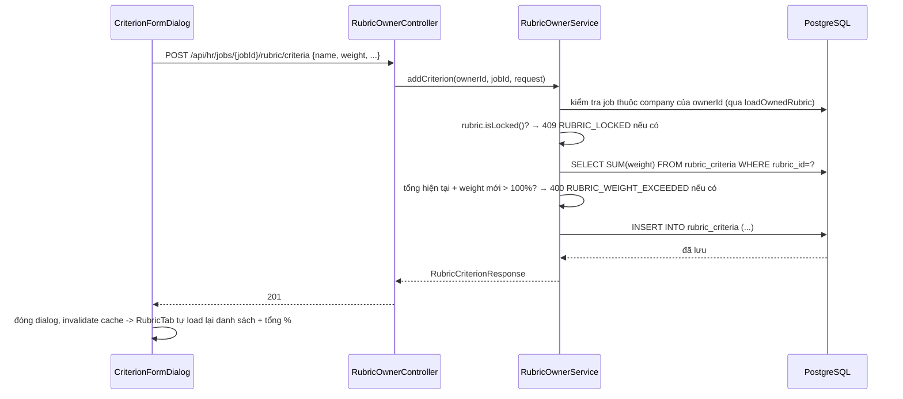
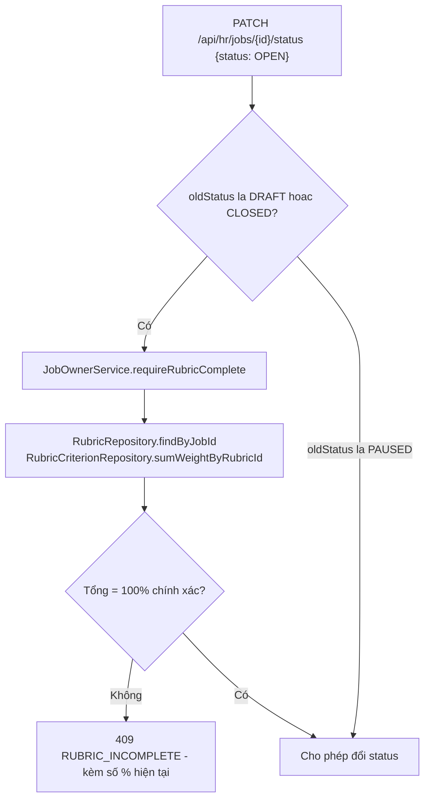

# FR-H03 — Cấu hình Rubric chấm điểm

Phạm vi: commit `02c0a2c` (rubric backend) + phần **rubric** trong commit `38af368` (rubric
frontend: `RubricTab.tsx`, `CriterionRow.tsx`, `CriterionFormDialog.tsx`, tab "Rubric chấm điểm"
trong `HrJobEditPage.tsx`, nút "Thiết lập sau"/"Xong"). Hai commit này nằm tuyến tính trên nhánh
`feat/fr-h03-rubric` hiện tại. Phần **job** của `38af368` (chặn job hết hạn, validate deadline,
sửa submit ngầm, và lỗ hổng DRAFT→PAUSED→OPEN) đã nói ở `feat-fr-h02-jobs.md`, không lặp lại.

## 1. Mục tiêu

FR-H03 cho HR định nghĩa **bộ tiêu chí chấm điểm** cho mỗi tin tuyển dụng: tên tiêu chí, mô tả,
trọng số (%), thang điểm tối đa, và tuỳ chọn mô tả riêng cho từng mức điểm. Mỗi Job đã có sẵn một
Rubric rỗng từ lúc tạo (FR-H02) — B3 là nơi HR thêm/sửa/xoá/sắp xếp lại tiêu chí vào rubric đó,
với đúng một ràng buộc cứng: **tổng trọng số không được vượt quá 100%**, và **tin chỉ mở (chuyển
sang OPEN) được khi tổng trọng số đúng bằng 100%**.

Rubric này sau đó sẽ là "đề bài" cho AI chấm điểm CV ở FR-H04 (nhánh sau, chưa viết) — mỗi tiêu
chí ứng với một lần AI chấm riêng lẻ theo đúng nguyên tắc "AI không tính tổng, không xếp hạng"
của dự án (CLAUDE.md mục 2). B3 chưa đụng tới AI, chỉ dựng đúng phần cấu hình dữ liệu đầu vào.

## 2. Các file đã tạo/sửa

### Backend

| File | Vai trò |
|---|---|
| `rubric/RubricCriterion.java` | Entity ánh xạ bảng `rubric_criteria` (đã có sẵn trong `V1__init_schema.sql`, không migration mới ở B3) |
| `rubric/RubricCriterionRepository.java` | `findByRubricIdOrderByDisplayOrderAsc`, `sumWeightByRubricId` (tính tổng trọng số động, không lưu cột riêng) |
| `rubric/RubricOwnerController.java` | 4 endpoint dưới `/api/hr/jobs/{jobId}/rubric` — xem, thêm/sửa/xoá tiêu chí. Không có endpoint sắp xếp hàng loạt |
| `rubric/RubricOwnerService.java` | Nghiệp vụ: kiểm tra quyền sở hữu (qua Job → Company), chặn khi rubric đã khoá, chặn khi trọng số sẽ vượt 100% |
| `rubric/ScaleLevelDescription.java` | `record` cố định `{level, description}` — lưu trong cột JSONB `scale_description`, không phải JSON tự do |
| `rubric/dto/RubricCriterionRequest.java`, `RubricCriterionResponse.java`, `RubricResponse.java` | DTO vào/ra |
| `common/exception/RubricNotFoundException.java`, `RubricCriterionNotFoundException.java`, `RubricLockedException.java`, `RubricWeightExceededException.java`, `RubricIncompleteException.java` | 5 exception nghiệp vụ mới |
| `common/exception/GlobalExceptionHandler.java` (sửa) | 5 handler tương ứng (404/404/409/400/409) |
| `job/JobOwnerService.java` (sửa, thuộc B3 dù nằm trong package `job`) | Thêm `requireRubricComplete()` — gọi từ `changeStatus()` khi `oldStatus` là DRAFT/CLOSED và chuyển sang OPEN |
| `test/rubric/RubricOwnerIntegrationTest.java` (8 test), `test/job/JobOwnerIntegrationTest.java` (thêm test) | Test tích hợp qua `MockMvc` + Postgres thật |

### Frontend

| File | Vai trò |
|---|---|
| `features/rubric/ownerApi.ts`, `ownerQueries.ts`, `ownerTypes.ts` | Gọi API `/hr/jobs/{jobId}/rubric/*`, cache bằng TanStack Query |
| `features/rubric/RubricTab.tsx` | Nội dung tab "Rubric chấm điểm": tổng trọng số, bảng tiêu chí kéo-thả sắp xếp, banner khi rubric đã khoá |
| `features/rubric/CriterionRow.tsx` | Một dòng trong bảng — tên/mô tả, trọng số, thang điểm, nút sửa/xoá |
| `features/rubric/CriterionFormDialog.tsx` | Hộp thoại thêm/sửa tiêu chí, dùng chung 1 component cho cả 2 thao tác, có `useFieldArray` cho danh sách mô tả từng mức điểm |
| `pages/HrJobEditPage.tsx` (sửa) | Thêm `TabsTrigger`/`TabsContent` thứ 3 "Rubric chấm điểm" (2 tab đầu — thông tin tin, mẫu giấy mời — thuộc B2); thêm banner + 2 nút "Thiết lập sau"/"Xong" khi vào từ luồng vừa tạo tin |

## 3. Luồng chính

### Luồng 1 — HR thêm một tiêu chí mới



### Luồng 2 — Mở tin khi rubric chưa đủ 100% (chặn ở JobOwnerService, không phải RubricOwnerService)



Đáng chú ý hai điều:

**Một, vì sao đặt trong `job/JobOwnerService.java`, không đặt trong `rubric/RubricOwnerService.java`**:
ràng buộc này gắn với **hành động mở tin** — một nghiệp vụ của package `job`, rubric chỉ là dữ
liệu bị đọc để kiểm tra, không phải chủ thể của hành động. Đặt trong `JobOwnerService` giữ đúng
ranh giới "chia package theo tính năng" (CLAUDE.md mục 3): `rubric/` chỉ cần biết cách CRUD tiêu
chí của chính nó, không cần biết khái niệm "trạng thái tin tuyển dụng" tồn tại. Nếu đặt method
này trong `RubricOwnerService` (dạng `assertComplete(jobId)` để `JobOwnerService` gọi sang), package
`rubric/` vẫn phải biết `JobOwnerService` gọi nó vì lý do "mở tin" — không giảm được phụ thuộc,
chỉ đổi chiều import. Đánh đổi của cách đã chọn: `JobOwnerService` phải phụ thuộc trực tiếp vào
`RubricRepository`/`RubricCriterionRepository` (import chéo package) — chấp nhận được vì quan hệ
Job–Rubric là 1-1 rõ ràng, không phải phụ thuộc vòng.

**Hai, vì sao chặn `DRAFT→OPEN` và `CLOSED→OPEN` nhưng KHÔNG chặn `PAUSED→OPEN`**: điều kiện ở
`JobOwnerService.changeStatus()` chỉ gọi `requireRubricComplete()` khi `oldStatus == DRAFT ||
oldStatus == CLOSED`. `PAUSED → OPEN` bị loại khỏi điều kiện này **có chủ đích**, theo đúng comment
trong code: đây chỉ là tạm dừng trong CÙNG một đợt tuyển dụng đang chạy, không phải mở đợt mới.
Nếu job đã từng `OPEN` trước khi bị `PAUSED`, rất có thể đã có ứng viên nộp và AI đã chấm điểm ít
nhất một lần — lúc đó rubric đã chuyển `is_locked = true` (cơ chế khoá của B3, xem Quyết định thiết
kế) và HR **không còn cách nào sửa lại tiêu chí cho đủ 100%** nữa (mọi thao tác sửa/thêm/xoá đều bị
chặn bởi `requireNotLocked()`). Nếu vẫn chặn `PAUSED → OPEN` theo tổng trọng số, một tin từng bị
tạm dừng sẽ **vĩnh viễn không mở lại được** — kẹt cứng, không có lối thoát nào cho HR. Đây là đánh
đổi có chủ đích: chấp nhận một kẽ hở lý thuyết (rubric dưới 100% vẫn mở lại được nếu đi qua PAUSED)
để đổi lấy việc không bao giờ khoá cứng HR vào một tin không thể mở lại. Xem `feat-fr-h02-jobs.md`
mục 7 về cách kẽ hở này bị khai thác thành lỗ hổng thật (`DRAFT → PAUSED → OPEN` khi job **chưa hề**
được mở lần nào, nên không có lý do gì để bỏ qua kiểm tra) — đó là lỗi ở phía điều kiện chọn dựa
trên `oldStatus` thay vì dựa trên "đã từng mở chưa", không phải lỗi ở quyết định miễn trừ PAUSED→OPEN
tự thân.

### Luồng 3 — HR sắp xếp lại thứ tự tiêu chí (kéo-thả)

Không có endpoint "sắp xếp hàng loạt" ở backend. `RubricTab.tsx` tự tính danh sách id nào đổi vị
trí sau khi kéo-thả, rồi `useReorderRubricCriteriaMutation` gọi `PUT
/rubric/criteria/{id}` **riêng cho từng tiêu chí có `display_order` thay đổi** (song song bằng
`Promise.all`), giữ nguyên các field khác của tiêu chí đó (kể cả `weight`) — nên không bao giờ vô
tình chạm ngưỡng `RUBRIC_WEIGHT_EXCEEDED` dù các request chạy đồng thời (mỗi request chỉ đổi
`display_order`, biến `weight` gửi kèm là giá trị cũ, không đổi nên tổng không đổi).

### Luồng 4 — Sau khi tạo tin, dẫn HR sang tab Rubric

Tiếp nối `feat-fr-h02-jobs.md` (Luồng 1): sau khi tạo tin thành công, `HrJobCreatePage.tsx` điều
hướng tới `/hr/jobs/{id}/edit?tab=rubric&created=1`. `HrJobEditPage.tsx` đọc 2 query param này:
`tab=rubric` quyết định tab nào được chọn sẵn (`Tabs defaultValue`), `created=1` bật một banner
trung tính ("Tin đã được tạo ở trạng thái Nháp. Thêm tiêu chí đánh giá đủ 100% trọng số để có thể
mở tin tuyển dụng.") và 2 nút "Thiết lập sau"/"Xong" ở cuối tab Rubric — cả hai đều chỉ điều
hướng về `/hr/jobs`, khác nhau ở thông điệp, không khác nhau ở hành vi (xem Quyết định thiết kế).

## 4. Quyết định thiết kế

**`scale_description` là JSONB nhưng theo cấu trúc cố định `List<ScaleLevelDescription>`
(`{level, description}`), không phải JSON tự do hay `Map`**
- Đã chọn: `ScaleLevelDescription` là một Java `record` với 2 field bắt buộc (`level: int > 0`
  qua `@Positive`, `description: String` không rỗng qua `@NotBlank`), Hibernate map thẳng vào cột
  JSONB qua `@JdbcTypeCode(SqlTypes.JSON)`. Toàn bộ danh sách được validate bằng `@Valid
  List<ScaleLevelDescription>` ngay trong `RubricCriterionRequest`.
- Lựa chọn khác: cột JSONB nhận `Map<String, Object>` hoặc `String` JSON tự do, để HR tự do định
  dạng thang điểm theo ý muốn.
- Vì sao: comment trong `ScaleLevelDescription.java` nói rõ mục đích — FR-H04 (D2, chấm điểm AI,
  nhánh sau) cần đọc lại chính xác danh sách này để nhét vào prompt gửi LLM dưới dạng liệt kê theo
  mức, ví dụ:
  ```
  Thang diem rieng cho tieu chi nay:
  - Muc 1: Chua co kinh nghiem
  - Muc 5: Chuyen gia
  ```
  Nếu `scale_description = NULL` (HR không mô tả), D2 dùng một đoạn mô tả thang mặc định dùng
  chung cho mọi tiêu chí không khai báo riêng. Nếu để JSON tự do, D2 phải tự đoán cấu trúc mỗi lần
  đọc (có key nào, kiểu dữ liệu gì) — cấu trúc cố định từ B3 loại bỏ hẳn bước đoán đó, và bắt lỗi
  ngay từ tầng Bean Validation nếu HR gửi thiếu `level`/`description` thay vì để lỗi trôi tới tận
  lúc D2 chạy prompt.

**`CriterionFormDialog` (frontend) và `RubricOwnerService.requireNotExceeding()` (backend) chỉ
chặn khi tổng trọng số SẼ VƯỢT 100%, KHÔNG chặn khi tổng đang THIẾU**
- Đã chọn: `requireNotExceeding()` chỉ ném lỗi khi `total > 100`; rubric có tổng < 100% vẫn lưu
  được bình thường ở cả 2 tầng, chỉ bị chặn ở một chỗ khác duy nhất: lúc HR bấm mở tin (Luồng 2).
  Phía frontend, nút "Lưu" trong `CriterionFormDialog` chỉ disable khi `projectedTotal > 100 +
  1e-9` (dùng epsilon để tránh sai số dấu phẩy động khi so sánh số thập phân).
- Lựa chọn khác: bắt buộc rubric phải "hoàn chỉnh" (tổng gần hoặc đúng 100%) mới cho lưu bất kỳ
  tiêu chí nào.
- Vì sao: comment trong `CriterionFormDialog.tsx` nói rõ — HR xây rubric dần dần qua nhiều lần
  lưu (thêm tiêu chí 1/3, lưu, thêm tiếp tiêu chí 2/3...), tổng trọng số 30% giữa chừng là trạng
  thái làm việc bình thường, không phải lỗi cần cảnh báo đỏ. Ràng buộc "phải đúng 100%" chỉ có ý
  nghĩa tại đúng một thời điểm trong toàn bộ vòng đời rubric: lúc quyết định mở tin cho ứng viên
  nộp hồ sơ — tách biệt hoàn toàn khỏi việc soạn thảo rubric.

**`is_locked` khi bật lên chặn TOÀN BỘ thao tác sửa đổi tiêu chí (thêm/sửa/xoá), không chỉ chặn
riêng việc đổi trọng số**
- Đã chọn: `requireNotLocked()` được gọi ở đầu cả 3 method `addCriterion()`, `updateCriterion()`,
  `deleteCriterion()` trong `RubricOwnerService` — hễ rubric khoá thì cả 3 thao tác đều nhận 409
  `RUBRIC_LOCKED`, kể cả sửa những field vô hại như `description` (không đụng gì tới `weight`
  hay điểm số).
- Lựa chọn khác: chỉ khoá riêng field `weight`/`maxScore`/`scaleDescription` (những thứ ảnh hưởng
  trực tiếp tới cách AI chấm điểm), vẫn cho sửa `name`/`description` (thông tin mô tả thuần tuý,
  không ảnh hưởng kết quả chấm).
- Vì sao: mục đích của khoá là bảo toàn **tính nhất quán của lịch sử chấm điểm** — một khi đã có
  lượt chấm dựa trên một bộ tiêu chí cụ thể, toàn bộ bộ tiêu chí đó (tên, mô tả, thang điểm, trọng
  số) phải được xem là một "phiên bản" cố định, vì `weight_snapshot`/`rubric_snapshot` (theo
  CLAUDE.md mục 7, sẽ dùng ở `scoring_runs`/`criterion_scores` khi FR-H04 triển khai) chụp lại
  toàn bộ ngữ cảnh rubric tại thời điểm chấm, không chỉ mỗi con số trọng số. Cho sửa `name`/
  `description` sau khi đã khoá sẽ khiến bản snapshot cũ và bản hiện tại của rubric kể hai câu
  chuyện khác nhau về "tiêu chí này nghĩa là gì" — dù không đổi điểm số, vẫn làm sai lệch khả năng
  diễn giải lại lịch sử chấm điểm sau này. Chặn toàn bộ là lựa chọn an toàn hơn, đơn giản hơn để
  suy luận, đổi lại HR muốn sửa bất kỳ gì (kể cả lỗi chính tả trong mô tả) đều phải tạo rubric
  phiên bản mới — comment trong schema (`rubrics.is_locked`) xác nhận đúng hướng này: "khoá lại
  khi đã có lượt chấm đầu tiên; muốn sửa thì tạo version mới".

**Ràng buộc "tổng phải đúng 100% mới mở tin" đặt trong `JobOwnerService`, không đặt trong
`RubricOwnerService`**
- Đã chọn: `JobOwnerService.changeStatus()` gọi `requireRubricComplete(jobId)` — một method riêng
  private trong chính `JobOwnerService`, tự query sang `RubricRepository`/
  `RubricCriterionRepository` trực tiếp thay vì gọi qua một method public của
  `RubricOwnerService`.
- Lựa chọn khác: `RubricOwnerService` cung cấp một method public kiểu `assertComplete(jobId)` để
  `JobOwnerService` gọi sang, giữ mọi logic đọc rubric tập trung trong package `rubric/`.
- Vì sao: xem giải thích đầy đủ ở Luồng 2 phía trên — ràng buộc thuộc về hành động "mở tin", một
  nghiệp vụ của `job`, nên đặt method (dù phải tự truy vấn sang bảng của package khác) trong
  `JobOwnerService` giữ đúng tinh thần chia package theo tính năng của CLAUDE.md mục 3: mỗi FR
  code nằm gọn trong một package chịu trách nhiệm chính, các package khác được đọc dữ liệu khi
  cần chứ không cần "biết" về nghiệp vụ của package gọi mình.

**Rubric khoá (`is_locked`) đã có cơ chế đọc/chặn đầy đủ ở B3, nhưng CHƯA có nơi nào set nó thành
`true`**
- Quan sát khi viết tài liệu này (không phải quyết định của B3, mà là hiện trạng cần ghi nhận):
  `RubricOwnerService.requireNotLocked()` đọc `rubric.isLocked()` và chặn đúng khi cờ này bật —
  cơ chế phòng thủ đã sẵn sàng. Nhưng trong toàn bộ codebase hiện tại, `setLocked(true)` **không
  được gọi ở bất kỳ đâu** — `JobOwnerService.create()` chỉ set `setLocked(false)` lúc tạo rubric
  rỗng. Nghĩa là: với code hiện có, `is_locked` không bao giờ tự chuyển thành `true` qua bất kỳ
  luồng nghiệp vụ nào trong ứng dụng (chỉ có thể xảy ra nếu ai đó `UPDATE` thẳng vào DB, hoặc như
  test `lockedRubric_rejectsCriterionMutation` tự set thẳng qua `rubricRepository.save()` để mô
  phỏng). Cờ khoá chỉ thực sự có tác dụng khi FR-H04 (chấm điểm AI, chưa viết) được triển khai và
  gọi `rubric.setLocked(true)` tại lần chấm điểm đầu tiên.

## 5. Ràng buộc SRS đã thực thi

| FR | Ràng buộc | Thực thi ở đâu |
|---|---|---|
| FR-H03 | Tổng trọng số tiêu chí không vượt 100% | `RubricOwnerService.requireNotExceeding()` → 400 `RUBRIC_WEIGHT_EXCEEDED`; test `addCriterion_pushingTotalOver100Percent_isRejected` |
| FR-H03 | Chỉ mở tin khi tổng trọng số đúng 100% (trừ ngoại lệ PAUSED→OPEN có chủ đích) | `JobOwnerService.requireRubricComplete()` → 409 `RUBRIC_INCOMPLETE`; test `changeJobStatusToOpen_withRubricTotalUnder100Percent_isBlocked`. Xem lỗ hổng liên quan ở `feat-fr-h02-jobs.md` mục 7 |
| FR-H03 | Rubric đã khoá (có lượt chấm) thì không sửa được tiêu chí nào (kể cả field không ảnh hưởng điểm) | `RubricOwnerService.requireNotLocked()` → 409 `RUBRIC_LOCKED`; test `lockedRubric_rejectsCriterionMutation`. **Lưu ý**: chưa có luồng nào trong app tự đặt `is_locked=true` — xem mục 4 |
| FR-H03 | Không sửa được rubric của HR khác | `RubricOwnerService.loadOwnedRubric()` — so `job.companyId` với công ty của `ownerId`, ném `AccessDeniedException` → 403; test `hrA_addCriterionToHrBJob_returnsForbidden` |
| CLAUDE.md mục 2 (AI không tính tổng, không xếp hạng) — chuẩn bị dữ liệu cho | `scale_description` cấu trúc cố định để D2 (FR-H04) chấm từng tiêu chí độc lập, không có cơ chế nào trong B3 tự tính điểm tổng | `ScaleLevelDescription.java`, `RubricCriterion.java` |
| Quy ước dự án (CLAUDE.md mục 7) | Không tạo cột/field `verdict`/`label`/`isQualified`/`passed` | Đã soát bằng skill `srs-guard` — không vi phạm |

## 6. Đã kiểm thử gì

**Backend** — `RubricOwnerIntegrationTest` (8 test) qua `MockMvc` + Postgres thật: thêm tiêu chí
không kèm/có mô tả thang điểm, thêm tiêu chí đẩy tổng vượt 100% bị chặn, sửa tiêu chí (xác nhận
trừ trọng số cũ trước khi cộng trọng số mới nên lưu lại giá trị cũ vẫn thành công), mở tin khi
rubric chưa đủ 100% bị chặn, rubric đã khoá thì mọi thao tác sửa đổi bị chặn, HR A không thêm được
tiêu chí vào job của HR B, xem rubric trả đúng danh sách tiêu chí + tổng trọng số. `mvn test` chạy
xanh toàn bộ ở lần chạy gần nhất.

**Frontend** — `tsc --noEmit`, `npm run lint`, `npm run build` sạch.

**Test tay bằng Playwright thật (Chromium headless)**, chạy trong phiên làm việc viết `38af368`,
đăng nhập bằng tài khoản HR tạo qua API, tạo job + 1 tiêu chí ("css" / trọng số 30% / mô tả "50")
qua API để có dữ liệu, rồi mở `/hr/jobs/{id}/edit?tab=rubric&created=1` qua trình duyệt thật:
- Banner "Tin đã được tạo ở trạng thái Nháp..." hiện đúng, tab "Rubric chấm điểm" được chọn sẵn.
- Bảng tiêu chí hiện đúng tên ("css") và mô tả ("50") — xác nhận đây là `description` do người
  dùng tự nhập, không phải lỗi render; mô tả đã được làm nhạt hơn (`text-xs text-ink-muted
  italic`) để không lẫn với tên tiêu chí.
- Bấm nút "Xong" → điều hướng đúng về `/hr/jobs`.

**Chưa kiểm thử / chưa có test tự động**:
- **Ràng buộc `UNIQUE(rubric_id, name)` ở DB** (`uq_criterion_name_per_rubric`,
  `V1__init_schema.sql:130`) — thêm 2 tiêu chí trùng tên trong cùng rubric khiến Hibernate ném
  `DataIntegrityViolationException`. `GlobalExceptionHandler.handleDataIntegrityViolation()` hiện
  **chỉ nhận diện được đúng 1 chuỗi constraint** (`uq_company_per_owner`, dùng cho company) — vi
  phạm `uq_criterion_name_per_rubric` rơi vào nhánh `throw ex`, tức lỗi 500 mặc định của Spring
  Boot thay vì một lỗi 409 dễ hiểu như các ràng buộc khác của rubric. Không có test nào phủ tình
  huống này. Hướng vá đã bàn (thêm một nhánh kiểm tra chuỗi `uq_criterion_name_per_rubric` trong
  cùng handler, trả `RUBRIC_CRITERION_NAME_DUPLICATE` 409) nhưng **chưa có trong code hiện tại**.
- **Kéo-thả sắp xếp lại tiêu chí (Luồng 3) qua UI thật** — cơ chế đã đọc hiểu từ code
  (`useReorderRubricCriteriaMutation`), nhưng chưa thao tác tay kéo-thả trên trình duyệt trong
  phiên làm việc để xác nhận UI mượt và thứ tự lưu đúng.
- **Sửa tiêu chí khi rubric đã khoá qua UI thật** — có test tích hợp backend
  (`lockedRubric_rejectsCriterionMutation`), nhưng vì `is_locked` hiện không có đường nào tự bật
  lên `true` trong ứng dụng (xem mục 4), chưa có cách nào tạo được tình huống này qua UI thật để
  xác nhận thông báo lỗi hiển thị đúng — chỉ xác nhận được qua test backend gọi thẳng DB.

## 7. Nợ kỹ thuật

- **`uq_criterion_name_per_rubric` chưa được map sang lỗi 409 thân thiện** — xem mục 6, đây là
  khoảng trống ưu tiên xử lý trước khi coi B3 hoàn thiện, vì hiện tại HR đặt trùng tên tiêu chí sẽ
  nhận lỗi 500 khó hiểu thay vì thông báo rõ ràng.
- **Không có endpoint sắp xếp hàng loạt** — kéo-thả gọi N request `PUT` riêng lẻ (N = số tiêu chí
  đổi vị trí), chấp nhận được vì rubric mỗi tin thường chỉ vài tiêu chí, nhưng sẽ không mở rộng
  tốt nếu sau này rubric có hàng chục tiêu chí.
- **`Rubric.name` (cột `name` trên bảng `rubrics`) chưa được dùng ở đâu** — không có form nào cho
  HR đặt tên rubric, `JobOwnerService.create()` không set giá trị này (giữ `NULL`). Có thể dành
  cho tính năng "rubric version" sau này (đặt tên "Rubric v2" khi tạo bản mới sau khi bản cũ bị
  khoá) — không xác định được từ lịch sử liệu đây có phải chủ đích hay chỉ là cột chưa dùng tới.
- **Cơ chế khoá rubric (`is_locked`) chưa có ai bật** — như đã nêu ở mục 4, đây không hẳn là nợ kỹ
  thuật của B3 (đúng phạm vi B3 là chuẩn bị sẵn phần tôn trọng cờ khoá), nhưng cần nhớ khi triển
  khai FR-H04: phải gọi `rubric.setLocked(true)` tại đúng thời điểm "lượt chấm điểm đầu tiên",
  nếu không toàn bộ cơ chế bảo vệ lịch sử chấm điểm sẽ không có tác dụng thực tế — bao gồm cả điểm
  miễn trừ `PAUSED→OPEN` ở mục 4, vốn giả định rằng rubric CÓ THỂ đã khoá tại thời điểm đó.
