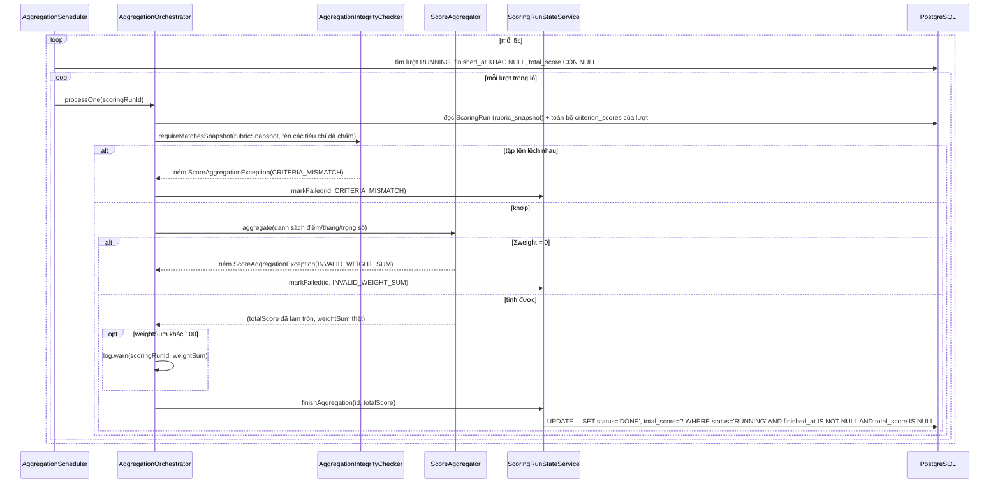

# FR-H05 — Tổng hợp điểm & Xếp hạng ứng viên (Aggregation)

Nhánh `feat/fr-h05-aggregate` (D3), xếp chồng trên `feat/fr-h04-scoring` (D2) và `feat/fr-c04-parsing`
(D1) — cả hai đều chưa gộp vào `main` tại thời điểm viết tài liệu này.

## 1. Mục tiêu

D2 đã chấm xong từng tiêu chí của rubric bằng AI (mỗi tiêu chí một lần gọi LLM riêng, kèm điểm và
evidence), nhưng cố ý dừng lại ở đó — không cộng điểm, không xếp hạng. D3 làm nốt phần còn lại:
cộng điểm từng tiêu chí theo đúng trọng số HR đã cấu hình thành một tổng điểm duy nhất, rồi xếp
ứng viên của cùng một tin tuyển dụng theo tổng điểm đó. Toàn bộ phép tính là **Java thuần, không gọi
LLM ở bất kỳ đâu** — đây là phép cộng có trọng số xác định, ai cũng kiểm chứng lại được bằng máy
tính bỏ túi, khác hẳn với D2 (chấm điểm ngữ nghĩa, cần AI). D3 cũng mở rộng màn hình danh sách ứng
viên của HR để hiện thêm hạng, tổng điểm, và cho xem lại điểm/giải thích của từng tiêu chí.

## 2. Các file đã tạo/sửa

### Backend — tính tổng điểm (Java thuần, `scoring/`)

| File | Vai trò |
|---|---|
| `ScoreAggregator.java` | Hàm tĩnh `aggregate()` — công thức `total = Σ(score_i/max_i×weight_i) / Σweight_i × 100`, BigDecimal toàn bộ, làm tròn đúng một lần ở cuối |
| `CriterionScoreInput.java` | Record input cho `ScoreAggregator` — chỉ 3 trường số, cố ý không có `criterionId` |
| `AggregationResult.java` | Record kết quả — `totalScore` (đã làm tròn) + `weightSum` (giá trị thật, để tầng gọi cảnh báo khi lệch 100) |
| `AggregationIntegrityChecker.java` | Kiểm tập tên tiêu chí đã chấm khớp đúng tập tên trong `rubric_snapshot` của chính lượt đó, trước khi cho cộng |
| `ScoreAggregationErrorCode.java` / `ScoreAggregationException.java` | Mã lỗi chuẩn hoá (`CRITERIA_MISMATCH`, `INVALID_WEIGHT_SUM`, `UNEXPECTED_ERROR`) và exception mang mã đó |

### Backend — job nền tổng hợp (`scoring/`)

| File | Vai trò |
|---|---|
| `AggregationOrchestrator.java` | Điều phối một lượt: đọc dữ liệu → kiểm toàn vẹn → gọi `ScoreAggregator` → ghi kết quả. Không `@Transactional`, không claim |
| `AggregationScheduler.java` | `@Scheduled` quét các lượt thoả điều kiện theo lô, mỗi 5 giây (`app.aggregation.poll-interval-ms`) |
| `ScoringRun.java` (sửa) | Thêm field `totalScore` — D2 cố ý không map cột này, D3 là nhánh được phép thêm |
| `ScoringRunRepository.java` (sửa) | Thêm query nhặt lượt cần tổng hợp, `finishAggregation` (UPDATE có điều kiện ghi `total_score`+`status=DONE`), `findLatestDoneByApplicationIdIn` |
| `CriterionScoreRepository.java` (sửa) | Thêm `findByScoringRunId`/`findByScoringRunIdIn` — đọc điểm từng tiêu chí theo lô, tránh N+1 |
| `ScoringRunStateService.java` (sửa) | Thêm `finishAggregation()`; **sửa `markFailed`** để không ghi đè `finished_at` đã có sẵn (chi tiết ở mục 4h) |
| `LatestDoneScoringRunView.java` | Projection cho query native lấy lượt DONE mới nhất mỗi đơn |

### Backend — endpoint danh sách cho HR (mở rộng `jobapplication/`)

| File | Vai trò |
|---|---|
| `ApplicationOwnerService.java` (sửa) | Viết lại `listApplications`: gộp dữ liệu từ nhiều bảng, gán hạng bằng Java, sắp xếp theo tham số |
| `ApplicationOwnerController.java` (sửa) | Thêm tham số `?sort=` |
| `ApplicationSortOption.java` | Enum `TOTAL_SCORE_DESC`/`APPLIED_AT_DESC` |
| `dto/ApplicationHrListItemResponse.java` (sửa) | Thêm `totalScore`, `rank`, `criterionScores` (record lồng, không có `evidence`) |

### Frontend (`features/scoring/`)

| File | Vai trò |
|---|---|
| `types.ts` / `api.ts` (sửa) | Thêm kiểu `CriterionScoreItem`, `ApplicationSortOption`; `sort` gửi qua query param |
| `queries.ts` (sửa) | **Sửa điều kiện dừng polling** để chờ đúng qua giai đoạn D3 (chi tiết ở mục 4g) |
| `CriterionScoreBreakdown.tsx` | Mới — danh sách tiêu chí có thể mở rộng xem `reasoning`, kèm nhãn theo Q6 |
| `ApplicationsTab.tsx` (sửa) | Thêm điều khiển sắp xếp, cột Hạng/Tổng điểm, chevron mở rộng |

## 3. Luồng chính

D3 có hai luồng tách biệt, không chung một request nào: luồng nền tính điểm, và luồng đọc khi HR
mở màn hình.

### Luồng 1 — Job nền tổng hợp điểm



Mọi `RuntimeException` không lường trước trong `processOne` (ví dụ `rubric_snapshot` rỗng do dữ
liệu hỏng) đều bị bắt lại và chuyển thành `markFailed(UNEXPECTED_ERROR)` — không để lượt cham kẹt
vô thời hạn (mục 4f giải thích vì sao hậu quả ở đây nhẹ hơn cùng cơ chế ở D2).

### Luồng 2 — HR mở tab "Ứng viên"

```mermaid
sequenceDiagram
    participant FE as ApplicationsTab
    participant C as ApplicationOwnerController
    participant S as ApplicationOwnerService
    participant DB as PostgreSQL

    FE->>C: GET /api/hr/jobs/{jobId}/applications?sort=total_score,desc
    C->>S: listApplications(ownerId, jobId, sort)
    S->>DB: kiểm job thuộc công ty của HR (không đổi từ D2)
    S->>DB: danh sách đơn + resume + candidate (3 query theo lô, không đổi từ D2)
    S->>DB: lượt cham GẦN NHẤT mỗi đơn (tiến độ hiển thị, không đổi từ D2)
    S->>DB: lượt DONE MỚI NHẤT mỗi đơn (nguồn điểm — Q5)
    S->>DB: ScoringRun đầy đủ của các lượt DONE đó (chỉ để đọc rubric_snapshot, xác định thứ tự tiêu chí)
    S->>DB: criterion_scores của các lượt DONE đó (theo lô)
    S->>S: gộp thành từng dòng, gán hạng kiểu 1-2-2-4 (Java, không SQL window function)
    S->>S: sắp xếp theo tham số sort
    S-->>C: danh sách đã có totalScore/rank/criterionScores
    C-->>FE: 200 OK
    FE->>FE: hiện Hạng/Tổng điểm; bấm dòng mở điểm từng tiêu chí; bấm tiêu chí mở reasoning
```

Tổng cộng đúng 8 lượt gọi DB cho toàn bộ danh sách, bất kể job có bao nhiêu đơn (2 cho kiểm quyền sở
hữu đã có từ D2, 6 còn lại) — không có vòng lặp nào gọi query bên trong.

## 4. Quyết định thiết kế

**(a) Tổng hợp chạy bằng poller riêng, không gọi thẳng từ `ScoringRunOrchestrator` của D2**
- Đã chọn: `AggregationScheduler` tự quét theo điều kiện `status='RUNNING' AND finished_at IS NOT
  NULL AND total_score IS NULL`, độc lập với vòng lặp của D2.
- Lựa chọn khác: sửa `ScoringRunOrchestrator.doProcess` để tự gọi tổng hợp ngay sau khi ghi xong
  tiêu chí cuối cùng; hoặc tính lúc HR mở màn hình, không lưu.
- Vì sao: cột `total_score` (NUMERIC(6,3)) và `idx_scoring_total` (index cho `status='DONE'`) đã có
  sẵn trong schema từ đầu — ý định gốc rõ ràng là lưu kết quả, không tính lại mỗi lần xem. Gọi thẳng
  từ orchestrator của D2 nghĩa là sửa lại luồng nghiệp vụ của một nhánh đã merge chỉ để tiết kiệm
  một chu kỳ poll (tối đa 5 giây) — không đáng, và đúng lý do `finished_at` được tách khỏi `status`
  từ D2: đó là hàng đợi cho D3 tự nhặt, không phải tín hiệu để D2 gọi tiếp.

**(b) D3 không claim, dựa vào `total_score IS NULL` trong chính UPDATE ghi kết quả làm chốt chặn**
- Đã chọn: `finishAggregation` là một UPDATE có điều kiện duy nhất
  (`WHERE status='RUNNING' AND finished_at IS NOT NULL AND total_score IS NULL`), vừa là bước ghi
  vừa là chốt chặn chống ghi trùng.
- Lựa chọn khác: claim trước như D2 (`UPDATE ... SET status='RUNNING'` trước khi xử lý).
- Vì sao: claim của D2 tồn tại để bảo vệ một lời gọi LLM chậm và tốn kém — tránh gọi hai lần cho
  cùng một tiêu chí trước khi bên nào commit trước. D3 không gọi gì chậm cả: toàn bộ phép tính là
  Java thuần, xác định (cùng input luôn ra cùng kết quả). Nếu hai nhịp poll thật sự chồng nhau (lý
  thuyết), cả hai tính ra đúng cùng một `totalScore`; điều kiện `total_score IS NULL` trong `WHERE`
  đảm bảo chỉ UPDATE đầu tiên thực sự ghi, cái còn lại là no-op an toàn — không cần một bước claim
  riêng để bảo vệ một phép tính không có tác dụng phụ.

**(c) Làm tròn đúng một lần ở cuối, không làm tròn từng tiêu chí rồi cộng**
- Đã chọn: cộng dồn ở độ chính xác cao (`MathContext` 20 chữ số) qua tất cả tiêu chí, chỉ
  `setScale(3, HALF_UP)` một lần duy nhất ở bước cuối.
- Lựa chọn khác: làm tròn kết quả từng tiêu chí (khớp scale của cột `score`/`weight_snapshot`)
  trước khi cộng.
- Vì sao: làm tròn sớm cộng dồn sai số qua nhiều tiêu chí. Test
  `ScoreAggregatorTest#aggregate_roundOnceAtEnd_differsFromRoundingEachCriterionBeforeSumming` dựng
  đúng bộ số chứng minh điều này: ba tiêu chí đều đóng góp giá trị `10.0005` (rơi đúng vào biên làm
  tròn) — cộng trước rồi làm tròn một lần cho `30.002`, còn làm tròn từng tiêu chí trước (`10.001` ×
  3) rồi cộng cho `30.003`. Test này tồn tại để nếu sau này có ai "tối ưu" bằng cách làm tròn sớm,
  nó đỏ ngay lập tức. Test tay
  `ScoreAggregatorTest#aggregate_handComputedThreeCriteria_matchesManualCalculation` cũng xác nhận
  cách làm này khớp với cách một người cầm máy tính tay sẽ làm (cộng hết rồi mới làm tròn).

**(d) Chuẩn hoá bằng Σweight thực tế, không giả định luôn bằng 100; lệch thì `log.warn`, không
`markFailed`**
- Đã chọn: công thức luôn chia cho `Σweight_snapshot` thật sự đọc được, không giả định nó bằng 100.
  Nếu lệch (lý thuyết không xảy ra — đã kiểm đủ 100% lúc tạo lượt chấm — nhưng snapshot là dữ liệu
  cũ không sửa lại được), vẫn cộng bình thường (công thức tự chuẩn hoá đúng), chỉ ghi
  `log.warn(scoringRunId, weightSum)` chứ không đánh `FAILED`. Test
  `ScoreAggregatorTest#aggregate_weightSumNot100_normalizesUsingActualWeightSum` xác nhận công thức
  tự chuẩn hoá đúng khi `Σweight=90`.
- Lựa chọn khác: giả định `Σweight` luôn bằng 100 (viết chết trong công thức); hoặc `markFailed` khi
  phát hiện lệch.
- Vì sao không giả định 100: nếu giả định sai trong một trường hợp hiếm, `total_score` sẽ sai mà
  trông hoàn toàn bình thường — đúng loại lỗi nguy hiểm nhất của hệ thống này. Vì sao chỉ cảnh báo
  chứ không `markFailed`: dữ liệu vẫn tính được đúng theo tỷ lệ (công thức chia cho tổng thật, không
  phải chia cho một hằng số sai), nên không có lý do chặn hẳn kết quả — chỉ cần để lại dấu vết cho
  người vận hành biết dữ liệu cũ có thể có vấn đề. `Σweight=0` (không chia được) mới thực sự
  `markFailed` (`INVALID_WEIGHT_SUM`), vì đó không phải trường hợp "lệch tỷ lệ" mà là "không tính
  được gì cả".

**(e) Hoà điểm thì cùng hạng (1-2-2-4), không tách bằng tiêu chí phụ**
- Đã chọn: hai đơn cùng `total_score` nhận cùng số hạng; hạng kế tiếp nhảy đúng theo vị trí thực tế
  (đơn thứ tư nhận hạng 4, không phải 3). `applied_at` tăng dần chỉ quyết định **thứ tự hiển thị**
  giữa các đơn đồng hạng, không ảnh hưởng con số hạng. Test
  `ApplicationOwnerServiceTest#listApplications_twoApplicationsTiedScore_shareRankAndNextRankSkipsToFour`
  kiểm đúng kiểu 1-2-2-4.
- Lựa chọn khác: dùng `applied_at` (hoặc một tiêu chí phụ khác) để tách hai đơn hoà điểm ra hai hạng
  liền kề (1-2-3-4).
- Vì sao: đây là phép tính tường minh — hai ứng viên bằng điểm đúng nghĩa là ngang nhau theo đúng
  công thức đã công bố. Xếp một người "nhỉnh hơn" bằng một tiêu chí phụ ẩn (thời gian nộp đơn) sẽ
  trông giống một phán quyết ngầm, đi ngược tinh thần "chỉ xếp hạng theo điểm, không phân loại" của
  FR-H05.

**(f) Hạng tính bằng vòng lặp Java trên danh sách đã sắp, không dùng SQL window function**
- Đã chọn: `ApplicationOwnerService.assignRanks()` — sắp danh sách theo
  `(totalScore desc nulls last, appliedAt asc)` rồi gán hạng bằng một vòng lặp đơn giản.
- Lựa chọn khác: `RANK() OVER (ORDER BY total_score DESC)` ở tầng SQL.
- Vì sao: `ScoreAggregator` đã bắt buộc phải là Java thuần kiểm chứng được bằng tay; đặt việc gán
  hạng (một đoạn logic nhỏ, cùng bản chất "tính toán xác định") ở cùng tầng giữ nhất quán triết lý
  đó, dễ unit-test độc lập không cần Postgres thật. Đánh đổi: một vòng lặp thêm ở tầng ứng dụng thay
  vì đẩy xuống DB — chấp nhận được vì quy mô một job (số ứng viên) không lớn.

**(g) Bug polling liên nhánh phát hiện và sửa ở Đợt 5: điều kiện cũ dừng poll đúng lúc D3 mới bắt
đầu**
- Vấn đề: điều kiện dừng polling ở frontend (từ D2) là `finishedAt === null && status ∈
  {PENDING, RUNNING}`. Nhưng D2 set `finished_at` khác NULL ngay khi chấm xong toàn bộ tiêu chí,
  trong khi `status` vẫn là `RUNNING` chờ D3 (đúng hợp đồng ở CLAUDE.md mục 2b). Với điều kiện cũ,
  biểu thức trên lập tức sai ngay khi D2 vừa xong — frontend dừng tự động cập nhật đúng lúc cửa sổ
  D3 mới mở ra, HR phải tự tải lại trang mới thấy tổng điểm.
- Đã sửa: gộp điều kiện thành `status === 'PENDING' || (status === 'RUNNING' && totalScore ===
  null)`. Vì `finishAggregation` luôn ghi `status=DONE` và `total_score` trong cùng một UPDATE,
  `totalScore === null` là tín hiệu duy nhất bao trùm đúng cả hai giai đoạn xử lý (D2 đang chấm lẫn
  D3 đang chờ tổng hợp), đơn giản hơn bản gốc chứ không phải thêm nhánh.
- Đây là ví dụ cụ thể cho thấy vì sao hợp đồng `finished_at` (bảng ý nghĩa ở CLAUDE.md mục 2b) cần
  được ghi rõ thành văn bản: nếu không có bảng đó, rất dễ lặp lại đúng lỗi này ở một nơi khác đọc
  cùng hai cột nhưng thiếu ngữ cảnh đầy đủ về ý nghĩa của tổ hợp `status`+`finished_at`.

**(h) Sửa `ScoringRunStateService.markFailed` (file của D2) vì có call site mới từ D3 — có test bảo
vệ cả hai call site**
- Vấn đề: `markFailed` (D2) trước đây luôn `run.setFinishedAt(Instant.now())` vô điều kiện. Ở D2,
  điều này vô hại vì mọi call site của D2 gọi `markFailed` khi `finished_at` **còn đang null** (lượt
  chưa từng cham xong). Call site mới của D3 (`AggregationOrchestrator`, khi phát hiện
  `CRITERIA_MISMATCH`/`INVALID_WEIGHT_SUM`) gọi `markFailed` khi `finished_at` **đã có sẵn** từ D2 —
  nếu không sửa, D3 sẽ âm thầm ghi đè mốc "khi nào D2 thực sự chấm xong" bằng thời điểm D3 phát hiện
  lỗi, làm sai lệch audit.
- Đã sửa: chỉ set `finished_at` khi đang `null`. Hành vi của D2 không đổi (mọi call site D2 vẫn thấy
  `finished_at` đang null tại thời điểm gọi).
- **Test bảo vệ cả hai call site, đặt ngay trong file test của D2** (`ScoringRunStateServiceTest.java`,
  không tách sang file mới của D3): `markFailed_finishedAtNullBeforeCall_setsFinishedAtNow` (mô
  phỏng call site D2 — xác nhận hành vi cũ không đổi) và
  `markFailed_finishedAtAlreadySetBeforeCall_keepsOriginalTimestamp` (mô phỏng call site D3 — xác
  nhận mốc cũ được giữ nguyên). Nếu một lượt dọn dẹp sau này thấy hai test này "trùng lặp" hoặc
  "không thuộc về D2" rồi gộp/xoá bớt, lớp bảo vệ duy nhất cho một method dùng chung giữa hai nhánh
  sẽ biến mất mà không ai nhận ra — cả hai đều cần giữ.

**(i) Hiển thị `reasoning`, không phải evidence — nhãn UI xử lý rủi ro "trông giống khuyến nghị"**
- Đã chọn: `CriterionScoreBreakdown` cho mở rộng xem `reasoning` (văn bản D2 đã sinh sẵn, D3 không
  sinh gì mới) khi bấm vào đúng tiêu chí đó — không phải evidence trích dẫn nguyên văn kèm vị trí CV
  (việc đó thuộc D4, chưa làm).
- Lựa chọn khác: không hiển thị gì thêm ngoài điểm số (đúng nghĩa đen của PHASES.md, để evidence
  hoàn toàn cho D4); hoặc lọc/viết lại `reasoning` để đảm bảo an toàn trước khi hiển thị.
- Vì sao hiển thị `reasoning` mà không phải evidence: CLAUDE.md mục 8 cấm "điểm trần trụi không kèm
  evidence khi mở rộng", nhưng PHASES.md giao việc hiển thị evidence cho D4 — bề mặt hoá một field
  đã tồn tại từ D2 (không sinh logic AI mới, không làm hộ D4) hoà giải được cả hai mà không vượt
  phạm vi.
- Rủi ro phải xử lý: `reasoning` là văn bản tự do do LLM sinh, prompt D2 tuy cấm gán nhãn nhưng
  không đảm bảo tuyệt đối câu chữ không đọc như một khuyến nghị (ví dụ "ứng viên này rất phù hợp").
  **Không lọc/sửa nội dung bằng code** (làm vậy là che dấu vết, ngược nguyên tắc audit) — xử lý hoàn
  toàn ở tầng trình bày: nhãn cố định *"Diễn giải của AI cho tiêu chí này — không phải khuyến nghị
  tuyển dụng"* đặt ngay trên đoạn text, chữ nhỏ `text-ink-muted`, không in đậm, không icon cảnh báo;
  và về mặt bố cục, khối này chỉ xuất hiện khi mở rộng đúng tiêu chí đó, tách hẳn không gian khỏi
  hai cột Hạng/Tổng điểm — không đặt gần nhau để tránh gợi liên tưởng đây là kết luận chung về ứng
  viên.

## 5. Ràng buộc SRS đã thực thi

| FR / quy ước | Ràng buộc | Thực thi ở đâu |
|---|---|---|
| FR-H05 | Tổng điểm do Backend tính, công thức trọng số tường minh, không AI | `ScoreAggregator.aggregate()` — Java thuần; package `scoring/` không import gì từ `ai/` |
| FR-H05 | Xếp hạng theo điểm, không phân loại/gán nhãn | `ApplicationOwnerService.assignRanks()` chỉ trả về số hạng (`Integer`); không cột/field `verdict`/`label`/`isQualified`/`passed`/`recommendation` ở bất kỳ đâu (đã soát bằng `srs-guard`, 9/9 sạch) |
| FR-H05 | Sửa trọng số rubric sau khi đã chấm không đổi lịch sử đã tính | `ScoreAggregator`/`AggregationOrchestrator`/`ApplicationOwnerService` chỉ đọc `weight_snapshot`/`rubric_snapshot`, không query `rubric_criteria` sống — test `AggregationOrchestratorTest#processOne_rubricWeightChangedAfterDone_totalScoreUnaffectedAndRunNoLongerPickedUp` |
| FR-H05/H06 ranh giới D3/D4 | Không sinh/hiển thị evidence trích dẫn, không sinh báo cáo giải thích mới | `CriterionScoreItem` không có field `evidence`; `reasoning` hiển thị nguyên văn dữ liệu D2 đã có, D3 không gọi LLM |
| CLAUDE.md mục 8 | Màn hình xếp hạng không tô màu theo ngưỡng, không nhãn đạt/không đạt | `ApplicationsTab.tsx` — Hạng/Tổng điểm dùng `className="text-ink"` cố định, không phụ thuộc giá trị; đã soát bằng `srs-guard` mục 4 |
| Quy ước dự án | RBAC + quyền sở hữu bản ghi | `ApplicationOwnerService.loadOwnedJob` — không đổi từ D2 |
| Quy ước dự án | Job nền: state-service ghi riêng, không giữ transaction quanh việc chậm | `AggregationOrchestrator` không `@Transactional`; `ScoringRunStateService.finishAggregation` là transaction ngắn |
| Quy ước dự án | Cột lỗi chỉ mã chuẩn hoá, không output thô | `ScoreAggregationErrorCode implements FormattedErrorCode`; `markFailed(UUID, FormattedErrorCode)` không nhận `String` tự do |

## 6. Đã kiểm thử gì

**Backend tự động** — `mvn test` (toàn bộ suite): **229/229 pass, BUILD SUCCESS**. Riêng phần D3
(9 file mới/sửa test, 41 test):
- `ScoreAggregatorTest` (9) — trọng số bình thường, tiêu chí điểm 0, số lẻ làm tròn, tiêu chí "bị
  xoá" (không có `criterionId`), một bộ số tính tay được (68.667), `Σweight≠100` tự chuẩn hoá,
  `Σweight=0` báo lỗi, danh sách rỗng quy về cùng lỗi, bộ số `10.0005` chứng minh làm tròn một lần
  khác làm tròn từng bước.
- `AggregationIntegrityCheckerTest` (6) — khớp thì qua, thiếu/thừa/sai tên đều báo `CRITERIA_MISMATCH`,
  kể cả trường hợp danh sách có tên trùng khiến so sánh tập hợp đơn thuần bị che khuất.
- `AggregationOrchestratorTest` (6) — tính đúng và giữ nguyên `finished_at`, thiếu một dòng
  `criterion_scores` → `FAILED`, `Σweight=0` → `FAILED`, lỗi không lường trước → vẫn `markFailed`
  (không kẹt), gọi hai lần liên tiếp không ghi đè, sửa rubric sống sau khi đã `DONE` không ảnh hưởng.
- `ScoringRunStateServiceTest` (+4) — hai test bảo vệ guard `finished_at` của `markFailed` (mục 4h),
  hai test cho `finishAggregation` (ghi `total_score`+`status=DONE` cùng lúc; chưa đủ điều kiện thì
  không ghi).
- `ScoringRunRepositoryTest` (+4) — `total_score` round-trip đúng scale 3; query nhặt lượt phân biệt
  đúng 5 tình huống trong một test; `finishAggregation` ở tầng repository (rowcount, gọi lần hai
  trả 0).
- `ApplicationOwnerServiceTest` (8, mới) — rank tuần tự, hoà điểm kiểu 1-2-2-4, đơn chưa
  chấm/FAILED xếp cuối, nguồn điểm là lượt DONE mới nhất (không phải lượt mới nhất tuyệt đối), gọi
  hai lần cho kết quả thứ tự giống hệt, thứ tự tiêu chí theo `rubric_snapshot` chứ không theo thứ tự
  ghi hay bảng chữ cái.
- `ApplicationOwnerControllerIntegrationTest` (+2, sửa 1) — shape response không có `evidence`/
  `verdict`/`label`/... ; tham số `sort` được nhận đúng; sửa lại test cũ của D2 (giờ sai vì D2 cố ý
  không có `totalScore`/`rank`, D3 đã thêm).

**Frontend** — `npm run build` (`tsc -b && vite build`) và `npm run lint` đều sạch.

**Kiểm tay với LLM Anthropic thật (ngoài phạm vi test tự động)** — người dùng đã tự chạy toàn bộ
pipeline D1→D2→D3 với CV thật, gọi LLM Anthropic thật (không mock), cho kết quả:
- Một CV ứng tuyển vị trí frontend: tổng điểm **95.000**, gồm hai tiêu chí HTML (4.50/5, trọng số
  50) và CSS (5.00/5, trọng số 50) — cộng tay: `4.5/5×50 + 5/5×50 = 45 + 50 = 95`, khớp chính xác
  với số hệ thống trả về. Evidence trích nguyên văn khớp từng ký tự kể cả dấu tiếng Việt và cả
  trường hợp câu trích bị PDFBox tách dòng; `section` gán đúng vào ba khối `experience`/`skills`/
  `projects`; `model=claude-sonnet-4-6`, `prompt_version=criterion-score-v1`,
  `token_usage=6241`.
- Đối chiếu: hai lượt cham khác (ứng viên backend, ứng viên data) đều cho kết quả 0 điểm ở các tiêu
  chí không liên quan, evidence rỗng — đúng quy tắc Q2 của D2 (evidence rỗng chỉ hợp lệ khi
  `score=0`, không được bịa).

Đây là lần đầu tiên trong toàn bộ dự án luồng D1→D2→D3 được xác nhận đúng với LLM thật đầu-cuối
(D2 tự công nhận trong walkthrough của mình là "chưa chạy với LLM Anthropic thật" — khoảng trống đó
nay đã được lấp một phần qua lần kiểm tay này).

**Chưa test**:
- **Frontend không có test tự động** cho toàn bộ tính năng mới (sort control, mở rộng hai lớp bảng
  điểm/reasoning, polling qua giai đoạn D3) — chỉ xác nhận được bằng `tsc`/`vite build`/`eslint`,
  chưa có ai bấm qua giao diện thật với backend đang chạy để xác nhận UX (độ trễ thực tế sau khi D2
  xong tới lúc điểm hiện ra, hành vi hai lớp mở rộng lồng nhau không giật layout).
- **Chưa test race condition thật** cho `finishAggregation` (hai tiến trình/luồng thật sự đồng thời
  gọi UPDATE) — test hiện có gọi tuần tự, xác nhận đúng kết quả cuối của điều kiện `WHERE` nhưng
  chưa quan sát trực tiếp hai thao tác cạnh tranh thật.
- **Chưa kiểm tay trên trình duyệt** các ràng buộc thị giác ở CLAUDE.md mục 8 (đã soát bằng
  `srs-guard` ở tầng code, nhưng "trông có phán quyết hay không" cuối cùng cần mắt người).

## 7. Nợ kỹ thuật

**Kế thừa nguyên vẹn từ D2** (chưa xử lý ở D3, không thuộc phạm vi nhánh này):
1. Không có stale-claim reaper cho D1 (`resumes.parse_status=PROCESSING`) và D2
   (`scoring_runs` kẹt `RUNNING`/`finished_at NULL`). Lưu ý: khoản nợ này **không áp dụng tương tự
   cho D3** — vì D3 cố ý không claim (mục 4b), một lượt D3 xử lý dở dang khi JVM crash sẽ được
   nhịp poll kế tiếp tự động thử lại, không kẹt vĩnh viễn như D2/D1.
2. Không có đường thử lại cho `resumes.parse_status=FAILED` do lỗi môi trường tạm thời.
3. `ResumeParsingErrorCode` (D1) chưa implement `common/FormattedErrorCode` — hai enum mới của D3
   (`ScoreAggregationErrorCode`) tiếp tục đúng chuẩn interface này, không lặp lại lệch chuẩn của D1.
4. `ResumeParsingErrorCode.LLM_TIMEOUT` là mã lỗi chết (không đường code nào tạo ra được).

**Không phải nợ, là hạn chế có chủ đích** (đã giải thích ở mục 4, không lặp lại ở đây): không claim
ở D3; chuẩn hoá bằng `Σweight` thật thay vì hằng số 100; hạng tính ở Java thay vì SQL window
function; hiển thị `reasoning` thay vì evidence.

**Phát sinh mới ở D3, nhẹ**:
5. Tổng điểm hiển thị ở frontend làm tròn 2 chữ số thập phân (`toFixed(2)`) trong khi cột DB lưu
   scale 3 (`NUMERIC(6,3)`) — chưa có yêu cầu rõ ràng về độ chính xác hiển thị, chọn 2 chữ số cho
   gọn mắt. Nếu hội đồng muốn thấy đúng độ chính xác đã lưu, đây là một dòng cần đổi, không phải
   thiết kế sâu.
6. Tham số `sort` chỉ nhận đúng hai giá trị cố định (`total_score,desc`/`applied_at,desc`), chưa hỗ
   trợ chiều tăng dần hay lọc/sắp theo điểm một tiêu chí cụ thể — việc đó thuộc phạm vi FR-H08/F3
   (dashboard, đã có index `idx_criterion_scores_filter` dựng sẵn cho mục đích này), cố ý chưa làm
   ở D3.
