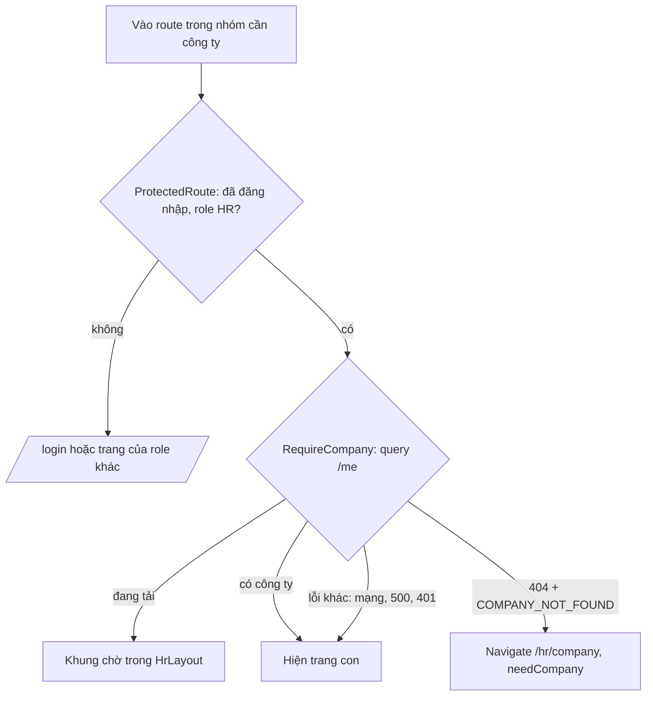

# Walkthrough — `fix/hr-company-onboarding`

Nhánh sửa lỗi, không gắn mã FR, chỉ sửa frontend. Đặc tả là prompt người dùng đã duyệt (không có
REQUIREMENT.md/UI.md). Liên quan tới FR-H01 (hồ sơ doanh nghiệp) và mọi màn hình HR phụ thuộc công
ty (FR-H02, FR-H08...).

## 1. Mục tiêu

Một HR vừa đăng ký chưa có hồ sơ công ty. Trước nhánh này, đăng nhập xong HR luôn bị đưa tới `/hr`
(Dashboard). Trang đó gọi API thống kê, backend trả lỗi vì HR chưa có công ty, và HR chỉ thấy dòng
"Không tải được dữ liệu thống kê" mà không biết phải làm gì. Các trang Tin tuyển dụng và Ứng viên
cũng gặp lỗi tương tự. Nhánh này đổi luồng: HR chưa có công ty vào bất kỳ trang HR nào cần công ty
thì được chuyển tới trang tạo hồ sơ công ty (`/hr/company`), kèm một dòng giải thích vì sao. Tạo
xong công ty, mọi trang HR hoạt động bình thường.

Trong lúc làm, phát hiện thêm một lỗi rò rỉ dữ liệu có sẵn: cache phía trình duyệt không được xoá
khi đổi tài khoản trên cùng tab. Lỗi này cũng được sửa trong nhánh (người dùng đã duyệt).

## 2. Các file đã tạo/sửa

Backend: không đổi (`git diff --stat main -- backend` rỗng).

| File (frontend) | Vai trò |
|---|---|
| `src/features/companies/RequireCompany.tsx` (mới) | Guard: bọc các trang HR cần công ty; đang tải thì hiện khung chờ, chắc chắn "chưa có công ty" thì chuyển tới `/hr/company`, còn lại để trang con tự chạy |
| `src/features/companies/ownerQueries.ts` | Thêm hàm `isCompanyNotCreatedError` (nhận diện đúng lỗi "chưa có công ty") và export `MY_COMPANY_QUERY_KEY` để trang công ty invalidate đúng query |
| `src/App.tsx` | Gom 5 route HR cần công ty vào một layout route dùng `RequireCompany`; `/hr/company` và `/hr/notifications` đứng ngoài nhóm |
| `src/pages/CompanyProfilePage.tsx` | Banner "Bạn cần tạo hồ sơ công ty..." khi chưa có công ty; sau khi tạo mới: invalidate query, ở lại trang, hiện nút "Tới Dashboard" |
| `src/features/auth/AuthContext.tsx` | Xoá toàn bộ cache TanStack Query ở cả 3 lối: đăng nhập, đăng xuất, phiên tự hết hạn |

## 3. Luồng chính

### 3a. Bằng chứng backend (đọc code + curl, không sửa)

`CompanyOwnerService.getMine` ném `CompanyNotFoundException("HR chưa tạo hồ sơ công ty")` khi HR
không có công ty; `GlobalExceptionHandler.handleCompanyNotFound` dịch thành HTTP **404** với body
`{"error":"COMPANY_NOT_FOUND","message":"HR chưa tạo hồ sơ công ty"}`. Chạy curl với một HR mới
đăng ký: `GET /api/hr/companies/me`, `/api/hr/dashboard/stats`, `/api/hr/jobs` đều trả đúng body đó.
Có 12 service khác ném cùng câu này — đó là lý do mọi trang HR cùng hỏng.

### 3b. HR chưa có công ty mở một trang HR

1. HR đăng nhập (`LoginForm`, không đổi) → `AuthContext.login` gọi đăng nhập, lấy thông tin người
   dùng, xoá cache cũ, lưu người dùng → `LoginForm` chuyển tới `/hr` như trước.
2. React Router khớp `/hr` trong nhóm layout route. Phần tử bọc ngoài là `ProtectedRoute` (kiểm đã
   đăng nhập + role HR), bên trong là `RequireCompany`, trong cùng là `Outlet` (chỗ trang con sẽ
   hiện).
3. `RequireCompany` gọi `useMyCompanyQuery` → `GET /api/hr/companies/me` (bảng `companies`, tìm theo
   `owner_id`). Trong lúc chờ: hiện `HrLayout` với ba khối xám nhấp nháy, không nháy trang lỗi.
4. Nhận 404 + `COMPANY_NOT_FOUND` → `isCompanyNotCreatedError` trả true → `Navigate` tới
   `/hr/company`, thay thế lịch sử (`replace`, bấm Back không quay lại trang lỗi), kèm state
   `needCompany: true`. `HrHomePage` **không được render**, nên API dashboard không bị gọi.
5. `CompanyProfilePage` dùng lại cùng query (cùng queryKey, đã có kết quả trong cache → không gọi API
   lần nữa), thấy "chưa có công ty" → hiện banner phía trên form và nút "Tạo hồ sơ công ty".

### 3c. Tạo công ty

1. HR điền form, bấm tạo → `useSaveCompanyMutation` gọi `POST /api/hr/companies` → khi thành công
   ghi thẳng công ty mới vào cache (`setQueryData`, có sẵn từ FR-H01).
2. `CompanyProfilePage.onSubmit` thấy là tạo mới → gọi `invalidateQueries` để đồng bộ lại với backend
   ở nền, rồi **ở lại trang**: banner tự ẩn (đã có `company`), nút "Đổi logo" mở khoá, hiện thông
   báo "Đã tạo hồ sơ công ty" (tự ẩn sau 4 giây như cũ) và nút phụ "Tới Dashboard".
3. HR tải logo (tuỳ chọn), bấm "Tới Dashboard" → `RequireCompany` thấy cache đã có công ty → cho qua
   ngay, Dashboard hiện bình thường.

### 3d. Sơ đồ quyết định của guard

### 3e. Đổi tài khoản trên cùng tab

Đăng xuất (`AuthContext.logout`), phiên tự hết hạn (`http.ts` phát sự kiện `auth:logout` khi refresh
token thất bại → `handleAuthLogout`) và đăng nhập (`AuthContext.login`) đều gọi `queryClient.clear()`
trước khi đặt lại người dùng. Tài khoản kế tiếp bắt đầu với cache rỗng.

## 4. Quyết định thiết kế

### 4a. Guard bằng layout route, không bọc từng route

- **Đã chọn:** một `<Route>` không có `path`, phần tử là `ProtectedRoute` → `RequireCompany` →
  `Outlet`; 5 route cần công ty là route con của nó.
- **Lựa chọn khác:** bọc `RequireCompany` vào từng route (lặp 5 lần); hoặc gọi query công ty trong
  `HrLayout` và chuyển hướng từ đó.
- **Vì sao:** yêu cầu nói "mọi route `/hr/*` mới sau này mặc định cần công ty". Với layout route,
  thêm route mới vào nhóm là tự có guard; quên bọc từng route là lỗi rất dễ lặp lại. Đặt ở
  `HrLayout` thì sai vì `/hr/company` và `/hr/notifications` cũng dùng `HrLayout` — trang tạo công ty
  sẽ tự chuyển hướng về chính nó. Comment trong `App.tsx` ghi rõ quy ước này.

### 4b. Chỉ chuyển hướng khi chắc chắn là "chưa có công ty" — kiểm cả 404 lẫn mã lỗi

- **Đã chọn:** `isCompanyNotCreatedError` yêu cầu đồng thời status 404 **và** `error ===
  'COMPANY_NOT_FOUND'`. Mọi lỗi khác → hiện trang con như bình thường.
- **Lựa chọn khác:** chỉ kiểm 404 (như code cũ của `CompanyProfilePage`); hoặc chuyển hướng với mọi
  lỗi.
- **Vì sao:** 404 có thể đến từ nguyên nhân khác (sai đường dẫn, proxy). Chuyển hướng khi mất mạng
  hay backend 500 sẽ đẩy một HR đã có công ty vào form tạo công ty — họ bấm tạo và nhận 409, rất khó
  hiểu. Lỗi khác để trang con tự hiện thông báo lỗi sẵn có. `CompanyProfilePage` dùng chung hàm này
  nên hai nơi hiểu "chưa có công ty" giống hệt nhau.

### 4c. Dùng lại query "công ty của tôi", không tạo query mới

- **Đã chọn:** guard gọi `useMyCompanyQuery` (queryKey `['hr-company','me']`) có sẵn từ FR-H01.
- **Vì sao:** cùng key nghĩa là TanStack Query chỉ gọi API một lần và chia kết quả cho guard lẫn
  trang công ty; sau khi tạo công ty, `setQueryData` của mutation cập nhật đúng cache mà guard đọc,
  nên guard cho qua ngay mà không cần gọi lại. Query này đã được cấu hình không retry với 404, nên
  chuyển hướng không bị trễ bởi lần thử lại.

### 4d. Ở lại trang sau khi tạo công ty (đặc tả ban đầu sai, đã sửa)

- **Đã chọn:** tạo xong ở lại `/hr/company`, hiện thông báo thành công + nút "Tới Dashboard" (chỉ khi
  vừa tạo mới). Cập nhật công ty giữ nguyên hành vi cũ.
- **Lựa chọn khác:** chuyển ngay tới `/hr` — đây là đặc tả ban đầu và là bản code đầu tiên của Đợt 2.
- **Vì sao:** người dùng phát hiện khi duyệt diff: nút "Đổi logo" chỉ mở khi đã có công ty, nên
  chuyển trang ngay khiến HR mới không tải được logo trong cùng lượt, và mất thông báo "Đã tạo hồ sơ
  công ty". Đặc tả được sửa trước khi commit. Nút "Tới Dashboard" cố ý **không** tự ẩn theo thông báo
  (4 giây) vì tải logo thường lâu hơn thế; nút chỉ ẩn khi lần lưu sau là cập nhật.

### 4e. `queryClient.clear()` ở cả 3 lối thoát

- **Đã chọn:** xoá toàn bộ cache khi đăng nhập, đăng xuất và phiên tự hết hạn.
- **Lựa chọn khác:** thêm `userId` vào queryKey của từng query; hoặc chỉ xoá khi đăng xuất; hoặc
  không sửa và ghi là hạn chế.
- **Vì sao:** trước nhánh này, `logout` chỉ xoá token. Cache có `staleTime` 60 giây, nên đăng xuất
  HR demo rồi đăng nhập HR khác trên cùng tab trong vòng 60 giây thì HR sau **thấy dữ liệu đã cache
  của HR trước** (công ty, dashboard) — rò rỉ dữ liệu giữa hai tài khoản, không chỉ làm hỏng guard
  (guard sẽ đọc nhầm công ty của HR trước và không chuyển hướng). Thêm `userId` vào mọi queryKey phải
  sửa hàng chục query, dễ sót. Xoá ở cả ba lối để mọi đường rời phiên xử lý giống nhau; riêng xoá lúc
  đăng nhập là lớp chặn cuối nếu một lối thoát nào đó bị bỏ sót trong tương lai. Ở `login`, cache chỉ
  bị xoá **sau khi** đăng nhập thành công — đăng nhập sai mật khẩu không ảnh hưởng gì.

### 4f. Giữ nguyên `LoginForm`, `HrLayout`, `ProtectedRoute`, style cũ

- `LoginForm` vẫn chuyển HR tới `/hr`; guard tự xử lý, không nhân đôi logic "có công ty chưa" ở hai
  nơi. Sidebar giữ đủ mục; bấm mục cần công ty thì guard chuyển hướng. Banner dùng style cũ
  (`bg-brand-light text-brand`), không dùng token `m3-*` — đây là màn hình cũ, việc chuyển sang MD3
  thuộc `refactor/ui-md3-legacy` (Phase 2.1b).

## 5. Ràng buộc đã thực thi

| Nguồn | Ràng buộc | Thực thi ở đâu |
|---|---|---|
| Prompt fix (đặc tả đã duyệt) | Route HR cần công ty chuyển tới `/hr/company` khi HR chưa có công ty | `App.tsx` (layout route) + `RequireCompany` |
| Prompt fix | Không bọc `/hr/company`, `/hr/notifications` | `App.tsx` — hai route nằm ngoài nhóm |
| Prompt fix | Chỉ chuyển hướng với đúng lỗi "chưa có công ty"; lỗi khác giữ luồng hiện có | `ownerQueries.isCompanyNotCreatedError` |
| Prompt fix | Không gọi API trùng | `RequireCompany` dùng `useMyCompanyQuery` (cùng queryKey) |
| Prompt fix | Không sửa backend | `git diff --stat main -- backend` rỗng |
| CLAUDE.md §4 | Chuỗi hiển thị tiếng Việt có dấu, comment tiếng Việt không dấu | Banner, nút "Tới Dashboard"; comment trong 5 file |
| CLAUDE.md §4 (RBAC) | Không tin UI đã ẩn nút | Guard chỉ là trải nghiệm; backend vẫn chặn bằng `CompanyNotFoundException` ở 12 service — không đổi |
| Duyệt bổ sung (lỗi rò rỉ) | Tài khoản sau không thấy dữ liệu cache của tài khoản trước | `AuthContext.login`, `logout`, `handleAuthLogout` |

## 6. Đã kiểm thử gì

### Tự động / bằng lệnh

- `npm run build`: exit 0 (cảnh báo chunk > 500 kB có sẵn từ trước, không liên quan).
- `npm run lint`: exit 0.
- `git diff --stat main -- backend`: rỗng — backend không đổi, không cần chạy lại `mvnw test`.
- curl với HR mới (`hr.onboarding.1790701886@example.com`): `GET /api/hr/companies/me`,
  `/api/hr/dashboard/stats`, `/api/hr/jobs` đều trả 404 + `COMPANY_NOT_FOUND` — xác nhận điều kiện
  guard dựa vào.

### Test tay (người dùng thực hiện — Chrome, `npm run dev`)

Tài khoản thử: `hr.onboarding.1790701886@example.com` (a, b, e, c), HR demo (d),
`hr.onboarding2.1790703194@example.com` (f). Thứ tự: (a) → (b) → (e) → (c) → (d) → (f).
**Kết quả: 6/6 đạt, không có lỗi.**

| # | Bước | Kết quả |
|---|---|---|
| a | HR mới đăng nhập → vào thẳng `/hr/company`, thấy banner | Đạt |
| b | Gõ tay `/hr`, `/hr/jobs`, `/hr/candidates` → đều về `/hr/company` | Đạt |
| e | `/hr/notifications` vào được khi chưa có công ty | Đạt |
| c | Tạo công ty → ở lại trang, tải logo ngay, bấm "Tới Dashboard" → dashboard bình thường, sidebar dùng được | Đạt |
| d | HR demo (đã có công ty) → không bị chuyển hướng, mọi trang như cũ | Đạt |
| f | HR demo vào dashboard → đăng xuất → đăng nhập ngay HR mới cùng tab → vào `/hr/company`, không thấy dữ liệu HR demo | Đạt |

### Chưa kiểm thử

- **Không có test tự động nào cho frontend** — dự án chưa cài bộ test frontend (không có vitest/
  testing-library trong `package.json`). Toàn bộ hành vi guard chỉ được chứng minh bằng test tay.
- Lối thoát "phiên tự hết hạn" (`handleAuthLogout`) chưa được kích hoạt thật trong test tay — cần
  đợi refresh token hết hạn hoặc làm hỏng token bằng tay. Code giống hệt `logout`, nhưng chưa quan sát
  trực tiếp.
- Nhánh "lỗi khác (mạng/500) → không chuyển hướng" chưa được dựng lại bằng tay (ví dụ tắt backend
  rồi mở `/hr`).
- `/hr/jobs/new` và `/hr/jobs/:id/edit` không được gõ tay ở bước (b); cùng nằm trong nhóm layout
  route với 3 route đã thử nên dùng chung guard.
- Chưa soát ở khổ điện thoại.

### Đối chiếu "Xong khi" (mục Test của prompt fix)

| Tiêu chí | Cách nghiệm thu | Kết quả |
|---|---|---|
| `npm run build` + `npm run lint` sạch | Chạy sau lần sửa cuối | Đạt |
| Test tay (a) → (e) | Người dùng, bảng trên | Đạt |
| Test tay (f) (bổ sung khi duyệt `queryClient.clear()`) | Người dùng, bảng trên | Đạt |
| Backend không đổi | `git diff --stat main -- backend` rỗng | Đạt |

## 7. Nợ kỹ thuật

- Guard chỉ nhìn kết quả của `/api/hr/companies/me` (có cache 60 giây). Nếu công ty bị xoá mềm ở nơi
  khác trong lúc HR đang dùng, trong tối đa 60 giây các trang HR vẫn hiện lỗi 404 cũ thay vì chuyển
  hướng. Chưa có đường nào trong ứng dụng xoá công ty nên hiện không xảy ra được.
- Khung chờ của guard hiện tiêu đề "Quản trị / Đang tải" trên header vì guard không biết tên trang
  con sắp hiện. Chấp nhận được, có thể làm đẹp ở `refactor/ui-md3-legacy`.
- Hai tài khoản thử `hr.onboarding.*@example.com` đang nằm trong DB dev (một cái đã có công ty). Xoá
  bằng `docker compose down -v` hoặc bỏ qua; không ảnh hưởng dữ liệu demo.
- Frontend chưa có hạ tầng test tự động (xem mục 6) — nợ chung của dự án, không riêng nhánh này.

## 8. Lệch so với đặc tả

Không áp dụng — nhánh fix này không có đặc tả REQUIREMENT.md; đặc tả là prompt người dùng. Ghi lại
cho đầy đủ các chỗ code cuối khác prompt ban đầu, **đều đã được người dùng duyệt trước khi commit**:

- Sau khi tạo công ty: prompt ban đầu "chuyển tới `/hr`" → code cuối ở lại trang + nút "Tới
  Dashboard" (xem 4d).
- Thêm `queryClient.clear()` ở `AuthContext` (ngoài danh sách file của prompt ban đầu) và test tay
  (f) (xem 4e).
