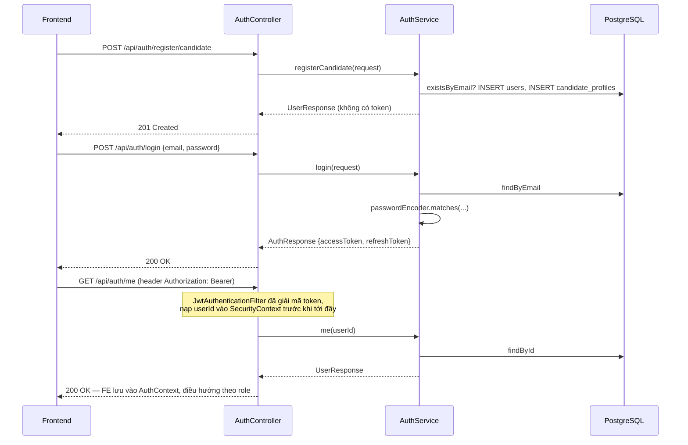
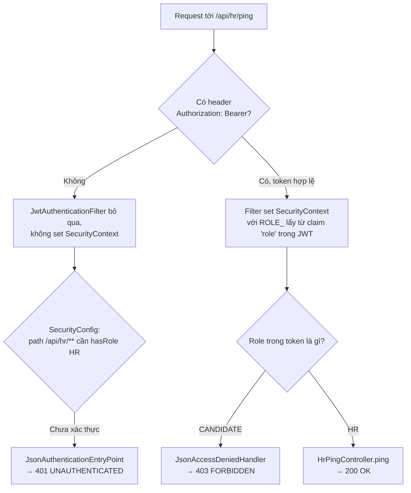
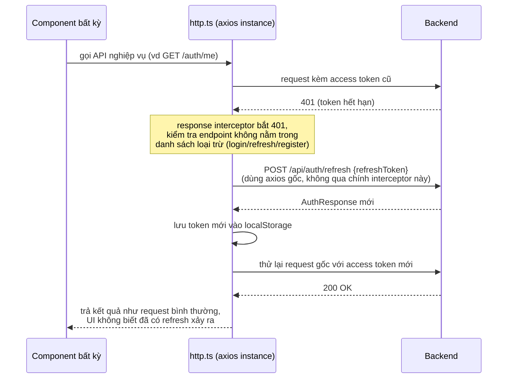

# FR-C01 — Tài khoản & Phân quyền

Nhánh: `feat/fr-c01-auth` · Phase A1 · Backend + Frontend

## 1. Mục tiêu

FR-C01 dựng nền tảng tài khoản mà mọi tính năng khác của hệ thống đứng trên đó: hai loại
tài khoản (Ứng viên và HR) tự đăng ký được, đăng nhập bằng email/mật khẩu, mật khẩu không
bao giờ lưu dạng chữ thường, và mỗi request tới API đều bị kiểm tra quyền thật sự ở phía
server — không phải chỉ ẩn nút trên giao diện. Không có nhánh này thì không có gì để test:
Phase B (HR dựng tin tuyển dụng) cần tài khoản HR, Phase C (ứng viên nộp đơn) cần tài khoản
ứng viên, và toàn bộ AI chấm điểm ở Phase D chỉ chạy được khi đã có dữ liệu từ hai phase đó.

Phạm vi cụ thể: đăng ký, đăng nhập, làm mới token, lấy hồ sơ bản thân (`/me`), và một
endpoint HR thật (`/api/hr/ping`) chỉ để chứng minh việc phân quyền hoạt động — chưa phải
nghiệp vụ HR thật (đó là Phase B).

## 2. Các file đã tạo/sửa

### Backend

| File | Vai trò |
|---|---|
| `auth/AuthController.java` | Tầng REST ngoài cùng: nhận HTTP request đăng ký/đăng nhập/refresh/`/me`, giao xuống `AuthService` |
| `auth/AuthService.java` | Nghiệp vụ: tạo user, băm mật khẩu, kiểm tra đăng nhập, sinh token, xử lý refresh |
| `auth/JwtService.java` | Sinh và giải mã JWT (access + refresh), đọc secret/thời hạn từ `application.yml` |
| `auth/JwtAuthenticationFilter.java` | Chạy trước mọi request: đọc header `Authorization`, nạp thông tin người dùng vào `SecurityContext` nếu token access hợp lệ |
| `auth/SecurityConfig.java` | Khai báo endpoint công khai, luật RBAC theo tiền tố path, gắn filter vào chain |
| `auth/JsonAuthenticationEntryPoint.java` | Trả JSON 401 khi chưa đăng nhập |
| `auth/JsonAccessDeniedHandler.java` | Trả JSON 403 khi đã đăng nhập nhưng sai role |
| `auth/HrPingController.java` | Endpoint `/api/hr/ping` — chỉ để chứng minh RBAC hoạt động thật bằng một request thật |
| `auth/dto/*.java` (6 file) | Ranh giới giữa HTTP và nghiệp vụ; `UserResponse` không bao giờ chứa mật khẩu |
| `user/User.java`, `user/Role.java` | Entity + enum vai trò tài khoản |
| `user/CandidateProfile.java` | Hồ sơ rỗng tạo kèm khi đăng ký ứng viên (điền chi tiết ở C1) |
| `user/UserRepository.java`, `user/CandidateProfileRepository.java` | Truy vấn DB |
| `common/exception/EmailAlreadyExistsException.java`, `GlobalExceptionHandler.java` | Ánh xạ lỗi nghiệp vụ sang đúng mã HTTP (409, 401, 400) |
| `test/auth/AuthIntegrationTest.java` | 11 test tích hợp, Postgres thật qua Testcontainers |

### Frontend

| File | Vai trò |
|---|---|
| `lib/http.ts` | Axios instance dùng chung: tự gắn `Authorization: Bearer`, tự refresh token khi gặp 401 rồi thử lại request một lần |
| `features/auth/types.ts` | Kiểu dữ liệu khớp từng DTO backend |
| `features/auth/api.ts` | Hàm gọi 5 endpoint `/api/auth/*` |
| `features/auth/useAuth.ts` | `React.Context` + type `AuthContextValue` + hook `useAuth()` |
| `features/auth/AuthContext.tsx` | Component `AuthProvider`: giữ user hiện tại, tự khôi phục phiên đăng nhập lúc tải trang, cung cấp `login/logout` |
| `features/auth/LoginForm.tsx` | Form đăng nhập, validate bằng zod |
| `features/auth/RegisterForm.tsx` | Form đăng ký, 2 tab Ứng viên/Nhà tuyển dụng |
| `features/auth/ProtectedRoute.tsx` | Chặn route theo role ở phía client (chỉ là UX — xem mục 7) |
| `pages/LoginPage.tsx`, `RegisterPage.tsx`, `CandidateHomePage.tsx`, `HrHomePage.tsx` | Trang thật gắn vào router |
| `App.tsx` | Khai báo route, bọc toàn app trong `AuthProvider` |

## 3. Luồng chính

### Luồng 1 — Đăng ký ứng viên → đăng nhập → xem hồ sơ

Đăng ký **không** trả token — muốn có token phải gọi `/login` riêng (xem Quyết định 4).

### Luồng 2 — RBAC theo tiền tố path khi gọi `/api/hr/ping`

Ba nhánh cuối (E, H, I) đúng bằng ba trường hợp bắt buộc trong tiêu chí nghiệm thu của
`docs/PHASES.md` mục A1, và đúng bằng ba test `noToken_hrPing_returns401`,
`candidateToken_hrPing_returns403`, `hrToken_hrPing_returns200`.

### Luồng 3 — Frontend tự làm mới access token khi hết hạn

Nếu refresh cũng thất bại (refresh token cũng hết hạn), `http.ts` xoá token và bắn sự kiện
`auth:logout`; `AuthContext` lắng nghe sự kiện này để đặt `user = null`, kéo `ProtectedRoute`
điều hướng người dùng về `/login` ở lần render kế tiếp.

## 4. Quyết định thiết kế

**RBAC bằng tiền tố path trong `SecurityFilterChain`, không phải `@PreAuthorize` trên từng method**
- Đã chọn: khai báo `/api/hr/** → hasRole("HR")`, `/api/candidates/** → hasRole("CANDIDATE")` ngay trong `SecurityConfig`.
- Lựa chọn khác: bật `@PreAuthorize("hasRole('HR')")` trên từng controller method (đã có `@EnableMethodSecurity` sẵn nhưng chưa dùng ở A1).
- Vì sao: tiêu chí nghiệm thu FR-C01 yêu cầu candidate gọi **bất kỳ** endpoint HR nào cũng phải 403 — kể cả những endpoint HR thật chưa được viết (đó là việc của Phase B). Chặn theo tiền tố path ở tầng filter (trước `DispatcherServlet`) đảm bảo điều này đúng ngay cả khi chưa có handler; `@PreAuthorize` chỉ có tác dụng khi request đã match tới một method có gắn annotation. B1 trở đi sẽ bổ sung kiểm tra quyền sở hữu bản ghi (không chỉ role) bằng cách khác.

**Hai handler JSON riêng (`JsonAuthenticationEntryPoint`, `JsonAccessDeniedHandler`) thay vì để Spring Security tự xử lý**
- Đã chọn: viết 2 `@Component` trả `{"error": ..., "message": ...}` dạng JSON.
- Lựa chọn khác: dùng hành vi mặc định của Spring Security khi không cấu hình entry point (thường là trang lỗi HTML hoặc response rỗng).
- Vì sao: đây là API JSON thuần phục vụ SPA, không có `formLogin()`. Không khai báo rõ thì request chưa xác thực rơi vào xử lý mặc định, frontend không parse được. Tách riêng khỏi `GlobalExceptionHandler` (`@RestControllerAdvice`) vì 401/403 do `SecurityFilterChain` chặn xảy ra **trước** khi request tới `DispatcherServlet`, `@ExceptionHandler` không bắt được.

**`JwtAuthenticationFilter` nuốt lỗi token thay vì tự trả 401 ngay trong filter**
- Đã chọn: bắt `JwtException`/`IllegalArgumentException`, không set `SecurityContext`, để request đi tiếp.
- Lựa chọn khác: filter tự trả 401 ngay khi token không hợp lệ.
- Vì sao: token rác/hết hạn không có nghĩa là endpoint đang gọi bắt buộc phải đăng nhập — nếu là endpoint `permitAll()` thì request vẫn nên chạy bình thường. Để một nơi duy nhất (`SecurityConfig` + `authorizeHttpRequests`) quyết định 401/403 theo path, tránh hai tầng cùng quyết định logic phân quyền.

**Đăng ký không trả token — phải gọi `/login` riêng**
- Đã chọn: `registerCandidate`/`registerHr` trả `UserResponse`, không phải `AuthResponse`.
- Lựa chọn khác: auto-login, trả token luôn trong response đăng ký.
- Vì sao: giữ đúng theo hai DTO đã tách sẵn (`UserResponse` cho đăng ký, `AuthResponse` cho đăng nhập). Không phát hành token ngay cho một tài khoản vừa tạo cũng an toàn hơn về nguyên tắc, dù FR-C01 hiện chưa bắt buộc xác minh email trước khi đăng nhập được (xem mục 7).

**Frontend lưu access + refresh token trong `localStorage`, không dùng cookie**
- Đã chọn: `lib/http.ts` đọc/ghi token qua `localStorage`.
- Lựa chọn khác: backend set `httpOnly` cookie, frontend không đụng vào token trực tiếp.
- Vì sao: backend hiện trả token trong JSON body, không set cookie nào. Đổi sang cookie đòi hỏi sửa backend (CORS credentials, `SameSite`) — vượt phạm vi "chỉ làm frontend" của phiên này. Đây là điều đánh đổi theo API đã có sẵn, không phải lựa chọn tối ưu nhất về bảo mật (ghi ở mục 7).

**Một `refreshPromise` dùng chung khi nhiều request 401 cùng lúc**
- Đã chọn: biến cấp module trong `http.ts`, mọi request 401 xảy ra trong lúc đang refresh sẽ đợi chung một promise thay vì tự gọi `/refresh` riêng.
- Lựa chọn khác: mỗi request 401 tự gọi `/refresh` độc lập.
- Vì sao: nếu nhiều request cùng 401 cùng lúc (ví dụ trang gọi vài API song song), gọi `/refresh` nhiều lần chạy đua nhau có thể ghi đè token trong `localStorage` không theo thứ tự mong muốn. Dedupe bằng một promise chung loại bỏ race condition này.

**Tách `createContext` ra `useAuth.ts`, không để chung `AuthContext.tsx`**
- Đã chọn: `useAuth.ts` giữ context object, type `AuthContextValue`, và hook; `AuthContext.tsx` chỉ export component `AuthProvider`.
- Lựa chọn khác: gộp cả hai trong một file (cách viết ban đầu).
- Vì sao: rule `react-refresh/only-export-components` (cấu hình mức lỗi trong `eslint.config.js` của dự án) chặn một file vừa export component vừa export giá trị không phải component, vì phá Fast Refresh của Vite. Không tách thì `npm run lint` fail.

**Không cài `shadcn/ui` dù `CLAUDE.md` liệt kê trong stack**
- Đã chọn: viết input/button bằng class Tailwind thuần, tham chiếu biến trong `@theme` của `index.css`.
- Lựa chọn khác: cài `shadcn/ui` như mô tả gốc trong `CLAUDE.md`.
- Vì sao: chỉ thị phạm vi công việc của phiên này ghi rõ "KHÔNG cài shadcn/ui" — override tường minh so với `CLAUDE.md`, đã xác nhận đây là quyết định chủ động của người dùng chứ không phải mâu thuẫn cần dừng lại hỏi.

## 5. Ràng buộc SRS đã thực thi

| FR | Ràng buộc | Thực thi ở đâu |
|---|---|---|
| FR-C01 | Mật khẩu không lưu dạng plaintext | `AuthService.createUser` dùng `PasswordEncoder` (bean `BCryptPasswordEncoder` trong `SecurityConfig`); DB `password_hash` bắt đầu bằng `$2a$`, kiểm bằng test `passwordIsHashedWithBCrypt` |
| FR-C01 | Mọi endpoint phải kiểm tra role thật, không tin UI đã ẩn nút | `SecurityConfig.securityFilterChain` — luật path-prefix áp dụng ở tầng server, độc lập với `ProtectedRoute` phía frontend; test `candidateToken_hrPing_returns403` gọi thẳng API bằng token candidate, không qua giao diện |
| FR-C01 | Response không bao giờ lộ `password_hash` | `UserResponse` record không có field mật khẩu; test `responseBody_neverContainsPasswordHash` kiểm cả response đăng ký lẫn `/me` |
| FR-C01 | App khởi động được với `ddl-auto: validate` | Field của `User`/`CandidateProfile` khớp từng cột trong `V1__init_schema.sql` (đã đọc lại migration để đối chiếu khi viết walkthrough này) |
| Ranh giới chung (không riêng FR-C01) | Không có cột `verdict`/`label`/`isQualified`/`passed` | `User`, `CandidateProfile`, và toàn bộ DTO trong nhánh này chỉ chứa dữ liệu tài khoản, không chạm vào rubric/scoring |

## 6. Đã kiểm thử gì

**Backend** — `AuthIntegrationTest`, 11 test, chạy trên PostgreSQL thật qua Testcontainers
(image `pgvector/pgvector:pg17`, profile `test`), không dùng H2:
- Đăng ký ứng viên/HR → đăng nhập → `/me` trả đúng role.
- RBAC đủ 3 trường hợp: HR → 200, candidate → 403, không token → 401.
- Mật khẩu băm bằng BCrypt (`$2a$`).
- Đăng ký trùng email → 409.
- Response đăng ký và `/me` không chứa `password_hash` dưới mọi dạng viết.
- Sai mật khẩu → 401.
- Dùng access token gọi `/refresh` → 401 (chặn nhầm loại token).
- Refresh bằng refresh token hợp lệ → nhận access token mới.

**Frontend** — đã chạy `npm run lint` và `npx tsc -b` sau mỗi lần sửa, cả hai đều sạch (0
lỗi) ở thời điểm viết tài liệu này.

**Chưa test**:
- Chưa chạy `npm run dev` để kiểm bằng mắt trong trình duyệt trong phiên làm việc viết
  walkthrough này — người dùng tự chạy dev server ở terminal riêng theo yêu cầu (không cho
  Claude Code chạy tiến trình chạy mãi), và tự kiểm theo danh sách 9 điểm đã thống nhất
  (redirect khi chưa đăng nhập, RBAC ở route, khôi phục phiên sau F5, banner "đăng ký thành
  công" không chồng lỗi 401...). Kết quả kiểm tay đó chưa được xác nhận lại trong hội thoại.
- Refresh token hết hạn thật (hạn 7 ngày) — chỉ test refresh hợp lệ và refresh nhầm loại
  token, chưa có cách giả lập hết hạn trong test.
- Cơ chế dedupe `refreshPromise` khi nhiều request 401 xảy ra đồng thời — có viết logic
  nhưng chưa có test hay quan sát thực tế xác nhận.
- Vai trò `ADMIN` — tồn tại trong enum và `CHECK` constraint của DB nhưng không có endpoint
  đăng ký hay route frontend nào tạo/dùng tài khoản này.
- Test tải, brute-force đăng nhập, hay bất kỳ hình thức rate limiting nào.

## 7. Nợ kỹ thuật

- Token lưu ở `localStorage` thay vì `httpOnly` cookie — có bề mặt tấn công XSS nếu sau này
  thêm một dependency render HTML không kiểm soát. Cân nhắc chuyển sang cookie ở
  `chore/hardening`.
- Không có rate limiting cho `/api/auth/login` — dễ bị brute-force mật khẩu. Đã được liệt kê
  sẵn trong `docs/PHASES.md` mục "Sau Phase F", chưa làm ở A1.
- `email_verified` mặc định `false` nhưng `AuthService.login` chỉ kiểm tra `isActive()`, không
  kiểm tra `emailVerified` — tài khoản chưa xác minh email vẫn đăng nhập được bình thường.
  Không phải bug (FR-C01 chưa yêu cầu gate này), nhưng cần nhớ khi có tính năng xác minh email.
- `ProtectedRoute` chỉ chặn ở phía client để điều hướng UX cho mượt; an toàn thật sự hoàn
  toàn dựa vào `SecurityConfig` ở backend (đúng nguyên tắc CLAUDE.md), nhưng dễ bị hiểu lầm là
  một lớp bảo mật nếu người đọc code sau này không để ý.
- Chưa có "quên mật khẩu" / đổi mật khẩu — ngoài phạm vi FR-C01, chưa có mã FR nào trong
  `docs/PHASES.md` phủ tính năng này tính đến thời điểm viết tài liệu.
