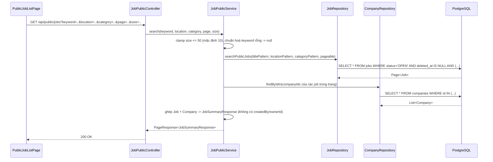
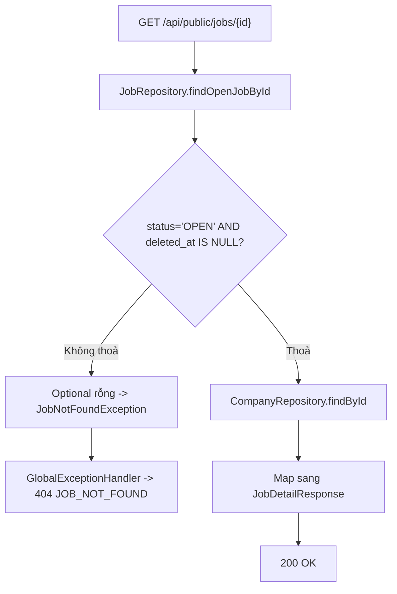
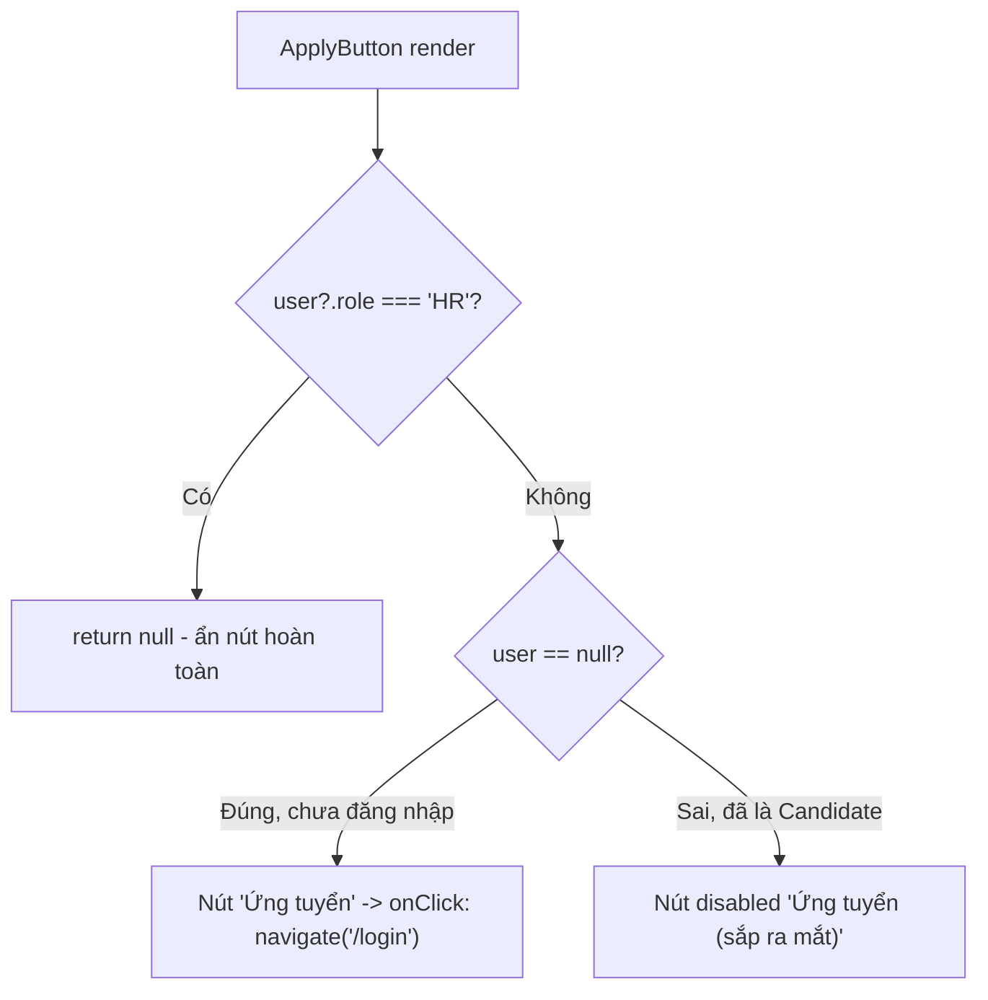

# FR-C02 — Duyệt thông tin công khai

Nhánh: `feat/fr-c02-public-browse` · Phase A2 · Backend + Frontend

## 1. Mục tiêu

FR-C02 cho phép bất kỳ ai — kể cả người chưa đăng nhập — xem được tin tuyển dụng đang mở và
hồ sơ doanh nghiệp trên nền tảng. Đây là "mặt tiền" công khai của sản phẩm: trước khi một ứng
viên chịu đăng ký tài khoản, họ cần thấy được có việc gì đáng để ứng tuyển. Ngược lại, tin
`DRAFT` (HR đang soạn), `PAUSED` (tạm dừng tuyển), `CLOSED` (đã đóng) hoặc đã bị xoá mềm tuyệt
đối không được lộ ra ngoài — đây là ràng buộc quan trọng nhất của nhánh này.

Phạm vi cụ thể: 3 endpoint chỉ đọc (`GET /api/public/jobs` có phân trang + lọc, `GET
/api/public/jobs/{id}`, `GET /api/public/companies/{id}`), và giao diện tương ứng (trang danh
sách có ô tìm kiếm, trang chi tiết việc làm, trang hồ sơ doanh nghiệp). Việc tạo/sửa/xoá
Job/Company thuộc B1/B2, chưa làm ở đây — Job/Company entity trong nhánh này là entity **đầu
tiên** ánh xạ vào 2 bảng đó, nhưng chỉ dùng để đọc.

## 2. Các file đã tạo/sửa

### Backend

| File | Vai trò |
|---|---|
| `job/Job.java`, `job/JobStatus.java` | Entity ánh xạ đầy đủ bảng `jobs` (kể cả `created_by` — xem Quyết định 3), enum trạng thái |
| `job/JobRepository.java` | 2 query native SQL: tìm danh sách theo bộ lọc + phân trang, tìm 1 job theo id — cả hai đều khoá cứng điều kiện `status='OPEN' AND deleted_at IS NULL` |
| `job/JobPublicService.java` | Nghiệp vụ: chuẩn hoá tham số phân trang/lọc, ghép thông tin công ty vào từng job, chuyển entity sang DTO công khai |
| `job/JobPublicController.java` | 2 endpoint `GET /api/public/jobs`, `GET /api/public/jobs/{id}` |
| `job/dto/JobSummaryResponse.java`, `JobDetailResponse.java`, `CompanyRef.java` | DTO công khai — không có field `createdBy`/`recruitmentCycle`/`ownerId` |
| `company/Company.java` | Entity ánh xạ bảng `companies` (không có `deletedAt` — bảng này không hỗ trợ xoá mềm) |
| `company/CompanyRepository.java` | `findByIdIn` để lấy hàng loạt công ty theo danh sách id (dùng khi build job list) |
| `company/CompanyPublicService.java`, `CompanyPublicController.java` | Endpoint `GET /api/public/companies/{id}` |
| `company/dto/CompanyPublicResponse.java` | DTO công khai — không có `ownerId` |
| `common/dto/PageResponse.java` | Wrapper phân trang tự định nghĩa (`items`, `page`, `size`, `totalElements`, `totalPages`), không trả thẳng `Page<T>` của Spring ra JSON |
| `common/exception/JobNotFoundException.java`, `CompanyNotFoundException.java` | Exception nghiệp vụ, ánh xạ sang 404 trong `GlobalExceptionHandler` (sửa thêm 2 `@ExceptionHandler`) |
| `auth/SecurityConfig.java` (sửa) | Thêm đúng 1 dòng: `/api/public/**` vào `permitAll()` |
| `test/job/JobPublicIntegrationTest.java` | 12 test tích hợp qua `MockMvc` + Postgres thật (Testcontainers) |
| `test/job/JobPublicServiceTest.java` | 2 test đơn vị (Mockito) cho logic clamp phân trang và chuẩn hoá từ khoá rỗng |
| `test/BackendApplicationTests.java` (sửa) | Thêm `@ActiveProfiles("test")` — sửa ngoài phạm vi FR-C02, xem mục 7 |

### Frontend

| File | Vai trò |
|---|---|
| `lib/queryClient.ts`, `main.tsx` (sửa) | Cấu hình `QueryClient` và bọc `App` bằng `QueryClientProvider` — lần đầu tiên `@tanstack/react-query` thực sự được dùng trong dự án |
| `features/jobs/types.ts`, `api.ts` | Kiểu dữ liệu khớp DTO backend, hàm gọi `/public/jobs*` |
| `features/jobs/queries.ts` | `useJobsQuery` (danh sách, giữ dữ liệu trang cũ khi đang tải trang mới), `useJobDetailQuery` |
| `features/jobs/JobCard.tsx`, `JobCardSkeleton.tsx` | Thẻ việc làm dạng lưới 2 cột + khung xương lúc tải |
| `features/jobs/JobList.tsx` | Điều phối 4 trạng thái: đang tải / lỗi / rỗng / có dữ liệu |
| `features/jobs/Pagination.tsx`, `HeroSearch.tsx` | Điều hướng trang, ô tìm kiếm 3 trường đồng bộ với URL |
| `features/jobs/ApplyButton.tsx` | Nút "Ứng tuyển" — hành vi khác nhau theo trạng thái đăng nhập, xem Quyết định 11 |
| `features/companies/types.ts`, `api.ts`, `queries.ts`, `CompanyProfileCard.tsx` | Tương tự cho hồ sơ doanh nghiệp |
| `components/layout/PublicHeader.tsx`, `PublicFooter.tsx`, `PublicLayout.tsx` | Khung layout công khai dùng chung cho 3 trang |
| `pages/PublicJobListPage.tsx`, `PublicJobDetailPage.tsx`, `PublicCompanyProfilePage.tsx` | 3 trang thật gắn vào router |
| `App.tsx` (sửa) | Thêm 3 route mới, đổi `*` từ `Navigate to="/login"` sang `Navigate to="/"` |

## 3. Luồng chính

### Luồng 1 — Tìm kiếm/lọc/phân trang danh sách việc làm

`HeroSearch` không tự giữ state tìm kiếm — mỗi lần submit nó ghi thẳng vào query string của
URL (`useSearchParams`), và `PublicJobListPage` đọc lại từ đó. Kết quả: URL luôn phản ánh đúng
bộ lọc đang xem, F5 hay chia sẻ link vẫn ra đúng kết quả.

### Luồng 2 — Xem chi tiết một job (rẽ nhánh 404)

Nhánh D bao trùm **4 trường hợp** cùng lúc: job `DRAFT`, `PAUSED`, `CLOSED`, hoặc job `OPEN`
nhưng đã bị xoá mềm (`deleted_at` khác null) — cả 4 đều rơi vào cùng một điều kiện SQL, không
cần `if/else` riêng từng trường hợp trong Java. Đã xác nhận bằng `curl.exe` với dữ liệu seed
thật (id job `DRAFT`, `PAUSED`, `CLOSED`, và job `OPEN` đã xoá mềm — cả 4 đều trả `HTTP 404`).

### Luồng 3 — Nút "Ứng tuyển" rẽ nhánh theo trạng thái đăng nhập (chỉ frontend)

`ApplyButton` không gọi API nào — nó chỉ đọc `user` từ `useAuth()` (context có sẵn từ FR-C01).
Route nộp đơn thật (`/jobs/:id/apply`) chưa tồn tại, xem Quyết định 11 và mục 7.

## 4. Quyết định thiết kế

**Native SQL với `CAST(:param AS text)` thay vì JPQL**
- Đã chọn: viết `@Query(nativeQuery = true)` cho cả tìm danh sách lẫn tìm 1 job, dùng `ILIKE`
  và ép kiểu tường minh hai vế của mỗi điều kiện `IS NULL OR ILIKE`.
- Lựa chọn khác: JPQL với `LOWER(j.title) LIKE LOWER(:pattern)`, hoặc Spring Data
  Specification/Criteria API.
- Vì sao: cột `title` có index GIN trigram (`idx_jobs_title_trgm`) chỉ tối ưu được cho
  `ILIKE`/`LIKE` trực tiếp trên cột gốc — bọc `LOWER()` quanh cột làm mất tác dụng index. JPQL
  không có `ILIKE`. Về `CAST`: khi tham số truyền vào là `null` (không lọc theo field đó),
  PostgreSQL không tự suy được kiểu dữ liệu của placeholder khi so sánh với `NULL`
  (`could not determine data type of parameter`) — ép kiểu tường minh giải quyết đúng lỗi này,
  đã được chỉ ra và xác nhận trước khi code.

**Cả 3 field lọc (từ khoá/địa điểm/danh mục) đều dùng substring `ILIKE`, kể cả `category`**
- Đã chọn: một cơ chế lọc duy nhất cho cả 3 tham số.
- Lựa chọn khác: `category` so khớp chính xác (exact match), vì về mặt khái niệm nó giống một
  danh mục cố định hơn là văn bản tự do.
- Vì sao: bảng `jobs` không có bảng `categories` chuẩn hoá riêng — cột `category` là
  `VARCHAR(120)` tự do, không có gì đảm bảo giá trị nhập khớp tuyệt đối giữa các tin đăng khác
  nhau. Dùng chung một cơ chế đơn giản hơn "xây dựng luật lọc riêng cho từng field" khi mới có
  đúng 3 field. Nếu sau này frontend chuyển sang dropdown danh mục cố định, chỉ cần đổi bên
  trong `@Query`, không đổi API.

**Không map `@ManyToOne` giữa `Job` và `Company`**
- Đã chọn: `Job.companyId` và `Company.ownerId` là `UUID` thường; service tự query `Company`
  riêng rồi ghép ở tầng DTO.
- Lựa chọn khác: `@ManyToOne @JoinColumn(name = "company_id") private Company company;`
- Vì sao: dự án cấu hình `open-in-view: false` (đã có từ FR-C01), và `CandidateProfile.java`
  đã thiết lập tiền lệ tránh lazy-loading ngoài transaction bằng cách giữ FK là UUID thường.
  Theo đúng tiền lệ đó để nhất quán, thay vì mỗi entity tự chọn cách khác nhau.

**Entity ánh xạ đủ toàn bộ cột (kể cả `created_by`/`owner_id`), nhưng DTO thì không có field đó**
- Đã chọn: `Job`/`Company` entity map hết mọi cột trong bảng; `JobSummaryResponse`,
  `JobDetailResponse`, `CompanyPublicResponse` (đều là `record`) chỉ khai báo field được phép
  công khai.
- Lựa chọn khác: chỉ map field cần dùng vào entity, hoặc map đủ nhưng lọc field nhạy cảm bằng
  cách xoá/null hoá trước khi serialize.
- Vì sao: repository dùng native `SELECT *`, Hibernate bắt buộc mọi cột trả về phải khớp một
  property đã map trong entity, nếu không sẽ lỗi lúc chạy. Việc chặn rò rỉ dữ liệu nằm ở tầng
  DTO — một `record` không khai báo field thì Jackson không có cách nào serialize field đó ra
  JSON, kể cả nếu code sau này vô tình truyền nhầm entity vào chỗ khác. Đây là lớp phòng thủ
  dựa vào hệ thống kiểu, chắc chắn hơn "nhớ phải lọc runtime".

**`PageResponse<T>` tự định nghĩa, có biến thể nhận `Function` để map kiểu**
- Đã chọn: `PageResponse.from(Page<S> page, Function<S, T> mapper)` — map từng phần tử `S`
  (entity) sang `T` (DTO) ngay trong lúc dựng `PageResponse`.
- Lựa chọn khác: `from(Page<T> page)` không nhận mapper, gọi `page.map(...)` riêng bên ngoài
  trước khi truyền vào.
- Vì sao: repository trả `Page<Job>` (entity), nhưng response cuối cùng cần
  `PageResponse<JobSummaryResponse>` (DTO) — không có sẵn `Page<JobSummaryResponse>` nào để
  truyền thẳng. Gộp bước map vào factory method giảm một bước trung gian ở tầng service.

**`Pageable` luôn không kèm `Sort`**
- Đã chọn: `PageRequest.of(page, size)`.
- Lựa chọn khác: truyền `Sort.by("createdAt").descending()` vào `PageRequest`.
- Vì sao: câu native query đã tự viết `ORDER BY j.created_at DESC` sẵn trong SQL. Nếu
  `Pageable` mang thêm `Sort`, Spring Data JPA sẽ cố chèn `ORDER BY` bổ sung vào native query có
  `countQuery` tách riêng — sinh SQL sai. Được chỉ ra và sửa trước khi chạy test.

**`CompanyRef` (id, name, logoUrl) nhúng trong job DTO, không nhúng nguyên `CompanyPublicResponse`**
- Đã chọn: job list/detail chỉ mang theo 3 field định danh công ty.
- Lựa chọn khác: nhúng thẳng `CompanyPublicResponse` đầy đủ (địa chỉ, email liên hệ, website...)
  vào mỗi job.
- Vì sao: danh sách job có thể có hàng chục kết quả, không cần lặp lại toàn bộ hồ sơ công ty ở
  mỗi item. Ai cần xem đủ thông tin công ty thì bấm sang `/api/public/companies/{id}` riêng.

**Test tích hợp seed dữ liệu trực tiếp qua repository, dùng `@Transactional` để rollback**
- Đã chọn: `JobPublicIntegrationTest` tạo User/Company/Job thẳng qua `save()`, class gắn thêm
  `@Transactional` để mỗi `@Test` tự rollback sau khi chạy.
- Lựa chọn khác: giống `AuthIntegrationTest` — không cần `@Transactional`, chỉ cần dữ liệu
  unique (email) để tránh đụng nhau giữa các test.
- Vì sao: chưa có endpoint tạo Company/Job (thuộc B1/B2) nên buộc phải seed thẳng qua
  repository. Khác `AuthIntegrationTest`, các test của FR-C02 cần **đếm chính xác** số lượng
  job trả về (kiểm tra phân trang, kiểm tra job bị lọc đúng) — nếu dữ liệu của test này còn sót
  lại khi test khác chạy trong cùng container Postgres, phép đếm sẽ sai. `@Transactional` đảm
  bảo mỗi test luôn bắt đầu từ database sạch.

**Route `/` trở thành trang danh sách việc làm công khai, đổi đích mặc định của `*`**
- Đã chọn: thêm `<Route path="/" element={<PublicJobListPage />} />`, đổi
  `<Route path="*" element={<Navigate to="/" replace />} />` (trước đó là `/login`).
- Lựa chọn khác: giữ nguyên `*` trỏ về `/login`, chỉ thêm `/jobs` làm route danh sách riêng.
- Vì sao: FR-C01 chưa từng khai báo route `/`, nên trước nhánh này mọi truy cập gốc đều rơi
  vào `*` và bị đẩy thẳng về trang đăng nhập — hợp lý khi chưa có gì để xem công khai. Giờ có
  trang công khai thật, ép người dùng ẩn danh về `/login` ngay khi họ chỉ muốn xem việc làm là
  trải nghiệm sai. Quyết định này đã được hỏi lại và người dùng xác nhận trước khi code.

**Nút "Ứng tuyển" khi đã đăng nhập Candidate: disabled, không điều hướng tới route giả**
- Đã chọn: nếu `user` tồn tại và không phải HR, nút hiển thị ở trạng thái `disabled` với chữ
  "Ứng tuyển (sắp ra mắt)".
- Lựa chọn khác: điều hướng tới `/jobs/:id/apply` dù route đó chưa được khai báo (sẽ rơi vào
  catch-all `*` → về lại `/`).
- Vì sao: yêu cầu ban đầu chỉ ghi rõ hành vi cho trường hợp **chưa đăng nhập**. Điều hướng tới
  một route không tồn tại tạo trải nghiệm gây nhầm lẫn (bấm "Ứng tuyển" nhưng lại quay về trang
  danh sách, không có thông báo gì). Disabled + nhãn rõ ràng trung thực hơn với người dùng thật.
  Quyết định này đã được hỏi lại và xác nhận trước khi code.

## 5. Ràng buộc SRS đã thực thi

| FR | Ràng buộc | Thực thi ở đâu |
|---|---|---|
| FR-C02 | Không cần đăng nhập vẫn xem được | `SecurityConfig` — `/api/public/**` trong `permitAll()`; test `publicJobList_accessibleWithoutToken_returns200` gọi không kèm header `Authorization` |
| FR-C02 (PHASES A2 "Xong khi") | Job `DRAFT`/`PAUSED`/`CLOSED` không xuất hiện | Điều kiện `status = 'OPEN'` khoá cứng trong SQL của `JobRepository.searchPublicJobs` và `findOpenJobById` — không method nào khác trả `Job` ra ngoài mà thiếu điều kiện này |
| FR-C02 (PHASES A2 "AI hay làm sai") | Không lộ thông tin nội bộ (`created_by`, `owner_id`) | `JobSummaryResponse`/`JobDetailResponse`/`CompanyPublicResponse` là `record` không khai báo field đó; xác nhận bằng test `detail_openJob_returnsCompanyInfo_withoutCreatedByOrOwnerId`, `companyDetail_returnsPublicFields_withoutOwnerId`, và `curl.exe` thủ công trên dữ liệu seed thật |
| FR-C02 (PHASES A2 "AI hay làm sai") | Không bỏ phân trang, không `SELECT` toàn bảng | `JobPublicService.safeSize` clamp `size` về tối đa 50 bất kể client gửi gì; xác nhận bằng test Mockito `search_oversizedSize_isClampedToMax` và `curl.exe ?size=100000` trả về `"size":50` |
| Ranh giới chung (đã soát bằng skill `srs-guard` trước walkthrough này) | Không có cột/field `verdict`/`label`/`isQualified`/`passed`; không đụng `ai/`, `scoring/`, consent, rubric snapshot | Toàn bộ entity/DTO trong nhánh này chỉ chứa dữ liệu job/company công khai |

## 6. Đã kiểm thử gì

**Backend** — `JobPublicIntegrationTest` (12 test) + `JobPublicServiceTest` (2 test), tổng
14 test mới, chạy trên Postgres thật qua Testcontainers (`pgvector/pgvector:pg17`, profile
`test`):
- Gọi danh sách không kèm token → 200.
- Seed đủ 5 trạng thái (DRAFT/PAUSED/CLOSED/OPEN+xoá mềm/OPEN hợp lệ) → chỉ job hợp lệ xuất
  hiện trong response.
- Phân trang: 15 job, `size=10` → trang 0 có 10 item + `totalElements=15`/`totalPages=2`, trang
  1 có 5 item còn lại.
- Lọc từ khoá không phân biệt hoa thường, lọc địa điểm, lọc danh mục — mỗi loại một test riêng.
- Chi tiết job `OPEN` → có `company`, không chứa `createdby`/`ownerid` dưới mọi cách viết.
- Chi tiết job `DRAFT`/đã xoá mềm/id không tồn tại → đều 404.
- Hồ sơ công ty → có `contactEmail`, không có `ownerid`; id không tồn tại → 404.
- Unit test: `size` vượt mức bị clamp ≤ 50; từ khoá rỗng truyền `null` (không phải `"%%"`).

Toàn bộ suite backend (26 test, bao gồm 11 test cũ của FR-C01) chạy `.\mvnw.cmd test` xanh.

**Backend, kiểm tra tay bằng `curl.exe`** trên dữ liệu seed thật (`db/seed/dev-seed.sql`, 7 job
trong đó 3 job OPEN còn sống): danh sách trả đúng 3 item; lọc `keyword=Java` ra đúng 1 kết quả;
gọi chi tiết 4 job không hợp lệ (DRAFT, PAUSED, CLOSED, OPEN đã xoá mềm) đều trả `HTTP 404`;
response job/company detail không chứa `created_by`/`owner_id` dưới bất kỳ cách viết nào;
`/api/hr/ping` vẫn trả 401 khi không có token (xác nhận RBAC cũ của FR-C01 không bị ảnh hưởng);
`?size=100000` bị clamp về `"size":50` trong response.

**Frontend** — `npm run build` (`tsc -b && vite build`) và `npm run lint` đều sạch, 0 lỗi.

**Chưa test / chưa xác nhận**:
- Kiểm tra bằng mắt trong trình duyệt (`npm run dev`) — người dùng tự chạy dev server ở
  terminal riêng theo đúng cách làm đã thống nhất từ FR-C01, kết quả kiểm tay đó **chưa được
  xác nhận lại** trong hội thoại tính đến thời điểm viết tài liệu này.
- Không có framework test frontend nào trong dự án (không vitest) — không tự thêm, giống
  FR-C01.
- Chưa test đồng thời nhiều filter cùng lúc (vd `keyword` + `location` + `category` cùng một
  request) — mỗi test chỉ kiểm một field lọc riêng lẻ.
- Chưa test race condition khi người dùng đổi trang rất nhanh (nhiều request `useJobsQuery`
  chồng nhau) — có dùng `placeholderData: keepPreviousData` của TanStack Query để giảm nháy
  giao diện nhưng chưa quan sát thực tế.

## 7. Nợ kỹ thuật

- **Lỗi cú pháp Tailwind v4 có sẵn từ FR-C01, chưa sửa**: `RegisterPage.tsx`, `LoginPage.tsx`,
  `LoginForm.tsx`, `RegisterForm.tsx` đang dùng `rounded-[--radius-card]`/`rounded-[--radius-badge]`
  (cú pháp Tailwind v3, ngoặc vuông). Dự án dùng Tailwind v4 (`@tailwindcss/vite`), cú pháp
  đúng để tham chiếu biến CSS là ngoặc tròn: `rounded-(--radius-card)`. Ngoặc vuông sinh ra CSS
  không hợp lệ (`border-radius: --radius-card`), không báo lỗi nhưng bo góc token hiện **không
  có tác dụng** ở 4 file đó. Phát hiện trong lúc viết code FR-C02, đã sửa đúng cú pháp cho toàn
  bộ file mới của nhánh này, nhưng **không đụng vào 4 file của FR-C01** vì ngoài phạm vi đã
  duyệt. Cần một nhánh dọn dẹp riêng để sửa.
- **Nút "Ứng tuyển" cho Candidate đã đăng nhập chỉ là placeholder disabled** — route nộp đơn
  thật (`/jobs/:id/apply`, thuộc FR-U02/phase C2) chưa tồn tại. Khi C2 làm xong, cần quay lại
  `ApplyButton.tsx` để nối luồng thật.
- **Lọc `category` là so khớp chuỗi con (`ILIKE '%...%'`), không phải khớp chính xác** — vì
  chưa có bảng danh mục chuẩn hoá. Nếu sau này thêm bảng `categories` hoặc đổi frontend sang
  dropdown cố định, cần đổi lại điều kiện lọc trong `JobRepository`.
- **Sửa `test/BackendApplicationTests.java`** (thêm `@ActiveProfiles("test")`) nằm ngoài kế
  hoạch ban đầu của FR-C02 — phát hiện file này fail vì thiếu biến môi trường `JWT_SECRET` khi
  chạy toàn bộ suite test, đã hỏi lại và được yêu cầu sửa để giữ suite test luôn xanh. Đây là
  gỡ nợ của FR-C01 (thiếu annotation profile), không phải logic nghiệp vụ mới.
- **Định dạng lương (`formatSalary`) viết trùng lặp** ở `JobCard.tsx` và
  `PublicJobDetailPage.tsx` — cùng logic, hai nơi khác nhau. Chưa tách hàm dùng chung vì mỗi
  bản chỉ ~10 dòng; nếu logic phức tạp hơn (nhiều loại tiền tệ, làm tròn khác nhau) nên gộp lại
  một chỗ.
