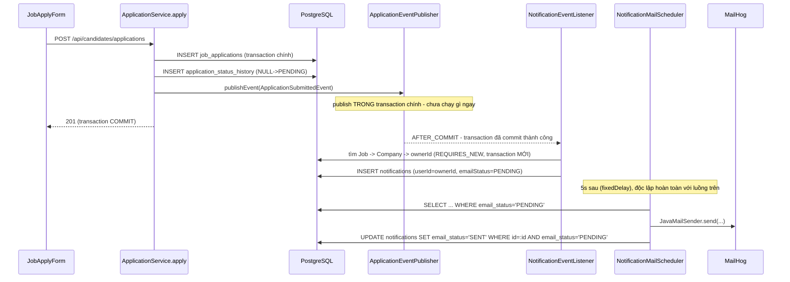
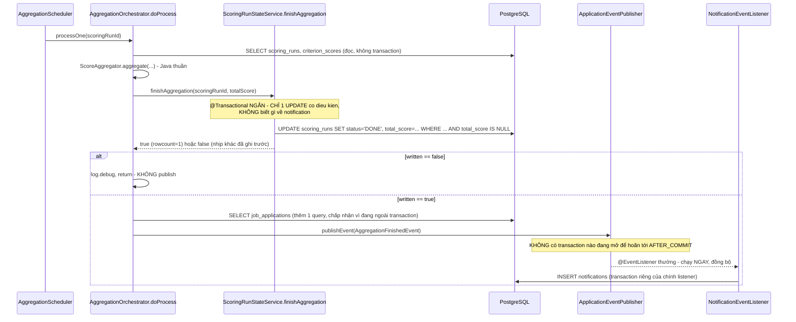

# FR-C03 — Hệ thống thông báo (E2)

Nhánh `feat/fr-c03-notification` (E2), xếp chồng trên `feat/fr-h07-pipeline` (E1) — E1 đã hoàn thành
và đẩy lên remote nhưng **chưa gộp vào `main`** tại thời điểm viết tài liệu này, nên nhánh E2 rẽ
trực tiếp từ E1 chứ không từ `main`.

## 1. Mục tiêu

Đến E1, HR đã có thể đổi trạng thái đơn (mời phỏng vấn, trúng tuyển, từ chối), và ứng viên đã có
thể nộp/rút đơn (Phase C) — nhưng không bên nào biết việc đó vừa xảy ra trừ khi tự vào lại trang mà
kiểm tra. E2 đóng khoảng trống đó: bốn sự kiện nghiệp vụ (đơn mới, rút đơn, đổi trạng thái, một đợt
chấm điểm hoàn tất) sinh ra một dòng thông báo trong ứng dụng (chuông + badge số chưa đọc) và một
email tương ứng (MailHog ở môi trường dev). Người nhận: ứng viên khi đơn của họ đổi trạng thái; HR
sở hữu công ty khi có đơn mới, khi ứng viên rút đơn, hoặc khi một đợt chấm điểm xong.

Ràng buộc quan trọng nhất xuyên suốt nhánh: nội dung thông báo **không được** làm rò rỉ điều mà HR
chưa quyết định cho ứng viên — cụ thể, thông báo cho ứng viên chỉ được nói "đơn của bạn đã chuyển
sang trạng thái X", tuyệt đối không kèm điểm số, thứ hạng, hay bất kỳ nhận xét nội bộ nào của HR
(đúng CLAUDE.md mục 8). Ràng buộc thứ hai, ít hiển nhiên hơn nhưng chi phối gần hết các quyết định
kỹ thuật của nhánh: gửi email phải tách hẳn khỏi transaction ghi nghiệp vụ chính — không được để lỗi
SMTP hay độ trễ mạng làm rollback một lần đổi trạng thái đơn đã hợp lệ.

Nhánh chia làm 4 đợt: đợt 1 dựng tầng dữ liệu + API đọc/đánh dấu-đã-đọc (chưa nối vào luồng nghiệp
vụ thật), đợt 2 nối 4 sự kiện Spring Events vào 3 service nghiệp vụ đã có sẵn, đợt 3a dựng poller
gửi email, đợt 3b dựng frontend (chuông, badge, dropdown, trang xem tất cả), đợt 4 soát + tài liệu.

## 2. Các file đã tạo/sửa

### Backend — tầng dữ liệu + API đọc thông báo (`notification/`, package mới, đợt 1)

| File | Vai trò |
|---|---|
| `Notification.java` | Entity bảng `notifications` (đã có sẵn từ `V1__init_schema.sql`, không migration mới) |
| `NotificationType.java` | Enum 4 loại sự kiện — `APPLICATION_STATUS_CHANGED`, `APPLICATION_SUBMITTED`, `APPLICATION_WITHDRAWN`, `SCORING_FINISHED` |
| `EmailStatus.java` | Enum khớp đúng 4 giá trị CHECK constraint của `email_status` — `PENDING`, `SENT`, `FAILED`, `SKIPPED` |
| `NotificationRepository.java` | `findByUserIdOrderByCreatedAtDesc` (phân trang), `countByUserIdAndReadFalse`; đợt 3a thêm `findByEmailStatus`, `markSentIfPending`, `markFailedIfPending` |
| `NotificationService.java` | `list(userId, page, size)` — trả `PageResponse` + `unreadCount` gộp chung; `markRead(userId, id)` — kiểm sở hữu, ném `AccessDeniedException` nếu sai chủ |
| `NotificationController.java` | `GET /api/notifications`, `PATCH /api/notifications/{id}/read` — endpoint dùng chung 2 role đầu tiên của dự án |
| `dto/NotificationResponse.java`, `dto/NotificationPageResponse.java` | DTO trả về, `NotificationPageResponse` bọc `page` + `unreadCount` (mục 4e) |
| `common/exception/NotificationNotFoundException.java` | 404, khuôn `ApplicationNotFoundException` |
| `GlobalExceptionHandler.java` (sửa) | Đăng ký handler cho exception trên |
| `auth/SecurityConfig.java` (sửa) | Thêm `.requestMatchers("/api/notifications/**").authenticated()` |

### Backend — 4 sự kiện + listener (đợt 2)

| File | Vai trò |
|---|---|
| `ApplicationStatusChangedEvent.java`, `ApplicationSubmittedEvent.java`, `ApplicationWithdrawnEvent.java`, `AggregationFinishedEvent.java` | 4 record event, chỉ mang ID thô (applicationId/jobId/candidateId...), không mang sẵn nội dung |
| `NotificationContentBuilder.java` | Class tiện ích tĩnh, build `title`/`body`/`link` tiếng Việt cho từng loại sự kiện từ `Job`/tên ứng viên đã load sẵn — không tự truy vấn DB, không đọc `scoring_runs`/`criterion_scores` ở đâu trong file này |
| `NotificationEventListener.java` | 3 method `@TransactionalEventListener(AFTER_COMMIT)` + 1 method `@EventListener` thường (mục 4a), mỗi method bọc try/catch riêng, ghi `Notification` với `emailStatus = PENDING` |
| `jobapplication/ApplicationStatusService.java` (sửa) | Thêm `ApplicationEventPublisher`, publish `ApplicationStatusChangedEvent` sau khi ghi lịch sử trong `changeStatus` |
| `jobapplication/ApplicationService.java` (sửa) | Thêm `ApplicationEventPublisher`, publish `ApplicationSubmittedEvent` trong `apply`, `ApplicationWithdrawnEvent` trong `withdraw` |
| `scoring/AggregationOrchestrator.java` (sửa) | Thêm `JobApplicationRepository` + `ApplicationEventPublisher`, publish `AggregationFinishedEvent` trong `doProcess` **sau khi** `finishAggregation(...)` trả `true` (mục 4f) |

### Backend — poller gửi email (`notification/`, đợt 3a)

| File | Vai trò |
|---|---|
| `NotificationMailStateService.java` | 2 method `@Transactional` ngắn — `markSent`/`markFailed`, mỗi cái gọi đúng 1 UPDATE điều kiện |
| `NotificationMailOrchestrator.java` | `processOne(id)` — không method nào `@Transactional`; gửi qua `JavaMailSender`, bắt riêng `MailException` |
| `NotificationMailScheduler.java` | `@Scheduled` poller, khuôn 4 poller đã có (D1/D2/D3/D4) |
| `application.yml` (sửa) | Thêm khối `app.notification` (`poll-interval-ms`, `batch-size`, `mail-from`) |
| `application-test.yml` (sửa) | Thêm `notification.enabled: false` — tắt poller thật khi chạy test |

### Frontend — chuông, badge, dropdown, trang xem tất cả (`features/notifications/`, mới, đợt 3b)

| File | Vai trò |
|---|---|
| `types.ts`, `api.ts` | Khớp `NotificationResponse`/`NotificationPageResponse` backend |
| `queries.ts` | `useNotificationBellQuery()` (poll 15s + stall-guard tự viết, mục "Đã kiểm thử"), `useNotificationsListQuery(page)` (không poll), `useMarkNotificationReadMutation()` |
| `NotificationBadge.tsx` | Badge đếm số — component hoàn toàn mới, chưa có tiền lệ trong dự án |
| `NotificationBell.tsx`, `NotificationDropdown.tsx`, `NotificationList.tsx` | Chuông (Popover trigger), danh sách rút gọn trong dropdown, danh sách đầy đủ có phân trang |
| `components/ui/popover.tsx` (mới) | Primitive Radix Popover, khuôn đúng `dialog.tsx` đã có |
| `pages/CandidateNotificationsPage.tsx`, `pages/HrNotificationsPage.tsx` | 2 trang "xem tất cả", bọc `PublicLayout`/`HrLayout` |
| `App.tsx` (sửa) | Thêm route `/candidate/notifications`, `/hr/notifications` |
| `components/layout/HrLayout.tsx`, `components/layout/PublicHeader.tsx` (sửa) | Gắn `<NotificationBell />` vào header |

## 3. Luồng chính

### Luồng 1 — Đơn mới (ứng viên nộp đơn → HR nhận thông báo + email)



Ba luồng còn lại (rút đơn, đổi trạng thái, chấm điểm xong) đi đúng khuôn này, chỉ khác nơi publish
và người nhận:

| Sự kiện | Publish ở đâu | Trong/ngoài transaction | Người nhận |
|---|---|---|---|
| `ApplicationSubmittedEvent` | `ApplicationService.apply` | Trong | HR sở hữu job |
| `ApplicationWithdrawnEvent` | `ApplicationService.withdraw` | Trong | HR sở hữu job |
| `ApplicationStatusChangedEvent` | `ApplicationStatusService.changeStatus` | Trong | Ứng viên (`candidateId`) |
| `AggregationFinishedEvent` | `AggregationOrchestrator.doProcess` | **Ngoài** (mục 4a) | HR sở hữu job |

### Luồng 2 — Chấm điểm xong một đợt (khác biệt: publish ngoài transaction)



### Luồng 3 — Đọc/đánh dấu đã đọc (frontend)

`NotificationBell` (gắn ở cả `HrLayout`/`PublicHeader`) gọi `useNotificationBellQuery()` — poll
`GET /api/notifications?page=0&size=5` mỗi 15 giây, đọc `unreadCount` từ chính response đó (không
gọi endpoint riêng — mục 4e). Bấm vào một thông báo trong dropdown hoặc trong `NotificationList`
(trang xem tất cả) gọi `PATCH /api/notifications/{id}/read`; thành công thì
`invalidateQueries({ queryKey: ['notifications'] })` — làm mới cả badge lẫn danh sách đang mở, không
cần refetch tay.

## 4. Quyết định thiết kế

**(a) `AggregationFinishedEvent` dùng `@EventListener` thường, ba event kia dùng
`@TransactionalEventListener(phase = AFTER_COMMIT)`**
- Đã chọn: `ApplicationStatusChangedEvent`/`ApplicationSubmittedEvent`/`ApplicationWithdrawnEvent`
  publish **trong** transaction ghi chính (`ApplicationStatusService.changeStatus`,
  `ApplicationService.apply`/`withdraw` — cả ba đều `@Transactional`), dùng
  `@TransactionalEventListener(AFTER_COMMIT)` để Spring tự hoãn xử lý tới đúng lúc transaction đó
  commit thành công. Riêng `AggregationFinishedEvent` publish ở `AggregationOrchestrator.doProcess`
  — method này **không** `@Transactional` (đúng thiết kế D3 gốc: không giữ transaction quanh phép
  tính tổng hợp), publish xảy ra sau khi `stateService.finishAggregation(...)` (một `@Transactional`
  ngắn riêng, đã tự mở/đóng/commit xong) trả về. Tại thời điểm publish, không có transaction nào
  đang mở để "hoãn tới" — nên dùng `@EventListener` thường, chạy đồng bộ ngay lúc gọi.
- Lựa chọn khác đã cân nhắc: publish `AggregationFinishedEvent` bên trong
  `ScoringRunStateService.finishAggregation` (cùng transaction với UPDATE `scoring_runs`), rồi vẫn
  dùng `@TransactionalEventListener(AFTER_COMMIT)` cho cả 4 event cho đồng nhất. Bị loại — xem mục
  4f, đây là quyết định tách riêng, không phải hệ quả phụ của quyết định này.
- Vì sao: dùng `@TransactionalEventListener` cho một event publish ngoài transaction là sai kỹ
  thuật, không chỉ là không nhất quán — xem lỗi thật ở mục 4b (dù lỗi đó xảy ra ở 3 event kia, cùng
  họ vấn đề: gắn annotation transaction sai ngữ cảnh Spring sẽ chặn cứng lúc khởi động).
- Đánh đổi: 4 sự kiện trong cùng một class `NotificationEventListener` không đồng nhất về loại
  annotation — người đọc code phải hiểu rõ khác biệt "publish trong transaction" và "publish ngoài
  transaction" thay vì áp dụng một khuôn duy nhất cho cả 4 method.

**(b) Ba method AFTER_COMMIT bắt buộc `@Transactional(propagation = Propagation.REQUIRES_NEW)`,
không phải `@Transactional` mặc định — lỗi thật đã gặp lúc chạy**
- Đã chọn: `@Transactional(propagation = Propagation.REQUIRES_NEW)` cho
  `onApplicationStatusChanged`/`onApplicationSubmitted`/`onApplicationWithdrawn`.
- Lựa chọn ban đầu (đợt 2, trước khi phát hiện lỗi): `@Transactional` mặc định (propagation
  `REQUIRED`) — trông hợp lý vì "method này cần một transaction để ghi `INSERT notifications`".
- Lỗi thật gặp phải khi chạy `.\mvnw.cmd test` lần đầu ở đợt 2: **toàn bộ `ApplicationContext` sập
  ngay lúc khởi động**, kéo theo hàng chục class test không liên quan (`CriterionScoringServiceIntegrationTest`,
  `ApplicationOwnerControllerIntegrationTest`, `ScoringRunStateServiceTest`...) đều lỗi
  `BeanInitializationException`, nguyên nhân gốc:
  ```
  java.lang.IllegalStateException: @TransactionalEventListener method must not be annotated with
  @Transactional unless when declared as REQUIRES_NEW or NOT_SUPPORTED
  ```
  Lý do kỹ thuật: `AFTER_COMMIT` nghĩa là method chạy **sau khi** transaction gốc (vd
  `ApplicationService.apply`) đã commit xong — tại thời điểm đó, không còn transaction nào tồn tại
  để "tham gia" (`REQUIRED`/`MANDATORY` đòi tham gia một transaction đang mở, không có gì để tham
  gia). Spring validate ràng buộc này ngay lúc đăng ký bean, không đợi tới runtime mới báo lỗi.
- Vì sao chọn `REQUIRES_NEW`: đây là propagation duy nhất hợp lý trong 2 lựa chọn Spring cho phép
  (`REQUIRES_NEW`/`NOT_SUPPORTED`) — `NOT_SUPPORTED` chạy hoàn toàn không transaction (không phù
  hợp vì method này cần ghi `INSERT notifications`, một thao tác DB thật). `REQUIRES_NEW` tự mở một
  transaction độc lập mới, đúng ý định ban đầu.
- Đánh đổi: mỗi lần listener chạy tốn thêm một transaction/connection riêng (ngắn, chỉ 1 INSERT) —
  không đáng kể ở quy mô hiện tại, nhưng là điểm cần nhớ nếu sau này gộp nhiều thao tác ghi vào cùng
  một listener AFTER_COMMIT.

**(c) Gửi email tách thành job nền (poller), không dùng `@Async` hay gửi đồng bộ trong transaction
chính**
- Đã chọn: `NotificationMailScheduler` (`@Scheduled`, khuôn 4 poller D1-D4 đã có) quét
  `email_status='PENDING'` mỗi 5 giây, gọi `NotificationMailOrchestrator.processOne` — hoàn toàn
  tách khỏi request HTTP gốc và khỏi `NotificationEventListener` (listener chỉ ghi `PENDING`, không
  gửi gì).
- Lựa chọn khác đã cân nhắc: (1) gửi email đồng bộ ngay trong `changeStatus`/`apply`/`withdraw` —
  bị loại tức khắc, đây chính là lỗi PHASES.md mục E2 cảnh báo rõ ("AI hay làm sai": *"Gửi email
  đồng bộ trong transaction chính → SMTP chậm làm treo request, hoặc lỗi email làm rollback cả việc
  đổi trạng thái"*). (2) `@Async` trên method gửi email, gọi từ listener — dự án **chưa có tiền lệ**
  `@Async`/`@EnableAsync` nào (khảo sát trước khi lập kế hoạch xác nhận 0 kết quả), trong khi 4
  poller nền đã có sẵn là một khuôn hình đã được kiểm chứng, nhất quán (claim/không-claim, transaction
  ngắn, `@ConditionalOnProperty` để tắt trong test).
- Vì sao chọn poller: nhất quán với toàn bộ phần còn lại của dự án (D1 parsing, D2 scoring, D3
  aggregation, D4 explanation đều là poller), dễ tắt trong test (`app.notification.enabled=false`),
  và có sẵn cột `email_status` làm nguồn sự thật cho "còn việc cần làm" — không cần thêm hạ tầng gì.
  `@Async` sẽ cần thêm executor pool riêng, xử lý exception trong thread pool khác cách hoàn toàn
  khác luồng lỗi hiện có của dự án.
- Đánh đổi: độ trễ gửi email tối đa bằng `poll-interval-ms` (5 giây mặc định) — chấp nhận được, vì
  không có yêu cầu real-time nào cho email thông báo.

**(d) Poller gửi email KHÔNG claim trước khi gửi — giả định "đúng một instance"**
- Đã chọn: `NotificationMailOrchestrator.doProcess` đọc `Notification` (status PENDING), gửi email,
  rồi chạy UPDATE điều kiện `SET email_status='SENT' WHERE id=:id AND email_status='PENDING'` — hoàn
  toàn không có bước claim riêng (không đổi tạm sang một trạng thái trung gian trước khi gửi, khác
  hẳn D1/D2 nơi có bước `SET status='PROCESSING' WHERE status='PENDING'` trước khi gọi LLM).
- Lựa chọn khác đã cân nhắc: (1) claim kiểu D1/D2 — bị chặn cứng vì `notifications.email_status` chỉ
  có đúng 4 giá trị theo CHECK constraint (`PENDING/SENT/FAILED/SKIPPED`), không có giá trị trung
  gian nào để claim vào, và nhánh này không được thêm migration mới để thêm một giá trị (ràng buộc
  đã chốt từ đầu). (2) `SELECT ... FOR UPDATE SKIP LOCKED` — bị cấm đúng lý do CLAUDE.md mục 3c đã
  ghi: giữ transaction mở trong lúc chờ I/O ngoài (SMTP cũng là I/O ngoài, cùng bản chất với việc
  chờ LLM ở D1/D2).
- Vì sao chấp nhận không claim: dự án hiện tại chỉ chạy **đúng một instance** — `docker-compose.yml`
  không khai báo `replicas` hay load balancer nào. `@Scheduled(fixedDelayString=...)` mặc định chạy
  tuần tự trong một instance: nhịp poll sau chỉ bắt đầu sau khi nhịp trước `pollPendingEmails()`
  hoàn toàn return, nên không có 2 nhịp cùng nhặt 1 dòng `PENDING` trong cùng một instance. Giả định
  này được ghi thành comment tường minh ngay tại `NotificationMailOrchestrator.java`.
- Đánh đổi (hệ quả nếu giả định sai, vd chạy đa instance sau này): rủi ro lý thuyết là **gửi trùng
  một email** cho cùng một thông báo (hai instance cùng đọc PENDING trước khi UPDATE nào kịp chạy) —
  không mất/sai dữ liệu nghiệp vụ (nghiệp vụ chính đã commit từ trước, notification chỉ là tác dụng
  phụ thông báo), nhưng vẫn là một khoản nợ kỹ thuật thật, ghi vào `docs/ROADMAP.md` mục
  `chore/hardening` thay vì tự ý thêm cơ chế khoá phức tạp cho một rủi ro chưa xảy ra ở quy mô hiện
  tại.

**(e) Bỏ endpoint `GET /api/notifications/unread-count` riêng, gộp `unreadCount` vào response
`GET /api/notifications`**
- Đã chọn: `NotificationPageResponse` (record) bọc cả `PageResponse<NotificationResponse> page` lẫn
  `long unreadCount` — một lần gọi `GET /api/notifications` trả đủ cả danh sách lẫn số chưa đọc.
  `NotificationBadge` (frontend) đọc `data.unreadCount` từ chính response của
  `useNotificationBellQuery()`, không có request nào khác.
- Lựa chọn khác đã cân nhắc: thêm endpoint `GET /api/notifications/unread-count` riêng, gọi độc lập
  mỗi 15 giây từ badge, tách khỏi việc tải nội dung dropdown.
- Vì sao: `docs/PHASES.md` mục E2 liệt kê đúng 2 endpoint (`GET /api/notifications`,
  `PATCH .../{id}/read`) — không có endpoint thứ ba nào được yêu cầu. Badge và dropdown dùng chung
  một dữ liệu nguồn (5 thông báo gần nhất + tổng số chưa đọc) nên gộp làm một request là hợp lý cả
  về API contract lẫn về số lượng request thực tế cần gửi mỗi chu kỳ poll.
- Đánh đổi: mỗi lần badge poll, backend luôn phải trả kèm 5 dòng `NotificationResponse` đầy đủ dù
  đôi khi chỉ cần mỗi con số — chi phí không đáng kể ở quy mô hiện tại (`size=5`, không phải toàn bộ
  danh sách).

**(f) Publish `AggregationFinishedEvent` ở `AggregationOrchestrator.doProcess`, không phải trong
`ScoringRunStateService.finishAggregation`**
- Đã chọn: `finishAggregation(scoringRunId, totalScore)` **giữ nguyên hệt** chữ ký và trách nhiệm cũ
  (D3 gốc) — chỉ một UPDATE điều kiện trong `@Transactional` ngắn, trả `boolean`, không biết gì về
  notification, không có `ApplicationEventPublisher` trong constructor. Việc publish đẩy hoàn toàn
  sang `AggregationOrchestrator.doProcess` (bean gọi `finishAggregation`), sau khi nhận `true`.
- Lựa chọn khác đã cân nhắc (là phương án ban đầu trong kế hoạch trước khi review): publish ngay
  trong `finishAggregation`, cùng transaction với UPDATE `scoring_runs` — nghĩa là phải thêm
  `ApplicationEventPublisher` **và** truy vấn thêm để suy `jobId` (từ `applicationId` →
  `job_applications.job_id`) **vào bên trong** transaction ghi đó.
- Vì sao đổi hướng: `finishAggregation` là một transaction ghi **ngắn có chủ đích** (đúng nguyên tắc
  CLAUDE.md mục 3c) — thêm một truy vấn `JobApplicationRepository.findById(...)` vào trong đó chỉ để
  phục vụ mục đích thông báo (không phải mục đích của chính `finishAggregation`) là kéo dài transaction
  ghi ngoài phạm vi trách nhiệm của nó, dù truy vấn đó tự thân không chậm. `AggregationOrchestrator.doProcess`
  **đã sẵn có** biến `run` (từ `scoringRunRepository.findById(scoringRunId)` ở đầu method) chứa
  `applicationId` — chỉ cần thêm đúng một truy vấn `JobApplicationRepository.findById(run.getApplicationId())`
  để lấy `jobId`, thực hiện **ngoài mọi transaction** (đúng bản chất `doProcess` vốn không
  `@Transactional`) — không có chi phí "kéo dài transaction" nào phát sinh.
- Đánh đổi: `AggregationOrchestrator` phải thêm 2 dependency mới vào constructor
  (`JobApplicationRepository`, `ApplicationEventPublisher`) dù bản thân D3 gốc không cần chúng —
  chấp nhận được vì đây đúng là nơi có đủ ngữ cảnh (đọc xong `run`, biết chắc `written == true`) mà
  không phải trả giá bằng việc mở rộng phạm vi của một transaction ghi vốn cố tình giữ ngắn.

## 5. Ràng buộc SRS đã thực thi

| FR / quy ước | Ràng buộc | Thực thi ở đâu |
|---|---|---|
| FR-C03 | Thông báo web khi đổi trạng thái đơn, có đơn mới, chấm điểm xong | `NotificationEventListener` — 4 method, mỗi loại tương ứng đúng 1 sự kiện |
| FR-C03 | Gửi email tương ứng, hiện ở MailHog | `NotificationMailScheduler`/`NotificationMailOrchestrator`, test `processOne_sendSucceeds_marksSent` |
| FR-C03 | Gửi email thất bại → `email_status='FAILED'`, không hỏng nghiệp vụ chính | `NotificationMailOrchestrator` bắt riêng `MailException`, test `processOne_sendThrows_marksFailedAndLeavesJobApplicationUntouched` |
| CLAUDE.md mục 8 | Ứng viên không thấy điểm/thứ hạng/nhận xét HR | `NotificationContentBuilder.forStatusChanged` chỉ nhận `Job`+`ApplicationStatus`, không đọc `scoring_runs`/`criterion_scores` ở đâu trong nhánh; test `changeStatus_happyPath_createsNotificationForCandidateWithoutLeakingScoreInfo` kiểm `body` không chứa "score"/"điểm"/"rubric" |
| CLAUDE.md mục 2/7 | Không field `verdict`/`label`/`isQualified`/`passed`/`recommendation` | Đã soát bằng `srs-guard` — không có field nào trong danh sách cấm ở `Notification`/DTO/frontend |
| CLAUDE.md mục 3c | Job nền: bean ghi riêng, transaction ngắn, claim bằng UPDATE điều kiện (khi có trạng thái trung gian) | `NotificationMailStateService` (bean ghi riêng), `markSentIfPending`/`markFailedIfPending` là UPDATE điều kiện; poller không claim vì không có trạng thái trung gian (mục 4d) |
| Quy ước dự án | Không giữ transaction quanh I/O ngoài (SMTP) | Không method nào trong `NotificationMailOrchestrator` có `@Transactional` |

## 6. Đã kiểm thử gì

**Backend tự động** — `.\mvnw.cmd test` (toàn bộ suite): **BUILD SUCCESS**.
- `NotificationControllerIntegrationTest` (4 test) — `list_happyPath_returnsOnlyOwnNotificationsAndUnreadCount`,
  `markRead_happyPath_setsReadTrueAndReadAt`, `markRead_otherUsersNotification_returns403`,
  `markRead_notFound_returns404`.
- `ApplicationStatusServiceTest` (2 test, file mới) — `changeStatus_pendingToRejected_publishesApplicationStatusChangedEvent`,
  `changeStatus_invalidTransition_doesNotPublishEvent`.
- `ApplicationServiceTest` (+2 test) — `apply_happyPath_publishesApplicationSubmittedEvent`,
  `withdraw_fromPending_publishesApplicationWithdrawnEvent`.
- `AggregationOrchestratorTest` (+2 test) — `processOne_eligibleRun_createsNotificationForHrOwner`,
  `processOne_calledTwiceInARow_secondCallDoesNotCreateSecondNotification` (case `finishAggregation`
  trả `false` ở nhịp gọi thứ hai → không tạo thêm thông báo).
- `NotificationEventListenerIntegrationTest` (3 test, **không** `@Transactional` cấp class — bắt
  buộc, AFTER_COMMIT không chạy trong transaction test bị rollback) —
  `apply_happyPath_createsNotificationForHrOwner`, `withdraw_happyPath_createsNotificationForHrOwner`,
  `changeStatus_happyPath_createsNotificationForCandidateWithoutLeakingScoreInfo`.
- `NotificationMailOrchestratorIntegrationTest` (2 test) — `processOne_sendSucceeds_marksSent` (verify
  `mailSender.send(...)` gọi đúng 1 lần), `processOne_sendThrows_marksFailedAndLeavesJobApplicationUntouched`
  (mock `JavaMailSender` ném `MailSendException`, kiểm `email_status=FAILED` **và** `JobApplication`
  liên quan qua `entityId` vẫn nguyên `status=PENDING`).

**Frontend** — `npm run build` (`tsc -b && vite build`) và `npm run lint` đều sạch.

**`srs-guard`** — soát đủ 9 mục thường lệ + 3 mục riêng của FR-C03 (không lộ điểm/thứ hạng cho ứng
viên, không field cấm, không đường code nào tự đổi trạng thái đơn theo kết quả gửi thông báo). Không
phát hiện vi phạm nào.

**Chưa test**:
- **Chưa test tay qua giao diện thật** (chưa chạy `docker compose up -d` + backend + frontend thật
  để xác nhận chuông/badge/email MailHog hoạt động đúng bằng mắt — toàn bộ xác nhận ở nhánh này dừng
  ở test tự động).
- **Chưa test race condition đa instance** cho poller gửi email — đúng bản chất giả định "một
  instance" đã nêu ở mục 4d, không có test nào mô phỏng hai instance cùng chạy.
- **Chưa test biên số lượng** cho phân trang thông báo (vd đúng `LIST_PAGE_SIZE=20`/`MAX_SIZE=50` ở
  tầng backend) — `NotificationControllerIntegrationTest` chỉ test với vài dòng dữ liệu, không dựng
  đủ 51+ dòng để test biên `safeSize` (khuôn từ `JobPublicService` đã có D-trước, không phải logic
  mới của nhánh này nên không test lại biên).
- **Chưa test dropdown/badge trên trình duyệt thật** — `NotificationBell`/`NotificationDropdown` chỉ
  được xác nhận qua `tsc`/`eslint`, không có test component (dự án hiện không có test frontend tự
  động nào, kể cả ở các nhánh trước).

## 7. Nợ kỹ thuật

**Phát sinh mới ở E2** (đã quyết định để lại `chore/hardening` thay vì sửa trong nhánh này):
1. Poller gửi email không claim trước khi gửi — an toàn với một instance, sẽ gửi trùng email nếu
   chạy đa instance (mục 4d). Không mất/sai dữ liệu nghiệp vụ, chỉ là email trùng.

**Không phải nợ, là hạn chế/quyết định có chủ đích** (đã giải thích ở mục 4, không lặp lại): không
có endpoint `/unread-count` riêng; `AggregationFinishedEvent` dùng `@EventListener` thường thay vì
`@TransactionalEventListener`; nội dung thông báo cho HR (đơn mới/rút đơn/chấm điểm xong) chỉ có tên
ứng viên + tên job, không có gì chi tiết hơn (link trỏ về `/hr/jobs` vì frontend hiện chưa có trang
chi tiết danh sách ứng viên theo từng job để trỏ trực tiếp).

**Kế thừa nguyên vẹn từ D1-D4/E1** (không thuộc phạm vi nhánh này): không có stale-claim reaper cho
D1/D2; chưa test race condition thật cho `ApplicationStatusService.changeStatus` (đã ghi ở walkthrough
`fr-h07-pipeline` mục 7); `ResumeHrController` stream file qua app server thay vì presigned URL.

**Phụ thuộc ngược** (E2 hoàn tất điều kiện tiên quyết mà walkthrough `fr-h07-pipeline` mục 7 đã ghi
chú "chưa có" — nay đã có): gửi lời mời phỏng vấn (E1) giờ kèm theo thông báo `APPLICATION_STATUS_CHANGED`
tới ứng viên khi trạng thái chuyển sang `INTERVIEW_INVITED`, vì `InterviewInvitationService.sendInvitation`
gọi lại `ApplicationStatusService.changeStatus` — đúng luồng publish event đã dựng ở nhánh này, không
cần sửa gì thêm ở E1.

---

## Ba câu hỏi kiểm tra

1. Nếu xoá `NotificationMailStateService.java` thì hỏng cái gì? — `NotificationMailOrchestrator`
   không còn bean nào để gọi `markSent`/`markFailed` sau khi gửi email, biên dịch lỗi ngay; nếu chỉ
   inline logic UPDATE trực tiếp vào `processOne()` (bỏ qua bean riêng) thì `@Transactional` trên
   các method ghi sẽ không đi qua proxy Spring nếu gọi qua self-invocation — đúng bẫy CLAUDE.md mục
   3c mà toàn bộ 4 poller khác trong dự án đều tránh bằng cách tách bean.

2. Dữ liệu đi từ đâu tới đâu khi ứng viên rút đơn? — `ApplicationService.withdraw` (UPDATE
   `job_applications.status='WITHDRAWN'`, cùng transaction) → `ApplicationEventPublisher.publishEvent(ApplicationWithdrawnEvent)`
   (trong transaction) → transaction commit → `NotificationEventListener.onApplicationWithdrawn`
   (AFTER_COMMIT, transaction MỚI qua `REQUIRES_NEW`) → `jobRepository`/`companyRepository` tra
   `ownerId` → `notificationRepository.save()` (INSERT `notifications`, `email_status=PENDING`) →
   độc lập, 5 giây sau `NotificationMailScheduler` quét thấy dòng đó → `NotificationMailOrchestrator.processOne`
   gửi qua `JavaMailSender` → MailHog.

3. Vì sao ba event AFTER_COMMIT chọn `REQUIRES_NEW` mà không phải để `AggregationFinishedEvent`
   cũng publish trong transaction của `ScoringRunStateService.finishAggregation` rồi dùng
   `@TransactionalEventListener(AFTER_COMMIT)` cho cả 4 event cho đồng nhất? — vì làm vậy sẽ buộc
   `finishAggregation` (một transaction ghi cố tình giữ ngắn, đúng CLAUDE.md mục 3c) phải mở rộng
   phạm vi để tra thêm `jobId` chỉ phục vụ mục đích thông báo, trong khi `AggregationOrchestrator.doProcess`
   đã có sẵn ngữ cảnh đó **ngoài** transaction mà không tốn thêm chi phí gì (mục 4f) — tính đồng nhất
   giữa 4 event không đáng để đánh đổi lấy việc phá vỡ ranh giới trách nhiệm của một transaction ghi
   đã được thiết kế ngắn có chủ đích từ D3.
