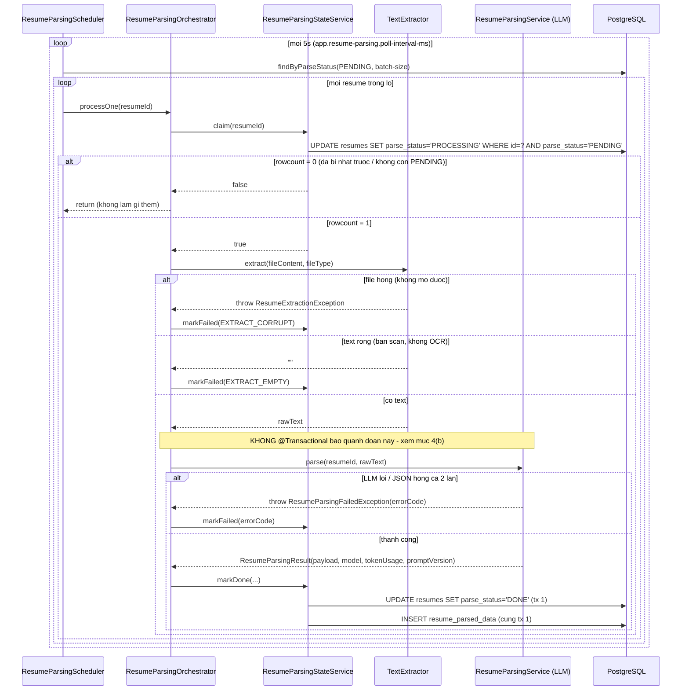
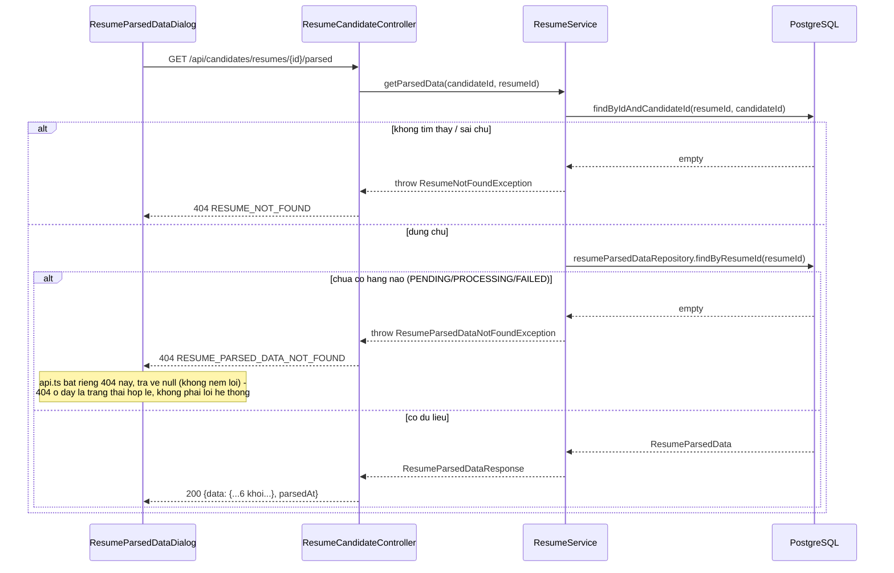

# FR-C04 — Phân tích CV bằng AI (Resume Parsing)

Nhánh `feat/fr-c04-parsing`, mọc từ `main` (đầy đủ code C1-C4 + `fix/rubric-guard`). Phụ thuộc dữ
liệu: C1 (`resumes`, có file đã upload qua `StorageService`).

## 1. Mục tiêu

Sau khi ứng viên upload CV (C1), hệ thống tự động đọc nội dung file (PDF/DOCX), gọi LLM để trích
xuất thành dữ liệu có cấu trúc (liên hệ, học vấn, kinh nghiệm, kỹ năng, chứng chỉ, dự án), và lưu
kết quả để các nhánh sau (D2 — chấm điểm rubric, F1 — embedding) dùng lại. Toàn bộ việc gọi LLM
chạy trong **job nền** (`@Scheduled` poller), không đồng bộ trong request upload — CLAUDE.md mục 7
cấm gọi LLM đồng bộ trong request người dùng.

Ràng buộc nghiêm ngặt nhất của nhánh này không phải kỹ thuật, mà là nội dung prompt: LLM **chỉ được
trích xuất**, không được viết lại, tóm tắt, hay dịch nội dung CV (CLAUDE.md mục 2) — lý do và cách
thực thi ở mục 4(d).

## 2. Các file đã tạo/sửa

### Backend

| File | Vai trò |
|---|---|
| `resume/ResumeParsedPayload.java` | Record schema cố định cho cột `resume_parsed_data.data` (JSONB) — 6 khối `contact`, `education[]`, `experience[]`, `skills[]`, `certifications[]`, `projects[]`. Mọi field số dùng wrapper (`Integer`/`Double`), null→`List.of()` ở compact constructor |
| `resume/ResumeParsedData.java` | Entity ánh xạ bảng `resume_parsed_data`. Không map cột `embedding` (để `NULL`, F1 mới cần) |
| `resume/ResumeParsedDataRepository.java` | `JpaRepository` + `findByResumeId(UUID)` |
| `resume/TextExtractor.java` | Interface `extract(InputStream, ResumeFileType) -> String` |
| `resume/PdfBoxPoiTextExtractor.java` | PDFBox (`Loader.loadPDF` + `PDFTextStripper`) cho PDF, POI (`XWPFDocument` + `XWPFWordExtractor`) cho DOCX |
| `resume/ResumeExtractionException.java` | Tín hiệu "file hỏng/không mở được" (bao gồm PDF có mật khẩu) → map sang `EXTRACT_CORRUPT` |
| `resume/ResumeParsingErrorCode.java` | Enum 5 mã cố định: `EXTRACT_EMPTY`, `EXTRACT_CORRUPT`, `LLM_INVALID_JSON`, `LLM_TIMEOUT`, `LLM_ERROR`, mỗi mã kèm mô tả tiếng Việt cố định qua `formatted()` |
| `resume/ResumeParsingFailedException.java` | Bọc lỗi gọi LLM — `getMessage()` luôn là `errorCode.formatted()`, không bao giờ là message gốc của exception |
| `ai/client/ResumeParsingChatClientConfig.java` | Bean `ChatClient` từ `ChatClient.Builder` auto-config |
| `resources/ai/prompt/resume-parse-v1.st` | System prompt — cấm tóm tắt/dịch/bịa, xử lý layout 2 cột, giữ nguyên ngôn ngữ gốc |
| `resume/ResumeParsingService.java` | Gọi LLM qua `chatClient...call().responseEntity(converter)`, retry đúng 1 lần khi JSON hỏng, cắt `rawText` trước khi gửi (`truncateForPrompt`), `log.warn` chẩn đoán khi lỗi (thêm ở commit `207529a`) |
| `resume/ResumeParsingStateService.java` | Bean ghi riêng — 3 method `@Transactional` ngắn: `claim`, `markDone`, `markFailed` |
| `resume/ResumeParsingOrchestrator.java` | Điều phối 1 resume: claim → load file → extract → gọi LLM → markDone/markFailed. Không method nào `@Transactional` |
| `resume/ResumeParsingScheduler.java` | `@Scheduled` quét `PENDING` theo lô (`batch-size`), tắt được qua `app.resume-parsing.enabled` |
| `resume/ResumeRepository.java` (sửa) | Thêm `findByParseStatus`, `claimForProcessing` (UPDATE có điều kiện, `@Modifying(clearAutomatically = true)`) |
| `resume/ResumeService.java` (sửa) | Thêm `getParsedData()` — kiểm quyền sở hữu + tồn tại dữ liệu |
| `resume/ResumeCandidateController.java` (sửa) | Thêm `GET /api/candidates/resumes/{id}/parsed` |
| `resume/dto/ResumeParsedDataResponse.java` | DTO trả ra — không có `rawText`/`model`/`promptVersion`/`tokenUsage` (dữ liệu audit nội bộ) |
| `common/exception/ResumeParsedDataNotFoundException.java` + `GlobalExceptionHandler` (sửa) | 404 `RESUME_PARSED_DATA_NOT_FOUND` khi CV chưa parse xong |
| `BackendApplication.java` (sửa) | Thêm `@EnableScheduling` — nhánh đầu tiên bật |
| `application.yml` (sửa) | Khối `app.resume-parsing.*` (`poll-interval-ms`, `batch-size`), 2 auto-config Anthropic/OpenAI vẫn bị exclude như trước |

### Frontend

| File | Vai trò |
|---|---|
| `features/resumes/types.ts` (sửa) | Thêm `ParseStatus`, `ResumeParsedPayload` và các record con — khớp camelCase với Java record |
| `features/resumes/api.ts` (sửa) | `getParsedResumeRequest` — 404 map về `null` thay vì ném lỗi (404 nghĩa là "chưa xong", không phải lỗi hệ thống) |
| `features/resumes/queries.ts` (sửa) | `useResumeParsedDataQuery`; `useResumesQuery` tự poll 5s khi còn CV `PENDING`/`PROCESSING`, dừng sau ngưỡng 5 phút (`isResumeStalled`) |
| `features/resumes/resumeLabels.ts` | Nhãn + màu badge theo `parseStatus` — bảng màu trung tính |
| `features/resumes/ParseStatusBadge.tsx` | Badge trạng thái, phân biệt bằng icon (không chỉ màu) vì màu cố tình trung tính |
| `features/resumes/ResumeParsedDataDialog.tsx` | Hộp thoại xem dữ liệu đã trích xuất — 6 section, skeleton lúc tải, empty state riêng từng khối |
| `features/resumes/ResumeList.tsx` (sửa) | Hiện badge + `parseError`, nút "Xem dữ liệu đã trích xuất" khi `DONE`, nút "Kiểm tra lại" khi bị coi là "kẹt" |

## 3. Luồng chính

### Luồng 1 — Poller xử lý một CV `PENDING`

### Luồng 2 — Ứng viên xem dữ liệu đã trích xuất

## 4. Quyết định thiết kế

**(a) Tách `ResumeParsingStateService` khỏi `ResumeParsingOrchestrator` thành 2 bean riêng**
- Đã chọn: mọi method ghi (`claim`, `markDone`, `markFailed`) nằm trong `ResumeParsingStateService`
  — một bean khác — được `ResumeParsingOrchestrator` inject qua constructor và gọi qua đó.
- Lựa chọn khác: gộp cả 3 method ghi vào chung class với `processOne()`, gọi bằng `this.claim(...)`.
- Vì sao: `@Transactional` của Spring dựa trên AOP proxy — proxy chỉ chặn được lời gọi đi **từ bên
  ngoài bean, qua proxy**. Gọi `this.method()` từ trong cùng instance là self-invocation, bỏ qua
  hoàn toàn proxy, nên `@Transactional` trên method đó sẽ là annotation chết — không transaction
  nào thực sự mở. Hậu quả cụ thể nếu gộp chung: `markDone()` mất tính atomic giữa 2 câu ghi
  (`UPDATE resumes` + `INSERT resume_parsed_data`) — nếu câu `INSERT` lỗi (ví dụ vi phạm
  `UNIQUE(resume_id)` do race hiếm gặp), `UPDATE` trước đó vẫn đứng yên, để lại trạng thái nói dối
  `parse_status = DONE` mà không có dữ liệu đi kèm. Tách bean đảm bảo `stateService.markDone(...)`
  luôn đi qua proxy thật, `@Transactional` có hiệu lực, rollback cả 2 câu ghi cùng nhau. Đã kiểm
  chứng bằng test (`ResumeParsingStateServiceTest`) mô phỏng đúng tình huống vi phạm `UNIQUE`, đọc
  lại từ DB sau `entityManager.clear()` xác nhận `parse_status` vẫn `PROCESSING`, không lệch thành
  `DONE`.

**(b) Lời gọi LLM nằm ngoài mọi `@Transactional`**
- Đã chọn: `ResumeParsingOrchestrator.processOne()`/`doProcess()` và
  `ResumeParsingScheduler.pollPendingResumes()` không có `@Transactional` nào. Transaction chỉ mở
  ngắn ở `claim()` (1 câu `UPDATE`) và `markDone()`/`markFailed()` (1-2 câu ghi), còn đoạn gọi LLM ở
  giữa hoàn toàn nằm ngoài transaction nào.
- Lựa chọn khác: bọc cả claim → gọi LLM → ghi kết quả trong một `@Transactional` duy nhất cho gọn.
- Vì sao: một lời gọi LLM thực tế có thể mất tới hàng chục giây (kể cả retry 1 lần khi JSON hỏng).
  Nếu bọc trong `@Transactional`, Spring giữ nguyên một connection JDBC từ connection pool suốt
  toàn bộ thời gian đó. Với vài chục CV đang chờ xử lý cùng lúc (batch-size mặc định 10, poll mỗi
  5s), pool sẽ cạn rất nhanh — request HTTP bình thường của người dùng khác (đăng nhập, xem tin
  tuyển dụng...) sẽ phải chờ hoặc timeout vì không còn connection nào rảnh, dù bản thân các request
  đó không liên quan gì tới việc parse CV.

**(c) Claim bằng `UPDATE` có điều kiện, không `SELECT` rồi `UPDATE`**
- Đã chọn: `ResumeRepository.claimForProcessing()` là một câu `UPDATE resumes SET parse_status =
  'PROCESSING' WHERE id = ? AND parse_status = 'PENDING'` duy nhất, đọc `rowcount` trả về để biết
  có claim thành công hay không (`claim()` trả `boolean` dựa trên `rowcount == 1`).
- Lựa chọn khác: `SELECT` resume trước để kiểm tra `parse_status == PENDING`, nếu đúng thì mới
  `UPDATE` sang `PROCESSING`.
- Vì sao: `SELECT` rồi `UPDATE` không phải một thao tác nguyên tử. Nếu hai tick của scheduler (hoặc
  hai instance ứng dụng chạy song song) cùng quét trúng một resume `PENDING` gần như đồng thời, cả
  hai đều `SELECT` thấy `PENDING` trước khi bất kỳ bên nào kịp `UPDATE` — cả hai đều nghĩ mình được
  quyền xử lý, cả hai đều gọi LLM cho cùng một CV. Hậu quả không chỉ là lãng phí, mà còn là trả tiền
  API hai lần cho đúng một CV, và race tiếp theo ở bước `markDone()` (ai ghi `resume_parsed_data`
  trước, ai vi phạm `UNIQUE(resume_id)` sau). Một câu `UPDATE ... WHERE parse_status = 'PENDING'`
  duy nhất để Postgres tự xử lý tuần tự các `UPDATE` cạnh tranh — chỉ đúng một request nhìn thấy
  `rowcount = 1`, các request còn lại nhìn thấy `rowcount = 0` vì điều kiện `WHERE` không còn khớp
  ngay sau khi request đầu tiên thắng. Không dùng `SELECT ... FOR UPDATE SKIP LOCKED` vì cách đó vẫn
  giữ transaction (và connection) mở trong lúc chờ, đúng thứ mục (b) đang tránh.

**(d) Prompt cấm LLM tóm tắt/dịch/viết lại nội dung CV**
- Đã chọn: `resume-parse-v1.st` có 2 chỉ dẫn tường minh: *"For 'description' fields, copy the
  relevant text as close to verbatim as possible. Do not summarize, condense, or rewrite it in your
  own words."* và *"Preserve the original language of the text... do not translate them into
  English."*
- Lựa chọn khác: để LLM tự do diễn đạt lại mô tả kinh nghiệm/dự án cho súc tích hơn, hoặc chuẩn hoá
  toàn bộ output sang tiếng Anh để nhất quán.
- Vì sao: đây không phải chi tiết văn phong, mà là điều kiện tồn tại của cả chuỗi ràng buộc chính
  của dự án. CLAUDE.md mục 2 yêu cầu "mọi giải thích [của AI chấm điểm] phải kiểm chứng được từ nội
  dung CV — không bịa", và cụ thể hoá tiếp: *"AI không được viết lại, tóm tắt, hay dịch nội dung
  CV... nếu D1 diễn giải lại thì evidence ở D2 là lời của LLM, không phải lời trong CV, và cả nguyên
  tắc evidence sụp từ gốc."* D1 (nhánh này) là điểm duy nhất trong toàn hệ thống mà nội dung CV đi
  qua một LLM trước khi trở thành dữ liệu có cấu trúc lưu DB. Nếu D1 để LLM tóm tắt hay dịch ngay ở
  bước này, thì mọi thứ D2 trích ra sau này làm "evidence" (bằng chứng trích từ CV) thực chất là lời
  của LLM đã diễn giải lại — không còn kiểm chứng được với bản CV gốc nữa, dù D2 tự nó không hề vi
  phạm gì. Đã xác nhận bằng test tay với `cv-hai-cot.pdf` (xem mục 7): JSON trả về giữ nguyên tiếng
  Việt, không dịch, không viết lại `description`, và không lẫn nội dung giữa 2 cột dù input đã bị
  xáo trộn thứ tự dòng do PDFTextStripper đọc theo tọa độ.

**(e) Chẩn đoán lỗi gọi LLM: `log.warn` có `model`/`status`/loại exception, không có nội dung CV hay
stack trace** *(bổ sung ở commit `207529a`, sau khi phát hiện lỗi thật lúc chạy với LLM thật)*
- Đã chọn: khi `callLlm()` ném `RuntimeException`, `ResumeParsingService` ghi đúng 1 dòng
  `log.warn("Goi LLM that bai cho resumeId={}, model={}, status={}, loai={}", ...)` — không truyền
  `Throwable` làm tham số cuối nên SLF4J không in stack trace. `extractStatusCode()` dùng
  `instanceof AnthropicServiceException` (pattern match, không ép kiểu) để lấy HTTP status thật nếu
  có, trả `null` an toàn cho lỗi mạng thuần không có status. Stack trace đầy đủ vẫn được ghi riêng ở
  `log.debug` ngay trước đó.
- Vì sao: lần chạy đầu với LLM thật chỉ có `parse_error = "LLM_ERROR: ..."` trong DB — không đủ để
  phân biệt "API key sai" (401), "model không tồn tại" (404), "hết quota" (429), hay lỗi mạng thuần.
  Đồng thời `resumes.parse_error` (theo đúng quy ước CLAUDE.md mục 4) chỉ được chứa mã lỗi chuẩn hoá
  + mô tả tiếng Việt cố định, không được chứa message gốc — nên thông tin chẩn đoán chi tiết hơn chỉ
  có thể tồn tại ở log, và phải tách rõ 2 tầng: `log.warn` (an toàn, luôn bật, đủ để chẩn đoán) và
  `log.debug` (đầy đủ nhưng có thể chứa chi tiết nhạy cảm hơn từ exception, chỉ bật khi cần).

## 5. Ràng buộc SRS đã thực thi

| FR | Ràng buộc | Thực thi ở đâu |
|---|---|---|
| CLAUDE.md mục 2 | AI không được viết lại/tóm tắt/dịch nội dung CV | `resume-parse-v1.st` — xem mục 4(d) |
| CLAUDE.md mục 3c | Không gọi LLM đồng bộ trong request người dùng | `ResumeParsingScheduler` (job nền), upload CV (C1) không đụng tới parsing |
| CLAUDE.md mục 3c | Self-invocation không được phá `@Transactional` | Tách `ResumeParsingStateService`/`ResumeParsingOrchestrator` — xem mục 4(a) |
| CLAUDE.md mục 3c | Không giữ transaction quanh lời gọi LLM | Xem mục 4(b) |
| CLAUDE.md mục 3c | Claim bằng `UPDATE` có điều kiện, không `SELECT FOR UPDATE SKIP LOCKED` | `ResumeRepository.claimForProcessing()` — xem mục 4(c) |
| CLAUDE.md mục 4 | `parse_error` chỉ lưu mã chuẩn hoá + mô tả tiếng Việt cố định, không lưu stack trace/output thô | `ResumeParsingErrorCode.formatted()`; stack trace/JSON gốc chỉ ở `log.debug` |
| CLAUDE.md mục 4 | Field số trong schema JSON dùng wrapper type, không primitive | `ResumeParsedPayload` — mọi field số là `Integer`/`Double` |
| CLAUDE.md mục 4 | Field `List` chuẩn hoá `null` → `List.of()` | Compact constructor của `ResumeParsedPayload`, `Project` |
| CLAUDE.md mục 4 | Prompt đặt trong `resources/ai/prompt/`, đánh version trong tên file, hằng số `PROMPT_VERSION` một chỗ | `resume-parse-v1.st`; `ResumeParsingService.PROMPT_VERSION` |
| CLAUDE.md mục 4 | Output LLM parse qua `BeanOutputConverter`, retry 1 lần khi JSON hỏng | `ResumeParsingService.parse()`/`retryAfterInvalidJson()` |
| Quy ước dự án (CLAUDE.md mục 7) | Không tạo cột/field `verdict`/`label`/`isQualified`/`passed`; package `ai/` không import `ScoreAggregator` | Đã soát bằng skill `srs-guard` — không vi phạm |

## 6. Giới hạn đã biết

1. **Không tích hợp OCR** — CV bản scan không có text layer sẽ ra `EXTRACT_EMPTY`. Đây là quyết
   định có chủ đích, không phải thiếu sót: OCR là một trục hạ tầng riêng (native binary, Docker
   image, mô hình tiếng Việt) nằm ngoài phạm vi D1.
2. **Bản ghi kẹt ở `PROCESSING` không tự phục hồi** — nếu ứng dụng chết giữa `claim()` và
   `markDone()`, poller sẽ không bao giờ nhặt lại vì nó chỉ quét `PENDING`. Frontend che triệu chứng
   bằng cách dừng poll sau 5 phút (`isResumeStalled`), nhưng bản ghi vẫn kẹt ở DB. Việc của
   `chore/hardening`.
3. **`LLM_TIMEOUT` hiện không có đường code nào tạo ra được** — test chỉ mock ở tầng `ChatModel` nên
   chưa chạm tới exception timeout thật của SDK Anthropic. Không tự đoán tên class để bắt riêng, ghi
   nhận là giới hạn.
4. **CV đã `FAILED` không parse lại được** — phát hiện khi chạy thật với LLM. Một lỗi tạm thời (key
   chưa nạp kịp, mạng chập chờn) khiến CV kẹt vĩnh viễn ở `FAILED`, người dùng phải xoá và upload lại
   từ đầu. Chưa có cơ chế parse lại — cố ý chưa thêm retry tự động (rủi ro vòng lặp đốt tiền khi lỗi
   kéo dài); phương án thiết kế (ai được kích hoạt, có giới hạn số lần không, phân biệt lỗi tạm thời
   với lỗi vĩnh viễn) sẽ trình bày riêng, không thuộc phạm vi D1.

## 7. Đã test / Chưa test

**Backend tự động** — `mvn test` (toàn bộ suite, không chỉ test mới): **113/113 pass, BUILD
SUCCESS**. Riêng phần liên quan D1:
- `ResumeParsedDataRepositoryTest` (5) — round-trip JSONB, vi phạm FK, vi phạm `UNIQUE(resume_id)`.
- `PdfBoxPoiTextExtractorTest` (5) — PDF 1 cột/2 cột, DOCX, file hỏng, PDF scan.
- `ResumeParsingServiceTest` (7) — `truncateForPrompt` (biên đúng ngưỡng, ngưỡng±1), `extractStatusCode`
  (có/không phải `AnthropicServiceException`, không throw NPE/ClassCastException).
- `ResumeParsingServiceIntegrationTest` (6) — JSON hợp lệ, model rỗng fallback sang model cấu hình,
  JSON hỏng cả 2 lần → retry đúng 1 lần → `LLM_INVALID_JSON`, `RuntimeException` → `LLM_ERROR` không
  rò message gốc, hạ tầng mock (`ChatModel` chưa stub → throw ngay).
- `ResumeParsingStateServiceTest` (3) — `claim()` hai lần liên tiếp (đọc lại DB), `markDone()`
  rollback đúng cả 2 câu ghi khi vi phạm `UNIQUE`.
- `ResumeParsingOrchestratorTest` (7) — luồng đầy đủ PENDING→DONE, `EXTRACT_EMPTY`,
  `EXTRACT_CORRUPT`, lỗi LLM → `FAILED` đúng mã.
- `ResumeParsedDataEndpointTest` (3), `ResumeParsePromptTest` (1).

**Test tay với LLM thật** (người dùng tự chạy, sau khi log.warn được thêm ở commit `207529a`): cả 5
fixture (`cv-mot-cot.pdf`, `cv-hai-cot.pdf`, `cv-mau.docx`, `cv-hong.pdf`, `cv-scan.pdf`) ra đúng kỳ
vọng. Đặc biệt xác nhận qua JSON thật của `cv-hai-cot.pdf`: LLM không dịch, không viết lại
`description`, không lẫn nội dung giữa hai cột — bằng chứng trực tiếp cho ràng buộc ở mục 4(d) hoạt
động đúng ngoài môi trường test (test tự động chỉ mock `ChatModel`, chưa từng gọi LLM thật trước lần
test tay này).

**Chưa test / chưa xác nhận**:
- **Chưa test tay trên trình duyệt thật** cho toàn bộ luồng frontend (badge trạng thái, poll tự
  động, dừng poll sau 5 phút, mở hộp thoại xem dữ liệu đã trích xuất, nút "Kiểm tra lại"). `npm run
  lint` và `npm run build` (`tsc -b && vite build`) đều sạch (chạy lại khi viết tài liệu này), nhưng
  đó chỉ xác nhận code biên dịch đúng kiểu — chưa có ai bấm qua giao diện thật để xác nhận trải
  nghiệm (poll dừng đúng lúc, badge/icon hiển thị đúng, dữ liệu trong hộp thoại đúng với CV thật).
- **Chưa test race condition thật** (hai tick scheduler hoặc hai instance ứng dụng cùng nhặt một
  resume đồng thời) — `ResumeParsingStateServiceTest` chỉ gọi `claim()` tuần tự, xác nhận đúng *kết
  quả cuối cùng* của điều kiện `WHERE` nhưng chưa quan sát trực tiếp hai `UPDATE` cạnh tranh thật sự.
- **`LLM_TIMEOUT` chưa test được** — xem mục 6 điểm 3, không có đường code nào tạo ra exception này
  để viết test.
- **Chưa test tình huống app crash giữa `claim()` và `markDone()`** (bản ghi kẹt `PROCESSING`) — xem
  mục 6 điểm 2, đây là giới hạn đã biết, không phải lỗi cần test ở D1.
