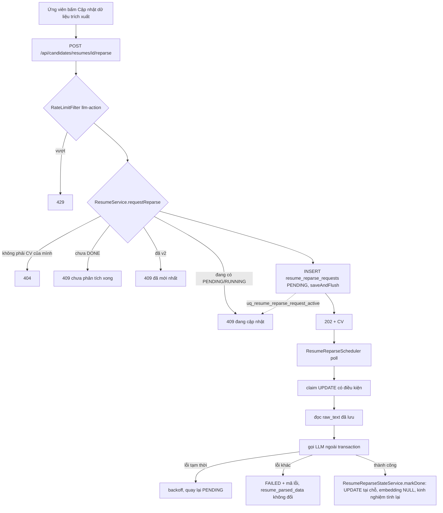

# Walkthrough — FR-C05 · Danh mục dùng chung và chuẩn hoá dữ liệu

Nhánh `feat/fr-c05-catalog` (tách từ `fix/hr-company-onboarding`). Đặc tả:
`docs/features/CHUNG/C05/REQUIREMENT.md`, `UI.md`. Mọi chỗ sửa đặc tả trong lúc code đều do người dùng chỉ
đạo trong phiên và giữ dòng `ĐÃ DUYỆT (30/09/2026)` — xem mục 8.

## 1. Mục tiêu

Trước C05, ngành nghề và địa điểm của tin tuyển dụng là chuỗi HR gõ tự do ("TP.HCM", "Hồ Chí Minh", "Quận 1,
HCM"…), nên không lọc, không đối chiếu được. C05 đưa vào hai danh mục cố định do hệ thống quản lý — 34
tỉnh/thành sau sáp nhập 01/07/2025 và 24 ngành nghề — rồi:
- bắt tin tuyển dụng lưu **mã** danh mục thay cho chuỗi, và chỉ được mở tin khi đã chọn đủ;
- chuyển một lần các tin cũ sang mã bằng một bộ khớp chuỗi duy nhất (không đoán gần đúng);
- mở rộng trích xuất CV (phiên bản 2) để có chức danh hiện tại, ngành, khu vực; backend tự tính số tháng
  kinh nghiệm theo thuật toán xác định, AI không tính;
- cho ứng viên tự "cập nhật dữ liệu trích xuất" cho CV cũ mà không đụng tới văn bản gốc của CV, nên mọi
  điểm số và trích dẫn đã chấm trước đó vẫn kiểm chứng được.

Các FR sau (U07 bộ lọc việc làm, H15 kho ứng viên) sẽ lọc trên các mã này.

## 2. Các file đã tạo/sửa

**Backend — danh mục và Job**

| File | Vai trò |
|---|---|
| `db/migration/V8__catalogs.sql` | Bảng danh mục + bí danh, cột mã trên `jobs`, cột ngành/khu vực/kinh nghiệm trên `resume_parsed_data`, bảng `resume_reparse_requests` |
| `db/migration/V9__normalize_job_catalog_codes.java` | Java migration: chuyển Job cũ sang mã bằng bộ khớp Java |
| `catalog/CatalogTextNormalizer`, `CatalogMatcher`, `CatalogEntry`, `CatalogJdbcLoader` | Bộ chuẩn hoá + bộ khớp thuần Java (không Spring), đọc danh mục qua JDBC |
| `catalog/CatalogRegistry`, `CatalogConfig` | Danh mục nạp một lần vào bộ nhớ lúc khởi động |
| `catalog/CatalogPublicController`, `dto/CatalogResponse` | `GET /api/public/catalogs` |
| `job/JobOwnerService`, `JobCatalogFields`, `JobPublicService`, `JobRepository`, DTO Job | Lưu mã, guard mở tin, 6 field hiển thị, tìm kiếm theo nhãn hoặc giá trị cũ |
| `common/exception/JobCatalogIncompleteException`, `InvalidCatalogCodeException` | Lỗi 409/400 của Job |

**Backend — CV**

| File | Vai trò |
|---|---|
| `ai/prompt/resume-parse-v2.st`, `resume/ResumeParsingService` | Prompt v2 (danh sách ngành truyền vào từ danh mục) |
| `resume/ResumeParsedPayload`, `ResumeParsedData` | +3 field JSON, +6 cột |
| `resume/ResumeParsedDataEnricher` | Hàm ghi dùng chung: kiểm mã ngành, khớp khu vực, tính kinh nghiệm |
| `resume/ExperienceCalculator` | Tính số tháng kinh nghiệm (thuần, BigDecimal) |
| `resume/ResumeExperienceStateService`, `ResumeExperienceScheduler` | Job nền tính bù kinh nghiệm cho CV v1 |
| `resume/ResumeReparse*` (Request, Status, Repository, StateService, Orchestrator, Scheduler) | Hàng đợi và worker trích xuất lại |
| `resume/ResumeService`, `ResumeCandidateController`, DTO CV | `POST .../reparse`, API danh sách và `/parsed` mở rộng |
| `common/ClockConfig`, `ratelimit/RateLimitFilter` | Đồng hồ inject được; rate limit cho `reparse` |

**Frontend**

| File | Vai trò |
|---|---|
| `features/catalog/*` (`CatalogCombobox`, `queries`, `normalize`…) | Combobox danh mục dùng chung |
| `features/jobs/CatalogField`, `catalogDisplay`, `JobLocationCell`, `UnnormalizedBadge` | Ô danh mục trong form, quy tắc hiển thị nhãn/giá trị cũ |
| `pages/HrJobCreatePage`, `HrJobEditPage`, `HrJobListPage`, `PublicJobDetailPage`, `JobCard` | Gửi mã, cảnh báo tin chưa chuẩn hoá, hiển thị nhãn |
| `features/resumes/ResumeReparseStatus`, `resumeReparse`, `LinearProgress`, `ResumeList` | Nút và trạng thái "Cập nhật dữ liệu trích xuất" |
| `features/resumes/CareerOverviewSection`, `ResumeParsedDataDialog` | Mục "Tổng quan nghề nghiệp" |

**Seed:** `dev-seed.sql`, `seed-demo-structural.sql` (ghi mã), `reset-demo-db.sql`, `export-ai-output.ps1`
(thêm bước kiểm C05), `seed-demo-ai-output.sql` (xuất lại bằng v2).

## 3. Luồng chính

**3a. HR mở tin.** `HrJobEditPage` gửi `PATCH /api/hr/jobs/{id}/status` → `JobOwnerService.changeStatus`:
kiểm rubric (có sẵn) → `isCatalogComplete` (có `category_code`; có `location_code` trừ khi `work_mode =
REMOTE`) → thiếu thì ném `JobCatalogIncompleteException` → `GlobalExceptionHandler` trả 409
`JOB_CATALOG_INCOMPLETE`; frontend hiện nguyên câu dưới nhóm nút. Sửa tin đang OPEN đi qua
`JobOwnerService.update`: mã gửi lên được kiểm trước mọi setter (`InvalidCatalogCodeException` → 400), rồi
nếu tin đang mở mà sau khi sửa mất điều kiện thì 409. Đổi `category_code` xoá dòng `job_embeddings` để
scheduler embed lại.

**3b. Chuyển dữ liệu Job cũ (một lần, V9).** Flyway chạy `V9__normalize_job_catalog_codes` trong một
transaction: đọc danh mục bằng `CatalogJdbcLoader` → dựng `CatalogMatcher` → với mỗi Job, chuẩn hoá chuỗi cũ
(bỏ dấu, chữ thường, gạch nối, tiền tố "TP."/"Tỉnh") rồi tra **khớp chính xác** trong nhãn ∪ bí danh → ghi
`category_code`/`location_code`, không đụng cột cũ. Trigger `updated_at` được tắt/bật lại trong cùng
transaction.

**3c. Trích xuất CV (tải lên mới).** Như FR-C04, nhưng `ResumeParsingService` dùng prompt v2, chèn danh sách
`MÃ: Nhãn` ngành (bỏ `OTHER`) vào tham số `{industries}`. `ResumeParsingStateService.markDone` gọi
`ResumeParsedDataEnricher.applyExtraction`: mã ngành lạ/`OTHER` → null ở cả JSON và cột `industry_code`;
`locationText` → `CatalogRegistry.matchProvince` → `region_code` (trượt thì null, giữ chuỗi); tính kinh nghiệm
với `Clock` inject, cùng transaction.

**3d. Trích xuất lại CV v1.**

Trong suốt quá trình `resumes.parse_status` giữ DONE. Danh sách CV ở frontend tự hỏi lại bằng
`refetchInterval` sẵn có khi `reparse` đang PENDING/RUNNING; khi thấy DONE thì nút và dòng "phiên bản cũ" biến
mất, vùng `aria-live` đọc "Đã cập nhật dữ liệu trích xuất.".

**3e. Tính bù kinh nghiệm.** `ResumeExperienceScheduler` (30 giây, lô 50) lấy các bản ghi
`experience_computed_at IS NULL` → `ResumeExperienceStateService.computeOne` tính rồi ghi bằng
`UPDATE ... WHERE experience_computed_at IS NULL`. Không gọi AI.

## 4. Quyết định thiết kế

- **Một bộ khớp duy nhất bằng Java, dùng cho cả migration lẫn lúc chạy.** Khác: viết lại bằng SQL
  (`unaccent`, `ILIKE`) trong migration. Vì sao: hai bản cài đặt sẽ lệch nhau; vì thế V9 là Java migration
  và `CatalogMatcher` không phụ thuộc Spring (R-M5).
- **Khớp chính xác sau chuẩn hoá, không gần đúng, không tách dấu phẩy.** Khác: fuzzy/tách "Quận 1, HCM".
  Vì sao: đoán sai mã còn tệ hơn để trống — Job chưa chuẩn hoá vẫn hiển thị giá trị cũ, HR chọn lại (R-M3).
- **V9 không có checksum nên là bất biến.** Flyway không phát hiện được nếu class bị sửa sau khi áp (đã xác
  nhận bằng bytecode `flyway-core-12.4.0` và test `JobCatalogMigrationTest.v9IsAppliedAsJavaMigration`). Cần
  đổi dữ liệu thì viết migration mới.
- **Guard mở tin là một hàm** `JobOwnerService.isCatalogComplete`, gọi ở mọi đường sang OPEN *và* ở `update`
  khi tin đang mở. Khác: chỉ chặn ở `changeStatus` hoặc ẩn nút ở frontend. Vì sao: R-J3/R-J5 và "không tin UI".
- **Giữ cột `category`/`location` cũ**, chỉ thêm cột mã; API trả `legacyCategory`/`legacyLocation` khi chưa
  chuẩn hoá. Vì sao: không mất dữ liệu HR đã gõ; tìm kiếm C02 khớp nhãn **hoặc** giá trị cũ (R-J8).
- **API danh mục ở `/api/public/catalogs`** (đặc tả ban đầu ghi `/api/catalogs`) để theo quy ước permitAll
  sẵn có của `SecurityConfig`. Danh mục nạp một lần vào `CatalogRegistry`, không query mỗi request.
- **Lỗi theo khuôn exception + `ErrorResponse`**, không dùng `FormattedErrorCode` (interface đó chỉ cho cột
  lỗi của job nền).
- **Schema CV v2 = cùng bảng, cùng cột `data`; phiên bản lấy từ `prompt_version`.** Khác: cột/bảng mới. Vì
  sao: R-C1; bản ghi v1 đọc vào vẫn hợp lệ (field mới null nhờ `@JsonIgnoreProperties`).
- **Backend không tin AI**: mã ngành qua `CatalogRegistry.isIndustry`, khu vực qua bộ khớp; một hàm duy nhất
  `ResumeParsedDataEnricher.applyExtraction` cho cả tải lên và trích xuất lại, nên bất biến "cột
  `industry_code` = `data.industryCode`" (R-C4) không thể lệch giữa hai đường.
- **Prompt v2 — `locationText` chỉ lấy phần tỉnh/thành.** Lần chạy thật đầu tiên (đợt 6) AI trả nguyên cụm
  "Quận 7, TP. Hồ Chí Minh" nên bộ khớp trượt cả 9 CV demo. Đã chọn siết prompt (ví dụ cụ thể, tên tỉnh cũ giữ
  nguyên) thay vì nới bộ khớp; sau một lần thử lại, 9/9 CV có `region_code`.
- **Kinh nghiệm: class thuần, BigDecimal HALF_UP, khớp toàn chuỗi đúng các dạng R-E3.** Khác: `double` +
  `Math.round`, hoặc đoán tháng cho mốc chỉ có năm. Vì sao: R-E5/R-E8 — ca 0,25 và 0,75 nằm đúng biên làm tròn;
  không đọc được thì bỏ qua và lưu `NULL`, không lưu 0. Mốc tham chiếu là tháng (giờ Việt Nam) của thời điểm
  tính, lấy từ bean `Clock`.
- **Job nền kinh nghiệm không có cột trạng thái — câu ghi có điều kiện chính là claim.** Nếu trích xuất lại đã
  ghi trước thì rowcount 0, kết quả tính từ data cũ không đè được.
- **Trích xuất lại: UPDATE tại chỗ, đọc `raw_text` đã lưu, `parse_status` giữ DONE.** Khác: đặt `PENDING`
  rồi chạy lại toàn bộ D1. Vì sao: CV sẽ biến khỏi form ứng tuyển, chấm điểm bị chặn, và đọc lại file làm
  `raw_text` đổi → evidence cũ hết kiểm chứng được (R-R5, R-R6). `parsed_at`/`embedding` ghi bằng câu native
  `touchAfterReparse` vì entity không cập nhật được hai cột này.
- **Hàng đợi riêng `resume_reparse_requests`** + partial unique index là chốt chặn thật; kiểm trước ở service
  chỉ để trả 409 sớm. Thêm stale-claim reaper (không có trong đề bài đợt 4) để yêu cầu kẹt RUNNING không khoá
  CV vĩnh viễn.
- **Frontend: hiển thị số năm bằng `toFixed(1)` rồi đổi dấu chấm.** `JSON.parse` làm `2.0` thành `2`; đây là
  định dạng, không phải tính lại.
- **Frontend: phát hiện "vừa cập nhật xong" bằng so danh sách trong lúc render**, invalidate cache `/parsed`
  trong `useEffect` (react-hooks 7 cấm setState trong effect).
- **Test bảo vệ ràng buộc của nhánh khác:** `ResumeReparseOrchestratorTest.processOne_success_updatesInPlace…`
  so md5 `criterion_scores`/`score_explanations` trước–sau — bảo vệ nguyên tắc evidence của FR-H04/H06 (D2/D4),
  không được xoá khi refactor C05. `CvImprovementOrchestratorTest.buildResumeText_v2Payload_…` bảo vệ đầu vào
  embedding của FR-U04 (F1) khỏi bị lẫn mã suy ra.

## 5. Ràng buộc đã thực thi

| Mã | Ràng buộc | Thực thi ở đâu |
|---|---|---|
| R-M3/R-M4 | Khớp chính xác; một khoá không trỏ hai mã | `CatalogMatcher.match`, constructor `CatalogMatcher` (ném lỗi); `CatalogSeedConsistencyTest` |
| R-P2/R-I1 | Mã không đổi, nhãn duy nhất | `catalog_provinces/industries` PK + `label UNIQUE` (V8) |
| R-J3/R-J5 | Mở tin cần ngành (+ tỉnh trừ REMOTE) | `JobOwnerService.isCatalogComplete` ở `changeStatus` và `update` |
| R-J4 | Mã phải có trong danh mục | `JobOwnerService.applyRequest` → `InvalidCatalogCodeException`; FK `jobs.category_code/location_code` |
| R-D1–D3 | Chuyển Job cũ, không ghi đè cột cũ | `V9__normalize_job_catalog_codes` |
| R-C3/R-C4 | Không tin mã AI; cột = JSON | `ResumeParsedDataEnricher.sanitize/applyExtraction`; FK `industry_code`, `region_code` |
| R-C5 | Không trường nhân thân | Schema `ResumeParsedPayload`; prompt v2 (srs-guard nguyên tắc 13: 0 kết quả) |
| R-C6 | Văn bản CV chỉ thêm `currentTitle` | `CvImprovementOrchestrator.buildResumeText` |
| R-E5–E8 | Thuật toán kinh nghiệm, không lưu 0 | `ExperienceCalculator`; CHECK `chk_parsed_experience_state`, `chk_parsed_experience_months` (V8) |
| R-R2 | Điều kiện trích xuất lại | `ResumeService.requestReparse` |
| R-R4 | Một yêu cầu đang chạy mỗi CV | `uq_resume_reparse_request_active` (V8) |
| R-R3 | Rate limit theo userId | `RateLimitFilter.classify` (`RESUME_REPARSE_PATTERN`) |
| R-R5/R-R6 | Không đổi `raw_text`, không chạm chấm điểm | `ResumeReparseStateService.markDone`, `ResumeReparseOrchestrator` |
| CLAUDE.md §3c | Không giữ transaction quanh LLM; claim bằng UPDATE | `ResumeReparseOrchestrator` (không `@Transactional`), `claimForProcessing` |
| CLAUDE.md §4 | Cột lỗi chỉ lưu mã chuẩn hoá | `ResumeReparseStateService.markFailed(ResumeParsingErrorCode)` |

## 6. Đã kiểm thử gì

**Tự động (đợt 6):** full suite backend **xanh 680/680** (lần chạy cuối, sau mọi commit sửa); `npm run build` + `npm run lint` sạch. Lần chạy đầu
680 test, 2 đỏ — cả hai do giả định sai trong test mới của đợt 4 (fixture tạo 3 CV chính cho cùng ứng viên;
Spring AI 2.0 nối hướng dẫn định dạng JSON vào cuối user message). Đã sửa theo hướng chặt hơn, không nới
(commit `5ec2f0e`). Test chập chờn có từ trước (mục 7) **không đỏ ở cả hai lần chạy** của đợt 6 nên không chạy riêng.

Test chính của C05: `CatalogMatcherTest`, `CatalogSeedConsistencyTest`, `JobCatalogMigrationTest`,
`JobCatalogGuardIntegrationTest`, `CatalogPublicControllerIntegrationTest`, `JobPublicIntegrationTest` (2 ca
tìm kiếm), `ExperienceCalculatorTest`, `ResumeParsedDataEnricherTest`, `ResumeExperienceBackfillIntegrationTest`,
`ResumeReparseEndpointTest`, `ResumeReparseOrchestratorTest`, `ResumeParsePromptTest`, các ca thêm ở
`ResumeParsingStateServiceTest`, `CvImprovementOrchestratorTest`, `RateLimitFilterTest`, `ResumeParsingServiceTest`.

**Chạy thật với khoá API (đợt 6):** nạp demo, gửi 9 yêu cầu trích xuất lại qua API, cả 9 DONE; md5 trước = sau
(`criterion_scores` 57 dòng `1511c04a…`, `score_explanations` 12 dòng `446f958b…`, `raw_text` 9 CV
`87e0d96f…`); nạp lại từ dump mới: 9/9 v2, 9/9 đã tính kinh nghiệm, 9/9 có `region_code`, 0 Job thiếu mã.

**Soát tay giao diện (mục 7.10): chưa làm** — người dùng tự soát sau commit tài liệu đợt 6, theo checklist
trong báo cáo đợt 6. Kết quả bổ sung vào đây sau.

**Chưa test:** race embedding khi trích xuất lại (mục 7); hành vi khi danh mục đổi sau này (ngoài phạm vi);
giao diện ở 375px và bàn phím combobox (chờ soát tay).

| "Xong khi" (REQUIREMENT mục 7) | Nghiệm thu | Kết quả |
|---|---|---|
| 1. Bộ khớp | `CatalogMatcherTest`, `CatalogSeedConsistencyTest` | Đạt |
| 2. Migration | `JobCatalogMigrationTest` (Testcontainers, Boot 4.1) | Đạt |
| 3. Guard OPEN | `JobCatalogGuardIntegrationTest` | Đạt |
| 4. Tìm kiếm C02 | `JobPublicIntegrationTest` (2 ca nhãn/giá trị cũ) | Đạt |
| 5. Schema v2 | `ResumeParsedDataEnricherTest`, `ResumeExperienceBackfillIntegrationTest.v1Row_…` | Đạt |
| 6. Kinh nghiệm | `ExperienceCalculatorTest` (20 ca R-E10), `ResumeExperienceBackfillIntegrationTest` | Đạt |
| 7. Trích xuất lại | `ResumeReparseEndpointTest`, `ResumeReparseOrchestratorTest` + chạy thật md5 | Đạt |
| 8. RBAC | `ResumeReparseEndpointTest.reparse_hrUser_returns403`, `CatalogPublicControllerIntegrationTest` | Đạt |
| 9. Bổ sung spec-review | `JobEmbeddingPipelineIntegrationTest.update_categoryChanged_…`/`update_unrelatedFieldChanged_…` (R-J9), `CvImprovementOrchestratorTest` (R-C6), `ResumeParsingStateServiceTest` + `ResumeReparseOrchestratorTest` (R-C4), `CatalogPublicControllerIntegrationTest` (34/24, thứ tự, không bí danh), `JobCatalogGuardIntegrationTest.response_*` (legacy*) | Đạt |
| 10. Soát tay | Checklist báo cáo đợt 6 | **Chưa** |
| 11. Seed demo | Nạp lại từ dump mới (đợt 6) | Đạt |
| 12. srs-guard | Đợt 6: 1 vi phạm nguyên tắc 13 ở prompt v2, đã sửa (`f12fcd6`) | Đạt |

## 7. Nợ kỹ thuật

- **Test chập chờn có từ trước C05:** `ScoringRunOrchestratorTest.processOne_temporaryErrorOnSecondCriterion_…`
  phụ thuộc thời gian thực (backoff test 50ms); máy chậm thì claim thành công, test đỏ. Không sửa trong C05.
- **`toPattern` của tìm kiếm C02 không thoát `%` và `_`** — giữ nguyên cách hiện có, không thêm cách mới.
- **Race embedding CV với trích xuất lại:** `ResumeEmbeddingScheduler` không claim; nếu nó đọc văn bản v1 rồi
  trích xuất lại commit v2 và đặt `embedding = NULL`, câu ghi muộn của scheduler đè embedding v1 lên và không
  bao giờ được tính lại. Xác suất thấp, cùng họ nợ "không claim" của F1. Chữa: ghi có điều kiện theo
  `parsed_at` đã đọc.
- **Combobox chỉ lọc theo nhãn, không theo bí danh** (API không trả bí danh): gõ "HCM" hay tên tỉnh cũ
  "Bình Dương" không ra kết quả. Để FR-U07 cân nhắc.
- **V9 là Java migration không checksum, bất biến** — không sửa class sau khi đã áp.
- **Prompt v2 vẫn có thể trả `locationText` kèm quận/huyện** với CV khác bộ demo; khi đó mã khu vực null và
  giao diện hiện "(chưa khớp danh mục)". Không nới bộ khớp.
- **Hướng dẫn định dạng JSON xuất hiện hai lần trong prompt** (tham số `{format}` ở system và Spring AI 2.0 tự
  nối vào user message) — có từ D1, không do C05.
- **Seed demo: 6 job ở DRAFT nên `job_recommendations` luôn về 0 khi backend chạy** — có từ chore/seed-demo,
  không do C05. Đã kiểm: nạp dump cũ (28 dòng) trong lúc backend chạy thì về 0 ngay, vì
  `JobRecommendationCacheScheduler` xoá-rồi-chèn mỗi 5 giây và chỉ khớp job OPEN. Dump mới vì thế có 0 dòng.
  Chữa ở nhánh seed: cho job demo OPEN trong `seed-demo-structural.sql` (đã có mã nên qua được guard R-J3).
- **Embedding CV không chính mất sau trích xuất lại** (9 → 8 trong dump): đúng thiết kế F1 chỉ embed CV chính.
- Lời gọi LLM thất bại lần đầu ở đợt 6 vì backend chưa nạp khoá API: mã `LLM_ERROR` đúng thiết kế nhưng không
  phân biệt "thiếu cấu hình" với lỗi gọi API — người vận hành phải đọc log.

## 8. Lệch so với đặc tả

Tất cả các chỗ dưới đây do người dùng chỉ đạo sửa đặc tả trong phiên; đặc tả giữ dòng `ĐÃ DUYỆT (30/09/2026)`,
không có dòng duyệt lại riêng.

| Chỗ lệch | Đặc tả đã sửa | Khi nào |
|---|---|---|
| Endpoint `/api/catalogs` → `/api/public/catalogs` | REQUIREMENT mục 4, 7; UI.md mục 5 | Đợt 2 (quyết định L2) |
| Thêm thông điệp 409 khi sửa tin đang mở | REQUIREMENT R-J5; UI.md mục 7 | Đợt 2 |
| Câu đếm R-P4 | REQUIREMENT R-P4 | Đợt 1 |
| 409 trích xuất lại: tách câu cho CV chưa DONE | REQUIREMENT R-R2; UI.md mục 7 | Đợt 5 |
| Siết prompt `locationText` chỉ lấy phần tỉnh/thành | Không đổi đặc tả (nằm trong R-C2) | Đợt 6 |
| Thêm stale-claim reaper cho trích xuất lại | Không có trong đặc tả; theo khuôn R-R4 "cơ chế sẵn có" | Đợt 4 |
