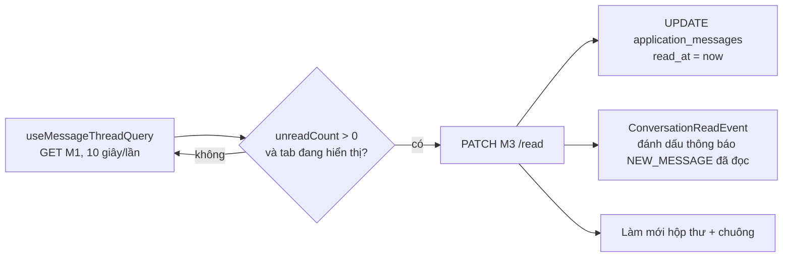

# Walkthrough — FR-C06 · Nhắn tin theo đơn ứng tuyển

Nhánh: `feat/fr-c06-messaging` (tách từ `main` `4376089`) · 7 đợt (Plan Mode + 6 đợt code, đợt 7 chia hai
lượt) · 10/10/2026

> Không có chỗ lệch nào mà đặc tả chưa được duyệt lại. Mọi điểm làm rõ (L1–L8) nằm ở mục 12 REQUIREMENT.md,
> duyệt 10/10/2026.

## 1. Mục tiêu

Trước FR-C06, HR và ứng viên chỉ "nói chuyện" với nhau qua đổi trạng thái đơn và giấy mời phỏng vấn; muốn hỏi
thêm điều gì phải liên lạc ngoài hệ thống. FR-C06 cho hai bên nhắn tin trực tiếp **quanh một đơn ứng tuyển**:
mỗi đơn có đúng một cuộc trao đổi, mở ở tab "Trao đổi" (trang hồ sơ đơn của HR, trang chi tiết đơn của ứng
viên). Mỗi tin có chữ, một tệp, hoặc cả hai. Bên nhận được thông báo ở chuông và qua email, và mỗi phía có một
hộp thư "Tin nhắn" liệt kê các đơn đã có tin. Ứng viên chỉ thấy tên công ty, không thấy tên/email của HR. Đơn
đã rút vẫn đọc được nhưng không gửi thêm. FR này không dùng AI.

## 2. Các file đã tạo/sửa

**Backend** (đường dẫn tính từ `backend/src/main/java/com/recruitment/`)

| File | Vai trò |
|---|---|
| `resources/db/migration/V12__application_messages.sql` | Bảng `application_messages`, 3 ràng buộc `CHECK`, 2 index |
| `messaging/ApplicationMessage`, `MessageSenderRole`, `AttachmentType` | Entity và hai enum (vai trò người gửi; 5 loại tệp kèm đuôi lưu) |
| `messaging/ApplicationMessageRepository` | Đọc 200 tin gần nhất, đếm tin chưa đọc, `UPDATE` đánh dấu đã đọc, 2 câu SQL hộp thư |
| `messaging/ConversationRow` | Interface projection nhận từng dòng của câu SQL hộp thư |
| `messaging/MessageService` | Toàn bộ nghiệp vụ M1–M5 của cả hai phía |
| `messaging/MessageExcerpt` | Đoạn trích 120 ký tự, dùng chung cho thông báo và hộp thư |
| `messaging/AttachmentDownload` | Gói nội dung tệp + tên + loại để controller trả về |
| `messaging/MessageHrController`, `MessageCandidateController` | M1–M4 theo đơn, mỗi phía một controller |
| `messaging/ConversationHrController`, `ConversationCandidateController` | M5 hộp thư |
| `messaging/dto/*` (4 record) | `MessageThreadResponse`, `MessageResponse`, `ConversationHrResponse`, `ConversationCandidateResponse` |
| `storage/FileSignatures`, `DetectedFileType` | Một chỗ duy nhất nhận dạng PDF/DOCX/PNG/JPEG/WEBP bằng magic bytes |
| `resume/ResumeService`, `company/CompanyOwnerService` | Bỏ bản kiểm magic bytes riêng, gọi `FileSignatures`; hành vi không đổi |
| `common/exception/` (6 lớp mới) + `GlobalExceptionHandler` | Mã lỗi `MESSAGE_EMPTY`, `MESSAGE_TOO_LONG`, `CONVERSATION_READ_ONLY`, `INVALID_MESSAGE_ATTACHMENT`, `MESSAGE_NOT_FOUND`, `MESSAGE_ATTACHMENT_NOT_FOUND` |
| `notification/MessageSentEvent`, `ConversationReadEvent` | Hai sự kiện `messaging/` publish |
| `notification/NotificationEventListener`, `NotificationContentBuilder`, `NotificationRepository`, `NotificationType` | Tạo/gộp thông báo `NEW_MESSAGE`, đánh dấu đã đọc khi mở cuộc trao đổi |
| `notification/NotificationMailOrchestrator` | Email `NEW_MESSAGE` thêm dòng liên kết |
| `ratelimit/RateLimitFilter`, `application.yml` | Nhóm giới hạn `message`; cấu hình `app.frontend-base-url` |

**Frontend** (`frontend/src/`)

| File | Vai trò |
|---|---|
| `features/messages/types.ts`, `api.ts`, `queries.ts` | Kiểu dữ liệu, 5 hàm gọi API, hook TanStack Query (tải lại định kỳ, gửi, đánh dấu đã đọc, hộp thư) |
| `features/messages/messageRules.ts` | Giới hạn 4000 ký tự / 5MB / đuôi tệp, kiểm tệp trước khi gửi |
| `features/messages/MessagesTab.tsx`, `MessageList.tsx`, `MessageBubble.tsx`, `AttachmentChip.tsx`, `MessageComposer.tsx` | Tab "Trao đổi" dùng chung hai phía |
| `features/messages/ConversationList.tsx` | Hộp thư dùng chung hai phía |
| `pages/HrMessagesPage.tsx`, `pages/CandidateMessagesPage.tsx` | Hai trang hộp thư |
| `pages/HrApplicationDetailPage.tsx`, `pages/CandidateApplicationDetailPage.tsx` | Thêm tab "Trao đổi" vào cuối |
| `lib/fileSize.ts`, `lib/useStallGuardedPolling.ts` | Hai hàm chuyển ra dùng chung (từ `ResumeList` và `notifications/queries.ts`) |
| `App.tsx`, `components/layout/HrLayout.tsx`, `CandidateLayout.tsx` | 2 route, mục "Tin nhắn" ở thanh điều hướng |

**Seed:** `db/seed/seed-test.sql` (mục 14, 6 tin), `reset-test-data.sql`, `reset-demo-db.sql`, `README.md` mục 8.4.

## 3. Luồng chính

### 3.1 Gửi tin (M2)

1. Người dùng gõ nội dung, có thể chọn tệp, bấm "Gửi". `MessageComposer` kiểm trước bằng `messageRules`
   (độ dài, 0 byte, 5MB, đuôi) rồi gọi `useSendMessageMutation` → `POST …/applications/{id}/messages` dạng
   `multipart/form-data`.
2. `RateLimitFilter` đếm lượt vào bucket `message:{userId}` (20, nạp lại 20/phút); vượt → 429.
3. Controller lấy `userId` từ JWT, gọi `MessageService.sendAsHr` hoặc `sendAsCandidate`. Vai trò người gửi suy từ
   controller, không bao giờ đọc từ request.
4. `send` kiểm theo đúng thứ tự R-M5: nạp đơn có kiểm quyền (`HrApplicationAccess.loadOwned` hoặc
   `findByIdAndCandidateId`) → trạng thái đơn (`WITHDRAWN` → 409) → nội dung (đổi CRLF thành LF, rỗng → 400,
   > 4000 → 400) → tệp (`attach`: 0 byte → quá 5MB → `FileSignatures.detect` → `displayFileName`).
5. Tệp được lưu bằng `StorageService.store("message-attachments", …)` trước; sau đó `saveAndFlush` dòng
   `application_messages`.
6. Vẫn trong transaction, `send` publish `MessageSentEvent`. Request trả 201 `MessageResponse`.
7. Sau khi transaction commit, `NotificationEventListener.onMessageSent` chạy trong transaction mới
   (`REQUIRES_NEW`): xác định bên nhận, nếu họ đã có thông báo `NEW_MESSAGE` chưa đọc của đơn thì thôi; nếu không
   thì tạo thông báo theo `NotificationContentBuilder.forNewMessage`. Lỗi ở bước này bị bắt và ghi log, không ảnh
   hưởng tin đã lưu. Email do `NotificationMailOrchestrator` gửi sau, như mọi thông báo.
8. Frontend chờ M1 tải lại rồi mới xoá khung soạn, và làm mới hộp thư.

### 3.2 Mở tab "Trao đổi" (M1 + M3)



- M1 (`getThreadAs…` → `buildThread`) chỉ đọc: 200 tin gần nhất, `unreadCount` đếm trên toàn bộ tin của bên
  kia, `canSend = status != WITHDRAWN`. M1 **không** ghi gì vào DB.
- M3 (`markRead`) chạy `markReadFromSender` (một câu `UPDATE` có điều kiện) rồi publish `ConversationReadEvent`.
  `onConversationRead` là `@EventListener` thường nên chạy trong **cùng** transaction của M3 (L2).
- Tự tải lại dừng khi tab trình duyệt bị ẩn, và dừng hẳn sau 20 phút (`useStallGuardedPolling`), khi đó hiện
  "Đã tạm dừng tự cập nhật." + "Tải lại".

### 3.3 Tải tệp (M4)

`downloadAttachmentAs…` kiểm quyền trên đơn trước, rồi nạp tin bằng `findByIdAndApplicationId` (tin của đơn khác
→ 404 `MESSAGE_NOT_FOUND`), đọc tệp bằng `StorageService.load`. Controller trả `Content-Disposition: attachment`
với tên tệp mã hoá UTF-8 và `Content-Type` theo loại đã nhận dạng lúc gửi.

### 3.4 Hộp thư (M5)

`listConversationsAs…` gọi `findHrConversations`/`findCandidateConversations`: một câu SQL native dùng
`JOIN LATERAL` lấy tin mới nhất và đếm tin chưa đọc của từng đơn, sắp theo tin mới nhất rồi `applicationId`
giảm dần (L6), phân trang tối đa 50. Mỗi dòng đi qua `ConversationRow`, đoạn trích tính bằng `MessageExcerpt`.
Phía ứng viên lấy tên công ty, không lấy tên HR. Trang hộp thư tải lại 30 giây/lần và **không** gọi M3.

## 4. Quyết định thiết kế

- **Không có bảng "cuộc trao đổi".** Đã chọn: khoá của cuộc trao đổi chính là `applicationId`. Lựa chọn khác:
  bảng `conversations` như các app chat. Vì sao: mỗi đơn đúng một cuộc trao đổi, nên một bảng thêm chỉ sinh race
  "tạo cuộc trao đổi hai lần" mà không đem lại gì (R-P1, Q1).
- **Hai bộ controller theo vai trò, chung một service.** Lựa chọn khác: `/api/messages/**` dùng chung rồi tự rẽ
  nhánh theo role. Vì sao: filter chain đã chặn `/api/hr/**` và `/api/candidates/**` theo role; giữ nguyên quy
  ước kiểm quyền có sẵn (HR 403 cho đơn công ty khác, ứng viên 404) thay vì viết bản thứ hai (R-Q1, R-Q2).
- **Đánh dấu đã đọc là `PATCH` riêng, không phải tác dụng phụ của `GET`.** Lựa chọn khác: M1 tự đánh dấu. Vì sao:
  hộp thư và lượt tải lại khi tab bị ẩn không được làm tin "đã đọc"; dự án đã có một nợ "GET ghi DB", không thêm
  cái thứ hai (R-R2, R-I4).
- **R-R3 qua sự kiện đồng bộ (L2).** Lựa chọn khác: `MessageService` gọi thẳng `NotificationRepository`. Vì sao:
  mục 4.2 chỉ cho `messaging/` dùng `notification/` để publish sự kiện; listener đồng bộ vẫn chạy trong cùng
  transaction nên tin và thông báo cùng thành "đã đọc" hoặc cùng không.
- **Thông báo tạo sau commit, transaction riêng.** Lựa chọn khác: tạo trong cùng transaction với tin. Vì sao: lỗi
  thông báo không được làm mất tin. Test bảo vệ: `MessageNotificationFailureIntegrationTest` (T26) thay
  `NotificationRepository` bằng spy ném lỗi và khẳng định tin vẫn lưu — test này bảo vệ ràng buộc của FR-C03
  (thông báo không làm hỏng nghiệp vụ gốc), không được xoá khi refactor `NotificationEventListener`.
- **Gộp thông báo kiểm ở service, không unique index.** Lựa chọn khác: partial unique index trên `notifications`.
  Vì sao: đây là quy tắc giảm thư, không phải bất biến nghiệp vụ; chốt ở DB buộc sửa bảng của FR-C03. Ngoại lệ
  có chủ đích với CLAUDE.md §4 (R-N4, Q4).
- **Gom magic bytes về `storage/FileSignatures`.** Lựa chọn khác: viết bản thứ ba trong `messaging/`. Vì sao: ba
  bản sẽ trôi khỏi nhau. `FileSignatures` trả `DetectedFileType` trung lập, mỗi nơi gọi tự ánh xạ sang kiểu của
  mình, nên CV vẫn chỉ nhận PDF/DOCX và logo vẫn chỉ nhận ảnh. Cổng an toàn: 19 lớp test CV và
  `CompanyOwnerIntegrationTest` pass mà không sửa test (R-C1, Q6).
- **Ép đuôi tên tệp theo loại đã nhận dạng.** `x.html` có nội dung PDF thành `x.html.pdf`. Vì sao: người nhận
  không bao giờ tải về một tệp có đuôi khác nội dung thật (R-F6, Q8).
- **Tải lại định kỳ, không WebSocket.** Vì sao: đủ cho nhịp trao đổi tuyển dụng, không thêm hạ tầng; có ngưỡng tự
  dừng 20 phút để không tải lại vô hạn (R-A).
- **Dữ liệu chấm điểm không bao giờ vào luồng tin.** `messaging/` không import `scoring/`, `ai/`, `resume/`,
  `rubric/`; test T6 (`MessageResponseKeysIntegrationTest`) duyệt đệ quy mọi khoá JSON của M1, M2, M5 hai phía.

## 5. Ràng buộc đã thực thi

| Mã | Ràng buộc | Thực thi ở đâu |
|---|---|---|
| R-Q1/R-Q2 | Kiểm quyền và sở hữu trên đơn | `MessageService.loadForHr` (`HrApplicationAccess.loadOwned`), `loadForCandidate` (`findByIdAndCandidateId`) |
| R-Q3 | Người gửi lấy từ JWT | Controller truyền `authentication.getName()`; DTO request không có `senderId`/`senderRole` |
| R-Q4 | Tệp chỉ đọc qua M4, theo cả `messageId` và `applicationId` | `MessageService.downloadAttachment` → `findByIdAndApplicationId` |
| R-M2/R-M3 | Chỉ đổi CRLF; ≤ 4000 ký tự | `MessageService.normalizeLineBreaks`, `send`; lưới an toàn `chk_app_msg_body_length` |
| R-M4/R-M8 | Đơn đã rút chỉ còn xem | `MessageService.canSend`, `send` (409) |
| R-M7 | 200 tin gần nhất, đếm chưa đọc trên toàn bộ | `buildThread`, `countBy…ReadAtIsNull` |
| R-F2/R-F3/R-F6 | Loại theo magic bytes, ≤ 5MB, ép đuôi | `MessageService.attach`, `displayFileName`, `FileSignatures.detect` |
| R-F7 | Luôn `attachment` | `MessageHrController`/`MessageCandidateController` (M4) |
| R-R2/R-R3 | Đã đọc chỉ qua M3; đánh dấu cả thông báo | `ApplicationMessageRepository.markReadFromSender`, `NotificationEventListener.onConversationRead` |
| R-R5 | Không lộ `readAt` | DTO không có field này; T6 |
| R-N1/R-N4 | Thông báo cho bên nhận, sau commit, có gộp | `NotificationEventListener.onMessageSent` |
| R-N5 | Liên kết chỉ trong email `NEW_MESSAGE` | `NotificationMailOrchestrator` (hàm dựng nội dung email) |
| R-I2/R-G2 | Ứng viên không thấy tên/email HR | `ConversationCandidateResponse` chỉ có `companyName`; `forNewMessage` dùng tên công ty |
| R-L1 | 20 tin/phút/người | `RateLimitFilter` nhóm `message` |
| R-P5 | Tin không sửa, không xoá | Không có endpoint `PUT`/`DELETE`; bảng không có `updated_at`/`deleted_at` |
| CLAUDE.md §7 | Không gọi LLM | `messaging/` không dùng `ChatClient`/`ChatModel`/`EmbeddingModel` (srs-guard nguyên tắc 12) |

## 6. Đã kiểm thử gì

**Backend tự động.** Mỗi đợt chạy các lớp mới và mọi lớp có sẵn của phần bị chạm; full suite chạy một lần ở đợt
7: **892 test, 0 lỗi, 0 bỏ qua**. Lớp test mới (số test): `MessageSendIntegrationTest` (10),
`MessageAccessIntegrationTest` (6), `MessageReadOrderIntegrationTest` (4), `MessageAttachmentIntegrationTest` (17),
`ConversationInboxIntegrationTest` (8), `MessageResponseKeysIntegrationTest` (1), `MessageExcerptTest` (6),
`MessageNotificationIntegrationTest` (6), `MessageNotificationFailureIntegrationTest` (1), `FileSignaturesTest` (7);
mở rộng `NotificationMailOrchestratorIntegrationTest` (T21) và `RateLimitFilterTest` (T23).

**Frontend.** `npm run build` + `npm run lint` sạch ở đợt 5, 6; toàn bộ lệnh tìm mục 7.3 đạt.

**Kiểm bằng HTTP (mục 7.2).** Người dùng chạy khối PowerShell trên seed demo + seed test; cả 10 nhóm khớp mong
đợi. Output nguyên văn:

```text
200 Get /api/hr/applications/e8000000-0000-0000-0000-000000000001/messages
200 Get /api/candidates/applications/e8000000-0000-0000-0000-000000000001/messages
--- 2. HR cong ty khac: mong doi 403 x2
403 Get /api/hr/applications/e8000000-0000-0000-0000-000000000001/messages {"error":"FORBIDDEN","message":"Tài khoản không có quyền truy cập tài nguyên này"}
403 Post /api/hr/applications/e8000000-0000-0000-0000-000000000001/messages {"error":"FORBIDDEN","message":"Tài khoản không có quyền truy cập tài nguyên này"}
--- 3. ung vien khac: mong doi 404 APPLICATION_NOT_FOUND x2
404 Get /api/candidates/applications/e8000000-0000-0000-0000-000000000001/messages {"error":"APPLICATION_NOT_FOUND","message":"Không tìm thấy đơn ứng tuyển: e8000000-0000-0000-0000-000000000001"}
404 Post /api/candidates/applications/e8000000-0000-0000-0000-000000000001/messages {"error":"APPLICATION_NOT_FOUND","message":"Không tìm thấy đơn ứng tuyển: e8000000-0000-0000-0000-000000000001"}
--- 4. don khong ton tai: mong doi 404 APPLICATION_NOT_FOUND x2
404 Get /api/hr/applications/00000000-0000-0000-0000-000000000000/messages {"error":"APPLICATION_NOT_FOUND","message":"Không tìm thấy đơn ứng tuyển: 00000000-0000-0000-0000-000000000000"}
404 Get /api/candidates/applications/00000000-0000-0000-0000-000000000000/messages {"error":"APPLICATION_NOT_FOUND","message":"Không tìm thấy đơn ứng tuyển: 00000000-0000-0000-0000-000000000000"}
--- 5. sai vai tro: mong doi 403 x2, roi 401 UNAUTHENTICATED
403 Get /api/hr/applications/e8000000-0000-0000-0000-000000000001/messages {"error":"FORBIDDEN","message":"Tài khoản không có quyền truy cập tài nguyên này"}
403 Get /api/candidates/applications/e8000000-0000-0000-0000-000000000001/messages {"error":"FORBIDDEN","message":"Tài khoản không có quyền truy cập tài nguyên này"}
401 Get /api/candidates/applications/e8000000-0000-0000-0000-000000000001/messages {"error":"UNAUTHENTICATED","message":"Cần đăng nhập để truy cập tài nguyên này"}
--- 6. hop thu sai vai tro: mong doi 403 x2
403 Get /api/hr/messages/conversations {"error":"FORBIDDEN","message":"Tài khoản không có quyền truy cập tài nguyên này"}
403 Get /api/candidates/messages/conversations {"error":"FORBIDDEN","message":"Tài khoản không có quyền truy cập tài nguyên này"}
--- 7. don da rut: mong doi 409 CONVERSATION_READ_ONLY
409 Post /api/candidates/applications/e8000000-0000-0000-0000-000000000003/messages {"error":"CONVERSATION_READ_ONLY","message":"Đơn đã rút, không thể gửi thêm tin nhắn"}
--- 8. tin rong: mong doi 400 MESSAGE_EMPTY
400 Post /api/candidates/applications/e8000000-0000-0000-0000-000000000001/messages {"error":"MESSAGE_EMPTY","message":"Tin nhắn chưa có nội dung"}
--- 9. mong doi 201 roi 204
201 Post /api/candidates/applications/e8000000-0000-0000-0000-000000000001/messages
204 Patch /api/hr/applications/e8000000-0000-0000-0000-000000000001/messages/read
--- 10. hop thu hai phia: mong doi 200 x2
200 Get /api/hr/messages/conversations
200 Get /api/candidates/messages/conversations
```

Dòng tiêu đề của nhóm 1 không có trong output chụp được; hai dòng 200 đầu tiên là kết quả của nhóm 1.

**Soát tay (mục 7.4).** Người dùng soát theo đủ các dòng của bảng 7.4 (desktop, 768px, 375px; hai trình duyệt
cho dòng "Tự cập nhật"; MailHog cho dòng email); mọi dòng đúng mong đợi.

| Tiêu chí "Xong khi" | Nghiệm thu bằng | Kết quả |
|---|---|---|
| T1, T7, T8, T9, T24 | `MessageSendIntegrationTest` (T9 phần tệp: `MessageAttachmentIntegrationTest`) | Đạt |
| T2, T3, T4 | `MessageAccessIntegrationTest` (M4: `MessageAttachmentIntegrationTest`; M5: `ConversationInboxIntegrationTest`) | Đạt |
| T5, T15 | `MessageReadOrderIntegrationTest` | Đạt |
| T6 | `MessageResponseKeysIntegrationTest` | Đạt |
| T10–T14 | `MessageAttachmentIntegrationTest` | Đạt |
| T16, T25 | `ConversationInboxIntegrationTest` | Đạt |
| T17 | `MessageExcerptTest` | Đạt |
| T18, T19, T20 | `MessageNotificationIntegrationTest` | Đạt |
| T21 | `NotificationMailOrchestratorIntegrationTest` | Đạt |
| T22 | `FileSignaturesTest` + 19 lớp CV + `CompanyOwnerIntegrationTest` không sửa | Đạt |
| T23 | `RateLimitFilterTest` | Đạt |
| T26 | `MessageNotificationFailureIntegrationTest` | Đạt |
| Kiểm tĩnh 7.1 | Tìm `import com.recruitment.(scoring|ai)` trong `messaging/` → 0 | Đạt |
| 7.2 | Khối PowerShell, người dùng chạy | Đạt (10/10 nhóm) |
| 7.3 | build, lint, 7 lệnh tìm | Đạt |
| 7.4 | Soát tay, người dùng | Đạt |

**Chưa test:**
- Frontend không có test tự động; mọi hành vi giao diện chỉ kiểm bằng build/lint và soát tay.
- Không có test tải đồng thời cho race của R-N4 (hai tin gần như cùng lúc tạo hai thông báo) và R-M9 (tin lọt
  đúng lúc rút đơn) — cả hai được đặc tả chấp nhận, không có test.
- Không đo hiệu năng câu SQL hộp thư với số đơn lớn.
- Tệp > 10MB bị chặn ở tầng multipart với mã cũ `INVALID_RESUME_FILE` (R-F4) — không có test mới, hành vi cũ.

## 7. Nợ kỹ thuật

- Hai bên cùng mở tab "Trao đổi" thì vẫn khoảng một thông báo và một email mỗi tin (R-N4b).
- Tệp ZIP (`.zip`, `.xlsx`, `.jar`) lọt với nhãn DOCX vì trùng chữ ký `PK\x03\x04` (R-F6b).
- Ghi DB lỗi sau khi đã lưu tệp thì tệp mồ côi nằm lại (R-F9); tệp gửi lúc soát tay không được
  `reset-test-data.sql` dọn khỏi `backend/uploads/message-attachments/`.
- `app.frontend-base-url` có `/` ở cuối sẽ tạo liên kết email có `//`.
- Hộp thư với `?page=` vượt tổng số trang hiện trạng thái rỗng, không đưa về trang cuối.
- Frontend chưa có test tự động.
- `NotificationList` (trang "Xem tất cả") vẫn chưa điều hướng theo `link` (nợ cũ của FR-U08), nên thông báo
  `NEW_MESSAGE` ở trang đó không mở tab "Trao đổi".

## 8. Lệch so với đặc tả

**Điểm làm rõ sau Plan Mode** (REQUIREMENT.md mục 12, duyệt 10/10/2026; L8 thêm ở đợt 7):

| Mã | Nội dung | Lý do |
|---|---|---|
| L1 | Chia lại T2, T3, T4, T6, T9 theo đợt; giao T25 cho đợt 3, T26 cho đợt 4 | Mục 9 giao nguyên khối cho đợt 2 các test chạm M4, M5 và tệp, là phần đợt 3 mới có; T25, T26 chưa được giao |
| L2 | R-R3 qua `ConversationReadEvent` + `@EventListener` đồng bộ | Mục 4.2 chỉ cho `messaging/` dùng `notification/` để publish sự kiện, nhưng M3 phải sửa bảng `notifications` |
| L3 | Đợt 2 khai sẵn tham số `file`, tệp không rỗng tạm trả 400 | T24 thuộc đợt 2 cần tham số `file` đã có |
| L4 | Thứ tự kiểm tệp 0 byte → 5MB → loại; `IOException` → "Không đọc được tệp đính kèm" | Đặc tả chưa nói thứ tự và lỗi đọc tệp; theo mẫu `ResumeService.upload` |
| L5 | `app.frontend-base-url` đọc biến `FRONTEND_BASE_URL`; môi trường test khai cứng | Môi trường thật đổi được địa chỉ; T21 không phụ thuộc máy |
| L6 | Trùng thời điểm thì `applicationId` giảm dần; "ký tự điều khiển" = `Character.isISOControl` | Hai chỗ đặc tả chưa chốt |
| L7 | T26 dùng `@MockitoSpyBean` | Lần đầu dự án dùng; chấp nhận một Spring context riêng |
| L8 | Hai tin seed của A3 dời về 12/08 và 13/08/2026 | Mốc 05/10 ở R-S1 sau ngày rút đơn (14/08), backend không cho gửi tin vào đơn đã rút |

**Lệch so với kế hoạch** (không đổi hành vi so với đặc tả):
- Đợt 5 và đợt 6 (frontend) gộp chung một commit.
- `InvalidMessageAttachmentException` tạo từ đợt 2 thay vì đợt 3, vì L3 cần nó để trả 400 tạm.
- Thêm `messaging/ConversationRow` (interface projection cho câu SQL hộp thư), không có trong danh sách file
  mục 4.2.
- `RateLimitFilterTest`: ngoài chữ ký `newFilter(...)`, 8 lời gọi cũ phải thêm hai đối số `20, 20`. Không đổi
  kỳ vọng của ca test cũ nào.

## Câu hỏi tự kiểm tra

1. Nếu xoá `storage/FileSignatures.java` thì những luồng nào của FR-U01, FR-H01 và FR-C06 hỏng, và lớp test nào
   báo đỏ đầu tiên?
2. Một tin HR gửi đi qua những class nào để thành dòng `application_messages`, rồi thành thông báo trong chuông
   và email của ứng viên? Bước nào chạy trong transaction nào?
3. Vì sao đánh dấu đã đọc là `PATCH` M3 riêng mà không làm luôn trong `GET` M1, và vì sao M3 đánh dấu thông báo
   qua `@EventListener` đồng bộ thay vì `@TransactionalEventListener(AFTER_COMMIT)` như lúc gửi tin?
