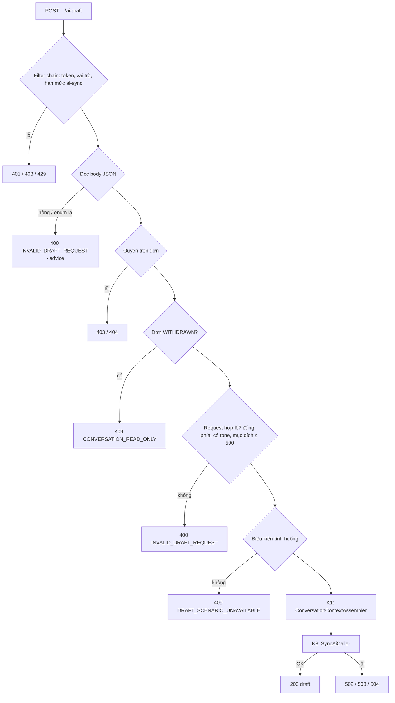

# Walkthrough — FR-C07 · AI soạn nháp tin nhắn

Nhánh: `feat/fr-c07-ai-draft` (tách từ `ca1fb86`, commit đặc tả cuối của FR-C06) · 6 đợt (Plan Mode + 5 đợt code) ·
10/10/2026

> Không có chỗ lệch nào mà đặc tả chưa được duyệt lại. Mọi điểm làm rõ (L1–L13) nằm ở mục 12 REQUIREMENT.md, duyệt
> 10/10/2026.

## 1. Mục tiêu

Ở FR-C06, HR và ứng viên nhắn tin với nhau quanh một đơn ứng tuyển, nhưng mỗi tin đều phải tự viết từ đầu. FR-C07
thêm nút "Soạn bằng AI" vào khung soạn tin: người dùng chọn một tình huống quen thuộc của vai trò mình (HR: đề nghị
bổ sung thông tin, nhắc lịch phỏng vấn, cảm ơn đã ứng tuyển, thông báo kết quả; ứng viên: hỏi tiến độ, cảm ơn sau
phỏng vấn, xin dời lịch) hoặc tự mô tả mục đích, chọn giọng văn, và nhận một bản nháp tiếng Việt. Bản nháp chỉ là
gợi ý: người dùng xem, bấm "Dùng bản nháp" để đưa vào ô nhập, sửa, rồi tự bấm "Gửi" của FR-C06. Hệ thống không lưu
bản nháp, không tự gửi, và AI không bao giờ thấy điểm, rubric hay giải thích chấm điểm. FR-C07 cũng là nơi xây hai
thành phần dùng chung cho các FR AI về sau: **K1** (gom ngữ cảnh gửi AI, chặn dữ liệu bằng kiểu) và **K3** (gọi AI
đồng bộ có giới hạn trong request của người dùng).

## 2. Các file đã tạo/sửa

**Backend** (đường dẫn tính từ `backend/src/main/java/com/recruitment/`)

| File | Vai trò |
|---|---|
| `ai/sync/SyncAiCaller` | K3: gọi `ChatClient` trên executor riêng, hạn 15 s mỗi lần, thử lại 1 lần khi output hỏng, phân loại lỗi |
| `ai/sync/AiSyncExecutorConfig` | Dựng `ThreadPoolExecutor` 8 luồng thường, không hàng đợi; khai bean `SyncAiCaller` (executor **không** là bean) |
| `ai/sync/SyncAiResult` | Kết quả K3: bản ghi đã parse + tên model |
| `common/exception/AiSyncErrorCode`, `AiSyncFailedException` | Ba mã lỗi K3 (`AI_TIMEOUT`, `AI_UNAVAILABLE`, `AI_INVALID_OUTPUT`) kèm câu tiếng Việt cố định |
| `aicontext/ContextViewer`, `ConversationContext` | K1: vai trò người soạn; record ngữ cảnh cuộc trao đổi (chỉ 7 thành phần cho phép) |
| `aicontext/ConversationContextAssembler` | K1: nạp đơn, Job, công ty, ứng viên, giấy mời mới nhất, 10 tin gần nhất trong một transaction chỉ đọc |
| `ai/messagedraft/MessageDraftService` | Dựng user message (thẻ, cắt tin, thay `<`/`>`), gọi K3, kiểm bản nháp (R-D6) |
| `ai/messagedraft/DraftScenario`, `DraftTone`, `MessageDraftPayload` | Tình huống theo phía, giọng văn, schema JSON output |
| `ai/client/MessageDraftChatClientConfig` | Bean `messageDraftChatClient` riêng, trần 800 token đầu ra |
| `resources/ai/prompt/message-draft-v1.st` | Prompt hệ thống cố định |
| `messagedraft/MessageDraftHrController`, `MessageDraftCandidateController` | A1 (`GET …/ai-draft/scenarios`), A2 (`POST …/ai-draft`) mỗi phía |
| `messagedraft/MessageDraftFacade` | Điều phối: quyền → đơn đã rút → hợp lệ request → điều kiện tình huống → K1 → service |
| `messagedraft/MessageDraftExceptionAdvice` | Chỉ cho hai controller trên: body JSON hỏng/enum lạ → 400 `INVALID_DRAFT_REQUEST` |
| `messagedraft/DraftUnavailableReason`, `dto/*` | Lý do khoá tình huống; 3 DTO (A1, A2 request, A2 response) |
| `common/exception/DraftScenarioUnavailableException`, `InvalidDraftRequestException`, `GlobalExceptionHandler` | 409/400 mới; ánh xạ lỗi K3 → 504/503/502 |
| `jobapplication/ApplicationStatus` (sửa) | Thêm `labelVi()` — nhãn trạng thái tiếng Việt một chỗ |
| `notification/NotificationContentBuilder` (sửa) | Bỏ map nhãn riêng, dùng `labelVi()`; nội dung thông báo không đổi |
| `ratelimit/RateLimitFilter` (sửa) | Nhóm `ai-sync` theo userId (5 lượt, nạp 2/phút) cho hai mẫu `POST …/ai-draft` |

**Frontend** (`frontend/src/features/`)

| File | Vai trò |
|---|---|
| `messageDraft/types.ts`, `api.ts`, `queries.ts` | Kiểu DTO; gọi A1, A2 (A2 timeout 35 s riêng); query/mutation không tự thử lại |
| `messageDraft/draftLabels.ts` | Mọi chuỗi hiển thị của khối soạn nháp, nguyên văn UI.md mục 7 |
| `messageDraft/MessageDraftPanel.tsx` | Khối soạn nháp: chọn tình huống/giọng, tiến trình, khối "Do AI tạo", lỗi |
| `messageDraft/ToneSegmentedControl.tsx`, `ReplaceDraftDialog.tsx` | Nút chọn giọng văn 2 lựa chọn; hộp thoại hỏi khi ô nhập đã có chữ |
| `messages/MessageComposer.tsx` (sửa) | Nút "Soạn bằng AI", mở/đóng khối, đưa bản nháp vào ô nhập, dòng nhắc |

Không có migration mới (vẫn dừng ở `V12`).

## 3. Luồng chính

### 3.1 Mở khối và tải danh sách tình huống (A1)

1. Người dùng bấm "Soạn bằng AI" trong `MessageComposer` → render `MessageDraftPanel` phía trên ô nhập.
2. `useDraftScenariosQuery` gọi `GET /api/{hr|candidates}/applications/{id}/messages/ai-draft/scenarios`.
3. Filter chain (JWT, kiểm vai trò theo tiền tố đường dẫn) → controller → `MessageDraftFacade.scenariosAsHr/AsCandidate`.
4. Facade kiểm quyền bằng **đúng hai cơ chế của FR-C06**: HR qua `HrApplicationAccess.loadOwned` (đơn công ty khác
   403), ứng viên qua `JobApplicationRepository.findByIdAndCandidateId` (đơn người khác và đơn không tồn tại cùng
   404). Đơn `WITHDRAWN` → 409 `CONVERSATION_READ_ONLY`.
5. Facade đọc bảng `interview_invitations` (đơn có giấy mời chưa) và tính `unavailableReason` cho từng tình huống của
   phía gọi (ví dụ "Thông báo kết quả" chỉ mở khi đơn `HIRED`/`REJECTED`). Trả danh sách theo thứ tự cố định.
6. Panel chọn sẵn tình huống đầu tiên còn dùng được; tình huống bị khoá hiện kèm câu lý do.

### 3.2 Tạo bản nháp (A2)

1. `MessageDraftFacade.draftAsHr/AsCandidate` chạy các bước kiểm theo đúng thứ tự R-Q3 (sơ đồ trên). Mọi lỗi trước
   K3 dừng lại **không** gọi AI.
2. **K1** — `ConversationContextAssembler.forConversation(viewer, applicationId)` mở một transaction chỉ đọc, nạp
   `job_applications`, `jobs`, `companies`, `users` (họ tên ứng viên), giấy mời mới nhất (`interview_invitations`),
   10 tin gần nhất (`application_messages`, đảo thành cũ → mới), trả record `ConversationContext`. Transaction đóng
   ngay khi method trả về.
3. `MessageDraftService.draft` dựng user message: khối `<ngu_canh>` (vai trò, họ tên ứng viên, Job, công ty, nhãn
   trạng thái `labelVi()`, giờ phỏng vấn theo Asia/Ho_Chi_Minh `HH:mm dd/MM/yyyy`), khối `<tin_gan_day>` với từng
   `<tin vai_tro="…">` (cắt 1000 code point + `…`, tin chỉ có tệp ghi `(tệp đính kèm)`), hai dòng "Tình huống",
   "Giọng văn", và `<muc_dich>` khi `CUSTOM`. Mọi `<`/`>` trong dữ liệu người dùng đổi thành `‹`/`›`.
4. **K3** — `SyncAiCaller.call(...)` kiểm không có transaction trên luồng request, gửi việc cho executor, chờ tối đa
   15 s. Trên luồng executor, `ChatClient` (bean `messageDraftChatClient`, trần 800 token) gửi system message (file
   prompt + `{format}`) và user message tới `ChatModel`; `BeanOutputConverter<MessageDraftPayload>` parse JSON.
5. Output hỏng (JSON lỗi, `draft` rỗng hoặc > 4000 ký tự, bị cắt vì chạm trần token) → gọi lại **một** lần; hỏng lần
   nữa → 502. Lỗi nhà cung cấp → 503 ngay. Quá 15 s → `Future.cancel(true)`, 504.
6. Response `{"draft": "…"}`. Không có dòng nào được ghi vào DB.

### 3.3 Dùng bản nháp và gửi

1. Panel hiện bản nháp trong khối "Do AI tạo" (văn bản thuần, giữ xuống dòng) với "Dùng bản nháp", "Tạo lại", "Bỏ qua".
2. "Dùng bản nháp": ô nhập trống → điền ngay; có chữ → `ReplaceDraftDialog` hỏi "Giữ" hay "Thay". Khối đóng, focus về
   ô nhập, hiện dòng nhắc "Bản nháp do AI soạn…".
3. Người dùng sửa rồi bấm "Gửi" — đi nguyên đường M2 của FR-C06 (`useSendMessageMutation`), như tin tự gõ.

## 4. Quyết định thiết kế

**K1 chặn dữ liệu bằng kiểu, kiểm bằng ba lớp test.** *Đã chọn:* `ConversationContext` là record bất biến chỉ có
đúng 7 thành phần (`viewer`, họ tên ứng viên, Job, công ty, trạng thái, lịch phỏng vấn, tin gần nhất); không `Map`,
không `Object`, không chuỗi "phụ"; assembler không được inject repository của `scoring/`, `rubric/`, `resume/`.
*Khác:* một DTO chung có field điểm và "lọc theo vai trò" bằng `if`, hoặc dặn AI trong prompt "đừng nhắc điểm".
*Vì sao:* lời dặn trong prompt không kiểm chứng được, còn `if` dễ bị quên ở FR sau. Khi kiểu dữ liệu không có chỗ
chứa điểm thì không đường code nào đưa điểm vào prompt được. Ba lớp test: **T10** (`ConversationContextSignatureTest`,
`MessageDraftSignatureTest`) đọc bằng reflection kiểu và tên của mọi thành phần, tham số constructor; **T9**
(`MessageDraftPromptIntegrationTest.t9_…`) seed thật điểm 7.345, lý do chấm, evidence, tên tiêu chí, giải thích, ghi
chú lịch sử, thư giới thiệu rồi bắt `Prompt` thật gửi tới `ChatModel` từ cả hai phía — không chuỗi nào lọt; **T11**
(`MessageDraftResponseKeysIntegrationTest`) duyệt đệ quy JSON response, không có khoá cấm. FR sau cần dữ liệu chỉ
dành cho HR phải tạo record riêng với method nhận `ContextViewer.HR` cố định (R-K1-5).

**K3 và việc SDK tự thử lại ngầm (L1).** *Đã chọn:* "thử lại tối đa 1 lần" hiểu ở tầng K3 — tối đa 2 lần gọi
`ChatModel`, chỉ khi output hỏng; lỗi nhà cung cấp trả 503 ngay. *Khác:* đặt `maxRetries = 0` cho riêng lời gọi K3;
khai thêm một bean `ChatModel` thứ hai có `maxRetries = 0`; đổi `maxRetries` của model dùng chung. *Vì sao:* Plan Mode
đọc bytecode (`javap`) và thấy `AnthropicChatModel` chỉ đọc `maxRetries`/`timeout` lúc dựng client, gọi API không
truyền tuỳ chọn theo request, nên không tắt được theo từng lời gọi. Bean `ChatModel` thứ hai gây
`NoUniqueBeanDefinitionException` ở mọi nơi tiêm `ChatClient.Builder` và vỡ mock `LlmTestConfiguration` (CLAUDE.md
§3b). Đổi model dùng chung thì đổi hành vi các job nền D1/D2/D4/F2. Gọi thẳng SDK vòng qua `ChatModel` thì phá quy tắc
mock ở tầng `ChatModel`. Cái giá: trong hạn 15 s có thể đã có tới 3 request HTTP thật (ghi vào nợ kỹ thuật).

**Hạn 15 s tự chốt bằng `Future.get` + `cancel(true)`.** Timeout HTTP 30 s dùng chung quá dài cho người đang chờ.
Plan Mode xác minh `cancel(true)` không dừng được request OkHttp đang chặn đọc socket, nhưng chặn được các lần SDK thử
lại sau đó, nên lời gọi bị bỏ chạy ngầm tối đa khoảng 45 s (15 s + một lần HTTP 30 s) — suy từ bytecode, chưa đo.

**Executor không khai thành bean Spring (L9).** *Đã chọn:* `AiSyncExecutorConfig` tự dựng `ThreadPoolExecutor` và
giao cho `SyncAiCaller` sở hữu, đóng bằng `shutdownNow()` khi context tắt. *Khác:* `@Bean ThreadPoolExecutor`.
*Vì sao:* Spring Boot 4.1 chỉ tạo `applicationTaskExecutor` khi **chưa** có bean `java.util.concurrent.Executor` nào
(`@ConditionalOnMissingBean`, đọc bằng `javap`). Khai executor của K3 thành bean sẽ âm thầm tắt executor chung của cả
ứng dụng. Luồng thường (không luồng ảo) và không hàng đợi: hết 8 luồng → 503 ngay thay vì xếp hàng.

**K3 tự kiểm "không có transaction" trên luồng gọi (L3).** Lời gọi model chạy trên luồng executor, nơi không bao giờ
có transaction của request, nên kiểm bên trong mock luôn "đúng" mà không bắt được gì. `SyncAiCaller` kiểm
`TransactionSynchronizationManager.isActualTransactionActive()` trước khi gửi việc → `IllegalStateException`. Hệ quả
thấy được: các lớp test tích hợp của `messagedraft/` **không** bọc `@Transactional` cấp lớp, vì MockMvc chạy trên
chính luồng test — nếu bọc, K3 sẽ ném lỗi đúng như thiết kế (`SyncAiCallerTransactionIntegrationTest` giữ chốt này;
không được xoá khi refactor).

**Cô lập dữ liệu không tin cậy (R-I).** *Đã chọn:* system message chỉ là file prompt cố định + `{format}`; mọi chuỗi
người dùng nhập (tin nhắn, mục đích, cả họ tên, tên Job, tên công ty, địa điểm) nằm trong user message, trong thẻ cố
định, với `<`/`>` đã đổi thành `‹`/`›` để dữ liệu không tự đóng thẻ được. Prompt nói rõ nội dung trong thẻ là dữ liệu,
câu mệnh lệnh trong đó không được làm theo. *Vì sao chấp nhận rủi ro còn lại:* ngữ cảnh không chứa bí mật nào (K1),
AI không có công cụ, kết quả chỉ hiện cho chính người gọi và phải tự bấm Gửi. T13 kiểm system message bằng đúng file
prompt (sau khi chuẩn hoá xuống dòng — L10) và thẻ bị tiêm đã bị vô hiệu.

**Không lưu bản nháp, không đánh dấu tin "do AI soạn" (R-D1, R-D3).** Bản nháp chỉ sống trong response A2 và state
React; không bảng, không cache, không `localStorage`. Lưu bản nháp sẽ tạo dữ liệu mới cần quyền, thời hạn giữ, và
siêu dữ liệu K4 — ngoài phạm vi. Khi đã vào ô nhập, bản nháp là chữ của người gửi (C06 R-G1: nội dung tin là lời người
gửi); đánh dấu "do AI soạn" vừa phải sửa DTO của FR-C06 vừa sai về trách nhiệm — người gửi đã đọc, sửa và tự bấm Gửi.

**Bắt JSON hỏng bằng advice phạm vi hẹp (R-Q3b, L8).** `scenario`/`tone` giữ kiểu enum nên giá trị lạ bị Spring từ
chối ở bước đọc body, trước cả kiểm quyền. Advice chỉ áp cho hai controller soạn nháp và có
`@Order(HIGHEST_PRECEDENCE)`; thêm handler vào `GlobalExceptionHandler` sẽ đổi 400 của mọi endpoint JSON có sẵn
(hai ca hồi quy trong `MessageDraftAccessIntegrationTest` giữ điều này).

**Phụ thuộc một chiều giữa package (L11).** `DraftScenario`/`DraftTone` đặt ở `ai/messagedraft/` để service dùng mà
không import ngược `messagedraft/`; hàm điều kiện R-S3 (trả `DraftUnavailableReason`) nằm ở facade.

**Giữ quy tắc soát nhân thân tuyệt đối (L13).** Dòng cấm thông tin nhân thân trong prompt từng liệt kê "tuổi, ngày
sinh, giới tính…" — đúng những từ lệnh soát nguyên tắc 13 của `srs-guard` tìm, với kỳ vọng 0 dòng không ngoại lệ.
*Khác:* thêm ngoại lệ vào skill cho "câu cấm". *Vì sao không:* một ngoại lệ dựa trên ý nghĩa câu thì lệnh `grep` không
phân biệt được, và mở đường cho prompt sau lọt các từ đó dưới danh nghĩa "đang cấm". Viết lại câu không liệt kê ("không
nhắc tới bất kỳ thông tin cá nhân, nhân thân nào ngoài họ tên ứng viên và tên công ty") giữ được ý và giữ được lệnh
soát đơn giản, máy kiểm được.

**Nhãn trạng thái một chỗ.** `ApplicationStatus.labelVi()` thay map riêng của `NotificationContentBuilder`; prompt và
thông báo dùng chung, tránh bản thứ ba. `ApplicationStatusLabelTest` khoá đúng 5 chuỗi cũ.

## 5. Ràng buộc đã thực thi

| Mã | Ràng buộc | Thực thi ở đâu |
|---|---|---|
| R-Q1 | Kiểm quyền dùng lại cơ chế C06 | `MessageDraftFacade.loadForHr` (`HrApplicationAccess.loadOwned`), `loadForCandidate` |
| R-Q3 | Thứ tự kiểm, lỗi trước K3 không gọi AI | `MessageDraftFacade.draft` |
| R-S2 | Đơn `WITHDRAWN` → 409 | `MessageDraftFacade.requireWritable` |
| R-S3 | Điều kiện tình huống kiểm ở backend | `MessageDraftFacade.unavailableReason` |
| R-S4, R-S5 | Mục đích ≤ 500 sau chuẩn hoá CRLF; bắt buộc giọng văn | `MessageDraftFacade.validateRequest` |
| R-K1-2 | Ngữ cảnh chỉ có thành phần cho phép | kiểu `ConversationContext` |
| R-K1-3 | Transaction chỉ đọc, ngắn | `@Transactional(readOnly = true)` ở `ConversationContextAssembler.forConversation` |
| R-K3-1 | 15 s mỗi lần | `SyncAiCaller.attempt` (`future.get`), `app.ai-sync.attempt-timeout-ms` |
| R-K3-2 | Thử lại 1 lần chỉ khi output hỏng | `SyncAiCaller.call` |
| R-K3-4 | Không transaction khi gọi AI | `SyncAiCaller.call` (kiểm luồng gọi) |
| R-K3-5 | 8 luồng, không hàng đợi | `AiSyncExecutorConfig.newExecutor` |
| R-K3-8 | Hạn mức `ai-sync` theo userId | `RateLimitFilter.classify` |
| R-K3-9 | Trần token ở bean riêng; chạm trần = hỏng | `MessageDraftChatClientConfig`; `SyncAiCaller.isTruncated` |
| R-D1, R-D2, R-S6 | Không lưu, không gửi, không đổi trạng thái | Không có repository ghi nào trên đường A2; T18 |
| R-D6 | Bản nháp khác rỗng, ≤ 4000 | `MessageDraftService.isValidDraft` |
| R-I2, R-I3, R-I5 | System message cố định; thẻ + thay `<`/`>`; cắt 1000 code point | `MessageDraftService.buildUserMessage`, `sanitize` |
| SRS nguyên tắc bổ sung | AI không tự gửi; không thông tin nhân thân | Chỉ nút "Gửi" của C06 gọi M2; dòng cấm trong prompt (L13) |
| UI_GUIDE §4 | Nhãn "Do AI tạo" + icon | `MessageDraftPanel` |

## 6. Đã kiểm thử gì

**Tự động.** Full suite một lần ở đợt 6: **975/975** pass. Riêng FR-C07:
- K3 (đợt 2): `SyncAiCallerTest` 16 ca (T14–T16 ở mức K3: thử lại khi JSON hỏng/validate hỏng/chạm trần; 4 lớp lỗi
  tạm thời và lỗi khác → 1 lần gọi; hết luồng → 0 lần; hết hạn 300 ms); `SyncAiCallerTransactionIntegrationTest` 2 ca
  (T17); `RateLimitFilterTest` thêm 7 ca T19.
- K1 (đợt 3): `ConversationContextAssemblerIntegrationTest` 9, `ConversationContextSignatureTest` 4,
  `ApplicationStatusLabelTest` 1; toàn bộ test `notification/` pass không sửa (T21).
- C07 (đợt 4): `MessageDraftAccessIntegrationTest` 18 (T1–T6, T8, 2 ca hồi quy), `…ScenarioIntegrationTest` 4 (T7),
  `…PromptIntegrationTest` 6 (T9, T12, T13), `…SignatureTest` 2, `…ResponseKeysIntegrationTest` 2 (T11),
  `…ErrorMappingIntegrationTest` 5 (T16b, kèm `maxTokens = 800`), `…NoSideEffectIntegrationTest` 2 (T18),
  `MessageDraftServiceTest` 5 (R-D6); 9 lớp `messaging/` pass không sửa (T20). Mọi mốc biên có ngưỡng−1/đúng/ngưỡng+1
  (mục đích 499/500/501, tin 999/1000/1001 code point, bản nháp 3999/4000/4001).
- Frontend: `npm run build`, `npm run lint` sạch; 5 lệnh tìm mục 7.3 đều 0 dòng.

**Kiểm bằng HTTP (mục 7.2).** Chạy khối PowerShell trên backend thật (profile thường, rate limit bật, khoá thật,
prompt sau L13) ở đợt 6: nhóm 1–8b khớp "Mong đợi" từng dòng (8b: bốn dòng 403 rồi hai dòng 429); nhóm 9 trả 200
`{"draft": …}` tiếng Việt đúng dấu. Bản nháp nhắc lịch dùng đúng họ tên ứng viên, tên công ty, vị trí, giờ 09:00
17/10/2026 (giấy mời seed của A2, đổi sang giờ Việt Nam) và địa điểm; hai ý "có thể bắt đầu sớm hơn 30 phút" và "mang
theo bản sao bằng tốt nghiệp" lấy từ hai tin HR seed của A2 — không có thông tin nào ngoài ngữ cảnh. Lần chạy trước
đó (trước khi sửa) chữ của nhóm 9 bị vỡ vì lệnh đọc body sai bảng mã, không phải lỗi backend (L13).

**Kiểm tay (mục 7.4)** — người dùng soát ngày 10/10/2026 với khoá API thật, seed test, desktop/768px/375px: **mọi
mục đạt** — nút có mặt và không có ở đơn đã rút; khoá tình huống kèm lý do; bản nháp nhắc lịch đúng giờ/địa điểm;
thông báo từ chối không nêu lý do; gõ được trong lúc chờ và được hỏi trước khi thay; tin gửi như tin thường, không
nhãn AI; "Tự mô tả" 501 ký tự khoá nút; lần thứ 6 nhận câu 429; tiêm prompt 3 lần đều không nói ứng viên trúng
tuyển; bố cục 375px không cuộn ngang.

**Chưa test.** Frontend không có test tự động; `RateLimitFilter` nhóm `ai-sync` chỉ có test đơn vị, chưa có test qua
filter chain thật trong Spring context (rate limit tắt trong test profile); thời gian chạy ngầm của lời gọi bị bỏ và
thời gian sinh 800 token chưa đo thực nghiệm.

| "Xong khi" | Cách nghiệm thu | Kết quả |
|---|---|---|
| 7.1 T1–T21, T16b | Các lớp test liệt kê trên | Đạt |
| 7.1 kiểm tĩnh | Lệnh tìm import/chuỗi/migration (đợt 4, lặp lại đợt 6) | Đạt |
| 7.2 HTTP | Khối PowerShell (đã sửa đọc body UTF-8, L13), chạy lại ở đợt 6 với khoá thật | Đạt — nhóm 1–8b khớp từng dòng, nhóm 9 trả 200 tiếng Việt đúng dấu |
| 7.3 frontend | build, lint, 5 lệnh tìm | Đạt |
| 7.4 soát tay | Người dùng, 10/10/2026 | Đạt |
| ROADMAP: chặn đơn không thuộc về mình | 7.2 nhóm 2–4; T3, T4 | Đạt |
| ROADMAP: ngữ cảnh không chứa điểm/rubric | T9, T10, T11 | Đạt |

## 7. Nợ kỹ thuật

- SDK Anthropic tự thử lại ngầm (`maxRetries = 2`) không tắt được theo từng request qua `ChatModel`: trong hạn 15 s một
  lần gọi K3 có thể là tới 3 request HTTP thật.
- Lời gọi bị K3 bỏ (hết 15 s) chạy ngầm tối đa khoảng 45 s và giữ một luồng executor — suy từ bytecode, chưa đo. Nhà
  cung cấp chậm kéo dài thì cả 8 luồng có thể bị giữ, mọi người dùng nhận 503 tới khi các lời gọi ngầm kết thúc.
- Trần 800 token là ước lượng (tiếng Việt khoảng 2–2,5 ký tự/token, 60–80 token/giây), chưa đo trên bản nháp thật.
- `RateLimitFilter` chưa có test qua filter chain thật cho nhóm `ai-sync` (chỉ test đơn vị; test profile tắt rate limit).
- Không khoá tình huống theo giờ phỏng vấn đã qua hay chưa (nhắc lịch cho buổi đã qua vẫn chọn được).
- Frontend chưa có test tự động.

## 8. Lệch so với đặc tả

Mọi chỗ code khác đặc tả ban đầu đều đã sửa vào đặc tả và duyệt lại ngày 10/10/2026 (mục 12 REQUIREMENT.md):
- L1: không tắt được thử lại ngầm của SDK; "thử lại 1 lần" hiểu ở tầng K3. L4: cận chạy ngầm hạ từ ~100 s xuống ≤ ~45 s.
- L2: mã lỗi K3 đặt ở `common/exception/` (không ở `ai/sync/`). L3: K3 tự kiểm transaction, T17 viết lại.
- L5, L6: số luồng và hạn test 2000 ms khai trong yml. L7: K1 trả dữ liệu thô, service cắt/thay ký tự.
- L8: advice có `@Order`. L9: executor không là bean.
- L10: T13 so sau khi chuẩn hoá xuống dòng; Spring AI tự nối hướng dẫn định dạng vào cuối user message.
- L11: vị trí `DraftScenario`/`DraftTone`. L12: thanh tiến trình `animate-m3-linear-progress` (UI.md 5d) và 4 chi tiết
  frontend. L13: câu cấm nhân thân trong prompt; khối 7.2 đọc body theo UTF-8, nhóm 9 bắt buộc.

## Câu hỏi tự kiểm tra

1. Nếu xoá kiểm `isActualTransactionActive()` trong `SyncAiCaller` thì test nào đỏ, và lỗi thật trên production sẽ
   là gì?
2. Một tin nhắn ứng viên chứa `</tin>` đi từ bảng `application_messages` tới `ChatModel` qua những class nào, và bị
   biến đổi ở bước nào?
3. Vì sao chặn dữ liệu chấm điểm bằng kiểu `ConversationContext` mà không bằng lời dặn trong prompt hay một `if` theo
   vai trò?
