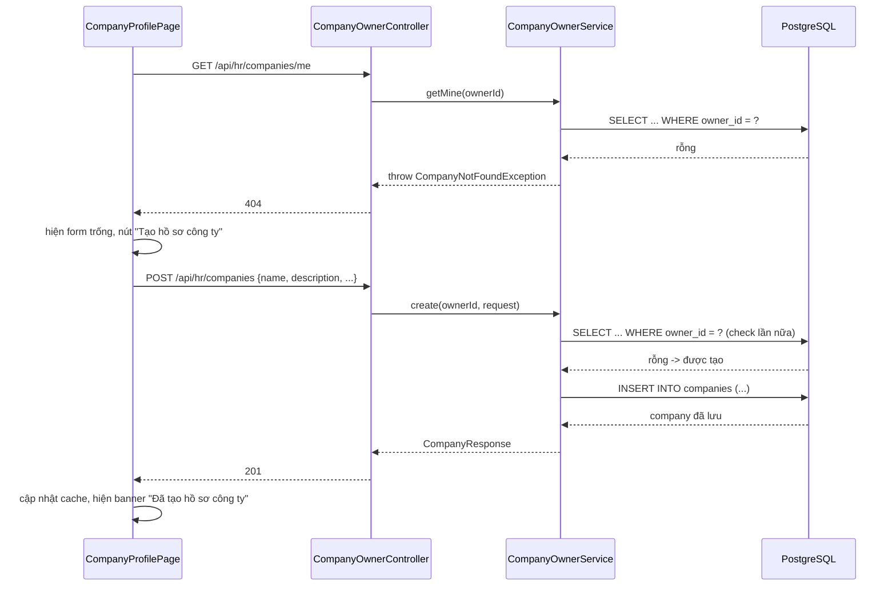
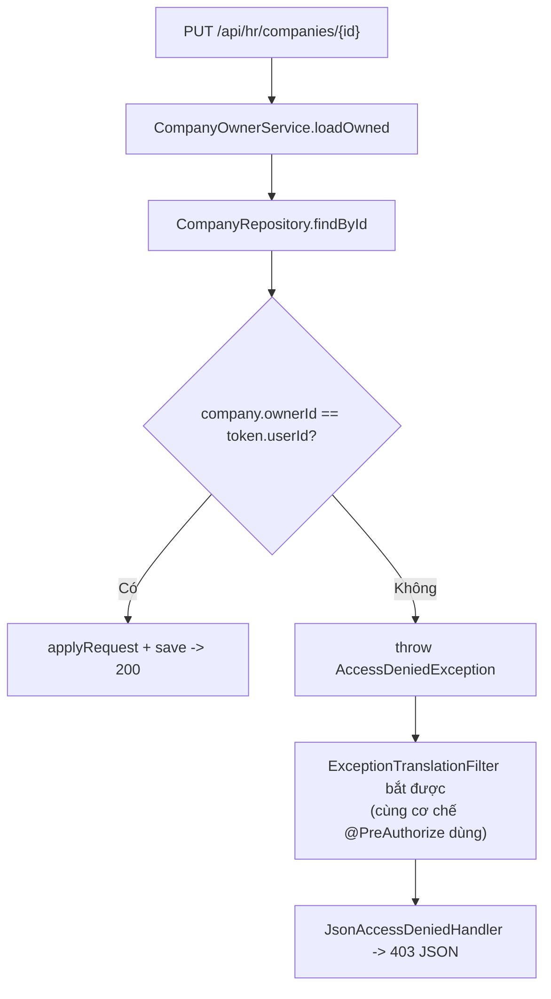
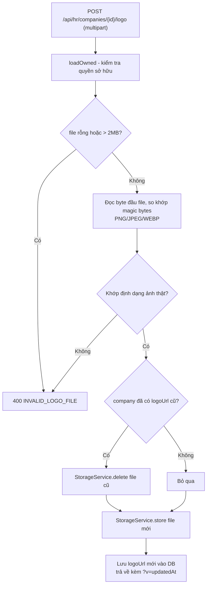

# FR-H01 — Quản lý Hồ sơ Doanh nghiệp

Nhánh: `feat/fr-h01-company` · Phase B1 · Backend + Frontend

## 1. Mục tiêu

FR-H01 cho phép HR quản lý hồ sơ công ty của chính mình: tạo lần đầu, xem lại, sửa thông tin
(tên, mô tả, quy mô, lĩnh vực, website, liên hệ, địa chỉ), và tải logo lên. Dữ liệu này chính là
thứ FR-C02 (nhánh trước) đã hiển thị công khai cho ứng viên xem — B1 là nơi dữ liệu đó thực sự
được tạo ra thay vì chỉ đọc.

Ràng buộc quan trọng nhất của nhánh này không phải là CRUD (đơn giản), mà là **quyền sở hữu**:
mỗi HR chỉ được có đúng một công ty, và không HR nào được sửa công ty của HR khác — kể cả khi họ
biết chính xác id của công ty đó. Việc kiểm tra "có phải role HR không" (`SecurityConfig` đã làm
từ FR-C01) là chưa đủ, phải kiểm tra thêm "công ty này có phải của đúng người gọi API không" ở
tầng service.

## 2. Các file đã tạo/sửa

### Backend

| File | Vai trò |
|---|---|
| `db/migration/V2__company_unique_owner.sql` | Thêm ràng buộc `UNIQUE(owner_id)` cho bảng `companies`, xoá index thường trùng chức năng |
| `company/Company.java` (sửa) | Thêm `logoUrlWithCacheBust()` — method dẫn xuất, không phải cột DB |
| `company/CompanyRepository.java` (sửa) | Thêm `findByOwnerId` |
| `company/CompanyOwnerService.java` | Toàn bộ nghiệp vụ: tạo, xem của mình, sửa, upload logo, kiểm tra quyền sở hữu |
| `company/CompanyOwnerController.java` | 4 endpoint dưới `/api/hr/companies` |
| `company/dto/CompanyRequest.java`, `CompanyResponse.java` | DTO vào/ra cho phía HR (khác `CompanyPublicResponse` đã có — bản này có thêm `ownerId`, `updatedAt`) |
| `company/CompanyPublicService.java` (sửa) | Dùng `logoUrlWithCacheBust()` thay vì đọc thẳng `logoUrl` |
| `job/JobPublicService.java` (sửa) | Tương tự, để card việc làm (FR-C02) không hiển thị logo cũ bị cache |
| `common/exception/CompanyAlreadyExistsException.java`, `InvalidLogoFileException.java` | Exception nghiệp vụ mới |
| `common/exception/CompanyNotFoundException.java` (sửa) | Thêm constructor nhận message tuỳ ý (dùng cho case "HR chưa tạo công ty") |
| `common/exception/GlobalExceptionHandler.java` (sửa) | 3 handler mới: công ty đã tồn tại (409), file logo không hợp lệ (400), vi phạm ràng buộc DB có điều kiện (409) |
| `auth/SecurityConfig.java` (sửa) | Thêm `/uploads/**` vào `permitAll()` — logo là dữ liệu công khai |
| `storage/StorageService.java` | Interface lưu trữ file, tách khỏi cách lưu cụ thể |
| `storage/LocalStorageService.java` | Implementation duy nhất hiện có — lưu ra đĩa local |
| `storage/StorageWebConfig.java` | Map URL `/uploads/**` sang thư mục file thật trên đĩa |
| `test/company/CompanyOwnerIntegrationTest.java` | 4 test tích hợp qua `MockMvc` + Postgres thật |
| `test/resources/application-test.yml` (sửa) | Trỏ đường dẫn lưu file sang thư mục tạm khi chạy test |

### Frontend

| File | Vai trò |
|---|---|
| `components/layout/HrLayout.tsx` | Khung layout quản trị HR đầu tiên của dự án: sidebar 240px + topbar, dùng chung cho mọi trang HR sau này |
| `components/ui/textarea.tsx` | Sinh bằng CLI `npx shadcn add textarea`, không viết tay |
| `features/companies/ownerApi.ts`, `ownerQueries.ts`, `ownerTypes.ts` | Gọi API `/hr/companies/*`, quản lý cache bằng TanStack Query |
| `pages/CompanyProfilePage.tsx` | Trang form hồ sơ công ty — vừa tạo mới vừa sửa, cùng một form |
| `pages/HrHomePage.tsx` (sửa) | Bọc trong `HrLayout`, bỏ nút đăng xuất riêng (đã có ở topbar dùng chung) |
| `App.tsx` (sửa) | Thêm route `/hr/company` |
| `vite.config.ts` (sửa) | Thêm proxy `/uploads` sang backend — thiếu dòng này thì ảnh logo 404 khi chạy `npm run dev` |
| `index.css` (sửa) | Sửa 9 biến trong `:root` để các component shadcn (`Button`, `Input`, `Card`...) thực sự dùng đúng màu thương hiệu, xem Quyết định 8 |

## 3. Luồng chính

### Luồng 1 — HR mở trang hồ sơ công ty lần đầu, tạo mới

### Luồng 2 — HR sửa công ty của người khác (bị chặn)

Đây là điểm dễ làm sai nhất của FR-H01 (đã ghi rõ trong `docs/PHASES.md`): chỉ kiểm tra
`hasRole("HR")` là không đủ, vì HR B cũng có role HR hợp lệ. `loadOwned()` là nơi duy nhất trong
`CompanyOwnerService` load một công ty theo id — `update()` và `uploadLogo()` đều gọi qua đây,
nên không có đường nào bỏ sót kiểm tra quyền sở hữu.

### Luồng 3 — Upload logo

`StorageService` là interface — `LocalStorageService` là implementation duy nhất, ghi file vào
`{app.storage.local-path}/logos/{companyId}.{ext}` và trả về đường dẫn public dạng
`/uploads/logos/{...}`. `StorageWebConfig` map `/uploads/**` sang đúng thư mục đó để trình duyệt
tải được ảnh trực tiếp, không qua controller nào xử lý riêng.

## 4. Quyết định thiết kế

**Thêm `UNIQUE(owner_id)` ở DB bằng migration mới, không chỉ kiểm tra ở tầng service**
- Đã chọn: migration `V2` xoá index `idx_companies_owner` (thường), thêm constraint
  `uq_company_per_owner` (UNIQUE, tự sinh index B-tree thay thế).
- Lựa chọn khác: chỉ kiểm tra "đã có công ty chưa" bằng một câu `SELECT` trước khi `INSERT` ở
  tầng service, không đổi schema.
- Vì sao: nhất quán với triết lý đã dùng cho `uq_application_per_cycle` (sẽ dùng ở FR-U02) —
  "ràng buộc DB là chốt chặn cuối cùng". `SELECT` trước `INSERT` có race condition lý thuyết
  (hai request tạo đồng thời cùng vượt qua bước kiểm tra trước khi cả hai cùng ghi); DB constraint
  không có kẽ hở đó. Trước khi thêm migration đã chạy `SELECT owner_id, COUNT(*) ... HAVING
  COUNT(*) > 1` để xác nhận dữ liệu hiện có sạch (0 dòng), an toàn để thêm.

**Interface `StorageService` + 1 implementation local, không dùng MinIO dù container đã chạy sẵn**
- Đã chọn: `StorageService` (interface) và `LocalStorageService` (lưu đĩa, đọc cấu hình
  `app.storage.local-path`).
- Lựa chọn khác: dùng thẳng MinIO (`recruitment-storage` trong `docker-compose.yml` đã chạy sẵn).
- Vì sao: đây là tính năng upload file đầu tiên của cả dự án — `pom.xml` chưa có dependency MinIO
  nào, chưa có dòng code nào từng đụng tới nó. Thêm MinIO ngay ở B1 nghĩa là gánh thêm: thêm
  dependency, cấu hình bucket/credential, xử lý lỗi kết nối MinIO — trong khi `application.yml`
  vốn đã để `app.storage.type: local` làm mặc định dev. Tách interface từ đầu để khi cần dùng
  MinIO thật (C1 hoặc `chore/hardening`) chỉ cần viết thêm một implementation mới, không sửa gì
  trong package `company/`.

**Xác định định dạng ảnh bằng magic bytes, không tin tên file hay `Content-Type`**
- Đã chọn: đọc 8-12 byte đầu của file, so khớp chữ ký nhị phân của PNG/JPEG/WEBP.
- Lựa chọn khác: kiểm tra đuôi file (`.png`) hoặc `file.getContentType()` do trình duyệt gửi lên.
- Vì sao: cả hai đều do client tự khai, có thể giả mạo (đổi tên `virus.exe` thành `logo.png` vẫn
  qua được nếu chỉ kiểm tra đuôi). Test `uploadFakeExeRenamedToPng_isRejected` xác nhận trực tiếp
  trường hợp này bị chặn.

**Kiểm tra quyền sở hữu bằng `AccessDeniedException` chuẩn của Spring Security, không viết
exception + handler riêng**
- Đã chọn: `loadOwned()` ném `org.springframework.security.access.AccessDeniedException`.
- Lựa chọn khác: tự định nghĩa `CompanyAccessDeniedException`, thêm `@ExceptionHandler` riêng
  trong `GlobalExceptionHandler` trả về 403.
- Vì sao: `AccessDeniedException` ném ở bất kỳ đâu trong luồng xử lý request (kể cả từ service,
  không chỉ từ `@PreAuthorize`) đều tự động bị `ExceptionTranslationFilter` (một phần của
  `SecurityConfig` đã cấu hình từ FR-C01) bắt lại và chuyển cho `JsonAccessDeniedHandler` — đúng
  cơ chế đang chạy cho việc chặn `/api/hr/**` theo role. Dùng lại cơ chế có sẵn thay vì viết thêm
  một đường xử lý lỗi song song cho cùng một loại lỗi (403). Đã xác nhận `GlobalExceptionHandler`
  không có `@ExceptionHandler(Exception.class)` nào có thể vô tình bắt trước
  `AccessDeniedException`, và có test tích hợp (`hrA_updateHrBCompany_returnsForbidden`) chứng
  minh cơ chế này hoạt động đúng khi ném từ service, không chỉ suy luận lý thuyết.

**Cache-bust `logoUrl` bằng `?v={updatedAt}`, không thêm cột `logo_updated_at` riêng**
- Đã chọn: `Company.logoUrlWithCacheBust()` nối thêm `?v=` + timestamp của `updatedAt` (cột đã
  có sẵn, tự động cập nhật bởi trigger DB) vào cuối `logoUrl` mỗi khi trả về client.
- Lựa chọn khác: thêm cột `logo_updated_at` riêng, chỉ đổi khi thật sự upload logo mới.
- Vì sao: tránh thêm một thay đổi schema nữa chỉ để phục vụ cache trình duyệt. Đánh đổi: sửa một
  field bất kỳ (kể cả chỉ đổi tên công ty, không đụng logo) cũng làm URL logo đổi theo, khiến
  trình duyệt tải lại ảnh dù ảnh không đổi — chấp nhận vì đây chỉ là lãng phí một lần tải, không
  gây sai dữ liệu. Method đặt tên `logoUrlWithCacheBust()` (không có tiền tố `get`) để Hibernate
  không hiểu nhầm là property cần map vào cột, và Jackson không tự động serialize nó ra JSON
  ngoài ý muốn khi entity vô tình lọt vào một response nào đó.

**`DataIntegrityViolationException` chỉ trả 409 khi đúng tên constraint, các vi phạm khác rơi về 500**
- Đã chọn: `GlobalExceptionHandler` kiểm tra `ex.getMostSpecificCause().getMessage()` có chứa
  chuỗi `"uq_company_per_owner"` không, chỉ trả 409 khi đúng; nếu không, `throw ex` để rơi về xử
  lý lỗi mặc định của Spring Boot.
- Lựa chọn khác: bắt mọi `DataIntegrityViolationException` và trả 409 chung.
- Vì sao: nếu bắt mù, một lỗi ràng buộc DB hoàn toàn khác (ví dụ lỗi `NOT NULL` do bug ở chỗ
  khác) sẽ bị hiển thị nhầm thành "công ty đã tồn tại" — sai thông tin cho người dùng và che mất
  lỗi thật khi debug.

**Frontend chuyển sang dùng `components/ui/*` (shadcn) cho form, sửa lại token màu trong
`index.css` thay vì viết tay như `RegisterForm`/`LoginForm`**
- Đã chọn: `CompanyProfilePage` dùng `Button`, `Card`, `Input`, `Label`, `Textarea` từ
  `components/ui/`; sửa 9 biến trong `:root` (`--foreground`, `--muted-foreground`, `--border`,
  `--secondary`, `--muted`, `--background`, `--card`, `--popover`, `--destructive`, và `--radius`
  từ `0.625rem` xuống `6px`) để chúng tham chiếu đúng token brand thay vì màu xám/oklch mặc định
  lúc cài shadcn.
- Lựa chọn khác (hướng ban đầu): viết tay bằng element thuần + class Tailwind trực tiếp, giống
  `RegisterForm.tsx`/`LoginForm.tsx`/`CompanyProfileCard.tsx` — cách này thực tế đang được dùng ở
  mọi form khác trong dự án, trong khi 7 component shadcn đã cài từ nhánh `chore/shadcn-setup`
  chưa từng được import ở đâu.
- Vì sao: người dùng chỉ ra rằng `--primary`/`--ring`/`--accent` trong `:root` **đã** được sửa
  bằng đúng hex brand (`#0078C9`, `#1AC639`) ở nhánh `chore/shadcn-setup` — không phải một hệ màu
  thứ hai như nhận định ban đầu. 7 component đó được cài rõ ràng cho Phase B; nếu B1 (trang Phase
  B đầu tiên) không dùng thì không nhánh nào sau sẽ dùng. Sau khi xác nhận lại, các biến còn lại
  (`--foreground`, `--border`...) đúng là chưa khớp token brand (oklch mặc định, không tham chiếu
  gì cả) nên được sửa thẳng trong `:root`, không sửa file trong `components/ui/`. `HrLayout` vẫn
  viết tay bằng token brand (`border-line`, `text-ink`...) vì đó là layout, không phải form
  control — không thuộc nhóm 5 component vừa nêu.

**Banner phản hồi khi lưu dùng lại đúng token của `LoginForm` (`bg-brand-light`/`text-brand`,
`text-danger`), không dùng `text-destructive`/`bg-primary` của shadcn dù đang ở trang shadcn**
- Đã chọn: thông báo "Đã lưu thay đổi"/"Đã tạo hồ sơ công ty" và lỗi lưu dùng class giống hệt
  banner "Đăng ký thành công" ở `LoginForm.tsx`.
- Lựa chọn khác: dùng `text-destructive` (đã map cùng giá trị màu `--color-danger` sau khi sửa
  `:root`, nên nhìn giống hệt nhau) cho nhất quán "toàn trang dùng token shadcn".
- Vì sao: yêu cầu rõ ràng là tái dùng đúng pattern banner đã có ở A1, không phát minh cách hiển
  thị mới cho cùng một loại thông báo (banner thành công/lỗi) xuất hiện ở nhiều nơi trong app.

**Không dùng `retry` mặc định của React Query cho `useMyCompanyQuery` khi lỗi là 404**
- Đã chọn: `retry: (failureCount, error) => isAxiosError(error) && error.response?.status ===
  404 ? false : failureCount < 1`.
- Lựa chọn khác: giữ nguyên `retry: 1` mặc định của `queryClient` (áp dụng cho toàn app).
- Vì sao: HR chưa tạo công ty là trạng thái **bình thường**, không phải lỗi tạm thời của mạng —
  giữ retry mặc định sẽ gọi lại API 404 một cách vô ích ngay trong lần tải trang đầu tiên của mọi
  HR mới đăng ký.

## 5. Ràng buộc SRS đã thực thi

| FR | Ràng buộc | Thực thi ở đâu |
|---|---|---|
| FR-H01 | Mỗi HR sở hữu đúng một công ty | `V2__company_unique_owner.sql` (`uq_company_per_owner`) + `CompanyOwnerService.create()` kiểm tra trước, trả `CompanyAlreadyExistsException` → 409 |
| FR-H01 (PHASES B1 "Xong khi") | HR A không sửa được công ty của HR B | `CompanyOwnerService.loadOwned()` — so `company.getOwnerId()` với id trong token, ném `AccessDeniedException` → 403; test `hrA_updateHrBCompany_returnsForbidden` |
| FR-H01 | Dữ liệu công ty hiển thị công khai phục vụ FR-C02 | `CompanyOwnerService`/`CompanyPublicService` cùng đọc/ghi một bảng `companies`; `logoUrlWithCacheBust()` dùng chung ở cả 2 chiều đọc (public) và ghi (owner) |
| Quy ước dự án (CLAUDE.md mục 7) | Không tạo cột/field `verdict`/`label`/`isQualified`/`passed` | Đã soát bằng skill `srs-guard` trước khi viết tài liệu này — không có vi phạm nào trong nhánh |
| Bẫy môi trường (CLAUDE.md mục 8) | Không commit thư mục `uploads/` | `.gitignore` đã có sẵn từ trước (`uploads/`, `backend/uploads/`), không cần sửa thêm |

## 6. Đã kiểm thử gì

**Backend** — `CompanyOwnerIntegrationTest` (4 test mới), chạy qua `MockMvc` + Postgres thật
(Testcontainers), đúng 4 tiêu chí nghiệm thu của PHASES.md B1:
- Tạo công ty lần 2 cho cùng HR → 409 `COMPANY_ALREADY_EXISTS`.
- HR A gọi `PUT` vào công ty của HR B → 403.
- Upload file đổi đuôi từ `.exe` thành `.png` (nội dung không phải ảnh thật) → 400.
- `GET /me` khi HR chưa từng tạo công ty → 404.

Toàn bộ suite backend (30 test, gồm cả `AuthIntegrationTest`, `JobPublicIntegrationTest` có sẵn
từ Phase A) chạy `./mvnw test` xanh — kể cả sau khi thêm migration V2 và sau khi sửa lại message
tiếng Việt có dấu.

**Frontend** — `npm run build` (`tsc -b && vite build`) và `npm run lint` đều sạch, 0 lỗi
(2116 module được biên dịch).

**Test tay trên trình duyệt** (`npm run dev`):
- Đăng ký tài khoản HR mới qua `/register`, đăng nhập vào `/hr`.
- Sidebar hiện đúng: chỉ "Hồ sơ công ty" bấm được, 4 mục còn lại (Dashboard, Tin tuyển dụng, Ứng
  viên, Rubric) ở trạng thái disabled.
- Tạo mới hồ sơ công ty qua form — thành công.
- Upload logo PNG thật — preview hiển thị đúng ảnh, kiểm tra trực tiếp trong DB thấy
  `logo_url = /uploads/logos/{companyId}.png`.
- Xác nhận 4 trang cũ của Phase A (`/`, `/jobs/:id`, `/login`, `/register`) **không đổi hiển
  thị** sau khi sửa 9 biến trong `:root` — việc chỉnh token cho shadcn không gây hồi quy giao
  diện các trang viết tay trước đó.

**Chưa test / chưa xác nhận**:
- Upload file đổi đuôi `.exe` thành `.png` **qua UI thật** — mới có test tích hợp
  (`uploadFakeExeRenamedToPng_isRejected`), chưa thao tác tay trên trình duyệt để xác nhận thông
  báo lỗi hiển thị đúng.
- File logo cũ trên đĩa có thực sự bị xoá khi HR đổi định dạng logo (vd png → jpg) hay không —
  logic đã viết (`storageService.delete` trước khi ghi file mới) nhưng chưa quan sát tay thư mục
  `uploads/logos/` sau khi đổi định dạng.
- Trang public company profile (FR-C02, nhánh trước) có hiển thị đúng logo/thông tin sau khi HR
  cập nhật hay không — đây là tiêu chí "Xong khi" đã ghi trong kế hoạch B1 nhưng chưa verify.

## 7. Nợ kỹ thuật

- **Vẫn dùng đĩa local, chưa dùng MinIO** dù container `recruitment-storage` đã chạy sẵn trong
  `docker-compose.yml`. Sẽ cần viết thêm `MinioStorageService` (implementation thứ hai của
  `StorageService`) ở C1 hoặc `chore/hardening`.
- **Sidebar `HrLayout` có 4/5 mục là placeholder disabled** (Dashboard, Tin tuyển dụng, Ứng viên,
  Rubric) — chỉ "Hồ sơ công ty" có route thật. Chờ B2 (Job), B3 (Rubric) nối tiếp.
- **Cache-bust logo dùng chung `updatedAt` của cả bản ghi công ty**, không tách riêng thời điểm
  đổi logo — sửa field bất kỳ cũng làm trình duyệt tải lại ảnh logo không cần thiết (xem Quyết
  định thiết kế liên quan). Chấp nhận đánh đổi cho B1, có thể tách cột riêng nếu sau này thấy ảnh
  hưởng hiệu năng đáng kể.
- **Message lỗi tiếng Việt chưa đồng bộ dấu trong toàn hệ thống**: các exception mới của B1
  (`CompanyAlreadyExistsException`, `InvalidLogoFileException`, message "HR chưa tạo hồ sơ công
  ty") đã có dấu, nhưng `CompanyNotFoundException(UUID)` — dùng chung với `CompanyPublicService`
  của FR-C02 — vẫn giữ nguyên "Khong tim thay cong ty" (không dấu), vì sửa nó sẽ đụng ra ngoài
  phạm vi đã duyệt của nhánh này. Cần một đợt dọn dẹp riêng cho toàn bộ message backend.
- **`CompanyPublicService.java` và `JobPublicService.java` bị sửa** dù không thuộc phạm vi "quản
  lý hồ sơ công ty" thuần tuý của B1 — cần thiết để tránh lệch cache logo giữa trang chi tiết
  công ty và card việc làm (cùng hiển thị logo nhưng qua 2 code path khác nhau). Đáng chú ý khi
  review vì đây là sửa đổi trên code có sẵn từ Phase A, không phải file mới.
- **Logo trên card việc làm (`JobPublicService.toRef()`) chưa verify được bằng mắt** — DB máy dev
  hiện không có `job` nào (Phase B2 chưa làm), nên chưa có cách xem card việc làm hiển thị logo
  thật để xác nhận cache-bust hoạt động đúng ở đường này. Để lại xác nhận khi B2 có dữ liệu job
  thật.
- **`db/seed/dev-seed.sql` không dùng được trên máy vừa clone repo**: file cắm cứng id một tài
  khoản HR cụ thể (`e453c9a9-...`) đã tồn tại trên máy phát triển trước đó — chạy trên máy khác
  sẽ lỗi khoá ngoại vì `owner_id` đó không tồn tại trong bảng `users`. Người mới clone repo phải
  tự đăng ký tài khoản HR qua `/register` rồi tạo dữ liệu công ty/job qua giao diện, không dùng
  được script seed này cho tới khi nó được viết lại để tự tạo user thay vì cắm cứng id.
