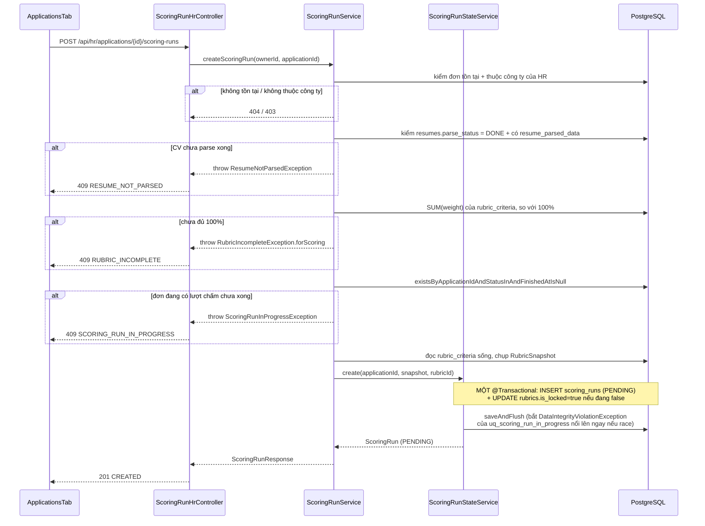
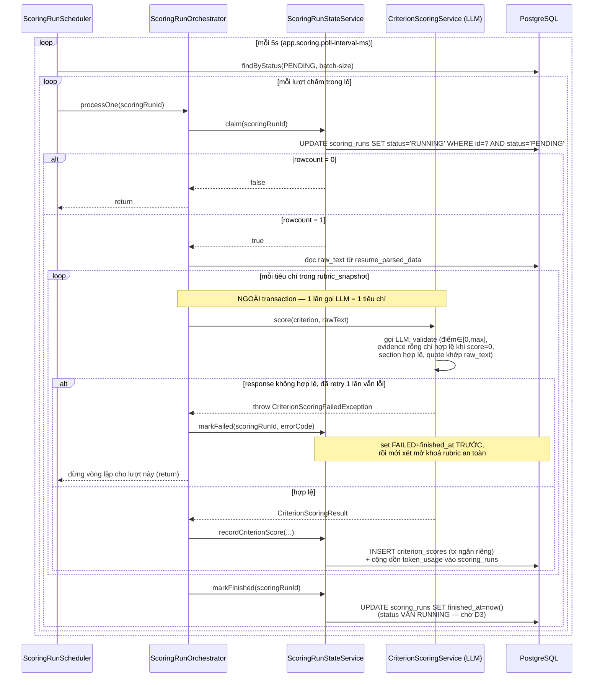

# FR-H04 — Chấm điểm CV theo rubric bằng AI (Scoring)

Nhánh `feat/fr-h04-scoring` (D2), mọc từ `feat/fr-c04-parsing` (D1) — xác nhận bằng `git merge-base`:
D1 chưa gộp vào `main` tại thời điểm viết tài liệu này, nên D2 kế thừa trực tiếp lịch sử commit của
D1 thay vì rẽ từ `main`. Phụ thuộc dữ liệu: D1 (`resumes.parse_status = DONE` +
`resume_parsed_data.raw_text`), B3 (`rubrics` + `rubric_criteria` đủ 100% trọng số).

## 1. Mục tiêu

Sau khi CV đã được D1 trích xuất thành văn bản thuần (`raw_text`), HR bấm "Chấm điểm hồ sơ" cho một
đơn ứng tuyển. Hệ thống gọi AI chấm **từng tiêu chí của rubric một cách riêng lẻ** — mỗi tiêu chí là
một lần gọi LLM độc lập, kèm điểm số, giải thích, và bằng chứng (evidence) trích nguyên văn từ CV.
AI **không** cộng điểm, **không** xếp hạng, **không** gán nhãn đạt/không đạt — những việc đó thuộc về
D3 (FR-H05, cộng điểm có trọng số) và HR (FR-H07, quyết định cuối). Toàn bộ việc gọi LLM chạy trong
job nền, không đồng bộ trong request của HR.

Ràng buộc khó nhất của nhánh này không phải CRUD, mà là ba thứ: chống LLM bịa evidence bằng kiểm tra
cơ học ở tầng Java (không chỉ tin vào prompt), xử lý đúng trường hợp một tiêu chí không có gì để
chấm, và khoá rubric đúng lúc để lịch sử chấm điểm không bị trọng số thay đổi sau này làm sai lệch.

## 2. Các file đã tạo/sửa

### Backend — dữ liệu một lượt chấm (`scoring/`)

| File | Vai trò |
|---|---|
| `ScoringRun.java` / `ScoringRunStatus.java` | Entity `scoring_runs`, cố ý **không** map `total_score` (việc của D3); enum `PENDING`/`RUNNING`/`DONE`/`FAILED` — D2 chỉ tự set 3 giá trị đầu |
| `CriterionScore.java` | Entity `criterion_scores` — điểm, giải thích, evidence, các cột snapshot (`weight_snapshot`, `max_score_snapshot`...) |
| `ScoringRunRepository.java` / `CriterionScoreRepository.java` | Claim có điều kiện, kiểm "đang chạy", kiểm "an toàn mở khoá", đếm/đọc gộp tránh N+1 (`countByScoringRunIdIn`, `findLatestByApplicationIdIn` dùng `DISTINCT ON`) |
| `RubricSnapshot.java` / `RubricSnapshotMapper.java` / `EvidenceEntry.java` | Record ảnh chụp rubric (JSONB `rubric_snapshot`), hàm map `Rubric → RubricSnapshot`, record evidence khớp JSONB `criterion_scores.evidence` |
| `LatestScoringRunView.java` / `ScoringRunCriteriaCountView.java` | Projection interface cho 2 query gộp ở trên |

### Backend — luồng nghiệp vụ chấm điểm (`scoring/`)

| File | Vai trò |
|---|---|
| `ScoringRunService.java` | Kiểm 5 điều kiện tiên quyết, tạo lượt chấm, đọc danh sách lượt chấm của một đơn |
| `ScoringRunStateService.java` | Bean **ghi** duy nhất — `create` (tạo + khoá rubric), `claim`, `recordCriterionScore`, `markFailed` (+ mở khoá an toàn), `markFinished` |
| `ScoringRunOrchestrator.java` / `ScoringRunScheduler.java` | Điều phối một lượt (claim → lặp tiêu chí → ghi), không `@Transactional`; `@Scheduled` quét `PENDING` theo lô |
| `ScoringRunErrorCode.java` / `ScoringRunHrController.java` / `dto/ScoringRunResponse.java` | Mã lỗi catch-all; `POST`/`GET /api/hr/applications/{id}/scoring-runs`; DTO cố ý không có `totalScore`/`rank` |

### Backend — chấm một tiêu chí bằng AI (`ai/criterion/`, `ai/client/`)

| File | Vai trò |
|---|---|
| `CriterionScoringService.java` | Gọi LLM chấm **đúng một** tiêu chí, retry 1 lần khi response không hợp lệ, kiểm chứng evidence bằng Java thuần |
| `CriterionScorePayload.java` / `CriterionScoringErrorCode.java` / `CriterionScoringFailedException.java` / `CriterionScoringResult.java` | Schema JSON LLM trả về; 6 mã lỗi (JSON hỏng, lỗi API, điểm ngoài thang, evidence sai chỗ, section sai, quote không khớp); exception bọc mã lỗi; record `(payload, model, tokenUsage, promptVersion)` |
| `ai/client/CriterionScoringChatClientConfig.java` / `resources/ai/prompt/criterion-score-v1.st` | Bean `ChatClient` riêng cho scoring (không dùng chung với D1); system prompt nhận 1 tiêu chí + thang điểm, cấm suy đoán khi thiếu bằng chứng |

### Backend — danh sách ứng viên cho HR (mở rộng `jobapplication/`) và hạ tầng dùng chung

| File | Vai trò |
|---|---|
| `ApplicationOwnerService.java` / `ApplicationOwnerController.java` / `dto/ApplicationHrListItemResponse.java` | `GET /api/hr/jobs/{jobId}/applications` — danh sách đơn kèm trạng thái CV + tiến độ lượt chấm gần nhất, cố ý không có `totalScore`/`rank`/điểm tiêu chí |
| `common/FormattedErrorCode.java` | Interface `String formatted()` — buộc mọi enum mã lỗi đi qua đây, chặn việc lỡ truyền `String` tự do (stack trace, output thô LLM) vào cột lỗi |
| `common/exception/{ResumeNotParsedException,ScoringRunInProgressException}.java` | 2 exception mới cho điều kiện tiên quyết #3, #5 |
| `common/exception/RubricIncompleteException.java` (sửa) / `GlobalExceptionHandler.java` (sửa) | Thêm `forScoring(...)` cho đúng ngữ cảnh; 2 handler mới + nhánh `DataIntegrityViolationException` cho `uq_scoring_run_in_progress` |
| `db/migration/V4__scoring_run_in_progress_unique.sql` | Partial unique index — chốt chặn thật cho điều kiện tiên quyết #5 |

### Frontend (`features/scoring/`)

| File | Vai trò |
|---|---|
| `types.ts` / `api.ts` | Kiểu dữ liệu + gọi API |
| `queries.ts` | `useHrApplicationsQuery`, `useScoringRunsQuery`, `useCreateScoringRunMutation` + `useStallGuardedRefetch` (mốc dừng poll cứng sau 10 phút) |
| `ScoringRunStatusBadge.tsx` | Badge tiến độ — màu chỉ phụ thuộc `status`/`finishedAt`, không phụ thuộc điểm số |
| `ApplicationsTab.tsx` | Bảng danh sách ứng viên + nút "Chấm điểm hồ sơ" + banner "Tải lại" khi hết giờ poll |
| `pages/HrJobEditPage.tsx` (sửa) | Thêm tab thứ 4 "Ứng viên" |

## 3. Luồng chính

### Luồng 1 — HR bấm "Chấm điểm hồ sơ" (tạo lượt chấm)

Bước tạo lượt chấm là đồng bộ và nhanh (không gọi LLM) — trả `201` ngay khi đã có bản ghi
`scoring_runs` với `status = PENDING`. Việc chấm điểm thật sự diễn ra sau, ở luồng 2.

### Luồng 2 — Job nền xử lý một lượt chấm

Mỗi tiêu chí ghi ngay sau khi chấm xong (không đợi hết vòng lặp mới ghi một lần) — nếu tiêu chí thứ
3 trong 5 tiêu chí lỗi, 2 dòng `criterion_scores` đã ghi trước đó vẫn được giữ nguyên để phục vụ audit,
nhưng cả lượt chấm bị đánh dấu `FAILED` (xem mục 4, quyết định Q4).

### Luồng 3 — HR xem tiến độ (polling)

`ApplicationsTab` gọi `GET /api/hr/jobs/{jobId}/applications` để lấy danh sách đơn kèm trạng thái
lượt chấm gần nhất (`ApplicationOwnerService.listApplications`, đọc chéo sang `ScoringRunRepository`
giống cách `JobOwnerService` đã đọc chéo sang `RubricRepository` ở B2). Với đơn đang có lượt chấm,
mỗi dòng bảng gọi thêm `GET /api/hr/applications/{id}/scoring-runs` để lấy `criteriaScored`/
`criteriaTotal` hiển thị trong badge ("Đang chấm — Đã chấm 3/5 tiêu chí"). Cả hai đều tự động gọi
lại mỗi 5 giây (`refetchInterval`) trong khi còn lượt chấm chưa có `finishedAt`, và tự dừng sau 10
phút không đổi (`MAX_POLL_DURATION_MS`) — xem mục 4, quyết định về mốc dừng cứng.

## 4. Quyết định thiết kế

**(a) `finished_at` là tín hiệu "đã chấm xong toàn bộ tiêu chí", không chỉ dành cho lỗi**
- Đã chọn: `status` vẫn giữ `RUNNING` khi D2 chấm xong hết tiêu chí (không tự đổi sang `DONE`, việc
  đó thuộc D3), nhưng `finished_at` được set ngay sau khi ghi xong dòng `criterion_scores` cuối
  cùng. Bảng ý nghĩa đầy đủ: `PENDING`+NULL = chưa claim; `RUNNING`+NULL = đang chấm; `RUNNING`+khác
  NULL = D2 xong, chờ D3; `FAILED`+khác NULL = dừng hẳn.
- Lựa chọn khác: chỉ set `finished_at` khi `FAILED`, để `RUNNING` mãi mãi khi thành công vì D3 sẽ tự
  đổi status.
- Vì sao: nếu `finished_at` chỉ dành cho lỗi, kết hợp với điều kiện tiên quyết #5 (chặn tạo lượt mới
  khi đơn "đang có lượt chấm"), một đơn chấm xong thành công sẽ **không bao giờ chấm lại được** — vĩnh
  viễn bị coi là "đang chạy". Đây là lỗi khoá cứng hệ thống thật sự, phát hiện khi rà lại kế hoạch
  trước khi code (không phải trong lúc chạy thật). D3 nhặt lượt cần tổng hợp bằng đúng một điều kiện
  SQL: `status = 'RUNNING' AND finished_at IS NOT NULL AND total_score IS NULL` — không cần đếm
  `criterion_scores` rồi đối chiếu số tiêu chí trong `rubric_snapshot`.

**(b) Input gửi LLM là `raw_text` của CV, không phải CV JSON đã trích xuất (D1)**
- Đã chọn: `CriterionScoringService.score()` nhận `rawText` (văn bản thuần từ D1, cắt ngưỡng theo
  đúng chiến lược 60% đầu + 40% cuối như D1) — không phụ thuộc `ResumeParsedPayload`, không import gì
  từ package `resume`.
- Lựa chọn khác: gửi `resume_parsed_data.data` (CV JSON đã có cấu trúc D1 tạo ra) — đỡ tốn token hơn
  (JSON đã được D1 nén, bỏ nhiễu định dạng), và LLM chấm điểm thừa hưởng luôn việc D1 đã sắp xếp lại
  thứ tự cột.
- Vì sao: CLAUDE.md mục 2 cấm AI viết lại/tóm tắt/dịch nội dung CV — nếu D1 đã diễn giải lại nội dung
  khi trích xuất (dù chỉ ở mức "gần đúng nguyên văn"), một quote khớp đúng JSON đó vẫn có thể lệch
  khỏi CV gốc, và evidence trở thành "lời của LLM D1" thay vì "lời trong CV" — sụp nguyên tắc evidence
  phải kiểm chứng được ngay từ gốc. Kiểm chứng evidence (mục d dưới đây) vì vậy cũng luôn đối chiếu
  với `raw_text` **đầy đủ**, không phải bản đã cắt ngưỡng — vì chiến lược cắt giữ nguyên đầu+cuối, mọi
  quote LLM trích từ bản đã cắt vẫn luôn là substring của bản đầy đủ.

**(c) Evidence rỗng chỉ hợp lệ khi điểm bằng 0**
- Đã chọn: `evidence = []` được chấp nhận, nhưng **chỉ khi** `score = 0`. Prompt yêu cầu: không tìm
  được dấu vết nào liên quan tới tiêu chí thì phải chấm đúng 0 và để evidence rỗng, không được suy
  đoán. `CriterionScoringService.validate()` thực thi lại đúng quy tắc này ở tầng Java (không chỉ tin
  prompt): `evidence.isEmpty() && score != 0` → ném lỗi.
- Lựa chọn khác: luôn đòi ít nhất một evidence, kể cả khi CV thực sự không có gì liên quan tới tiêu
  chí — khớp với chữ trong PHASES.md ("mỗi tiêu chí có ít nhất một evidence").
- Vì sao: đòi evidence cho mọi trường hợp sẽ buộc LLM phải bịa ra một câu trích dẫn không tồn tại
  trong CV để "có đủ evidence" khi CV thực sự thiếu thông tin — vi phạm trực tiếp nguyên tắc chống
  bịa của CLAUDE.md mục 2, nghiêm trọng hơn nhiều so với một tiêu chí hợp lệ có evidence rỗng kèm
  điểm 0. Giữa câu chữ mô tả trường hợp phổ biến trong PHASES và nguyên tắc "bất di bất dịch" trong
  CLAUDE.md, nguyên tắc chống bịa được ưu tiên.

**(d) Kiểm chứng evidence bằng so khớp chuỗi (substring), không tin lời LLM tự nhận trích dẫn đúng**
- Đã chọn: sau khi LLM trả JSON, với mỗi `evidence[].quote`, kiểm nó có phải là substring của
  `raw_text` sau khi **chuẩn hoá whitespace** (gộp mọi khoảng trắng/xuống dòng/tab liên tiếp thành
  một space, trim hai đầu) — không lowercase, không bỏ dấu tiếng Việt. Ngoài ra, `evidence[].section`
  phải là một trong đúng 6 giá trị của schema CV D1. Sai một trong hai điều kiện → coi là response
  không hợp lệ, retry gọi lại LLM từ đầu đúng 1 lần, hỏng cả 2 lần thì cả tiêu chí lỗi.
- Lựa chọn khác: tin lời LLM tự nhận đã trích đúng nguyên văn (chỉ dựa vào chỉ dẫn trong prompt), hoặc
  hạ chuẩn so khớp bằng cách lowercase/bỏ dấu để giảm tỷ lệ chặn nhầm do PDFBox tách dòng bất thường.
- Vì sao: prompt chỉ là lời yêu cầu, không phải cơ chế chặn — một mô hình có thể "trích dẫn" sai lệch
  nhẹ (thêm/bớt dấu câu, tự ý sửa) dù được nhắc nguyên văn. Hạ chuẩn so khớp (lowercase/bỏ dấu) làm
  tăng rủi ro một câu bịa nội dung khác nhưng na ná lọt qua — nguy hiểm hơn việc chặn nhầm một quote
  đúng nhưng lệch whitespace do PDFBox tách dòng.

**(e) Một tiêu chí lỗi thì cả lượt chấm lỗi, không chấm-được-bao-nhiêu-ghi-bấy-nhiêu**
- Đã chọn: `ScoringRunOrchestrator` dừng vòng lặp ngay khi một tiêu chí lỗi sau retry, gọi
  `markFailed` cho cả lượt. Các dòng `criterion_scores` đã ghi trước đó của lượt này **không bị xoá**
  (giữ lại phục vụ audit), nhưng lượt chấm không bao giờ được D3 đụng tới vì D3 chỉ đọc lượt
  `RUNNING` (không phải `FAILED`).
- Lựa chọn khác: bỏ qua tiêu chí lỗi, chỉ ghi những tiêu chí chấm được, để D3 tổng hợp trên số tiêu
  chí có sẵn.
- Vì sao: D3 (`ScoreAggregator`) sẽ cộng điểm có trọng số trên các dòng `criterion_scores` đang có
  cho một lượt. Nếu D2 âm thầm bỏ qua tiêu chí lỗi, D3 không có cách nào phân biệt "tiêu chí này
  không áp dụng" (evidence rỗng + score=0, hợp lệ) với "tiêu chí này bị bỏ sót vì lỗi kỹ thuật" — sẽ
  cộng ra một tổng điểm thấp hơn thực tế một cách âm thầm, không có tín hiệu lỗi nào cho HR biết. Đây
  là loại sai số nguy hiểm nhất trong một hệ thống chấm điểm: sai mà trông như đúng.

**(f) Khoá rubric ngay lúc tạo `scoring_runs` (PENDING), cùng transaction với chụp snapshot; mở khoá
lại có điều kiện khi lượt đầu tiên FAILED**
- Đã chọn: `ScoringRunStateService.create()` trong **một** `@Transactional` vừa INSERT `scoring_runs`
  vừa UPDATE `rubrics.is_locked = true` (idempotent — no-op nếu đã khoá). Khi một lượt `FAILED`,
  `markFailed()` chỉ mở khoá lại khi thoả **cả hai** điều kiện trong cùng transaction: (1) rubric của
  job này chưa từng có `criterion_scores` nào (từ bất kỳ lượt nào), **và** (2) không còn lượt chấm
  nào khác của job này đang thực sự chạy (`PENDING`, hoặc `RUNNING` mà `finished_at` còn NULL).
- Lựa chọn khác: khoá trễ hơn (lúc claim hoặc lúc có dòng `criterion_scores` đầu tiên); mở khoá chỉ
  dựa vào điều kiện (1) — "rubric có từng có `criterion_scores` chưa".
- Vì sao khoá sớm: `rubric_snapshot` được chụp ngay lúc tạo lượt chấm — nếu khoá trễ hơn, có một
  khoảng hở vài giây tới vài chục giây (tuỳ tốc độ LLM) trong đó HR vẫn sửa được trọng số dù một lượt
  chấm đã "tồn tại" và đã chụp ảnh xong, vi phạm tinh thần "khoá lại khi đã có lượt chấm đầu tiên"
  trong schema. Vì sao mở khoá cần cả hai điều kiện: chỉ dùng điều kiện (1) có một khe hở race — lượt
  A và lượt B của cùng job chạy gần nhau, A `FAILED` trước khi B kịp ghi dòng nào → điều kiện (1) vẫn
  đúng (B chưa ghi gì) → rubric bị mở khoá dù B vẫn đang chạy tiếp và sau đó ghi được dữ liệu chấm
  thật. Thêm điều kiện (2), và set `FAILED`+`finished_at` cho chính lượt đang fail **trước** khi chạy
  query kiểm tra (Postgres thấy được ghi của chính transaction mình), loại đúng khe hở này — đã kiểm
  bằng test đúng 3 tình huống ở mục 6.
- Test `jobOwnerService_changeStatusToOpen_rubricLockedButWeightComplete_reopensSuccessfully` trong
  `ScoringRunStateServiceTest.java` gọi thẳng `JobOwnerService.changeStatus` (không mock) để bảo vệ
  hành vi đã cài từ `fix/rubric-guard` (Phase B) — rubric đã khoá thì bỏ qua kiểm tổng trọng số 100%
  khi mở lại job. D2 **phụ thuộc** vào hành vi này (nếu không, một job có rubric đã khoá + đủ 100%
  nhưng bị đổi trạng thái CLOSED rồi mở lại sẽ vô lý bị chặn) nhưng **không sở hữu** nó — nếu một lượt
  dọn dẹp sau này thấy test này "không liên quan tới scoring" và xoá đi, lớp bảo vệ duy nhất cho hành
  vi liên nhánh này biến mất mà không ai nhận ra.

**(g) Đường dẫn danh sách ứng viên: `/api/hr/jobs/{jobId}/applications`, không phải
`/api/jobs/{id}/candidates` như PHASES.md ghi cho D3**
- Đã chọn: `ApplicationOwnerController` đặt dưới `/api/hr/**` — đường duy nhất được `SecurityConfig`
  gate `hasRole("HR")` ở tầng filter chain theo đúng quy ước hiện có (`RubricOwnerController`,
  `JobOwnerController`...).
- Lựa chọn khác: dùng đúng chữ trong PHASES.md (`/api/jobs/{id}/candidates?sort=total_score,desc`,
  không tiền tố `/hr/`), hoặc lùi toàn bộ endpoint danh sách sang D3.
- Vì sao: một route không có tiền tố `/hr/` sẽ không tự động được RBAC-gate theo đúng cơ chế đang
  dùng trong dự án, và phá vỡ quy ước URL nhất quán của toàn bộ API phía HR. Đây là chức năng chỉ HR
  được xem — chữ trong PHASES được coi là cách viết tắt lúc phác thảo, không phải quyết định cố ý bỏ
  tiền tố. D3 sẽ **mở rộng** cùng route này (thêm `?sort=total_score,desc` + field `totalScore`),
  không tạo route mới — nợ kỹ thuật của việc chốt sớm gần như bằng không.

## 5. Ràng buộc SRS đã thực thi

| FR | Ràng buộc | Thực thi ở đâu |
|---|---|---|
| FR-H04 | Chấm từng tiêu chí riêng lẻ, không gộp nhiều tiêu chí một lần gọi LLM | `CriterionScoringService.score()` nhận đúng 1 `CriterionSnapshot`; `ScoringRunOrchestrator` lặp gọi tuần tự |
| FR-H04 / CLAUDE.md mục 2 | Evidence phải kiểm chứng được từ CV gốc, không bịa | `CriterionScoringService.validate()` — so khớp substring với `raw_text` sau chuẩn hoá whitespace |
| FR-H04 / CLAUDE.md mục 2 | Input chấm điểm là văn bản gốc, không phải diễn giải của LLM khác | `score(criterion, rawText)` — không import `ResumeParsedPayload`, xem mục 4(b) |
| FR-H04 vs FR-H05 | AI không tính tổng điểm | `ScoringRun` không map cột `total_score`; package `ai/` không import `scoring/ScoreAggregator` (chưa tồn tại) |
| FR-H06 | Evidence rỗng chỉ hợp lệ khi score = 0 | `validate()` — `evidence.isEmpty() && score != 0` → lỗi, xem mục 4(c) |
| FR-H05/H07 | Không gán nhãn đạt/không đạt, không ngưỡng phân loại | Không cột/field `verdict`/`label`/`isQualified`/`passed`; `ScoringRunStatusBadge` chọn màu chỉ theo `status`/`finishedAt` |
| FR-H08 | Snapshot rubric không bị bỏ khi hiển thị lịch sử | Mọi dòng `criterion_scores` đọc `weight_snapshot`/`max_score_snapshot`, không query lại `rubric_criteria` sống |
| Quy ước dự án | RBAC + quyền sở hữu bản ghi ở mọi endpoint | `ScoringRunService.loadOwnedApplication`, `ApplicationOwnerService.loadOwnedJob` — kiểm job thuộc công ty của HR đang đăng nhập, không chỉ `hasRole` |
| Quy ước dự án | Ràng buộc "một X đang hoạt động" chốt ở DB | `uq_scoring_run_in_progress` (V4) — `ScoringRunService.requireNoRunInProgress` chỉ trả lỗi sớm |
| Quy ước dự án | Cột lỗi chỉ lưu mã chuẩn hoá, không lưu output thô LLM | `ScoringRunErrorCode`/`CriterionScoringErrorCode` implement `FormattedErrorCode`; `markFailed(UUID, FormattedErrorCode)` không nhận `String` tự do |
| Quy ước dự án | Self-invocation không phá `@Transactional`; không giữ transaction quanh lời gọi LLM | Tách `ScoringRunStateService`/`ScoringRunOrchestrator` — cùng mẫu D1, xem CLAUDE.md mục 3c |

## 6. Đã kiểm thử gì

**Backend tự động** — `mvn test` (toàn bộ suite, không chỉ test mới): **190/190 pass, BUILD
SUCCESS**. Riêng phần liên quan D2 (9 file, ~79 test):
- `CriterionScoringServiceTest`/`...IntegrationTest` (25, mock `ChatModel` qua `LlmTestConfiguration`
  dùng lại từ D1) — mọi nhánh của `validate()` (điểm ngoài thang, evidence rỗng sai chỗ, section sai,
  quote không khớp, quote khớp sau chuẩn hoá whitespace, quote tiếng Việt có dấu, evidence rỗng+score=0
  hợp lệ), JSON hỏng lần 1 tự phục hồi lần 2/hỏng cả 2 lần, lỗi mạng/API không retry, `truncateForPrompt`
  ở đúng 3 mốc biên, chữ ký `score()` nhận `rawText` chứ không phải `ResumeParsedPayload`.
- `ScoringRunStateServiceTest` (7) — mở khoá rubric đúng 3 tình huống của mục 4(f), test cross-branch
  với `JobOwnerService.changeStatus` thật (không mock, xem mục 4(f)), FK `criterion_id` null hoá đúng
  khi tiêu chí gốc bị xoá giữa chừng, làm tròn điểm đúng `NUMERIC(5,2)` ở 3 mốc biên.
- `ScoringRunOrchestratorTest` (5) — chấm đủ N tiêu chí giữ `status=RUNNING`+set `finished_at`, sửa
  rubric sau khi chấm không ảnh hưởng `weight_snapshot` đã ghi, tiêu chí lỗi sau retry → dừng ngay
  giữ dòng đã ghi, claim 2 lần liên tiếp lần 2 thất bại, dữ liệu CV biến mất giữa chừng → `markFailed`.
- `ScoringRunRepositoryTest`/`ScoringRunHrControllerIntegrationTest` (28) — 5 điều kiện tiên quyết đều
  có case âm riêng (404/403/409×3) + case dương, khoá idempotent, tạo lượt mới cho đơn đã có lượt cũ
  `finished_at ≠ NULL` (RUNNING chờ D3, hoặc FAILED) không bị chặn.
- `ApplicationOwnerControllerIntegrationTest`/`CriterionScoreRepositoryTest`/`RubricSnapshotMapperTest`
  (14) — ownership 403/404, response không có `totalScore`/`rank`, tiến độ N/M tiêu chí đúng, đếm gộp
  N+1, snapshot giữ đúng thứ tự hiển thị và `scaleDescription` null khi HR không cung cấp.

**Frontend** — `npm run build` (`tsc -b && vite build`) và `npm run lint` đều sạch (chạy lại khi viết
tài liệu này).

**Chưa test / chưa xác nhận**:
- **Chưa test tay trên trình duyệt thật** cho toàn bộ luồng frontend (bấm "Chấm điểm hồ sơ", theo dõi
  badge tiến độ tự cập nhật, banner "Tải lại" xuất hiện đúng lúc sau 10 phút, nút bị/không bị disable
  đúng theo từng trạng thái). `npm run build`/`npm run lint` chỉ xác nhận code biên dịch đúng kiểu,
  chưa có ai bấm qua giao diện thật với backend đang chạy.
- **Chưa test race condition thật** (hai request `POST` gần như đồng thời cho cùng một đơn, hoặc hai
  tick scheduler cùng nhặt một lượt chấm) — các test hiện có gọi tuần tự, xác nhận đúng *kết quả cuối
  cùng* của điều kiện `WHERE`/partial unique index nhưng chưa quan sát trực tiếp hai thao tác cạnh
  tranh thật sự.
- **Chưa chạy với LLM Anthropic thật** cho việc chấm điểm — toàn bộ test tự động mock ở tầng
  `ChatModel`. Chưa có xác nhận thực tế rằng model thật tuân thủ đúng yêu cầu "không suy đoán khi
  thiếu bằng chứng" hay format evidence đúng như kỳ vọng của `validate()` ngoài các case đã mock.
- **Chưa test tình huống app crash giữa lúc `claim()` và `markFinished()`/`markFailed()`** (lượt chấm
  kẹt `RUNNING`/`finished_at` NULL vĩnh viễn) — đây là giới hạn đã biết (mục 7), không phải lỗi cần
  test ở D2.

## 7. Nợ kỹ thuật

Bốn khoản dưới đây đã ghi trong `docs/ROADMAP.md` mục `chore/hardening` và liên quan trực tiếp tới D2
(hai khoản đầu là nợ của chính D2, hai khoản sau nằm trong code D1 nhưng ảnh hưởng tới D2 vì D2 phụ
thuộc dữ liệu D1 tạo ra):

1. **Không có stale-claim reaper — nợ thật, chưa xử lý.** Một lượt chấm chết vì JVM restart giữa
   chừng (đã claim, `status=RUNNING`, `finished_at` còn NULL) sẽ kẹt vĩnh viễn — `ScoringRunScheduler`
   chỉ quét `PENDING`, không bao giờ nhặt lại lượt này. Ở D2 hậu quả nặng hơn D1: `uq_scoring_run_in_progress`
   (V4) còn chặn cứng, HR **không thể** tạo lượt chấm mới cho đơn đó nữa cho tới khi có người can
   thiệp tay vào DB. Cần cơ chế heartbeat/lease hoặc reaper định kỳ, xử lý đồng thời cho cả D1
   (`resumes.parse_status = PROCESSING`) và D2 — không vá lẻ tẻ từng nhánh.

2. **Không có tầng tổng hợp/cảnh báo chi phí token — hạn chế có chủ đích, không phải bỏ sót.** Cột
   `scoring_runs.token_usage` được D2 ghi đầy đủ (cộng dồn qua mọi lần gọi LLM trong một lượt), nhưng
   không có gì đọc/tổng hợp từ đó. Đây là quyết định nằm ngoài phạm vi đồ án, không phải thiếu sót —
   dữ liệu thô đã sẵn sàng cho ai muốn xây tầng này sau.

3. **`ResumeParsingErrorCode` (D1) chưa implement `common/FormattedErrorCode` — nợ thật nhưng nhẹ, dời
   có chủ đích.** D2 giới thiệu interface này và cả hai enum mới của D2
   (`CriterionScoringErrorCode`, `ScoringRunErrorCode`) đều implement nó, nhưng `ResumeParsingErrorCode`
   của D1 (ra đời trước) thì chưa — lệch chuẩn interface chung trong codebase. Không cấp bách vì
   `ResumeParsingStateService.markFailed` đã nhận đúng kiểu enum cụ thể (không nhận `String` tự do),
   nên không có lỗ hổng thực tế giống thứ `FormattedErrorCode` được sinh ra để chặn. Quyết định hoãn
   là có chủ đích: sửa đòi đụng vào code D1 đã merge và chạy lại toàn bộ test của nhánh khác, ngoài
   phạm vi D2.

4. **`ResumeParsingErrorCode.LLM_TIMEOUT` (D1) là mã lỗi chết — nợ thật, không thuộc phạm vi D2 sửa.**
   Không có đường code nào trong D1 tạo ra được giá trị này — comment trong `ResumeParsingService`
   ghi nhận chưa xác định được đúng loại exception timeout thật của SDK Anthropic (test D1 chỉ mock ở
   tầng `ChatModel`, chưa chạm exception thật). D2 không lặp lại lỗi này: `CriterionScoringErrorCode`
   không có mã `LLM_TIMEOUT` riêng — mọi lỗi gọi LLM không phải JSON hỏng (mạng, timeout, lỗi API) đều
   map thẳng về `LLM_ERROR`, không có mã "chết" nào không đường nào tạo ra được.

Ngoài bốn khoản trên, một khoản dùng chung với D1 không lặp lại riêng ở đây: `ChatModel.getDefaultOptions()`
đã deprecated ở Spring AI 2.0, đang dùng trong mock test của cả D1 và D2 — cần thay khi nâng phiên
bản, xem `docs/ROADMAP.md`.

**Không phải nợ kỹ thuật, mà là quyết định thiết kế có chủ đích, không lặp lại ở đây** (đã giải thích
đầy đủ ở mục 4): trùng lặp ~15 dòng logic cắt ngưỡng `raw_text` giữa D1/D2 thay vì import chéo; hai
`ChatClient` bean gần như giống hệt nhau (`ResumeParsingChatClientConfig`/`CriterionScoringChatClientConfig`)
thay vì dùng chung một bean; mốc dừng poll cứng 10 phút ở frontend.
