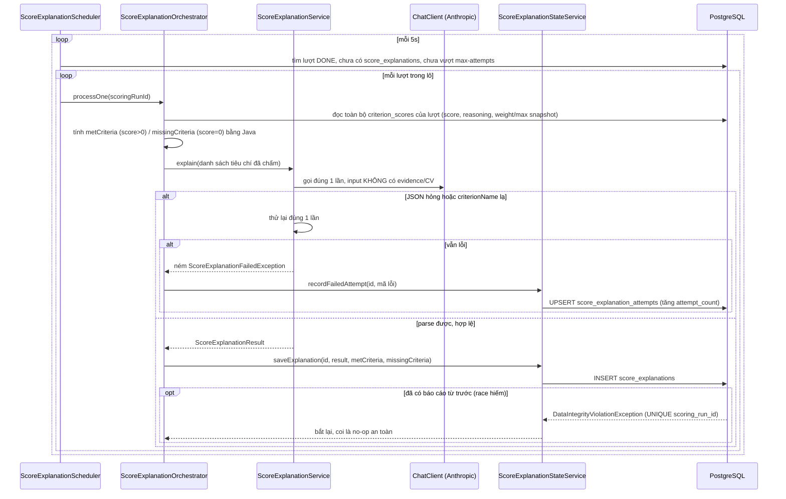

# FR-H06 — AI Explainable Scoring (Báo cáo giải thích điểm số)

Nhánh `feat/fr-h06-explain` (D4), xếp chồng trên `feat/fr-h05-aggregate` (D3) — chưa gộp vào `main`
tại thời điểm viết tài liệu này.

## 1. Mục tiêu

D2 đã chấm từng tiêu chí (điểm + evidence trích từ CV), D3 đã cộng thành tổng điểm và xếp hạng.
Nhưng một dòng "Docker: 4/5" hay tổng điểm "82.5" không tự nói lên câu chuyện — HR vẫn phải tự đọc
từng `reasoning` rời rạc để hiểu bức tranh chung của một ứng viên. D4 thêm một lớp tổng hợp bằng
ngôn ngữ tự nhiên: tóm tắt, điểm mạnh, điểm cần cải thiện, tiêu chí đã thể hiện/chưa thể hiện trong
CV — nhưng **tuyệt đối không được tự bịa thêm bằng chứng mới**. Mọi câu trong báo cáo phải dẫn được
về đúng những gì D2 đã chấm (score, reasoning, evidence đã lưu), không phải AI đọc lại CV lần nữa
rồi phán xét tự do. Nhánh cũng mở rộng UI: hiện evidence nguyên văn ngay dưới từng tiêu chí, hiện
khối báo cáo tổng tách biệt, và thêm nút cho HR tải file CV gốc để đối chiếu — quyết định xếp việc
này vào D4 thay vì để dành cho D7/FR-H07 được giải thích ở mục 4h.

## 2. Các file đã tạo/sửa

### Backend — sinh báo cáo bằng LLM, độc lập DB (`ai/explanation/`)

| File | Vai trò |
|---|---|
| `ScoreExplanationService.java` | Gọi LLM đúng một lần cho một lượt chấm — input là danh sách `(tên tiêu chí, trọng số, thang điểm, score, reasoning)` đã có sẵn từ D2, **không có evidence, không có CV** |
| `ScoreExplanationPayload.java` | Schema JSON LLM phải trả — `summary`, `strengths`, `weaknesses` (mỗi phần tử gắn với một tên tiêu chí) |
| `ScoreExplanationResult.java` | Bọc `ScoreExplanationPayload` + `model`/`tokenUsage`/`promptVersion` |
| `ScoreExplanationErrorCode.java` / `ScoreExplanationFailedException.java` | Mã lỗi chuẩn hoá + exception mang mã đó |
| `ScoreExplanationChatClientConfig.java` | Bean `ChatClient` riêng cho nhiệm vụ này |
| `ai/prompt/score-explanation-v1.st` | Prompt hệ thống — cấm bịa trích dẫn, cấm sinh điểm/hạng/quyết định tuyển dụng |

### Backend — entity/repository/migration (`scoring/`)

| File | Vai trò |
|---|---|
| `V5__score_explanation_attempts.sql` | Bảng `score_explanation_attempts` — đếm số lần thử THẤT BẠI, tách riêng khỏi bảng báo cáo thật |
| `ScoreExplanation.java` | Entity `score_explanations` — báo cáo THẬT, ghi đúng một lần khi xong |
| `ScoreExplanationAttempt.java` | Entity bảng đếm số lần thử |
| `ScoreExplanationRepository.java` | `findByScoringRunIdIn` (batch), `existsByScoringRunId` |
| `ScoreExplanationAttemptRepository.java` | `findByScoringRunIdIn` (batch), `recordFailedAttempt` — upsert nguyên tử bằng `INSERT ... ON CONFLICT DO UPDATE` |
| `ExplanationPoint.java` | Record JSONB `{criterionName, point}` cho `strengths`/`weaknesses` |
| `CriterionScoreExplanationInput.java` | Record input gửi cho `ScoreExplanationService` — cố ý không có `evidence` |

### Backend — job nền (`scoring/`)

| File | Vai trò |
|---|---|
| `ScoreExplanationOrchestrator.java` | Điều phối một lượt: đọc `criterion_scores` → tính `metCriteria`/`missingCriteria` bằng Java → gọi LLM → ghi kết quả |
| `ScoreExplanationStateService.java` | `saveExplanation()`, `recordFailedAttempt()` — bean ghi riêng, `@Transactional` |
| `ScoreExplanationScheduler.java` | `@Scheduled` quét lô mỗi 5 giây (`app.explanation.poll-interval-ms`) |
| `ScoringRunRepository.java` (sửa) | Thêm `findRunsReadyForExplanation` — 3 điều kiện: `status=DONE`, chưa có báo cáo, chưa vượt `app.explanation.max-attempts` |

### Backend — endpoint cho HR (mở rộng `jobapplication/`)

| File | Vai trò |
|---|---|
| `ApplicationOwnerService.java` (sửa) | `listApplications` gắn thêm evidence từng tiêu chí + báo cáo tổng (hoặc tín hiệu trạng thái) của đúng lượt DONE đang hiển thị điểm |
| `dto/ApplicationHrListItemResponse.java` (sửa) | Thêm `evidence` vào `CriterionScoreItem`; thêm `explanationStatus`/`explanation` vào response chính |

### Backend — xem CV gốc cho HR (`resume/`)

| File | Vai trò |
|---|---|
| `ResumeHrService.java` | Suy `resumeId` từ `applicationId` ở server, kiểm sở hữu qua chuỗi `application → job → company`, tái dùng `StorageService.load` |
| `ResumeHrController.java` | `GET /api/hr/applications/{applicationId}/resume/download` |

### Frontend (`features/scoring/`, `components/ui/`)

| File | Vai trò |
|---|---|
| `types.ts` (sửa) | Thêm `EvidenceEntry`, `ExplanationPoint`, `Explanation`, `ExplanationStatus`; mở rộng `CriterionScoreItem`/`ApplicationHrListItem` |
| `CriterionScoreBreakdown.tsx` (sửa) | Hiện evidence (khung viền brand) hoặc câu mô tả trung tính khi rỗng, ngay dưới `reasoning` của mỗi tiêu chí |
| `ExplanationReport.tsx` | Mới — khối báo cáo tổng: disclaimer, summary, strengths/weaknesses, chip met/missingCriteria |
| `components/ui/sheet.tsx` | Mới — panel trượt từ phải (dùng chung primitive Radix Dialog với `dialog.tsx`, khác style) |
| `ApplicationsTab.tsx` (sửa) | Bỏ mở-rộng-trong-bảng, thay bằng nút "Xem đánh giá của AI" (mở Sheet) + "Xem CV gốc" (tải file) trong cột Thao tác; rút gọn bảng còn 6 cột |
| `api.ts` (sửa) | Thêm `downloadApplicationResumeRequest` — tải blob qua axios (không phải `<a href>` trực tiếp) |

## 3. Luồng chính

D4 có ba luồng tách biệt.

### Luồng 1 — Job nền sinh báo cáo giải thích



Mọi `RuntimeException` không lường trước trong `processOne` cũng bị bắt lại và ghi nhận là một lần
thử thất bại (`recordFailedAttempt`) — không để lượt kẹt vô thời hạn, cùng triết lý với D2/D3.

### Luồng 2 — HR mở khối "Xem đánh giá của AI"

`GET /api/hr/jobs/{jobId}/applications` (route đã có từ D3) nay trả thêm dữ liệu. Ở tầng
`ApplicationOwnerService`, với mỗi đơn: đọc lượt DONE mới nhất (nguồn đã chốt từ D3) → lấy
`criterion_scores.evidence` của lượt đó → tra thêm `score_explanations` của **đúng lượt đó**; nếu
chưa có, tra `score_explanation_attempts` để trả `PENDING` (còn dưới ngưỡng thử) hoặc `FAILED` (đã
vượt ngưỡng). Toàn bộ vẫn đúng 10 lượt gọi DB cho cả danh sách (8 của D3 + 2 mới), không có vòng
lặp gọi query bên trong.

Ở frontend, bấm "Xem đánh giá của AI" mở một `Sheet` (panel trượt từ phải, xem mục 4g) hiện
`CriterionScoreBreakdown` (điểm + evidence từng tiêu chí) và `ExplanationReport` (báo cáo tổng) —
không gọi thêm API nào, dữ liệu đã có sẵn trong response ở trên.

### Luồng 3 — HR tải CV gốc

```mermaid
sequenceDiagram
    participant FE as ApplicationsTab
    participant C as ResumeHrController
    participant S as ResumeHrService
    participant DB as PostgreSQL
    participant FS as Local disk (StorageService)

    FE->>C: GET /api/hr/applications/{applicationId}/resume/download
    C->>S: downloadForApplication(ownerId, applicationId)
    S->>DB: application → job → company, kiểm company thuộc HR đang đăng nhập
    S->>DB: Resume theo application.resumeId (server tự suy, client không truyền)
    S->>FS: StorageService.load(resume.fileUrl)
    FS-->>S: Resource (hoặc rỗng nếu file đã mất)
    S-->>C: ResumeDownload (resource + tên gốc + content type)
    C-->>FE: 200, Content-Disposition: attachment; filename*=UTF-8''...
    FE->>FE: nhận về dạng blob, tạo <a download> tạm rồi bấm hộ, thu hồi URL
```

## 4. Quyết định thiết kế

**(a) `validate()` chỉ kiểm 2 điều — không cấm dấu ngoặc kép, không kiểm độ dài**
- Đã chọn: chỉ kiểm `summary` không rỗng và mọi `criterionName` phải thuộc đúng tập tiêu chí đã gửi
  cho LLM — bắt lỗi *cấu trúc* (sai format, tự bịa thêm một tiêu chí không tồn tại).
- Lựa chọn khác đã loại bỏ: cấm câu chứa dấu `"`/`'` (coi là dấu hiệu trích dẫn giả); giới hạn độ
  dài câu (coi câu dài là "diễn giải lan man").
- Vì sao loại bỏ: cả hai đều "bắt sai thứ" — dấu ngoặc kép và độ dài câu không tương quan với việc
  câu đó có bịa hay không, chỉ tạo cảm giác an toàn giả mà không chặn được hành vi thật sự cần chặn.
  Giới hạn đáng tin cậy nằm ở kiến trúc: `ScoreExplanationService` **không hề nhận CV làm input**
  (mục 4c) — không có gì để bịa trích dẫn từ đó, đây là ràng buộc ở tầng dữ liệu vào, không phải
  luật đoán ở tầng output.

**(b) Giới hạn số lần thử bằng bảng phụ `score_explanation_attempts`, không thử vô hạn**
- Đã chọn: bảng riêng đếm `attempt_count`, tách khỏi `score_explanations` (chỉ chứa báo cáo THẬT).
  `findRunsReadyForExplanation` loại trừ lượt đã đạt `app.explanation.max-attempts` (mặc định 3).
- Lựa chọn khác: quét lại vô hạn lượt chưa có báo cáo; hoặc thêm cột `attempt_count` thẳng vào
  `score_explanations`.
- Vì sao: mỗi lần thử là một lần gọi LLM thật, tốn phí — không giới hạn thì một lượt lỗi vĩnh viễn
  bị gọi lại mỗi 5 giây mãi mãi. Tách bảng riêng vì `score_explanations` có UNIQUE trên
  `scoring_run_id` với ý nghĩa "một báo cáo thật, ghi một lần" — nhồi thêm ngữ nghĩa "đang thử/thất
  bại" vào đó sẽ làm mờ ranh giới. Tăng `attempt_count` bằng `INSERT ... ON CONFLICT DO UPDATE`
  (nguyên tử, một câu lệnh DB) thay vì đọc-cộng-ghi ở Java, vì hai nhịp poll gần nhau đọc cùng giá
  trị cũ sẽ làm mất một lần tăng (lost update).

**(c) `ScoreExplanationService` không nhận CV, không nhận evidence — chỉ nhận score/reasoning đã
chấm**
- Đã chọn: `CriterionScoreExplanationInput` chỉ có `criterionName`, `weightSnapshot`,
  `maxScoreSnapshot`, `score`, `reasoning` — cố ý không có trường evidence nào.
- Lựa chọn khác: gửi kèm evidence đã trích ở D2 để LLM "diễn giải sâu hơn" dựa trên đúng câu trích
  đó.
- Vì sao: đây là ranh giới quan trọng nhất của D4. Nếu LLM đọc lại CV (hay cả evidence) rồi viết
  `summary`/`strengths`/`weaknesses`, sản phẩm sinh ra là **lời của LLM ở D4**, không còn là bằng
  chứng đã kiểm chứng ở D2 — sụp đúng nguyên tắc "mọi giải thích phải kiểm chứng được từ CV"
  (CLAUDE.md mục 2). Bắt LLM chỉ được tổng hợp lại những gì Java đã có sẵn (điểm số, lý do đã chấm)
  buộc mọi câu trong báo cáo phải truy được ngược về một dòng `criterion_scores` cụ thể, không có
  không gian để bịa thêm.

**(d) `metCriteria`/`missingCriteria` tính bằng Java (`score.compareTo(ZERO)`), không phải LLM sinh**
- Đã chọn: `ScoreExplanationOrchestrator` tự lọc `score > 0` → `metCriteria`, `score = 0` →
  `missingCriteria`, dùng `BigDecimal.compareTo` (không phải `.equals` — `"0.00".equals(ZERO)` là
  `false` vì khác scale).
- Lựa chọn khác: để LLM tự liệt kê hai danh sách này trong cùng một lần gọi.
- Vì sao: đây là phép suy ra xác định 1-1 từ dữ liệu đã có (`score>0` ⟺ đã có evidence, theo đúng
  luật D2), không cần "hiểu ngôn ngữ" — giao cho LLM làm là tốn thêm một khả năng sai (LLM đếm
  nhầm, bỏ sót tiêu chí) cho một việc máy tính làm đúng tuyệt đối mọi lần.

**(e) Evidence rỗng (score=0): hiện câu mô tả trung tính, không phải khung trích dẫn rỗng**
- Đã chọn: `CriterionScoreBreakdown` hiện `"Không tìm thấy trích dẫn nào trong CV cho tiêu chí
  này."` bằng chữ thường `text-ink-muted`, không bọc trong khung viền-brand dùng cho trích dẫn thật.
- Lựa chọn khác: vẫn hiện khung trích dẫn (kiểu dáng giống evidence thật) nhưng để trống bên trong;
  hoặc không hiện gì cả.
- Vì sao: evidence rỗng khi `score=0` là **dữ liệu hợp lệ** đã chốt từ Q2/D2 (CV thật sự không có
  gì liên quan tới tiêu chí này thì phải chấm 0 điểm và để trống, không được bịa) — không phải lỗi
  hay thiếu dữ liệu. Một khung trích dẫn rỗng trông giống lỗi hiển thị (dữ liệu đáng lẽ phải có mà
  mất); không hiện gì thì HR không phân biệt được "chưa tải xong" với "CV thật sự không có". Một
  câu mô tả trung tính, khác kiểu dáng với trích dẫn thật, truyền đạt đúng: đây là một kết luận có
  chủ đích, không phải khoảng trống.

**(f) Chip `metCriteria`/`missingCriteria` dùng chung một tông màu trung tính duy nhất**
- Đã chọn: cả hai danh sách render bằng đúng một class `bg-canvas text-ink-muted`.
- Lựa chọn khác: dùng hai tông "trung tính" khác nhau cho hai danh sách (ví dụ `bg-brand-light` cho
  tiêu chí đã thể hiện, `bg-canvas` cho tiêu chí chưa thể hiện) để dễ phân biệt bằng mắt.
- Vì sao: đây là chỗ dễ vi phạm nhất của cả nhánh (đã tự đánh giá khi lập kế hoạch). Về mặt kỹ
  thuật, không tông nào trong hai tông "trung tính" đó là đỏ/xanh — nhưng dùng màu thương hiệu
  (`brand`) cho một trong hai danh sách vẫn có thể đọc ngầm là "tích cực hơn" so với màu xám còn
  lại, âm thầm tái tạo đúng thứ CLAUDE.md cấm (tô màu theo hàm ý tốt/xấu) dưới một vỏ bọc tinh vi
  hơn "đỏ/xanh". Dùng chung một tông duy nhất loại bỏ hoàn toàn khả năng đó, không chỉ né đúng hai
  màu bị cấm.

**(g) Panel trượt (`Sheet`) thay cho mở rộng ngay trong bảng — sửa ở Đợt 5b sau khi phát hiện lỗi bố
cục**
- Vấn đề: thiết kế ban đầu (Đợt 5) mở rộng khối chi tiết ngay trong hàng bảng — khối đó thừa hưởng
  chiều rộng cột, văn bản tiếng Việt dài (reasoning/evidence/summary) tràn ngang hoặc gãy dòng.
- Đã chọn: nút "Xem đánh giá của AI" mở một `Sheet` — panel trượt từ cạnh phải, rộng độc lập với
  bảng (`sm:max-w-xl md:max-w-2xl`), cao toàn màn hình, cuộn dọc riêng.
- Lựa chọn khác: `Dialog` có sẵn (modal canh giữa) nhưng giới hạn `sm:max-w-sm` — đúng kiểu cho
  form ngắn, không hợp văn bản dài; hoặc thêm `overflow-wrap` để ép chữ xuống dòng trong cột hẹp.
- Vì sao: `overflow-wrap` chỉ che triệu chứng (vẫn phải đọc trong không gian hẹp); nới `Dialog` sẵn
  có sẽ ảnh hưởng mọi nơi khác đang dùng nó cho form ngắn. `Sheet` dùng lại đúng primitive Radix
  Dialog đã có (không thêm dependency mới) nhưng style khác hẳn — giải quyết tận gốc chiều rộng.

**(h) "Xem CV gốc" xếp vào D4 (FR-H06), không lùi sang E1 (FR-H07) — quyết định của người dùng**
- Bối cảnh: không mã FR nào trong SRS/PHASES nói rõ HR được xem file CV gốc — FR-U01 chỉ nói phía
  ứng viên upload, FR-H07 chỉ nói HR "mở hồ sơ để xem điểm số và giải thích". Khoảng trống tài liệu
  thật, đã xác nhận bằng cách đọc trực tiếp `docs/SRS.md`/`docs/PHASES.md`, không phải suy đoán.
- Đã chọn: xếp vào D4/FR-H06.
- Lựa chọn khác: để dành E1/FR-H07 — lập luận ban đầu là HR cần xem CV gốc ngay trước lúc quyết
  định mời phỏng vấn/từ chối, đúng lúc đó hơn lúc xem điểm.
- Vì sao chọn D4 (lý do của người dùng): **không có CV gốc thì không ai đối chiếu được evidence
  trong báo cáo AI với văn bản thật** — khả năng kiểm chứng đó chính là nguyên tắc Explainable AI
  của FR-H06 (CLAUDE.md mục 2). Nút này phục vụ D4 trước (kiểm chứng), E1 sau (ra quyết định) — ghi
  rõ để hội đồng thấy đây là quyết định có chủ đích, không phải làm lấn phạm vi nhánh.

**(i) Endpoint tải CV gốc: 403 khi HR sai công ty (không phải 404 như phía ứng viên); tải bằng blob
qua axios (không phải `<a href>`/mở tab mới)**
- Mã lỗi — đã chọn: `ResumeHrService.loadOwnedApplication` (viết lại y hệt, không dùng chung code
  với) `ScoringRunService.loadOwnedApplication` — 404 khi `applicationId` không tồn tại, 403 khi
  tồn tại nhưng thuộc công ty khác. Lựa chọn khác: 404 cho cả hai, giống `ResumeService.downloadMine`
  (endpoint ứng viên, dùng `findByIdAndCandidateId` gộp một câu). Vì sao khác nhau dù cùng là
  "endpoint tải file": hai endpoint kiểm sở hữu trên hai loại tài nguyên ở hai ranh giới tin cậy
  khác nhau. `downloadMine` kiểm `resumeId` gắn `candidateId` — hai người lạ hoàn toàn, an toàn tối
  đa là 404 cho cả hai để không lộ resume có tồn tại hay không. `ResumeHrService` kiểm `applicationId`
  gắn `companyId` — hai tài khoản HR cùng một quy trình B2B, và `applicationId` **đã là 403** ở hai
  endpoint chị em từ D2/D3 (`ScoringRunHrController`, `ApplicationOwnerController`); trả 404 ở đây
  sẽ tạo hai quy ước khác nhau cho cùng một `applicationId` trên cùng nhóm route.
- Cơ chế tải — đã chọn: `downloadApplicationResumeRequest` gọi `http.get(..., { responseType:
  'blob' })`, đọc tên file từ header `Content-Disposition`, tạo một thẻ `<a download>` tạm. Lựa
  chọn khác: `<a href>`/`window.open` trỏ thẳng URL backend (PDF xem được trong trình duyệt, DOCX
  thì không). Vì sao bắt buộc dùng blob: xác thực của dự án là Bearer token ở `localStorage`, gắn
  vào header `Authorization` qua interceptor `axios` — **không phải cookie**. Một thẻ `<a href>`
  điều hướng thẳng sẽ không gắn được header đó, endpoint trả 403 ngay lập tức bất kể định dạng file.
  Tái dùng nguyên xi cơ chế đã có ở `features/resumes/ResumeList.tsx` (tải CV phía ứng viên).

## 5. Ràng buộc SRS đã thực thi

| FR / quy ước | Ràng buộc | Thực thi ở đâu |
|---|---|---|
| FR-H06 | Mọi luận điểm phải dẫn được về evidence đã lưu ở D2, không sinh evidence mới | `CriterionScoreExplanationInput` không có trường evidence; `ScoreExplanationService` không nhận CV/rawText làm input (mục 4c) |
| FR-H06 | AI không tính tổng điểm, không xếp hạng, không gán nhãn | Package `ai/` không import `scoring/ScoreAggregator` (đã soát bằng `srs-guard`); không field `verdict`/`label`/`isQualified`/`passed`/`recommendation` ở bất kỳ đâu |
| FR-H06 | `metCriteria`/`missingCriteria` phải là suy luận xác định, không phải AI tự liệt kê | `ScoreExplanationOrchestrator` tính bằng `BigDecimal.compareTo(ZERO)` ở tầng Java (mục 4d) |
| CLAUDE.md mục 8 | Không màu theo ngưỡng, không nhãn đạt/không đạt | `ExplanationReport` — chip met/missingCriteria cùng một tông (mục 4f); evidence không đổi màu theo `score`; đã soát bằng `srs-guard` mục 4 |
| FR-U02 (kế thừa) | Chỉ CV đã có consent mới được AI phân tích | Không đổi ở D4 — evidence/explanation chỉ tồn tại cho lượt đã qua D2, D2 đã kiểm consent từ C2 |
| Quy ước dự án | Ràng buộc "một báo cáo cho một lượt" chốt ở DB, không chỉ SELECT-trước-INSERT | UNIQUE `scoring_run_id` trên `score_explanations` (V1) — `ScoreExplanationOrchestrator` bắt `DataIntegrityViolationException` như no-op an toàn |
| Quy ước dự án | Job nền: state-service ghi riêng, không giữ transaction quanh việc gọi LLM chậm | `ScoreExplanationOrchestrator` không `@Transactional`; `ScoreExplanationStateService` transaction ngắn |
| Quy ước dự án | Retry LLM có giới hạn, có dấu vết audit, sống sót qua JVM restart | Bảng `score_explanation_attempts` (không phải biến trong bộ nhớ) + `app.explanation.max-attempts` |
| Quy ước dự án | RBAC + quyền sở hữu bản ghi cho endpoint tải CV mới | `ResumeHrService.loadOwnedApplication` — kiểm cả role (`/api/hr/**` ở filter chain) lẫn sở hữu company |

## 6. Đã kiểm thử gì

**Backend tự động** — `mvn test` (toàn bộ suite): **281/281 pass, BUILD SUCCESS** (229 ở cuối D3 +
52 test mới, chia theo từng đợt):
- Entity/repository/migration (12 test) — round-trip JSONB cả 4 cột mảng, UNIQUE constraint, upsert
  tăng đúng `attempt_count`.
- `ai/explanation` (13 test) — biên giới `validate()` bảo vệ bằng reflection; mock ở tầng
  `ChatModel`: JSON hỏng → thử lại 1 lần rồi mới lỗi hẳn, `criterionName` lạ/`summary` rỗng bị từ
  chối.
- Job nền (13 test) — ba điều kiện của `findRunsReadyForExplanation`; `RuntimeException` bất ngờ
  dùng `ScoreExplanationService` giả lập cục bộ (không có DB state hợp lệ nào mô phỏng được tình
  huống đó, đã nêu rõ lý do trong comment test).
- Endpoint (9 test) — test quan trọng nhất của đợt: đơn có hai lượt DONE, cả `totalScore` lẫn
  `explanation` phải cùng lấy từ lượt mới hơn; ba mốc biên `attemptCount` (2/3/4 với `max-attempts=3`).
- Xem CV gốc (5 test) — tải đúng byte content, 403 công ty khác, 403 ứng viên gọi nhầm route, 404
  đơn không tồn tại, 404 (không phải 500) khi file đã mất trên đĩa.

**Frontend** — `npm run build` (`tsc -b && vite build`) và `npm run lint` đều sạch, xuyên suốt cả 3
đợt frontend (Đợt 5, 5b Phần 1, 5b Phần 2).

**`srs-guard`** — soát đủ 9 mục, không phát hiện vi phạm nào (báo cáo riêng, xem lịch sử phiên).

**Chưa test**:
- **Frontend không có test tự động** cho toàn bộ UI mới — `Sheet`, `ExplanationReport`, khối
  evidence, nút tải CV. Chỉ xác nhận được bằng `tsc`/`vite build`/`eslint`, chưa có ai bấm qua giao
  diện thật với backend đang chạy.
- **Chưa kiểm tay với LLM Anthropic thật** cho luồng sinh báo cáo giải thích (D3 đã kiểm tay được
  D1→D2→D3 với LLM thật, xem walkthrough `feat-fr-h05-aggregate` mục 6 — D4 chưa lặp lại việc đó
  cho `ScoreExplanationService`). Toàn bộ test hiện có mock ở tầng `ChatModel`.
- **Chưa test race condition thật** cho upsert `recordFailedAttempt` (hai tiến trình thật sự đồng
  thời) — test hiện có gọi tuần tự.
- **Chưa kiểm tay trên trình duyệt** panel `Sheet` (cuộn, đóng bằng Esc/overlay, layout khi nội
  dung rất dài) và trải nghiệm tải CV gốc (tên file khi lưu, mở file PDF/DOCX sau khi tải).

## 7. Nợ kỹ thuật

**Kế thừa nguyên vẹn từ D1/D2/D3** (không thuộc phạm vi nhánh này, xem walkthrough
`feat-fr-h05-aggregate` mục 7): không có stale-claim reaper cho D1/D2; `ResumeParsingErrorCode`
chưa implement `FormattedErrorCode`; tổng điểm hiển thị làm tròn 2 chữ số trong khi DB lưu scale 3.

**Không phải nợ, là hạn chế có chủ đích** (đã giải thích ở mục 4, không lặp lại): không cấm dấu
ngoặc kép/độ dài câu ở `validate()`; giới hạn 3 lần thử qua bảng phụ; evidence rỗng hiện chữ thay vì
khung trống; chip met/missingCriteria cùng một tông; panel `Sheet` thay vì mở rộng trong bảng; "Xem
CV gốc" xếp vào D4; 403 (không phải 404) cho HR sai công ty ở endpoint tải CV.

**Phát sinh mới ở D4**:
1. `app.explanation.max-attempts=3` là hằng số cấu hình, không có nút "thử lại ngay" riêng cho việc
   sinh báo cáo (khác "Chấm điểm hồ sơ" vốn tạo lượt chấm mới) — muốn thử lại, HR phải tạo một lượt
   chấm điểm mới cho đơn đó.
2. `ResumeHrController` stream file qua app server giống hệt `ResumeCandidateController` cũ —
   khoản nợ "presigned URL cho file CV" đã ghi ở `chore/hardening` từ trước giờ áp dụng cho cả hai
   đường tải (ứng viên và HR), không chỉ một. Chưa gây vấn đề ở quy mô hiện tại (lưu đĩa cục bộ,
   không S3/MinIO thật dù có chạy container MinIO trong `docker-compose`).
3. `ResumeHrService` tin `JobApplication.resumeId` luôn trỏ đúng resume của ứng viên đã nộp đơn
   (không kiểm chéo `resume.candidateId`) — đúng quy ước đã có từ D3 (`ApplicationOwnerService`
   cũng vậy), không phải lỗ hổng mới, chỉ ghi nhận lại giả định.
4. Bảng `resumes` không có cột `deleted_at`, không có tính năng xoá nào cho resume trong toàn bộ
   codebase — "resume đã bị xoá" không phải khoản nợ thật, chỉ ghi chú để tránh hiểu nhầm là thiếu
   test.
