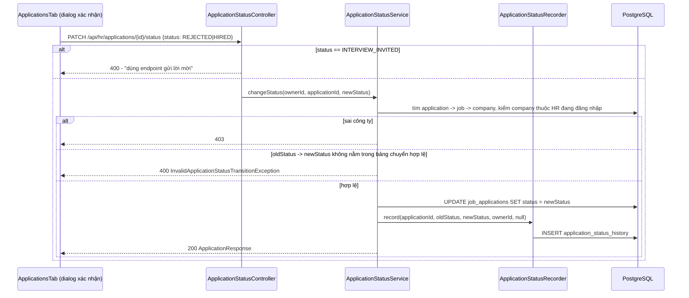
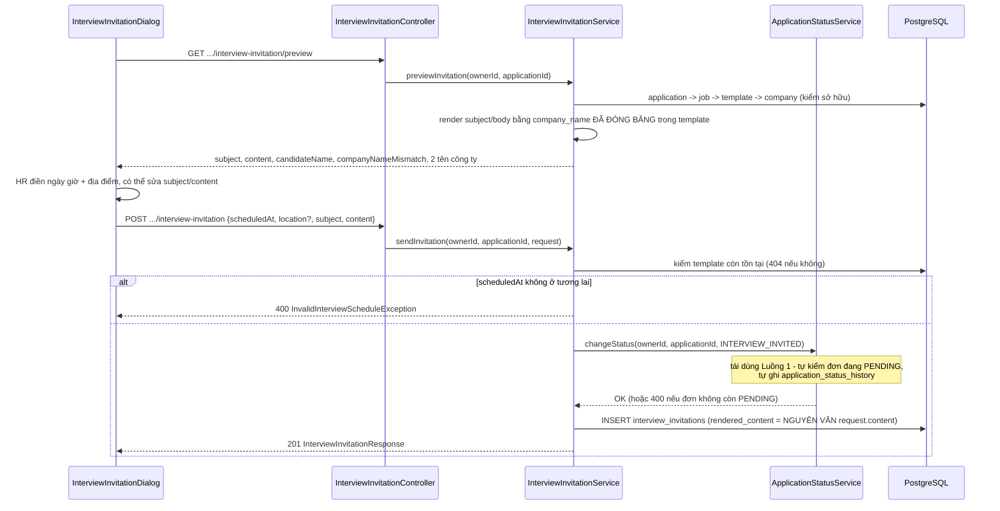

# FR-H07 — Pipeline & Quyết định tuyển dụng (E1)

Nhánh `feat/fr-h07-pipeline` (E1), xếp chồng trên `feat/fr-h06-explain` (D4) đã gộp vào `main`.

## 1. Mục tiêu

Đến D4, HR đã có đủ dữ liệu để đánh giá một ứng viên: điểm từng tiêu chí, tổng điểm, xếp hạng, báo
cáo giải thích. Nhưng chưa có chỗ nào để HR **hành động** trên dữ liệu đó — đơn ứng tuyển nằm mãi ở
trạng thái "Chờ duyệt". E1 đóng vòng lặp đó: HR mở hồ sơ một ứng viên, xem điểm và giải thích (đã
có từ D3/D4), rồi tự tay quyết định Mời phỏng vấn hoặc Từ chối. Nếu mời, hệ thống render sẵn nội
dung giấy mời từ mẫu đã tạo ở lúc đăng tin (FR-H02), HR điền ngày giờ cụ thể và có thể sửa nội dung
trước khi gửi. Sau buổi phỏng vấn, HR quay lại xác nhận kết quả cuối: Trúng tuyển hoặc Bị từ chối.

Nguyên tắc xuyên suốt cả nhánh (nhắc lại nguyên văn SRS vì đây là ràng buộc quan trọng nhất): **AI
không được tự quyết định ứng viên đậu hay rớt, kể cả dưới hình thức gán nhãn phân loại.** Hệ thống
chỉ cung cấp điểm số, xếp hạng, giải thích — mọi chuyển trạng thái đều xuất phát từ một hành động
bấm nút thật của HR (hoặc của ứng viên với `WITHDRAWN`, đã làm ở FR-U06 trước đó, không thuộc phạm
vi nhánh này).

Nhánh chia làm 3 đợt: đợt 1 dựng máy trạng thái thuần (`PATCH .../status`), đợt 2 dựng giấy mời
phỏng vấn (`GET preview` + `POST` gửi), đợt 3 dựng giao diện pipeline cho HR và nối hai đợt trước
lại thành một luồng thao tác được.

## 2. Các file đã tạo/sửa

### Backend — máy trạng thái đơn ứng tuyển (`jobapplication/`)

| File | Vai trò |
|---|---|
| `ApplicationStatusRecorder.java` | Bean ghi riêng cho `application_status_history` — tách từ method `private` cũ trong `ApplicationService` (nợ đã ghi từ Phase D), để tránh self-invocation khi bean khác (E1) cần gọi lại |
| `ApplicationStatusService.java` | `changeStatus(ownerId, applicationId, newStatus)` — kiểm sở hữu, kiểm luồng chuyển hợp lệ theo bảng cố định, ghi `job_applications.status` + gọi `ApplicationStatusRecorder` |
| `ApplicationStatusController.java` | `PATCH /api/hr/applications/{id}/status` — chặn thẳng `INTERVIEW_INVITED` ngay ở tầng này (mục 4b) |
| `dto/ApplicationStatusUpdateRequest.java` | Body request — chỉ một field `status` |
| `ApplicationService.java` (sửa) | `apply`/`withdraw` chuyển sang gọi `ApplicationStatusRecorder` thay vì method `private` cũ, hành vi giữ nguyên |
| `ApplicationOwnerService.java` / `dto/ApplicationHrListItemResponse.java` (sửa, đợt 3) | Thêm field `status` vào response danh sách ứng viên — lỗ hổng phát hiện khi dựng frontend (mục 4g) |

### Backend — giấy mời phỏng vấn (`interviewinvitation/`, package mới)

| File | Vai trò |
|---|---|
| `InterviewInvitation.java` | Entity `interview_invitations` (bảng đã có sẵn từ V1, không migration mới) |
| `InterviewInvitationRepository.java` | `findByApplicationIdOrderByCreatedAtDesc` |
| `InterviewInvitationService.java` | `previewInvitation` (render thử, chỉ đọc) + `sendInvitation` (validate ngày giờ, gọi lại `ApplicationStatusService.changeStatus`, lưu nguyên văn) |
| `InterviewInvitationController.java` | `GET .../interview-invitation/preview`, `POST .../interview-invitation` |
| `dto/InterviewInvitationPreviewResponse.java` | subject/content đã render, candidateName, cờ `companyNameMismatch` + hai tên công ty |
| `dto/InterviewInvitationSendRequest.java` | scheduledAt/location/subject/content — giới hạn `@Size` khớp cột thật |
| `dto/InterviewInvitationResponse.java` | Response sau khi gửi thành công |

### Backend — exception dùng chung

| File | Vai trò |
|---|---|
| `InvalidApplicationStatusTransitionException.java` | 400 cho luồng chuyển trạng thái sai — có 2 constructor: một tự dựng message từ (from, to), một nhận message tuỳ biến (dùng cho guard chặn `INTERVIEW_INVITED` ở controller) |
| `InvalidInterviewScheduleException.java` | 400 khi ngày giờ phỏng vấn ở quá khứ |
| `GlobalExceptionHandler.java` (sửa) | Đăng ký handler cho hai exception trên |

### Frontend — mở rộng danh sách ứng viên (`features/scoring/`)

| File | Vai trò |
|---|---|
| `types.ts` (sửa) | Thêm `status: ApplicationStatus` vào `ApplicationHrListItem` |
| `api.ts` (sửa) | `changeApplicationStatusRequest` — gọi `PATCH .../status` |
| `queries.ts` (sửa) | `useChangeApplicationStatusMutation`; `hrApplicationsKeyPrefix` đổi từ private sang export để `features/interviewinvitation/` dùng chung |
| `ApplicationsTab.tsx` (sửa) | Thêm cột "Trạng thái đơn", hai nút hành động trong Sheet theo đúng trạng thái, hai hộp thoại (mời phỏng vấn / xác nhận trúng tuyển-từ chối) |

### Frontend — giấy mời phỏng vấn (`features/interviewinvitation/`, mới)

| File | Vai trò |
|---|---|
| `types.ts` | Khớp 3 DTO backend |
| `api.ts` | `previewInterviewInvitationRequest`, `sendInterviewInvitationRequest` |
| `queries.ts` | `useInterviewInvitationPreviewQuery` (chỉ fetch khi dialog mở), `useSendInterviewInvitationMutation` |
| `InterviewInvitationDialog.tsx` | Form RHF + Zod: hiện bản render preview, HR sửa được subject/content, điền ngày giờ + địa điểm, cảnh báo khi `companyNameMismatch` |

## 3. Luồng chính

### Luồng 1 — HR đổi trạng thái trực tiếp (Từ chối / Trúng tuyển)

Bảng chuyển hợp lệ cố định trong `ApplicationStatusService`: `PENDING -> {INTERVIEW_INVITED,
REJECTED}`, `INTERVIEW_INVITED -> {HIRED, REJECTED}`. `HIRED`/`REJECTED` không phải khoá trong bảng
này nên tự động là trạng thái cuối — không cần code riêng để "cấm đi tiếp từ đó".

### Luồng 2 — HR mời phỏng vấn

Điểm quan trọng: bước gửi **không render lại** — `rendered_content` lưu đúng những gì HR gửi lên ở
bước POST, không phải bản render ở bước GET preview trước đó. Xem lý do ở mục 4c.

### Luồng 3 — Giao diện pipeline (frontend)

`ApplicationsTab` (đã có từ D3/D4) hiện thêm cột "Trạng thái đơn" (`ApplicationStatusBadge`, tái
dùng nguyên component đã có từ FR-U03). Bấm "Xem hồ sơ" mở `Sheet` — bên trong, ngoài điểm/giải
thích như D4, có thêm khối nút hành động cố định ở cuối panel, nội dung nút phụ thuộc
`application.status` (hàm `nextActionsFor`, thuần phía client, chỉ để ẩn/hiện — xem mục 4h):

- `PENDING` → "Mời phỏng vấn" (mở `InterviewInvitationDialog`) + "Từ chối" (mở dialog xác nhận).
- `INTERVIEW_INVITED` → "Trúng tuyển" + "Từ chối" (cùng dialog xác nhận, khác `targetStatus`).
- `HIRED`/`REJECTED`/`WITHDRAWN` → không nút nào.

Cả hai dialog dùng chung một mutation (`useChangeApplicationStatusMutation` /
`useSendInterviewInvitationMutation`), thành công thì `invalidateQueries` trên
`hrApplicationsKeyPrefix(jobId)` — bảng tự làm mới, không cần refetch thủ công.

## 4. Quyết định thiết kế

**(a) Tách `ApplicationStatusRecorder` thành bean riêng, không chỉ đổi `private` thành `public`**
- Đã chọn: một `@Service` độc lập, `record(...)` có `@Transactional` riêng, inject vào cả
  `ApplicationService` (C2/C4, đã có từ trước) lẫn `ApplicationStatusService`/`InterviewInvitationService`
  (E1, mới).
- Lựa chọn khác: chỉ đổi visibility method cũ trong `ApplicationService` từ `private` sang `public`.
- Vì sao: đúng bẫy đã ghi ở CLAUDE.md mục 3c — nếu `ApplicationStatusService` gọi một method
  `public` nhưng nằm trong `ApplicationService` (một bean khác), việc đó vẫn ổn về mặt Spring proxy
  (đây là gọi chéo bean thật, không phải self-invocation) — NHƯNG về mặt thiết kế, `ApplicationService`
  vốn thuộc domain "candidate tự thao tác đơn của mình" (C2/C4), gán thêm trách nhiệm "ghi lịch sử
  cho mọi domain khác gọi vào" lên đúng class đó làm mờ ranh giới sở hữu. Tách bean riêng, đặt tên
  theo đúng việc nó làm (ghi lịch sử, không phải "dịch vụ đơn ứng tuyển của ứng viên"), là quyết
  định kiến trúc rõ ràng hơn — không phải sửa lỗi kỹ thuật, mà sửa ranh giới trách nhiệm.
- **Cảnh báo cho người đọc sau**: `ApplicationStatusRecorderTest.java` nằm trong package
  `jobapplication` (tạo ở E1) nhưng bảo vệ hành vi mà `ApplicationService.apply`/`withdraw` (C2/C4,
  có từ trước E1) đang phụ thuộc vào — xoá bean này hoặc đổi signature `record(...)` sẽ làm hỏng cả
  luồng nộp đơn/rút đơn của Phase C, không chỉ luồng của E1. Ngược lại, `ApplicationServiceTest.java`
  (file gốc của C2/C4, đã sửa ở đợt 1 để tiêm `ApplicationStatusRecorder` giả lập) nay phụ thuộc vào
  một lớp thuộc E1 — một lượt dọn dẹp tưởng "constructor có tham số thừa" trong tương lai có thể vô
  tình xoá mất phép inject này.

**(b) Đóng đường tắt `PATCH .../status` thẳng sang `INTERVIEW_INVITED` — bắt buộc qua endpoint gửi
lời mời**
- Đã chọn: `ApplicationStatusController` chặn (400) ngay khi `request.status() ==
  INTERVIEW_INVITED`, bất kể `applicationId` có hợp lệ hay không. `ApplicationStatusService.changeStatus`
  (tầng dưới) vẫn giữ nguyên, không biết gì về ràng buộc này — vì `InterviewInvitationService` cũng
  cần gọi lại đúng method đó để thực hiện phần chuyển trạng thái.
- Lựa chọn khác: giữ nguyên `PATCH .../status` cho phép đặt thẳng `INTERVIEW_INVITED` như một
  chuyển tiếp hợp lệ bình thường (thiết kế ban đầu ở đợt 1, trước khi đợt 2 thêm giấy mời).
- Vì sao: SRS định nghĩa trạng thái này là "Đã mời phỏng vấn (**có lịch hẹn**)" — một đơn ở trạng
  thái đó mà không có dòng `interview_invitations` nào đi kèm là dữ liệu sai, không phải một trạng
  thái hợp lệ đơn giản chỉ thiếu thông tin phụ. Quyết định này bắt buộc phải sửa lại một test đã
  qua đợt 1 (`changeStatus_pendingToInterviewInvited_returnsOkAndRecordsOneHistoryRow` →
  `changeStatus_pendingToInterviewInvitedViaPatch_returns400`), và đổi cách hai test 403/404 khác
  dựng dữ liệu (chuyển sang dùng `REJECTED` làm target thay vì `INTERVIEW_INVITED`, vì
  `INTERVIEW_INVITED` giờ bị chặn vô điều kiện trước khi tới được bước kiểm quyền sở hữu).
- **Lệch với chữ trong `docs/PHASES.md`** (ghi ra đây vì đọc hai tài liệu cạnh nhau sẽ thấy vênh):
  mục E1 của PHASES.md mô tả máy trạng thái là `PENDING → INTERVIEW_INVITED | REJECTED`, đọc riêng
  dòng đó thì `PATCH` thẳng sang `INTERVIEW_INVITED` là hợp lệ. Bảng `ALLOWED_TRANSITIONS` trong
  `ApplicationStatusService` **vẫn đúng nguyên như vậy** — chỗ lệch nằm ở tầng controller, nơi
  endpoint HTTP `PATCH .../status` từ chối riêng giá trị này. Nói cách khác: luồng chuyển trạng thái
  không đổi, chỉ có số cửa vào để kích hoạt nó bị thu hẹp còn đúng một cửa (endpoint gửi lời mời).
  PHASES.md mô tả máy trạng thái ở mức miền nghiệp vụ, không mô tả bề mặt HTTP — hai thứ này không
  bắt buộc ánh xạ một-một.
- Đánh đổi: (1) API mất tính đồng nhất — bốn trong năm trạng thái đổi được qua một endpoint chung,
  riêng một trạng thái phải đi endpoint khác, và client buộc phải biết ngoại lệ đó (frontend đã phản
  ánh đúng: nút "Mời phỏng vấn" mở `InterviewInvitationDialog` chứ không gọi mutation đổi trạng thái
  như hai nút còn lại). (2) Guard đặt ở controller nên nó chỉ bảo vệ đúng cửa HTTP đó — nếu sau này
  có luồng khác gọi thẳng `ApplicationStatusService.changeStatus(..., INTERVIEW_INVITED)` thì ràng
  buộc "phải có lịch hẹn" không được thực thi. Đây là lựa chọn có ý thức chứ không phải sơ suất: đẩy
  guard xuống tầng service sẽ chặn luôn `InterviewInvitationService` — bên duy nhất được phép thực
  hiện chuyển tiếp này — nên tầng service buộc phải giữ nguyên tính trung lập.

**(c) Bước gửi (`POST`) không render lại, không so khớp lại với template**
- Đã chọn: `InterviewInvitationSendRequest.subject`/`content` là nguyên văn HR gửi lên, lưu thẳng
  vào `rendered_content`, không có bước xử lý nào ở giữa.
- Lựa chọn khác: server tự render lại từ template + `scheduledAt` HR vừa gửi, bỏ qua
  `subject`/`content` trong request (chỉ dùng chúng để hiển thị xác nhận).
- Vì sao: SRS cho phép HR "sửa nội dung trước khi gửi" — nếu server render lại, mọi chỉnh sửa của
  HR ở bước preview sẽ bị ghi đè mất. Đây là quyết định có chủ đích, đã ghi thành comment trực tiếp
  trên `InterviewInvitationSendRequest.java` và trong `InterviewInvitationService.sendInvitation`
  để người đọc sau không tưởng nhầm là thiếu sót rồi "sửa" bằng cách thêm render lại.

**(d) Endpoint gửi lời mời tách riêng (`POST .../interview-invitation`), không mở rộng
`ApplicationStatusUpdateRequest`**
- Đã chọn: package mới `interviewinvitation/`, endpoint riêng nhận đủ `scheduledAt`/`location`/
  `subject`/`content`, tự gọi lại `ApplicationStatusService.changeStatus` bên trong.
- Lựa chọn khác: thêm các field đó (có điều kiện, chỉ bắt buộc khi `status = INTERVIEW_INVITED`)
  thẳng vào `ApplicationStatusUpdateRequest`.
- Vì sao: `ApplicationStatusService` tự khai trong comment lớp là "CHỈ một UPDATE status" — nhét
  thêm logic render/so khớp tên công ty/ngày giờ vào đó phá vỡ ranh giới single-responsibility đó.
  Về mặt kỹ thuật, Bean Validation không diễn đạt gọn được "field bắt buộc chỉ khi field khác bằng
  một giá trị cụ thể" — sẽ phải viết validator tuỳ biến, phức tạp hơn hẳn một DTO riêng.

**(e) So khớp `company_name`: chỉ cảnh báo, không tự sửa**
- Đã chọn: `previewInvitation` so `template.getCompanyName()` (đóng băng lúc tạo job) với
  `company.getName()` hiện tại; khác nhau thì trả `companyNameMismatch=true` kèm cả hai tên, nội
  dung vẫn render bằng tên **đã đóng băng** trong template.
- Lựa chọn khác: tự động thay tên công ty hiện tại vào nội dung khi phát hiện lệch.
- Vì sao: cùng nguyên tắc snapshot đã dùng cho `rubric_snapshot` (D2) — HR đổi tên công ty sau này
  không được âm thầm thay đổi nội dung một giấy mời đã/sắp gửi mà không ai biết. Quyết định thuộc
  về HR khi họ thấy cảnh báo, không phải hệ thống tự quyết.

**(f) Giới hạn `@Size` của `subject`/`content` khớp đúng cột thật, không chọn số tuỳ ý**
- Đã chọn: `subject` tối đa 255 (khớp cột `VARCHAR(255)` thật trong `interview_invitations`),
  `content` tối đa 10000 (cột `rendered_content` là `TEXT`, không giới hạn ở DB — 10000 là chặn
  thêm ở tầng ứng dụng để tránh client gửi chuỗi khổng lồ, không phải giới hạn schema).
- Vì sao ghi rõ: nếu không phân biệt rõ "giới hạn khớp cột thật" với "giới hạn tự đặt ở tầng ứng
  dụng", người đọc sau dễ hiểu nhầm cả hai đều là ràng buộc DB và ngại đổi con số 10000 dù có lý do
  chính đáng để đổi.

**(g) Thêm field `status` vào `ApplicationHrListItemResponse` — lỗ hổng phát hiện giữa chừng đợt 3**
- Bối cảnh: khi dựng frontend, phát hiện `GET /api/hr/jobs/{jobId}/applications` (endpoint nền cho
  toàn bộ tab Ứng viên) không có field nào cho biết đơn đang ở trạng thái gì — không có nó thì
  không thể quyết định hiện nút hành động nào, đúng yêu cầu "chỉ hiện nút hợp lệ theo trạng thái
  hiện tại".
- Đã chọn: thêm `status: ApplicationStatus` vào response, đọc thẳng từ `JobApplication.status` đang
  có sẵn trong vòng lặp của `ApplicationOwnerService.listApplications` — không thêm query, không
  migration.
- Lựa chọn khác: gọi một request GET riêng cho từng đơn để lấy trạng thái.
- Vì sao: phương án kia tạo N+1 request, phá vỡ đúng nguyên tắc "gộp một lần gọi cho cả danh sách"
  mà D3 đã cố tình thiết kế (10 query cho cả trang, không phụ thuộc số lượng ứng viên).

**(h) Nút "Xem hồ sơ" (Sheet) không còn `disabled` khi chưa có kết quả chấm điểm**
- Bối cảnh: nút này (trước đây tên "Xem đánh giá của AI", dựng ở D4) từng bị `disabled` khi đơn
  chưa có `criterionScores`/`explanation` nào. Ở E1, cùng chiếc Sheet đó còn là nơi chứa hai nút
  hành động (Mời phỏng vấn/Từ chối/Trúng tuyển) — nếu giữ nguyên điều kiện disable, một đơn PENDING
  chưa từng được chấm điểm sẽ không thể mở Sheet, tức là **không thể mời phỏng vấn được**.
- Đã chọn: bỏ hẳn điều kiện `disabled` ở nút trigger; bên trong Sheet, nếu chưa có kết quả chấm thì
  hiện một câu mô tả trung tính thay cho `CriterionScoreBreakdown`/`ExplanationReport`, hai nút hành
  động vẫn luôn hiện đầy đủ theo `application.status`.
- Vì sao: CLAUDE.md mục 7 cấm rõ "không thêm ràng buộc kiểu chỉ cho mời phỏng vấn khi đã chấm điểm
  xong — SRS không yêu cầu điều đó và nó gắn quyết định vào điểm số". Giữ nguyên điều kiện cũ sẽ vô
  tình tạo đúng ràng buộc bị cấm đó như một tác dụng phụ không ai để ý, dù bản thân điều kiện đó
  không đọc trực tiếp giá trị điểm số.

**(i) State hai dialog (mời phỏng vấn, xác nhận trúng tuyển/từ chối) đặt ở cấp `ApplicationsTab`,
không phải từng `ApplicationRow`**
- Đã chọn: `inviteTarget`/`confirmTarget` là state của component cha, truyền callback xuống từng
  hàng.
- Lựa chọn khác: mỗi `ApplicationRow` tự quản lý dialog riêng của mình.
- Vì sao: đúng mẫu đã có sẵn trong `CandidateApplicationsPage.tsx` (dialog "Rút đơn ứng tuyển?") —
  đảm bảo chỉ một dialog mở tại một thời điểm trên toàn bảng, tránh trạng thái lạ khi HR thao tác
  nhanh giữa nhiều hàng.

**(j) Đường dẫn `/api/hr/applications/...`, không phải `/api/applications/...` như ghi trong
`docs/PHASES.md`**
- Bối cảnh: mục E1 của PHASES.md ghi endpoint là `PATCH /api/applications/{id}/status`. Đường dẫn
  thật trong code là `PATCH /api/hr/applications/{applicationId}/status`. Đây là chỗ lệch thứ hai
  giữa hai tài liệu (chỗ thứ nhất ở mục 4b), nên ghi rõ ở đây thay vì để người đọc tự đoán.
- Đã chọn: theo quy ước phân tách theo vai trò đã áp dụng xuyên suốt từ Phase B — API do HR gọi nằm
  dưới `/api/hr/`, API do ứng viên gọi nằm dưới `/api/candidates/`, API không cần đăng nhập nằm dưới
  `/api/public/`. Quy ước này ghi ở CLAUDE.md mục 7 và **thắng** đường dẫn minh hoạ trong PHASES.md;
  PHASES.md viết đường dẫn để chỉ ra *endpoint nào cần có*, không phải để chốt chuỗi URL chính xác.
- Lựa chọn khác: dùng đúng `/api/applications/{id}/status` như PHASES.md viết, phân biệt HR với ứng
  viên bằng `@PreAuthorize` trên cùng một cây đường dẫn.
- Vì sao: cùng một tài nguyên `job_applications` được hai vai trò thao tác với hai tập hành động
  tách bạch (ứng viên nộp/rút đơn của mình; HR đổi trạng thái/mời phỏng vấn trên đơn gửi tới công ty
  mình). Tách theo tiền tố làm ranh giới quyền hiện ngay trên URL — đọc `SecurityFilterChain` là
  thấy được ai vào được nhánh nào, không cần mở từng controller đếm annotation. Trộn chung một cây
  rồi phân quyền hoàn toàn bằng annotation thì mỗi endpoint mới là một lần phải nhớ gắn đúng
  `@PreAuthorize`; sót một cái là lỗ hổng im lặng, không có gì ở tầng cấu hình bắt lại được.
- Đánh đổi: URL dài hơn và lặp thông tin (tiền tố `hr` đã ngụ ý sẵn trong quyền đã kiểm), và mỗi khi
  PHASES.md viết một đường dẫn minh hoạ thì phải đối chiếu lại với quy ước thay vì chép thẳng — đúng
  tình huống đã xảy ra ở nhánh này.

## 5. Ràng buộc SRS đã thực thi

| FR / quy ước | Ràng buộc | Thực thi ở đâu |
|---|---|---|
| FR-H07 | AI không tự quyết định đậu/rớt dưới mọi hình thức | Không field `verdict`/`label`/`isQualified`/`passed`/`recommendation` ở đâu trong nhánh (đã soát bằng `srs-guard`); mọi chuyển trạng thái xuất phát từ request HTTP do HR gọi |
| FR-H07 | 5 trạng thái, đúng luồng chuyển | `ApplicationStatusService.ALLOWED_TRANSITIONS`: `PENDING -> {INTERVIEW_INVITED, REJECTED}`, `INTERVIEW_INVITED -> {HIRED, REJECTED}`; `WITHDRAWN` chỉ ứng viên thực hiện (không đổi ở nhánh này) |
| FR-H07 | `PENDING -> HIRED` phải bị chặn | Không nằm trong `ALLOWED_TRANSITIONS`, test `changeStatus_pendingToHired_returns400` |
| FR-H07 | Chuyển sai luồng chặn ở backend, không chỉ ẩn nút | `ApplicationStatusService`/`InterviewInvitationService` là chốt chặn thật; frontend (`nextActionsFor`) chỉ ẩn nút, comment ghi rõ đây là tiện dụng UI |
| FR-H07 | Giấy mời render từ `interview_templates` + tên ứng viên, HR điền ngày giờ, sửa được nội dung | `InterviewInvitationService.previewInvitation`/`sendInvitation`, mục 4c |
| FR-H02 (kế thừa) | `company_name` đóng băng lúc tạo template, không đổi theo hồ sơ công ty sau này | `template.getCompanyName()` dùng để render (không dùng `company.getName()` sống); cảnh báo lệch, không tự sửa (mục 4e) |
| CLAUDE.md mục 2 | `interview_invitations` lưu nguyên văn, không FK ngược về template | `InterviewInvitation.renderedContent` không render lại ở bước gửi (mục 4c), test `send_thenTemplateEditedAfterward_invitationContentUnchanged` |
| CLAUDE.md mục 7 | Không ràng buộc "phải chấm điểm xong mới được mời" | Nút hành động chỉ phụ thuộc `application.status`, không đọc `totalScore`/`rank`/`criterionScores` (mục 4h) |
| UI_GUIDE.md | Badge trạng thái màu trung tính, không đỏ/vàng/xanh theo điểm | Tái dùng nguyên `ApplicationStatusBadge`/token `--color-status-*` đã có từ FR-U03 |
| UI_GUIDE.md | Không gợi ý hành động theo điểm | `nextActionsFor` chỉ nhận `status`, không có câu chữ nào kiểu "Nên mời phỏng vấn" |
| Quy ước dự án (CLAUDE.md 3c) | Method ghi của job liên-bean không tự self-invocation | `ApplicationStatusRecorder` là bean riêng, `@Transactional` riêng (mục 4a) |

## 6. Đã kiểm thử gì

**Backend tự động** — `.\mvnw.cmd test` (toàn bộ suite): **309/309 pass, BUILD SUCCESS**.
- Máy trạng thái (9 test, `ApplicationStatusControllerIntegrationTest`) — từng cặp chuyển đúng
  luồng, `PENDING -> HIRED` 400, HR khác công ty 403, đúng một dòng lịch sử mỗi lần đổi, đường tắt
  PATCH sang `INTERVIEW_INVITED` bị chặn 400.
- Bean ghi lịch sử (2 test, `ApplicationStatusRecorderTest`) — Mockito thuần, xác nhận field ghi
  đúng kể cả khi `fromStatus = null`.
- Giấy mời phỏng vấn (17 test, `InterviewInvitationControllerIntegrationTest`) — preview render
  đúng tên ứng viên, cảnh báo lệch tên công ty, 404 khi job chưa có template (mô phỏng bằng xoá
  template trực tiếp trong test — tình huống phòng thủ, không xảy ra qua luồng bình thường vì
  `JobOwnerService.create` luôn tạo Job+Rubric+Template cùng lúc), 403 HR khác công ty, ngày giờ
  quá khứ/thiếu ngày giờ đều 400, gửi hai lần liên tiếp lần hai bị chặn, nội dung không đổi sau khi
  sửa template, và 6 test biên `@Size` (`subject` 254/255/256, `content` 9999/10000/10001).
- `ApplicationOwnerServiceTest`/`ApplicationServiceTest` — cập nhật theo field `status` mới và bean
  `ApplicationStatusRecorder` mới, hành vi cũ (C2/C4) không đổi.

**Frontend** — `npm run build` (`tsc -b && vite build`) và `npm run lint` đều sạch.

**`srs-guard`** — soát đủ 9 mục, không phát hiện vi phạm. Một điểm "cần xem lại" (không phải vi
phạm 9 mục, xem mục 7) đã được ghi nhận và xếp vào nợ kỹ thuật thay vì sửa trong nhánh này.

**Chưa test**:
- **Chưa chạy tay qua giao diện trình duyệt thật với backend đang chạy.** Toàn bộ xác nhận frontend
  trong đợt này dừng ở `tsc`/`vite build`/`eslint` — chưa có ai thực sự mở app (`docker compose up`
  + `mvnw spring-boot:run` + `npm run dev`), đăng nhập HR, mở một job có ứng viên thật, bấm qua
  luồng mời phỏng vấn/từ chối/trúng tuyển để xác nhận bằng mắt. Đây là khoảng trống so với tiêu chí
  "chạy được thật trên giao diện" đã đặt ra cho đợt 3 — cần một lượt kiểm tay trước khi coi đợt này
  là hoàn thành đầy đủ.
- **Chưa test race condition thật** cho `ApplicationStatusService.changeStatus` (xem mục 7, nợ kỹ
  thuật mới) — test hiện có đều gọi tuần tự, không có test hai request đồng thời.
- **Chưa test tay với việc gửi thông báo thật** (email/web) khi trạng thái đổi — không thuộc phạm
  vi E1 (đó là FR-C03/E2, chưa làm), nhưng vì E1 là điều kiện tiên quyết của E2 nên ghi chú lại ở
  đây để tránh hiểu nhầm là đã có thông báo tự động khi gửi lời mời.

## 7. Nợ kỹ thuật

**Phát sinh mới ở E1** (phát hiện qua `srs-guard`, đã quyết định để lại `chore/hardening` thay vì
sửa trong nhánh này):
1. `ApplicationStatusService.changeStatus` đọc `application.getStatus()` rồi `save()` mà không có
   `WHERE status = :oldStatus` hay `@Version` (không có optimistic lock nào trên `JobApplication`).
   Hai request PATCH gần như đồng thời trên cùng một đơn (double-click, hai tab HR) đều có thể đọc
   cùng một `oldStatus`, đều qua được kiểm luồng, rồi cả hai đều ghi thành công (last-write-wins),
   có thể để lại hai dòng lịch sử mâu thuẫn cùng xuất phát từ một trạng thái gốc. Đây không đúng
   khuôn mẫu "SELECT-trước-INSERT cho ràng buộc duy nhất" mà `srs-guard` mục 9 mô tả (đây là UPDATE,
   không phải INSERT, và không có ràng buộc "chỉ một X đang hoạt động" nào bị vi phạm theo đúng
   nghĩa hẹp), nhưng rủi ro cùng họ (thiếu chốt chặn race ở tầng ghi) nên vẫn ghi nhận. Cách sửa đề
   xuất: đổi `changeStatus` sang `UPDATE job_applications SET status = :new WHERE id = :id AND
   status = :old` (native hoặc `@Modifying(clearAutomatically = true)`), kiểm số dòng ảnh hưởng —
   cùng khuôn mẫu `ScoringRunRepository.finishAggregation` (D3) đã dùng cho đúng vấn đề tương tự.
2. Chưa chạy tay qua giao diện thật (xem mục 6) — không phải nợ code, nhưng là việc còn thiếu trước
   khi coi tiêu chí "xong" của đợt 3 là đạt đầy đủ.

**Không phải nợ, là hạn chế/quyết định có chủ đích** (đã giải thích ở mục 4, không lặp lại): không
render lại nội dung ở bước gửi; không tự sửa tên công ty khi lệch, chỉ cảnh báo; giới hạn `@Size`
10000 ký tự cho `content` là chặn tầng ứng dụng, không phải giới hạn schema; `interview_invitations.sentAt`/
`sentBy` luôn được set ngay lúc tạo dòng (không có trạng thái "nháp" — hai cột nullable trong schema
chỉ chừa chỗ cho tính năng đó nếu làm sau này, hiện chưa dùng); nút "Xem hồ sơ" không còn bị
`disabled` khi thiếu kết quả chấm điểm.

**Kế thừa nguyên vẹn từ D1-D4** (không thuộc phạm vi nhánh này, xem walkthrough
`fr-h06-explain`/`feat-fr-h05-aggregate`): không có stale-claim reaper cho D1/D2; chưa test race
condition thật cho `recordFailedAttempt` (D4); `ResumeHrController` stream file qua app server thay
vì presigned URL.

**Phụ thuộc xuôi** (không phải nợ của E1, ghi chú để tránh hiểu nhầm phạm vi): E2 (`feat/fr-c03-notification`,
FR-C03 — thông báo web + email khi trạng thái đổi) và F3 (dashboard) đều phụ thuộc E1 theo bảng phụ
thuộc ở `docs/PHASES.md` — cả hai chưa làm, đơn giản là "gửi lời mời phỏng vấn" hiện tại **không**
kèm gửi email/thông báo thật nào, chỉ lưu bản ghi trong `interview_invitations`.
