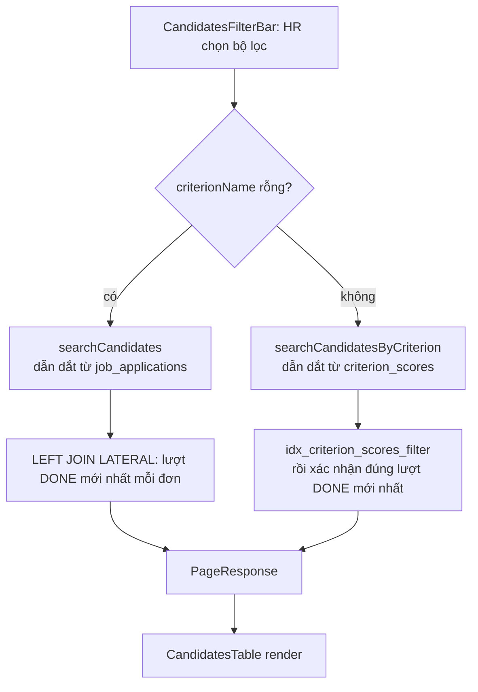

# Walkthrough — FR-H08: Dashboard, Thống kê & Lịch sử Đánh giá

Nhánh: `feat/fr-h08-dashboard` (rẽ từ `feat/candidate-view-invitation`)

## 1. Mục tiêu

HR hiện đang phải mở từng tin tuyển dụng để xem tình hình ứng viên — không có chỗ nào nhìn được
bức tranh toàn công ty. FR-H08 lấp khoảng trống đó bằng ba việc:

1. Một trang **Dashboard** tổng hợp: tổng số hồ sơ và phân bố theo trạng thái, tỷ lệ chuyển đổi
   giữa các vòng (nộp đơn → được mời phỏng vấn → trúng tuyển), và một bảng hiệu suất theo từng
   chiến dịch tuyển dụng (job).
2. Một trang **Ứng viên toàn công ty** — gộp ứng viên của mọi job vào một danh sách, lọc được theo
   job, trạng thái đơn, khoảng tổng điểm, hoặc điểm của một tiêu chí cụ thể (ví dụ "chỉ xem ứng
   viên có điểm Docker ≥ 8/10").
3. Một **panel tra cứu lịch sử đánh giá AI** cho từng đơn — xem lại mọi lượt AI đã chấm (không chỉ
   lượt mới nhất), kèm `model`/`prompt_version`/số token đã dùng, phục vụ đối chiếu và kiểm tra
   tuân thủ khi cần giải trình.

Toàn bộ ba phần này chỉ **đọc** dữ liệu đã có từ các nhánh trước (D1-D4, E1) — FR-H08 không tạo ra
luồng ghi dữ liệu mới nào, không có job nền, không gọi AI.

## 2. Các file đã tạo/sửa

### Backend

| File | Vai trò |
|---|---|
| `dashboard/DashboardController.java` | Endpoint `GET /api/hr/dashboard/stats` |
| `dashboard/DashboardService.java` | Gộp 3 truy vấn thống kê thành một response, kiểm quyền sở hữu công ty |
| `dashboard/dto/DashboardStatsResponse.java` | Cấu trúc response: phân bố trạng thái, phễu chuyển đổi, hiệu suất từng job |
| `job/JobRepository.java` *(sửa)* | Thêm `findJobPerformanceForCompany` — truy vấn tổng hợp theo job |
| `job/JobPerformanceView.java` | Projection cho truy vấn trên |
| `jobapplication/JobApplicationRepository.java` *(sửa)* | Thêm `countByStatusForCompany`, `countFunnelForCompany`, `searchCandidates`, `searchCandidatesByCriterion`, `findDistinctCriterionNamesForCompany` |
| `jobapplication/StatusCountView.java`, `FunnelCountsView.java`, `CandidateSearchRow.java` | Projection cho các truy vấn trên |
| `jobapplication/ApplicationSearchController.java` | Endpoint `GET /api/hr/candidates` (phân trang, lọc) và `GET /api/hr/candidates/criteria` (dropdown tiêu chí) |
| `jobapplication/ApplicationSearchService.java` | Điều phối lọc, validate tổ hợp bộ lọc, batch-fetch tên ứng viên/trạng thái CV |
| `jobapplication/dto/ApplicationSearchItemResponse.java` | Response cho danh sách ứng viên toàn công ty |
| `scoring/ScoringRunAuditController.java` | Endpoint `GET /api/hr/candidates/{applicationId}/audit/scoring-runs` |
| `scoring/ScoringRunAuditService.java` | Gộp lịch sử các lượt chấm + điểm từng tiêu chí + metadata báo cáo giải thích |
| `scoring/dto/ScoringRunAuditItemResponse.java` | Response lịch sử đánh giá |
| `common/exception/InvalidCandidateSearchFilterException.java` | Lỗi 400 khi tổ hợp bộ lọc không hợp lệ |
| `common/exception/GlobalExceptionHandler.java` *(sửa)* | Thêm handler cho exception trên |
| `DashboardControllerIntegrationTest.java`, `ApplicationSearchControllerIntegrationTest.java`, `ScoringRunAuditControllerIntegrationTest.java` | Test tích hợp cho 3 endpoint trên |

### Frontend

| File | Vai trò |
|---|---|
| `features/dashboard/api.ts`, `queries.ts`, `types.ts` | Gọi API + TanStack Query cho trang Dashboard |
| `features/dashboard/StatusBreakdownChart.tsx` | Biểu đồ cột phân bố trạng thái (Recharts) |
| `features/dashboard/ConversionFunnelCard.tsx` | Thẻ phễu chuyển đổi (3 bước, % tính ở frontend) |
| `features/dashboard/JobPerformanceTable.tsx` | Bảng hiệu suất từng job |
| `pages/HrHomePage.tsx` *(sửa)* | Ráp 4 khối của Dashboard |
| `features/candidates/api.ts`, `queries.ts`, `types.ts` | Gọi API + TanStack Query cho trang Ứng viên |
| `features/candidates/CandidatesFilterBar.tsx` | Bộ lọc (job/trạng thái/khoảng điểm/tiêu chí) |
| `features/candidates/CandidatesTable.tsx` | Bảng ứng viên toàn công ty |
| `features/candidates/ScoringRunAuditPanel.tsx` | Panel (Sheet) lịch sử đánh giá AI |
| `pages/HrCandidatesPage.tsx` | Trang `/hr/candidates` |
| `lib/score.ts` | `formatScore` — định dạng điểm dùng chung cho cả 3 nơi hiển thị điểm |
| `App.tsx` *(sửa)* | Thêm route `/hr/candidates` |
| `components/layout/HrLayout.tsx` *(sửa)* | Gắn route Dashboard/Ứng viên vào sidebar, xóa mục "Rubric" |

## 3. Luồng chính

### Luồng A — Xem Dashboard (`GET /hr/dashboard/stats`)

1. `HrHomePage` mount, gọi `useDashboardStatsQuery()` (TanStack Query) → `getDashboardStatsRequest()`
   → `GET /api/hr/dashboard/stats`.
2. `SecurityConfig` chặn ở tầng filter chain: path `/api/hr/**` bắt buộc role `HR`.
3. `DashboardController.stats()` lấy `ownerId` từ JWT (`Authentication`), gọi
   `DashboardService.getStats(ownerId)`.
4. `DashboardService` trước tiên gọi `requireOwnCompany(ownerId)` — tra `companies` theo
   `owner_id`, không có thì 404 `COMPANY_NOT_FOUND`. Từ đây mọi câu truy vấn đều giới hạn theo
   `company.getId()`.
5. Ba truy vấn độc lập chạy (không transaction, chỉ đọc):
   - `JobApplicationRepository.countByStatusForCompany` — `GROUP BY status` trên `job_applications`
     join `jobs` (loại job đã xóa mềm).
   - `JobApplicationRepository.countFunnelForCompany` — đếm theo `application_status_history`
     (xem Quyết định thiết kế #1).
   - `JobRepository.findJobPerformanceForCompany` — `LEFT JOIN` từ `jobs` sang `job_applications`
     rồi `LATERAL` sang `scoring_runs`/`application_status_history` để lấy điểm trung bình và số
     lượt mời/trúng tuyển của từng job.
6. `DashboardService` gộp cả ba thành `DashboardStatsResponse`, trả JSON.
7. Frontend nhận response, `HrHomePage` render `StatusBreakdownChart` (Recharts), `ConversionFunnelCard`
   (tính % tại chỗ), `JobPerformanceTable`.

### Luồng B — Tìm ứng viên toàn công ty (`GET /hr/candidates`)

1. `CandidatesFilterBar` giữ trạng thái nháp (draft) cục bộ; bấm "Áp dụng" mới gọi
   `onApply` → `HrCandidatesPage` cập nhật `filters`, reset `page` về 0.
2. `useCandidatesQuery` gọi `GET /api/hr/candidates?jobId=&status=&minTotalScore=&...`.
3. `ApplicationSearchController.search()` → `ApplicationSearchService.search()`:
   - `validateFilters()` chặn tổ hợp sai trước khi chạm DB (đã được UI chặn từ trước, đây là lớp
     chốt chặn thứ hai — xem Quyết định thiết kế #9).
   - `requireOwnCompany(ownerId)`.
   - Nếu `criterionName == null`: gọi `JobApplicationRepository.searchCandidates` (nhánh không lọc
     tiêu chí). Ngược lại gọi `searchCandidatesByCriterion` (xem Quyết định thiết kế #2).
   - Batch-fetch `candidateName`/`resumeParseStatus` cho đúng các dòng của trang hiện tại (tránh
     N+1), map sang `ApplicationSearchItemResponse`.
4. Trả `PageResponse<ApplicationSearchItemResponse>`, frontend render bảng + `Pagination`
   (component tái dùng từ `features/jobs/Pagination.tsx`).

### Luồng C — Xem lịch sử đánh giá AI (panel audit)

1. HR bấm "Lịch sử đánh giá" trên một dòng trong `CandidatesTable` → mở `ScoringRunAuditPanel`
   (Sheet trượt từ phải).
2. `useScoringRunAuditQuery(applicationId)` gọi
   `GET /api/hr/candidates/{applicationId}/audit/scoring-runs`.
3. `ScoringRunAuditService.listAudit()`:
   - `requireOwnCompany` chạy **trước** khi tra `job_applications`/`jobs` (khác thứ tự của
     `ApplicationStatusService`/`ApplicationOwnerService` — xem Quyết định thiết kế #8).
   - Lấy toàn bộ lượt chấm của đơn qua `ScoringRunRepository.findByApplicationIdOrderByCreatedAtDesc`,
     rồi **sắp xếp lại bằng Java** (xem Quyết định thiết kế #5).
   - Với mỗi lượt: batch-fetch điểm từng tiêu chí (`CriterionScoreRepository.findByScoringRunIdIn`)
     và metadata báo cáo giải thích (`ScoreExplanationRepository.findByScoringRunIdIn`).
4. Trả `List<ScoringRunAuditItemResponse>`, panel render từng lượt (mới nhất trước), mỗi lượt kèm
   bảng điểm tiêu chí gọn (không evidence — xem Quyết định thiết kế #4).

## 4. Quyết định thiết kế

**1. Phễu chuyển đổi đọc `application_status_history`, không đọc `job_applications.status`.**
Lựa chọn khác: đếm trực tiếp `job_applications.status = 'INTERVIEW_INVITED'` / `'HIRED'`.
Vì sao chọn cách hiện tại: một đơn được mời phỏng vấn rồi ứng viên **rút đơn** (FR-U06) có
`status` hiện tại là `WITHDRAWN` — nếu đếm theo `status` hiện tại, lượt "đã từng được mời" đó biến
mất khỏi phễu, làm sai tỷ lệ chuyển đổi. `application_status_history.to_status` ghi lại **mọi**
lần đơn từng đạt một trạng thái, nên đếm theo bảng này giữ đúng "đã từng" bất kể trạng thái sau
đó. Đây chính là điều PHASES.md mục F3 cảnh báo ("AI hay làm sai": loại đơn `WITHDRAWN` khỏi thống
kê là sai) và cũng là tinh thần của FR-U06 (rút đơn không được làm sai lệch số liệu).

**2. Nhánh lọc theo tiêu chí dẫn dắt từ `criterion_scores`, không từ `job_applications`.**
Lựa chọn khác: một câu SQL duy nhất, lọc tiêu chí bằng `EXISTS` tương quan theo `scoring_run_id`.
Vì sao chọn cách hiện tại: khi đã biết `scoring_run_id` cụ thể (như trong phương án `EXISTS`),
Postgres sẽ ưu tiên `idx_criterion_scores_run` (index theo `scoring_run_id`) vì đó là điều kiện
chọn lọc hơn — **không** chạm tới `idx_criterion_scores_filter(criterion_name_snapshot, score
DESC)` mà chính PHASES.md đã ghi chú là "tạo sẵn cho việc lọc theo điểm tiêu chí" (comment ngay
trong `V1__init_schema.sql`). Muốn ép Postgres dùng đúng index đó, câu truy vấn phải **bắt đầu**
từ `criterion_scores` lọc theo `(criterion_name_snapshot, score)` trước, rồi mới join ngược lại
`scoring_runs`/`job_applications`/`jobs`. Có thêm một điều kiện phụ xác nhận đây đúng là lượt DONE
**mới nhất** của đơn (không phải một lượt DONE cũ hơn), giữ cùng ngữ nghĩa với nhánh không lọc
tiêu chí.

**3. Mọi `ORDER BY` — kể cả trong subquery/LATERAL chọn "lượt DONE mới nhất" — đều có khóa cuối
`id`.** Lựa chọn khác (là code ban đầu của D3, không thuộc phạm vi sửa của nhánh này): chỉ
`ORDER BY created_at DESC`. Vì sao đổi: `now()`/`CURRENT_TIMESTAMP` của Postgres là
**transaction-scoped** — mọi bản ghi tạo trong cùng một transaction (một request tạo nhiều lượt
chấm, hoặc dữ liệu test/seed) nhận **cùng một** giá trị `created_at` tuyệt đối. Đã kiểm chứng thực
nghiệm trên Postgres 17 thật (không chỉ suy luận): tạo hai dòng trùng `created_at`, chạy cùng một
câu `ORDER BY created_at DESC` hai lần với cùng kiểu kế hoạch truy vấn (Bitmap Heap Scan), chỉ đổi
vị trí vật lý của một dòng (xóa rồi chèn lại) — thứ tự trả về đổi từ `[A, B]` thành `[B, A]`.
Nghĩa là thiếu khóa cuối, thứ tự "ngẫu nhiên" giữa các dòng đồng hạng có thể đổi giữa hai lần đọc
dữ liệu không đổi. Hậu quả: phân trang lặp/mất dòng khi trang trước và trang sau đọc thấy thứ tự
khác nhau; hai nhánh lọc/không lọc tiêu chí có thể chọn ra hai lượt DONE khác nhau cho cùng một
đơn nếu không cùng thống nhất khóa cuối.

**4. Panel audit hiện bảng điểm tiêu chí gọn (tên/điểm/trọng số), không hiện evidence.** Lựa chọn
khác: tái dùng nguyên `CriterionScoreBreakdown` (component D4 đang dùng ở Sheet của
`ApplicationsTab`). Vì sao không tái dùng: component đó thiết kế cho ngữ cảnh xem **một** lượt
chấm, mở ra hiện toàn bộ `reasoning` + `evidence` (trích dẫn nguyên văn CV) cho từng tiêu chí.
Panel audit xếp **nhiều** lượt cạnh nhau (một đơn có thể có 3-5 lượt) — dùng nguyên component đó
sẽ làm panel dài lê thê và lặp lại đúng nội dung đã có sẵn ở Sheet của D4. Panel audit đúng vai
trò là **log kỹ thuật** (model/version/token/điểm), không phải nơi đọc lại báo cáo đánh giá.

**5. Sắp xếp lại lượt chấm bằng Java trong `ScoringRunAuditService`, không sửa
`ScoringRunRepository.findByApplicationIdOrderByCreatedAtDesc` của D2.** Lựa chọn khác: thêm
`, id DESC` thẳng vào method đó (cùng lỗi thiếu khóa cuối như mục #3). Vì sao không sửa: method đó
thuộc package `scoring`, đã được `ScoringRunService.listScoringRuns` (FR-H04, D2) dùng và có 19
test khẳng định hình dạng hiện tại — sửa nó từ nhánh FR-H08 là chạm code ngoài phạm vi một mã FR
(nguyên tắc bắt buộc của quy trình làm việc). Vì một đơn chỉ có vài lượt chấm, sắp xếp lại bằng
`Comparator.comparing(createdAt).thenComparing(id).reversed()` ngay trong Java không tốn kém gì.
Việc `findByApplicationIdOrderByCreatedAtDesc` thiếu khóa cuối vẫn còn nguyên trong D2, đã ghi vào
nợ kỹ thuật (mục 7).

**6. Biểu đồ phân bố trạng thái dùng một màu `--color-brand` duy nhất cho cả 5 cột, không dùng
bảng màu trạng thái sẵn có (`--color-status-*-text`).** Lựa chọn khác: mỗi trạng thái một màu như
badge trạng thái đơn (`ApplicationStatusBadge`) đang dùng. Vì sao không dùng: đã đọc thẳng giá trị
5 biến CSS đó — `HIRED` là xanh lá (`#008C45`), `REJECTED` là đỏ (`#E11B3E`). Với một badge đơn lẻ,
màu đó chỉ gắn với MỘT trạng thái, không mang hàm ý so sánh. Nhưng một biểu đồ cột đặt 5 giá trị
**cạnh nhau để so sánh** thì khác hẳn: cột đỏ thấp nằm cạnh cột xanh cao sẽ đọc ra thành phán quyết
tốt–xấu — đúng loại vi phạm PHASES.md mục D3 cấm tường minh (không tô màu theo ngưỡng/gợi ý phán
quyết), dù ở đây là màu theo *trạng thái* chứ không phải theo *điểm số*. Phân biệt 5 cột hoàn toàn
bằng nhãn trục X.

**7. Danh sách ứng viên toàn công ty không có cột "Hạng".** Lựa chọn khác: gán rank xuyên suốt
danh sách như D3 đã làm cho danh sách trong phạm vi một job (`ApplicationOwnerService.assignRanks`,
kiểu 1-2-2-4). Vì sao không có: FR-H05 định nghĩa xếp hạng trong **phạm vi một chiến dịch tuyển
dụng** ("...sắp xếp danh sách ứng viên của **cùng một chiến dịch**..."). Một con số rank xuyên
nhiều job không có căn cứ trong SRS và dễ bị hiểu nhầm thành một bảng xếp hạng toàn công ty mà hệ
thống chưa từng định nghĩa. Danh sách này chỉ hiện `totalScore` thô, sắp theo
`total_score DESC NULLS LAST, applied_at ASC, id ASC` — cùng thứ tự tương đối với D3, chỉ khác là
không gán số thứ hạng.

**8. `requireOwnCompany` chạy TRƯỚC khi tra `job_applications`/`jobs` trong
`ScoringRunAuditService`, khác thứ tự của `ApplicationStatusService`/`ApplicationOwnerService`.**
Hai file kia (D3, E1) tra đơn/job trước rồi mới kiểm công ty — hệ quả là một HR chưa tạo hồ sơ
công ty sẽ nhận nhầm lỗi `APPLICATION_NOT_FOUND`/`JOB_NOT_FOUND` thay vì đúng nguyên nhân
`COMPANY_NOT_FOUND`. Sửa lại thứ tự ở file mới này (không sửa hai file D3/E1 kia — chạm code ngoài
phạm vi một mã FR, đã ghi vào nợ kỹ thuật).

**9. Chặn tổ hợp bộ lọc sai (thiếu một trong hai của `criterionName`/`minCriterionScore`, hoặc
`minTotalScore > maxTotalScore`) ngay ở UI, dù backend đã validate và trả 400 đúng thiết kế.** Lựa
chọn khác: để backend tự trả 400, frontend chỉ hiện thông báo lỗi API chung chung. Vì sao chặn
thêm ở UI: test tay phát hiện khi backend trả 400, `CandidatesFilterBar` hiện nguyên thông báo
mặc định "Không tải được danh sách ứng viên, vui lòng thử lại" — HR không biết mình nhập sai
khoảng điểm, tưởng lỗi hệ thống. UI chặn trước bằng cách disable nút "Áp dụng" kèm thông báo tiếng
Việt cụ thể cho từng loại lỗi, không bao giờ thực sự gọi API với tổ hợp mà backend chắc chắn từ
chối. Backend vẫn giữ nguyên validate — đây là lớp phòng thủ thứ hai cho trường hợp một client
khác (không qua UI này) gọi API trực tiếp.

**10. `ROUND(AVG(...), 3)` trong câu truy vấn điểm trung bình theo job.** Lựa chọn khác: dùng
thẳng `AVG(latest_done.total_score)`. Vì sao cần `ROUND`: đã kiểm thực nghiệm trên Postgres 17
thật — `AVG()` trên cột `NUMERIC(6,3)` trả về một giá trị `numeric` với scale mở rộng ra **16 chữ
số thập phân** (ví dụ trung bình của 80.000 và 60.000 ra `70.0000000000000000`), không giữ scale
3 chữ số của cột gốc. Không `ROUND`, con số hiển thị cho HR sẽ là một chuỗi dài vô nghĩa.
`ROUND(NULL, 3)` vẫn là `NULL` nên không ảnh hưởng trường hợp job chưa có lượt DONE nào.

## 5. Ràng buộc SRS đã thực thi

| Mã FR | Ràng buộc | Thực thi ở đâu |
|---|---|---|
| FR-H05 | Xếp hạng chỉ trong phạm vi một chiến dịch, không xuyên nhiều job | `ApplicationSearchItemResponse` không có field `rank` |
| FR-H07 | AI/hệ thống không gán nhãn đậu/rớt | Không có field `verdict`/`label`/`isQualified`/`passed`/`recommendation` ở bất kỳ DTO nào của F3 (đã xác nhận qua `srs-guard`) |
| FR-U06 | Rút đơn không được làm sai lệch số liệu thống kê | `countFunnelForCompany`/`findJobPerformanceForCompany` đếm theo `application_status_history`, không loại đơn `WITHDRAWN` |
| PHASES.md D3 (áp dụng lại ở F3) | Không tô màu điểm/trạng thái theo ngưỡng gợi ý phán quyết | `StatusBreakdownChart` một màu brand duy nhất; `formatScore` không có `className` phụ thuộc giá trị |
| CLAUDE.md §7 | `ai/` không import `ScoreAggregator` | F3 không có file nào trong package `ai/` |
| Bảo mật (mọi FR) | Kiểm quyền sở hữu bản ghi, không chỉ role | `requireOwnCompany` ở cả 3 service (`DashboardService`, `ApplicationSearchService`, `ScoringRunAuditService`) |

## 6. Đã kiểm thử gì

**Tự động (backend)**: 3 lớp integration test mới, chạy trên Postgres thật qua Testcontainers
(không mock DB), không gọi LLM thật:
- `DashboardControllerIntegrationTest` — 10 test (Đợt 2)
- `ApplicationSearchControllerIntegrationTest` — 14 test (Đợt 3), gồm cả test phân trang ổn định
  khi 12 đơn cùng `total_score`/`applied_at` trùng nhau trong một transaction
- `ScoringRunAuditControllerIntegrationTest` — 8 test (Đợt 4), gồm test tie-break khi 2 lượt chấm
  trùng `created_at`

Full suite backend sau khi hoàn thành F3: **362 test, 0 fail** (xác nhận từ log `BUILD SUCCESS`
trực tiếp của lần chạy, không chỉ dựa vào report cũ trên đĩa).

**Tự động (frontend)**: `npm run build` (tsc + vite build) và `npm run lint` (eslint) chạy sau mỗi
đợt frontend (Đợt 5, 6), đều xanh. Không có test tự động cho frontend trong nhánh này (dự án chưa
có hạ tầng test frontend).

**Test tay** (do chủ dự án thực hiện qua giao diện thật, ngoài phiên implement, sau khi Đợt 5 và
Đợt 6 đã commit):
- Đợt 5 (Dashboard): xác nhận 4 khối hiển thị đúng — biểu đồ 5 cột cùng màu brand, phễu tính đúng
  mẫu số (bao gồm `WITHDRAWN`), "Chưa chấm" hiện đúng cho job chưa có lượt DONE, chú thích hai cột
  "Đã từng..." rõ ràng. Đối chiếu số liệu thật bằng SQL trực tiếp (đếm `application_status_history`,
  `scoring_runs` theo job) — khớp hoàn toàn với con số trên giao diện.
- Đợt 6 (Ứng viên + audit panel): phát hiện và đã sửa **2 lỗi UI**:
  1. Nhập khoảng tổng điểm ngược (min > max) → backend trả 400 đúng thiết kế, nhưng UI hiện thông
     báo chung chung khiến HR tưởng lỗi hệ thống. Sửa: thêm `scoreRangeInvalid`, gộp với
     `filterMismatch` (bộ lọc tiêu chí lệch) thành một điều kiện chặn nút "Áp dụng" duy nhất, mỗi
     lỗi có thông báo tiếng Việt riêng.
  2. Giá trị dài (tên job, tên tiêu chí) tràn khỏi ô lọc, đè lên ô bên cạnh. Nguyên nhân gốc:
     `SelectTrigger` mặc định `w-fit` + `whitespace-nowrap` nên không tự co theo cột lưới dù div
     cha đã `min-w-0`. Sửa bằng ba lớp bổ sung cho nhau: `min-w-0` (div, cho grid track co được),
     `w-full` (SelectTrigger, bám theo track), `truncate` (SelectValue, cắt chữ khi đã bị giới hạn
     thật sự) — thiếu một lớp là không đủ.
  3. (Phát hiện thêm sau đó) Điểm số hiện dạng "80.000" thay vì "80" — dấu chấm dễ đọc nhầm thành
     phân cách hàng nghìn theo định dạng số Việt Nam. Sửa bằng `lib/score.ts` dùng chung.

**Chưa test**:
- Không có test cho trường hợp một công ty có hơn 50 tin tuyển dụng (dropdown "Tin tuyển dụng"
  trong bộ lọc bị cắt bớt — đã có chú thích UI, nhưng chưa có test tự động xác nhận chú thích xuất
  hiện đúng lúc).
- Không test tải (nhiều bản ghi thật lớn) cho các truy vấn `LATERAL`/`LEFT JOIN` — dữ liệu test
  hiện tại ở quy mô vài chục bản ghi mỗi bảng.
- Frontend không có test tự động (unit/component) cho `CandidatesFilterBar`, chỉ có build/lint và
  test tay.

## 7. Nợ kỹ thuật

1. `ScoringRunRepository.findByApplicationIdOrderByCreatedAtDesc` (thuộc D2, FR-H04) — derived
   query `ORDER BY created_at DESC` thiếu khóa cuối, có thể trả thứ tự không ổn định khi nhiều lượt
   chấm cùng `created_at`. Đang được `ScoringRunService.listScoringRuns` (D2) dùng trực tiếp — sửa
   cần thêm `, id DESC` và chạy lại 19 test của D2 để xác nhận không vỡ kỳ vọng thứ tự.
2. `ScoringRunRepository.findLatestDoneByApplicationIdIn` (thuộc D3, FR-H05) — `DISTINCT ON
   (application_id) ORDER BY application_id, created_at DESC` cùng lỗi thiếu khóa cuối, ảnh hưởng
   nguồn điểm xếp hạng của D3/D4.
3. Pattern `requireOwnCompany` chạy **sau** khi tra tài nguyên (thay vì trước) lặp lại ở
   `ApplicationStatusService.loadOwnedApplication` (E1) và `ApplicationOwnerService.loadOwnedJob`
   (D3) — cùng vấn đề đã sửa riêng cho `ScoringRunAuditService` ở nhánh này, nhưng hai file kia
   chưa sửa.
4. Dropdown "Tin tuyển dụng" trong `CandidatesFilterBar` giới hạn 50 tin (trần `JobOwnerService.MAX_SIZE`
   ở backend, không phải lựa chọn tùy ý ở frontend) — công ty có hơn 50 tin sẽ không lọc được tin
   cũ nhất qua dropdown này (đã có chú thích UI báo số lượng, không phải im lặng bỏ sót).
5. Cột số trong `CandidatesTable` và `JobPerformanceTable` căn trái theo mặc định — nên căn phải để
   dễ so sánh giữa các dòng.

---

## Ba câu hỏi kiểm tra

1. Nếu xóa `JobApplicationRepository.searchCandidatesByCriterion` thì hỏng cái gì cụ thể — thử
   trước bằng cách lọc "điểm tiêu chí Docker ≥ 4/5" trên trang `/hr/candidates` và mô tả đúng chỗ
   nào trong `ApplicationSearchService.search()` sẽ ném lỗi.
2. Một đơn vừa được mời phỏng vấn (`INTERVIEW_INVITED`) rồi ứng viên rút đơn (`WITHDRAWN`) ngay
   trong đêm đó. Dữ liệu này đi qua bảng nào, cột nào, để cuối cùng vẫn được đếm đúng vào "Đã từng
   mời PV" trên Dashboard — trong khi `job_applications.status` của nó lúc này đã là `WITHDRAWN`?
3. Vì sao nhánh lọc theo tiêu chí (`searchCandidatesByCriterion`) không dùng chung một câu SQL với
   nhánh không lọc tiêu chí (`searchCandidates`) bằng cách thêm điều kiện `EXISTS` — thử viết lại
   thành một câu SQL duy nhất và giải thích Postgres sẽ chọn index nào khác đi so với thiết kế
   hiện tại.
