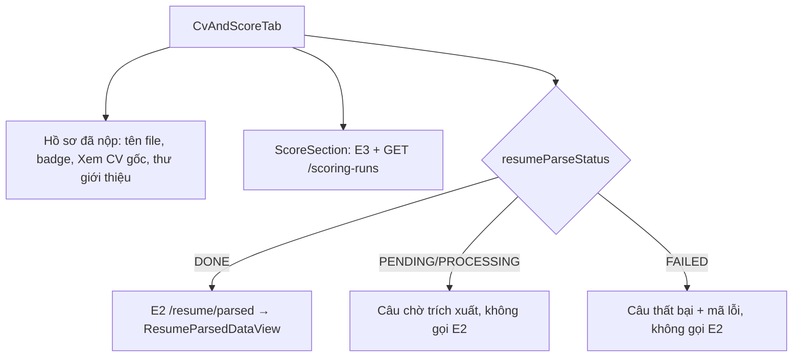

# Walkthrough — FR-H09 · Trang hồ sơ đơn ứng tuyển

Nhánh: `feat/fr-h09-application-detail` · 7 đợt · 06–07/10/2026

## 1. Mục tiêu

Trước FR-H09, HR chỉ xem được một đơn ứng tuyển qua một Sheet trượt ra từ bảng ứng viên của từng tin
tuyển dụng; Sheet chỉ có điểm và báo cáo AI, không có CV đã trích xuất, thư giới thiệu hay lịch sử trạng
thái. FR-H09 thay Sheet đó bằng một trang riêng `/hr/applications/:id` gom mọi thứ về một đơn: tải CV
gốc, đọc thư giới thiệu, đọc CV đã trích xuất, xem điểm từng tiêu chí kèm trích dẫn, xem báo cáo giải
thích, xem lịch sử chuyển trạng thái, bấm chấm điểm, và ra quyết định Mời phỏng vấn / Từ chối / Trúng
tuyển. Trang chỉ hiển thị kết quả đã lưu; không gọi AI, không tự tạo lượt chấm. Đây cũng là "khung" để
các FR sau (H10, H13, C06, C08, H15) tự thêm tab/nút của mình.

## 2. Các file đã tạo/sửa

**Backend**

| File | Vai trò |
|---|---|
| `jobapplication/HrApplicationAccess.java` (mới) | Nạp đơn có kiểm quyền dùng chung cho E1, E3, E4, E5: công ty của HR → đơn → Job của đơn |
| `jobapplication/ApplicationHrDetailController.java` (mới) | 4 endpoint `GET /api/hr/applications/{id}`, `/scores`, `/explanation`, `/history` |
| `jobapplication/ApplicationHrDetailService.java` (mới) | Dựng response E1, E3, E4, E5 |
| `jobapplication/ApplicationEvaluation.java` (mới) | Kết quả chấm của một đơn (lượt DONE mới nhất, tổng điểm, hạng, tiêu chí, giải thích) |
| `jobapplication/dto/ApplicationHrDetailResponse`, `ApplicationScoresResponse`, `ApplicationExplanationResponse` (mới) | DTO của E1, E3, E4 |
| `jobapplication/ApplicationOwnerService.java` | Tách phần xếp hạng thành `rankApplications(Job)`, thêm `evaluateApplication` |
| `jobapplication/ApplicationService.java` | `toHistoryResponse` thành dùng chung cho lịch sử phía ứng viên và phía HR |
| `resume/ResumeParsedDataResponseMapper.java` (mới) | Map CV đã trích xuất sang DTO, dùng chung hai phía |
| `resume/ResumeService.java`, `ResumeHrService.java`, `ResumeHrController.java` | Phía ứng viên dùng mapper mới; thêm E2 `GET .../resume/parsed` cho HR |
| `notification/NotificationContentBuilder.java`, `NotificationEventListener.java` | Ba thông báo HR mới trỏ `/hr/applications/{id}` |
| `db/seed/seed-test.sql` | Chỉ sửa comment mục 13 (thông báo seed cố ý giữ link cũ) |

**Frontend**

| File | Vai trò |
|---|---|
| `pages/HrApplicationDetailPage.tsx` (mới) | Trang: đọc `:id`, `?tab=`, gọi E1, dựng đầu trang + 3 tab |
| `features/applicationDetail/api.ts`, `queries.ts`, `types.ts` (mới) | Gọi E1–E5, hook TanStack Query, danh sách query cần làm mới |
| `features/applicationDetail/ApplicationDetailHeader.tsx`, `ApplicationActionBar.tsx` (mới) | Đầu trang, thanh thao tác FR-H07 |
| `features/applicationDetail/CvAndScoreTab.tsx`, `CoverLetterBlock.tsx`, `ScoreSection.tsx` (mới) | Tab "CV & điểm" |
| `features/applicationDetail/ExplanationTab.tsx`, `HistoryTab.tsx` (mới) | Tab "Giải thích", "Lịch sử" |
| `features/applications/ApplicationStatusConfirmDialog.tsx` (mới) | Hộp xác nhận Từ chối/Trúng tuyển, chuyển nguyên văn từ `ApplicationsTab` |
| `features/resumes/ResumeParsedDataView.tsx` (mới) | Phần thân hiển thị CV đã trích xuất, tách từ `ResumeParsedDataDialog` |
| `features/scoring/downloadApplicationResume.ts` (mới) | Tải CV gốc dạng blob, dùng chung danh sách và trang |
| `features/applications/ApplicationHistoryTimeline.tsx` | Chỉ còn hiển thị, nhận dữ liệu qua prop |
| `features/interviewinvitation/InterviewInvitationDialog.tsx`, `queries.ts` | Prop tối thiểu `{id, candidateName}` + query cần làm mới |
| `features/scoring/queries.ts` | Mutation nhận thêm query cần làm mới; `useScoringRunsQuery` có tuỳ chọn `untilFinal` |
| `features/scoring/ApplicationsTab.tsx` | Bỏ Sheet và hai hộp thoại; "Xem hồ sơ" thành liên kết |
| `features/candidates/CandidatesTable.tsx` | Thêm liên kết "Xem hồ sơ" |
| `features/scoring/CriterionScoreBreakdown.tsx`, `ExplanationReport.tsx` | Xếp dọc dưới `sm`; bỏ lề ngoài của Sheet cũ |
| `lib/score.ts`, `lib/date.ts`, `App.tsx` | `formatTotalScore`, hàm định dạng ngày, route mới |

## 3. Luồng chính

### 3.1 Mở trang (E1 rồi từng tab)

1. HR bấm "Xem hồ sơ" ở tab Ứng viên của tin, ở `/hr/candidates`, hoặc bấm thông báo mới. React Router
   khớp route `/hr/applications/:id` nằm trong nhóm `ProtectedRoute(HR)` + `RequireCompany` (`App.tsx`).
2. `HrApplicationDetailPage` đọc `?tab=` (lạ → `cv`) và gọi `useApplicationHrDetailQuery` →
   `GET /api/hr/applications/{id}`.
3. Backend: filter chain chặn mọi `/api/hr/**` không phải role HR (403). `ApplicationHrDetailController.getDetail`
   lấy `ownerId` từ JWT, gọi `ApplicationHrDetailService.getDetail` → `HrApplicationAccess.loadOwned`:
   tìm công ty của HR trong `companies` (không có → 404 `COMPANY_NOT_FOUND`), tìm đơn trong
   `job_applications` (không có → 404 `APPLICATION_NOT_FOUND`), tìm Job trong `jobs` và so `company_id`
   (khác → `AccessDeniedException` → 403 `FORBIDDEN`). Sau đó đọc `resumes` (trạng thái trích xuất,
   tên file) và `users` (tên ứng viên), trả `ApplicationHrDetailResponse` kèm `cover_letter` nguyên văn.
4. Frontend: 400/403/404 → câu "Không tìm thấy đơn ứng tuyển.", không render tab nào nên không gọi
   E2–E5. Lỗi khác → "Không tải được hồ sơ đơn ứng tuyển." + "Thử lại".
5. Có dữ liệu → đầu trang (`ApplicationDetailHeader`) + `Tabs`. Radix chỉ render tab đang mở, nên mỗi
   tab chỉ gọi API của mình khi được mở. Đổi tab ghi `?tab=` bằng `replace`.

### 3.2 Tab "CV & điểm"

- **E2**: `ResumeHrController.getParsedData` → `ResumeHrService.getParsedDataForApplication` kiểm quyền
  bằng `loadOwnedApplication` có sẵn, đọc `resume_parsed_data` theo **`job_applications.resume_id`**
  (CV đã nộp, không phải CV chính hiện tại), map qua `ResumeParsedDataResponseMapper` — cùng mapper
  phía ứng viên, nên hai phía nhận cùng một JSON.
- **E3**: `ApplicationHrDetailService.getScores` → `HrApplicationAccess.loadOwned` →
  `ApplicationOwnerService.evaluateApplication(job, id)`. Method này gọi `rankApplications(job)`: nạp
  mọi đơn của tin (`job_applications`), lượt chấm mới nhất và lượt DONE mới nhất của từng đơn
  (`scoring_runs`), điểm tiêu chí (`criterion_scores`, thứ tự theo `rubric_snapshot` của lượt đó), giải
  thích và số lần thử (`score_explanations`, `score_explanation_attempts`), rồi gán hạng 1-2-2-4 bằng
  `assignRanks`. Lấy đúng dòng của đơn này, trả `scoringRunId`, `scoredAt`, `totalScore`, `rank`,
  `criterionScores`.
- **Tiến độ**: `ScoreSection` gọi `useScoringRunsQuery(id, true, { untilFinal: true })` →
  `GET /scoring-runs` có sẵn, poll 5 giây/lần tới khi lượt mới nhất DONE/FAILED (dừng sau 10 phút + nút
  "Tải lại"). Khi lượt mới nhất đổi trạng thái, trang làm mới E1, E3, E4 (R-T14).
- **Chấm điểm**: nút luôn hiện; khoá và câu lý do lấy từ `scoringDisabledReason` (CV đã DONE chưa, có
  lượt đang chạy không). Bấm → `POST /scoring-runs` có sẵn (job nền chấm sau).

### 3.3 Tab "Giải thích" và "Lịch sử"

- **E4**: `getExplanation` dùng **cùng** `evaluateApplication` với E3, trả `scoringRunId`, `scoredAt`,
  `explanationStatus` (PENDING/FAILED theo số lần thử so với `app.explanation.max-attempts`) và
  `explanation`. Frontend: chưa có lượt DONE → câu R-T8; PENDING → nút "Tải lại" (không tự poll).
- **E5**: `getHistory` đọc `application_status_history` theo `changed_at` tăng dần, map bằng
  `ApplicationService.toHistoryResponse` (cùng DTO phía ứng viên, không có `changed_by`). Frontend truyền
  vào `ApplicationHistoryTimeline`.

### 3.4 Ra quyết định

`ApplicationActionBar` hiện nút theo đúng máy trạng thái FR-H07 (PENDING → Mời phỏng vấn/Từ chối;
INTERVIEW_INVITED → Trúng tuyển/Từ chối; trạng thái cuối → một dòng chữ). Mời phỏng vấn mở
`InterviewInvitationDialog` (`POST /interview-invitation`); Từ chối/Trúng tuyển mở
`ApplicationStatusConfirmDialog` (`PATCH /status`). Hai endpoint này không đổi. Thành công → làm mới
E1, E3, E4, E5, lượt chấm của đơn, danh sách theo Job, `/hr/candidates` (`applicationDetailInvalidateKeys`),
rồi focus về badge trạng thái.

## 4. Quyết định thiết kế

**403 thay vì 404 cho đơn của công ty khác.** Đã chọn: đơn tồn tại nhưng thuộc công ty khác → 403
`FORBIDDEN`. Lựa chọn khác: 404 để không lộ việc đơn tồn tại. Vì sao: cả 5 endpoint có sẵn của nhóm
`/api/hr/applications/{id}/**` (`ScoringRunService`, `ApplicationStatusService`,
`InterviewInvitationService`, `ResumeHrService`, `ScoringRunAuditService`) đều trả 403, và
`ResumeHrService` ghi rõ đây là lựa chọn có chủ đích. Nếu endpoint mới trả 404 thì cùng một đơn sẽ cho
hai kết quả khác nhau tuỳ tab. `HrApplicationCrossEndpointAccessIntegrationTest` khoá 9 endpoint (mới và
cũ) cùng trả 403; **không xoá test này khi refactor** vì nó bảo vệ cả endpoint của FR-H04/H06/H07. UUID
lạ vẫn là 404. Frontend hiện cùng một câu cho 400/403/404 (R-T13).

**Q1 — một công thức xếp hạng duy nhất.** Đã chọn: tách phần dựng dòng và xếp hạng của danh sách theo
Job thành `rankApplications(Job)`; danh sách và E3/E4 cùng gọi nó. Lựa chọn khác: viết truy vấn riêng
lấy điểm của một đơn và tính hạng bằng `COUNT(*) WHERE total_score > ...`. Vì sao: FR-H05 yêu cầu hạng
do Backend tính bằng công thức tường minh; hai công thức sẽ lệch nhau ở trường hợp hoà điểm (1-2-2-4)
hay đơn chưa chấm. Đánh đổi: mỗi lần gọi E3/E4 nạp cả danh sách đơn của tin (số câu truy vấn cố định,
không N+1). Bộ test cũ `ApplicationOwnerServiceTest`/`ApplicationOwnerControllerIntegrationTest` giữ
nguyên assertion và vẫn xanh; T8 (`getScores_rankEqualsJobListRank_includingTiesAndUnscored`) so hạng
của E3 với hạng trong danh sách.

**Không ghi chú "CV đã được trích xuất lại sau lượt chấm".** Bản nháp đặc tả từng có ghi chú này. Đã
bỏ vì nó sai sự thật: chấm điểm chỉ đọc `resume_parsed_data.raw_text` (`ScoringRunOrchestrator.doProcess`,
dòng 73-76), còn trích xuất lại ghi đè dữ liệu đã trích xuất nhưng giữ nguyên `raw_text`
(`ResumeReparseStateService`). Điểm và
evidence vì vậy không phụ thuộc lần trích xuất lại; cảnh báo sẽ làm HR nghi ngờ điểm vô cớ.

**Thêm `scoredAt` vào E4 sau khi đặc tả đã duyệt.** Khi code tab Giải thích (đợt 5) phát hiện UI.md
yêu cầu câu "Báo cáo của lượt chấm hoàn tất ngày …" nhưng E4 đã duyệt không có ngày; ngày chỉ có ở E3,
mà mỗi tab chỉ được gọi API của mình. Ba lựa chọn: thêm `scoredAt` vào E4; cho tab Giải thích gọi thêm
E3 (thêm một lượt nạp cả danh sách đơn); bỏ câu ngày. Người dùng chọn thêm vào E4: ngày lấy từ cùng
`evaluateApplication` nên luôn cùng lượt với báo cáo. Đã sửa REQUIREMENT.md mục 4 và T9, duyệt lại
06/10/2026.

**Tuỳ chọn `untilFinal` của `useScoringRunsQuery`.** Điều kiện poll cũ dừng ngay khi lượt có
`finishedAt` — tức lúc lượt còn RUNNING chờ D3 tổng hợp điểm. Danh sách theo Job không bị ảnh hưởng vì
có vòng poll danh sách bên ngoài (dựa vào `totalScore === null`); trang chi tiết thì không, nên sẽ kẹt ở
badge "Đã chấm xong, đang chờ tổng hợp". Đã chọn: thêm tuỳ chọn, mặc định `false`, trang bật `true` để
poll tới DONE/FAILED. Lựa chọn khác: đổi điều kiện cho mọi nơi (làm các dòng bảng poll lâu hơn) hoặc
viết vòng poll riêng ở trang (trùng logic chặn 10 phút).

**"Xem CV gốc" luôn bấm được ở trang này, khác danh sách.** Danh sách theo Job khoá nút khi CV chưa
DONE — lựa chọn UX cũ, không phải ràng buộc kỹ thuật (file gốc lưu từ lúc upload). Ở trang chi tiết,
khi CV đang chờ hay trích xuất lỗi, file gốc là cách duy nhất để HR đọc CV, nên R-V1 yêu cầu luôn mở.
Logic tải blob tách ra `downloadApplicationResume.ts` để hai nơi dùng chung; điều kiện khoá nằm ở nơi
gọi (R-C4).

**Thư giới thiệu.** Đây là lời của ứng viên, không phải AI: hiện dạng văn bản thuần (`whitespace-pre-wrap
break-words`, React tự escape, không `dangerouslySetInnerHTML`), không trim/cắt, không đặt trong khối
"Do AI tạo" hay kiểu evidence. Thu gọn 6 dòng; nút "Xem thêm" chỉ hiện khi thật sự bị cắt (đo
`scrollHeight > clientHeight` trong `ResizeObserver`). Không có nội dung → không hiện tiêu đề.

**Tách component thay vì viết lại.** `ApplicationHistoryTimeline` gọi cứng hook phía ứng viên (HR gọi sẽ
bị 403) nên được tách thành phần chỉ hiển thị; `ResumeParsedDataDialog` tách phần thân thành
`ResumeParsedDataView`. Mục tiêu là màn hình ứng viên giữ nguyên giao diện; đợt 4 chỉ kiểm bằng build/lint
và đối chiếu code đã chuyển nguyên văn, **chưa soát tay** — người dùng soát sau khi commit đợt 7.

## 5. Ràng buộc đã thực thi

| Mã | Ràng buộc | Thực thi ở đâu |
|---|---|---|
| R-Q1–Q3 | Chỉ HR, đúng công ty; 404/403 theo quy ước nhóm route | `SecurityConfig` (`/api/hr/**`), `HrApplicationAccess.loadOwned`, `ResumeHrService.loadOwnedApplication` |
| R-Q4 | Endpoint cũ không đổi, cùng 403 | Không sửa service cũ; `HrApplicationCrossEndpointAccessIntegrationTest` |
| R-D2 | CV của đúng đơn, không thêm field, không `raw_text` | `ResumeHrService.getParsedDataForApplication`, `ResumeParsedDataResponseMapper` |
| R-D3–D6 / FR-H05 | Điểm từ lượt DONE mới nhất, một công thức hạng, giải thích cùng lượt | `ApplicationOwnerService.rankApplications` / `evaluateApplication` |
| R-D7 | Lịch sử tăng dần, không `changed_by` | `findByApplicationIdOrderByChangedAtAsc`, `ApplicationService.toHistoryResponse` |
| CLAUDE.md §7 | Không field `verdict/label/isQualified/passed/recommendation` | DTO E1/E3/E4; test T11 |
| R-S1–S5 | Nút chấm luôn hiện, khoá theo `scoringDisabledReason`, không tự tạo lượt | `ScoreSection` |
| R-T14 | Không tự poll giải thích; làm mới khi lượt chấm đổi trạng thái | `useApplicationExplanationQuery` (không `refetchInterval`), effect trong `ScoreSection` |
| R-A1–A5 | Nút theo trạng thái đơn, hộp thoại có sẵn, làm mới đủ query | `ApplicationActionBar`, `applicationDetailInvalidateKeys` |
| R-V1 | "Xem CV gốc" không khoá | `CvAndScoreTab.SubmittedResumeSection` |
| R-L | Thư giới thiệu văn bản thuần | `CoverLetterBlock` |
| R-P3, R-C2 | Bỏ Sheet, nút quyết định chỉ còn ở trang | `ApplicationsTab` |
| R-N1–N4 | Thông báo HR mới trỏ trang; thông báo cũ giữ link | `NotificationContentBuilder` (không migration) |
| CLAUDE.md §8, R-G | Không màu/nhãn phán quyết; tổng điểm trong khung tiêu chí | `ScoreSection` (một màu một cỡ), `CriterionScoreBreakdown` |

## 6. Đã kiểm thử gì

**Backend tự động** — `.\mvnw.cmd test` toàn bộ suite (07/10/2026): **803/803 pass, BUILD SUCCESS**
(lần chạy thứ hai). 33 test mới của FR-H09: 22 ở `ApplicationHrDetailControllerIntegrationTest`, 1 ở
`HrApplicationCrossEndpointAccessIntegrationTest`, 6 thêm vào `ResumeHrControllerIntegrationTest`, 4 thêm
vào `NotificationEventListenerIntegrationTest`. Lần chạy đầu đỏ 3 test của chính FR-H09
(`getDetail_otherCompanyApplication_returns403`, `getHistory_otherCompanyApplication_returns403`,
`getDetail_candidateToken_returns403`): prefix email trong helper quá dài, phần trước `@` vượt 64 ký tự
nên đăng ký bị 400. Sửa bằng prefix ngắn hơn, không đổi assertion.

**Frontend** — `npm run build`, `npm run lint` sạch; 5 lệnh rg ở REQUIREMENT mục 7.3 (chạy bằng công cụ
tìm kiếm tương đương vì máy không có `rg`) đều đạt.

**Kiểm bằng HTTP (mục 7.2)** — chạy thật nguyên khối PowerShell trên DB local có cả seed demo và seed
test (07/10/2026). Lần đầu mã HTTP đúng nhưng hàm `Test-Get` không in được thân lỗi 401/403 trên
PowerShell 5.1; đã sửa hàm (đọc `$_.ErrorDetails.Message` trước), duyệt 07/10/2026, chạy lại: khớp
"Mong đợi" cả mã HTTP lẫn thân lỗi ở 6 nhóm — 200×5; 403×5 `FORBIDDEN`; 403 `FORBIDDEN`; 404×5
`APPLICATION_NOT_FOUND`; 403 `FORBIDDEN`; 401 `UNAUTHENTICATED`.

**Soát tay** — **chưa làm**, cả hai phần: (1) màn hình cũ bị chạm ở đợt 4 (lịch sử đơn phía ứng viên,
hộp thoại CV đã trích xuất, tab Ứng viên của trang sửa Job, `/hr/candidates`) theo bảng "Màn hình cũ bị
chạm" của báo cáo đợt 4; (2) bảng soát tay mục 7.4 (trang mới, desktop và 375px). Người dùng soát sau khi
commit đợt 7.

**Chưa test:** frontend không có test tự động; giải thích `FAILED` và thư giới thiệu nhiều dòng không có
trong seed (chỉ T9/T14 phủ ở backend); luồng "Chấm ngay trên trang" gọi Anthropic thật chưa chạy.

| "Xong khi" | Cách nghiệm thu | Kết quả |
|---|---|---|
| T1 E1 đúng dữ liệu, thư nguyên văn | `getDetail_ownCompanyApplication_returnsHeaderFields`, `getDetail_noCoverLetter_returnsNull` (ApplicationHrDetailControllerIntegrationTest) | Đạt |
| T2 E1–E5 403/404 | `getDetail_otherCompanyApplication_returns403`, `getDetail_nonExistentApplication_returns404`, `getHistory_otherCompanyApplication_returns403`, `getHistory_nonExistentApplication_returns404`, `getScoresAndExplanation_otherCompanyOrMissing_returns403Or404`, `parsedForApplication_byHrOfAnotherCompany_returns403`, `parsedForApplication_applicationNotFound_returns404` | Đạt |
| T3, T4 ứng viên 403, không token 401, HR chưa có công ty 404 | `getDetail_candidateToken_returns403`, `getDetail_noToken_returns401`, `getDetail_hrWithoutCompany_returns404CompanyNotFound` | Đạt |
| T5 E2 trùng phía ứng viên | `parsedForApplication_resumeDone_matchesCandidateEndpointResponse` | Đạt |
| T6 CV đã nộp, không phải CV chính | `parsedForApplication_candidateChangedPrimaryAfterApplying_returnsAppliedResume` | Đạt |
| T7 điểm từ lượt DONE | `getScores_noScoringRun_*`, `getScores_onlyFailedRun_*`, `getScores_doneRunThenNewerFailedRun_*` | Đạt |
| T8 hạng bằng danh sách | `getScores_rankEqualsJobListRank_includingTiesAndUnscored` | Đạt |
| T9 biên 2/3/4 lần thử, cùng lượt + `scoredAt` | `getExplanation_attemptsBelowAtAndAboveMax_*`, `getExplanation_withExplanation_*` | Đạt |
| T10 lịch sử tăng dần | `getHistory_ordersByChangedAtAscending` (backdate bằng native UPDATE), `getHistory_newApplication_returnsSubmittedEntry` | Đạt |
| T11 không field phán quyết | `getDetail_responseHasNoVerdictLikeFields`, `getScoresAndExplanation_responsesHaveNoVerdictLikeFields` | Đạt |
| T12 link thông báo | `apply_/withdraw_/aggregationFinished_hrNotificationLinksToApplicationDetailPage`, `changeStatus_candidateNotificationLinkUnchanged` (NotificationEventListenerIntegrationTest) | Đạt |
| T13 9 endpoint cùng 403 | `otherCompanyHr_allApplicationDetailEndpointsNewAndExisting_return403` | Đạt |
| T14 thư nhiều dòng nguyên văn | `getDetail_multilineCoverLetterWithHtml_returnsVerbatim` | Đạt |
| 7.2 khối PowerShell | chạy lại nguyên khối sau khi sửa `Test-Get`, 07/10/2026 | Đạt (mã HTTP và thân lỗi khớp ở 6 nhóm) |
| 7.3 lệnh rg | chạy 07/10/2026 | Đạt |
| 7.4 soát tay (và soát màn hình cũ của đợt 4) | người dùng, sau khi commit đợt 7 | Chưa |

## 7. Nợ kỹ thuật

- API danh sách theo Job vẫn trả `criterionScores`/`explanation` dù danh sách không còn hiển thị.
- E3 và E4 mỗi lần gọi nạp cả danh sách đơn của tin.
- Id sai định dạng trả 400 mặc định của Spring, body chưa chuẩn hoá.
- Thư giới thiệu không giới hạn độ dài.
- Máy dev không có `rg` trong PATH.
- Frontend chưa có test tự động.
- Helper `uniqueEmail` ở các lớp test dùng mẫu `prefix-UUID` có thể vượt 64 ký tự trước `@` nếu prefix dài.
- Ngày hiển thị theo giờ trình duyệt, chưa cố định múi giờ Việt Nam.
- `nextActionsFor` từng tồn tại hai bản trong đợt 5; đợt 6 đã xoá bản ở `ApplicationsTab`, nay chỉ còn ở
  `ApplicationActionBar` — không còn nợ, ghi lại để giải thích lịch sử commit.

## 8. Lệch so với đặc tả

| Chỗ lệch | Đặc tả đã sửa? | Duyệt lại |
|---|---|---|
| E4 thêm `scoredAt` (REQUIREMENT mục 4, dòng T9) | Đã sửa ở đợt 5 | Đã duyệt 06/10/2026 |
| `useScoringRunsQuery` thêm tuỳ chọn `untilFinal` (UI.md 5b chỉ nói "dùng đúng hook") | Không cần sửa đặc tả — mở rộng không đổi hành vi cũ | Người dùng duyệt cùng đợt 5, 06/10/2026 |
| `TabLoadError`/`SectionSkeleton` đặt trong `ScoreSection.tsx`; hàm ngày ở `lib/date.ts` để giữ đúng 10 file của UI.md 5a | Không cần | Duyệt cùng đợt 5 |
| Mục 7.2: hàm `Test-Get` đọc `$_.ErrorDetails.Message` trước, rỗng mới đọc luồng response | Đã sửa ở đợt 7 | Đã duyệt 07/10/2026 |
