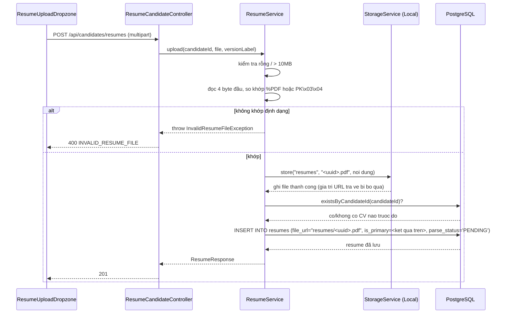
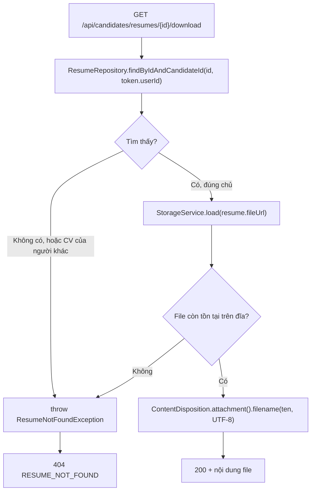
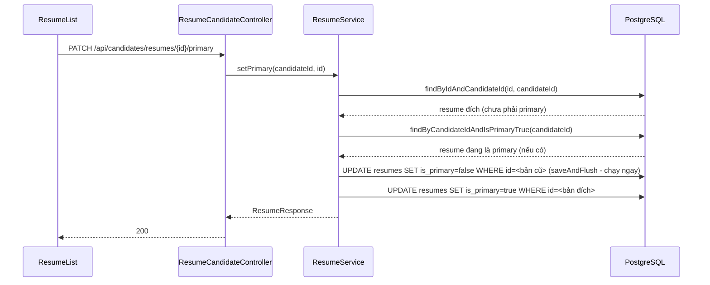

# FR-U01 — Hồ sơ cá nhân & Upload CV

Phạm vi: 1 commit (`3732cac`, "feat(fr-u01): ho so ca nhan + upload nhieu phien ban CV") trên nhánh
`feat/fr-u01-resume`, nằm chồng trên Phase A + Phase B đã merge (`1d2df62`).

## 1. Mục tiêu

FR-U01 cho ứng viên hai việc: sửa vài thông tin nhân khẩu học cơ bản (chức danh mong muốn, khu
vực, vị trí hiện tại, số năm kinh nghiệm, ngày sinh), và tải lên nhiều phiên bản CV (PDF/DOCX),
đánh dấu một bản là "CV chính". Nhánh này **không** đọc nội dung CV — việc trích xuất text/JSON từ
file (AI Resume Parsing) là FR-C04, làm ở nhánh sau (`feat/fr-c04-parsing`). Ở đây, mỗi CV upload
xong chỉ được đánh dấu `parse_status = PENDING` và nằm chờ.

Hai ràng buộc khó nhất của nhánh không phải là CRUD, mà là **bảo mật file** (CV là dữ liệu cá
nhân, không được lộ qua URL tĩnh như logo công ty) và **tính đúng đắn của cờ "CV chính"** (đúng một
bản `is_primary = true` tại mọi thời điểm, kể cả khi nhiều request chạy gần nhau).

## 2. Các file đã tạo/sửa

### Backend

| File | Vai trò |
|---|---|
| `db/migration/V3__resume_primary_unique.sql` | Thêm unique index có điều kiện: tại một thời điểm, mỗi candidate chỉ có tối đa 1 CV `is_primary = true` |
| `resume/Resume.java` | Entity ánh xạ bảng `resumes` (đã có sẵn từ `V1`) |
| `resume/ResumeFileType.java`, `ParseStatus.java` | Enum khớp 2 cột `CHECK` của bảng `resumes` |
| `resume/ResumeRepository.java` | Truy vấn theo `candidate_id`, tìm bản đang `is_primary`, kiểm tra đã có CV nào chưa |
| `resume/ResumeService.java` | Toàn bộ nghiệp vụ: upload (validate magic bytes, size), đặt CV chính, tải CV về |
| `resume/ResumeCandidateController.java` | 4 endpoint dưới `/api/candidates/resumes` |
| `resume/ResumeDownload.java` | Record nội bộ gói `(Resource, tên file, content-type)` cho endpoint tải CV |
| `resume/dto/ResumeResponse.java` | DTO trả ra — cố tình không có `fileUrl` |
| `storage/StorageService.java` (sửa) | Thêm `load(key)` — đọc lại file theo key nội bộ, khác với `store()`/`delete()` vốn dùng URL public |
| `storage/LocalStorageService.java` (sửa) | Cài `load()`, có guard chống path traversal |
| `storage/StorageWebConfig.java` (sửa) | Thu hẹp resource handler tĩnh từ `/uploads/**` xuống `/uploads/logos/**` |
| `auth/SecurityConfig.java` (sửa) | Thu hẹp `permitAll()` tương ứng xuống `/uploads/logos/**` |
| `common/exception/InvalidResumeFileException.java`, `ResumeNotFoundException.java` | Exception nghiệp vụ mới |
| `common/exception/GlobalExceptionHandler.java` (sửa) | 3 handler mới: file CV không hợp lệ (400), không tìm thấy CV (404), file vượt giới hạn multipart của servlet (400) |
| `user/CandidateProfileRepository.java` (sửa) | Thêm `findByUserId` |
| `user/CandidateProfileService.java` | Đọc/sửa hồ sơ, tự tạo hàng nếu thiếu |
| `user/CandidateProfileController.java` | 2 endpoint dưới `/api/candidates/profile` |
| `user/dto/CandidateProfileRequest.java`, `CandidateProfileResponse.java` | DTO vào/ra |
| `test/resume/ResumeIntegrationTest.java` | 8 test tích hợp qua `MockMvc` + Postgres thật, mirror cấu trúc `CompanyOwnerIntegrationTest` |

### Frontend

| File | Vai trò |
|---|---|
| `features/candidateProfile/api.ts`, `queries.ts`, `types.ts` | Gọi API `/candidates/profile/me`, quản lý cache bằng TanStack Query |
| `features/resumes/api.ts`, `queries.ts`, `types.ts` | Gọi API `/candidates/resumes/*`, bao gồm tải file dạng `blob` |
| `features/resumes/resumeLabels.ts` | Nhãn + màu badge cho `parse_status`, chỉ dùng token đã khai trong `index.css` |
| `features/resumes/ResumeUploadDropzone.tsx` | Vùng kéo-thả CV, validate nhẹ phía client trước khi gọi API |
| `features/resumes/ResumeList.tsx` | Bảng danh sách CV: badge trạng thái, nút đặt CV chính, nút tải xuống |
| `pages/CandidateProfilePage.tsx` | Trang gộp 2 khối: form hồ sơ cá nhân + khu vực CV |
| `pages/CandidateHomePage.tsx` (sửa) | Thêm link sang `/candidate/profile` |
| `App.tsx` (sửa) | Thêm route `/candidate/profile` |

## 3. Luồng chính

### Luồng 1 — Upload CV (bản đầu tiên tự động là CV chính)

Điểm khác biệt với upload logo công ty (FR-H01) đã có sẵn trong codebase: `StorageService.store()`
trả về URL public dạng `/uploads/logos/xxx.png` và `CompanyOwnerService` lưu thẳng giá trị đó vào
DB. Ở đây, `ResumeService` **bỏ qua** giá trị `store()` trả về và tự dựng chuỗi
`"resumes/" + filename"` để lưu vào `file_url` — vì CV không được có URL truy cập trực tiếp.

### Luồng 2 — Tải CV về (kiểm tra quyền sở hữu, trả 404 nếu sai chủ)

Cố tình dùng **404**, không phải 403 như `CompanyOwnerService.loadOwned()` đang dùng cho logo công
ty — vì phân biệt được "CV này không tồn tại" với "CV này tồn tại nhưng không phải của bạn" (403)
sẽ để lộ thông tin rằng một `resumeId` cụ thể có tồn tại trong hệ thống hay không.

### Luồng 3 — Đặt một CV khác làm CV chính

Thứ tự "tắt cờ cũ trước, `flush` ngay, rồi mới bật cờ mới" là bắt buộc: `V3` đã thêm unique index
có điều kiện (`WHERE is_primary`), Postgres kiểm tra ràng buộc này ngay sau mỗi câu `UPDATE`
(không phải cuối transaction, vì đây không phải constraint kiểu `DEFERRABLE`). Nếu bật cờ mới
trước khi tắt cờ cũ, sẽ có một khoảnh khắc 2 dòng cùng `is_primary = true` → vi phạm unique index
→ lỗi 500 giữa chừng.

### Luồng 4 — Xem/sửa hồ sơ cá nhân (không bao giờ trả 404/500 vì thiếu hàng)

`CandidateProfile` đã được tạo sẵn (rỗng) ngay lúc đăng ký ở FR-C01
(`AuthService.registerCandidate`). `CandidateProfileService.getMine()`/`update()` đều đi qua
`loadOrCreate()` — nếu vì lý do nào đó hàng không tồn tại (không nên xảy ra trong luồng bình
thường), service tự tạo một hàng trống rồi trả về thay vì ném lỗi. `GET /api/candidates/profile/me`
vì vậy luôn trả 200, không có khái niệm "chưa có hồ sơ" như `CompanyOwnerService` (nơi 404 là trạng
thái hợp lệ, vì công ty phải do HR chủ động tạo).

## 4. Quyết định thiết kế

**`file_url` lưu key nội bộ (`resumes/<uuid>.pdf`), không lưu URL public**
- Đã chọn: `ResumeService` tự dựng chuỗi key, bỏ qua giá trị `StorageService.store()` trả về.
- Lựa chọn khác: dùng thẳng giá trị `store()` trả về, giống hệt cách `CompanyOwnerService` lưu
  `logo_url`.
- Vì sao: logo công ty là dữ liệu công khai (phục vụ FR-C02), CV là dữ liệu cá nhân. Một URL public
  cố định nghĩa là bất kỳ ai đoán được đường dẫn đều tải được CV người khác — vi phạm thẳng vào
  ràng buộc bảo mật file đã đặt ra khi giao việc.

**Thu hẹp `StorageWebConfig`/`SecurityConfig` từ `/uploads/**` xuống `/uploads/logos/**`, thêm
`StorageService.load()` thay vì viết storage class mới**
- Đã chọn: mở rộng interface `StorageService` có sẵn từ FR-H01 với một method đọc file
  (`Optional<Resource> load(String key)`), `ResumeCandidateController` chỉ phụ thuộc
  `StorageService`, không inject thẳng `LocalStorageService`.
- Lựa chọn khác: inject thẳng `LocalStorageService` (class cụ thể) vào `ResumeService` để dùng
  `getBasePath()` tự dựng `Path` đọc file, không đụng vào interface.
- Vì sao: nếu sau này thêm implementation thứ hai của `StorageService` (ví dụ MinIO, đã nhắc tới
  như nợ kỹ thuật ở walkthrough FR-H01), `ResumeService` sẽ phải sửa lại để inject implementation
  cụ thể đó — trong khi phụ thuộc vào interface thì không cần sửa gì. `load()` dùng địa chỉ key nội
  bộ (không tiền tố `/uploads/`), khác với `store()`/`delete()` dùng địa chỉ public URL — đã ghi rõ
  trong Javadoc của interface để tránh nhầm lẫn giữa 2 kiểu địa chỉ.

**404 khi tải CV sai chủ, không phải 403 như logo công ty**
- Đã chọn: `ResumeService.downloadMine()` ném `ResumeNotFoundException` (404) cả khi CV không tồn
  tại lẫn khi CV tồn tại nhưng thuộc candidate khác — dùng chung một câu query
  `findByIdAndCandidateId(id, candidateId)` nên tầng service không phân biệt được (và không cần
  phân biệt) hai trường hợp này.
- Lựa chọn khác: copy nguyên pattern `CompanyOwnerService.loadOwned()` — tìm theo id trước, rồi so
  `ownerId`, ném `AccessDeniedException` (403) nếu sai chủ.
- Vì sao: 403 xác nhận "tài nguyên này tồn tại nhưng bạn không có quyền" — với công ty thì không
  sao vì `companyId` không phải bí mật. Với CV, xác nhận một `resumeId` cụ thể **có tồn tại** trong
  hệ thống (dù không đọc được nội dung) vẫn là rò rỉ thông tin không cần thiết.

**CV đầu tiên của mỗi candidate tự động là CV chính**
- Đã chọn: `ResumeService.upload()` kiểm tra `!existsByCandidateId(candidateId)` ngay trước khi
  tạo bản ghi, set `isPrimary` theo kết quả đó.
- Lựa chọn khác: mọi CV upload lên đều mặc định `isPrimary = false`, bắt ứng viên tự bấm "Đặt làm
  CV chính" sau khi upload xong bản đầu tiên.
- Vì sao: nếu không tự động, một candidate mới upload đúng 1 CV sẽ không có CV nào được đánh dấu
  chính — vô lý vì rõ ràng đó là bản duy nhất họ có. Yêu cầu này không có trong đặc tả SRS gốc,
  được bổ sung khi review plan trước khi code.

**Tắt cờ `is_primary` cũ bằng `saveAndFlush()`, không dùng `save()` thường**
- Đã chọn: gọi `saveAndFlush()` cho bản ghi cũ trước khi sửa bản ghi mới trong cùng một
  `@Transactional`.
- Lựa chọn khác: gọi `save()` bình thường cho cả hai, để Hibernate tự quyết định thứ tự flush lúc
  commit.
- Vì sao: `V3` tạo unique index thường (không `DEFERRABLE INITIALLY DEFERRED`), nghĩa là Postgres
  kiểm tra ràng buộc ngay sau từng câu `UPDATE`, không đợi tới cuối transaction. Không ép flush thứ
  tự, Hibernate có thể gom cả hai `UPDATE` và gửi theo thứ tự không đảm bảo — có rủi ro lý thuyết
  vi phạm unique index giữa chừng.

**Test tích hợp mirror `CompanyOwnerIntegrationTest`, không dùng unit test thuần (mock repository)**
- Đã chọn: `ResumeIntegrationTest` dùng `@SpringBootTest` + `MockMvc` + Postgres thật (qua
  `TestcontainersConfiguration` đã có sẵn trong dự án), gọi qua HTTP thật, assert theo status code.
- Lựa chọn khác: unit test `ResumeService` với `ResumeRepository`/`StorageService` mock.
- Vì sao: giữ nhất quán với cách test đã dùng cho Company/Job/Rubric trong dự án — đặc biệt quan
  trọng với ràng buộc `uq_resume_primary_per_candidate`, vốn chỉ thật sự được kiểm chứng khi chạy
  qua Postgres thật, không thể giả lập đúng bằng mock.

**Thêm handler `MaxUploadSizeExceededException` sau khi phát hiện lỗ hổng trong lúc review**
- Đã chọn: `GlobalExceptionHandler` bắt riêng `org.springframework.web.multipart.MaxUploadSizeExceededException`,
  trả 400 `INVALID_RESUME_FILE`, dùng chung cho cả upload logo lẫn upload CV.
- Lựa chọn khác (ban đầu code trước khi bị phát hiện): không có handler riêng, tin rằng kiểm tra
  `file.getSize() > MAX_RESUME_SIZE_BYTES` trong `ResumeService` là đủ.
- Vì sao: `application.yml` đã giới hạn `max-file-size: 10MB` ở tầng servlet (Tomcat) — với request
  HTTP thật, Tomcat chặn file quá khổ **trước khi** request tới được `ResumeService`, ném ra
  `MaxUploadSizeExceededException` mà không handler nào bắt sẽ rơi về lỗi 500 mặc định thay vì 400.
  Test tích hợp `uploadOversizedFile_isRejected` dùng `MockMultipartFile` nên **không** đi qua giới
  hạn multipart thật của servlet — nó chỉ vô tình pass nhờ đúng đường kiểm tra size thủ công trong
  `ResumeService`, che giấu việc đường đi qua Tomcat thật chưa từng được test tới. Đây là lỗi được
  người dùng phát hiện khi soát code, không phải do Claude tự nhận ra.

## 5. Ràng buộc SRS đã thực thi

| FR | Ràng buộc | Thực thi ở đâu |
|---|---|---|
| FR-U01 | Chỉ nhận PDF/DOCX, kiểm bằng magic bytes chứ không tin đuôi file | `ResumeService.detectFileType()` — so khớp 4 byte đầu với `%PDF` / `PK\x03\x04` |
| FR-U01 | Giới hạn 10MB | `ResumeService.upload()` (kiểm tra thủ công) + `application.yml` (`max-file-size`, chặn ở tầng servlet) + `GlobalExceptionHandler.handleMaxUploadSizeExceeded` |
| FR-U01 | Nhiều phiên bản CV, đánh dấu một bản `is_primary` | `resumes.candidate_id` không unique (nhiều dòng); `V3__resume_primary_unique.sql` đảm bảo tối đa 1 dòng `is_primary=true` mỗi candidate |
| FR-U01 | Tạo bản ghi với `parse_status = PENDING`, chờ FR-C04 xử lý | `ResumeService.upload()` set cứng `ParseStatus.PENDING` — không có code nào trong nhánh này chuyển sang trạng thái khác |
| FR-U01 (Xong khi — PHASES.md) | File CV không nằm trong thư mục repo | `LocalStorageService` ghi ra `app.storage.local-path` (ngoài repo, đã có `.gitignore` từ FR-H01); test dùng `${java.io.tmpdir}` |
| Quy ước dự án (CLAUDE.md mục 7) | Không tạo cột/field `verdict`/`label`/`isQualified`/`passed` | Đã soát bằng skill `srs-guard` trước khi viết walkthrough này — không có vi phạm |
| Yêu cầu bổ sung của người giao việc | Không tạo endpoint xoá CV ở nhánh này | `ResumeCandidateController` chỉ có `GET`/`POST`/`PATCH` — không có `@DeleteMapping` nào |
| Yêu cầu bổ sung của người giao việc | Migration duy nhất đúng 1 dòng SQL cho trước | `V3__resume_primary_unique.sql` — không sửa `V1`/`V2`, không thêm cột nào |

## 6. Đã kiểm thử gì

**Backend** — `ResumeIntegrationTest` (8 test), chạy qua `MockMvc` + Postgres thật:
- Upload CV đầu tiên → 201, `parseStatus = PENDING`, `isPrimary = true`.
- Upload CV thứ hai → `isPrimary = false`, CV đầu vẫn giữ `isPrimary = true`.
- Upload file giả `.exe` đổi đuôi `.pdf` (sai magic bytes) → 400 `INVALID_RESUME_FILE`.
- Upload file > 10MB → 400 (**xem lỗ hổng đã sửa ở mục 4** — test này pass nhờ đường kiểm tra
  thủ công trong service, chưa từng xác nhận đường servlet thật cho tới khi thêm handler
  `MaxUploadSizeExceededException`; sau khi thêm handler, cả hai đường đều trả 400 giống nhau nên
  test hiện tại vẫn xanh nhưng **chưa được viết lại** để phân biệt hai đường này).
- `PATCH .../primary` chuyển CV chính giữa 2 bản → đúng 1 bản `isPrimary = true` sau khi chuyển.
- Tải CV bằng token của candidate khác → 404 (không phải 403).
- Tải CV đúng chủ → 200.
- `GET /api/candidates/profile/me` ngay sau đăng ký (chưa từng `PUT`) → 200, không 500.

Toàn bộ suite backend (`./mvnw test`) chạy xanh: **63/63 test pass** (bao gồm test có sẵn từ Phase
A và B), xác nhận lần cuối sau khi thêm handler `MaxUploadSizeExceededException`.

**Frontend** — `npm run lint` và `npm run build` (`tsc -b && vite build`) đều sạch.

**Chưa test / chưa xác nhận**:
- **Chưa test tay trên trình duyệt thật.** Toàn bộ luồng upload kéo-thả, đặt CV chính, tải CV về,
  sửa hồ sơ cá nhân — chỉ được xác nhận qua lint/build/test tự động, chưa có ai thao tác qua UI
  thật để xem giao diện, thông báo lỗi, và trạng thái tải hiển thị đúng hay không.
- **Chưa test file DOCX thật** — cả test tự động lẫn (nếu có) test tay đều mới dùng nội dung giả
  lập bắt đầu bằng magic bytes `%PDF`; chưa upload một file `.docx` thật (magic bytes `PK\x03\x04`)
  để xác nhận `ResumeFileType.DOCX` được nhận diện đúng qua toàn bộ luồng, kể cả khi tải về
  (`Content-Type` DOCX).
- **Chưa xác nhận `Content-Disposition` với tên file có dấu tiếng Việt hoạt động đúng trên trình
  duyệt thật** — code dùng đúng overload `filename(..., StandardCharsets.UTF_8)`, nhưng chưa có
  bằng chứng quan sát tên file thực sự tải về đúng dấu.
- **`git status` sau khi upload chưa được người review xác nhận sạch** — logic ghi file ra ngoài
  repo giống hệt pattern đã dùng cho logo (đã xác nhận sạch ở FR-H01), nhưng chưa tự chạy lại xác
  nhận riêng cho thư mục `resumes/`.

## 7. Nợ kỹ thuật

- **Không có endpoint xoá CV** — cố ý theo đúng phạm vi được giao cho nhánh này, không phải thiếu
  sót. Ứng viên upload nhầm file sẽ phải sống chung với nó cho tới khi có nhánh riêng làm chức năng
  xoá (nếu SRS sau này yêu cầu).
- **`ResumeService.upload()` ghi file ra đĩa trước, insert DB sau, không có bước dọn dẹp nếu insert
  thất bại giữa chừng** (ví dụ lỗi kết nối DB ngay sau khi ghi file). Kết quả là một file mồ côi
  trên đĩa không có bản ghi tương ứng — không gây sai dữ liệu, chỉ tốn dung lượng. Cùng loại đánh
  đổi đã chấp nhận ở `CompanyOwnerService.uploadLogo()` (FR-H01).
- **`ResumeIntegrationTest.uploadOversizedFile_isRejected` chưa phân biệt được hai đường trả 400**
  (chặn ở tầng servlet vs. chặn thủ công trong `ResumeService`) — xem chi tiết ở mục 4 và 6. Cần
  một test riêng thật sự vượt `max-file-size` của servlet (ví dụ gọi qua HTTP client thật thay vì
  `MockMvc`) nếu muốn test này còn ý nghĩa bảo vệ đúng đường code đã sửa.
- **`CandidateProfileService.loadOrCreate()` tự tạo hàng nếu thiếu** — im lặng che giấu một tình
  huống lẽ ra không nên xảy ra (hàng `candidate_profiles` phải được tạo sẵn lúc đăng ký). Nếu về
  sau có bug ở `AuthService.registerCandidate` khiến hàng không được tạo, `loadOrCreate()` sẽ tự
  vá thay vì để lộ lỗi — đánh đổi có chủ đích (ưu tiên endpoint không bao giờ 500) nhưng có thể che
  mất một lỗi thật ở nơi khác.
- **`yearsExperience` chuyển đổi qua lại giữa `string` (form HTML) và `number` (JSON) ở
  `CandidateProfilePage.tsx`** — chưa có validate phía client cho giá trị âm hoặc phi số học ngoài
  `type="number"` của trình duyệt; backend cũng không có `@Positive` hay giới hạn trên cho
  `yearsExperience` trong `CandidateProfileRequest`.
- **Message lỗi tiếng Việt trong `ResumeService`/`CandidateProfileService` đã có dấu**, nhưng chưa
  đối chiếu lại với các exception cũ hơn (ví dụ `CompanyNotFoundException` không dấu, đã ghi nhận
  là nợ kỹ thuật ở walkthrough FR-H01) — vẫn cần một đợt dọn dẹp riêng cho toàn hệ thống.
