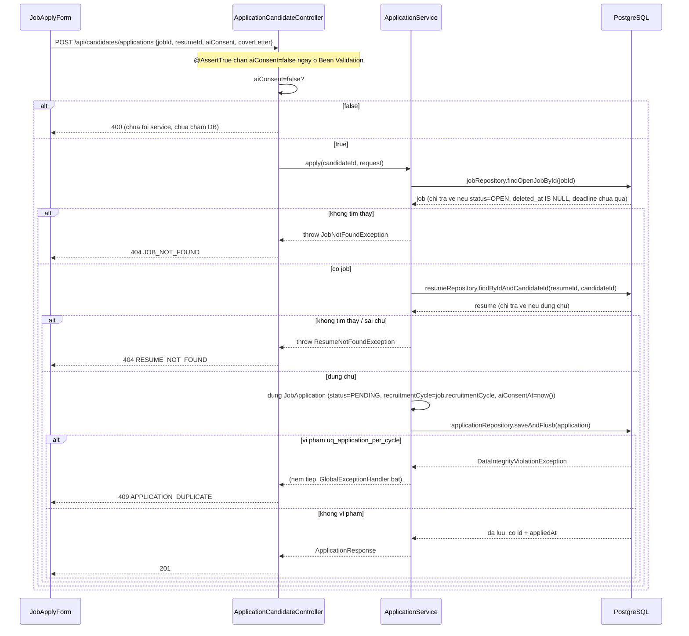

# FR-U02 — Tìm kiếm & Ứng tuyển việc làm

Nhánh `feat/fr-u02-apply`, mọc từ `feat/fr-u01-resume` (đã có sẵn `resume/`, `CandidateProfile`).
Phụ thuộc dữ liệu: Phase B (`jobs` + rubric, để có job `OPEN`) và C1 (`resumes`, để có CV).

## 1. Mục tiêu

Ứng viên đang xem một tin tuyển dụng đang mở, chọn một trong các CV đã upload, tick vào ô đồng ý
cho AI phân tích CV, rồi bấm "Nộp đơn". Hệ thống phải đảm bảo ba điều: (1) không cho nộp nếu chưa
tick đồng ý, (2) không cho nộp CV không phải của chính mình, (3) không cho một ứng viên nộp hai lần
vào cùng một job trong cùng một "chu kỳ tuyển dụng" (recruitment cycle — mỗi lần HR đóng rồi mở lại
một job là một chu kỳ mới, ứng viên cũ được nộp lại). Nhánh này **không** làm phần theo dõi trạng
thái đơn (FR-U03) hay rút đơn (FR-U06) — sau khi nộp thành công, trang chỉ hiện thông báo tại chỗ.

## 2. Các file đã tạo/sửa

### Backend

| File | Vai trò |
|---|---|
| `jobapplication/JobApplication.java` | Entity ánh xạ bảng `job_applications` (đã có sẵn từ `V1`) |
| `jobapplication/ApplicationStatus.java` | Enum 5 trạng thái: `PENDING, INTERVIEW_INVITED, HIRED, REJECTED, WITHDRAWN` |
| `jobapplication/JobApplicationRepository.java` | Chỉ `extends JpaRepository` — không có finder riêng, xem mục 4 |
| `jobapplication/dto/ApplicationCreateRequest.java` | DTO nhận từ frontend: `jobId`, `resumeId`, `aiConsent`, `coverLetter` — cố tình không có `recruitmentCycle` |
| `jobapplication/dto/ApplicationResponse.java` | DTO trả ra sau khi tạo đơn thành công |
| `jobapplication/ApplicationService.java` | Toàn bộ nghiệp vụ: kiểm tra job còn mở, kiểm tra CV đúng chủ, tạo đơn |
| `jobapplication/ApplicationCandidateController.java` | 1 endpoint `POST /api/candidates/applications` |
| `common/exception/GlobalExceptionHandler.java` (sửa) | Thêm 1 nhánh bắt vi phạm `uq_application_per_cycle` → 409 |
| `test/jobapplication/ApplicationIntegrationTest.java` | 5 test tích hợp qua `MockMvc` + Postgres thật |

### Frontend

| File | Vai trò |
|---|---|
| `features/applications/types.ts` | Kiểu `ApplicationCreateRequest`, `Application` — khớp DTO backend |
| `features/applications/api.ts` | Gọi `POST /candidates/applications` |
| `features/applications/queries.ts` | `useCreateApplicationMutation` (TanStack Query) |
| `features/applications/JobApplyForm.tsx` | Form ứng tuyển: chọn CV, thư giới thiệu, checkbox đồng ý, nút nộp |
| `pages/JobApplyPage.tsx` | Trang bọc `JobApplyForm`, hiện tiêu đề job (dùng lại `useJobDetailQuery` của A2) |
| `App.tsx` (sửa) | Thêm route `/jobs/:id/apply`, chỉ cho role `CANDIDATE` |
| `features/jobs/ApplyButton.tsx` (sửa) | Ứng viên đã đăng nhập: đổi từ nút "sắp ra mắt" sang điều hướng thật sang trang ứng tuyển |

## 3. Luồng chính

### Luồng — Nộp đơn ứng tuyển

Ba tầng kiểm tra xếp theo thứ tự "rẻ trước, đắt sau": Bean Validation (không chạm DB) → hai câu
`SELECT` có sẵn để xác định job/CV hợp lệ → cuối cùng mới `INSERT` và để chính DB quyết định có
trùng hay không. Không có bước nào ở giữa tự "đoán trước" xem có trùng không bằng `SELECT` — lý do
giải thích ở mục 4.

## 4. Quyết định thiết kế

**Tái dùng `jobRepository.findOpenJobById()` và `resumeRepository.findByIdAndCandidateId()` có sẵn,
không viết truy vấn mới**
- Đã chọn: gọi thẳng hai method đã tồn tại từ trước nhánh này — `findOpenJobById` (viết cho
  `JobPublicService.getDetail()`, FR-C02) lọc đúng `status='OPEN' AND deleted_at IS NULL AND
  deadline chưa qua`; `findByIdAndCandidateId` (viết cho `ResumeService.setPrimary()`/
  `downloadMine()`, FR-U01) lọc đúng "CV thuộc về candidate này".
- Lựa chọn khác: viết một câu query riêng cho `ApplicationService`, ví dụ
  `jobRepository.findById(jobId)` rồi tự kiểm tra `status`/`deletedAt`/`deadline` bằng code Java.
- Vì sao: điều kiện "job hợp lệ để tương tác" đã được định nghĩa và test một lần ở A2 — dùng lại
  đảm bảo không có hai định nghĩa "job mở" lệch nhau trong cùng hệ thống (ví dụ quên đồng bộ điều
  kiện `deadline` nếu viết lại). FR-U02 trong `PHASES.md` không yêu cầu phân biệt lý do (DRAFT hay
  hết hạn hay bị xoá) khi ứng viên cố nộp đơn, nên trả chung một 404 `JOB_NOT_FOUND` là đủ.

**Không `SELECT` trước để kiểm tra trùng đơn — chỉ dựa vào `UNIQUE CONSTRAINT` của DB, bắt
`DataIntegrityViolationException`**
- Đã chọn: `ApplicationService.apply()` không có bước nào truy vấn "đơn này đã tồn tại chưa" trước
  khi `INSERT`. `applicationRepository.saveAndFlush(application)` được gọi thẳng; nếu vi phạm
  `uq_application_per_cycle (job_id, candidate_id, recruitment_cycle)`, exception bị ném ra và
  `GlobalExceptionHandler` bắt, trả 409 `APPLICATION_DUPLICATE` — thêm đúng một nhánh `if` vào
  method `handleDataIntegrityViolation()` đã có sẵn cho `uq_company_per_owner` (FR-H01), không tạo
  exception class mới.
- Lựa chọn khác: `SELECT` trước bằng một finder như
  `existsByJobIdAndCandidateIdAndRecruitmentCycle(...)`, nếu có thì ném lỗi ngay, không cần đợi DB
  từ chối.
- Vì sao: đây là yêu cầu tường minh của người giao việc, dựa trên một lỗ hổng kinh điển —
  `SELECT` rồi `INSERT` không phải một thao tác nguyên tử (atomic). Nếu hai request nộp đơn cùng
  lúc (double-click, hoặc 2 tab) đều chạy qua `SELECT` trước khi request nào kịp `INSERT`, cả hai
  đều thấy "chưa có đơn nào" và cả hai đều `INSERT` thành công — sinh ra 2 đơn trùng, đúng thứ
  `uq_application_per_cycle` được tạo ra để ngăn. Chỉ có ràng buộc ở tầng DB mới có thể là chốt chặn
  không có kẽ hở, vì DB xử lý các `INSERT` cạnh tranh một cách tuần tự thật sự.

**Dùng `saveAndFlush()` thay vì `save()` thường trong `ApplicationService.apply()`**
- Đã chọn: gọi `saveAndFlush()` để Hibernate gửi câu `INSERT` xuống DB ngay trong thân method,
  thay vì gom lại tới lúc transaction commit.
- Lựa chọn khác: gọi `save()` bình thường, để Hibernate tự quyết định lúc nào flush.
- Vì sao: nếu không ép flush, `INSERT` (và exception nếu có) chỉ thực sự chạy ở ranh giới
  transaction — nghĩa là ngoài phạm vi thân method `apply()`, tại thời điểm Spring đang commit.
  `GlobalExceptionHandler` là một `@RestControllerAdvice` bắt exception ném ra trong lúc xử lý
  request, không đảm bảo bắt được exception xảy ra muộn hơn ở bước commit sau khi method đã
  return — dùng `saveAndFlush()` làm cho hành vi 409 xác định và dễ kiểm chứng bằng test, thay vì
  phụ thuộc vào chi tiết triển khai của Hibernate.

**`aiConsent` dùng `@AssertTrue` của Bean Validation, không viết `if` thủ công trong service**
- Đã chọn: field `aiConsent` trong `ApplicationCreateRequest` gắn
  `@AssertTrue(message = "...")`. Khi `aiConsent=false`, Spring tự ném
  `MethodArgumentNotValidException` trước khi `@RequestBody` được đưa vào controller — handler cho
  exception này đã có sẵn (dùng chung cho mọi DTO khác), trả 400 kèm map lỗi theo tên field.
- Lựa chọn khác: nhận `aiConsent` như một `boolean` thường, tự kiểm tra bằng `if (!request.aiConsent())
  throw new InvalidConsentException(...)` trong `ApplicationService`.
- Vì sao: người giao việc yêu cầu rõ "trả 400 trước khi chạm DB, không để rơi về 500" — Bean
  Validation chạy trước khi request đi vào bất kỳ tầng service/repository nào, nên tự động thoả
  điều kiện "chưa chạm DB" mà không cần code thêm gì. Cách này cũng tận dụng đúng cơ chế đã có sẵn
  trong dự án cho mọi validate khác (`@NotBlank`, `@Size`, ... ở `JobRequest`, `CompanyRequest`).

**`recruitmentCycle` không có trong `ApplicationCreateRequest`, backend tự lấy từ `Job` hiện tại**
- Đã chọn: `ApplicationService.apply()` đọc `job.getRecruitmentCycle()` sau khi đã xác nhận job
  hợp lệ, gán trực tiếp vào entity trước khi lưu.
- Lựa chọn khác: để frontend gửi kèm `recruitmentCycle` (frontend đã có sẵn giá trị này từ
  `useJobDetailQuery`), backend chỉ việc lưu lại.
- Vì sao: `recruitmentCycle` quyết định trực tiếp việc một đơn có bị coi là trùng hay không
  (`uq_application_per_cycle` dùng nó làm một phần khoá). Nếu tin giá trị từ client, một request
  bị sửa tay (ví dụ qua DevTools hoặc gọi API trực tiếp) có thể gửi một `recruitmentCycle` cũ hoặc
  tương lai để né ràng buộc chống trùng — đây là yêu cầu tường minh của người giao việc, không phải
  suy đoán.

**Test tích hợp `ApplicationIntegrationTest` không dùng `@Transactional`, khác với
`JobOwnerIntegrationTest`**
- Đã chọn: mirror `CompanyOwnerIntegrationTest` (không có `@Transactional` ở class), cách ly dữ
  liệu giữa các test bằng cách gắn `UUID.randomUUID()` vào email/tên công ty/tiêu đề job, không
  dựa vào rollback.
- Lựa chọn khác (thử ban đầu, bị người giao việc bác trong lúc duyệt plan): thêm `@Transactional`
  như `JobOwnerIntegrationTest` để mỗi test tự rollback, đỡ phải tự tạo dữ liệu ngẫu nhiên.
- Vì sao: với `@SpringBootTest` + `MockMvc`, nếu class test có `@Transactional`, request HTTP giả
  lập qua `MockMvc` và code service chạy **chung một transaction** với chính test method đó. Khi
  `applicationRepository.saveAndFlush()` vi phạm `uq_application_per_cycle`, Postgres đánh dấu toàn
  bộ transaction đó là "rollback-only" — mọi thao tác DB sau đó trong cùng test (kể cả một câu
  `SELECT count()` để assert) sẽ ném `UnexpectedRollbackException` thay vì cho kết quả mong đợi.
  Test `apply_toDraftJob_doesNotCreateApplication` (assert `count()` không đổi sau một request bị
  từ chối) sẽ vỡ vì lý do không liên quan gì tới logic đang kiểm tra.

**Frontend: chọn CV mặc định tính trực tiếp lúc render, không dùng `useEffect` + `setState`**
- Đã chọn: `JobApplyForm` tính `defaultResumeId` bằng một biểu thức thường (tìm CV có
  `isPrimary === true`, nếu không có thì lấy CV đầu tiên) ngay trong thân component, rồi
  `resumeId = selectedResumeId ?? defaultResumeId`.
- Lựa chọn khác (bản đầu tiên): dùng `useEffect` theo dõi `resumes`, gọi `setResumeId(...)` bên
  trong khi chưa có lựa chọn nào.
- Vì sao: ESLint (`react-hooks/set-state-in-effect`) chặn thẳng cách làm bằng `useEffect`, vì gọi
  `setState` đồng bộ trong effect sinh thêm một lượt render thừa (render lần 1 với giá trị rỗng,
  effect chạy, `setState`, render lần 2 với giá trị đúng) — tính trực tiếp lúc render cho kết quả
  đúng ngay từ lần render đầu tiên, không cần lượt render thừa.

**Frontend: gọi `createMutation.mutate(...)`, không `await createMutation.mutateAsync(...)`**
- Đã chọn: `onSubmit` gọi `mutate()` không đồng bộ (fire-and-forget), không `async`/`await`.
- Lựa chọn khác (bản đầu tiên, bị người giao việc phát hiện khi review): `await mutateAsync(...)`
  nhưng không bọc `try/catch`.
- Vì sao: `mutateAsync()` trả về một `Promise` sẽ `reject` khi request lỗi (ví dụ 409 khi nộp
  trùng) — `await` một promise reject mà không `catch` sinh ra unhandled promise rejection trong
  console trình duyệt mỗi lần người dùng gặp lỗi. Trạng thái lỗi đã được `useMutation` phản ánh đầy
  đủ qua `createMutation.isError`/`createMutation.error` (dùng để hiện thông báo lỗi ngay trong
  JSX), nên không cần bắt lỗi thủ công lần nữa — `mutate()` không trả `Promise` nên không có gì để
  quên `catch`.

## 5. Ràng buộc SRS đã thực thi

| FR | Ràng buộc | Thực thi ở đâu |
|---|---|---|
| FR-U02 | Ứng viên phải tick đồng ý mới nộp được đơn | `ApplicationCreateRequest.aiConsent` (`@AssertTrue`) — 400 nếu false; DB có thêm `chk_consent_true` làm lớp chặn thứ hai |
| FR-U02 | Checkbox đồng ý không tick sẵn | `JobApplyForm.tsx` — `useState(false)`, nút "Nộp đơn" `disabled` tới khi tick |
| FR-U02 | Mỗi ứng viên chỉ nộp 1 lần cho 1 job trong 1 chu kỳ tuyển dụng | Ràng buộc DB `uq_application_per_cycle`; `ApplicationService.apply()` dùng `saveAndFlush()` để bắt được đúng lúc, `GlobalExceptionHandler.handleDataIntegrityViolation()` trả 409 `APPLICATION_DUPLICATE` |
| FR-U02 | Chỉ nộp được vào job đang mở | `JobRepository.findOpenJobById()` (tái dùng từ A2) — lọc `status='OPEN' AND deleted_at IS NULL AND deadline chưa qua` |
| FR-U02 | Không tin `resumeId` từ client, CV phải thuộc đúng ứng viên | `ResumeRepository.findByIdAndCandidateId()` (tái dùng từ C1) — sai chủ trả 404, không lộ thông tin CV có tồn tại hay không |
| Yêu cầu bổ sung của người giao việc | `recruitmentCycle` do backend tự quyết, DTO không có field này | `ApplicationService.apply()` đọc `job.getRecruitmentCycle()`, `ApplicationCreateRequest` không có field `recruitmentCycle` |
| Yêu cầu bổ sung của người giao việc | Không migration mới | Không có file `V*.sql` nào được thêm trong nhánh này — bảng `job_applications` dùng nguyên trạng từ `V1` |
| CLAUDE.md mục 7 | Không tạo cột/field `verdict`/`label`/`isQualified`/`passed` | Đã soát bằng skill `srs-guard` — không có vi phạm |

## 6. Đã kiểm thử gì

**Backend** — `ApplicationIntegrationTest` (5 test), chạy qua `MockMvc` + Postgres thật:
- Nộp đơn hợp lệ (job `OPEN`, CV đúng chủ, đồng ý) → 201, `status = PENDING`.
- Nộp lần hai cùng job cùng chu kỳ → 409 `APPLICATION_DUPLICATE`.
- Gửi `aiConsent: false` → 400.
- Gửi `resumeId` của một candidate khác → 404 `RESUME_NOT_FOUND`.
- Nộp vào job còn `DRAFT` (chưa gọi API mở job) → 404 `JOB_NOT_FOUND`, và
  `jobApplicationRepository.count()` không đổi.

Toàn bộ suite backend (`.\mvnw.cmd test`) chạy xanh: **68/68 test pass** (bao gồm test có sẵn từ
Phase A, B, C1), chạy lại lần cuối sau khi sửa `mutate()`/`mutateAsync()` ở frontend (không ảnh
hưởng backend nhưng chạy lại để chắc chắn).

**Frontend** — `npm run lint` và `npm run build` (`tsc -b && vite build`) đều sạch, chạy lại sau
mỗi lần sửa (kể cả sau khi đổi `mutateAsync` → `mutate`).

**Chưa test / chưa xác nhận**:
- **Chưa test tay trên trình duyệt thật.** Toàn bộ luồng chọn CV, tick đồng ý, nộp đơn, xem thông
  báo lỗi 409/400 hiển thị trên UI — chỉ được xác nhận qua test tự động và build, chưa có ai bấm
  qua giao diện thật.
- **Chưa test race condition thật sự** (hai request nộp đơn đồng thời, ví dụ bằng công cụ load-test
  hoặc hai tab trình duyệt bấm cùng lúc). Test tự động chỉ gọi tuần tự (nộp lần 1 xong mới nộp lần
  2), xác nhận đúng *kết quả cuối cùng* của ràng buộc DB nhưng chưa quan sát trực tiếp tình huống
  hai `INSERT` cạnh tranh thật.
- **Chưa test trường hợp CV chưa parse xong** (`parseStatus = PENDING`/`FAILED`) — `JobApplyForm`
  hiện cho chọn bất kỳ CV nào trong danh sách, không lọc theo `parseStatus`. Không vi phạm SRS (CV
  chưa parse xong vẫn hợp lệ để nộp đơn, việc chấm điểm AI là bước sau, thuộc Phase D), nhưng chưa
  xác nhận trải nghiệm người dùng khi chọn một CV còn `PENDING`.
- **Chưa xác nhận hành vi khi ứng viên có 0 CV** — `JobApplyForm` có nhánh hiển thị "Bạn chưa có CV
  nào" kèm link sang trang hồ sơ, nhưng chưa test tay xem nhánh này thực sự hiện đúng lúc.

## 7. Nợ kỹ thuật

- **`location.state.from` không được tiêu thụ sau khi đăng nhập.** `ApplyButton` (từ A2) đã set
  `state: { from: location }` khi điều hướng người chưa đăng nhập sang `/login`, nhưng
  `LoginPage`/`LoginForm` chưa đọc lại giá trị này để tự động quay về trang ứng tuyển sau khi đăng
  nhập thành công — người dùng phải tự bấm lại "Ứng tuyển" một lần nữa. Đây là khoảng trống có từ
  trước nhánh này (A2), không thuộc phạm vi FR-U02 nên không sửa ở đây.
- **Sau khi nộp đơn thành công, không có nơi nào để xem lại đơn vừa nộp** — trang chỉ hiện thông
  báo tại chỗ rồi dừng, vì trang "đơn ứng tuyển của tôi" (FR-U03) chưa tồn tại. Đây là phụ thuộc dữ
  liệu có chủ đích, không phải thiếu sót — C3 sẽ làm ở nhánh sau.
  `Application` (kiểu TypeScript) và `ApplicationResponse` (DTO backend) đã có sẵn đủ field để C3
  dùng lại mà không cần đổi gì.
- **`ApplicationService.apply()` không kiểm tra CV có `parseStatus = DONE` hay chưa** — chấp nhận
  bất kỳ CV nào thuộc đúng ứng viên, kể cả CV còn `PENDING`/`FAILED`. SRS không yêu cầu ràng buộc
  này ở FR-U02 (việc CV phải parse xong mới chấm điểm được là ràng buộc của Phase D, không phải
  điều kiện để *nộp đơn*), nhưng đáng cân nhắc thêm cảnh báo ở UI khi Phase D triển khai.
- **`JobApplicationRepository` chưa có finder nào** ngoài các method kế thừa từ `JpaRepository` —
  cố ý tối giản cho đúng phạm vi C2 (chỉ tạo đơn). C3 (`GET /api/applications/my`) và C4 (rút đơn)
  chắc chắn sẽ cần thêm ít nhất `findByCandidateIdOrderByAppliedAtDesc` và
  `findByIdAndCandidateId`.
