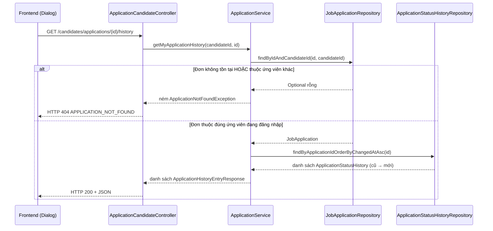

# FR-U03 — Ứng viên theo dõi trạng thái đơn ứng tuyển

## 1. Mục tiêu

Sau khi ứng viên nộp đơn (FR-U02), họ cần một chỗ để xem đơn mình đã nộp đang ở trạng thái nào —
Chờ duyệt, Đã mời phỏng vấn, Trúng tuyển, Bị từ chối, hay Đã rút đơn — và xem lại toàn bộ quá
trình đơn đó đã đổi trạng thái như thế nào theo thời gian. Nhánh này chỉ làm phần **đọc**: ứng
viên xem trạng thái và lịch sử của chính mình, không có API nào cho phép ứng viên hay HR sửa
trạng thái đơn (việc đó thuộc FR-H07, một nhánh khác).

Một phần việc "ẩn" của nhánh này là bắt đầu ghi dữ liệu vào bảng lịch sử: bảng đó đã có sẵn từ
lúc khởi tạo schema nhưng chưa từng được ghi dòng nào, vì lúc tạo đơn (FR-U02) chưa có code nào
gọi tới nó.

## 2. Các file đã tạo/sửa

### Backend

| File | Vai trò |
|---|---|
| `jobapplication/ApplicationStatusHistory.java` | Entity mới, ánh xạ bảng `application_status_history` — mỗi dòng là một lần đổi trạng thái |
| `jobapplication/ApplicationStatusHistoryRepository.java` | Repository mới, lấy lịch sử của một đơn theo thời gian tăng dần |
| `jobapplication/ApplicationSummaryView.java` | Interface projection — hình dạng một dòng kết quả của câu SQL join `job_applications`/`jobs`/`companies` |
| `jobapplication/JobApplicationRepository.java` | Thêm `findByIdAndCandidateId` (kiểm tra quyền sở hữu đơn) và câu SQL native lấy danh sách đơn kèm tên job/công ty |
| `jobapplication/dto/ApplicationSummaryResponse.java` | DTO trả về cho danh sách "đơn của tôi" |
| `jobapplication/dto/ApplicationHistoryEntryResponse.java` | DTO trả về cho một dòng lịch sử (không lộ `changed_by`) |
| `jobapplication/ApplicationService.java` | Sửa: thêm `recordStatusChange` (nơi ghi lịch sử duy nhất), `apply()` gọi nó ngay sau khi tạo đơn, thêm `getMyApplications`, `getMyApplicationHistory` |
| `jobapplication/ApplicationCandidateController.java` | Thêm 2 endpoint `GET /api/candidates/applications` và `GET /api/candidates/applications/{id}/history` |
| `common/exception/ApplicationNotFoundException.java` | Exception mới, dùng khi đơn không tồn tại hoặc không thuộc về người gọi |
| `common/exception/GlobalExceptionHandler.java` | Thêm handler biến `ApplicationNotFoundException` thành HTTP 404 |
| `test/.../ApplicationServiceTest.java` | Test đơn vị (Mockito) cho phần logic mới |

### Frontend

| File | Vai trò |
|---|---|
| `index.css` | Thêm 10 biến màu `--color-status-*` cho 5 trạng thái (nền + chữ) |
| `features/applications/types.ts` | Thêm kiểu `ApplicationSummary`, `ApplicationHistoryEntry` |
| `features/applications/api.ts` | Thêm hàm gọi 2 API GET mới |
| `features/applications/queries.ts` | Thêm `useMyApplicationsQuery`, `useApplicationHistoryQuery` (TanStack Query) |
| `features/applications/applicationLabels.ts` | Nhãn tiếng Việt và class màu cho 5 trạng thái |
| `features/applications/ApplicationStatusBadge.tsx` | Component hiển thị 1 badge trạng thái |
| `features/applications/ApplicationHistoryTimeline.tsx` | Component hiển thị danh sách lịch sử dạng dòng thời gian |
| `pages/CandidateApplicationsPage.tsx` | Trang "Đơn ứng tuyển của tôi" — bảng đơn + dialog xem lịch sử |
| `App.tsx` | Thêm route `/candidate/applications` |
| `pages/CandidateHomePage.tsx` | Thêm link điều hướng tới trang mới |

## 3. Luồng chính

### Luồng 1 — Ghi lịch sử ngay khi nộp đơn (mở rộng luồng `apply()` có sẵn từ FR-U02)

Luồng nộp đơn (POST) không đổi API, chỉ thêm một bước ở cuối:

1. Ứng viên gửi `POST /api/candidates/applications` (giữ nguyên từ FR-U02).
2. `SecurityConfig` chặn theo tiền tố path: chỉ tài khoản có vai trò CANDIDATE mới qua được.
3. `ApplicationCandidateController.apply()` đọc `candidateId` từ token JWT.
4. `ApplicationService.apply()`: kiểm tra job đang mở, kiểm tra CV thuộc về đúng ứng viên, tạo
   bản ghi `JobApplication` với `status = PENDING`, lưu vào bảng `job_applications`.
5. **Mới ở nhánh này**: ngay sau khi lưu đơn thành công, gọi
   `recordStatusChange(applicationId, fromStatus=null, toStatus=PENDING, changedBy=candidateId)`
   — tạo một dòng trong `application_status_history`. Bước này nằm trong cùng transaction với
   bước 4, nên nếu việc tạo đơn thất bại (ví dụ nộp trùng), dòng lịch sử cũng không được tạo.
6. Trả về thông tin đơn vừa tạo cho frontend.

### Luồng 2 — Xem danh sách đơn của tôi

1. Trang `CandidateApplicationsPage` được mở, gọi `useMyApplicationsQuery()`.
2. Trình duyệt gửi `GET /api/candidates/applications`; JWT được tự động đính vào header bởi
   interceptor của `axios` (không cần code thủ công ở từng nơi gọi API).
3. `SecurityConfig` chặn theo vai trò CANDIDATE.
4. `ApplicationCandidateController.getMyApplications()` lấy `candidateId` từ token, gọi
   `ApplicationService.getMyApplications(candidateId)`.
5. Service gọi một câu SQL duy nhất (native, không phải qua quan hệ JPA) join ba bảng
   `job_applications`, `jobs`, `companies`, lọc theo `candidate_id`, sắp theo ngày nộp mới nhất.
6. Mỗi dòng kết quả được chuyển từ dạng "thô" (cột `status` là chuỗi) sang DTO có kiểu enum
   `ApplicationStatus`.
7. Frontend hiển thị bảng: tên vị trí, tên công ty, badge trạng thái (màu theo bảng ở
   `UI_GUIDE.md`), ngày nộp.

### Luồng 3 — Xem lịch sử một đơn cụ thể

Luồng này có rẽ nhánh: đơn có thể không tồn tại hoặc không thuộc về người đang xem.

Điểm quan trọng: hai trường hợp "đơn không tồn tại" và "đơn tồn tại nhưng của người khác" trả về
**cùng một mã lỗi 404**, không phân biệt — nếu trả 403 cho trường hợp thứ hai, kẻ dò UUID có thể
biết được "đơn này có tồn tại" dù không có quyền xem, đây là kiểu rò rỉ thông tin cần tránh.

## 4. Quyết định thiết kế

**Đường dẫn API dùng `/api/candidates/...` thay vì `/api/applications/my` như `PHASES.md` ghi**
· Lựa chọn khác: giữ đúng path trong tài liệu (`/api/applications/my`)
· Vì sao: `SecurityConfig` chỉ định nghĩa luật RBAC theo tiền tố đường dẫn — `/api/candidates/**`
mới bị bắt buộc `hasRole("CANDIDATE")`, còn path khác chỉ rơi vào luật mặc định
"đăng nhập là được" (`anyRequest().authenticated()`), nghĩa là một tài khoản HR đăng nhập cũng
gọi được. Dùng đúng tiền tố đã có RBAC quan trọng hơn khớp đúng tài liệu; tài liệu sẽ được cập
nhật ở một nhánh khác.

**Dồn việc ghi lịch sử về một phương thức duy nhất (`recordStatusChange`)**
· Lựa chọn khác: mỗi nơi cần đổi trạng thái tự viết đoạn tạo dòng lịch sử riêng
· Vì sao: tiêu chí nghiệm thu của tính năng này yêu cầu *mọi* lần đổi trạng thái đều phải sinh
dòng lịch sử, kể cả khi hệ thống tự đổi (không phải do người dùng bấm nút). Các tính năng sau
này (HR đổi trạng thái, ứng viên rút đơn) chỉ cần gọi lại đúng một hàm này thay vì phải nhớ tự
viết logic ghi log — giảm khả năng một nhánh tương lai quên mất bước ghi lịch sử.

**Đơn của người khác trả 404, không phải 403**
· Lựa chọn khác: 404 khi đơn không tồn tại, 403 khi tồn tại nhưng không phải của mình
· Vì sao: 403 vô tình xác nhận với người gọi rằng ID đó *có tồn tại* trong hệ thống — một ứng
viên có thể dò UUID ngẫu nhiên để suy ra đơn nào tồn tại. Trả 404 cho cả hai trường hợp coi như
"không có gì ở đây" theo góc nhìn của người không có quyền, không tiết lộ thêm thông tin.

**Danh sách "đơn của tôi" ghép thêm tên công ty bằng một câu SQL thuần (native query), không
dùng quan hệ JPA `@ManyToOne`**
· Lựa chọn khác: (a) chỉ trả về ID job, để frontend tự gọi thêm API lấy tên job/công ty; (b)
thêm quan hệ `@ManyToOne` giữa các entity rồi để Hibernate tự join
· Vì sao: toàn bộ entity trong package này (`JobApplication`, `Job`, `Company`) đã cố tình
không khai báo quan hệ `@ManyToOne` với nhau ngay từ đầu, để tránh hiện tượng "lazy loading"
(Hibernate cố tải thêm dữ liệu liên quan sau khi transaction đã đóng, gây lỗi runtime khó dò).
Thêm quan hệ mới chỉ để phục vụ một câu truy vấn sẽ phá vỡ quy ước đã thống nhất cho cả dự án.
Một câu SQL thuần join 3 bảng, trả kết quả qua "hình dạng dữ liệu" định sẵn
(`ApplicationSummaryView`), vừa đúng quy ước, vừa tránh gọi nhiều API rời rạc từ frontend.

**`ApplicationSummaryView.getStatus()` khai kiểu chuỗi (`String`), không khai kiểu enum trực
tiếp**
· Lựa chọn khác: khai `getStatus()` trả thẳng kiểu `ApplicationStatus`
· Vì sao: khi Spring Data đọc kết quả một câu SQL thuần vào một "hình dạng dữ liệu" định sẵn, nó
không tự động biết cách chuyển một cột kiểu văn bản thành một giá trị enum (khác với khi đọc
trực tiếp vào entity, nơi cơ chế này có sẵn) — khai enum trực tiếp ở đây sẽ khiến ứng dụng lỗi
ngay khi gọi API. Cách an toàn là đọc về dạng chuỗi trước, rồi tự chuyển sang enum ở tầng
`ApplicationService`.

**Không trả `changed_by` (người/hệ thống đổi trạng thái) cho ứng viên xem**
· Lựa chọn khác: trả nguyên giá trị định danh người đổi
· Vì sao: giá trị này có thể là định danh nội bộ của một tài khoản HR — không có lý do để lộ
thông tin đó cho ứng viên. Ở nhánh này, dòng lịch sử duy nhất tồn tại là do chính ứng viên tự
tạo đơn nên trường này chưa có giá trị hiển thị hữu ích; nếu sau này cần cho ứng viên biết "HR
đã cập nhật" một cách chung chung, có thể bổ sung một trường mô tả an toàn hơn thay vì lộ định
danh thật.

**Bảng màu badge trạng thái đặt trong khối `@theme` của `index.css`, không đặt trong khối
`@theme inline`**
· Lựa chọn khác: viết thẳng mã màu (hex) trong class của component
· Vì sao: quy ước dự án cấm hardcode mã màu trong component. Đồng thời, khối `@theme inline` do
bộ giao diện có sẵn (shadcn, preset Nova) sinh ra nằm **sau** khối `@theme` gốc trong file — nếu
đặt trùng tên biến vào đó, giá trị sẽ bị ghi đè mất (dự án từng gặp lỗi này hai lần trước đây,
với biến font và biến màu accent). Đặt trong khối `@theme` gốc tránh lặp lại đúng lỗi đó.

## 5. Ràng buộc SRS đã thực thi

| FR / quy ước | Ràng buộc | Thực thi ở đâu |
|---|---|---|
| FR-U03 | Ứng viên xem đúng 5 trạng thái đơn, chỉ của chính mình | `ApplicationService.getMyApplications` — câu SQL lọc theo `candidate_id` lấy từ JWT, không nhận từ tham số client |
| FR-U03 | Ứng viên xem lại toàn bộ lịch sử ứng tuyển | `ApplicationService.getMyApplicationHistory`, `ApplicationStatusHistoryRepository.findByApplicationIdOrderByChangedAtAsc` |
| Tiêu chí nghiệm thu C3 (`docs/PHASES.md`) | Mọi lần đổi trạng thái đều sinh một dòng lịch sử | `ApplicationService.recordStatusChange` — điểm ghi duy nhất, hiện được gọi từ `apply()` |
| RBAC (mọi endpoint) | Không tin việc UI đã ẩn nút, phải chặn ở tầng API | `SecurityConfig`: `/api/candidates/**` → `hasRole("CANDIDATE")` |
| Kiểm tra quyền sở hữu | Không được xem đơn của ứng viên khác | `JobApplicationRepository.findByIdAndCandidateId` + `ApplicationNotFoundException` → luôn trả 404 |
| CLAUDE.md mục 7 | Không tạo cột/field `verdict`/`label`/`isQualified`/`passed` | Đã soát bằng skill `srs-guard` trước khi viết tài liệu này — không có vi phạm |
| Ranh giới `ai/` | `ai/` không được đụng `scoring/ScoreAggregator` | Nhánh này không chạm tới package `ai/` hay `scoring/` |

## 6. Đã kiểm thử gì

**Đã test:**
- `ApplicationServiceTest` (JUnit + Mockito, không cần HTTP/database thật): xác nhận `apply()`
  ghi đúng một dòng lịch sử với `fromStatus = null`, `toStatus = PENDING`,
  `changedBy = candidateId`; xác nhận `getMyApplicationHistory` ném đúng lỗi 404 khi đơn thuộc
  về ứng viên khác.
- Chạy lại toàn bộ 70 test có sẵn của dự án (gồm cả `ApplicationIntegrationTest` viết từ FR-U02)
  — tất cả pass, xác nhận việc thêm tham số mới vào constructor của `ApplicationService` không
  làm hỏng luồng nộp đơn cũ.
- `npm run lint` và `npm run build` (kiểm tra kiểu dữ liệu TypeScript + đóng gói) — không lỗi.
- Đã chạy skill `srs-guard` soát 8 nguyên tắc bắt buộc của dự án trên toàn bộ nhánh — không phát
  hiện vi phạm.
- Đã chạy câu lệnh SQL backfill trên database dev: các đơn tạo trước nhánh này sinh đúng một
  dòng lịch sử NULL→PENDING, `changed_at` giữ nguyên đúng mốc `applied_at` gốc của đơn (không bị
  lệch sang giờ chạy câu backfill).
- Đã kiểm thử bằng tay trên trình duyệt với tài khoản candidate: danh sách "Đơn ứng tuyển của
  tôi" hiện đủ tên vị trí, tên công ty, badge trạng thái, ngày nộp; mở dialog lịch sử của một
  đơn cũ (đã backfill) hiện đúng 1 dòng; nộp một đơn mới sau khi triển khai nhánh này thì dòng
  lịch sử tự sinh ra ngay, không cần chạy lại backfill.

**Chưa test:**
- Chưa có test tích hợp (gọi qua HTTP thật, có `SecurityConfig` thật) cho 2 endpoint GET mới —
  test hiện tại chỉ kiểm tra logic ở tầng service bằng đối tượng giả lập, chưa xác nhận toàn bộ
  chuỗi (ví dụ: ứng viên B gọi API xem lịch sử đơn của ứng viên A có thật sự nhận 404 khi đi qua
  cả `SecurityConfig` và `GlobalExceptionHandler` hay không).
- Chưa kiểm thử trường hợp danh sách rỗng (ứng viên chưa từng nộp đơn nào) trên giao diện thật,
  dù trong code đã có nhánh xử lý riêng cho trường hợp này.
- Chưa kiểm tra hiệu năng của câu SQL join 3 bảng khi số lượng đơn/job/công ty lớn.

## 7. Nợ kỹ thuật

- Danh sách đơn (`GET /api/candidates/applications`) chưa phân trang. Chấp nhận được vì số đơn
  của một ứng viên thường nhỏ, nhưng nếu sau này một ứng viên ứng tuyển hàng trăm vị trí, cần bổ
  sung phân trang giống cách trang danh sách job công khai đã làm.
- Trường `changed_by` bị ẩn hoàn toàn khỏi response hiện tại. Khi FR-H07 (HR đổi trạng thái) và
  FR-U06 (rút đơn) triển khai và bắt đầu tạo ra các dòng lịch sử có `changed_by` là tài khoản HR
  thật, cần quyết định lại xem có nên hiển thị cho ứng viên biết "ai đã đổi" theo cách an toàn
  hơn (ví dụ chỉ ghi "Nhà tuyển dụng" thay vì lộ định danh tài khoản) hay tiếp tục ẩn hẳn.
- Đã chạy câu lệnh SQL backfill trên database dev (xem mục 6), nhưng đây là thao tác chạy tay
  một lần trên một database cụ thể, không phải file migration tự động áp dụng mọi nơi. Bất kỳ
  môi trường nào khác có đơn tạo từ FR-U02 trước nhánh này — máy của thành viên khác, database
  dựng lại từ đầu, môi trường demo — đều còn thiếu dòng NULL→PENDING và phải tự chạy lại đúng
  câu lệnh đó một lần trước khi dùng tính năng này.
- Trang "Đơn ứng tuyển của tôi" hiện hiển thị lịch sử qua hộp thoại (dialog) thay vì một trang
  riêng có URL — nếu sau này cần chia sẻ liên kết trực tiếp tới lịch sử một đơn cụ thể, sẽ cần
  đổi sang route riêng.
- Chưa có API nào cho HR đổi trạng thái đơn (FR-H07) — nằm ngoài phạm vi nhánh này theo đúng
  yêu cầu ban đầu, chưa triển khai ở đâu cả.
- `recordStatusChange` hiện khai `private` trong `ApplicationService`. Điều này chỉ đúng với lời
  hứa ở mục 4 ("các tính năng sau chỉ cần gọi lại đúng một hàm này") nếu FR-U06 (rút đơn) cũng
  được viết trong cùng `ApplicationService` — lúc đó gọi thẳng phương thức private cùng lớp là
  được. Nhưng FR-H07 (HR đổi trạng thái) gần như chắc chắn nằm ở một service khác (ví dụ một
  `ApplicationOwnerService` phía HR, khác gói với candidate), nên sẽ **không gọi được**
  `recordStatusChange` như hiện tại. Khi làm E1 (FR-H07), phải đổi `ApplicationService` để lộ
  phương thức này ra (đổi `private` thành package-private/public, hoặc tách hẳn phần ghi lịch sử
  ra một class riêng dùng chung cho cả hai phía) — nếu không làm, rất dễ lặp lại đúng lỗi mà
  thiết kế này đang cố tránh: mỗi nơi tự viết một đoạn insert lịch sử riêng.
