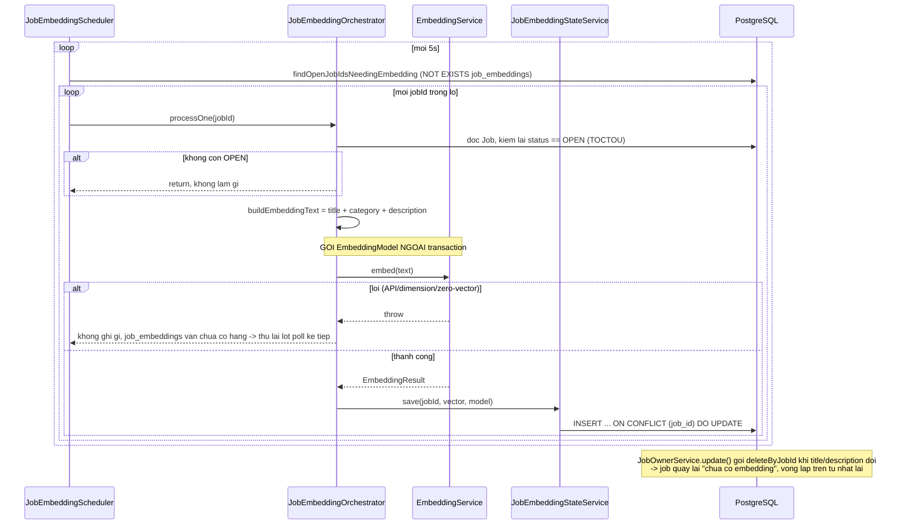
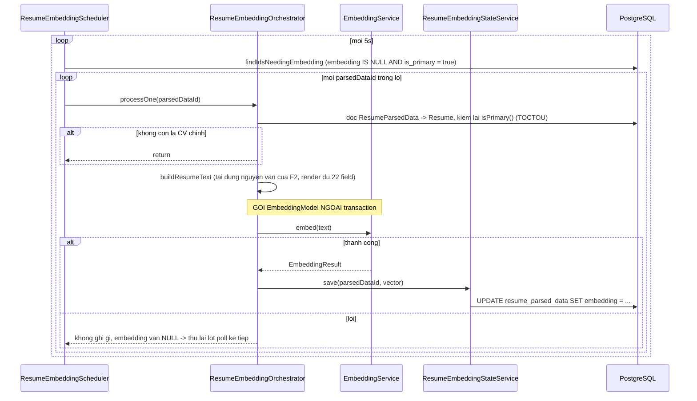
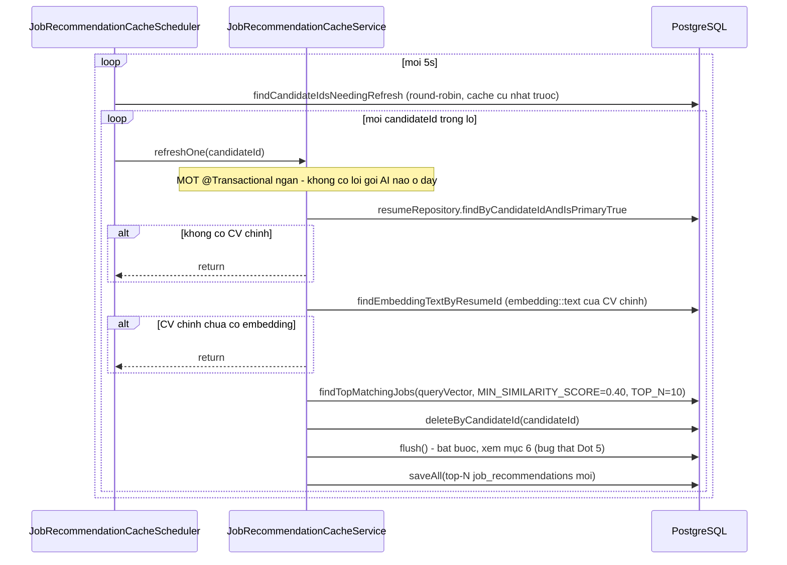
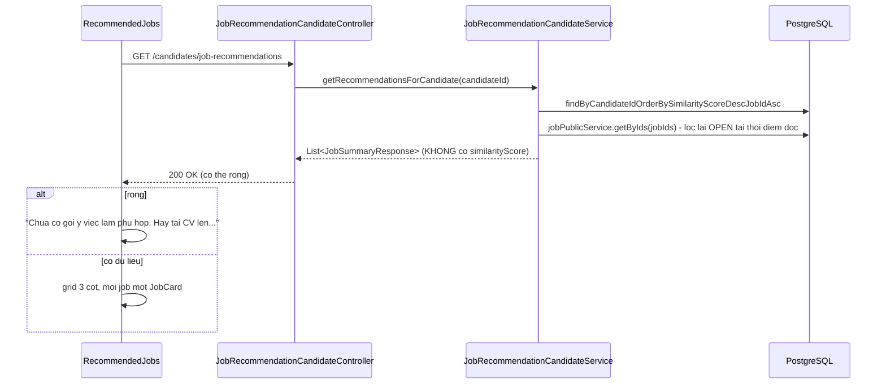

# FR-U04 — Gợi ý việc làm bằng AI (F1)

Nhánh `feat/fr-u04-recommend`, rẽ từ `feat/fr-u05-cv-improve` (F2), không phải từ `main` — chuỗi
xếp chồng: `fr-h07` → `fr-c03` → `candidate-view-invitation` → `fr-h08` → `fr-u05` → `fr-u04`. Chưa
gộp vào `main` tại thời điểm viết tài liệu này.

## 1. Mục tiêu

Ứng viên đã có CV parse xong (D1) muốn biết những việc làm nào đang tuyển phù hợp với năng lực của
mình mà không cần tự gõ từ khoá tìm kiếm. F1 dùng semantic search (embedding + cosine similarity,
pgvector) để đo mức độ tương đồng giữa CV và mô tả từng job `OPEN`, rồi **chủ động** hiện gợi ý
trên bảng tin ứng viên — khác `JobList` (trang tìm kiếm), nơi ứng viên phải tự gõ từ khoá.

Ba ràng buộc chốt ngay từ Plan Mode, giữ nguyên xuyên suốt: không lọc job bằng `category` (text tự
do, để embedding tự xử lý ngữ nghĩa); không dùng `VectorStore` abstraction của Spring AI (tự viết
entity + native query); vector truyền vào truy vấn similarity như một **tham số cố định**, không
`JOIN ... ON true` (tránh mất HNSW index).

## 2. Các file đã tạo/sửa

### Backend — nền tảng embedding dùng chung (`ai/embedding/`) — commit `2a1358e`

| File | Vai trò |
|---|---|
| `EmbeddingService.java` | Wrap `EmbeddingModel.embedForResponse()`, validate đúng 1536 chiều, chặn vector suy biến (toàn số 0) |
| `EmbeddingTextFormat.java` | Nơi DUY NHẤT serialize `float[]` → chuỗi text pgvector `"[v1,v2,...]"` |
| `EmbeddingResult.java` | Bọc `float[] vector` + `String model` |
| `EmbeddingErrorCode.java` / `EmbeddingFailedException.java` | Mã lỗi chuẩn hoá — `API_ERROR`, `INVALID_DIMENSION`, `ZERO_VECTOR` |

### Backend — sinh embedding cho job (`job/`) — commit `2a1358e`

| File | Vai trò |
|---|---|
| `JobEmbedding.java` | Entity `job_embeddings`, KHÔNG map cột `embedding` (kiểu `vector`, đúng tiền lệ `ResumeParsedData`) |
| `JobEmbeddingRepository.java` | `findOpenJobIdsNeedingEmbedding` (`NOT EXISTS`), `upsertEmbedding` (`ON CONFLICT DO UPDATE`), `deleteByJobId`, `findByJobId` |
| `JobEmbeddingStateService.java` | Bean ghi riêng, `@Transactional` — `save(jobId, vector, model)` |
| `JobEmbeddingOrchestrator.java` | `processOne`: đọc job → `buildEmbeddingText` (ghép `title` + `category` + `description`) → gọi `EmbeddingService` ngoài transaction → ghi qua state service |
| `JobEmbeddingScheduler.java` | `@Scheduled(fixedDelay)` quét lô, `app.job-embedding.*` |
| `JobOwnerService.java` (sửa) | `update()` gọi `deleteByJobId` khi `title`/`description` đổi — job quay lại trạng thái "chưa có embedding" |

### Backend — sinh embedding cho CV (`resume/`) — commit `2a1358e`

| File | Vai trò |
|---|---|
| `ResumeEmbeddingStateService.java` | Bean ghi riêng — `save(parsedDataId, vector)`, KHÔNG nhận `model` (xem mục 4h) |
| `ResumeEmbeddingOrchestrator.java` | `processOne`: kiểm lại `resume.isPrimary()` (TOCTOU), tái dùng `CvImprovementOrchestrator.buildResumeText` (F2), gọi `EmbeddingService` |
| `ResumeEmbeddingScheduler.java` | `@Scheduled(fixedDelay)`, `app.resume-embedding.*` |
| `ResumeParsedDataRepository.java` (sửa) | `findIdsNeedingEmbedding` (`embedding IS NULL AND is_primary = true`), `updateEmbedding` |

### Backend — similarity + cache + endpoint (`job/`, `resume/`, `jobrecommendation/`) — commit `5f3ff82`

| File | Vai trò |
|---|---|
| `JobEmbeddingRepository.java` (sửa) | `findTopMatchingJobs` — truy vấn similarity hai bước (mục 4d) |
| `JobMatchView.java` (mới) | Projection `{ UUID getJobId(); BigDecimal getSimilarityScore(); }` |
| `EmbeddingService.java` / `EmbeddingErrorCode.java` (sửa) | Thêm chặn `ZERO_VECTOR` (bug thật, xem mục 6) |
| `ResumeParsedDataRepository.java` (sửa) | `findEmbeddingTextByResumeId` — đọc `embedding::text` của CV chính |
| `JobRepository.java` (sửa) | `findOpenJobsByIdIn` |
| `JobPublicService.java` (sửa) | `getByIds` — dựng `JobSummaryResponse`, lọc lại OPEN tại thời điểm đọc |
| `jobrecommendation/JobRecommendation.java` | Entity `job_recommendations` |
| `jobrecommendation/JobRecommendationRepository.java` | `deleteByCandidateId`, `findByCandidateIdOrderBySimilarityScoreDescJobIdAsc`, `findCandidateIdsNeedingRefresh` (round-robin) |
| `jobrecommendation/JobRecommendationCacheService.java` | `refreshOne(candidateId)` — xoá-rồi-chèn, `@Transactional` trực tiếp (không tách state-service, xem mục 4 lý do) |
| `jobrecommendation/JobRecommendationCacheScheduler.java` | `@Scheduled(fixedDelay)`, `app.job-recommendation.*` |
| `jobrecommendation/JobRecommendationCandidateService.java` | `getRecommendationsForCandidate` — chỉ đọc cache |
| `jobrecommendation/JobRecommendationCandidateController.java` | `GET /api/candidates/job-recommendations` |

### Cấu hình

| File | Vai trò |
|---|---|
| `application.yml` (sửa) | 3 khối `app.job-embedding` / `app.resume-embedding` / `app.job-recommendation` (`poll-interval-ms: 5000`, `batch-size: 10`) |
| `application-test.yml` (sửa) | Tắt cả 3 scheduler trong test |

### Frontend (`features/jobs/`, `pages/`) — Đợt 6, chưa commit

| File | Vai trò |
|---|---|
| `api.ts` (sửa) | `getJobRecommendationsRequest` — `GET /candidates/job-recommendations`, trả thẳng `JobSummary[]` (không `PageResponse`) |
| `queries.ts` (sửa) | `useJobRecommendationsQuery` — không `refetchInterval` (khác F2) |
| `RecommendedJobs.tsx` (mới) | Section "Việc làm phù hợp với bạn" — 3 skeleton, grid 3 cột, trạng thái rỗng/lỗi riêng |
| `CandidateHomePage.tsx` (sửa) | Chèn `<RecommendedJobs />`, không đổi layout tổng thể |

Tái dùng nguyên vẹn, không sửa: `JobCard.tsx`, `JobCardSkeleton.tsx`, type `JobSummary` (khớp
100% `JobSummaryResponse` phía backend).

## 3. Luồng chính

F1 có bốn luồng độc lập, chạy ở bốn nhịp khác nhau.

### Luồng 1 — Sinh embedding cho job (khi job chuyển `OPEN` hoặc bị sửa title/description)

### Luồng 2 — Sinh embedding cho CV chính (sau khi D1 parse xong)

### Luồng 3 — Làm mới cache gợi ý (nơi similarity thực sự được tính)

### Luồng 4 — Ứng viên xem gợi ý (chỉ đọc cache, không gọi AI)

## 4. Quyết định thiết kế

**(a) Không lọc job bằng `category` — embedding làm hết**

- `jobs.category` là `VARCHAR(120)`, nullable, **không có `CHECK`** nào ràng buộc giá trị
  (`V1__init_schema.sql:68`) — HR gõ tự do, không phải enum. Hai job cùng ngành có thể có
  `category` khác chữ nhau ("IT" vs "Công nghệ thông tin" vs để trống).
- Đã chọn: không đưa `category` vào `WHERE` của truy vấn similarity, chỉ đưa vào **văn bản** dùng
  để sinh embedding (mục b) — để mô hình embedding tự hiểu ngữ nghĩa thay vì so khớp chuỗi.
- Lựa chọn khác đã loại: `WHERE j.category = :candidateCategory` hoặc `ILIKE` — sẽ bỏ sót mọi job
  liên quan có `category` viết khác chữ hoặc để trống, đúng loại lỗi mà semantic search sinh ra để
  giải quyết.

**(b) Text embedding job ghép `title + category + description`, theo đúng thứ tự đó**

- Đã chọn (`JobEmbeddingOrchestrator.buildEmbeddingText`): nối `title` → `category` →
  `description`, mỗi phần cách nhau một dòng, bỏ qua hoàn toàn phần rỗng/null (không chèn dòng
  trống vô nghĩa).
- Vì sao đúng thứ tự này: `title` là tín hiệu cô đọng nhất và đồng nhất nhất (hầu như job nào cũng
  có title rõ ràng); `category` là tín hiệu ngữ nghĩa **thêm**, hợp lệ trong văn bản để mô hình
  embedding tự cân nhắc dù không dùng để lọc SQL (khác bản chất với việc để code tự động tin cậy
  nó — mục a); `description` mang phần lớn nội dung cụ thể, đặt cuối vì dài nhất.
- Giới hạn `MAX_EMBEDDING_TEXT_CHARS = 8_000` (~2000-2600 token, an toàn dưới xa ngưỡng 8191 token
  của `text-embedding-3-small`) — cắt và đánh dấu `"[...đã cắt bớt độ dài...]"` nếu vượt, chỉ là
  lưới an toàn cho trường hợp bất thường (mô tả job thực tế hầu hết ngắn hơn nhiều).

**(c) Không dùng `VectorStore` abstraction của Spring AI — tự viết entity + native query**

- Bằng chứng đã đọc bytecode thật (`spring-ai-pgvector-store-2.0.0.jar`,
  `com.pgvector:pgvector:0.1.6`, không suy luận từ tài liệu): `PgVectorStore.getQueryEmbedding()`
  tạo `new PGvector(float[])` (`PGvector extends org.postgresql.util.PGobject`) rồi truyền thẳng
  cho **`JdbcTemplate`** (`jdbcTemplate.query(sql, rowMapper, queryEmbedding, ...)`) — **không đi
  qua Spring Data JPA/Hibernate**. `JdbcTemplate` bind được `PGobject` trực tiếp vì driver
  PostgreSQL hỗ trợ `PreparedStatement.setObject()` cho kiểu này; Hibernate (tầng bind tham số của
  `@Query(nativeQuery = true)`) **không có** `JdbcType`/`UserType` nào đăng ký sẵn cho `PGvector` —
  tự bind thẳng object này vào native query của Spring Data JPA là chưa kiểm chứng được.
- Đã chọn: serialize `float[]` thành chuỗi text `"[0.1,0.2,...]"` (`EmbeddingTextFormat`) rồi
  `CAST(:param AS vector)` trong SQL — khớp constructor `PGvector(String)` của chính driver (định
  dạng text chuẩn pgvector tự dùng để round-trip), không cần custom Hibernate type nào.
- Vì sao không dùng `VectorStore` trực tiếp: nó được thiết kế cho một bảng `vector_store` chung,
  generic (metadata JSON tự do) — không khớp thiết kế đã có sẵn từ V1 (`job_embeddings` có
  `job_id UNIQUE` + FK, `resume_parsed_data.embedding` là một cột trên bảng nghiệp vụ có sẵn).
  Dùng `VectorStore` sẽ phải chọn giữa hai bảng song song (bảng nghiệp vụ + `vector_store`) hoặc
  đảo ngược thiết kế V1 — cả hai đều tốn hơn tự viết native query.

**(d) Truy vấn similarity hai bước, vector truyền như tham số cố định — kèm bằng chứng `EXPLAIN ANALYZE` thật**

- Lỗi trong bản nháp đầu (bị phát hiện ở Plan Mode, tự sửa trước khi code): `JOIN job_embeddings je
  ON true` là cross join — vế phải của `<=>` khi đó là một **cột** (`je.embedding`) chứ không phải
  hằng số, planner không nhận diện được dạng "ORDER BY cột_vector <=> hằng_số LIMIT n" để chọn HNSW
  index.
- Đã chọn: tách hai bước — Bước 1 đọc `embedding::text` của CV chính ra một `String` phẳng; Bước 2
  truyền chuỗi đó vào làm `:queryVector` cố định cho toàn câu lệnh (`JobEmbeddingRepository.
  findTopMatchingJobs`, xem toàn văn SQL ở mục 2).
- Bằng chứng thực nghiệm thật (Postgres dev thật, 7 job OPEN đều có embedding thật, 2 CV chính đều
  có embedding thật — `EXPLAIN ANALYZE` chạy trực tiếp trên `findTopMatchingJobs` với một vector CV
  thật làm tham số):
  - **Kế hoạch mặc định** (không ép gì): **Index Scan using idx_jobs_status on jobs j** (Index
    Cond: `status = 'OPEN'`, 7 dòng) làm gốc, **Nested Loop** join sang **Index Scan using
    job_embeddings_job_id_key on job_embeddings je** (Index Cond: `job_id = j.id`), rồi **Sort**
    (quicksort) 7 dòng kết quả theo `je.embedding <=> InitPlan` và `j.id`. Không có `Seq Scan` nào
    xuất hiện trong plan — planner lọc `OPEN` trước bằng index thường (`idx_jobs_status`), join
    bằng khoá chính (`job_embeddings_job_id_key`), rồi sắp 7 dòng bằng quicksort thường, **không
    đụng đến `idx_job_emb_vec` (HNSW)**. Tổng thời gian thực thi **0.41ms**.
  - **Ép loại bỏ phương án không dùng index** (`enable_seqscan = off`, `enable_indexscan = off` cho
    các bước trung gian planner xét): kế hoạch đổi sang **Index Scan using idx_job_emb_vec** với
    `Order By: (embedding <=> ...)` — tổng thời gian **474ms**, trong đó riêng JIT compilation đã
    chiếm **156ms**.
  - Kết luận: với **7 hàng**, planner Postgres chọn ĐÚNG — lọc `OPEN` trước bằng index thường rồi
    sắp trực tiếp 7 dòng còn lại (quicksort) rẻ hơn nhiều so với duyệt cấu trúc đồ thị HNSW của
    `idx_job_emb_vec`, chi phí dựng/duyệt HNSW chỉ trả được lợi khi số hàng đủ lớn. Điều này còn
    **củng cố** tiêu chí "Xong khi" của `docs/PHASES.md` F1 ("Truy vấn dùng index vector, không
    quét toàn bảng") theo nghĩa mạnh hơn dự kiến ban đầu: ngay cả kế hoạch **mặc định** (không ép
    gì) cũng không hề `Seq Scan` bảng nào — planner luôn dùng index (dù là index nào phù hợp nhất
    với quy mô dữ liệu hiện tại, không nhất thiết là HNSW). Tiêu chí cần đọc đúng nghĩa: câu lệnh
    phải ở dạng planner **có thể** chọn `idx_job_emb_vec` khi cần (đã xác nhận qua việc ép chọn
    thành công), không phải khẳng định HNSW LUÔN được chọn bất kể quy mô dữ liệu. Khi số job tăng
    lên (production thật) tới mức lọc-trước-rồi-sắp trở nên đắt hơn duyệt HNSW, planner sẽ tự
    chuyển sang `idx_job_emb_vec` mà không cần đổi một dòng SQL nào.

**(e) `MIN_SIMILARITY_SCORE = 0.40` — chốt từ đo thực nghiệm thật, không đoán số**

Đo thật trên Postgres dev, 2 CV chính (cùng nhóm IT/backend) × 7 job `OPEN` (dữ liệu seed thật, mô
tả đầy đủ), `OpenAI text-embedding-3-small` thật:

| Job | Lĩnh vực | Similarity CV A | Similarity CV B |
|---|---|---|---|
| Java Backend Developer (test Phase D) | IT | 0.6220 | 0.4889 |
| Senior Java Backend Developer | IT | 0.5866 | 0.4952 |
| Frontend Developer (React) | IT | 0.4867 | 0.4307 |
| Thực tập sinh Trí tuệ nhân tạo | IT (thiên nghiên cứu) | nằm trong khoảng [0.3405, 0.3819] |||
| Kế toán tổng hợp | Kế toán | nằm trong khoảng [0.3553, 0.3658] |||
| Tuyển vị trí tele sale | Sales | nằm trong khoảng [0.3010, 0.3435] |||
| maketing | Marketing | nằm trong khoảng [0.2429, 0.2542] |||

- Ba job IT rơi vào **[0.4307, 0.6219]**. Job khác ngành gần nhất là **kế toán, [0.3553, 0.3658]**
  — khoảng trống tự nhiên giữa 0.4307 (IT thấp nhất) và 0.3658 (kế toán cao nhất).
- Chọn **0.40**: nằm giữa khoảng trống, cách cận dưới của kế toán (0.3553 — trường hợp xấu nhất)
  một biên an toàn **0.0447 ≈ 0.045**.
- Ghi chú quan trọng — "Thực tập sinh Trí tuệ nhân tạo" (cùng nhóm rộng "công nghệ" nhưng mô tả
  thiên nghiên cứu học thuật) bị loại ở [0.3405, 0.3819], dưới ngưỡng 0.40 với cả hai CV mẫu (đều
  thiên kinh nghiệm backend thực chiến). Đây là **hành vi hợp lý** của semantic search phản ánh
  đúng nội dung mô tả job, **không phải lỗi chọn ngưỡng** — một CV thiên nghiên cứu AI thật sự sẽ
  cho similarity cao hơn với đúng job này.

**Cập nhật 29/08/2026:** cỡ mẫu 2 CV × 7 job này quá nhỏ để thấy sàn tương đồng thật.
Đo lại trên 8 CV × 6 job cho thấy toàn bộ 28 cặp nằm trong dải 0.402–0.720, ngưỡng 0.40
gần như không loại được gì. Chi tiết và hướng sửa ở docs/ROADMAP.md.

**(f) Không trả `similarityScore`/`matchScore` cho ứng viên**

- Endpoint `GET /api/candidates/job-recommendations` trả `List<JobSummaryResponse>` — DTO tái dùng
  nguyên vẹn từ FR-C02 (`id, title, category, location, employmentType, workMode, salaryMin,
  salaryMax, salaryCurrency, deadline, publishedAt, company`), không thêm field điểm số nào.
  `similarity_score` vẫn được lưu và dùng để **sắp xếp** (thứ tự trả về = mức phù hợp giảm dần),
  nhưng con số thô dừng lại ở tầng backend.
- Liên hệ ranh giới đã chốt ở F2 (`docs/walkthrough/fr-u05-cv-improve.md` mục 5, dòng ràng buộc
  FR-U02): hiển thị một con số định lượng "X% phù hợp" cho ứng viên là một hình thức gán nhãn/phán
  quyết do AI sinh ra — cùng tinh thần với việc SRS cấm AI gán nhãn đạt/không đạt cho HR (FR-H05,
  FR-H07), dù khác điều khoản. F1 áp đúng nguyên tắc đó cho phía ứng viên: AI được dùng để **sắp
  xếp**, không được dùng để **phán** (dù chỉ là phán "phù hợp bao nhiêu phần trăm").
  `JobRecommendationCandidateControllerIntegrationTest#getRecommendations_hasCachedRecommendations_
  returnsOrderedWithoutSimilarityScoreField` assert trực tiếp trên chuỗi JSON thô, không chỉ theo
  tên field.

**(g) Không claim trong hai scheduler sinh embedding — chấp nhận là nợ, không phải lỗi thiết kế**

- `JobEmbeddingOrchestrator`/`ResumeEmbeddingOrchestrator` không có bước "claim" bản ghi trước khi
  xử lý (khác `ResumeParsingOrchestrator`/D2/F2 — không có cột trạng thái PENDING/RUNNING nào để
  claim). An toàn với **một instance** ứng dụng: `@Scheduled(fixedDelay)` đảm bảo Spring không chạy
  chồng hai lượt của cùng một scheduler method, nên trong một lượt danh sách được lấy một lần rồi
  xử lý tuần tự — không có race thật.
- Đánh đổi: nếu triển khai **nhiều instance** cùng lúc, hai instance có thể cùng chọn trúng một
  job/CV vào lô ở hai lượt poll gần nhau, sinh embedding trùng — chỉ tốn thêm một lời gọi API
  OpenAI (chi phí), **không** gây sai dữ liệu vì `upsertEmbedding`/`updateEmbedding` cuối cùng vẫn
  ghi nhất quán (upsert cho job, update thường cho CV vì `resume_parsed_data.id` luôn tồn tại sẵn).
  Ghi nợ ở mục 7.

**(h) `resume_parsed_data` không có cột lưu `model` embedding — chấp nhận mất provenance, ghi nợ**

- `job_embeddings.model VARCHAR(100) NOT NULL` (V1) có cột riêng lưu tên model embedding đã dùng
  cho từng job — `JobEmbeddingStateService.save(jobId, vector, model)` ghi đủ.
- `resume_parsed_data.model VARCHAR(100) NOT NULL` (V1) đã **bị D1 chiếm dụng** cho metadata bước
  **parse** (tên model LLM dùng để trích xuất CV thành JSON) — không có cột thứ hai nào cho model
  **embedding**. `ResumeEmbeddingStateService.save(parsedDataId, vector)` vì vậy **không nhận** và
  không ghi tên model embedding đã dùng cho CV, dù `EmbeddingResult` có mang thông tin đó.
- Đã chọn: chấp nhận mất provenance này thay vì đổi schema — không có tiêu chí nghiệm thu nào của
  F1 (`docs/PHASES.md`) cần đến tên model embedding của CV. Ghi nợ ở mục 7, không tạo migration mới
  chỉ để vá một thông tin audit chưa ai cần đọc.

**(i) Consent (FR-U02) — GIỮ NGUYÊN, không thêm gate cho luồng sinh embedding CV**

Đã cân nhắc kỹ trong lúc chạy `srs-guard`: `ResumeEmbeddingOrchestrator.processOne()` sinh embedding
ngay khi CV chính parse xong, không kiểm tra `ai_consent` nào — trong khi `ai_consent` (FR-U02)
hiện chỉ tồn tại trên `job_applications`, tức chỉ gate được luồng D2 (chấm điểm theo rubric khi ứng
tuyển một job cụ thể). Quyết định: **giữ nguyên, không thêm gate.** Ba lý do:

1. SRS FR-U02 nói rõ mục đích: đồng ý *"cho CV được hệ thống AI phân tích **để hỗ trợ HR đánh
   giá**"* — đây là consent bảo vệ ứng viên khỏi việc **bên thứ ba** (HR) dùng AI ra quyết định về
   họ mà họ không hay biết. F1 sinh embedding để phục vụ **chính ứng viên** — kết quả chỉ hiện trên
   bảng tin của họ, không ai khác đọc được, không dẫn tới quyết định tuyển dụng nào.
2. Cùng lập luận đã chốt ở F2 (`docs/walkthrough/fr-u05-cv-improve.md` mục 5, dòng FR-U02): "Chính
   hành động [ứng viên tự khởi tạo] đã là sự đồng ý tường minh cho hành động đó". F1 còn **nhẹ hơn**
   F2: F2 còn sinh ra nội dung (gợi ý cải thiện) do LLM viết cho ứng viên đọc; F1 chỉ là một vector
   số học dùng để **sắp xếp** một danh sách việc làm vốn **đã công khai** theo FR-C02 — không sinh
   nội dung nào mới, không lộ thêm thông tin nào ứng viên chưa biết.
3. Thêm gate sẽ phá chính tính năng: SRS FR-U04 yêu cầu hệ thống **"chủ động đề xuất"** trên bảng
   tin ứng viên. Chủ động nghĩa là không chờ hành động nào. Bắt consent trước khi embed sẽ khiến
   ứng viên **chưa từng ứng tuyển** — đúng nhóm người cần gợi ý nhất để biết nên ứng tuyển đâu —
   không bao giờ thấy gợi ý.

Đây là quyết định thiết kế có chủ đích, không phải nợ kỹ thuật. Ghi một dòng giới hạn ở mục 7: nếu
sau này có yêu cầu pháp lý chặt hơn về xử lý dữ liệu cá nhân, đây là chỗ cần xem lại đầu tiên.

## 5. Ràng buộc SRS đã thực thi

| FR / quy ước | Ràng buộc | Thực thi ở đâu |
|---|---|---|
| FR-U04, `docs/PHASES.md` F1 | Ứng viên ngành IT nhận gợi ý IT ở các hạng đầu (đã kiểm chứng 7/7 ứng viên trên dữ liệu demo đầy đủ). LƯU Ý: ngưỡng tuyệt đối 0.40 không loại được hết job khác ngành — xem ghi chú 29/08/2026 trong docs/ROADMAP.md. | `MIN_SIMILARITY_SCORE = 0.40` (mục 4e) + test `refreshOne_candidateITResume_doesNotRecommendAccountingJob` + xác nhận bằng test tay (mục 6) |
| `docs/PHASES.md` F1 | Truy vấn dùng index vector, không quét toàn bảng một cách vô điều kiện | Truy vấn hai bước, vector là tham số cố định (mục 4d) — đã xác nhận planner CÓ THỂ chọn `idx_job_emb_vec` bằng `EXPLAIN ANALYZE` thật |
| `docs/PHASES.md` F1 "AI hay làm sai" | Không sinh embedding mỗi lần load trang | Endpoint (`JobRecommendationCandidateService`) chỉ đọc `job_recommendations` đã cache, không gọi `EmbeddingModel`/truy vấn similarity nào lúc phục vụ request (mục 4f, mục 3 luồng 4) |
| `docs/PHASES.md` F1 "AI hay làm sai" | Không dùng số chiều khác 1536 mà không sửa schema | `EmbeddingService`/`EmbeddingTextFormat` validate `vector.length == EXPECTED_DIMENSIONS (1536)`, throw `INVALID_DIMENSION` nếu sai |
| CLAUDE.md mục 2, tương tự FR-H05/FR-H07 | AI không được gán nhãn/phán quyết định lượng cho người dùng | Không trả `similarityScore`/`matchScore` (mục 4f) |
| CLAUDE.md mục 3c | Job nền: state-service ghi riêng, không giữ transaction quanh lời gọi LLM | `JobEmbeddingOrchestrator`/`ResumeEmbeddingOrchestrator` không `@Transactional`; `*StateService` transaction ngắn riêng (Luồng 1, 2) |
| CLAUDE.md mục 7 | Package `ai/` không import `scoring/ScoreAggregator` | `ai/embedding/` không tham chiếu `ScoreAggregator`/`total_score` (xác nhận bằng `srs-guard`) |
| Quy ước dự án | Ràng buộc "một X" phải chốt ở DB | `CONSTRAINT uq_reco UNIQUE (candidate_id, job_id, resume_id)` (V1) — chính constraint này bắt được bug production thật ở Đợt 5 (mục 6) |
| Quy ước dự án | Endpoint mới kiểm quyền sở hữu, không chỉ role | `JobRecommendationCandidateController` lấy `candidateId` từ `Authentication.getName()`, không nhận id từ client |

## 6. Đã kiểm thử gì

**Backend tự động** — `mvn test` (toàn bộ suite): **437/437 pass, BUILD SUCCESS**. Gồm: entity/
repository cho `job_embeddings`/`resume_parsed_data` (điều kiện quét `NOT EXISTS`/`IS NULL`, biên
"đã có embedding thì không xuất hiện lại"); orchestrator sinh embedding job/CV (mock
`EmbeddingModel`, TOCTOU status/is_primary, xoá embedding khi sửa title/description); repository
`findTopMatchingJobs` (biên ngưỡng 0.39/0.41 quanh 0.40, sắp xếp giảm dần, job đóng bị loại, giới
hạn `TOP_N`, vector suy biến bị loại); `JobRecommendationCacheServiceTest` (job trên/dưới ngưỡng,
job đóng bị dọn khỏi cache, **`refreshOne_candidateITResume_doesNotRecommendAccountingJob`** — test
mô phỏng đúng khoảng cách thực nghiệm 0.49 (IT) vs 0.355 (kế toán), bằng chứng duy nhất trong CI cho
tiêu chí nghiệm thu chính của `docs/PHASES.md` F1); endpoint (không có CV chính → rỗng, có gợi ý →
đúng thứ tự, response JSON không chứa `similarityScore`/`matchScore`).

**Test tay** — **do chủ dự án thực hiện, ngoài phiên implement**, backend chạy thật với dữ liệu
embedding thật (`OpenAI text-embedding-3-small`):
- TEST1 (CV IT đã embed): thấy đúng 3 job Công nghệ thông tin theo thứ tự similarity giảm dần.
  KHÔNG thấy kế toán, marketing, tele sale, thực tập sinh AI — dù cả bốn đều có trong danh sách
  việc làm công khai. Đây là tiêu chí nghiệm thu chính của `docs/PHASES.md` F1.
  **Cập nhật 29/08/2026:** đo lại trên dữ liệu demo đầy đủ (8 CV × 6 job) cho thấy kết
  quả này không tổng quát hoá được — ứng viên IT vẫn nhận job Marketing ở hạng cuối
  (0.423–0.430). Xếp hạng vẫn đúng, ngưỡng thì không loại được. Xem docs/ROADMAP.md.
- TEST3 (chưa có CV): thấy đúng câu hướng dẫn "Chưa có gợi ý việc làm phù hợp. Hãy tải CV lên...",
  không phải thông báo lỗi.
- Không có số phần trăm hay điểm nào trên card — đúng quyết định không trả `similarityScore`.
- Layout 3 cột, card tái dùng `JobCard` nên đồng nhất với trang tìm kiếm.

**Bốn lỗi thật phát hiện ở Đợt 5 — cả bốn chỉ lộ khi chạy `mvn test` toàn bộ suite dùng chung một
Testcontainers Postgres, KHÔNG lộ khi chạy riêng lớp test bằng `-Dtest=...`:**

1. **NaN từ vector suy biến (toàn số 0) của fixture test Đợt 3 rò rỉ sang test Đợt 5** qua DB dùng
   chung (không `@Transactional`). Cosine distance với vector-không ra `NaN`, và Postgres coi `NaN
   >= x` là **true** (`'NaN'::float8 >= 0.4` → `t`, xác nhận thực nghiệm trên Postgres 17.10 thật)
   nên job suy biến lọt qua ngưỡng `minSimilarity` rồi vỡ khi ép `BigDecimal`. Sửa ba lớp: chặn từ
   gốc (`EmbeddingService` throw `ZERO_VECTOR`), chặn phòng vệ trong SQL (`< 'Infinity'::float8`
   trong `findTopMatchingJobs`), dọn fixture Đợt 3/4 (vector không còn suy biến).
2. **Va chạm cosine similarity giữa các file test độc lập**: nhiều file cùng dùng vector chỉ khác 0
   ở trục 0/1 — các vector này luôn cộng tuyến (collinear), similarity = 1.0 bất kể độ lớn, khiến
   job "rác" từ file khác lọt vào top-N. Sửa bằng đổi `containsExactly` sang
   `contains`/`doesNotContain` trong test bị ảnh hưởng.
3. **Test method `@Transactional` làm lồng transaction, che mất kịch bản thật**: hai lần gọi
   `refreshOne()` trong cùng một test `@Transactional` chỉ JOIN vào MỘT transaction thay vì hai
   transaction độc lập như production (mô phỏng scheduler chạy định kỳ hai lần). Sửa bằng bỏ
   `@Transactional` khỏi test đó, fixture đổi sang ghi qua `JobEmbeddingStateService`/
   `ResumeEmbeddingStateService` (đúng đường production đi) thay vì gọi thẳng `@Modifying`
   repository.
4. **BUG PRODUCTION THẬT (không phải lỗi test)**: `deleteByCandidateId` là derived delete method
   (SELECT rồi `entityManager.remove()` từng dòng, không phải bulk DELETE), `saveAll` chỉ
   `persist()` — cả hai đều hoãn SQL thật tới lúc flush/commit. Hibernate flush theo thứ tự cố định
   INSERT trước DELETE, nên ở lần `refreshOne()` thứ hai cho cùng candidate, bản ghi mới bị chèn
   trước khi bản ghi cũ kịp xoá → vỡ `uq_reco`. Sẽ xảy ra thật trong production mỗi khi scheduler
   làm mới cache lần thứ hai trở đi cho cùng một candidate — đúng kịch bản vận hành bình thường, không
   phải trường hợp hiếm. Sửa bằng thêm `jobRecommendationRepository.flush()` giữa
   `deleteByCandidateId` và `saveAll` trong `JobRecommendationCacheService.refreshOne()`.

Bài học chung: không lỗi nào trong bốn lỗi này lộ ra khi chạy riêng lớp test — chỉ lộ khi chạy full
suite dùng chung một Testcontainers Postgres. Đây là bằng chứng thực tế cho việc bắt buộc chạy
`mvn test` đầy đủ sau mỗi đợt, không chỉ class vừa sửa, đúng quy ước đã ghi ở `CLAUDE.md` mục 5.

**Frontend** — `npm run build` (`tsc -b && vite build`) và `npm run lint` đều sạch (Đợt 6).

**Chưa test**:
- Race condition thật cho `uq_reco` (hai request/hai lượt scheduler thật sự đồng thời) — bug thứ tư
  (mục trên) được phát hiện qua tuần tự hai lần gọi trong test, không phải qua đồng thời thật; bản
  chất bug (thứ tự flush của Hibernate) không phụ thuộc tính đồng thời nên không cần race thật để
  xác nhận, nhưng chưa có test nào dựng kịch bản hai request HTTP/hai lượt poll chồng nhau thật sự.
- Chưa test tay kịch bản "HR sửa description sau khi job đã có embedding" bằng dữ liệu/API key thật
  (chỉ có test tự động mock `EmbeddingModel`).
- Chưa kiểm thử trên trình duyệt/thiết bị khác ngoài môi trường đã dùng để test tay.

## 7. Nợ kỹ thuật

**Không phải nợ, là quyết định thiết kế có chủ đích** (đã giải thích đầy đủ ở mục 4, không lặp
lại): không lọc bằng `category`; không dùng `VectorStore`; không claim trong hai scheduler sinh
embedding (single-instance assumption); không lưu `model` embedding cho CV; **giữ nguyên không
thêm gate consent cho luồng sinh embedding CV** (mục 4i) — nếu sau này có yêu cầu pháp lý chặt hơn
về xử lý dữ liệu cá nhân, đây là chỗ cần xem lại đầu tiên.

**Phát sinh mới ở F1**:
1. Không có claim/stale-reaper cho `JobEmbeddingScheduler`/`ResumeEmbeddingScheduler`/
   `JobRecommendationCacheScheduler` — an toàn với một instance, sẽ sinh embedding trùng (tốn tiền,
   không sai dữ liệu) nếu chạy đa instance. Cùng họ với khoản nợ đã ghi ở D1/D2/E2.
2. `resume_parsed_data` không có cột lưu tên model embedding đã dùng cho CV (mục 4h) — mất
   provenance nếu sau này cần audit "CV này được embed bằng model nào".
3. Danh sách job dùng để tính similarity không giới hạn theo `deadline` xa/gần hay mức độ mới của
   tin — mọi job `OPEN` (kể cả sắp hết hạn) đều được đưa vào so sánh như nhau. Chưa có yêu cầu nào
   cần ưu tiên tin mới/tin sắp hết hạn trong gợi ý.
4. Chưa test race condition thật cho `uq_reco` (hai lượt `refreshOne` đồng thời thật sự) — xem mục
   6 "Chưa test".
5. `EXPLAIN ANALYZE` xác nhận planner KHÔNG dùng HNSW ở quy mô hiện tại (7 hàng, mục 4d) — hành vi
   đúng ở quy mô nhỏ, nhưng cần đo lại khi dữ liệu production đủ lớn để xác nhận planner thực sự
   chuyển sang Index Scan như dự đoán, không chỉ khi bị ép bằng tay.
