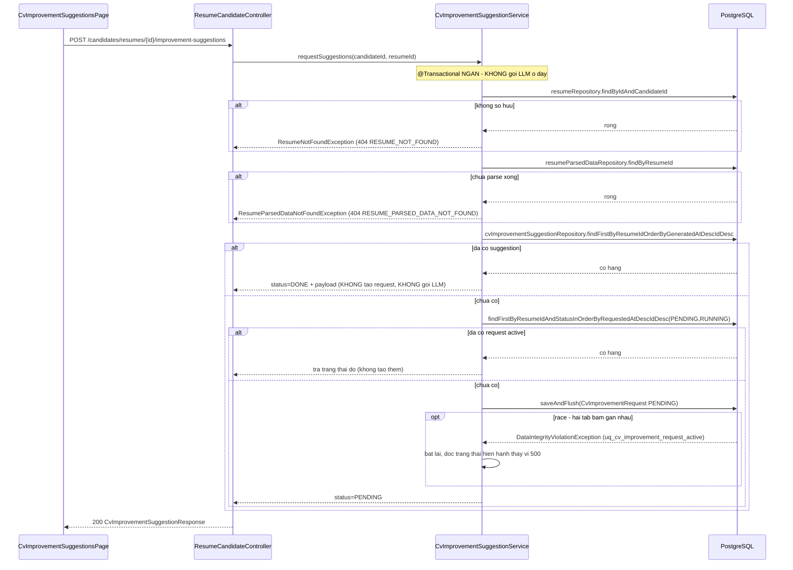
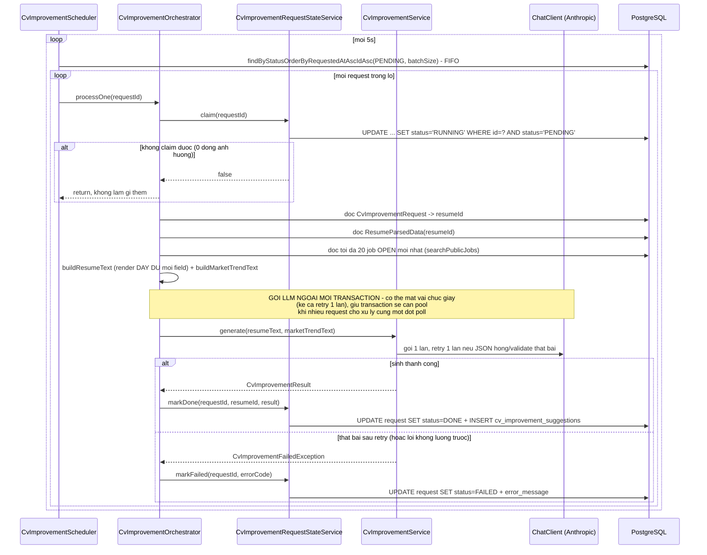

# FR-U05 — Gợi ý cải thiện CV (F2)

Nhánh `feat/fr-u05-cv-improve`, rẽ từ `feat/fr-h08-dashboard` (không phải từ `main`) — chưa gộp vào
`main` tại thời điểm viết tài liệu này.

## 1. Mục tiêu

Ứng viên đã có CV parse xong (D1) muốn biết nên sửa gì để tăng cơ hội trúng tuyển. F2 sinh gợi ý cụ
thể — từ khoá kỹ năng còn thiếu, chỉnh sửa từng mục CV, lộ trình học tập — dựa trên so sánh CV với
thị trường việc làm công khai (mô tả các job `status=OPEN` cùng lĩnh vực, dữ liệu ai cũng xem được
theo FR-C02).

Mâu thuẫn trung tâm của nhánh: dữ liệu **hữu ích nhất** cho việc này, theo nghĩa đen, nằm ở
`criterion_scores`/`score_explanations` (D2/D4) — HR đã chấm từng tiêu chí kèm nhận xét, biết chính
xác ứng viên yếu ở đâu. Nhưng `docs/PHASES.md` mục F2 "AI hay làm sai" cấm thẳng: *"Tiết lộ điểm số
hoặc nhận xét nội bộ của HR cho ứng viên. Ứng viên chỉ được thấy gợi ý cải thiện, không thấy rubric
hay điểm chi tiết."* Toàn bộ kiến trúc F2 xoay quanh việc tôn trọng ranh giới này bằng nhiều lớp độc
lập, không chỉ bằng quy ước "đừng làm vậy" (mục 4a).

## 2. Các file đã tạo/sửa

### Backend — schema (`db/migration/`)

| File | Vai trò |
|---|---|
| `V6__cv_improvement_requests.sql` | Bảng `cv_improvement_requests` (hàng đợi, có cột `status`) + `uq_cv_improvement_request_active` (partial unique index) — **không** đổi gì trên `cv_improvement_suggestions` (V1) |

### Backend — entity/repository (`resume/`)

| File | Vai trò |
|---|---|
| `CvImprovementRequestStatus.java` | Enum 5 giá trị — 4 giá trị thật (`PENDING/RUNNING/DONE/FAILED`) ghi xuống DB, `NOT_REQUESTED` chỉ dùng ở tầng API |
| `CvImprovementRequest.java` | Entity bảng hàng đợi |
| `CvImprovementSuggestion.java` | Entity bảng báo cáo thật (V1) — **không** `unique=true` trên `resumeId` |
| `CvImprovementSectionSuggestion.java` / `CvImprovementLearningPathItem.java` | Record JSONB lồng, tách riêng khỏi payload LLM (mẫu `ExplanationPoint` của D4) |
| `CvImprovementRequestRepository.java` | `claimForProcessing` (`@Modifying`), `findByStatusOrderByRequestedAtAscIdAsc` (FIFO), `findFirstByResumeIdAndStatusInOrderByRequestedAtDescIdDesc`, `findFirstByResumeIdOrderByRequestedAtDescIdDesc` |
| `CvImprovementSuggestionRepository.java` | `findFirstByResumeIdOrderByGeneratedAtDescIdDesc` — lấy đúng bản mới nhất, **không** dùng `findByResumeId` số ít (sẽ ném exception khi có ≥2 hàng) |

### Backend — sinh gợi ý bằng LLM, độc lập DB (`ai/cvimprovement/`, `ai/client/`)

| File | Vai trò |
|---|---|
| `CvImprovementService.java` | `generate(String resumeText, String marketTrendText)` — **chỉ nhận hai String**, không entity/repository, không import gì từ `scoring/` |
| `CvImprovementPayload.java` | Schema JSON LLM phải trả — `missingKeywords`, `sectionSuggestions`, `learningPath` |
| `CvImprovementResult.java` | Bọc `CvImprovementPayload` + `model`/`promptVersion` — **không** `tokenUsage` (bảng đích không có cột đó) |
| `CvImprovementErrorCode.java` / `CvImprovementFailedException.java` | Mã lỗi chuẩn hoá — gồm `INVALID_SECTION`/`INVALID_LEARNING_PATH_ITEM`/`INVALID_MISSING_KEYWORD` (kiểm tập đóng `section` + không rỗng cho các trường tự do) |
| `CvImprovementChatClientConfig.java` | Bean `ChatClient` riêng cho nhiệm vụ này |
| `ai/prompt/cv-improvement-v1.st` | Prompt hệ thống — cấm cụm từ chỉ điểm số/rubric, cấm ám chỉ đã có đánh giá, có "Field-matching rule" tự lọc lĩnh vực |

### Backend — job nền (`resume/`)

| File | Vai trò |
|---|---|
| `CvImprovementRequestStateService.java` | `claim()`, `markDone()`, `markFailed()` — bean ghi riêng, `@Transactional` |
| `CvImprovementOrchestrator.java` | Điều phối một request: claim → đọc dữ liệu → `buildResumeText`/`buildMarketTrendText` → gọi LLM (ngoài transaction) → ghi kết quả |
| `CvImprovementScheduler.java` | `@Scheduled` quét lô mỗi 5 giây (`app.cv-improvement.poll-interval-ms`), FIFO |

### Backend — endpoint cho ứng viên (`resume/`)

| File | Vai trò |
|---|---|
| `CvImprovementSuggestionService.java` | `requestSuggestions`/`getSuggestions` — quyền sở hữu qua `resumeRepository.findByIdAndCandidateId`, idempotent |
| `dto/CvImprovementSuggestionResponse.java` | `resumeId, status, missingKeywords, sectionSuggestions, learningPath, generatedAt` — không `errorMessage`/`model`/`promptVersion` |
| `ResumeCandidateController.java` (sửa) | Thêm `POST`/`GET /api/candidates/resumes/{id}/improvement-suggestions` |

### Cấu hình

| File | Vai trò |
|---|---|
| `application-test.yml` (sửa) | Thêm `app.cv-improvement.enabled: false` — tắt scheduler trong test |

### Frontend (`features/resumes/`, `pages/`)

| File | Vai trò |
|---|---|
| `types.ts` (sửa) | `CvImprovementStatus`, `CvImprovementSectionSuggestion`, `CvImprovementLearningPathItem`, `CvImprovementSuggestion` |
| `api.ts` (sửa) | `requestCvImprovementRequest`, `getCvImprovementRequest` |
| `queries.ts` (sửa) | `useCvImprovementQuery` (poll khi PENDING/RUNNING, hằng số riêng), `useRequestCvImprovementMutation` |
| `CvImprovementSuggestionsPage.tsx` (mới) | Trang gợi ý — 4 nhánh trạng thái, 3 khối kết quả gom nhóm theo `section`, 3 nhánh thông báo lỗi 404 phân biệt theo mã lỗi |
| `App.tsx` (sửa) | Route `/candidate/resumes/:id/improvement-suggestions` |
| `ResumeList.tsx` (sửa) | Nút "Gợi ý cải thiện CV" (icon `Sparkles`) cạnh "Xem dữ liệu đã trích xuất" |

## 3. Luồng chính

F2 có hai luồng tách biệt: **tạo yêu cầu** (đồng bộ, nhanh, không gọi LLM) và **xử lý hàng đợi**
(nền, chậm, nơi thật sự gọi LLM).

### Luồng 1 — Ứng viên bấm "Xin gợi ý cải thiện CV"

### Luồng 2 — Job nền xử lý hàng đợi (nơi gọi LLM)

### Luồng 3 — Ứng viên xem kết quả

`CvImprovementSuggestionsPage` gọi `useCvImprovementQuery` — `refetchInterval` trả về 5000ms khi
`status` là `PENDING`/`RUNNING`, `false` khi `DONE`/`FAILED`/`NOT_REQUESTED` (mẫu y hệt
`useResumesQuery`/`isResumeStalled` của D1, hằng số poll khai riêng — không dùng chung với hằng số
của D1 dù cùng giá trị 5000ms, vì gắn với hai poller backend độc lập). Trang tự chuyển từ "Đang tạo
gợi ý..." sang hiển thị kết quả mà không cần F5 — đã xác nhận bằng test tay.

## 4. Quyết định thiết kế

**(a) BA LỚP PHÒNG THỦ độc lập chống rò rỉ dữ liệu chấm điểm — quyết định quan trọng nhất của nhánh**

- Bối cảnh: như nêu ở mục 1, dữ liệu hữu ích nhất cho gợi ý nằm đúng ở nơi bị cấm lộ. Không có một
  điểm chặn duy nhất nào đủ tin cậy cho việc này — cần nhiều lớp độc lập, mỗi lớp bắt một *loại* rò
  rỉ khác nhau.
- Đã chọn — ba lớp, đều đã chạy xanh:
  1. **Chữ ký service** (`CvImprovementServiceTest`, reflection): `generate()` chỉ nhận `(String,
     String)`; kiểm package của kiểu trả về, package của **mọi** tham số constructor, package của
     **mọi** field khai báo trong class (không chỉ constructor — chặn cả trường hợp lỡ tay inject
     repository qua `@Autowired` field thay vì constructor) — không cái nào bắt đầu bằng
     `com.recruitment.scoring`. Đây là ranh giới ở tầng cấu trúc code, không phải hành vi lúc chạy.
  2. **Prompt gửi LLM** (`CvImprovementOrchestratorTest#processOne_promptSentToLlm_containsNoScoringData`):
     seed `scoring_run`/`criterion_score` **thật** cho một application của cùng candidate (tên tiêu
     chí và `reasoning` là chuỗi nhận dạng được), bắt `Prompt` thật bằng `ArgumentCaptor`, khẳng
     định hai chuỗi đó không xuất hiện ở bất kỳ đâu trong prompt (system + user gộp lại). Bốn từ
     khoá `"criterion"/"rubric"/"weight"/"total_score"` chỉ kiểm trên phần **user message** (dữ
     liệu do `buildResumeText`/`buildMarketTrendText` render) — **không** kiểm trên toàn bộ prompt,
     vì chính system message (`cv-improvement-v1.st`) chứa hợp lệ từ "rubric" trong câu chỉ dẫn cấm
     ("You have NOT been given any score, rubric, evaluation criteria...") — đây là chỉ dẫn, không
     phải dữ liệu rò rỉ; kiểm nhầm phạm vi sẽ làm test đỏ ngay cả khi code đúng.
  3. **Response trả ứng viên** (`CvImprovementSuggestionEndpointTest#getSuggestions_responseBody_doesNotContainScoreOrRubricFields`):
     cùng kỹ thuật seed dữ liệu thật, gọi qua HTTP thật (MockMvc, không mock service), assert trên
     **chuỗi JSON thô** trả về — không chỉ kiểm field theo tên.
- Lựa chọn khác đã loại: tin vào review thủ công + quy ước đặt tên package; hoặc chỉ kiểm một lớp
  (ví dụ chỉ response cuối, bỏ qua chữ ký/prompt).
- Vì sao ba lớp, không phải một: chữ ký sạch không chứng minh nội dung sạch (vẫn có thể copy dữ
  liệu vào một `String` thủ công mà không import gì); prompt sạch không chứng minh response sạch
  (một lỗi ở `StateService` khi map kết quả LLM có thể vô tình lẫn dữ liệu khác vào DTO). Ba lớp
  cùng đỏ chỉ khi cả ba đều bị phá cùng lúc — xác suất một lỗi lọt qua cả ba thấp hơn nhiều lọt qua
  một.

**(b) Mâu thuẫn SRS vs PHASES.md — cố ý bỏ vế "kết quả đánh giá trước đó"**

- SRS FR-U05: *"đối chiếu với xu hướng kỹ năng của thị trường **và kết quả đánh giá trước đó (nếu
  có)**"*. PHASES.md mục F2 "AI hay làm sai": *"Tiết lộ điểm số hoặc nhận xét nội bộ của HR cho
  ứng viên."*
- Đã chọn: chỉ dùng vế "xu hướng thị trường" (mô tả job `OPEN` công khai). Cố ý **không** dùng
  `criterion_scores`/`score_explanations` làm nguồn cho vế "kết quả đánh giá trước đó" dù SRS có
  nhắc tới.
- Vì sao (ba lý do đã chốt ở Plan Mode):
  1. `docs/PHASES.md` là tài liệu vận hành cụ thể hoá SRS cho từng nhánh, viết **sau** SRS, đã tính
     đến rủi ro rò rỉ mà SRS ở mức đặc tả chung chưa lường hết.
  2. Không có cơ chế kiểm chứng được: một bản tóm tắt do AI viết lại từ `reasoning`/`score` không
     đảm bảo không vô tình lộ một con số hay nhận xét nhạy cảm — khác evidence trích dẫn nguyên văn
     của D2, vốn kiểm chứng được bằng so khớp substring với `raw_text` thật.
  3. Hậu quả không đối xứng: bỏ sót vế này chỉ làm gợi ý kém phong phú hơn một chút; đưa vào có thể
     vi phạm nguyên tắc bất di bất dịch của toàn dự án (CLAUDE.md mục 2) — chọn phương án an toàn
     hơn khi rủi ro không cân xứng.
- Lựa chọn khác đã loại: tóm tắt gián tiếp qua D4 (dùng lại `score_explanations.summary` vì đã "an
  toàn hoá" một lần) — vẫn loại, vì D4 tự nhận (comment trong `ScoreExplanationService.validate()`)
  không có căn cứ gốc nào để đối chiếu nội dung tự do của chính nó; tin cậy một tầng tóm tắt thứ hai
  dựa trên một tầng đã không kiểm chứng được là chồng thêm rủi ro, không giảm.

**(c) V6 KHÔNG thêm `UNIQUE` lên `cv_improvement_suggestions`**

- Đã chọn: `V6__cv_improvement_requests.sql` chỉ tạo bảng `cv_improvement_requests` mới +
  `uq_cv_improvement_request_active`, không `ALTER` gì trên `cv_improvement_suggestions`.
- Lựa chọn khác đã loại (và đã tự sửa lại giữa đợt sau khi bị chỉ ra): `ALTER TABLE
  cv_improvement_suggestions ADD CONSTRAINT ... UNIQUE (resume_id)`.
- Vì sao loại: V1 đã có `idx_cv_suggest_resume(resume_id, generated_at DESC)` — một index composite
  kèm `generated_at DESC` chỉ có ý nghĩa khi cho phép **nhiều hàng** mỗi `resume_id`, tức thiết kế
  gốc V1 cố ý cho phép lưu lịch sử nhiều bản. Thêm `UNIQUE` là đảo ngược một quyết định thiết kế
  gốc mà không đủ căn cứ mới. Chống gọi LLM trùng đã đủ chốt ở mục (e) — không cần ràng buộc thứ
  hai cho cùng một mục đích.

**(d) Trigger do ứng viên chủ động, không tự động như D1/D2/D4**

- Đã chọn: sinh gợi ý CHỈ khi ứng viên bấm "Xin gợi ý cải thiện CV" — không tự động ngay khi resume
  đạt `parse_status=DONE`.
- Lựa chọn khác đã loại: tự động sinh gợi ý cho mọi CV vừa parse xong, nối tiếp chuỗi D1→D2/D4.
- Vì sao: D1 tự động vì trigger tự nhiên chính là hành động upload; D2/D3/D4 tự động vì **mọi**
  `application` đều cần được chấm. F2 không có tương đương "mọi resume đều cần gợi ý" — tự động cho
  mọi CV sẽ tốn LLM cho những CV ứng viên không bao giờ xem gợi ý. Chi phí LLM là lý do quyết định.

**(e) Bảng hàng đợi riêng `cv_improvement_requests`, không dùng mẫu bảng-đếm-số-lần-thử của D4**

- Đã chọn: bảng mới có cột `status` đúng nghĩa (`PENDING/RUNNING/DONE/FAILED`) — đóng vai trò tương
  đương `resumes.parse_status` của D1.
- Lựa chọn khác đã loại: mẫu D4 (`score_explanation_attempts`) — bảng phụ chỉ đếm số lần thử THẤT
  BẠI, dựa vào bảng cha sẵn có (`scoring_runs.status=DONE`) làm tín hiệu sẵn sàng.
- Vì sao khác D4: D4 có bảng cha (`scoring_runs`) đã mang trạng thái sẵn có "đã sẵn sàng tổng hợp
  báo cáo chưa" một cách tự nhiên (mọi lượt `DONE` đều cần báo cáo). F2 không có bảng cha nào mang
  trạng thái "đã yêu cầu gợi ý chưa" — trigger là hành động rời rạc của ứng viên (mục d), không
  phải hệ quả tự động của một bảng khác. Cần một bảng có cột `status` đúng nghĩa để tự nó là nguồn
  sự thật của hàng đợi.

**(f) FIFO chống starvation — `findByStatusOrderByRequestedAtAscIdAsc`, khoá cuối `id`**

- Đã chọn: derived query `ORDER BY requestedAt ASC, id ASC`, kết hợp `Pageable(0, batchSize)` ở
  scheduler.
- Lựa chọn khác — **bug thật, đã tự viết sai lúc đầu rồi tự phát hiện và sửa trong cùng đợt**:
  `findByStatus` không có `ORDER BY` nào.
- Vì sao bắt buộc có khoá cuối: `requested_at` là `DEFAULT now()` của Postgres — transaction-scoped
  (CLAUDE.md mục 3c), nhiều hàng tạo trong cùng một transaction có `requested_at` trùng **tuyệt
  đối**. Thiếu khoá cuối, Postgres trả về thứ tự không xác định khi trùng nhau; kết hợp `LIMIT` của
  `Pageable` gây starvation thật — một request `PENDING` có thể bị bỏ qua vô thời hạn khi hàng đợi
  dài hơn `batchSize`. Test `findByStatusOrderByRequestedAtAscIdAsc_returnsOldestFirst` cố tình
  seed 3 request trong **cùng một transaction** để ép đúng tình huống tệ nhất, chứng minh tính xác
  định (determinism) qua khoá cuối `id` — không tự đoán thứ tự bằng cách sort UUID trong Java, vì
  `UUID.compareTo()` của Java và thứ tự byte của kiểu `uuid` trong Postgres có thể không khớp nhau.

**(g) `buildResumeText` render đầy đủ mọi field — lỗi phát hiện qua TEST TAY**

- Bối cảnh: test tay F2 (do chủ dự án thực hiện, ngoài phiên implement) phát hiện LLM khuyên "bổ
  sung năm tốt nghiệp và GPA" cho một CV **đã có** cả hai (09/2016 - 06/2020, GPA 3.2/4.0).
- Nguyên nhân: `buildResumeText` bản đầu chỉ render 12/22 field của `ResumeParsedPayload`, bỏ sót
  10 field — `Contact.phone/address/linkedin` (3), `Education.startDate/endDate/gpa` (3),
  `Experience.startDate/endDate` (2), `Certification.issueDate` (1), `Project.technologies` (1).
  LLM không thấy field nào đó thì tưởng CV thiếu, dù D1 đã trích xuất đầy đủ.
- Đã chọn: render **đầy đủ** mọi field của cả 5 record lồng, giữ nguyên `MAX_RESUME_TEXT_CHARS` và
  thứ tự khối hiện có. Thêm chốt chặn cơ học: `buildResumeText_payloadWithAllFields_rendersEveryField`
  vừa kiểm nội dung (10 giá trị đã bị bỏ sót trước đó) vừa dùng reflection đếm
  `getRecordComponents().length` của cả 5 record — nếu ai thêm field mới vào `ResumeParsedPayload`
  trong tương lai mà quên cập nhật `buildResumeText`, assertion đếm component sẽ đỏ ngay, buộc phải
  sửa cả hai nơi thay vì chỉ một.
- Vì sao không phát hiện bằng test tự động trước đó: mọi test integration/orchestrator sẵn có chỉ
  seed CV mẫu tối giản (1-2 field mỗi mục) — không đủ đa dạng để lộ field bị bỏ sót. `npm run
  build`/`npm run lint`/`mvn test` đều xanh trong suốt quá trình — lỗi này chỉ lộ ra khi đọc kỹ nội
  dung gợi ý thật do LLM thật sinh ra, đúng loại lỗi mà test tự động (mock LLM) không bao giờ chạm
  tới.

**(h) Lọc lĩnh vực do LLM tự làm, không semantic search — GIỚI HẠN ĐÃ BIẾT**

- Đã chọn: gửi tối đa 20 job `OPEN` mới nhất (không lọc theo lĩnh vực ở tầng Java/SQL), kèm chỉ dẫn
  tường minh trong `cv-improvement-v1.st` (mục "Field-matching rule") yêu cầu LLM tự xác định lĩnh
  vực của CV và chỉ dùng tin cùng lĩnh vực, bỏ qua hoàn toàn tin khác lĩnh vực; nếu không có tin nào
  cùng lĩnh vực thì `missingKeywords`/`learningPath` để rỗng.
- Lựa chọn khác đã loại: lọc trước bằng similarity search (embedding, `pgvector`) trước khi đưa vào
  prompt.
- Vì sao: F1 (FR-U04, gợi ý việc làm phù hợp) mới là nhánh có hạ tầng embedding
  (`PgVectorStore`/`EmbeddingModel`) để lọc chính xác theo ngữ nghĩa — F2 làm **trước** F1 trong lộ
  trình, chưa có hạ tầng đó. Đây là giới hạn đã biết, không phải sai sót: lọc bằng chính LLM đọc
  trực tiếp kém chính xác hơn semantic search thật, nhưng đủ dùng cho phạm vi F2 hiện tại và tránh
  tạo phụ thuộc ngược vào một nhánh chưa tồn tại.

## 5. Ràng buộc SRS đã thực thi

| FR / quy ước | Ràng buộc | Thực thi ở đâu |
|---|---|---|
| FR-U05, PHASES.md F2 | AI không được lộ điểm số/rubric/nhận xét nội bộ của HR cho ứng viên | Ba lớp phòng thủ độc lập (mục 4a) |
| FR-U05 (PHASES.md "Xong khi") | Gợi ý cụ thể, hành động được — không chung chung | `cv-improvement-v1.st` yêu cầu 3 loại gợi ý cụ thể; `validate()` chặn `EMPTY_RESULT`/`INVALID_SECTION`/`INVALID_LEARNING_PATH_ITEM`/`INVALID_MISSING_KEYWORD` |
| CLAUDE.md mục 7 | Không gọi LLM đồng bộ trong request người dùng | `requestSuggestions` chỉ tạo hàng đợi (Luồng 1), LLM chỉ gọi ở `CvImprovementScheduler`/`CvImprovementOrchestrator` (Luồng 2) |
| CLAUDE.md mục 7 | Package `ai/` không import `scoring/ScoreAggregator` | `ai/cvimprovement/` không import bất kỳ thứ gì từ `scoring/` (đã soát bằng `srs-guard`, xác nhận bằng reflection test) |
| CLAUDE.md mục 8 | Không nhãn/màu gợi ý phán quyết | Không field `verdict`/`label`/`isQualified`/`passed`/`recommendation`; badge trạng thái chỉ phụ thuộc `status`, không phụ thuộc số liệu |
| Quy ước dự án | Endpoint mới kiểm cả role lẫn quyền sở hữu bản ghi | `CvImprovementSuggestionService.requireOwnedParsedResume` — `resumeRepository.findByIdAndCandidateId`, **không** dùng `ApplicationOwnerService` (đó là phía HR) |
| Quy ước dự án | Ràng buộc "một X đang hoạt động" phải chốt ở DB | `uq_cv_improvement_request_active` (V6) — `CvImprovementSuggestionService` bắt `DataIntegrityViolationException` |
| CLAUDE.md mục 3c | Job nền: state-service ghi riêng, không giữ transaction quanh lời gọi LLM | `CvImprovementOrchestrator` không `@Transactional`; `CvImprovementRequestStateService` transaction ngắn riêng (Luồng 2) |
| CLAUDE.md mục 3c | Claim bằng `UPDATE` có điều kiện, không `SELECT FOR UPDATE` | `claimForProcessing` — `UPDATE ... WHERE status='PENDING'`, `@Modifying(clearAutomatically=true)` |
| FR-U02 | Chỉ CV đã qua consent mới được AI phân tích | Không áp dụng — consent của FR-U02 là đồng ý cho **HR** (bên thứ ba) đọc CV để ra quyết định tuyển dụng. F2 là ứng viên **tự yêu cầu** phân tích CV của **chính mình**, kết quả chỉ họ thấy, không ai khác đọc được — khác bản chất với tình huống FR-U02 nhắm tới. Chính hành động bấm "Xin gợi ý cải thiện CV" đã là sự đồng ý tường minh cho hành động đó, không cần thêm một cơ chế consent riêng |

## 6. Đã kiểm thử gì

**Backend tự động** — `mvn test` (toàn bộ suite): **391/391 pass, BUILD SUCCESS** (362 trước nhánh
này + 29 test mới của F2):
- Migration/entity/repository (12 test): claim query, unique index chặn 2 request active cùng
  resume, `WHERE` clause cho phép bấm lại sau `FAILED`, FIFO chống starvation (ép trùng
  `requested_at` trong cùng transaction), chọn đúng bản mới nhất khi nhiều `suggestion` cùng resume.
- `ai/cvimprovement` (9 test): chữ ký reflection (mục 4a lớp 1); mock `ChatModel`: retry đúng 1 lần
  khi JSON hỏng, `EMPTY_RESULT`, `INVALID_SECTION` (2 nhánh: sai tên mục / `suggestion` rỗng),
  `INVALID_LEARNING_PATH_ITEM`, `INVALID_MISSING_KEYWORD`, `LLM_ERROR` không retry.
- Job nền (7 test): case dương lưu đúng, LLM lỗi cả 2 lần → `FAILED`, gọi lại sau thành công là
  no-op, request không `PENDING` thì bỏ qua, không job `OPEN` nào vẫn chạy được (test hàm thuần,
  không phụ thuộc trạng thái DB toàn cục của suite), prompt không chứa dữ liệu chấm điểm (mục 4a
  lớp 2), render đầy đủ field CV (mục 4g, kèm chốt chặn reflection).
- Endpoint (7 test): 404 khi chưa parse, tạo request idempotent, 404 khi không sở hữu, đã có
  suggestion thì không gọi LLM lại, `NOT_REQUESTED`, `DONE` sau khi orchestrator xử lý, response
  không chứa dữ liệu chấm điểm (mục 4a lớp 3).

**Frontend** — `npm run build` (`tsc -b && vite build`) và `npm run lint` đều sạch xuyên suốt Đợt 6
và toàn bộ các bản sửa lỗi phát hiện qua test tay.

**Test tay** — 8 bước, **do chủ dự án thực hiện, ngoài phiên implement**, với backend chạy thật và
`ANTHROPIC_API_KEY` thật (không phải key giả `dummy-key-for-test` trong test tự động):
1. Đăng nhập ứng viên đã có CV parse xong.
2. Vào trang hồ sơ, tìm nút "Gợi ý cải thiện CV" — đúng nhãn, đúng điều kiện hiện.
3. Bấm sang trang gợi ý — hiện đúng tên CV, đúng trạng thái ban đầu.
4. Bấm "Xin gợi ý cải thiện CV" — chuyển "Đang tạo gợi ý..." rồi tự chuyển sang kết quả, không cần
   F5.
5. Đọc kỹ nội dung gợi ý — không chứa điểm số/rubric/ám chỉ đã có ai đánh giá; lọc đúng lĩnh vực.
6. Bấm lại sau khi đã `DONE` — không tạo request mới, không gọi LLM lần hai (idempotent).
7. Truy cập CV của tài khoản khác qua URL trực tiếp — 404 xử lý đúng, không lộ tên file.
8. Truy cập CV chưa/không parse xong qua URL trực tiếp — thông báo đúng ngữ cảnh, không mã lỗi kỹ
   thuật.

Bốn lỗi thật bắt được trong quá trình làm nhánh — ba qua test tay, một qua review diff trước khi
ghi file (không lộ ra qua `build`/`lint`/`mvn test` ở cả bốn trường hợp):
1. *(review diff)* Nhãn nút ở `ResumeList.tsx` ban đầu là "Xin gợi ý cải thiện CV" (động từ) trong
   khi nút đó chỉ điều hướng sang trang khác, không gọi API — bấm xong sang trang lại thấy đúng nút
   cùng tên, phải bấm hai lần cho một hành động, gây bối rối. Đổi thành "Gợi ý cải thiện CV" (danh
   từ, mô tả nơi đến); nút trong trang giữ nguyên "Xin gợi ý cải thiện CV" (động từ) vì đó mới là
   hành động gọi API thật.
2. *(test tay)* `buildResumeText` bỏ sót 10 field — LLM khuyên "bổ sung GPA" cho CV đã có GPA (mục
   4g).
3. *(test tay)* Tiêu đề `section` lặp lại liên tiếp trong khối "Gợi ý chỉnh sửa từng mục" — lỗi
   hiển thị thuần tuý, sửa bằng gom nhóm ở tầng hiển thị (`CvImprovementSuggestionsPage.tsx`),
   không đụng backend/prompt.
4. *(test tay)* Hai tình huống 404 khác ngữ cảnh (không sở hữu vs chưa parse xong) dùng chung một
   câu vô nghĩa "Không tải được trạng thái gợi ý, vui lòng thử lại" — sửa bằng phân biệt theo mã
   lỗi (`error` field của `ErrorResponse`), không hiển thị mã lỗi kỹ thuật cho người dùng.

**Chưa test**:
- Nhánh `FAILED` của LLM (JSON hỏng/validate thất bại) đã được phủ đầy đủ bằng test tự động (mock
  `ChatModel`), nhưng nút "Thử lại" trên giao diện **chưa kiểm thử tay được** với API key Anthropic
  thật — model gần như luôn trả JSON hợp lệ đúng schema, không có cách ép LLM thật trả lỗi một cách
  tin cậy để dựng thủ công trạng thái `FAILED` qua giao diện.
- Chưa test race condition thật cho `uq_cv_improvement_request_active` (hai request HTTP đồng thời
  thật sự) — test hiện có gọi tuần tự.
- Chưa kiểm thử trên trình duyệt/thiết bị khác ngoài môi trường đã dùng để test tay.

## 7. Nợ kỹ thuật

**Kế thừa nguyên vẹn từ D1** (không thuộc phạm vi nhánh này): không có stale-claim reaper cho
request bị kẹt `RUNNING` nếu JVM chết giữa chừng — cùng khoản nợ đã ghi nhận ở D1/D2, giờ áp dụng
thêm cho `cv_improvement_requests`.

**Không phải nợ, là hạn chế có chủ đích** (đã giải thích ở mục 4, không lặp lại): bỏ vế "kết quả
đánh giá trước đó" của SRS FR-U05; không thêm `UNIQUE` lên `cv_improvement_suggestions`; trigger
chủ động thay vì tự động; lọc lĩnh vực bằng LLM thay vì semantic search.

**Phát sinh mới ở F2**:
1. `ApplicationHistoryEntryResponse.note` trả cho ứng viên (endpoint `GET
   /api/candidates/applications/{id}/history`, thuộc F3 không phải F2) — đã xác minh **hiện an
   toàn**: cả 4 điểm ghi trong toàn bộ codebase (`ApplicationService.apply/withdraw`,
   `ApplicationStatusService.changeStatus`, gọi gián tiếp từ `InterviewInvitationService`) đều
   truyền `null` literal, không có đường nào cho HR nhập `note` tự do. Khi tương lai cho HR nhập
   `note`, phải bỏ field này khỏi DTO hoặc tách DTO riêng cho ứng viên. Chưa có integration test
   HTTP nào phủ endpoint này (chỉ có unit test service). Phát hiện trong lúc khảo sát Plan Mode của
   nhánh này, không phải lỗi do F2 gây ra, nhưng ghi nhận lại theo đúng chỉ định ban đầu.
2. Nút "Thử lại" trạng thái `FAILED` chưa kiểm thử tay với LLM thật (mục 6).
3. Chưa test race condition thật cho `uq_cv_improvement_request_active` (mục 6).
4. Danh sách 20 job `OPEN` mới nhất lấy không lọc theo lĩnh vực ở tầng SQL (mục 4h) — nếu hệ thống
   có rất nhiều job đa dạng lĩnh vực, 20 tin mới nhất có thể không đủ đại diện cho lĩnh vực của một
   CV cụ thể. Rủi ro đã lường trước, ghi lại để theo dõi khi hệ thống có nhiều job hơn.
