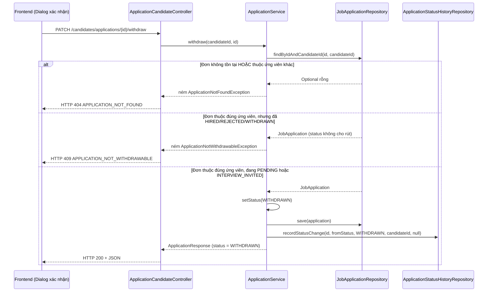

# FR-U06 — Ứng viên rút đơn ứng tuyển

## 1. Mục tiêu

Một ứng viên có thể đổi ý sau khi đã nộp đơn (ví dụ nhận việc nơi khác) và muốn chủ động rút
đơn đó lại, miễn là kết quả cuối cùng (Trúng tuyển / Bị từ chối) chưa được đưa ra. Nhánh này
thêm đúng một hành động mới cho vòng đời đơn ứng tuyển đã có sẵn từ FR-U02/FR-U03: chuyển
trạng thái đơn sang "Đã rút đơn". Đây là đổi trạng thái, không phải xoá — bản ghi đơn, điểm số
đã chấm (nếu có) và lịch sử vẫn còn nguyên, vì thống kê của HR (FR-H08) cần đếm cả đơn đã rút để
tỷ lệ chuyển đổi không bị sai lệch.

## 2. Các file đã tạo/sửa

### Backend

| File | Vai trò |
|---|---|
| `common/exception/ApplicationNotWithdrawableException.java` | Exception mới — ném khi đơn đang ở trạng thái không cho phép rút (đã Trúng tuyển, Bị từ chối, hoặc đã rút rồi) |
| `common/exception/GlobalExceptionHandler.java` | Thêm handler biến exception trên thành HTTP 409; sửa nội dung thông báo lỗi 409 khi nộp trùng đơn (`APPLICATION_DUPLICATE`) để nói rõ đơn đã rút vẫn tính vào chu kỳ hiện tại |
| `jobapplication/ApplicationService.java` | Thêm phương thức `withdraw(candidateId, applicationId)` |
| `jobapplication/ApplicationCandidateController.java` | Thêm endpoint `PATCH /api/candidates/applications/{id}/withdraw` |
| `test/.../ApplicationServiceTest.java` | Thêm 3 test đơn vị cho `withdraw()` |

### Frontend

| File | Vai trò |
|---|---|
| `features/applications/api.ts` | Thêm hàm gọi API `withdrawApplicationRequest` |
| `features/applications/queries.ts` | Tách hằng số `MY_APPLICATIONS_QUERY_KEY` (trước đây viết trực tiếp trong `useMyApplicationsQuery`); thêm `useWithdrawApplicationMutation` |
| `pages/CandidateApplicationsPage.tsx` | Thêm nút "Rút đơn" trong bảng đơn và hộp thoại (dialog) xác nhận trước khi rút |

## 3. Luồng chính

### Luồng — Ứng viên rút một đơn đang chờ duyệt hoặc đã mời phỏng vấn

Các bước cụ thể ở nhánh "thành công":

1. Ứng viên bấm nút "Rút đơn" trên trang "Đơn ứng tuyển của tôi" → mở hộp thoại xác nhận nêu rõ
   hành động không thể hoàn tác và không nộp lại được vị trí đó trong đợt tuyển hiện tại.
2. Bấm "Xác nhận rút đơn" → gọi `withdrawApplicationRequest`, gửi
   `PATCH /api/candidates/applications/{id}/withdraw` (JWT được `axios` interceptor tự đính vào
   header, giống mọi request khác).
3. `SecurityConfig` chặn theo tiền tố đường dẫn: chỉ tài khoản vai trò CANDIDATE mới qua được
   `/api/candidates/**`.
4. `ApplicationCandidateController.withdraw()` đọc `candidateId` từ token, gọi
   `ApplicationService.withdraw(candidateId, id)`.
5. Service dùng lại đúng phương thức kiểm tra quyền sở hữu đã có từ FR-U03
   (`findByIdAndCandidateId`) — đơn không tồn tại hoặc của người khác đều trả về cùng một lỗi
   404, không phân biệt hai trường hợp.
6. Nếu đơn tồn tại và thuộc đúng người gọi, service kiểm tra trạng thái hiện tại: chỉ cho phép
   khi đang `PENDING` hoặc `INTERVIEW_INVITED`.
7. Nếu hợp lệ: đổi `status` thành `WITHDRAWN`, lưu lại, rồi gọi `recordStatusChange` — đúng
   phương thức ghi lịch sử duy nhất mà FR-U03 đã dựng sẵn cho mục đích này. Toàn bộ bước 6-7 nằm
   trong một transaction (`@Transactional`) — nếu bước lưu đơn thất bại, dòng lịch sử cũng không
   được tạo.
8. Trả về đơn đã cập nhật. Frontend, khi nhận thành công, gọi `queryClient.invalidateQueries`
   trên đúng khoá truy vấn của danh sách "đơn của tôi" — bảng tự tải lại, badge đổi sang "Đã rút
   đơn" mà không cần tải lại trang.

## 4. Quyết định thiết kế

**Không đổi `recordStatusChange` sang non-private, gọi trực tiếp trong cùng `ApplicationService`**
· Lựa chọn khác: tách phần ghi lịch sử ra một class dùng chung, hoặc đổi visibility thành
package-private/public để một service khác (ví dụ phía HR) cũng gọi được
· Vì sao: walkthrough của FR-U03 từng nêu nợ kỹ thuật là `recordStatusChange` chỉ dùng được nếu
tính năng tiếp theo nằm trong cùng `ApplicationService`. FR-U06 đúng là trường hợp đó — rút đơn
là hành động của ứng viên, thuộc `ApplicationCandidateController`/`ApplicationService`, cùng gói
với `apply()`. Không cần đổi gì cả. Món nợ "cần lộ phương thức ra ngoài" vẫn còn nguyên và sẽ
phải giải quyết ở FR-H07 (HR đổi trạng thái, chắc chắn nằm ở một service khác phía HR).

**Chỉ cho rút khi đang `PENDING` hoặc `INTERVIEW_INVITED`, không dùng máy trạng thái tổng quát**
· Lựa chọn khác: viết một hàm kiểm tra chuyển trạng thái dùng chung cho mọi transition (kiểu
`Map<trạng_thái_hiện_tại, Set<trạng_thái_cho_phép>>`), dùng lại cho cả FR-H07 sau này
· Vì sao: FR-H07 (máy trạng thái đầy đủ cho HR: mời phỏng vấn, từ chối, xác nhận trúng tuyển)
chưa được triển khai ở nhánh nào. Xây một cơ chế dùng chung cho một quy tắc duy nhất
("WITHDRAWN chỉ đến từ 2 trạng thái") là làm trước phần việc của một mã FR khác — đúng điều mà
quy trình làm việc của dự án này cấm ("chỉ làm đúng một mã FR"). Một điều kiện `if` đơn giản là
đủ và dễ đọc hơn cho phạm vi hiện tại.

**Mã lỗi cho "không rút được" là 409, không phải 400**
· Lựa chọn khác: 400 Bad Request (coi như request không hợp lệ)
· Vì sao: đây không phải lỗi định dạng của request (request gửi lên hoàn toàn hợp lệ: một UUID
đơn có thật), mà là xung đột giữa hành động được yêu cầu và trạng thái hiện tại của tài nguyên
trên server — đúng ngữ nghĩa HTTP 409 Conflict, và cũng nhất quán với cách dự án này đã xử lý các
xung đột trạng thái khác (`RUBRIC_LOCKED`, `APPLICATION_DUPLICATE` đều dùng 409).

**Thông báo lỗi của `ApplicationNotWithdrawableException` không chứa UUID đơn hay tên trạng thái
enum thô**
· Lựa chọn khác: nội suy UUID và tên enum vào message, kiểu "Không thể rút đơn `<uuid>` vì đang ở
trạng thái `HIRED`"
· Vì sao: message của exception này đi thẳng ra `ErrorResponse.message` và hiển thị cho ứng viên
trên giao diện (qua hàm `extractErrorMessage` ở frontend). Một UUID nội bộ hay tên hằng số enum
tiếng Anh không có ý nghĩa với người dùng cuối, chỉ nên xuất hiện trong log nếu cần điều tra sau
này — không phải trong nội dung hiển thị.

**Sửa `GlobalExceptionHandler` để đổi nội dung thông báo `APPLICATION_DUPLICATE`, không đổi mã
lỗi hay HTTP status**
· Lựa chọn khác: giữ nguyên message cũ ("Bạn đã ứng tuyển vị trí này rồi")
· Vì sao: ràng buộc `uq_application_per_cycle` ở tầng DB (từ FR-U02) không phân biệt đơn đang
hoạt động hay đã rút — cùng job, cùng ứng viên, cùng chu kỳ tuyển dụng là bị chặn nộp lại, dù
đơn cũ đã `WITHDRAWN`. Đây là hệ quả trực tiếp của việc không viết migration mới ở nhánh này
(xem mục 7). Người dùng gặp lỗi 409 mà không hiểu "đơn tôi rút rồi mà sao không nộp lại được"
là một trải nghiệm khó hiểu — sửa message để giải thích thẳng lý do, không cần đổi hành vi.

**Tách `MY_APPLICATIONS_QUERY_KEY` thành hằng số dùng chung trong `queries.ts`**
· Lựa chọn khác: viết lại chuỗi khoá truy vấn `['my-applications']` trực tiếp ở chỗ gọi
`invalidateQueries`, giống cách `queryKey` của `useMyApplicationsQuery` đang được viết
· Vì sao: TanStack Query so khớp khoá truy vấn theo giá trị mảng, không báo lỗi biên dịch nếu hai
chỗ viết lệch nhau (ví dụ gõ nhầm `'my-application'` thiếu chữ *s*) — sai sót kiểu này chỉ lộ ra
khi chạy thử bằng tay và thấy danh sách không tự cập nhật, rất khó phát hiện qua test tự động.
Tách thành một hằng số dùng ở cả hai nơi loại bỏ khả năng đó, theo đúng khuôn mẫu
`RESUMES_QUERY_KEY` đã có sẵn ở `features/resumes/queries.ts`.

## 5. Ràng buộc SRS đã thực thi

| FR / quy ước | Ràng buộc | Thực thi ở đâu |
|---|---|---|
| FR-U06 | Rút đơn là đổi trạng thái, không xoá dữ liệu | `ApplicationService.withdraw` chỉ gọi `setStatus`+`save`, không có lệnh xoá nào; bảng `job_applications`, `scoring_runs`, `criterion_scores` không bị đụng tới |
| FR-U06 | Chỉ rút được trước khi có kết quả cuối cùng | `ApplicationService.withdraw` — điều kiện `fromStatus == PENDING \|\| fromStatus == INTERVIEW_INVITED`, còn lại ném `ApplicationNotWithdrawableException` |
| Tiêu chí nghiệm thu C4 (`docs/PHASES.md`) | Không rút được đơn đã `HIRED`/`REJECTED` | Cùng điều kiện trên; có test riêng cho trường hợp `HIRED` |
| Tiêu chí nghiệm thu C4 (`docs/PHASES.md`) | Sau khi rút, bản ghi và điểm số vẫn còn | Không có test tự động riêng cho việc "điểm số vẫn còn" (nhánh này chưa có scoring để kiểm), nhưng vì `withdraw()` không đụng bảng `scoring_runs`/`criterion_scores` nên không thể làm mất dữ liệu đó |
| Kế thừa từ FR-U03 | Mọi lần đổi trạng thái đều sinh một dòng lịch sử | `ApplicationService.withdraw` gọi lại đúng `recordStatusChange` đã dựng ở FR-U03 |
| RBAC (mọi endpoint) | Không tin việc UI đã ẩn nút, phải chặn ở tầng API | `SecurityConfig`: `/api/candidates/**` → `hasRole("CANDIDATE")`; nút "Rút đơn" trên UI chỉ là tiện ích hiển thị, không phải lớp bảo vệ duy nhất |
| Kiểm tra quyền sở hữu | Không rút được đơn của ứng viên khác | Dùng lại `JobApplicationRepository.findByIdAndCandidateId` — luôn trả 404 cho cả "không tồn tại" và "của người khác" |
| CLAUDE.md mục 7 | Không đổi `ddl-auto`, không viết migration nếu không thật sự cần | `uq_application_per_cycle` giữ nguyên, không có file `V2__` nào được tạo |
| CLAUDE.md mục 7 | Không tạo cột/field `verdict`/`label`/`isQualified`/`passed` | Đã soát bằng skill `srs-guard` trước khi viết tài liệu này — không có vi phạm |
| Ranh giới `ai/` | `ai/` không được đụng `scoring/ScoreAggregator` | Nhánh này không chạm tới package `ai/` hay `scoring/` |

## 6. Đã kiểm thử gì

**Đã test:**
- `ApplicationServiceTest` (JUnit + Mockito) — 3 test mới:
  - Rút đơn từ `PENDING` thành công: kiểm tra response trả `status = WITHDRAWN`, và
    `recordStatusChange` được gọi đúng tham số (`fromStatus = PENDING`, `toStatus = WITHDRAWN`,
    `changedBy = candidateId`, `note = null`).
  - Rút đơn đang `HIRED`: xác nhận ném `ApplicationNotWithdrawableException`, và xác nhận
    `applicationRepository.save` **không** được gọi (trạng thái không bị đổi khi từ chối).
  - Rút đơn của ứng viên khác: xác nhận ném `ApplicationNotFoundException`.
- Chạy lại toàn bộ 73 test có sẵn của dự án (gồm cả 2 test cũ của `ApplicationServiceTest`,
  `ApplicationIntegrationTest` từ FR-U02) — tất cả pass, không có test nào bị hỏng bởi thay đổi
  này.
- `npm run lint` và `npm run build` (kiểm tra kiểu dữ liệu TypeScript qua `tsc -b` + đóng gói qua
  Vite) — không lỗi.
- Đã chạy skill `srs-guard` soát 8 nguyên tắc bắt buộc của dự án trên toàn bộ nhánh — không phát
  hiện vi phạm.
- Đã kiểm thử bằng tay trên trình duyệt (`npm run dev`) và **đạt** các kịch bản sau: nút "Rút
  đơn" chỉ hiện ở đơn đang `PENDING`, không hiện ở đơn đã `WITHDRAWN`; hộp thoại xác nhận hiển
  thị đúng cả hai cảnh báo (không thể hoàn tác, không nộp lại được vị trí này trong đợt tuyển
  hiện tại) kèm đúng tên vị trí của đơn đang thao tác; sau khi bấm "Xác nhận rút đơn", badge trên
  bảng đổi ngay sang "Đã rút đơn" mà không cần tải lại trang, và nút "Rút đơn" của dòng đó biến
  mất; mở lại timeline của đơn đã rút hiện đủ hai dòng lịch sử — Nộp đơn → Chờ duyệt, rồi Chờ
  duyệt → Đã rút đơn — đúng mốc thời gian; nộp lại đơn cho cùng job đã rút nhận đúng thông báo
  `APPLICATION_DUPLICATE` mới (nêu rõ đơn đã rút vẫn tính vào chu kỳ hiện tại).

**Chưa test:**
- Chưa có test tích hợp (gọi qua HTTP thật, có `SecurityConfig` thật) cho endpoint `PATCH
  /candidates/applications/{id}/withdraw` — test hiện tại chỉ kiểm tra logic ở tầng service bằng
  đối tượng giả lập (Mockito), chưa xác nhận toàn bộ chuỗi (mã lỗi HTTP thật trả về, format JSON
  thật của `ErrorResponse`) khi đi qua cả `SecurityConfig` và `GlobalExceptionHandler`.
- Chưa test trường hợp gọi rút đơn hai lần liên tiếp cho cùng một đơn (lần hai phải nhận 409 vì
  đơn đã `WITHDRAWN` từ lần một) — về logic thì `withdraw()` xử lý đúng (WITHDRAWN không nằm
  trong danh sách trạng thái được phép rút), nhưng chưa có test tự động khẳng định riêng trường
  hợp này.

## 7. Nợ kỹ thuật

- Ứng viên đã rút đơn thì **không thể nộp lại** cùng job trong cùng chu kỳ tuyển dụng, vì ràng
  buộc `uq_application_per_cycle` không phân biệt trạng thái đơn. Đây là quyết định đã chốt từ
  đầu (không viết migration mới ở nhánh này), nhưng là một hạn chế thật sự về mặt sản phẩm: một
  ứng viên rút đơn do bấm nhầm sẽ không còn cách nào ứng tuyển lại vị trí đó cho tới khi HR mở
  một chu kỳ tuyển dụng mới (đổi trạng thái job từ `CLOSED` về `OPEN` lại). Nếu sau này đây là
  vấn đề thật, cách sửa đúng là đổi ràng buộc unique ở tầng DB để loại trừ trạng thái `WITHDRAWN`
  (cần một migration `V2__` mới, không được sửa `V1__`).
- `recordStatusChange` vẫn còn `private` trong `ApplicationService`, đúng như nợ kỹ thuật đã ghi
  từ walkthrough FR-U03. FR-U06 dùng được vì nằm cùng lớp, nhưng FR-H07 (HR đổi trạng thái) gần
  như chắc chắn cần một service khác — khi làm nhánh đó vẫn phải quay lại quyết định đổi
  visibility hoặc tách phần ghi lịch sử ra class riêng.
- Chưa có cơ chế thông báo (FR-C03 — Phase E) khi đơn bị rút. HR hiện không nhận được bất kỳ
  thông báo nào khi một ứng viên tự rút đơn khỏi tin tuyển dụng của mình; đây là việc của một
  nhánh khác, chưa triển khai ở đâu cả.
