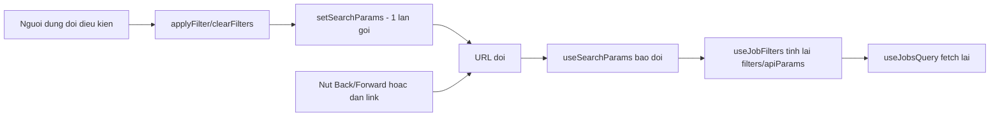

# FR-U07 — Bộ lọc tìm việc nâng cao

> Nhánh: `feat/fr-u07-job-filter`. Đặc tả: `docs/features/UV/U07/REQUIREMENT.md` +
> `docs/features/UV/U07/UI.md` (ĐÃ DUYỆT 02/10/2026, chuyển ĐÃ HOÀN THÀNH ở đợt này).

## Lệch so với đặc tả CHƯA được duyệt lại

Không có. Hai điểm lệch phát sinh trong lúc code đều đã được duyệt bổ sung trước khi commit:

1. **Ngoại lệ REMOTE không gắn nhãn "Chưa chuẩn hoá"** (R-N4) — duyệt bổ sung 02/10/2026, trước khi
   viết test đợt 2.
2. **Ô logo trống dùng icon `Building2` thay vì chữ viết tắt** — phát hiện khi soát tay 02/10/2026
   (chữ viết tắt 2 ký tự đầu luôn ra "CÔ" vì mọi tên công ty đều bắt đầu bằng "Công ty", vô nghĩa
   với mọi tin) — đã sửa code và REQUIREMENT.md/UI.md (R-L1, mục 4c/5/7/9) ngay trong đợt cuối, ghi
   rõ "điều chỉnh sau soát tay 02/10/2026" tại từng chỗ sửa.

Xem thêm mục 8 bên dưới.

## 1. Mục tiêu

Trang danh sách việc làm công khai trước đây chỉ có một ô tìm theo tên vị trí, lọc rời rạc theo
chuỗi "ngành nghề"/"tỉnh thành" cũ (so khớp chuỗi, không chuẩn). FR này thêm một thanh lọc nhiều
điều kiện kết hợp — ngành nghề/tỉnh thành theo mã danh mục chuẩn hoá (tái dùng từ FR-C05), khoảng
lương, hình thức làm việc, thời gian đăng, sắp xếp — và giữ toàn bộ trạng thái bộ lọc trên URL để
người dùng chia sẻ/bookmark được, dùng nút Back/Forward của trình duyệt đúng như mong đợi. Đồng
thời sửa 3 lỗi UI đã ghi nợ ở `ROADMAP.md` Phase 2.1b (màu chữ lương không đạt tương phản, hạn nộp
đặt sai vị trí, ô logo trống không có nội dung) và gộp hai trang danh sách việc làm (khách/ứng
viên) vốn trùng lặp code thành một component dùng chung.

## 2. Các file đã tạo/sửa

**Backend**

| File | Vai trò |
|---|---|
| `job/PublicJobSearchCriteria.java` | Record gom các điều kiện lọc "cứng" (mã ngành/tỉnh, lương, hình thức, ngưỡng thời gian) — điểm nối dùng chung cho FR-U15 sau này (R-Q1) |
| `job/JobSortOption.java` | Enum `NEWEST`/`SALARY_DESC`, parse từ tham số `sort`, 400 khi giá trị lạ |
| `job/JobPostedWithin.java` | Enum `LAST_24H`/`LAST_7D`/`LAST_30D`, quy đổi ra số giờ để tính ngưỡng thời gian ở Java |
| `common/exception/InvalidJobFilterException.java` | Exception 400 `INVALID_JOB_FILTER` dùng chung cho mọi lỗi tham số lọc mới (lương âm, `salaryMin > salaryMax`, `workMode`/`sort`/`postedWithin` sai giá trị) |
| `job/JobPublicService.java` | Validate tham số, quy đổi lương sang VNĐ, tính ngưỡng thời gian bằng `Clock`, build `PublicJobSearchCriteria`, gọi đúng một trong hai truy vấn theo `sort` |
| `job/JobRepository.java` | Hằng số `PUBLIC_JOB_FILTER_WHERE` dùng chung cho hai truy vấn `ORDER BY` cố định và `countQuery`; thêm `searchOpenJobsNewest` thay cho `searchPublicJobs` cũ (đã xoá) |
| `job/JobPublicController.java` | Nhận thêm các tham số query mới, forward xuống service |
| `resume/CvImprovementOrchestrator.java` | Đổi gọi `searchOpenJobsNewest` thay vì `searchPublicJobs` đã xoá (không đổi hành vi nghiệp vụ, chỉ đổi tên nguồn dữ liệu + tiêu chí sắp xếp nhất quán với R-T1) |
| `common/exception/GlobalExceptionHandler.java` | Thêm case dịch `InvalidJobFilterException` sang HTTP 400 |
| `test/job/FixedClockTestConfiguration.java` | `@TestConfiguration` cung cấp `Clock` cố định cho test ngưỡng thời gian |
| `test/job/JobPublicIntegrationTest.java`, `JobPublicServiceTest.java` | Toàn bộ test mới cho 10 nhóm quy tắc lọc + giữ nguyên test cũ |

**Frontend**

| File | Vai trò |
|---|---|
| `features/jobs/useJobFilters.ts` | Hook đọc/ghi toàn bộ trạng thái bộ lọc qua `useSearchParams` — URL là nguồn sự thật duy nhất |
| `features/jobs/JobFilterBar.tsx` | Thanh lọc desktop + bottom sheet mobile, dùng `useJobFilters` |
| `features/jobs/JobBoard.tsx` | Component dùng chung cho `/` và `/candidate`: ghép `JobFilterBar` + `JobList`, gọi `useJobsQuery` đúng một lần |
| `features/jobs/api.ts` | Tự dựng `URLSearchParams` thay vì để axios serialize object (xem mục 4.5) |
| `features/jobs/JobCard.tsx` | Sửa màu lương, vị trí hạn nộp, ô logo trống (icon `Building2`) |
| `features/jobs/UnnormalizedBadge.tsx` | Sửa lại comment mô tả phạm vi dùng (không còn "CHỈ phía HR") |
| `pages/PublicJobListPage.tsx`, `pages/CandidateJobListPage.tsx` | Rút gọn còn bọc layout quanh `JobBoard` |
| `pages/PublicJobDetailPage.tsx` | Chọn layout theo vai trò đăng nhập (R-L2), đổi màu chữ lương |
| `features/jobs/HeroSearch.tsx` | Xoá (thay bằng `JobFilterBar`) |

**Tài liệu/dữ liệu**

| File | Vai trò |
|---|---|
| `db/seed/seed-demo-structural.sql` | 6 job demo chuyển `DRAFT` → `OPEN`, rải `published_at` qua đủ các mốc `postedWithin` |
| `db/seed/README.md` | Cập nhật số liệu đo thật sau khi nạp lại seed |

## 3. Luồng chính

**Luồng lọc danh sách việc làm (cả `/` lẫn `/candidate`)**

1. `JobBoard` gọi `useJobFilters()` để đọc `filters`/`apiParams` từ URL hiện tại, và `useJobsQuery(apiParams)` để lấy dữ liệu.
2. `JobFilterBar` cũng tự gọi `useJobFilters()` độc lập (không nhận props từ `JobBoard`) — an toàn vì `useSearchParams`/React Query đều là state dùng chung toàn ứng dụng, gọi hai lần vẫn đọc đúng cùng một URL.
3. Người dùng đổi một điều kiện (ví dụ chọn ngành nghề) → `JobFilterBar` gọi `applyFilter({ categoryCode: '...' })` → `useJobFilters.applyFilter` dựng `URLSearchParams` mới, xoá `page`, gọi `setSearchParams` đúng một lần (R-U6) → URL đổi → React Router re-render → `useJobFilters` đọc lại URL mới → `apiParams` đổi → React Query tự fetch lại.
4. `features/jobs/api.ts#searchJobsRequest` tự dựng `URLSearchParams` (không giao cho axios serialize object) rồi gọi `GET /api/public/jobs`.
5. `JobPublicController` nhận tham số, forward xuống `JobPublicService.search(...)`.
6. `JobPublicService`: validate mã danh mục qua `CatalogRegistry`, validate `workMode`/`sort`/`postedWithin`/lương (400 `INVALID_JOB_FILTER`/`INVALID_CATALOG_CODE` nếu sai), quy đổi lương triệu → VNĐ, tính `sinceTimestamp = clock.instant().minus(...)`, build `PublicJobSearchCriteria`, gọi `searchByCriteria`.
7. `searchByCriteria` chọn đúng một trong hai phương thức `JobRepository.searchPublicJobsSortedByNewest`/`searchPublicJobsSortedBySalaryDesc` theo `sort` — cả hai cùng dùng chung hằng số `PUBLIC_JOB_FILTER_WHERE`, chỉ khác `ORDER BY`.
8. Kết quả `Page<Job>` → map sang `JobSummaryResponse` (kèm nhãn danh mục qua `JobCatalogFields`) → trả về frontend.
9. `JobList` render từng `JobCard`, truyền `filterContext` (ngành/tỉnh/lương có đang lọc hay không) để quyết định có hiện nhãn "Chưa chuẩn hoá"/chú thích ngoại tệ hay không (R-N3/R-N4/R-S5).

**Luồng đồng bộ URL hai chiều (Back/Forward, dán link)**

Khác với `HeroSearch.tsx` cũ (chỉ đọc URL một lần lúc mount), `useJobFilters` không giữ bản sao
state cục bộ nào — `filters` luôn được tính lại (`useMemo`) trực tiếp từ `searchParams` mỗi lần
`useSearchParams` báo URL đổi, bất kể URL đổi do người dùng thao tác trên form hay do bấm
Back/Forward/dán link. Vì vậy thanh lọc luôn hiển thị đúng theo URL hiện tại mà không cần logic
đồng bộ thủ công nào.

## 4. Quyết định thiết kế

**1. Mã danh mục NULL vẫn lọt vào kết quả lọc (R-N1/R-N2)**
- Đã chọn: `job.category_code = :categoryCode OR job.category_code IS NULL` (tương tự cho
  `location_code`) — không so bằng tuyệt đối.
- Lựa chọn khác: so bằng tuyệt đối, loại thẳng mọi tin chưa có mã.
- Vì sao: `category_code IS NULL` nghĩa là hệ thống không xác định được ngành của tin đó (di sản từ
  FR-C05), không phải "tin không thuộc ngành đang lọc". Loại nó khỏi kết quả là một dạng âm thầm
  loại dữ liệu thiếu — vi phạm nguyên tắc chung của SRS ("dữ liệu thiếu phải hiển thị rõ là thiếu,
  không âm thầm loại"). Để người dùng không hiểu nhầm là lỗi, tin lọt vào theo nhánh này được gắn
  nhãn "Chưa chuẩn hoá" (`UnnormalizedBadge`) ngay trên card.

**2. Một hằng số WHERE dùng chung cho cả hai `ORDER BY` và truy vấn đếm**
- Đã chọn: `JobRepository.PUBLIC_JOB_FILTER_WHERE` là một `static final String` duy nhất, nối vào
  cả `value` lẫn `countQuery` của cả hai `@Query` (`searchPublicJobsSortedByNewest`/`...SortedBySalaryDesc`).
- Lựa chọn khác: viết riêng điều kiện lọc cho từng truy vấn, hoặc gọi một phương thức Java trả về
  chuỗi điều kiện.
- Vì sao: `@Query` của Spring Data yêu cầu giá trị là hằng biên dịch (constant expression) nên
  không thể gọi phương thức Java để sinh chuỗi — nối hằng số `static final` là cách duy nhất "định
  nghĩa một lần trong mã nguồn" mà vẫn thoả điều kiện của annotation. Nếu viết riêng, rất dễ sửa
  một nơi quên sửa nơi kia — `totalElements` (từ `countQuery`) sẽ lệch với số bản ghi thực tế trả về.

**3. Ngưỡng thời gian `postedWithin` tính ở Java bằng `Clock`, không viết `NOW() - INTERVAL` trong SQL**
- Đã chọn: `Instant sinceTimestamp = clock.instant().minus(hours, ChronoUnit.HOURS)` tính trong
  `JobPublicService`, truyền vào truy vấn như một tham số bind thông thường.
- Lựa chọn khác: viết `COALESCE(published_at, created_at) >= NOW() - INTERVAL '24 hours'` ngay
  trong SQL.
- Vì sao (R-T2): nếu tính trong SQL, test không có cách nào kiểm soát "thời điểm hiện tại" của
  Postgres — phải chờ đồng hồ thật hoặc chấp nhận test chập chờn theo giờ chạy CI. Tính ở Java qua
  `Clock` (bean có sẵn từ `ClockConfig`, dùng chung với D1/D2) cho phép test tiêm `Clock.fixed(...)`
  (`FixedClockTestConfiguration`), dựng được chính xác các mốc 23h/25h/6 ngày/8 ngày/29 ngày/31 ngày
  mà không phụ thuộc giờ chạy thật.

**4. URL (query string) là nguồn sự thật duy nhất của trạng thái bộ lọc**
- Đã chọn: `useJobFilters` không giữ `useState` nội bộ nào cho giá trị bộ lọc — mọi giá trị tính
  lại từ `useSearchParams()` mỗi lần render.
- Lựa chọn khác: giữ state cục bộ (`useState`), đồng bộ một chiều từ URL lúc mount (cách
  `HeroSearch.tsx` cũ đang làm).
- Vì sao (R-U1/R-U2): cách cũ chỉ đọc URL một lần lúc mount nên bấm Back/Forward hay dán URL mới
  không cập nhật lại form — đúng lỗi đã ghi trong REQUIREMENT.md. Để URL là nguồn sự thật duy nhất,
  mọi nơi hiển thị (form, danh sách) đều phải đọc lại từ URL, không có bản sao nào có thể lệch.

**5. Tự dựng `URLSearchParams` ở `jobs/api.ts` thay vì để axios tự serialize**
- Đã chọn: hàm `toSearchParams` tự tạo `URLSearchParams`, dùng `.append('workMode', mode)` cho mỗi
  giá trị, truyền thẳng object này vào `params` của axios.
- Lựa chọn khác: truyền một object JS thường (`{ workMode: ['ONSITE', 'REMOTE'], ... }`) cho axios
  tự serialize.
- Vì sao: đã kiểm thực tế (`buildURL`) — axios mặc định serialize mảng trong object thành
  `workMode[]=ONSITE&workMode[]=REMOTE` (có ngoặc vuông), trong khi Spring
  `@RequestParam List<String> workMode` cần đúng định dạng lặp tên tham số không ngoặc
  (`workMode=ONSITE&workMode=REMOTE`). Không khớp định dạng này backend sẽ nhận `workMode` rỗng.

**6. Hoãn gọi API lọc khi danh mục ngành/tỉnh chưa tải xong**
- Đã chọn: `canQueryJobs = !(hasUnresolvedCatalogCode && catalogsQuery.isPending)` — nếu URL có
  `categoryCode`/`locationCode` mà danh mục còn đang tải (`isPending`), `useJobsQuery` nhận
  `enabled: false`, tạm không gọi API.
- Lựa chọn khác: gọi API ngay với mã lấy thẳng từ URL, không đợi danh mục.
- Vì sao (R-U4): `parseFilters` cần danh sách mã hợp lệ (`industryCodes`/`provinceCodes`) để quyết
  định một mã trong URL có hợp lệ hay không; khi danh mục chưa tải, chưa thể biết mã đó đúng hay
  sai. Gọi ngay có thể gửi một mã thực ra không hợp lệ lên backend (400) hoặc bỏ sót một mã hợp lệ
  trong lúc đang tải — hoãn lại tới khi danh mục tải xong (hoặc lỗi hẳn, lúc đó hết cách đợi) mới
  gọi tránh được cả hai tình huống sai.

**7. Ngoại lệ REMOTE không gắn nhãn "Chưa chuẩn hoá" khi lọc theo tỉnh/thành**
- Đã chọn: `shouldShowLocationUnnormalizedBadge` trả `false` khi `job.workMode === 'REMOTE' &&
  job.legacyLocation == null` (tức REMOTE + thiếu hẳn location, không có cả giá trị cũ).
- Lựa chọn khác: áp dụng đồng loạt R-N4 cho mọi tin thiếu `location_code`, không phân biệt REMOTE.
- Vì sao (duyệt bổ sung 02/10/2026, theo FR-C05 R-J3/R-J7): tin REMOTE được phép mở `OPEN` mà không
  cần `location_code` — đây là thiết kế hợp lệ của C05, không phải dữ liệu thiếu thật. Gắn nhãn
  "Chưa chuẩn hoá" cho trường hợp này sẽ khiến ứng viên hiểu nhầm là lỗi dữ liệu.

**8. Ô logo trống luôn dùng icon `Building2`, bỏ hẳn phương án chữ viết tắt**
- Đã chọn (điều chỉnh sau soát tay 02/10/2026): khi không có `logoUrl`, luôn hiện
  `<Building2 aria-hidden />` trên nền `bg-m3-surface-container`.
- Lựa chọn ban đầu (đã duyệt, bị bỏ sau soát tay): hiện 2 ký tự đầu tên công ty viết hoa, chỉ rơi
  về icon khi tên trống/không đọc được.
- Vì sao: soát tay 02/10/2026 phát hiện toàn bộ tin demo (và nhiều khả năng toàn bộ dữ liệu thật)
  đều có tên công ty bắt đầu bằng "Công ty", nên chữ viết tắt luôn ra "CÔ" cho mọi tin — không có
  giá trị phân biệt, gây nhiễu hơn là hữu ích. Icon trung tính `Building2` đơn giản và nhất quán
  hơn một chữ viết tắt vô nghĩa.

**9. `CvImprovementOrchestrator` đổi sang lấy job theo "thời gian đăng" thay vì "thời gian tạo"**
- Đã chọn: gọi `JobRepository.searchOpenJobsNewest(...)` (sắp theo
  `COALESCE(published_at, created_at) DESC, id DESC`) thay cho `searchPublicJobs(...)` cũ (sắp theo
  `created_at DESC`, đã xoá vì thiếu tie-break — R-O3).
- Lựa chọn khác: giữ nguyên `searchPublicJobs` cũ cho riêng `CvImprovementOrchestrator`, chỉ thêm
  bản mới cho đường lọc của U07.
- Vì sao: U07 định nghĩa lại "thời gian đăng" là `COALESCE(published_at, created_at)` (R-T1) và xoá
  `searchPublicJobs` cũ vì nó thiếu tie-break `id` — giữ một bản "cũ" riêng chỉ để một nơi gọi dùng
  sẽ tạo ra hai định nghĩa "job OPEN mới nhất" khác nhau trong cùng hệ thống, dễ gây nhầm lẫn về
  sau. Vì mục đích của lời gọi này là "xu hướng thị trường gần đây" (gợi ý cải thiện CV, FR-U12),
  dùng chung định nghĩa "thời gian đăng" mới là hợp lý và không đổi hành vi nghiệp vụ quan sát được
  (chỉ job mới `PAUSED → OPEN` lại mới có `published_at` khác `created_at`, và trường hợp đó dùng
  `published_at` còn đúng hơn `created_at` cho ý nghĩa "mới đăng").

**10. `FixedClockTestConfiguration` và lỗi trùng tên bean `Clock`**
- Đã chọn: đặt tên phương thức `@Bean` là `fixedClock()` (không phải `clock()`), kèm `@Primary`.
- Lựa chọn khác (đã thử, gặp lỗi lúc code đợt 2): đặt tên phương thức là `clock()` để "rõ nghĩa hơn".
- Vì sao: Spring đặt tên bean theo tên phương thức `@Bean`. `ClockConfig` gốc đã có bean tên
  `"clock"` (`Clock.systemUTC()`); đặt tên phương thức test trùng `clock()` khiến Spring ném
  `BeanDefinitionOverrideException` lúc khởi động context test (vì
  `spring.main.allow-bean-definition-overriding` mặc định `false`) — `@Primary` chỉ giải quyết
  được xung đột khi hai bean *khác tên, cùng kiểu*, không giúp được khi trùng tên. Lỗi này đã gặp
  thực tế khi chạy `JobPublicIntegrationTest` ở đợt 2, không phải suy đoán trước.

## 5. Ràng buộc đã thực thi

| Mã | Ràng buộc | Thực thi ở đâu |
|---|---|---|
| R-F4 | `categoryCode`/`locationCode` sai → 400 `INVALID_CATALOG_CODE` | `JobPublicService.search()`, tái dùng `CatalogRegistry.isIndustry/isProvince` |
| R-F5/R-S3 | `workMode`/`sort`/`postedWithin` sai giá trị, lương âm hoặc `salaryMin > salaryMax` → 400 `INVALID_JOB_FILTER` | `JobPublicService.search()` + `InvalidJobFilterException` |
| R-N1/R-N2 | Mã NULL vẫn hiện trong kết quả lọc | `JobRepository.PUBLIC_JOB_FILTER_WHERE` (`OR j.category_code IS NULL` / `OR j.location_code IS NULL`) |
| R-S2/R-S4/R-S5 | Lương chồng lấn khoảng, Thoả thuận mặc định hiện, ngoại tệ không bị so sánh/ẩn | `PUBLIC_JOB_FILTER_WHERE` (khối `UPPER(TRIM(COALESCE(...)))`) |
| R-S6 | `hideUnlisted` chỉ ẩn đúng nhóm Thoả thuận | `PUBLIC_JOB_FILTER_WHERE` (`NOT (:hideUnlisted = TRUE AND salary_min IS NULL AND salary_max IS NULL)`), tách riêng khỏi khối R-S2 |
| R-T2 | Ngưỡng thời gian tính ở Java bằng `Clock`, không `NOW() - INTERVAL` | `JobPublicService.search()` (`clock.instant().minus(...)`) |
| R-O3/R-O4 | Mọi `ORDER BY` kết thúc bằng `id`; chọn chuỗi SQL cố định bằng `switch`, không nối tham số người dùng | `JobPublicService.searchByCriteria()` (switch trên `JobSortOption`), `JobRepository` (hai `@Query` cố định) |
| R-Q1/R-Q2 | Điều kiện cứng định nghĩa một lần, dùng chung cho truy vấn dữ liệu và đếm | `PUBLIC_JOB_FILTER_WHERE` nối vào cả `value` và `countQuery` |
| R-U1/R-U2 | URL là nguồn sự thật duy nhất, đồng bộ hai chiều | `useJobFilters()` (không giữ state cục bộ, tính lại từ `useSearchParams` mỗi render) |
| R-U3/R-U6 | Đổi filter/sort reset về trang 1; mỗi lần áp dụng đúng một lần `setSearchParams` | `useJobFilters.applyFilter()` |
| R-L2 | `/jobs/:id` không tạo route riêng, chọn layout theo vai trò | `PublicJobDetailPage.tsx` (`user?.role === 'CANDIDATE' ? CandidateLayout : PublicLayout`) |
| mục 7.9 | Thoát `%`/`_`/`\` trước khi build pattern ILIKE | `JobPublicService.toPattern()` |
| CLAUDE.md §7 | Không tạo field `verdict`/`label`/`isQualified`/`passed`/`recommendation`; package `ai/` không bị chạm | Xác nhận qua `srs-guard` — U07 không thêm field nào loại này, không chạm `ai/` |

## 6. Đã kiểm thử gì

**Test tự động (backend, `JobPublicIntegrationTest`/`JobPublicServiceTest`)**: 10 nhóm quy tắc ở
mục 7 REQUIREMENT.md — lọc theo mã (kể cả mã NULL vẫn hiện), lương chồng lấn + Thoả thuận +
`hideUnlisted` (gồm biên đúng ngưỡng), ngoại tệ (kể cả chuẩn hoá hoa/thường/khoảng trắng), biên
`salaryMin`/`salaryMax`, `workMode` nhiều giá trị, 3 mốc thời gian (23h/25h, 6 ngày/8 ngày, 29
ngày/31 ngày — dùng `Clock` cố định), 2 kiểu sắp xếp có tie-break, thoát `%`/`_`/`\`, kết hợp nhiều
điều kiện cùng lúc, RBAC (API vẫn `permitAll`). 14 case tích hợp cũ + 2 case service cũ giữ nguyên,
không sửa khẳng định.

**Chưa test tự động**: không có test tự động nào cho phần frontend (`useJobFilters`,
`JobFilterBar`, `JobBoard`) — dự án hiện không có test frontend (không nằm trong phạm vi stack đã
chốt ở CLAUDE.md §3, chỉ có `npm run build`/`npm run lint`).

**Test tay (02/10/2026, người dùng thực hiện, kết quả đạt)**:
- Mặc định (không lọc): 6 tin demo hiện đúng thứ tự "Mới nhất".
- Lọc kết hợp ngành + tỉnh + lương 50–100 triệu + cả 3 hình thức + 30 ngày qua → ra đúng 1 tin.
- Lọc lương 20–30 triệu + 30 ngày qua → ra 4 tin.
- Sắp xếp "Lương cao nhất" → thứ tự 50/40/25/20/18/15 triệu, đúng kỳ vọng.
- F5 (tải lại trang) giữ nguyên bộ lọc đang áp dụng.
- Bấm Back trình duyệt → quay về đúng trạng thái bộ lọc trước đó.
- Ô từ khoá chỉ áp dụng khi nhấn Enter, không áp dụng theo từng phím gõ.
- URL thủ công `?categoryCode=XXX&sort=abc` (mã ngành lạ + giá trị sort lạ) không làm vỡ trang —
  hai tham số hỏng đều bị bỏ qua đúng R-U4.
- Ứng viên đã đăng nhập mở `/jobs/:id` vẫn thấy thanh điều hướng khu vực ứng viên (không rơi về
  điều hướng khách).
- Khổ 375px: nút "Lọc" + bottom sheet hoạt động đúng như UI.md mục 4b.
- `job_recommendations = 28` sau khi chạy backend với 6 tin demo đã chuyển `OPEN` (xác nhận seed
  R-D1 không làm vỡ luồng gợi ý việc làm hiện có của FR-U04).

**Đo tay — tương phản màu (R-L1/R-L1b, mục 7.13)**:

| Vị trí | Màu chữ | Nền thật | Tỉ lệ | Nguồn |
|---|---|---|---|---|
| `JobCard` | `#007A3D` (`text-m3-tertiary`) | `#FFFFFF` (`bg-surface`, card) | **5.45 : 1** | `frontend/src/index.css` (khai báo `--color-m3-tertiary`, `--color-surface`); `JobCard.tsx:82` (class `bg-surface` của card), `JobCard.tsx:104` (`text-m3-tertiary`) |
| `PublicJobDetailPage` | `#007A3D` (`text-m3-tertiary`) | `#F0F0F0` (`--color-canvas`, nền `body`, dòng lương không có `bg-*` riêng nên kế thừa nền trang) | **4.79 : 1** | `frontend/src/index.css` (khai báo `--color-canvas`, selector `body { background-color: var(--color-canvas) }` dòng 113-122); `PublicJobDetailPage.tsx:93` (`text-m3-tertiary`) |

Cả hai đều đạt ngưỡng AA (≥ 4.5:1) theo công thức WCAG tương phản chuẩn (relative luminance).

**Test tự động backend (full suite, đúng một lần ở đợt cuối)**: **709/709 pass**, 0 fail, 0 error,
0 skip, `BUILD SUCCESS`, thời gian chạy 03:48 min, khoá giả (`ANTHROPIC_API_KEY=test-fake`,
`OPENAI_API_KEY=test-fake`, `JWT_SECRET=...`).

**Kết quả `srs-guard`**: sạch, không vi phạm. Đã soát đủ 15 nguyên tắc — 9 nguyên tắc luôn soát
(1-9) đều kiểm tra sạch (U07 không chạm `ai/`/`scoring/`, không thêm field cấm, không hard delete,
không ảnh hưởng consent/snapshot/ràng buộc duy nhất); 6 nguyên tắc bổ sung (10-15) phần lớn "chưa
có gì để soát" vì U07 không dùng AI (REQUIREMENT.md mục 5 xác nhận rõ) và không chạm endpoint phía
ứng viên nào ngoài `GET /api/public/jobs` (công khai).

### Đối chiếu "Xong khi" (REQUIREMENT.md mục 7)

| # | Tiêu chí | Nghiệm thu | Đạt? |
|---|---|---|---|
| 1 | Lọc theo mã, mã lạ → 400 | `JobPublicIntegrationTest` (nhóm lọc theo mã) | Đạt |
| 2 | Mã NULL vẫn hiện, không bị đẩy xuống cuối | `JobPublicIntegrationTest` (nhóm R-N) | Đạt |
| 3 | Lương chồng lấn + Thoả thuận + ẩn, biên đúng ngưỡng, `hideUnlisted` độc lập | `JobPublicIntegrationTest` (nhóm R-S) | Đạt |
| 4 | Ngoại tệ không so sánh/không bị ẩn, chuẩn hoá hoa/thường/khoảng trắng | `JobPublicIntegrationTest` (nhóm R-S5) | Đạt |
| 5 | Biên `salaryMin > salaryMax`, âm, bằng nhau | `JobPublicIntegrationTest` (nhóm biên lương) | Đạt |
| 6 | `workMode` nhiều giá trị, giá trị lạ → 400 | `JobPublicIntegrationTest` (nhóm R-W) | Đạt |
| 7 | 3 mốc thời gian, dùng `Clock` cố định | `JobPublicIntegrationTest` + `FixedClockTestConfiguration` | Đạt |
| 8 | 2 kiểu sắp xếp có tie-break, ổn định qua nhiều lần chạy | `JobPublicIntegrationTest` (nhóm sort) | Đạt |
| 9 | Thoát `%`/`_`/`\` | `JobPublicIntegrationTest` (nhóm escape) | Đạt |
| 10 | Kết hợp nhiều điều kiện cùng lúc | `JobPublicIntegrationTest` (nhóm kết hợp) | Đạt |
| 11 | 14+2 test cũ giữ nguyên | `JobPublicIntegrationTest`/`JobPublicServiceTest` (test cũ) | Đạt |
| 12 | RBAC/công khai, không cần token | `JobPublicIntegrationTest` (gọi không token) | Đạt |
| 13 | Tương phản màu lương ≥ 4.5:1 ở cả hai nơi | Đo tay 02/10/2026 (bảng trên) | Đạt (5.45:1, 4.79:1) |
| — | `mvnw test`/`npm run build`/`npm run lint` sạch | Chạy ở đợt cuối | Đạt |
| — | Soát tay luồng người dùng (mục 2 REQUIREMENT.md) | Test tay 02/10/2026 (danh sách ở trên) | Đạt |

## 7. Nợ kỹ thuật

Theo đúng mục 10 REQUIREMENT.md, chưa có gì phát sinh thêm ngoài ba điểm đã ghi từ lúc duyệt đặc tả:

- Combobox ngành/tỉnh trong thanh lọc mới vẫn chỉ tìm theo nhãn, không theo bí danh ("HCM", tên
  tỉnh cũ) — kế thừa nguyên trạng từ FR-C05, API `/api/public/catalogs` không trả bí danh.
- Sắp xếp "Lương cao nhất" không quy đổi tiền tệ — tin ngoại tệ sắp theo đúng số lưu trong DB dù
  đơn vị khác VND. Chưa có tin demo thật ở tiền tệ khác VND để minh hoạ bằng mắt, chỉ có test tự
  động dựng dữ liệu giả.
- `PublicJobSearchCriteria` (R-Q1) mới chỉ chuẩn bị điểm nối cho FR-U15 — khi FR-U15 tới lượt code
  (sau FR-U14) phải tự kiểm lại phần "điều kiện cứng" này còn đúng với mô tả ở
  `docs/features/README.md` mục "FR-U15" hay không, vì U07 chưa thấy đặc tả U15 đã duyệt để đối
  chiếu.

Ba việc mới phát hiện khi soát tay (ngoài phạm vi U07, thuộc Phase 2.1b theo UI_GUIDE):
- `PublicJobDetailPage` hiện mã thô `FULL_TIME`/`HYBRID` thay vì nhãn tiếng Việt cho hình
  thức/loại hợp đồng.
- Ô logo công ty ở `PublicJobDetailPage` (phần thông tin công ty, không phải `JobCard`) vẫn trống,
  chưa có icon dự phòng như `JobCard` đã sửa.
- Tab "Việc làm" của `CandidateLayout` không được tô sáng (active state) khi đang ở `/jobs/:id`.

## 8. Lệch so với đặc tả

Cả hai điểm lệch dưới đây đều đã được duyệt lại trước hoặc ngay trong đợt cuối — không có điểm nào
đang chờ duyệt:

1. **R-N4 ngoại lệ REMOTE** — duyệt bổ sung 02/10/2026 (ghi trong REQUIREMENT.md mục 3.2, dòng
   R-N4), trước khi code đợt 2 (test).
2. **R-L1 ô logo trống: bỏ phương án chữ viết tắt, luôn dùng icon** — phát hiện khi soát tay
   02/10/2026, đã sửa code (`JobCard.tsx`) và cập nhật REQUIREMENT.md (R-L1) + UI.md (mục 4c, 5, 7,
   9) ngay trong đợt cuối, mỗi chỗ đều ghi "điều chỉnh sau soát tay 02/10/2026".

---

## Câu hỏi kiểm tra gợi ý

1. Nếu xoá `JobRepository.PUBLIC_JOB_FILTER_WHERE` và viết lại điều kiện lọc trực tiếp trong từng
   `@Query` thì hỏng cái gì?
2. Một yêu cầu `GET /api/public/jobs?workMode=ONSITE&workMode=REMOTE&sort=SALARY_DESC` đi qua những
   class nào, từ lúc `JobFilterBar` gọi `applyFilter` tới lúc nhận được `Page<Job>`?
3. Vì sao ngưỡng thời gian của `postedWithin` tính bằng `Clock` ở `JobPublicService` mà không viết
   thẳng `NOW() - INTERVAL '24 hours'` trong câu SQL của `JobRepository`?
