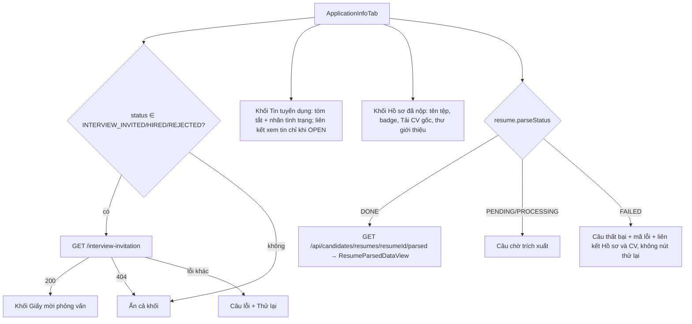

# Walkthrough — FR-U08 · Trang chi tiết đơn ứng tuyển

Nhánh: `feat/fr-u08-application-detail` (xếp chồng lên `feat/fr-h09-application-detail`) · 6 đợt + 1 đợt sửa
sau soát tay · 07/10/2026

## 1. Mục tiêu

Trước FR-U08, ứng viên chỉ có bảng "Đơn ứng tuyển của tôi": mỗi dòng ba nút mở ba hộp thoại riêng (lịch sử,
giấy mời, rút đơn); không có chỗ nào xem lại tin đã ứng tuyển, CV đã nộp, thư giới thiệu hay nội dung CV hệ
thống đã trích xuất. FR-U08 thêm trang `/candidate/applications/:id` gom mọi thứ về **một** đơn của chính ứng
viên: tab "Thông tin đơn" (giấy mời, tóm tắt tin, hồ sơ đã nộp, CV đã trích xuất) và tab "Lịch sử", cùng nút
Rút đơn. Trang danh sách chỉ còn liên kết "Xem chi tiết"; thông báo đổi trạng thái mới mở thẳng trang này.
Trang không gọi AI và không bao giờ trả điểm, hạng, tiêu chí, giải thích AI hay ghi chú nội bộ. Đây cũng là
khung để FR-U09 (câu trả lời sàng lọc, rút đồng ý), FR-U10 (chọn khung giờ) và FR-C06 (trao đổi) tự thêm phần
của mình.

## 2. Các file đã tạo/sửa

**Backend**

| File | Vai trò |
|---|---|
| `jobapplication/dto/ApplicationCandidateDetailResponse.java` (mới) | DTO riêng của E1: đơn + `JobInfo` + `ResumeInfo` + enum `JobAvailability` (5 giá trị) |
| `jobapplication/ApplicationService.java` | `getMyApplicationDetail` (đọc, `readOnly`), `availabilityOf`; thêm dependency `CompanyRepository`, `CatalogRegistry` |
| `jobapplication/ApplicationCandidateController.java` | `GET /api/candidates/applications/{id}` |
| `job/JobCatalogFields.java` | Đổi sang `public` để `jobapplication/` dùng chung cách tính nhãn danh mục; không đổi logic |
| `notification/NotificationContentBuilder.java`, `NotificationEventListener.java` | Thông báo đổi trạng thái của ứng viên trỏ `/candidate/applications/{id}` |

**Frontend**

| File | Vai trò |
|---|---|
| `pages/CandidateApplicationDetailPage.tsx` (mới) | Trang: đọc `:id`, `?tab=`, gọi E1, dựng đầu trang + 2 tab; tab "Lịch sử" là hàm cục bộ |
| `features/candidateApplicationDetail/*` (10 file mới) | `api`, `queries`, `types`, `jobAvailabilityLabels`, `CandidateApplicationHeader`, `ApplicationInfoTab`, `InvitationSection`, `JobSummarySection`, `SubmittedResumeSection`, `ParsedResumeSection` |
| `features/interviewinvitation/InterviewInvitationDetails.tsx` (mới) | Phần thân giấy mời, tách nguyên văn từ trang danh sách |
| `features/applications/WithdrawApplicationDialog.tsx` (mới) | Hộp xác nhận rút đơn, tách nguyên văn từ trang danh sách |
| `features/jobs/formatSalary.ts` (mới) | Hàm định dạng lương duy nhất cho 4 nơi |
| `features/applications/queries.ts` | `useWithdrawApplicationMutation` làm mới cả danh sách, lịch sử và E1 |
| `pages/CandidateApplicationsPage.tsx` | Bỏ 3 hộp thoại và 3 nút, mỗi dòng một liên kết "Xem chi tiết" |
| `features/jobs/JobCard.tsx`, `pages/PublicJobDetailPage.tsx`, `pages/HrJobListPage.tsx` | Bỏ bản `formatSalary` cục bộ, dùng hàm chung |
| `pages/HrApplicationDetailPage.tsx` (FR-H09) | Thêm `overflow-y-hidden` cho `TabsList` (sửa sau soát tay) |
| `App.tsx` | Route mới trong nhóm `ProtectedRoute(CANDIDATE)` |

## 3. Luồng chính

### 3.1 Mở trang (E1 rồi từng tab)

1. Ứng viên bấm "Xem chi tiết" ở `/candidate/applications` hoặc bấm một thông báo đổi trạng thái mới ở chuông.
   Route `/candidate/applications/:id` nằm trong nhóm `ProtectedRoute(CANDIDATE)` + `RequireCandidateProfileOnboarding`.
2. `CandidateApplicationDetailPage` đọc `?tab=` (lạ → `info`) và gọi `useCandidateApplicationDetailQuery` →
   `GET /api/candidates/applications/{id}` (không thử lại với lỗi 4xx).
3. Backend: filter chain chặn mọi `/api/candidates/**` không phải role CANDIDATE (403).
   `ApplicationService.getMyApplicationDetail` nạp đơn bằng `findByIdAndCandidateId` (đơn không tồn tại **hoặc**
   của người khác → cùng 404 `APPLICATION_NOT_FOUND`), rồi đọc `jobs` (không lọc `deleted_at`/`status`),
   `companies.name`, `resumes` theo `job_applications.resume_id`; nhãn danh mục qua `JobCatalogFields.of`; tình
   trạng tin qua `availabilityOf`.
4. Frontend: 400/403/404 → "Không tìm thấy đơn ứng tuyển." + liên kết về danh sách, không render tab nào. Lỗi
   khác → "Không tải được đơn ứng tuyển." + "Thử lại".
5. Có dữ liệu → đầu trang + `Tabs`. Radix chỉ render tab đang mở; đổi tab ghi `?tab=` bằng `replace`.

### 3.2 Tab "Thông tin đơn"



- Giấy mời, lịch sử, tải CV gốc và CV đã trích xuất đều dùng lại endpoint có sẵn của ứng viên; chỉ E1 là mới.
- `InvitationSection` gọi cùng hook (cùng khoá query) với `InterviewInvitationDetails`, nên TanStack gộp thành
  một request và khối biết được 404 để ẩn cả tiêu đề.

### 3.3 Rút đơn

Nút "Rút đơn" chỉ hiện khi `PENDING`/`INTERVIEW_INVITED` (đúng FR-U06). Bấm → `WithdrawApplicationDialog` (chữ
nguyên văn hộp thoại cũ) → `PATCH /withdraw` có sẵn. Thành công → `useWithdrawApplicationMutation` làm mới
danh sách, lịch sử của đơn và E1; focus về badge trạng thái. Lỗi 409 → hiện trong hộp thoại và làm mới E1.

### 3.4 Thông báo

`NotificationContentBuilder.forStatusChanged` nhận thêm `applicationId`, link thành
`/candidate/applications/{id}`. Tiêu đề, nội dung, email không đổi. Thông báo cũ trong DB giữ link
`/candidate/applications` (không migration).

## 4. Quyết định thiết kế

**404 chung cho đơn của người khác; không sửa 403 của giấy mời.** Đã chọn: E1 nạp đơn bằng
`findByIdAndCandidateId`, đơn của người khác và đơn không tồn tại cùng trả 404 `APPLICATION_NOT_FOUND` — đúng
quy ước đa số endpoint ứng viên (`/history`, `/withdraw`, `/resumes/*`). Lựa chọn khác: 403 như endpoint giấy
mời. Endpoint giấy mời giữ 403 vì đó là lựa chọn có chủ đích đã ghi ở walkthrough `candidate-view-invitation`;
`CandidateApplicationCrossEndpointAccessIntegrationTest` khoá cả hai mã trên cùng một đơn để không ai "sửa cho
đồng bộ". Giao diện hiện cùng một câu cho 400/403/404.

**CV theo `job_applications.resume_id`.** Trang hiện đúng CV ứng viên đã nộp vào đơn, không phải CV chính hiện
tại. T5 kiểm trường hợp ứng viên đổi CV chính sau khi nộp. Không có đường nào làm mất dòng `resumes` của một đơn
(không có API xoá CV, khoá ngoại `ON DELETE RESTRICT`); chỉ tệp trong kho có thể mất, khi đó nút tải hiện câu
lỗi tại chỗ.

**Tình trạng tin: 5 giá trị, dùng chung `findOpenJobById`, gộp xoá mềm và nháp thành `UNAVAILABLE`.** `OPEN`
được tính bằng chính truy vấn của trang tin công khai (gồm hạn nộp theo `CURRENT_DATE` của DB), không viết điều
kiện ngày thứ hai ở Java — vì vậy liên kết "Xem tin tuyển dụng" chỉ hiện khi trang tin công khai thực sự mở
được. `EXPIRED`, `PAUSED`, `CLOSED` theo `status`. Tin đã xoá mềm và tin bị đưa về nháp gộp chung
`UNAVAILABLE` ("Không còn đăng"): ứng viên không cần biết HR đã xoá tin hay đưa về nháp. Frontend không tự suy
tình trạng từ `deadline`. T6 kiểm biên hạn nộp bằng `SELECT CURRENT_DATE` (không dùng `LocalDate.now()` vì JVM
và Postgres có thể khác múi giờ).

**Chỉ tóm tắt tin.** Hệ thống không chụp lại tin lúc nộp, nên mọi thông tin tin là bản hiện tại; trang ghi rõ
điều này và chỉ hiện tóm tắt (ngành, khu vực, hình thức, chế độ làm việc, lương, hạn nộp), không hiện mô tả đầy
đủ. Tin đã đóng/xoá vẫn mở được trang vì đơn là của ứng viên.

**Một nơi rút đơn.** Hộp thoại lịch sử, hộp thoại giấy mời và nút Rút đơn bị bỏ khỏi trang danh sách. Hộp xác
nhận rút đơn và phần thân giấy mời được tách thành component với chữ nguyên văn; chỉ có một
`useWithdrawApplicationMutation`, được mở rộng để làm mới đủ dữ liệu.

**Link thông báo mới.** Chỉ đổi link của thông báo tạo sau FR-U08. Test FR-H09
`changeStatus_candidateNotificationLinkUnchanged` (viết để giữ chỗ cho FR-U08) được đổi thành
`changeStatus_candidateNotificationLinksToApplicationDetailPage` — ngoại lệ đã duyệt R-N4. Hai test khác chứa
chuỗi `/candidate/applications` chỉ là dữ liệu dựng sẵn nên giữ nguyên.

**Gộp `formatSalary`.** Ba bản cục bộ (`JobCard`, `PublicJobDetailPage`, `HrJobListPage`) cho cùng kết quả khi
có lương, chỉ khác giá trị khi không có lương. Gộp thành một hàm trả `null` khi không có lương; nơi gọi tự chọn
chữ thay thế (`'—'` ở `/hr/jobs`, `'Không công bố'` ở trang này). Giao diện ba màn hình cũ không đổi.

**Hạn nộp trống là "Không giới hạn".** Bản đầu đặc tả xếp hạn nộp trống vào nhóm "Chưa có dữ liệu". Đổi khi
duyệt đợt 5: tin không đặt hạn là không giới hạn (R-D4 cũng coi hạn trống là `OPEN`), nên dùng `formatDeadline`
có sẵn như trang tin công khai và thẻ việc làm.

**Màu liên kết.** Nợ `a { color: inherit }` đè màu `<Link>` đã được sửa gốc ở `refactor/ui-md3-legacy` (rule
nằm trong `@layer base`), nên class `text-m3-primary` đặt thẳng trên `<Link>` như trang H09, không bọc `<span>`.

## 5. Ràng buộc đã thực thi

| Mã | Ràng buộc | Thực thi ở đâu |
|---|---|---|
| R-Q1, R-Q2 | Chỉ ứng viên chủ đơn; 404 chung | `SecurityConfig` (`/api/candidates/**`), `findByIdAndCandidateId` trong `getMyApplicationDetail` |
| R-Q3 | Không đổi kiểm quyền endpoint cũ | Không sửa service cũ; `CandidateApplicationCrossEndpointAccessIntegrationTest` |
| R-D2 | CV của đúng đơn | `resumeRepository.findById(application.getResumeId())` |
| R-D4, R-D5 | 5 giá trị, một điều kiện OPEN, liên kết chỉ khi OPEN | `ApplicationService.availabilityOf`, `JobSummarySection` |
| R-D6 | Một cách tính nhãn danh mục | `JobCatalogFields.of` (public), `jobCategoryText`/`jobLocationText` |
| SRS "Nguyên tắc bổ sung", CLAUDE.md §7 | Không lộ điểm/rubric/giải thích/ghi chú; không khoá cấm | DTO riêng; T4 duyệt đệ quy 22 khoá cấm theo nguyên tên |
| R-T3–R-T7 | Giấy mời theo trạng thái, 404 ẩn khối | `InvitationSection` |
| R-P4 | Không nút thử lại CV | `ParsedResumeSection` |
| R-W1–R-W4 | Điều kiện FR-U06, một mutation, làm mới đủ | `CandidateApplicationHeader`, `useWithdrawApplicationMutation` |
| R-P3 | Một nơi xem/rút | `CandidateApplicationsPage` |
| R-N1–R-N4 | Link thông báo mới, thông báo cũ giữ nguyên | `NotificationContentBuilder` |
| R-C4 | Một hàm định dạng lương | `features/jobs/formatSalary.ts` |
| CLAUDE.md §8, R-G1 | Badge/nhãn trung tính | `ApplicationStatusBadge`, một kiểu nhãn cho 5 tình trạng |

## 6. Đã kiểm thử gì

**Backend tự động** — xem mục 6.1. 16 test mới của FR-U08: 15 ở
`ApplicationCandidateDetailControllerIntegrationTest`, 1 ở `CandidateApplicationCrossEndpointAccessIntegrationTest`;
1 test của `NotificationEventListenerIntegrationTest` đổi tên và kỳ vọng (R-N4); `ApplicationServiceTest` chỉ
sửa helper `newService()` (thêm 2 mock cho constructor), 7/7 test giữ nguyên.

| "Xong khi" | Cách nghiệm thu | Kết quả |
|---|---|---|
| T1 đủ field, không thừa | `getDetail_ownApplication_returnsAllFields` | Đạt |
| T2 404 chung | `getDetail_otherCandidateOrMissing_bothReturn404ApplicationNotFound` | Đạt |
| T3 HR 403, không token 401 | `getDetail_hrToken_returns403`, `getDetail_noToken_returns401` | Đạt |
| T4 không khoá cấm (nguyên tên, mọi cấp) | `getDetail_responseHasNoForbiddenKeysAtAnyLevel` | Đạt |
| T5 CV đã nộp, không phải CV chính | `getDetail_candidateChangedPrimaryAfterApplying_returnsAppliedResume` | Đạt |
| T6 tình trạng tin | `getDetail_openJobDeadlineBoundaries_availabilityMatchesPublicJobRule`, `getDetail_jobPausedClosedDraft_availabilityByStatus`, `getDetail_softDeletedJob_unavailableAndSummaryStillReturned` | Đạt |
| T7 thư nguyên văn / null | `getDetail_multilineCoverLetterWithHtml_returnsVerbatim`, `getDetail_noCoverLetter_returnsNull` | Đạt |
| T8 danh mục chưa chuẩn hoá | `getDetail_unnormalizedJob_returnsLegacyCatalogValues` | Đạt |
| T9 404 trừ giấy mời 403 | `otherCandidate_sameApplicationAcrossEndpoints_404ExceptInvitation403` | Đạt |
| T10 link thông báo mới | `changeStatus_candidateNotificationLinksToApplicationDetailPage` | Đạt |
| T11 lỗi trích xuất | `getDetail_failedResume_returnsStoredParseError`, `getDetail_pendingResume_parseErrorNull` | Đạt |
| T12 rút đơn rồi đọc lại | `getDetail_afterWithdraw_returnsWithdrawnAndHistoryHasWithdrawEntry` | Đạt |
| 7.2 khối PowerShell | mục 6.2 | Đạt (7 nhóm khớp "Mong đợi") |
| 7.3 lệnh tìm | chạy 07/10/2026 | Đạt |
| 7.4 soát tay | người dùng, 07/10/2026 | Đạt (mục 6.3) |

### 6.1 Full suite

`.\mvnw.cmd test` toàn bộ suite, chạy **một lần** ở đợt cuối (07/10/2026): **819 tests, 0 failures, 0 errors,
0 skipped, BUILD SUCCESS** (84 lớp test, 2 phút 51 giây). So với FR-H09 (803): +16 test mới của FR-U08 (15 + 1);
test đổi tên `changeStatus_candidateNotificationLinkUnchanged` → `changeStatus_candidateNotificationLinksToApplicationDetailPage`
không làm đổi số lượng; `ApplicationServiceTest` vẫn 7 test. 803 + 16 = 819.

### 6.2 Kiểm bằng HTTP (mục 7.2) — chạy thật 07/10/2026, seed test

```
--- 1. Duong: Quoc Huy doc 5 don cua minh (mong doi 200 x5)
200 /api/candidates/applications/e8000000-0000-0000-0000-000000000001
200 /api/candidates/applications/e8000000-0000-0000-0000-000000000002
200 /api/candidates/applications/e8000000-0000-0000-0000-000000000003
200 /api/candidates/applications/e8000000-0000-0000-0000-000000000004
200 /api/candidates/applications/e8000000-0000-0000-0000-000000000005
--- 2. Am: Quoc Huy doc don cua nguoi khac (mong doi 404 APPLICATION_NOT_FOUND)
404 /api/candidates/applications/e8000000-0000-0000-0000-000000000009 {"error":"APPLICATION_NOT_FOUND","message":"Không tìm thấy đơn ứng tuyển: e8000000-0000-0000-0000-000000000009"}
--- 3. Am: don khong ton tai (mong doi 404 APPLICATION_NOT_FOUND)
404 /api/candidates/applications/00000000-0000-0000-0000-000000000000 {"error":"APPLICATION_NOT_FOUND","message":"Không tìm thấy đơn ứng tuyển: 00000000-0000-0000-0000-000000000000"}
--- 4. Am: Le Thi Lan doc don A1 cua Quoc Huy (mong doi 404 APPLICATION_NOT_FOUND)
404 /api/candidates/applications/e8000000-0000-0000-0000-000000000001 {"error":"APPLICATION_NOT_FOUND","message":"Không tìm thấy đơn ứng tuyển: e8000000-0000-0000-0000-000000000001"}
--- 5. Quy uoc cu giu nguyen: giay moi don nguoi khac (mong doi 403), lich su don nguoi khac (mong doi 404)
403 /api/candidates/applications/e8000000-0000-0000-0000-000000000009/interview-invitation {"error":"FORBIDDEN","message":"Tài khoản không có quyền truy cập tài nguyên này"}
404 /api/candidates/applications/e8000000-0000-0000-0000-000000000009/history {"error":"APPLICATION_NOT_FOUND","message":"Không tìm thấy đơn ứng tuyển: e8000000-0000-0000-0000-000000000009"}
--- 6. Am: HR goi endpoint ung vien (mong doi 403)
403 /api/candidates/applications/e8000000-0000-0000-0000-000000000001 {"error":"FORBIDDEN","message":"Tài khoản không có quyền truy cập tài nguyên này"}
--- 7. Am: khong token (mong doi 401 UNAUTHENTICATED)
401 /api/candidates/applications/e8000000-0000-0000-0000-000000000001 {"error":"UNAUTHENTICATED","message":"Cần đăng nhập để truy cập tài nguyên này"}
```

### 6.3 Soát tay

Người dùng xác nhận 07/10/2026, seed test, tài khoản `quochuyuv@gmail.com`:
- Danh sách `/candidate/applications` chỉ còn "Xem chi tiết".
- 5 đơn đủ 5 trạng thái hiển thị đúng: giấy mời, nhãn tình trạng tin, CV lỗi trích xuất không có nút thử lại,
  đơn bị từ chối thẳng không có khối giấy mời.
- Rút đơn cập nhật trang chi tiết và danh sách.
- URL không hợp lệ hiện "Không tìm thấy đơn ứng tuyển."
- Thông báo mới mở thẳng trang chi tiết.
- 375px không tràn ngang.
- Cột lương `/hr/jobs` và thẻ việc làm không đổi.

**Frontend** — `npm run build` (0 lỗi TypeScript; cảnh báo Vite chunk > 500 kB có sẵn từ trước) và
`npm run lint` (0 lỗi, 0 warning) sạch.

**Chưa test:** frontend không có test tự động; tin quá hạn/nháp/xoá mềm, CV `PENDING` trên đơn và tệp CV mất
trong kho không có trong seed — chỉ T6, T11 và đọc code R-T13 phủ.

## 7. Sửa sau soát tay (đợt 5b)

- **Thanh cuộn dọc ở `TabsList`.** `overflow-x-auto` khiến trình duyệt tính `overflow-y` thành `auto`, lộ hai mũi
  tên ▲▼ cạnh tab cuối. Thêm `overflow-y-hidden` ở trang này và trang hồ sơ đơn phía HR
  (`HrApplicationDetailPage.tsx`, FR-H09) vì cùng cấu hình; không sửa `components/ui`.
- **Định dạng ngày giờ trong UI.md.** `formatDateTimeVi` (`toLocaleString('vi-VN')`) ra "HH:mm dd/MM/yyyy" (giờ
  trước ngày), giống cột "Ngày nộp" của danh sách. Sửa chuỗi ở UI.md mục 7 và các ví dụ ASCII; không sửa code.

## 8. Nợ kỹ thuật

- **Lỗi mất dữ liệu ở form sửa tin phía HR (phát hiện khi soát tay, không thuộc FR-U08)** — xem `docs/ROADMAP.md`.
- `NotificationList` (trang "Xem tất cả") không điều hướng theo `link`; chỉ chuông có điều hướng. Ảnh hưởng cả HR.
- Email thông báo không có link.
- Cảnh báo Vite chunk > 500 kB.
- `retryUnlessClientError` có hai bản (`applicationDetail/queries.ts` của H09 và
  `candidateApplicationDetail/queries.ts`) vì lệnh chặn ở REQUIREMENT 7.3 cấm trang ứng viên import từ thư mục
  phía HR.
- Id sai định dạng vẫn trả 400 mặc định của Spring (kế thừa FR-H09).
- Danh sách đơn của ứng viên không lọc đơn vào tin đã xoá mềm (hành vi cũ, giữ nguyên).
- Frontend chưa có test tự động.

## 9. Lệch so với đặc tả

| Chỗ lệch | Đặc tả đã sửa? | Duyệt lại |
|---|---|---|
| Hạn nộp trống hiện "Không giới hạn" thay vì "Chưa có dữ liệu" (R-G4) | Đã sửa REQUIREMENT R-G4, UI.md mục 6, 7 ở đợt 5 | Duyệt 07/10/2026 |
| Tab "Lịch sử" là hàm cục bộ trong file trang (UI.md 5a không có file riêng) | Đã ghi vào UI.md 5a ở đợt 5 | Duyệt 07/10/2026 |
| `InterviewInvitationDetails` có prop `notFoundFallback` tạm ở đợt 4 (giữ câu cũ cho hộp thoại danh sách), gỡ ở đợt 5 khi hộp thoại bị bỏ | Không cần | Duyệt cùng đợt 5 |
| Định dạng ngày giờ "HH:mm dd/MM/yyyy" | Đã sửa UI.md mục 7 ở đợt 5b | Duyệt 07/10/2026 |
| `TabsList` thêm `overflow-y-hidden`, chạm file FR-H09 | Không cần | Duyệt cùng đợt 5b |
