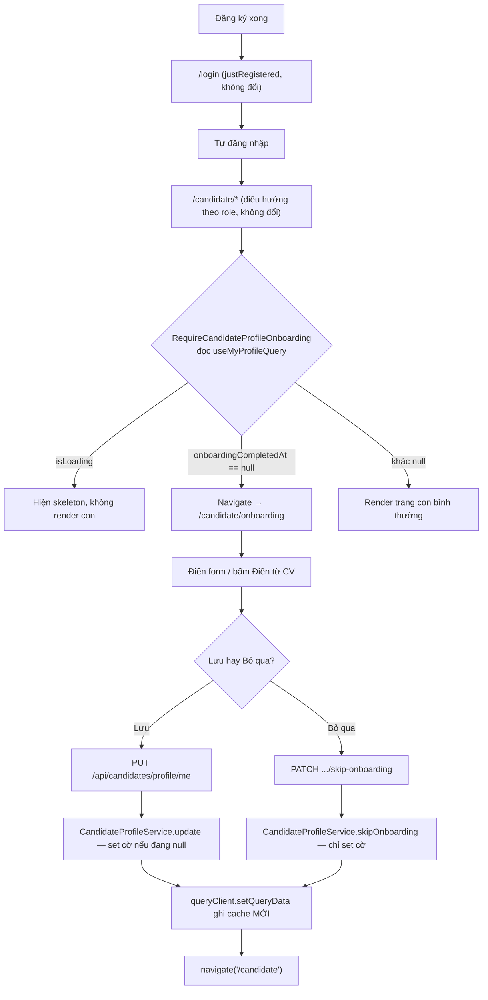

# FR-U14 — Hồ sơ nghề nghiệp và mong muốn công việc

**Lưu ý đặc tả đã cập nhật:** cách thực thi R-E3 ("bẫy flush Hibernate") dùng
`@Modifying(clearAutomatically = true, flushAutomatically = true)` theo đúng tiền lệ
`touchAfterReparse` (FR-C05 R-R5), thay vì `saveAndFlush()` tường minh như bản nháp ban đầu của
REQUIREMENT.md mô tả. Thay đổi này đã được duyệt ở đợt 3 (03/10/2026); REQUIREMENT.md mục 0.a/R-E3
và mục "AI hay làm sai" đã sửa lại cho khớp code thật — không còn lệch.

## 1. Mục tiêu

Ứng viên cần khai báo mong muốn nghề nghiệp (chức danh mong muốn, ngành nghề, khu vực, hình thức
làm việc, mức lương tối thiểu, kỹ năng, giới thiệu ngắn) để hệ thống gợi ý việc làm được ngay cả khi
họ chưa tải CV lên — đây là phần dữ liệu đầu vào cho FR-U15 (gợi ý việc làm theo hồ sơ) sau này.
Nhánh này mở rộng bảng `candidate_profiles` đã có từ FR-U01, tái dùng danh mục ngành nghề/tỉnh thành
của FR-C05 và hạ tầng tính embedding của FR-U04, đồng thời thêm một màn "Hoàn thiện hồ sơ" xuất hiện
đúng một lần — ở lần ứng viên đăng nhập đầu tiên — để khuyến khích khai báo sớm mà không bắt buộc.

## 2. Các file đã tạo/sửa

### Backend

| File | Vai trò |
|---|---|
| `db/migration/V10__career_profile.sql` | Thêm 9 cột mới vào `candidate_profiles` (4 cột mảng, lương, bio, cờ onboarding, embedding, embedding_model) + 6 CHECK constraint + backfill cờ onboarding cho hồ sơ cũ |
| `user/CandidateProfile.java` | Entity — thêm field mới, trong đó 4 field mảng dùng `String[]` + `@JdbcTypeCode(SqlTypes.ARRAY)` (lần đầu dự án map `text[]` qua Hibernate) |
| `user/CandidateProfileRepository.java` | Thêm `findIdsNeedingEmbedding` (quét hồ sơ cần tính embedding), `clearEmbedding` (đặt null khi văn bản đại diện đổi), `updateEmbeddingIfUnchanged` (ghi có điều kiện theo `updated_at`) |
| `user/CandidateProfileService.java` | Dedupe + validate 4 field mảng, quy đổi đơn vị lương, set cờ onboarding, so sánh văn bản đại diện cũ/mới để quyết định xoá embedding, đọc dữ liệu "Điền từ CV" |
| `user/CandidateProfileController.java` | 4 endpoint `/api/candidates/profile/**` (GET, PUT, PATCH skip-onboarding, GET autofill) |
| `user/CandidateProfileEmbeddingOrchestrator.java` | Dựng văn bản đại diện (`buildEmbeddingText`, hàm tĩnh dùng chung với service) + gọi `EmbeddingService` ngoài transaction |
| `user/CandidateProfileEmbeddingStateService.java` | Bean ghi riêng (tránh self-invocation phá `@Transactional`), ghi kết quả embedding có điều kiện |
| `user/CandidateProfileEmbeddingScheduler.java` | `@Scheduled` poll hồ sơ cần embedding, theo khuôn `ResumeEmbeddingScheduler` |
| `user/dto/CandidateProfileRequest.java`, `CandidateProfileResponse.java`, `ResumeAutofillResponse.java` | DTO mở rộng + Bean Validation cho lương/bio |
| `common/exception/InvalidProfileFieldException.java` | 1 exception, 5 factory method, map chung sang mã lỗi `INVALID_PROFILE_FIELD` |
| `common/exception/PrimaryResumeNotParsedException.java` | Mã lỗi `NO_PRIMARY_RESUME_PARSED` cho "Điền từ CV" khi chưa có CV chính đã phân tích xong |
| `common/exception/GlobalExceptionHandler.java` | Thêm 2 handler cho 2 exception trên |
| `application.yml` / `application-test.yml` | Cấu hình `app.candidate-profile-embedding.*` (bật/tắt, batch size, chu kỳ poll) |

### Frontend

| File | Vai trò |
|---|---|
| `features/catalog/CatalogMultiCombobox.tsx` | Combobox chọn nhiều mã danh mục (dựng từ `CatalogCombobox` của FR-C05), giới hạn `max`, hiện chip đã chọn |
| `features/candidateProfile/SkillTagInput.tsx` | Ô nhập kỹ năng dạng thẻ, Enter/dấu phẩy để thêm, Backspace để xoá thẻ cuối |
| `features/candidateProfile/CareerPreferencesFields.tsx` | Nhóm field dùng chung giữa trang onboarding và card "Nghề nghiệp..." của trang hồ sơ |
| `features/candidateProfile/RequireCandidateProfileOnboarding.tsx` | Wrapper chặn nhóm route `/candidate/*` khi `onboardingCompletedAt === null` |
| `features/candidateProfile/api.ts`, `queries.ts`, `types.ts` | Lớp gọi API + React Query cho 4 endpoint |
| `pages/CandidateOnboardingPage.tsx` | Màn "Hoàn thiện hồ sơ" (★Mới) |
| `pages/CandidateProfilePage.tsx` | Tách card "Thông tin cá nhân" cũ thành "Thông tin cơ bản" + "Nghề nghiệp và mong muốn công việc", gộp vào một `<form>` |
| `App.tsx` | Gắn route `/candidate/onboarding` và bọc nhóm `/candidate/*` còn lại bằng wrapper |

## 3. Luồng chính

**Luồng A — Lần đăng nhập đầu tiên sau đăng ký**

Điểm quan trọng: `RegisterForm.tsx` và API đăng ký **không đổi gì** — `POST
/api/auth/register/candidate` không trả phiên đăng nhập, nên không có cách nào đưa thẳng người dùng
vào onboarding ngay sau khi đăng ký. Toàn bộ logic onboarding nằm ở wrapper, kích hoạt ở lần đầu
tiên ứng viên tự đăng nhập và chạm vào `/candidate/*`.

**Luồng B — Sửa hồ sơ bất kỳ lúc nào (`/candidate/profile`)**

1. Trang tải `useMyProfileQuery` → điền sẵn vào một `<form>` React Hook Form duy nhất chứa cả 2 card.
2. Bấm "Điền từ CV" (nếu không bị khoá) → gọi `GET
   /api/candidates/profile/me/autofill-from-resume` → `CandidateProfileService.autofillFromResume`
   tìm CV chính qua `ResumeRepository.findByCandidateIdAndIsPrimaryTrue`, kiểm `parseStatus ==
   DONE`, đọc `ResumeParsedData` → trả `currentTitle`/`skills`/số năm kinh nghiệm quy đổi. Kết quả
   chỉ đổ vào form, chưa ghi DB.
3. Bấm "Lưu" → `PUT /api/candidates/profile/me` gửi toàn bộ field (thay thế hoàn toàn, không patch
   từng field) → `CandidateProfileService.update`:
   - Dedupe + validate 4 field mảng (ngành/khu vực/hình thức/kỹ năng).
   - Đọc văn bản đại diện CŨ (từ entity trước khi ghi đè).
   - Ghi field mới lên entity, set cờ onboarding nếu đang `null`, `save()`.
   - So văn bản đại diện MỚI với CŨ — khác nhau → gọi `clearEmbedding` (native UPDATE
     `embedding = NULL` có `flushAutomatically = true` để không mất thay đổi `headline`/`skills`/`bio`
     chưa flush).
4. Scheduler `CandidateProfileEmbeddingScheduler` (chạy nền, không nằm trong request) quét
   `candidate_profiles` có `embedding IS NULL` và còn ít nhất một trong 3 trường
   `headline`/`skills`/`bio` khác rỗng → `CandidateProfileEmbeddingOrchestrator.processOne` dựng văn
   bản, gọi `EmbeddingService.embed` ngoài transaction, rồi ghi qua
   `CandidateProfileEmbeddingStateService.save` bằng UPDATE có điều kiện `updated_at =
   :expectedUpdatedAt` — hồ sơ bị sửa giữa chừng thì bỏ qua, lượt poll sau tự làm lại.

## 4. Quyết định thiết kế

**(1) Không tạo cột `desired_title` mới, dùng lại `headline`.**
- Lựa chọn khác: thêm cột `desired_title` riêng, giữ `headline` cho mục đích cũ.
- Lý do chọn: đọc code `CandidateProfilePage.tsx` trước khi viết đặc tả (REQUIREMENT.md mục 0.c)
  xác nhận `headline` đã mang đúng nghĩa "chức danh mong muốn" từ FR-U01, chưa từng là "chức danh
  hiện tại". Thêm cột song song sẽ tạo ra hai nguồn sự thật cho cùng một khái niệm (R-G1).

**(2) 4 cột mảng dùng `String[]`, không dùng `List<String>`.**
- Lựa chọn khác: `List<String>` (lối viết tự nhiên hơn, cũng là kiểu DTO tầng request/response).
- Lý do chọn: đo thật bằng `BackendApplicationTests` trên Testcontainers ở đợt 1 — với
  `List<String>` + `@JdbcTypeCode(SqlTypes.ARRAY)`, Hibernate 7.4.1 tự suy kiểu JDBC mong đợi thành
  `jsonb`, làm `ddl-auto: validate` báo lỗi lệch kiểu cột ngay lúc khởi động. Đổi sang `String[]` thì
  qua validate đúng như dự kiến — đây là lần đầu dự án dùng mảng Postgres qua Hibernate nên bắt buộc
  đo thật thay vì suy luận từ tài liệu.

**(3) Cột `embedding` (kiểu `vector(1536)`) không map qua entity, chỉ qua native query.**
- Lựa chọn khác: tự viết `UserType`/`JdbcType` để map `vector` như một field JPA bình thường.
- Lý do chọn: xác nhận bằng bytecode thật của `spring-ai-pgvector-store-2.0.0.jar` rằng chính Spring
  AI cũng không bind kiểu `vector` qua Hibernate mà dùng `JdbcTemplate` riêng — tự viết type mới là
  chưa kiểm chứng được, trong khi tiền lệ `ResumeParsedData`/`JobEmbedding` đã chứng minh cách
  native-query-only hoạt động ổn định.

**(4) Ghi embedding bằng UPDATE có điều kiện `updated_at = :expectedUpdatedAt` (R-E5), khác tiền lệ
UPDATE không điều kiện của CV (`ResumeParsedDataRepository.updateEmbedding`).**
- Lựa chọn khác: copy nguyên UPDATE không điều kiện cho nhất quán với CV.
- Lý do chọn: UPDATE không điều kiện của CV là một khoản nợ kỹ thuật đã biết (ghi đè embedding cũ
  nếu hồ sơ bị sửa giữa lúc build text và lúc ghi xong — một dạng lost update). U14 cố tình không
  lặp lại lỗi đã biết này cho dữ liệu mới, dùng optimistic-lock đơn giản dựa trên cột `updated_at` có
  sẵn (được trigger `set_updated_at` tự cập nhật).

**(5) R-E3 ("bẫy flush Hibernate") giải quyết bằng `flushAutomatically = true` trên chính câu
`@Modifying`, không phải `saveAndFlush()` tường minh như bản nháp ban đầu của REQUIREMENT.md mô
tả.**
- Lựa chọn khác: gọi `candidateProfileRepository.saveAndFlush(profile)` trước khi gọi
  `clearEmbedding` (cách bản nháp đầu của REQUIREMENT.md mục 0.a/R-E3 đã mô tả).
- Lý do chọn trong thực tế: dự án đã có tiền lệ đúng vấn đề này ở
  `ResumeParsedDataRepository.touchAfterReparse` (FR-C05 R-R5) — `@Modifying(clearAutomatically =
  true, flushAutomatically = true)` tự flush persistence context ngay trước khi chạy câu update, gộp
  luôn bước flush vào khai báo repository thay vì phải nhớ gọi đúng thứ tự `saveAndFlush` ở tầng
  service. Test nhóm 15 xác nhận `headline` mới và `embedding = null` cùng đúng sau một lần ghi.
  Thay đổi này đã được duyệt ở đợt 3 (03/10/2026); REQUIREMENT.md đã cập nhật lại mục 0.a/R-E3 và
  mục "AI hay làm sai" cho khớp (xem mục 8).

**(6) Văn bản đại diện cho embedding hồ sơ là một hàm thuần mới (`buildEmbeddingText`), không tái
dùng `buildResumeText` của FR-U04.**
- Lựa chọn khác: tổng quát hoá `buildResumeText` để dùng chung cho cả CV và hồ sơ.
- Lý do chọn: nguồn dữ liệu khác hẳn nhau (CV có cấu trúc `ResumeParsedPayload` nhiều trường, hồ sơ
  chỉ có 3 trường phẳng `headline`/`skills`/`bio`) — dùng chung sẽ phải thêm tham số/nhánh rẽ cho một
  hàm vốn đơn giản, không có lợi ích rõ ràng.

**(7) Wrapper `RequireCandidateProfileOnboarding` không render con và không điều hướng khi đang
tải.**
- Lựa chọn khác: render con ngay cả khi `isLoading`, điều hướng sau khi có dữ liệu (nhanh hơn về mặt
  cảm nhận UI).
- Lý do chọn: tránh hiện `/candidate` một nhịp rồi mới nhảy sang `/candidate/onboarding` (giật màn
  hình), và tránh đọc `onboardingCompletedAt` khi dữ liệu chưa chắc mới nhất — đúng mẫu đã có ở
  `RequireCompany.tsx`.

**(8) `queryClient.setQueryData` ghi cache MỚI trước khi `navigate()` ở cả hai nút "Lưu"/"Bỏ qua"
của trang onboarding.**
- Lựa chọn khác: điều hướng ngay sau khi `await mutateAsync()` resolve, để React Query tự
  invalidate/refetch ở trang đích.
- Lý do chọn: nếu điều hướng trước khi cache cập nhật, `RequireCandidateProfileOnboarding` ở
  `/candidate` có thể đọc lại cache CŨ (`onboardingCompletedAt` vẫn `null`) trong khoảnh khắc giữa
  điều hướng và lúc query thật sự refetch xong, tạo vòng lặp chuyển hướng. Đặt `setQueryData` trong
  chính `onSuccess` của mutation đảm bảo cache luôn mới trước khi `navigate()` chạy.

**(9) Số năm kinh nghiệm ở "Điền từ CV" tính lại từ `experience_months` thô, không dùng field
`experience.years` đã làm tròn sẵn của FR-C05.**
- Lựa chọn khác: tái dùng field `experience.years` đã có trong `ResumeParsedDataResponse` (ít code
  hơn).
- Lý do chọn: field đó làm tròn tới 1 chữ số thập phân (R-E8 của FR-C05); U14 cần làm tròn tới bước
  0,5. Làm tròn lại một giá trị đã làm tròn sẽ cho kết quả sai (ví dụ 7 tháng: làm tròn đúng theo bước
  0,5 ra 0,5 năm, nhưng nếu làm tròn hai lần có thể lệch thành 0,6).

## 5. Ràng buộc đã thực thi

| Mã | Ràng buộc | Thực thi ở đâu |
|---|---|---|
| R-F1 | Mã ngành/khu vực phải tồn tại trong danh mục | `CandidateProfileService.processDesiredCodes` gọi `CatalogRegistry.isIndustry`/`isProvince` |
| R-F2 | Dedupe theo giá trị mã, giữ thứ tự, TRƯỚC khi đếm số lượng | `CandidateProfileService.dedupePreserveOrder` chạy trước kiểm `size() > MAX_DESIRED_CODES` |
| R-F3 | Tối đa 3 phần tử sau dedupe | `CandidateProfileService.processDesiredCodes` + CHECK constraint `chk_candidate_desired_industry_codes_max`/`..._location_codes_max` (V10) |
| R-M1 | `desiredWorkModes` chỉ nhận `ONSITE`/`HYBRID`/`REMOTE` | `CandidateProfileService.processWorkModes` + CHECK `chk_candidate_desired_work_modes_valid` |
| R-K1 | Kỹ năng tối đa 20 thẻ, mỗi thẻ 1–50 ký tự | `CandidateProfileService.processSkills` + CHECK `chk_candidate_skills_max` |
| R-K2 | Dedupe kỹ năng không phân biệt hoa/thường, giữ cách viết lần xuất hiện đầu | `CandidateProfileService.dedupeSkillsCaseInsensitive` |
| R-S1/R-S2 | Lương `[0, 1000]` triệu, quy đổi sang VND khi lưu | `CandidateProfileRequest.desiredSalaryMinMillions` (`@Min`/`@Max`) + `CandidateProfileService.toVnd` + CHECK `chk_candidate_desired_salary_min_nonneg` |
| R-B1 | Bio tối đa 500 ký tự | `CandidateProfileRequest.bio` (`@Size(max=500)`) + CHECK `chk_candidate_bio_length` |
| R-G1/R-G2/R-G3 | Không tạo field song song cho chức danh/kinh nghiệm/3 field FR-U01 cũ | `CandidateProfile.java` không có cột `desired_title`; `CandidateProfileRequest` giữ nguyên validate (không thêm) cho `headline`/`location`/`currentTitle`/`yearsExperience`/`dateOfBirth` |
| R-G4 | `dateOfBirth` không vào văn bản đại diện/embedding | `CandidateProfileEmbeddingOrchestrator.buildEmbeddingText` chỉ nhận `headline`/`skills`/`bio` |
| R-O1 | Không đổi luồng đăng ký | `RegisterForm.tsx` không sửa trong nhánh này (xác nhận bằng `git diff` rỗng ở file này) |
| R-O2 | Wrapper chặn `/candidate/*` khi chưa onboarding, xử lý đúng trạng thái tải/lỗi | `RequireCandidateProfileOnboarding.tsx` |
| R-O3 | Set cờ onboarding đúng một lần (khi đang `null`), idempotent cho skip | `CandidateProfileService.update`/`skipOnboarding` — cả hai đều kiểm `if (onboardingCompletedAt == null)` trước khi set |
| R-O4 | Hồ sơ cũ coi như đã qua onboarding | `V10__career_profile.sql` — `UPDATE ... SET onboarding_completed_at = now() WHERE onboarding_completed_at IS NULL` |
| R-A1 | "Điền từ CV" không gọi AI, 409 khi chưa có CV chính DONE | `CandidateProfileService.autofillFromResume` + `PrimaryResumeNotParsedException` |
| R-A2 | Kết quả autofill chỉ điền form, không tự lưu | `CandidateOnboardingPage.tsx`/`CandidateProfilePage.tsx` — `useAutofillFromResumeMutation` chỉ set giá trị form, không gọi `useSaveProfileMutation` |
| R-E1 | Văn bản đại diện = headline → skills → bio, không gồm dữ liệu nhân thân/lương/tên | `CandidateProfileEmbeddingOrchestrator.buildEmbeddingText` |
| R-E2 | Cả 3 trường rỗng → không nằm trong tập quét | `CandidateProfileRepository.findIdsNeedingEmbedding` lọc ngay trong SQL |
| R-E3 | Văn bản đại diện đổi → xoá embedding cũ; không đổi → giữ nguyên | `CandidateProfileService.update` so `oldText`/`newText` |
| R-E4 | Scheduler riêng, tắt được trong test, không `@Transactional` | `CandidateProfileEmbeddingScheduler` + `app.candidate-profile-embedding.enabled=false` (`application-test.yml`) |
| R-E5 | Ghi embedding có điều kiện `updated_at`, rowcount 0 thì bỏ qua | `CandidateProfileRepository.updateEmbeddingIfUnchanged` + `CandidateProfileEmbeddingStateService.save` |
| R-E6 | Lỗi gọi embedding → không ghi gì, tự thử lại lượt sau | `CandidateProfileEmbeddingOrchestrator.processOne` (catch `RuntimeException`, chỉ `log.debug`) |
| R-P1/R-P2 | Không lộ field mong muốn cho HR; endpoint chỉ `hasRole("CANDIDATE")` | Test nhóm 9 (`CandidateProfileControllerIntegrationTest`) dùng giá trị đánh dấu; `SecurityConfig` có sẵn từ FR-U01, không sửa |
| R-V1 | 4 field mảng thiếu/`null` → coi là rỗng, không NPE/500 | `CandidateProfileService.nullToEmpty` |
| R-V2 | Một mã lỗi `INVALID_PROFILE_FIELD` cho mọi factory | `GlobalExceptionHandler.handleInvalidProfileField` |
| R-V3 | PUT là thay thế toàn bộ | `CandidateProfilePage.tsx` luôn tải `useMyProfileQuery` trước khi submit, gửi đủ mọi field |
| Nguyên tắc chung (SRS) | Không gán nhãn đạt/không đạt, không có AI ra quyết định | Không có cột `verdict`/`label` nào trong `candidate_profiles`; "Điền từ CV" là sao chép xác định, không gọi LLM |

## 6. Đã kiểm thử gì

**Test tự động** — 2 file test mới, 39 case (`CandidateProfileControllerIntegrationTest`: 36,
`CandidateProfileEmbeddingOrchestratorTest`: 3), nằm trong tổng **747/747** test của full suite
(`./mvnw test`, đợt cuối, xanh hoàn toàn). Bao phủ: validate 4 field mảng (biên 3/4, 20/21, 50/51
ký tự, dedupe trước khi đếm), lương (biên 0/1000/-1/1001), bio (biên 500/501), field dùng lại không
bị ảnh hưởng, vòng đời cờ onboarding (lần đầu/lần hai/skip/skip lặp lại), "Điền từ CV" (409 khi
chưa có CV, quy đổi năm kinh nghiệm đúng bước 0,5), chống lộ cho HR (giá trị đánh dấu + 403 khi HR
gọi endpoint ứng viên), văn bản đại diện đổi/không đổi, ghi embedding thành công, race ghi embedding
(rowcount 0), mảng qua Hibernate đọc/ghi đúng qua `JpaRepository`, danh sách `null`/request kiểu cũ
vẫn 200, và bẫy flush Hibernate (R-E3, nhóm 15).

**Chưa test tự động:**
- Không có test đo hiệu năng/độ trễ của scheduler khi số hồ sơ cần embedding lớn.
- Không có test giả lập nhiều instance backend chạy song song (kịch bản sinh embedding trùng đã ghi
  nhận là nợ kỹ thuật, không phải lỗi).
- `CatalogMultiCombobox`/`SkillTagInput` không có test component riêng (unit test React) — chỉ được
  xác nhận qua `npm run build` (kiểm kiểu) và soát tay.

**Test tay** (người dùng thực hiện, kết quả ghi lại nguyên văn):

Soát tay đạt đủ, 03/10/2026: ứng viên demo có hồ sơ seed sẵn (Trần Minh Hoàng) không bị đưa sang
onboarding và hiện đủ mong muốn; sửa giới thiệu, lưu, F5 còn giữ; lương 1001 báo "Lương mong muốn
tối đa 1000 triệu." và không lưu; ứng viên hồ sơ trống (Bùi Ngọc Mai) không bị đưa sang onboarding;
375px một cột; tab Ứng viên phía HR không hiện trường mong muốn nào; scheduler đã tính embedding cho
3 hồ sơ có văn bản (`SELECT count(*) FROM candidate_profiles WHERE embedding IS NOT NULL` → 3,
backend chạy với khoá OpenAI thật).

Các mục đã soát tay 02/10/2026: Điền từ CV điền đúng và không tự lưu; giới hạn 3 ngành khoá dòng thứ
tư; tài khoản mới đăng ký được đưa tới onboarding ở lần đăng nhập đầu; Bỏ qua và Lưu ở onboarding
đều vào trang Việc làm, không bị bật ngược.

### Đối chiếu "Xong khi" (REQUIREMENT.md mục 7)

| # | Tiêu chí | Cách nghiệm thu | Đạt? |
|---|---|---|---|
| 1 | Mảng mong muốn: dedupe trước khi đếm, biên 3/4 | Nhóm test validate ngành/khu vực, `CandidateProfileControllerIntegrationTest` | Đạt |
| 2 | Hình thức làm việc: hợp lệ/ngoài tập/dedupe | Nhóm test work mode | Đạt |
| 3 | Kỹ năng: biên 20/21, 50/51, dedupe không phân biệt hoa/thường | Nhóm test skills | Đạt |
| 4 | Lương: biên 0/1000/-1/1001, trống = NULL | Nhóm test salary | Đạt |
| 5 | Bio: biên 500/501 | Nhóm test bio | Đạt |
| 6 | Field dùng lại (R-G) không bị đụng | Nhóm test R-G | Đạt |
| 7 | Vòng đời cờ onboarding (mới/lần 2/skip/skip lặp) | Nhóm test onboarding | Đạt |
| 8 | Điền từ CV: 409 khi chưa có CV, quy đổi năm đúng 0,5 | Nhóm test autofill | Đạt |
| 9 | Chống lộ cho HR + 403 | Nhóm test R-P | Đạt |
| 10 | Văn bản đại diện đổi/không đổi | Nhóm test 10 | Đạt |
| 11 | Ghi embedding thành công | `CandidateProfileEmbeddingOrchestratorTest` | Đạt |
| 12 | Race ghi embedding | `CandidateProfileEmbeddingOrchestratorTest` | Đạt |
| 13 | Mảng qua Hibernate đọc/ghi đúng | Nhóm test 13 + `BackendApplicationTests.contextLoads` | Đạt |
| 14 | Danh sách `null`/request kiểu cũ vẫn 200 | Nhóm test 14 | Đạt |
| 15 | Bẫy flush Hibernate | Nhóm test 15 | Đạt |
| 16 | RBAC/sở hữu | Có sẵn từ FR-U01, test bổ sung ở mục 9 | Đạt |
| `mvnw test` full suite | — | Chạy ở đợt cuối, 747/747 | Đạt |
| `npm run build` + `npm run lint` | — | Chạy ở đợt 5, 6 và đợt cuối | Đạt |
| Soát tay desktop + 375px | — | Người dùng thực hiện, xem phần trên | Đạt |

## 7. Nợ kỹ thuật

- Scheduler embedding hồ sơ không có cơ chế claim/stale-reaper, giống đúng khoản nợ đã ghi ở FR-U04
  cho CV/Job — an toàn khi chạy 1 instance, có thể sinh embedding trùng (tốn API, không sai dữ liệu)
  nếu chạy nhiều instance.
- `embedding_model` là `NULL` cho hồ sơ chưa được scheduler xử lý lần nào — không phải lỗi, chỉ là
  thứ tự thời gian tự nhiên.
- Giới hạn "tối đa 3"/"tối đa 20"/"tối đa 1000 triệu" là hằng số cứng trong code — đổi sau này cần
  sửa cả code lẫn CHECK constraint migration, chưa có cấu hình.
- `CatalogMultiCombobox` kế thừa hạn chế tìm theo nhãn (không hỗ trợ bí danh như "HCM") của
  `CatalogCombobox` (FR-C05).
- Scheduler không đếm số lần thử lại/backoff khi gọi embedding thất bại — tự thử lại vô hạn ở lượt
  poll kế tiếp, đúng hành vi đã có của FR-U04 cho CV/Job, chưa có cơ chế chặn một hồ sơ lỗi liên tục
  (ví dụ do `EmbeddingModel` cấu hình sai) chiếm chỗ trong mỗi lượt quét.

## 8. Lệch so với đặc tả

**(a) Cách giải quyết "bẫy flush Hibernate" (R-E3) khác bản nháp đầu của REQUIREMENT.md —
đã duyệt lại ở đợt 3 (03/10/2026), đặc tả đã cập nhật.** Bản nháp đầu của REQUIREMENT.md mục 0.a và
R-E3 quy định: "Bắt buộc: `save()` bằng `candidateProfileRepository.saveAndFlush(profile)` (ép
flush ngay) TRƯỚC KHI gọi native UPDATE đặt `embedding = NULL`". Code thực tế
(`CandidateProfileService.update` gọi `save()` thường, còn `CandidateProfileRepository.clearEmbedding`
tự flush qua `@Modifying(clearAutomatically = true, flushAutomatically = true)`, đúng tiền lệ
`touchAfterReparse` của FR-C05 R-R5) đạt đúng kết quả yêu cầu — test nhóm 15 xác nhận cả `headline`
mới và `embedding = null` cùng đúng sau một lần ghi. Thay đổi đã được duyệt ở đợt 3; REQUIREMENT.md
mục 0.a, R-E3, mục 7.15 và mục "AI hay làm sai" đã sửa lại cho khớp code — không còn lệch.

Ngoài điểm trên, không phát hiện chỗ lệch nào khác giữa code cuối cùng và REQUIREMENT.md/UI.md đã
duyệt — mọi quy tắc R-F/R-S/R-M/R-K/R-B/R-G/R-O/R-A/R-E/R-P/R-V đã đối chiếu ở mục 5 đều khớp đúng
code.

## Câu hỏi kiểm tra

1. Nếu xoá `CandidateProfileEmbeddingStateService.java` thì hỏng cái gì? (Gợi ý: nghĩ về lý do dự án
   tách riêng bean ghi khỏi `CandidateProfileEmbeddingOrchestrator`, và điều gì xảy ra với
   `@Transactional` nếu gọi thẳng qua self-invocation.)
2. Một request `PUT /api/candidates/profile/me` chỉ đổi `dateOfBirth` đi từ đâu tới đâu, qua những
   class nào, và vì sao `embedding` của hồ sơ đó KHÔNG bị đặt về `null`?
3. Vì sao R-E5 dùng `UPDATE ... WHERE updated_at = :expectedUpdatedAt` (optimistic lock qua cột thời
   gian) thay vì `SELECT ... FOR UPDATE` hay một cột `version` riêng kiểu `@Version` của JPA?
