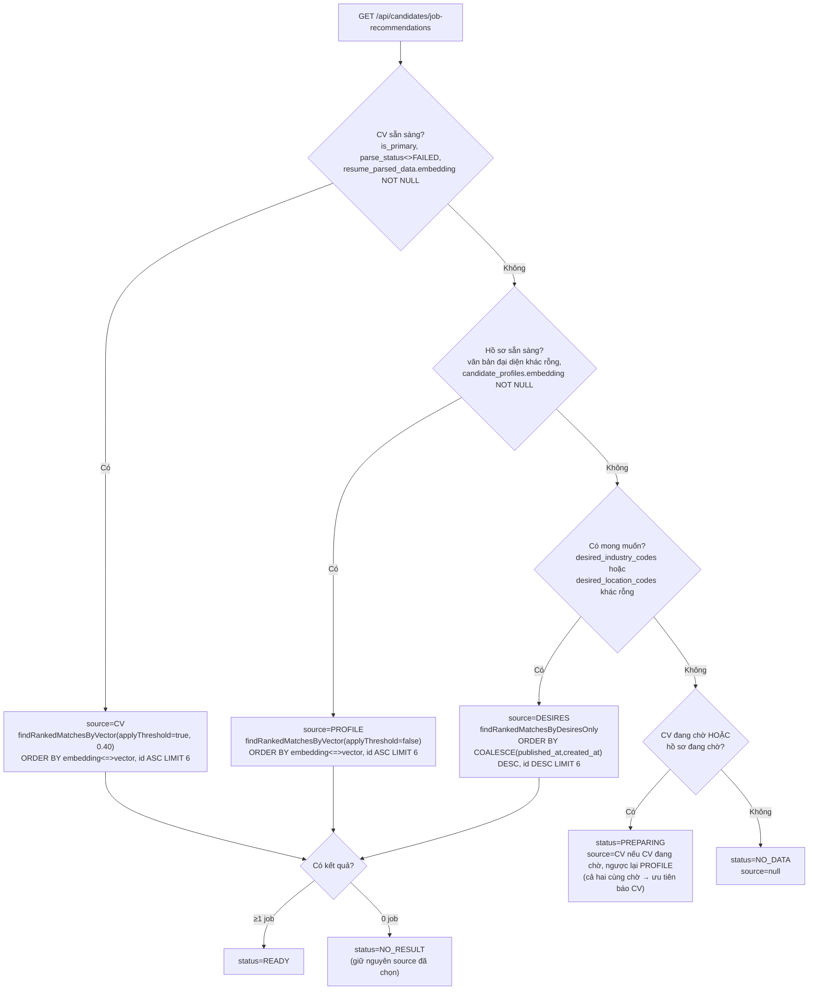

# FR-U15 — Gợi ý việc làm theo hồ sơ (mở rộng FR-U04)

## 1. Mục tiêu

Khối "Gợi ý cho bạn" trên trang Việc làm (`/candidate`) và Bảng tin (`/candidate/dashboard`) trước
đây (FR-U04) chỉ gợi ý được cho ứng viên đã có CV phân tích xong, đọc từ một bảng đệm
(`job_recommendations`) được một scheduler làm mới định kỳ. FR-U15 gỡ hẳn bảng đệm đó, tính gợi ý
**trực tiếp mỗi lần gọi API**, và mở rộng để ứng viên **chưa từng tải CV** nhưng đã khai hồ sơ
nghề nghiệp (FR-U14) hoặc chỉ khai ngành/khu vực mong muốn vẫn nhận được gợi ý — ba nguồn xếp hạng
theo đúng một thứ tự ưu tiên cố định. Mỗi thẻ gợi ý còn hiện thêm dòng "Khớp mong muốn" do backend
tính (không bao giờ dùng để loại job khỏi kết quả). Nhân dịp mở rộng điều kiện cứng, bộ lọc
`categoryCode`/`locationCode` của FR-U07 cũng được nâng từ 1 giá trị lên tối đa 3, dùng chung hạ
tầng với câu truy vấn gợi ý.

## 2. Các file đã tạo/sửa

### Backend

| File | Vai trò |
|---|---|
| `db/migration/V11__drop_job_recommendations.sql` | `DROP TABLE job_recommendations` — xoá hẳn bảng đệm của FR-U04 |
| `job/PublicJobSearchCriteria.java` | `categoryCode`/`locationCode` (String) → `categoryCodes`/`locationCodes` (`List<String>`) |
| `job/JobRepository.java` | `PUBLIC_JOB_FILTER_WHERE` đổi 2 điều kiện sang dạng danh sách (khuôn "Present + sentinel" đã có của `workMode`); thêm `findRankedMatchesByVector` (biến thể i/ii), `findRankedMatchesByDesiresOnly` (biến thể iii), `findOpenJobsByIdIn` |
| `job/JobPublicService.java` | `search(...)` nhận `List<String>`, dedupe + validate + cắt tối đa 3 mã; `getByIds` hydrate `JobSummaryResponse` từ danh sách id đã xếp hạng sẵn |
| `job/JobPublicController.java` | `@RequestParam List<String> categoryCode/locationCode` (lặp tham số, giữ tương thích 1 giá trị cũ) |
| `common/exception/InvalidJobFilterException.java` | Thêm `tooManyCategoryCodes()`/`tooManyLocationCodes()` |
| `jobrecommendation/JobRecommendationCandidateService.java` | Viết lại hoàn toàn — không còn đọc cache, tính trực tiếp theo R-V6; hằng số `MIN_SIMILARITY_SCORE=0.40`, `RECOMMENDATION_LIMIT=6`, `WORK_MODE_LABELS` |
| `jobrecommendation/JobRecommendationCandidateController.java` | Giữ nguyên route, đổi response theo DTO mới |
| `jobrecommendation/JobRecommendationStatus.java`, `JobRecommendationSource.java` | 2 enum mới: `READY/NO_DATA/PREPARING/NO_RESULT`, `CV/PROFILE/DESIRES` |
| `jobrecommendation/JobRecommendationItemResponse.java`, `JobRecommendationResponse.java` | DTO response mới — không có field điểm số nào |
| `user/CandidateProfileRepository.java` | Thêm `findEmbeddingTextByUserId` |
| `resume/ResumeParsedDataRepository.java` | Sửa 1 comment lỗi thời (trỏ tới cache cũ) |
| `application.yml`/`application-test.yml` | Gỡ cấu hình `app.job-recommendation.*` |
| **Đã xoá** `jobrecommendation/JobRecommendation.java`, `JobRecommendationRepository.java`, `JobRecommendationCacheService.java`, `JobRecommendationCacheScheduler.java` | Toàn bộ cơ chế bộ đệm của FR-U04 |

### Frontend

| File | Vai trò |
|---|---|
| `features/jobs/useJobFilters.ts` | `categoryCode`/`locationCode`: `string \| null` → `string[]` (mảng rỗng = không lọc), đọc/ghi URL bằng tham số lặp |
| `features/jobs/JobFilterBar.tsx` | `CategoryField`/`LocationField` đổi `CatalogCombobox` → `CatalogMultiCombobox` (`max={3}`), cả thanh lọc desktop và bottom sheet |
| `features/jobs/types.ts`, `api.ts`, `queries.ts` | Kiểu `JobRecommendation*` mới; `toSearchParams` lặp `append` cho danh sách mã |
| `features/jobs/JobCard.tsx` | Prop tuỳ chọn `matchedConditions?: string[]` — render một khối văn bản "Khớp mong muốn: ..." khi không rỗng |
| `features/jobs/RecommendedJobs.tsx` | Viết lại hoàn toàn theo 5 trạng thái hiển thị; gọi thêm `useMyProfileQuery()` để quyết định ẩn/hiện "Xem tất cả" và câu phụ `NO_RESULT` |
| `features/jobs/JobBoard.tsx` | Prop `showRecommendations?: boolean` — render `RecommendedJobs` khi `true` và đang ở trang 1, không từ khoá, không bộ lọc |
| `pages/CandidateJobListPage.tsx` | Truyền `showRecommendations` |
| `pages/CandidateHomePage.tsx` | Dùng lại `RecommendedJobs` (đã tự có status tường minh, bỏ logic tự suy trạng thái cũ) |

### Seed demo (`db/seed/`)

Thêm ứng viên demo thứ 9 (Hoàng Minh Tuấn, `hoang.minh.tuan@demo.local`) **không có CV** — minh hoạ
nhánh `PROFILE`; xoá mọi tham chiếu `job_recommendations` khỏi `reset-demo-db.sql`,
`export-ai-output.ps1`, `seed-demo-ai-output.sql`, viết lại mục 6/7 của `README.md`.

## 3. Luồng chính

**Chọn nguồn cho mỗi lần gọi `GET /api/candidates/job-recommendations` (R-V6, không cache)**

Cả 3 biến thể truy vấn đều: áp điều kiện cứng ngành/khu vực mong muốn nếu có khai (dùng lại
`PUBLIC_JOB_FILTER_WHERE` của FR-U07, R-H6), loại trừ job đã có đơn trong **chu kỳ hiện tại** của
chính job đó bất kể trạng thái đơn (R-C1, `NOT EXISTS ... AND ja.recruitment_cycle = j.recruitment_cycle`),
không gọi `EmbeddingModel`/LLM ở bước nào (R-V8 — chỉ đọc cột embedding đã có sẵn do scheduler khác
tính từ trước).

**Hai câu truy vấn thật** (`JobRepository.java`):

- Biến thể (i)/(ii) — `findRankedMatchesByVector`: `SELECT j.* FROM jobs j JOIN job_embeddings je ON
  je.job_id = j.id` + `PUBLIC_JOB_FILTER_WHERE` + loại trừ chu kỳ + `AND (:applyThreshold = FALSE OR
  (1 - (je.embedding <=> vector)) >= :minSimilarity)` + `ORDER BY je.embedding <=> vector, j.id ASC
  LIMIT :limit`. `applyThreshold` phân biệt nhánh CV (true, áp 0.40) và nhánh hồ sơ (false, không
  áp) — **một** phương thức Java dùng chung cho cả hai, không viết trùng.
- Biến thể (iii) — `findRankedMatchesByDesiresOnly`: `SELECT j.* FROM jobs j` + `PUBLIC_JOB_FILTER_WHERE`
  + loại trừ chu kỳ + `ORDER BY COALESCE(j.published_at, j.created_at) DESC, j.id DESC LIMIT :limit`
  — không `JOIN job_embeddings` vì ứng viên không có vector nào dùng được.

## 4. Quyết định thiết kế

**(1) Gỡ hẳn bộ đệm `job_recommendations` của FR-U04, không giữ lại để tương thích.**
- Lựa chọn khác: giữ bảng đệm, chỉ thêm 2 nguồn mới (PROFILE/DESIRES) bên cạnh, đồng bộ cả ba vào
  cùng một bảng.
- Lý do chọn: bảng đệm được làm mới bởi `JobRecommendationCacheScheduler` — vốn chỉ biết tính theo
  CV. Thêm 2 nguồn mới vào cùng một scheduler/bảng sẽ phải tái tạo lại toàn bộ logic "làm mới theo
  lịch" cho cả 3 nguồn, trong khi gọi API gợi ý không phải đường nóng tần suất cao (mỗi lần ứng viên
  mở trang Việc làm) — tính trực tiếp đơn giản hơn hẳn và luôn đúng dữ liệu tại thời điểm gọi (không
  có cửa sổ "cache chưa kịp làm mới"). Thực thi bằng `V11__drop_job_recommendations.sql` (R-G1).

**(2) Điều kiện cứng (ngành/khu vực/trạng thái/hạn nộp) dùng chung với FR-U07, không viết riêng cho
gợi ý.**
- Lựa chọn khác: viết một `WHERE` riêng cho câu truy vấn gợi ý, vì ngữ nghĩa gần giống nhưng không
  hoàn toàn trùng `GET /api/public/jobs` (gợi ý còn phải loại trừ chu kỳ đơn — R-C).
- Lý do chọn: `PublicJobSearchCriteria`/`PUBLIC_JOB_FILTER_WHERE` đã được FR-U07 "chuẩn bị điểm nối"
  có chủ đích (ghi ở ROADMAP dòng 571 trước khi FR-U15 code) — mở rộng `categoryCode`/`locationCode`
  sang danh sách ngay tại đây rồi dùng lại nguyên khối, chỉ **nối thêm** điều kiện loại trừ chu kỳ ở
  câu SQL riêng của gợi ý (`AND NOT EXISTS (...)`), không trùng lặp 6 điều kiện còn lại.

**(3) Mã ngành/khu vực `NULL` (chưa chuẩn hoá) vẫn lọt qua điều kiện cứng của gợi ý, không âm thầm
loại.**
- Lựa chọn khác: loại thẳng job thiếu `category_code`/`location_code` khỏi gợi ý (coi như "không đủ
  thông tin để so khớp").
- Lý do chọn: đúng nguyên tắc R-N đã có từ FR-C05/FR-U07 — job chưa chuẩn hoá không phải lỗi của job
  đó, loại âm thầm sẽ khiến một số job hợp lệ biến mất khỏi mọi nơi tìm kiếm mà không ai biết lý do
  (SRS mục 2). Khác với tìm kiếm chủ động (FR-U07), gợi ý không hiện nhãn "Chưa chuẩn hoá" cho các
  job này — nhãn đó chỉ có ý nghĩa khi ứng viên đang chủ động lọc theo đúng trường thiếu dữ liệu.

**(4) Loại trừ theo `recruitment_cycle` của chính job, không phải theo trạng thái đơn.**
- Lựa chọn khác: chỉ loại job có đơn đang `PENDING`/`INTERVIEW_INVITED` (coi đơn `WITHDRAWN` là "coi
  như chưa nộp", vẫn gợi ý lại).
- Lý do chọn: đối chiếu code thật `ApplicationService.withdraw` xác nhận rút đơn chỉ đổi `status`,
  không đổi `recruitment_cycle`, không xoá hàng — đúng đúng ràng buộc `uq_application_per_cycle
  UNIQUE (job_id, candidate_id, recruitment_cycle)`: một khi đã có đơn (dù đã rút) trong chu kỳ đó,
  ứng viên không nộp lại được chu kỳ đó nữa, nên gợi ý lại cũng vô nghĩa. Job đã `CLOSED` rồi mở lại
  (chu kỳ tăng) thì không trùng chu kỳ đơn cũ → được gợi ý lại bình thường.

**(5) Nhánh hồ sơ (PROFILE) không áp ngưỡng tương đồng nào, khác nhánh CV vẫn giữ 0.40.**
- Lựa chọn khác: áp cùng ngưỡng 0.40 cho cả hai nhánh để nhất quán.
- Lý do chọn: văn bản đại diện của hồ sơ (headline/skills/bio, FR-U14) ngắn và thưa hơn hẳn CV đầy
  đủ, điểm tương đồng cosine không cùng thang đo với CV — áp cùng một hằng số tuyệt đối có thể lọc
  sai (quá chặt hoặc quá lỏng) trên một thang đo khác. Phạm vi nhánh này đã được giới hạn đủ bởi
  điều kiện cứng ngành/khu vực (R-H) nếu ứng viên có khai, nên không cần thêm ngưỡng tương đồng.

**(6) Tie-break `j.id ASC` ở biến thể (i)/(ii) nhưng `j.id DESC` ở biến thể (iii) — có chủ đích,
không phải thiếu nhất quán.**
- Lựa chọn khác: dùng chung một chiều tie-break cho cả 3 biến thể.
- Lý do chọn: mỗi chiều đi theo đúng tiền lệ đã có của chính kiểu xếp hạng đó trong dự án — biến thể
  (i)/(ii) xếp theo khoảng cách embedding, dùng đúng chiều `JobEmbeddingRepository.findTopMatchingJobs`
  đã dùng cho xếp hạng theo vector; biến thể (iii) xếp theo thời gian đăng mới nhất, dùng đúng chiều
  `JobRepository.searchPublicJobsSortedByNewest` (sort=NEWEST của FR-U07) đã dùng cho xếp hạng theo
  thời gian. Tự ý thống nhất một chiều sẽ làm lệch khỏi tiền lệ của một trong hai, không có lý do
  nghiệp vụ nào đòi hai kiểu xếp hạng khác nhau phải tie-break cùng chiều.

**(7) "Xem tất cả" ẩn hẳn ở `/candidate` khi ứng viên không khai ngành lẫn khu vực mong muốn, nhưng
luôn hiện ở `/candidate/dashboard`.**
- Lựa chọn khác: luôn hiện nút ở cả hai trang, trỏ về `/candidate` không tham số khi không có gì để
  điền sẵn.
- Lý do chọn: ở `/candidate`, khối gợi ý đã nằm ngay trên chính trang Việc làm — bấm "Xem tất cả" mà
  không điền được gì sẽ chỉ dẫn về đúng trang đang đứng, vô nghĩa với ứng viên. Ở `/candidate/dashboard`
  (Bảng tin), trang không có bộ lọc riêng nên nút luôn có nghĩa (dẫn sang trang Việc làm), bất kể có
  điền sẵn được gì hay không.

**(8) Dòng "Khớp mong muốn" là một khối văn bản duy nhất, không phải nhiều chip rời — sửa sau khi
soát tay, khác bản đầu đã code.**
- Lựa chọn khác (đã code, sau đó sửa lại): mỗi điều kiện khớp là một `` chip riêng, xếp dưới
  khối thẻ.
- Lý do chọn sửa lại: soát tay (03/10/2026) phát hiện chip rời xếp **chồng dưới** các tag khu vực/
  ngành màu xanh đã có sẵn trên `JobCard` (vốn cũng hiện nhãn khu vực/ngành), lặp lại y nguyên nhãn
  — rối mắt, trông như hai hàng nhãn khác nhau cho cùng một thông tin. Gộp thành một dòng văn bản
  "Khớp mong muốn: ..." với nhãn đứng đầu rõ nghĩa hơn là nhiều ô màu rời rạc không có ngữ cảnh.
  Cùng lượt soát tay này còn phát hiện 3 liên kết ("Xem tất cả"/"Hoàn thiện hồ sơ"/"Chỉnh mong muốn")
  hiện chữ đen thay vì xanh — nguyên nhân là `index.css` có rule `a { color: inherit }` nằm **ngoài**
  mọi `@layer`, nên theo CSS Cascade Layers nó luôn thắng bất kỳ utility class Tailwind (nằm trong
  `@layer utilities`) đặt trực tiếp trên `<a>`, không liên quan gì tới việc chọn đúng token màu — đã
  vá cục bộ bằng cách chuyển màu/gạch chân sang `` con bên trong mỗi `<Link>` (xem mục "Nợ kỹ
  thuật").

## 5. Ràng buộc đã thực thi

| Mã | Ràng buộc | Thực thi ở đâu |
|---|---|---|
| R-G1/R-G3 | Xoá hẳn 4 class + bảng cache cũ; giữ nguyên route/tên file controller/service | `V11__drop_job_recommendations.sql`; `JobRecommendationCandidateController.java`/`Service.java` giữ tên |
| R-G2 | Ngoại lệ đã duyệt: xoá 2 file test cũ, thay bằng test mới đúng bảng đối chiếu (mục 6) | `JobRecommendationCacheServiceTest.java`/`JobRecommendationCandidateControllerIntegrationTest.java` (bản cũ) đã xoá |
| R-H1-H3 | `categoryCode`/`locationCode`: String → `List<String>`, giữ tương thích 1 giá trị cũ | `PublicJobSearchCriteria.java`, `JobPublicController.java`, `JobPublicService.search` |
| R-H4/R-H5 | Dedupe giữ thứ tự, tối đa 3 mã/loại, mã lạ vẫn 400 `INVALID_CATALOG_CODE` | `JobPublicService.dedupePreservingOrder` + `InvalidJobFilterException.tooManyCategoryCodes/tooManyLocationCodes` |
| R-H6 | Gợi ý dùng lại `PUBLIC_JOB_FILTER_WHERE`, không viết điều kiện cứng riêng | `JobRepository.findRankedMatchesByVector/findRankedMatchesByDesiresOnly` |
| R-N1 | Mã NULL vẫn lọt điều kiện cứng, không hiện nhãn "Chưa chuẩn hoá" ở khối gợi ý | `PUBLIC_JOB_FILTER_WHERE` (`OR j.category_code IS NULL`); `JobCard` không truyền `filterContext` ở `RecommendedJobs` |
| R-C1/R-C2 | Loại trừ theo `recruitment_cycle` hiện tại, bất kể trạng thái đơn; chỉ áp cho gợi ý | `NOT EXISTS (...) AND ja.recruitment_cycle = j.recruitment_cycle` trong cả 2 câu truy vấn |
| R-V1-V5 | 5 trạng thái sẵn sàng (CV/hồ sơ sẵn sàng/đang chờ, có mong muốn) | `JobRecommendationCandidateService.getRecommendationsForCandidate` |
| R-V6 | Thứ tự ưu tiên chọn nguồn, PREPARING ưu tiên báo CV khi cả hai cùng chờ | `JobRecommendationCandidateService` (nhánh if/else theo đúng thứ tự) |
| R-V7-V9 | Điều kiện cứng áp cho cả 3 biến thể; không gọi LLM/embedding; giữ nguyên ngưỡng 0.40 chỉ ở nhánh CV | `findRankedMatchesByVector(applyThreshold)`; không có `ChatClient`/`EmbeddingModel` trong package |
| R-S1-S4 | `status`/`source` tường minh, không field điểm số, tính trực tiếp không ghi DB | `JobRecommendationResponse`/`JobRecommendationItemResponse`; test #14 (mục 6) |
| R-S5 | Câu phụ `NO_RESULT` phụ thuộc mong muốn, không phụ thuộc `source` | `RecommendedJobs.tsx` dùng `useMyProfileQuery()` độc lập với `source` |
| R-L1 | `LIMIT 6` trong SQL; mobile chỉ hiện 3 thẻ bằng CSS | `RECOMMENDATION_LIMIT=6`; `RecommendedJobs.tsx` `index >= 3 ? 'hidden sm:block'` |
| R-L2-L4 | 1 component dùng chung, prop `showRecommendations` | `RecommendedJobs.tsx`, `JobBoard.tsx`, `CandidateJobListPage.tsx` |
| R-L3 | Chỉ hiện khi trang 1, không từ khoá, không bộ lọc | `JobBoard.tsx` `showRecommendedBlock` |
| R-M1-M5 | `matchedConditions` backend tính, 4 điều kiện độc lập, không loại job, thứ tự cố định | `JobRecommendationCandidateService.matchedConditions/matchesDesiredSalary` |
| R-F1-F4 | Bộ lọc U07 chọn nhiều, tối đa 3, validate cả 2 tầng | `useJobFilters.ts`, `JobFilterBar.tsx` (`CatalogMultiCombobox`) |
| R-X1-X4 | "Xem tất cả" điền sẵn ngành/khu vực (không điền lương/hình thức), ẩn/hiện theo trang | `RecommendedJobs.tsx` `buildViewAllHref`/`showViewAll` |
| R-P1-P3 | Không lộ `matchedConditions`/`status`/`source` cho HR; 403 khi HR gọi endpoint ứng viên | Test #13 (mục 6); `SecurityConfig` không đổi |

## 6. Đã kiểm thử gì

**Test tự động** — tổng **770/770** test của full suite (`./mvnw test`, đợt cuối, xanh hoàn toàn),
tăng từ **747** của FR-U14: **−6** (2 file test cũ bị xoá theo R-G2: `JobRecommendationCacheServiceTest`
4 method + `JobRecommendationCandidateControllerIntegrationTest` cũ 2 method) **+29** (`JobRecommendationCandidateServiceTest`
mới 19 method + `JobRecommendationCandidateControllerIntegrationTest` mới 5 method + 5 method mới
trong `JobPublicIntegrationTest` cho R-H3/R-H4) = 747 − 6 + 29 = **770**.

### Bảng đối chiếu 7 test cũ → test mới

| # | Test cũ | Test mới | Giữ nguyên ý nghĩa |
|---|---|---|---|
| 1 | `refreshOne_jobsAboveAndBelowThreshold_onlyAboveThresholdCached` | `getRecommendations_cvBranch_jobsAboveAndBelowThreshold_onlyAboveThresholdIncluded` | Job trên/dưới ngưỡng 0.40 ở nhánh CV |
| 2 | `refreshOne_candidateWithoutPrimaryResume_doesNothing` | `getRecommendations_noCvNoProfileNoDesires_returnsNoData` | Ứng viên hoàn toàn trống → không có gợi ý (mở rộng: `NO_DATA` tường minh thay "cache rỗng") |
| 3 | `refreshOne_calledAgainAfterJobClosed_removesClosedJobFromCache` | `getRecommendations_cvBranch_jobClosedBetweenCalls_excludedImmediately` | Job đóng không còn gợi ý — không cần "lượt làm mới" vì không còn cache |
| 4 | `refreshOne_candidateITResume_doesNotRecommendAccountingJob` | `getRecommendations_cvBranch_doesNotRecommendJobOutsideSimilarityThreshold` | Giữ nguyên kỹ thuật vector mô phỏng 0.49/0.355, CV IT không gợi ý job Kế toán |
| 5 | `getRecommendations_noCache_returnsEmptyList` | `getRecommendations_noData_returnsEmptyItemsWithNoDataStatus` | Ứng viên mới, không dữ liệu → API trả rỗng, không lỗi (mở rộng: kèm `status=NO_DATA`) |
| 6 | `getRecommendations_hasCachedRecommendations_...` (phần thứ tự) | `getRecommendations_cvBranch_returnsOrderedBySimilarityDesc` | Job similarity cao hơn đứng trước — seed bằng `JobEmbeddingStateService` thật (bảng cache không còn) |
| 7 | `getRecommendations_hasCachedRecommendations_...` (phần không lộ điểm) | `getRecommendations_responseDoesNotContainSimilarityScoreField` | JSON không chứa `similarityScore`/`matchScore` |

### Sự cố full suite — 5 test đỏ do nhiễm dữ liệu từ lớp test khác (đợt 9, không phải lỗi service)

Chạy riêng lớp `JobRecommendationCandidateServiceTest` (19/19) và `JobRecommendationCandidateControllerIntegrationTest`
(5/5) đều xanh, nhưng full suite báo **5 test đỏ**, tất cả cùng trả về một bộ 6 UUID cố định bất kể
input mock của từng test. Chẩn đoán: `ResumeEmbeddingOrchestratorTest`, `JobEmbeddingOrchestratorTest`,
`JobEmbeddingPipelineIntegrationTest` — cả 3 đều **không** `@Transactional` cấp class, ghi **thật**
job `OPEN` + embedding vào Postgres Testcontainers dùng chung, tồn tại suốt phần còn lại của full
suite (đúng hiện tượng đã có tiền lệ, ghi trong comment 3 file đó từ trước, gây lỗi tương tự cho
`JobRecommendationCacheServiceTest` cũ). Khác biệt lần này: bảng cache cũ **không** có `LIMIT` nên
test cũ chịu được nhiễm bằng assertion khoan dung (`contains`/`doesNotContain`, không bao giờ
`containsExactly`); câu truy vấn **mới** áp `RECOMMENDATION_LIMIT=6` ngay trong SQL (top-N) — job
rác đủ để lấp đầy `LIMIT` trước khi tới job mà từng test thực sự cần kiểm, đẩy hẳn job đó ra ngoài
kết quả, assertion khoan dung không còn cứu được.

Cách xử lý (đã duyệt phương án): thêm `@BeforeEach` ở **cả hai** lớp test gợi ý mới, soft-delete
(`UPDATE jobs SET deleted_at = now() WHERE status = 'OPEN' AND deleted_at IS NULL`) toàn bộ job
`OPEN` sót lại trước khi tạo fixture riêng của từng test — chạy qua `JdbcTemplate` (tham gia
transaction của test, tự rollback sau mỗi test ở lớp có `@Transactional` cấp class; commit thật
nhưng vô hại ở lớp dùng MockMvc không có transaction cấp class). **Không sửa** bất kỳ `assertThat`
nào, không sửa code sản phẩm, không đụng 3 lớp test nguồn gây nhiễm (chúng vẫn không tự dọn — ghi
lại ở mục "Nợ kỹ thuật"). Sau khi thêm, chạy lại nhóm 6 lớp liên quan (85/85) rồi full suite
(770/770) — xanh hoàn toàn.

**Đo hiệu năng (`EXPLAIN ANALYZE` thật, Testcontainers, 10+10 job seed thêm cho test tạm thời ở đợt
5, đã xoá khỏi file sau khi ghi số đo):**

- Biến thể (i)/(ii) — vector (`JOIN job_embeddings`, `applyThreshold=true`): planner chọn **Index
  Scan** `idx_jobs_location_code` cho điều kiện `jobs` (lọc trước, không phải HNSW), **Seq Scan**
  trên `job_embeddings` (bảng nhỏ) kèm `Rows Removed by Filter: 2`, rồi **Sort quicksort** tường
  minh ở tầng trên cùng (không có Index Scan qua HNSW cho `ORDER BY embedding <=> vector`) —
  **Planning Time: 0.614 ms, Execution Time: 3.126 ms**.
- Biến thể (iii) — desires only (không `JOIN job_embeddings`): **Index Scan** `idx_jobs_location_code`
  + **Sort top-N heapsort** — **Planning Time: 0.201 ms, Execution Time: 0.080 ms**.

Ở quy mô dữ liệu demo/test hiện tại (vài chục job), planner luôn chọn quét trước-lọc-sau (Seq/Index
Scan trên `jobs`/`job_embeddings` nhỏ) rồi mới `Sort`/`LIMIT`, **không** đi qua chỉ mục HNSW cho
`ORDER BY ... <=> ...`. Đúng như nợ kỹ thuật đã ghi trước khi đo (REQUIREMENT.md mục 10): nếu dữ
liệu lớn hơn khiến planner chuyển sang Index Scan qua HNSW, chỉ mục trả về top-k gần nhất **trước
khi** áp các điều kiện `WHERE` khác (điều kiện cứng/loại trừ chu kỳ/ngưỡng) — có thể trả về ít hơn
`LIMIT 6` dù còn job hợp lệ nằm ngoài top-k ban đầu. Chưa quan sát được ảnh hưởng này ở quy mô hiện
tại.

**Test tay** (người dùng thực hiện, kết quả ghi lại nguyên văn, 03/10/2026, desktop và 375px):

Gợi ý theo hồ sơ cho `hoang.minh.tuan@demo.local` (không có CV) ra đúng 1 việc, `source=PROFILE`;
"Xem tất cả" điền sẵn `categoryCode=SALES&locationCode=HO_CHI_MINH`; lọc 3 ngành + 1 khu vực ra đúng
3 việc (kiểm chọn nhiều `CatalogMultiCombobox` ở `JobFilterBar`); tài khoản hồ sơ trắng hiện lời mời
hoàn thiện hồ sơ (`NO_DATA`), không có nút "Xem tất cả" ở `/candidate` (R-X3 — ẩn khi không khai
ngành/khu vực); khối "Gợi ý cho bạn" hiện đúng ngay sau khi đăng nhập và sau khi bấm "Xoá bộ lọc"
(đã kiểm code: `clearFilters()` xoá cả `page`, `hasActiveFilters` không tính `page`/`sort`); Bảng
tin (`/candidate/dashboard`) có khối gợi ý + luôn có nút "Xem tất cả" (R-X3, khác `/candidate`).

## 7. Nợ kỹ thuật

- **`index.css:124-127`** — rule `a { color: inherit; text-decoration: none; }` nằm ngoài mọi
  `@layer`; theo CSS Cascade Layers, một rule không nằm trong layer nào luôn thắng mọi rule layered
  (kể cả `@layer utilities` của Tailwind), bất kể specificity — bất kỳ `<Link>`/`<a>` nào đặt màu/
  gạch chân trực tiếp (ví dụ `text-brand`) đều bị đè thành màu kế thừa. Đã vá cục bộ ở
  `RecommendedJobs.tsx` (chuyển `text-m3-primary`/`hover:underline` sang `` con, giữ
  `focus-visible:outline` trên `<Link>` vì `outline` không bị rule đó đụng tới). Còn ảnh hưởng
  `JobApplyForm.tsx:68,79` và `NotificationDropdown.tsx:57` — chưa vá, cùng lỗi. Cách sửa gốc: bọc
  `a {...}` trong `@layer base { ... }` ở `index.css`, ảnh hưởng toàn site nên cần một nhánh riêng.
- Trang chi tiết việc làm (`/jobs/:id`) hiện mã thô `FULL_TIME`/`ONSITE` thay vì nhãn tiếng Việt —
  đã ghi nhận từ trước ở `refactor/ui-md3-legacy` (Phase 2.1b), tái xác nhận khi soát tay FR-U15.
- Các lớp test tích hợp tạo job `OPEN` không tự dọn (`ResumeEmbeddingOrchestratorTest`,
  `JobEmbeddingOrchestratorTest`, `JobEmbeddingPipelineIntegrationTest`) — xem mục 6 "Sự cố full
  suite". Cách xử lý ở FR-U15 (soft-delete ở `@BeforeEach` của 2 lớp test gợi ý) không giải quyết
  gốc rễ, chỉ phòng vệ ở phía chịu ảnh hưởng.
- Nhãn hình thức làm việc (`ONSITE`/`HYBRID`/`REMOTE`) chép tay song song ở backend
  (`JobRecommendationCandidateService.WORK_MODE_LABELS`) và frontend (`jobLabels.ts`) — chưa có
  bảng nhãn dùng chung ở backend để frontend đọc qua API.
- `MIN_SIMILARITY_SCORE = 0.40` (nhánh CV) kế thừa nguyên nợ đã ghi từ FR-U04 (gần như không lọc
  được ở quy mô dữ liệu hiện tại) — không sửa trong phạm vi FR-U15 (R-V9).
- Giới hạn "tối đa 6"/"tối đa 3 mã mỗi loại" là hằng số cứng trong code, chưa có cấu hình.
- Truy vấn vector (biến thể i/ii) kèm `LIMIT 6` có thể trả ít hơn 6 dù còn job thoả mãn, nếu planner
  chuyển sang Index Scan qua HNSW ở quy mô dữ liệu lớn hơn (xem số đo `EXPLAIN ANALYZE`, mục 6).
- `CatalogMultiCombobox` kế thừa hạn chế tìm theo nhãn (không bí danh "HCM"...) từ FR-C05 — không
  mở rộng thêm ở FR-U15.
- `README.md` gốc (thư mục root) dòng 66 "Chưa triển khai chức năng nào" đã lỗi thời từ lúc khởi tạo
  repo — chưa ai cập nhật lại dù dự án đã hoàn thành 18 FR gốc + nhiều FR bổ sung.

## 8. Lệch so với đặc tả

Không phát hiện lệch nào giữa code cuối cùng và REQUIREMENT.md/UI.md đã duyệt. Điểm duy nhất từng
khác bản nháp ban đầu — cách hiển thị "Khớp mong muốn" (chip rời → một khối văn bản) và màu 3 liên
kết — đã được sửa cả code và tài liệu đặc tả (REQUIREMENT.md mục 3.8, UI.md mục 4/5/7/8/9/10) trong
cùng lượt soát tay trước khi chốt "Đã hoàn thành", nên không còn là điểm lệch.

## Câu hỏi kiểm tra

1. Vì sao `findRankedMatchesByVector` dùng chung một phương thức Java cho cả nhánh CV và nhánh hồ
   sơ (chỉ khác tham số `applyThreshold`), nhưng `findRankedMatchesByDesiresOnly` lại là một
   phương thức riêng hẳn, không cố gộp chung với hai nhánh trên bằng một cờ tương tự?
2. Một ứng viên có CV đã phân tích xong nhưng `ResumeEmbeddingScheduler` chưa kịp tính embedding,
   và cũng có hồ sơ nghề nghiệp đã có embedding đầy đủ. API trả về `status`/`source` gì? Trích đúng
   nhánh R-V6 áp dụng.
3. Vì sao rule `a { color: inherit }` trong `index.css` thắng được `text-m3-primary` dù class sau
   có specificity cao hơn (selector dạng class vs selector dạng element)? Nếu chuyển
   `text-m3-primary` sang đặt trên `<Link>` cùng với `!important` thì có sửa được không, tại sao
   cách đó không nên dùng?
