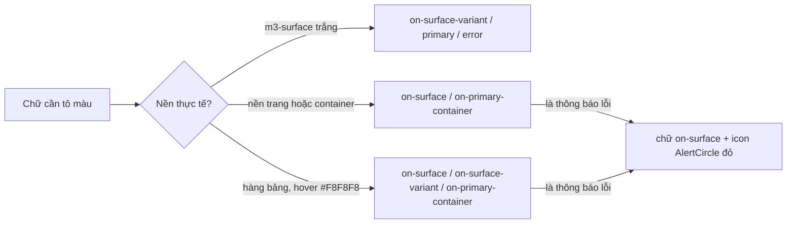

# Walkthrough — `refactor/ui-md3-legacy` (Phase 2.1b)

Nhánh chỉ sửa `frontend/` và `docs/`; `git diff --stat main -- backend` rỗng. Các commit, theo thứ tự:
`dae60f8` (ROADMAP) → `eadd087` đợt 1 → `156bd5e` đợt 2 → `84ac48c` đợt 3 → `9219cfa` đợt 4 →
`67d9ed5`, `e24d594`, `2938553`, `0938f06` (sửa sau soát tay).

## 1. Mục tiêu

Các màn hình làm trước khi có hệ thống thiết kế MD3 vẫn dùng token màu cũ (`brand`, `ink`, `line`,
`canvas`...). Một số cặp chữ/nền ở các màn hình này không đạt tương phản 4.5:1, và badge trạng thái
đơn dùng cặp xanh lá/đỏ, gợi ý phán quyết tốt/xấu. Nhánh này đưa toàn bộ màn hình cũ sang token vai
trò `m3-*` của `docs/UI_GUIDE.md`, theo cách sau:

- **Chọn token theo nền thực tế**, không đổi tên một-một. Token mới có cùng giá trị với token cũ,
  nên đổi tên thuần tuý không làm tăng tương phản.
- Sửa điều hướng theo UI_GUIDE mục 2: HR dùng drawer/rail; ứng viên và khách dùng menu sheet trên
  điện thoại.
- Đổi 4 bộ badge sang bảng màu trung tính.

Hành vi nghiệp vụ không đổi.

## 2. Các file đã tạo/sửa

Tổng cộng 65 file, chỉ thuộc frontend và docs. Nhóm theo vai trò:

| File / nhóm file | Vai trò |
|---|---|
| `frontend/src/index.css` | Khai thêm 5 token (`m3-inverse-surface`, `m3-inverse-on-surface`, `m3-surface-container-highest`, `m3-warning`, `m3-on-error`); bọc rule `a {}` vào `@layer base`; trỏ `--input` về `m3-outline` |
| `components/layout/MobileNavSheet.tsx` (mới) | Nút menu + sheet điều hướng dùng chung cho `PublicHeader` (dưới `sm`) và `CandidateLayout` (dưới `md`) |
| `components/layout/PublicHeader.tsx`, `CandidateLayout.tsx` | Menu sheet trên mobile; tab "Việc làm" sáng cả ở `/jobs/:id` |
| `components/layout/HrLayout.tsx` | Drawer 240px từ `lg`, rail 80px (icon + nhãn ngắn) dưới `lg` |
| `components/layout/PublicFooter.tsx` | Nền `m3-inverse-surface` |
| `pages/*` (16 file), `features/**` (đợt 2–3) | Đổi token theo nền; `PublicJobDetailPage` thêm nhãn tiếng Việt cho loại hợp đồng và hình thức làm việc, cùng icon `Building2` cho ô logo trống |
| `features/applications/applicationLabels.ts` | `APPLICATION_STATUS_STYLES` theo bảng trung tính đã chốt |
| `features/jobs/JobStatusBadge.tsx`, `features/scoring/ScoringRunStatusBadge.tsx`, `features/resumes/resumeLabels.ts` | Badge Job / lượt chấm / trích xuất CV sang `m3-*` |
| `features/dashboard/StatusBreakdownChart.tsx` | Màu biểu đồ đọc qua `var(--color-m3-*)` |
| `docs/UI_GUIDE.md` | Mục 0, 1c, 3, 4, 5, 6 khớp mã nguồn sau khi đổi |
| `docs/ROADMAP.md` | Bảng quy tắc đổi token, chia đợt, nợ kỹ thuật Phase 2.1b |

## 3. Luồng chính

Nhánh không có request backend mới. Có ba "luồng" cần hiểu:

**a) Một class màu đi tới trình duyệt.** Token khai trong khối `@theme` gốc của `index.css`
(`--color-m3-primary: #0078C9`). Tailwind 4 quét mã nguồn, sinh utility `text-m3-primary` trong
`@layer utilities`, và chỉ giữ biến theme nào có class dùng tới. Nhờ vậy, mỗi lần đổi token, tôi
kiểm lại CSS build bằng `grep --color-m3-… dist/assets/*.css`.

**b) Vì sao liên kết trước đây không ăn màu.** Rule `a { color: inherit }` cũ nằm ngoài mọi
`@layer`. Theo quy tắc cascade layers, CSS ngoài layer luôn thắng CSS trong layer, bất kể độ đặc
hiệu (specificity). Vì vậy mọi class màu đặt trên `<a>`/`<Link>` bị đè thành màu kế thừa (đen), kể
cả chữ trắng của nút `Button asChild` bọc `Link`. Sau khi bọc rule vào `@layer base`, utility trong
`@layer utilities` thắng như mong đợi. FR-U15 từng phải vá tạm bằng `` con; bản vá này đã gỡ.

**c) Menu mobile.** `MobileNavSheet` dùng `Sheet` (Radix Dialog) có sẵn ở `components/ui`. Mỗi mục
được bọc trong `SheetClose`, nên sheet tự đóng khi chọn. Breakpoint ẩn/hiện do nơi gọi truyền qua
`triggerClassName` (`sm:hidden` hoặc `md:hidden`). Rail của HR không có state: cùng một danh sách
`NAV_ITEMS`, chỉ đổi bằng class responsive (`w-20 lg:w-60`, nhãn ngắn `lg:hidden`).

## 4. Quyết định thiết kế

**Đổi token theo nền, không tìm-thay một-một.**
- Đã chọn: với các token phụ thuộc nền (`text-ink-muted`, `text-brand`, `text-danger`), dò nền của
  thẻ bao ngoài rồi mới quyết định.
- Lựa chọn khác: đổi tên hàng loạt.
- Lý do: token `m3-*` cùng giá trị với token cũ, nên đổi tên không sửa được các cặp trượt
  (4.07–4.24:1). Script dò nền làm bước đầu; mọi chỗ dò không chắc (`TOP`, thẻ mở dài) được xem
  tay. Các chỗ phải ép quyết định bằng tay được ghi trong tin nhắn đợt 2/3.

**Chữ lỗi trên nền xám dùng `m3-on-surface` kèm icon `AlertCircle` đỏ** (commit `67d9ed5`, `2938553`).
- Lựa chọn khác:
  - Giữ chữ đỏ: chỉ đạt 4.16:1 trên nền trang, 4.46:1 trong hàng bảng khi hover.
  - Bọc lỗi vào thẻ trắng: đổi bố cục.
- Lý do: icon chỉ cần 3:1 (đạt 4.16–4.46:1), chữ đạt 12.88–13.82:1, và tín hiệu "lỗi" không chỉ
  dựa vào màu (UI_GUIDE mục 6). Khối có `role="alert"`, trừ `ResumeReparseStatus`: khối này đã nằm
  trong vùng `aria-live="polite"`, gắn thêm sẽ khiến trình đọc màn hình đọc hai lần (`0938f06`).

**Hai khối đổi nền sang trắng thay vì đổi màu chữ.**
- Khối cảnh báo của `InterviewInvitationDialog` (theo ROADMAP) và khối tổng trọng số của
  `RubricTab`: đổi nền `bg-canvas` thành `m3-surface`.
- Lý do: viền/icon `m3-warning` chỉ đạt 2.73:1 trên nền xám, còn chữ đỏ "Tổng đang vượt 100%" là
  tín hiệu cần giữ màu.

**Badge trạng thái đơn phân biệt bằng mức nhấn mạnh** (bảng chốt 05/10/2026).
- `PENDING` nền xám, `INTERVIEW_INVITED` xanh nhạt, `HIRED` nền đặc `m3-primary`, `REJECTED` viền
  `m3-outline` trên nền trắng, `WITHDRAWN` viền nhạt + chữ phụ.
- Lựa chọn khác: giữ xanh lá/đỏ, nhưng như vậy vi phạm FR-H07 vì gợi ý tốt/xấu.
- Badge luôn kèm chữ. Màu chỉ phụ thuộc trạng thái do HR đổi, không phụ thuộc điểm.

**Viền ô nhập qua `--input`, không sửa `components/ui`.**
- Đổi một biến trong `:root` (1.23:1 → 4.83:1) thay vì truyền class cho từng `Input`/`Select`/
  `Checkbox`.
- Không đụng `--accent` và `--border`, vì nhiều component shadcn dùng chung hai biến này.

**Hàng bảng: không xoá hiệu ứng hover.** `TableRow` có `hover:bg-muted/50` (#F8F8F8). Có ba lựa
chọn: `hover:bg-transparent` (mất phản hồi khi rê chuột), đổi `--muted` (lan rộng), hoặc đổi màu
chữ. Đã chọn đổi màu chữ: trong hàng bảng chỉ dùng `m3-on-surface`, `m3-on-surface-variant` và
`m3-on-primary-container`. Nút Xoá chuyển sang icon `Trash2` đỏ + chữ `m3-on-surface`, nền hover xám.

**Thêm `MobileNavSheet` dùng chung**, thay vì viết hai sheet riêng. Hai layout cần cùng hành vi
(đóng khi chọn, vùng chạm 48px, `aria-label`); tách component giúp sửa một chỗ là đủ.

## 5. Ràng buộc đã thực thi

| Nguồn | Ràng buộc | Thực thi ở đâu |
|---|---|---|
| FR-H07, UI_GUIDE mục 4 | Badge trạng thái trung tính, không cặp xanh/đỏ | `APPLICATION_STATUS_STYLES` (`applicationLabels.ts`), `JobStatusBadge`, `ScoringRunStatusBadge`, `PARSE_STATUS_STYLES` |
| FR-H05/H07 | Điểm không đổi màu theo ngưỡng | Ô điểm (`CandidatesTable`, `ApplicationsTab`, `ScoringRunAuditPanel`, `JobPerformanceTable`) dùng một màu cố định; `StatusBreakdownChart` một màu cho 5 cột |
| FR-H06 | Mọi điểm mở ra được evidence; evidence có viền trái màu chính | `CriterionScoreBreakdown` — `blockquote` `border-m3-primary bg-m3-primary-container` (chỉ đổi token) |
| FR-U02 | Consent không tick sẵn | `JobApplyForm` — `useState(false)`, nút Nộp bị khoá khi chưa tick (chỉ đổi màu Label) |
| UI_GUIDE mục 6 | Chữ ≥ 4.5:1, viền/icon điều khiển ≥ 3:1 | Bảng số đo ở mục 6 của tài liệu này |
| UI_GUIDE mục 2 | HR drawer ≥ lg / rail < lg; ứng viên tab ≥ md / sheet < md | `HrLayout`, `CandidateLayout`, `MobileNavSheet` |
| UI_GUIDE 1h | Vùng chạm ≥ 48px dưới `sm`; icon-only có `aria-label` | Nút menu `size-12`, mục sheet `min-h-12`, `aria-label="Mở menu điều hướng"` |
| ROADMAP "Xong khi" | Không còn token cũ trong code tầng tính năng | Lệnh rg ở ROADMAP → 0 chỗ khớp |
| CLAUDE.md mục 7 | Không sửa backend | `git diff --stat main -- backend` rỗng |

## 6. Đã kiểm thử gì

**Tự động (chạy lại một lượt sau commit cuối `0938f06`):**
- `npm run build`, `npm run lint`: sạch.
- `.\mvnw.cmd test` (biến môi trường inline, LLM được mock): 770 test, 0 thất bại, 0 lỗi, 0 bỏ qua.
  Trước đây ghi nhầm 774: con số đó tính cả 4 test của lớp `JobRecommendationCacheServiceTest`. Lớp này
  đã bị xoá ở FR-U15, nhưng file báo cáo cũ của nó còn sót trong `backend/target/`.
- Lệnh rg ở mục "Xong khi" (chạy bằng ripgrep qua công cụ Grep vì `rg` không có trong PATH): 0 chỗ
  khớp. Mốc đầu là 616 chỗ / 59 file (tính theo số chỗ khớp, không theo số dòng).
- CSS build có đủ 5 token mới; rule `a` nằm trong `@layer base` (đã kiểm bằng cách phân tích file
  CSS build).

**Soát tay (người dùng thực hiện, báo kết quả 05/10/2026):**
- Mọi route "Hiện có" ở UI_GUIDE mục 7, ở cả khổ desktop và điện thoại: đạt. Các lỗi phát hiện khi
  soát đã sửa ở `67d9ed5`, `e24d594`, `2938553`, `0938f06`.
- Menu sheet (mở/đóng, chọn mục thì sheet đóng, Đăng xuất) và rail HR dưới `lg`: hoạt động đúng,
  kể cả điều hướng bằng bàn phím.

**Chưa kiểm thử:**
- Không có test tự động nào cho frontend (dự án chưa có test component/UI), nên một lần đổi màu sai
  sau này sẽ không có test bắt.
- Kết quả soát tay không gồm thử với trình đọc màn hình thật (đọc `role="alert"`, `aria-live`).
- Chưa đo tương phản ở chế độ tối: dự án chưa bật dark mode.

**Bảng số đo tương phản** (công thức relative luminance WCAG 2.1; làm tròn xuống 2 chữ số;
`#F8F8F8` = `TableRow` `hover:bg-muted/50`, `#F5FAFD` = `m3-primary-container/40`,
`#D2D4D7` = chữ trắng `opacity-80` trên footer):

| Loại | Chữ / viền | Nền | Tỉ lệ | Ngưỡng | Dùng ở |
|---|---|---|---|---|---|
| Chữ | `m3-on-surface` | `m3-surface` | 14.67:1 | 4.5 | Chữ chính trên thẻ, dialog, sheet, bảng |
| Chữ | `m3-on-surface` | `m3-surface-container` | 12.88:1 | 4.5 | Chữ trên nền trang; badge PENDING/DRAFT; chip trung tính |
| Chữ | `m3-on-surface` | `m3-surface-container-high` | 13.05:1 | 4.5 | Khối nội dung AI |
| Chữ | `m3-on-surface` | `m3-surface-container-highest` | 11.88:1 | 4.5 | Badge PAUSED |
| Chữ | `m3-on-surface` | `m3-primary-container` | 12.89:1 | 4.5 | Evidence, khối "Nộp đơn thành công" |
| Chữ | `m3-on-surface` | `#F8F8F8` | 13.82:1 | 4.5 | Chữ trong hàng bảng khi hover |
| Chữ | `m3-on-surface-variant` | `m3-surface` | 4.83:1 | 4.5 | Chữ phụ trên thẻ trắng; badge WITHDRAWN, Job CLOSED |
| Chữ | `m3-on-surface-variant` | `#F8F8F8` | **4.55:1** | 4.5 | **Sát ngưỡng** — chữ phụ trong hàng bảng khi hover |
| Chữ | `m3-on-surface-variant` | `#F5FAFD` | **4.59:1** | 4.5 | **Sát ngưỡng** — nội dung/giờ của thông báo chưa đọc |
| Chữ | `m3-primary` | `m3-surface` | 4.63:1 | 4.5 | Liên kết, nút viền, tab đang chọn |
| Chữ | `m3-on-primary-container` | `m3-primary-container` | 6.23:1 | 4.5 | Chip/tag; badge INVITED/OPEN/DONE; mục menu đang chọn |
| Chữ | `m3-on-primary-container` | `m3-surface-container` | 6.22:1 | 4.5 | Liên kết/nút chữ trên nền trang |
| Chữ | `m3-on-primary-container` | `#F8F8F8` | 6.68:1 | 4.5 | "Kiểm tra lại", "Tải lại", tiêu đề tin khi hover |
| Chữ | `m3-on-primary-container` | `m3-surface` | 7.09:1 | 4.5 | "Xem tất cả" trong dropdown thông báo |
| Chữ | `m3-on-primary` | `m3-primary` | 4.63:1 | 4.5 | Nút chính, badge HIRED, bước stepper |
| Chữ | `m3-on-tertiary` | `m3-tertiary` | 5.45:1 | 4.5 | Nút Ứng tuyển |
| Chữ | `m3-tertiary` | `m3-surface` | 5.45:1 | 4.5 | Mức lương |
| Chữ | `m3-error` | `m3-surface` | 4.74:1 | 4.5 | Lỗi trong form, dialog, thẻ trắng |
| Chữ | `m3-on-error` | `m3-error` | 4.74:1 | 4.5 | Badge số thông báo |
| Chữ | `m3-inverse-on-surface` | `m3-inverse-surface` | 14.67:1 | 4.5 | Tiêu đề cột footer |
| Chữ | `#D2D4D7` | `m3-inverse-surface` | 9.88:1 | 4.5 | Mục footer (`opacity-80`) |
| Viền | `m3-outline` | `m3-surface` | 4.83:1 | 3 | Ô nhập, checkbox, select, nút viền |
| Viền | `m3-outline` | `m3-surface-container` | 4.24:1 | 3 | Nút phân trang, vùng kéo thả CV |
| Viền | `m3-primary` | `m3-surface` | 4.63:1 | 3 | Nút "Đăng nhập"/"Trang của tôi", gạch dưới tab |
| Viền | `m3-primary` | `m3-surface-container` | 4.06:1 | 3 | Nút "Thử lại" trên nền trang |
| Viền | `m3-error` | `m3-surface` / `m3-surface-container` | 4.74 / 4.16:1 | 3 | Nút Xoá / khi hover |
| Viền | `m3-warning` | `m3-surface` | 3.11:1 | 3 | Khối cảnh báo `InterviewInvitationDialog` |
| Icon | `m3-warning` | `m3-surface` | 3.11:1 | 3 | `AlertTriangle` trong khối cảnh báo |
| Icon | `m3-error` | `m3-surface-container` | 4.16:1 | 3 | `AlertCircle` cạnh lỗi trên nền trang; `Trash2` khi hover |
| Icon | `m3-error` | `#F8F8F8` | 4.46:1 | 3 | `AlertCircle` cạnh lỗi trong hàng bảng |
| Icon | `m3-on-surface-variant` | `m3-surface-container` | 4.24:1 | 3 | `Building2` ở ô logo trống; chuông khi hover |
| Icon | `m3-primary` | `m3-surface` | 4.63:1 | 3 | Icon thẻ tóm tắt, logo header |

Các cặp đã bỏ vì trượt: `m3-primary` trên nền trang (4.06), chữ phụ trên nền trang (4.24), chữ đỏ
trên nền trang (4.16), `m3-primary`/`m3-error` trong hàng bảng khi hover (4.36/4.46), nút Xoá
`hover:bg-m3-error/10` (4.04), chữ trắng trên `bg-accent` (2.28), badge "Trúng tuyển" cũ (3.94),
badge "Đã rút đơn" cũ (2.30). Chữ `m3-warning` (3.11) không dùng ở đâu.

**Đối chiếu "Xong khi" (ROADMAP Phase 2.1b):**

| Tiêu chí | Cách nghiệm thu | Kết quả |
|---|---|---|
| Lệnh rg trả 0 dòng | Chạy lại sau `0938f06` | Đạt |
| Chữ ≥ 4.5:1, viền/icon ≥ 3:1, có bảng số đo | Bảng trên | Đạt |
| Badge không dùng cặp xanh/đỏ | Đọc 4 bộ style ở đợt 4 + soát tay | Đạt |
| `mvnw test` + build + lint sạch; diff backend rỗng | Chạy một lượt sau commit cuối | Đạt |
| Soát bằng mắt mọi route, desktop và điện thoại | Người dùng soát, báo 05/10/2026 | Đạt |
| Cập nhật UI_GUIDE mục 0 và mục 6 | Commit `9219cfa` (kèm mục 3, 4, 5) | Đạt |

## 7. Nợ kỹ thuật

- `/jobs/:id/apply` (`JobApplyPage`) luôn dùng `PublicLayout`, kể cả khi người xem là ứng viên.
- `components/ui/sheet.tsx` còn dùng token cũ `border-line bg-surface text-ink` (ngoài phạm vi lệnh
  rg, cùng giá trị màu).
- `SelectItem` trong `components/ui/select.tsx` dùng `focus:bg-accent`: nền `#1AC639` khi chọn bằng
  bàn phím, chữ trượt tương phản. Không sửa được vì cấm sửa `components/ui` và `--accent`.
- `TableRow` shadcn có `hover:bg-muted/50`: mọi màn hình sau đặt chữ trong hàng bảng phải tuân quy
  tắc ở UI_GUIDE mục 6. Hai cặp 4.55:1 và 4.59:1 chỉ vừa qua ngưỡng; nếu tăng độ đậm nền hover
  (`--muted` hoặc `/50`) thì sẽ trượt.
- Token cũ (`--color-brand`, `--color-status-*`...) vẫn khai trong `@theme` để biến shadcn ở
  `:root` tham chiếu. Code tầng tính năng không còn dùng, nhưng chưa xoá khỏi CSS.
- Frontend chưa có test tự động nào bảo vệ màu/tương phản.
- Quyết định chọn token theo nền có dùng script trung gian (ở thư mục tạm, không commit). Muốn soát
  lại thì phải làm lại bằng tay hoặc viết lại script.

## 8. Lệch so với đặc tả

Không áp dụng: nhánh này không có `REQUIREMENT.md`/`UI.md` riêng. Nguồn sự thật là ROADMAP Phase
2.1b và UI_GUIDE. Những chỗ code khác kế hoạch ban đầu trong ROADMAP đều đã được người dùng duyệt
trong phiên làm việc và đã ghi lại vào ROADMAP/UI_GUIDE:

- Thêm token `m3-on-error` (ngoài 4 token dự kiến), và đổi `--input` sang `m3-outline`.
- Việc đổi nền khối cảnh báo `InterviewInvitationDialog` chuyển từ đợt 1 sang đợt 3.
- Thêm các quy tắc "`m3-primary` chỉ trên `m3-surface`" và "chữ trong hàng bảng".
- UI_GUIDE cập nhật thêm mục 3, 4, 5 (ROADMAP ban đầu chỉ ghi mục 0 và 6).
- Các sửa sau soát tay (mục 4 ở trên) không có trong kế hoạch ban đầu.
