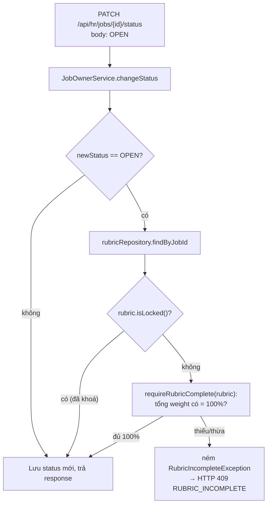
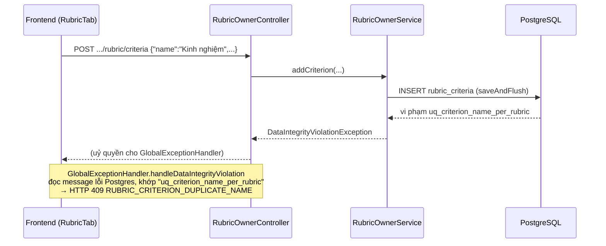

# fix/rubric-guard — Vá lỗ hổng chặn mở tin + map lỗi trùng tên tiêu chí

> Nhánh này không gắn mã FR. Đây là 2 khoản nợ kỹ thuật để lại từ Phase B (rubric — FR-H03),
> được sửa trước khi bước sang Phase D.

## 1. Mục tiêu

Nhánh sửa 2 lỗi độc lập, không liên quan nhau, cả hai đều nằm trong logic rubric của HR:

**Lỗi 1 — lỗ hổng chặn mở tin.** Khi HR mở một tin tuyển dụng (chuyển trạng thái sang `OPEN`),
hệ thống phải đảm bảo rubric chấm điểm đã đủ 100% trọng số, vì AI sẽ dựa vào rubric này để chấm
ngay khi có ứng viên nộp đơn. Trước nhánh này, luật chỉ áp dụng cho hai đường
`DRAFT → OPEN` và `CLOSED → OPEN`; đường `PAUSED → OPEN` (tạm dừng tin rồi mở lại) bị bỏ qua hoàn
toàn, với lý do ghi trong code là "rubric có thể đã bị khoá sau lượt chấm đầu tiên, chặn sẽ kẹt
HR". Lý do đó chỉ đúng khi rubric **đã thật sự bị khoá** — mà một tin chưa từng `OPEN` thì chưa
có lượt chấm nào, nên rubric không thể bị khoá được. Kết quả là HR có thể mở tin dù rubric chỉ
đạt 40-50%, miễn là đi qua đường PAUSED trước.

**Lỗi 2 — lỗi trùng tên tiêu chí trả về 500.** Rubric của một tin tuyển dụng không được có hai
tiêu chí trùng tên (ràng buộc `uq_criterion_name_per_rubric` ở tầng DB). Ràng buộc này đã tồn
tại từ migration đầu tiên, nhưng chưa từng được ánh xạ sang một mã lỗi HTTP có ý nghĩa — vi phạm
nó khiến người dùng nhận lỗi 500 mặc định, không có thông báo tiếng Việt nào giải thích vì sao.

## 2. Các file đã tạo/sửa

Toàn bộ thay đổi nằm ở backend, không có file frontend nào bị đụng tới.

| File | Vai trò |
|---|---|
| `job/JobOwnerService.java` | Sửa điều kiện gọi `requireRubricComplete` trong `changeStatus`; đổi chữ ký `requireRubricComplete` từ nhận `UUID jobId` sang nhận thẳng `Rubric` đã load |
| `rubric/RubricOwnerService.java` | Đổi `criterionRepository.save(...)` thành `saveAndFlush(...)` ở `addCriterion` và `updateCriterion` |
| `common/exception/GlobalExceptionHandler.java` | Thêm nhánh ánh xạ `uq_criterion_name_per_rubric` sang HTTP 409 |
| `test/.../job/JobOwnerIntegrationTest.java` | Viết lại 1 test cũ (đảo ngược kỳ vọng), thêm 1 test mới |
| `test/.../rubric/RubricOwnerIntegrationTest.java` | Thêm 2 test mới |

## 3. Luồng chính

### Luồng — HR đổi trạng thái tin tuyển dụng sang OPEN

Trước đây, nhánh rẽ đầu tiên của sơ đồ trên (`C`) là so sánh `oldStatus` (chỉ chấp nhận
`DRAFT`/`CLOSED`), khiến `PAUSED → OPEN` luôn đi thẳng tới `H` mà bỏ qua toàn bộ phần kiểm tra.
Sau khi sửa, nhánh rẽ dựa vào `newStatus == OPEN` (áp dụng cho mọi trạng thái cũ), rồi mới rẽ
tiếp theo `rubric.isLocked()` — đúng biến thực sự quyết định "HR còn sửa được rubric hay không".

Vì `changeStatus` giờ luôn cần load `Rubric` khi `newStatus == OPEN`, phương thức riêng
`requireRubricComplete` được đổi từ nhận `UUID jobId` (rồi tự query lại) sang nhận thẳng đối
tượng `Rubric` đã có sẵn — tránh gọi `findByJobId` hai lần trong cùng một request.

### Luồng — HR thêm hoặc sửa tên tiêu chí trùng với tiêu chí khác trong cùng rubric

Điểm quan trọng dễ bị bỏ sót: `RubricOwnerService` không hề tự kiểm tra trùng tên trước khi
insert (không có bước "SELECT tên đã tồn tại chưa"). Toàn bộ việc phát hiện trùng tên dựa vào
ràng buộc UNIQUE của Postgres, sau đó `GlobalExceptionHandler` "dịch" lỗi kỹ thuật đó thành lỗi
người dùng hiểu được. Cách này tránh được race condition (hai request thêm cùng lúc một tên),
nhưng bắt buộc câu lệnh `INSERT`/`UPDATE` phải thực thi thật ngay trong phạm vi request — đây là
lý do phải đổi `save()` thành `saveAndFlush()` (xem mục 4).

## 4. Quyết định thiết kế

**Điều kiện guard dựa vào `rubric.isLocked()`, không dựa vào `oldStatus`**
· Lựa chọn khác: giữ nguyên cách cũ nhưng thêm `PAUSED` vào danh sách trạng thái được kiểm
(`oldStatus == DRAFT || oldStatus == CLOSED || oldStatus == PAUSED`)
· Vì sao: thêm `PAUSED` vào danh sách là vá đúng triệu chứng nhưng sai gốc — lý do bỏ qua
`PAUSED → OPEN` ban đầu (rubric có thể đã khoá) là một lý do *đúng về nguyên tắc*, chỉ sai ở chỗ
áp dụng nhầm điều kiện (dùng trạng thái cũ của job thay vì trạng thái khoá thật của rubric). Kiểm
tra thẳng `is_locked` giải quyết đúng vấn đề cho mọi trạng thái cũ, kể cả các trạng thái tương lai
nếu vòng đời job có thêm nhánh mới.

**Mở rộng `saveAndFlush` sang cả `updateCriterion`, không chỉ `addCriterion`**
· Lựa chọn khác: chỉ sửa `addCriterion` như yêu cầu ban đầu mô tả (test case gốc chỉ nói "tạo 2
tiêu chí trùng tên")
· Vì sao: ràng buộc `uq_criterion_name_per_rubric` áp dụng cho toàn bảng `rubric_criteria`, không
phân biệt insert hay update — đổi tên một tiêu chí trùng tên tiêu chí khác cùng rubric vi phạm
đúng constraint đó. Sửa một nửa sẽ để lại một đường vẫn rơi về lỗi 500 với cùng nguyên nhân gốc.
Quyết định này được hỏi và xác nhận trực tiếp với người dùng trước khi code.

**Không viết custom exception (kiểu `RubricLockedException`), xử lý thẳng trong
`GlobalExceptionHandler.handleDataIntegrityViolation`**
· Lựa chọn khác: bắt exception ở tầng service (`RubricOwnerService`), ném ra một exception nghiệp
vụ riêng như các lỗi khác trong cùng file (`RubricLockedException`, `RubricWeightExceededException`)
· Vì sao: hai constraint khác đã tồn tại trước đó (`uq_company_per_owner`,
`uq_application_per_cycle`) đều được xử lý trực tiếp bằng cách so khớp chuỗi trong
`handleDataIntegrityViolation`, không qua exception nghiệp vụ riêng — lý do chung của cả ba
trường hợp là để service **không** phải tự `SELECT` kiểm tra tồn tại trước khi ghi (tránh race
condition khi hai request cùng lúc dùng chung một tên/giá trị). Theo đúng khuôn mẫu đã có sẵn
thay vì tạo thêm một cách xử lý khác cho cùng một loại vấn đề.

**Viết lại test cũ `pauseThenReopen_withRubricBelowFullWeight_stillSucceeds` thay vì giữ nguyên
và thêm test song song**
· Lựa chọn khác: giữ nguyên test cũ (coi là đặc tả hành vi legacy), chỉ thêm test mới mô tả hành
vi đúng
· Vì sao: test cũ không mô tả một hành vi hợp lệ khác cần giữ lại — nó **mã hoá chính lỗ hổng**
đang được vá (xoá bớt tiêu chí khi tin đang `PAUSED` rồi mở lại thành công dù rubric chưa đủ
100%). Giữ nguyên test đó sẽ khiến bộ test đỏ ngay sau khi sửa `JobOwnerService`, và không có
cách nào "giữ cả hai" vì hai kỳ vọng loại trừ lẫn nhau trên cùng một kịch bản. Test thay thế
(`..._isBlocked`) mô tả đúng hành vi mới, còn hành vi "rubric đã khoá thì vẫn cho qua" được tách
thành một test riêng (`pauseThenReopen_withLockedRubricBelowFullWeight_stillSucceeds`) để không
gộp hai biến cần kiểm (trạng thái khoá và trạng thái hoàn chỉnh) vào một kịch bản.

## 5. Ràng buộc SRS đã thực thi

| FR / quy ước | Ràng buộc | Thực thi ở đâu |
|---|---|---|
| FR-H03 (kế thừa từ Phase B) | Rubric phải đủ 100% trọng số trước khi tin được mở cho ứng viên nộp | `JobOwnerService.changeStatus` gọi `requireRubricComplete` khi `newStatus == OPEN`, áp dụng cho mọi trạng thái cũ |
| Thiết kế `is_locked` (`V1__init_schema.sql`) | Rubric đã có lượt chấm đầu tiên thì không sửa được nữa, kể cả gián tiếp qua việc chặn mở lại tin | `JobOwnerService.changeStatus` bỏ qua `requireRubricComplete` khi `rubric.isLocked() == true` |
| Ràng buộc DB `uq_criterion_name_per_rubric` | Không được có 2 tiêu chí trùng tên trong cùng rubric | `GlobalExceptionHandler.handleDataIntegrityViolation`, nhánh khớp chuỗi `uq_criterion_name_per_rubric` |
| CLAUDE.md mục 7 | Không đổi `ddl-auto`, không viết migration nếu ràng buộc đã tồn tại sẵn | Cả `is_locked` và `uq_criterion_name_per_rubric` đã có từ `V1__init_schema.sql` — nhánh này không tạo file `V2__`/`V3__` mới |
| CLAUDE.md mục 7 | Không tạo cột/field `verdict`/`label`/`isQualified`/`passed` | Đã soát bằng skill `srs-guard` trước khi viết tài liệu này — không có vi phạm (chi tiết ở mục 6) |
| Ranh giới `ai/` | `ai/` không được đụng `scoring/ScoreAggregator` | Nhánh này không chạm tới package `ai/` hay `scoring/` — cả hai lỗi đều thuộc riêng `job/` và `rubric/` |

## 6. Đã kiểm thử gì

**Đã test tự động:**
- `JobOwnerIntegrationTest`: 13/13 pass, gồm 2 test mới (`pauseThenReopen_withRubricBelowFullWeight_isBlocked`,
  `pauseThenReopen_withLockedRubricBelowFullWeight_stillSucceeds`) và các test cũ liên quan
  (`reopenClosedJob_incrementsRecruitmentCycle`, `pauseThenReopen_doesNotIncrementRecruitmentCycle`,
  `reopenClosedJob_withRubricBelowFullWeight_isBlocked`) — xác nhận đường `CLOSED → OPEN` và số đếm
  `recruitmentCycle` không bị ảnh hưởng bởi thay đổi.
- `RubricOwnerIntegrationTest`: 10/10 pass, gồm 2 test mới
  (`addCriterion_withDuplicateNameInSameRubric_returnsConflict`,
  `updateCriterion_renamingToExistingSiblingName_returnsConflict`).
- Toàn bộ 76 test của backend (`mvnw test`, không giới hạn file) — pass hết, không có test nào
  của các module khác (auth, company, job công khai, application, resume...) bị ảnh hưởng.
- Skill `srs-guard` — soát 8 nguyên tắc bắt buộc trên toàn repo, không phát hiện vi phạm. Hai
  nguyên tắc liên quan trực tiếp nhất (không hard delete, không tạo cột `verdict`/`isQualified`)
  đã kiểm riêng và sạch.

**Đã test tay** (qua `npm run dev`, tài khoản HR, trên frontend thật — không chỉ gọi API trần):
- Thêm 2 tiêu chí trùng tên trong cùng rubric → giao diện hiện đúng thông báo tiếng Việt
  "Tên tiêu chí này đã tồn tại trong rubric", không phải lỗi 500 hay ô trống. `RubricTab.tsx` đọc
  được mã lỗi mới `RUBRIC_CRITERION_DUPLICATE_NAME` mà không cần sửa gì ở frontend — xác nhận
  cách xử lý lỗi chung (đọc `ErrorResponse.message`) ở frontend đã đủ tổng quát cho mã lỗi mới.
- Mở tin `DRAFT` với rubric mới đạt 60% → bị chặn đúng như trước khi sửa, thông báo nêu rõ
  "tổng trọng số rubric hiện là 60.00%, cần đúng 100%"; tab Rubric cũng cảnh báo sẵn "Còn thiếu
  40% mới mở tin được". Đây là đường `DRAFT → OPEN` vốn đã đúng từ Phase B — xác nhận nhánh này
  không phá hành vi cũ.

**Chưa test:**
- **Chưa test tay** đường `PAUSED → OPEN` bị chặn khi rubric dưới 100% — đây chính là lỗ hổng mà
  nhánh này vá. Hành vi này hiện chỉ được xác nhận qua test tích hợp tự động
  (`pauseThenReopen_withRubricBelowFullWeight_isBlocked`), chưa được thao tác tay qua giao diện
  thật để xem thông báo lỗi hiển thị đúng ngữ cảnh (tab Rubric, nút đổi trạng thái) hay không.
- Chưa test tay trường hợp rubric đã khoá (`is_locked = true`) — vì hiện tại **không có đường nào
  trong ứng dụng thật (kể cả qua UI) đặt được `is_locked = true`**; toàn bộ 2 test liên quan tới
  khoá rubric (`pauseThenReopen_withLockedRubricBelowFullWeight_stillSucceeds` và
  `lockedRubric_rejectsCriterionMutation` có sẵn từ trước) đều phải set cờ này trực tiếp qua
  `rubricRepository` trong test, không qua API. Xem thêm mục 7.

## 7. Nợ kỹ thuật

- **Không có cơ chế nào trong hệ thống thật sự đặt `is_locked = true`.** Cột này được thiết kế để
  tự động khoá "ngay khi có lượt chấm đầu tiên" (theo comment trong `V1__init_schema.sql` và
  `RubricOwnerService.requireNotLocked`), nhưng vì package `ai/`/`scoring/` (Phase D) chưa được
  triển khai, chưa có nơi nào trong code gọi `rubric.setLocked(true)` ngoài test. Nghĩa là điều
  kiện `!rubric.isLocked()` mà nhánh này thêm vào **hiện tại luôn đúng** trong thực tế sử dụng —
  guard mới hoạt động y hệt như "luôn kiểm đủ 100% ở mọi đường vào OPEN" cho tới khi Phase D nối
  dây phần khoá tự động. Đây không phải lỗi của nhánh này, nhưng cần nhớ khi làm Phase D: phải
  thêm đúng chỗ gọi `setLocked(true)` (rất có thể trong service tạo `scoring_runs` đầu tiên) thì
  guard mới thật sự có hai nhánh hành vi khác nhau.
- Cách ánh xạ lỗi trong `GlobalExceptionHandler.handleDataIntegrityViolation` dựa vào so khớp
  chuỗi con trong message lỗi thô của Postgres (`message.contains("uq_criterion_name_per_rubric")`).
  Đây là khuôn mẫu đã có sẵn từ trước (2 nhánh cũ), không phải nợ mới do nhánh này tạo ra, nhưng
  nợ đó giờ nhân thành 3 chỗ thay vì 2 — nếu sau này đổi driver JDBC hoặc phiên bản Postgres đổi
  định dạng message lỗi, cả 3 nhánh đều có thể âm thầm ngừng khớp và rơi về lỗi 500 mà không có
  cảnh báo biên dịch nào báo trước.
- Chưa có test tích hợp nào xác nhận `updateCriterion` giữ nguyên tên chính nó vẫn thành công sau
  khi đổi từ `save` sang `saveAndFlush` trong trường hợp **không** đổi tên (chỉ có test
  `updateCriterion_excludesOwnOldWeight_soReSavingSameWeightSucceeds` cho trọng số, không có
  test tương đương cho tên) — rủi ro thấp vì `saveAndFlush` chỉ đổi thời điểm INSERT/UPDATE thực
  thi, không đổi logic, nhưng chưa được khẳng định bằng test riêng.
