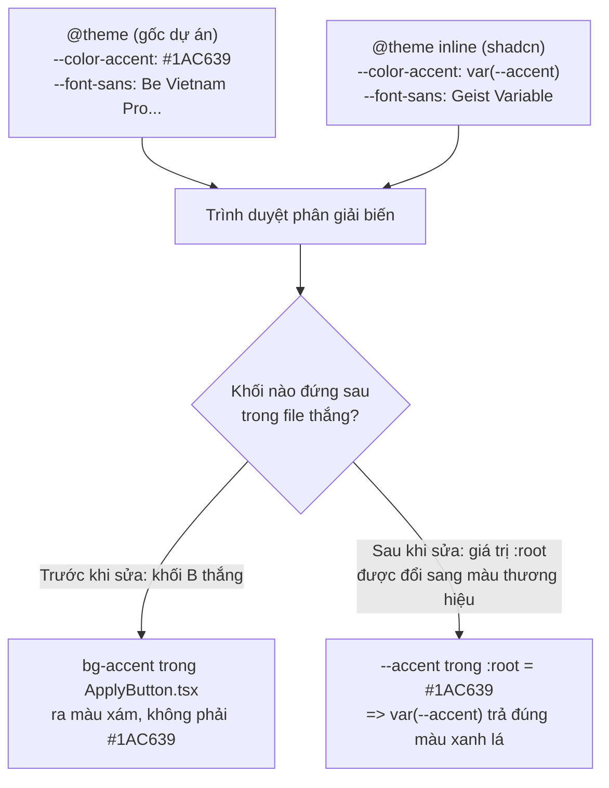

# Walkthrough — chore/shadcn-setup

## 1. Mục tiêu

Nhánh này không triển khai một mã FR nào. Đây là việc hạ tầng: cài thư viện component
shadcn/ui vào frontend để Phase B (CRUD tin tuyển dụng, form rubric nhiều bước, bảng ứng viên,
dialog xác nhận...) có sẵn Button, Input, Label, Card, Table, Dialog, Select, Tabs thay vì
phải tự viết từ đầu. Ràng buộc quan trọng nhất là **không được đổi giao diện hiện tại**:
các trang `/`, `/jobs/:id`, `/login`, `/register` của FR-C01/FR-C02 phải trông y hệt như
trước khi cài, và 12 biến màu thương hiệu (`--color-brand`, `--color-accent`,
`--color-ink`, `--color-line`, `--color-surface`, `--color-canvas`...) trong
`src/index.css` không được mất.

## 2. Các file đã tạo/sửa

### Frontend — cấu hình

| File | Vai trò |
|---|---|
| `frontend/components.json` | File cấu hình của CLI shadcn — khai báo style (`radix-nova`), màu nền (`neutral`), và alias import (`@/components`, `@/lib`...). CLI đọc file này mỗi lần chạy `shadcn add`. |
| `frontend/tsconfig.json`, `frontend/tsconfig.app.json` | Khai báo alias `@/*` trỏ vào `src/*`, để cả TypeScript lẫn shadcn CLI hiểu `@/components/ui/button` là gì. |
| `frontend/vite.config.ts` | Khai báo alias `@` tương ứng ở tầng bundler (Vite), nếu không có thì TypeScript biên dịch qua nhưng lúc chạy dev server sẽ không tìm thấy module. |
| `frontend/eslint.config.js` | Thêm một khối cấu hình riêng cho `src/components/ui/**`, tắt rule `react-refresh/only-export-components` vì code do CLI sinh ra vi phạm rule này (xuất cả component lẫn hàm biến thể `buttonVariants` trong cùng một file). |
| `frontend/package.json`, `package-lock.json` | Thêm dependency: `radix-ui`, `class-variance-authority`, `clsx`, `tailwind-merge`, `tw-animate-css`, và devDependency `shadcn` (bản thân CLI). |

### Frontend — component sinh tự động

| File | Vai trò |
|---|---|
| `src/components/ui/button.tsx`, `input.tsx`, `label.tsx`, `card.tsx`, `table.tsx`, `dialog.tsx`, `select.tsx`, `tabs.tsx` | 8 component UI do CLI shadcn sinh ra, dựng trên thư viện headless `radix-ui`. Đây là code sinh tự động, không sửa tay. |
| `src/lib/utils.ts` | Hàm tiện ích `cn()` — gộp class Tailwind và loại bỏ xung đột (ví dụ `px-2` với `px-4` truyền cùng lúc), mọi component ui/ đều gọi hàm này. |
| `src/index.css` | File token màu/theme trung tâm. Đây là file bị ảnh hưởng nhiều nhất, xem chi tiết ở mục 3 và 4. |

### Tài liệu

| File | Vai trò |
|---|---|
| `CLAUDE.md` | Cập nhật mục Stack (shadcn đã cài, không còn "chưa cài") và mục "Bẫy môi trường đã gặp" (ghi lại 2 lần bị Preset Nova đè token, và việc shell Claude Code reset thư mục làm việc sau mỗi lệnh). |
| `docs/ROADMAP.md` | Tick hoàn thành dòng `chore/shadcn-setup` trong Phase A. |

Không có file backend nào bị đụng tới — nhánh này thuần frontend tooling.

## 3. Luồng chính

Nhánh này không có luồng request/response (không có API nào được gọi). "Luồng chính" ở đây là
hai thứ: (a) quá trình cài đặt diễn ra theo thứ tự nào, và (b) cơ chế phân giải biến CSS khi một
component ui/ được render — đây là chỗ đã phát sinh lỗi và cần hiểu rõ để tránh lặp lại.

### 3a. Trình tự cài đặt (4 commit trên nhánh)

1. `9fb3d2e` — thêm alias `@/*` vào `tsconfig.json`, `tsconfig.app.json`, `vite.config.ts`.
   Làm bước này trước vì CLI shadcn bắt buộc phải có alias mới chạy được, và báo lỗi
   "Could not find valid path aliases" nếu thiếu.
2. `5342723` — chạy `npx shadcn@latest init` (chạy thủ công trong terminal có TTY, không qua
   Claude Code vì shell của Claude Code không nhận input tương tác). CLI ghi đè
   `src/index.css`, tạo `components.json`, `src/lib/utils.ts`. Cùng commit này khôi phục
   lại 2 biến bị đè (xem mục 3b).
3. `73663e7` — chạy `npx shadcn@latest add button input label card table dialog select tabs`,
   sinh ra 8 file trong `src/components/ui/`.
4. `17ac53c` — cập nhật tài liệu.

### 3b. Cơ chế phân giải biến CSS (chỗ phát sinh bug)

Dự án đặt token thương hiệu trong một khối `@theme { ... }` ở đầu file. CLI shadcn, khi init,
thêm một khối thứ hai — `@theme inline { ... }` — nằm **sau** khối gốc trong cùng file
`src/index.css`. Hai khối này định nghĩa biến theo tên trùng nhau ở một số chỗ
(`--font-sans`, `--color-accent`). Trong CSS, khối định nghĩa sau đè khối định nghĩa trước.

Cách đã chọn để sửa: **không xoá khối `@theme inline`** (vì toàn bộ 8 component ui/ mới cài
phụ thuộc vào hệ biến `--primary`, `--accent`, `--ring`... của shadcn), mà sửa giá trị các biến
tương ứng trong khối `:root` — nơi `@theme inline` tham chiếu tới (`var(--accent)` trỏ vào
`:root { --accent: ... }`). Đã áp dụng cho 3 biến: `--primary`, `--primary-foreground`, `--ring`
(đổi sang `#0078C9` — brand), và `--accent`, `--accent-foreground` (đổi sang `#1AC639` — accent).

Khối `.dark { ... }` (theme tối) **chưa** được sửa theo cách tương tự — xem mục 7.

## 4. Quyết định thiết kế

**Đã chọn:** CLI `shadcn@latest` bản mới (v4, có khái niệm "component library": Base UI /
Radix UI / React Aria) với `--base radix` (Radix UI), preset `nova` (mặc định do CLI đề xuất).
**Lựa chọn khác:** Base UI (CLI gắn nhãn "Recommended") hoặc React Aria.
**Vì sao chọn Radix:** hệ sinh thái "shadcn/ui" mà cộng đồng biết tới và phần lớn tài liệu/ví dụ
online tham chiếu tới đều dựng trên Radix UI (Base UI là lựa chọn rất mới của riêng CLI này).
Chọn Radix giúp dễ tra cứu khi cần tuỳ biến Table/Dialog/Select phức tạp ở Phase B.

**Đã chọn:** Giữ nguyên khối `@theme inline` do shadcn sinh ra, chỉ sửa giá trị biến trong
`:root`.
**Lựa chọn khác:** Xoá khối `@theme inline` và tự map thủ công từng class (`bg-primary`,
`text-accent-foreground`...) sang biến của dự án.
**Vì sao chọn cách giữ:** xoá khối đó sẽ làm toàn bộ 8 component ui/ mất theme (chúng dùng thẳng
class như `bg-primary`, `bg-secondary`, không phải class của dự án), phải sửa tay từng file sinh
tự động — vi phạm chính nguyên tắc "component sinh tự động, không sửa tay". Sửa 5 dòng giá trị
trong `:root` là thay đổi nhỏ nhất giải quyết đúng vấn đề.

**Đã chọn:** Alias `@/*` dùng `fileURLToPath(new URL('./src', import.meta.url))` trong
`vite.config.ts`.
**Lựa chọn khác:** dùng `path.resolve(__dirname, './src')` (cách phổ biến trong tài liệu shadcn).
**Vì sao chọn `fileURLToPath`:** dự án dùng ESM (`"type": "module"` trong `package.json`),
không có `__dirname`; dùng `path.resolve` sẽ cần cài thêm `@types/node` hoặc polyfill, còn
`fileURLToPath` là API chuẩn của Node, không cần thêm dependency.

**Đã chọn:** Chỉ cài đúng 8 component Phase B cần (Button, Input, Label, Card, Table, Dialog,
Select, Tabs).
**Lựa chọn khác:** `npx shadcn add --all` để cài sẵn toàn bộ ~50 component.
**Vì sao:** yêu cầu rõ ràng của người dùng — giảm diện tích code sinh tự động phải theo dõi,
giảm rủi ro xung đột token (mỗi component mới có thể kéo theo biến CSS mới).

**Đã chọn:** Tắt rule `react-refresh/only-export-components` chỉ cho `src/components/ui/**`
bằng một khối cấu hình riêng, thay vì tắt toàn cục.
**Lựa chọn khác:** tắt rule này ở khối cấu hình chính (áp dụng cho mọi file `.tsx`).
**Vì sao:** rule này có ích thật sự cho code tự viết trong `features/` và `pages/` (phát hiện
file vừa export component vừa export hàm khác, gây lỗi Fast Refresh khi dev). Chỉ code sinh tự
động trong `ui/` mới cố tình vi phạm rule này theo đúng convention của shadcn.

## 5. Ràng buộc dự án đã tuân thủ

Nhánh này không đụng tới logic nghiệp vụ nên không có mã FR nào áp dụng trực tiếp. Các ràng buộc
đã tuân thủ ở đây đến từ `CLAUDE.md`, không phải `docs/SRS.md`:

| Ràng buộc | Nguồn | Thực thi ở đâu |
|---|---|---|
| Không mất token thương hiệu khi cài shadcn | Yêu cầu người dùng khi giao việc | `src/index.css` dòng 7–27, khối `@theme` gốc còn nguyên 12 biến |
| Không đổi giao diện các trang FR-C01/FR-C02 đã merge | Yêu cầu người dùng khi giao việc | Không có file nào trong `src/features/`, `src/pages/`, `src/components/layout/` bị sửa trong diff của nhánh |
| Mọi lệnh shell theo cú pháp PowerShell | `CLAUDE.md` mục 8 | Toàn bộ lệnh thực thi trong phiên làm việc |

## 6. Đã kiểm thử gì

**Đã test:**
- `npm run build` (`tsc -b && vite build`) chạy sạch, không lỗi type, alias `@/*` được resolve
  đúng bởi cả TypeScript lẫn Vite.
- `npm run lint` chạy sạch sau khi thêm khối override cho `src/components/ui/**`.
- Đối chiếu thủ công `git diff src/index.css` từng bước để xác nhận khối `@theme` gốc (12 biến),
  khối `.dark`, khối `@layer base` không bị CLI hay các lần sửa sau đó động vào.

**Chưa test:**
- **Chưa mở trình duyệt.** Chưa chạy `npm run dev` và xem bằng mắt các trang `/`, `/jobs/:id`,
  `/login`, `/register` có đổi gì về hiển thị hay không. Suy luận gián tiếp: không có file nào
  trong `features/`/`pages/`/`components/layout/` bị sửa, và 8 component `ui/` mới chưa được
  import ở bất kỳ đâu, nên về lý thuyết giao diện không đổi — nhưng đây là suy luận, chưa phải
  quan sát thực tế.
- **Chưa test 8 component mới trong tình huống thật.** Button, Input, Card, Table, Dialog,
  Select, Tabs tồn tại trong `src/components/ui/` nhưng chưa được dùng ở bất kỳ trang nào, nên
  chưa biết chúng render đúng ý đồ (đúng màu, đúng bo góc theo `--radius-card`) khi ghép vào
  giao diện thật của Phase B hay không.
- **Chưa test dark mode.** Khối `.dark` chưa được đồng bộ màu thương hiệu (xem mục 7); vì hiện
  chưa có công tắc chuyển dark mode trong UI nên chưa phát hiện được bằng cách chạy thử.
- **Chưa test tương tác của Dialog/Select/Tabs** (mở/đóng, điều hướng bàn phím, focus trap) — chỉ
  mới xác nhận code biên dịch được, chưa xác nhận hành vi runtime của Radix UI trong React 19.

## 7. Nợ kỹ thuật

- **Khối `.dark` chưa đồng bộ màu thương hiệu.** Mục 3b/4 mới sửa 5 biến trong `:root`
  (light mode). `.dark { --accent: oklch(0.269 0 0); ... }` vẫn là màu xám gốc của preset Nova.
  Nếu sau này Phase B hoặc Phase F bật dark mode, bug "mất màu accent xanh lá" sẽ tái diễn y hệt
  lần này, chỉ khác là ở theme tối.
- **Cơ chế 2 lớp `@theme` + `@theme inline` là nguồn lỗi tiềm ẩn lâu dài, chưa có cách chặn tự
  động.** Bất kỳ ai sau này thêm một biến `--color-*` mới vào khối `@theme` gốc mà trùng tên với
  danh sách biến của shadcn (`background`, `foreground`, `primary`, `secondary`, `accent`,
  `muted`, `destructive`, `border`, `input`, `ring`, `card`, `popover`, `sidebar`, `chart-1..5`,
  `radius`) sẽ bị đè âm thầm — không có lỗi build, không có cảnh báo lint, chỉ phát hiện được
  bằng mắt khi xem giao diện. Hiện chỉ có ghi chú thủ công trong `CLAUDE.md` mục 8, chưa có test
  hay lint rule nào tự động bắt lỗi này.
- **8 component `ui/` đang không được dùng ở đâu cả.** Rủi ro: khi Phase B thực sự ghép chúng
  vào giao diện, có thể phát hiện thiếu biến thể (variant) mà preset Nova không có sẵn, buộc
  phải sửa tay file sinh tự động — phá vỡ quy ước "code sinh tự động, không sửa tay" đã ghi
  trong `CLAUDE.md`.
- **`package-lock.json` thay đổi rất lớn** (~9500 dòng, do CLI `shadcn` và `radix-ui` kéo theo
  nhiều dependency gián tiếp) — chưa chạy audit bảo mật riêng cho các package mới.
